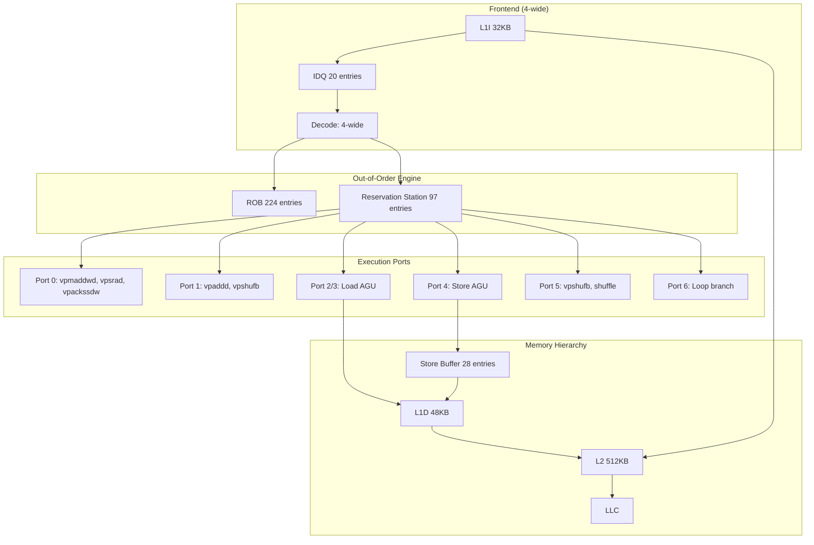
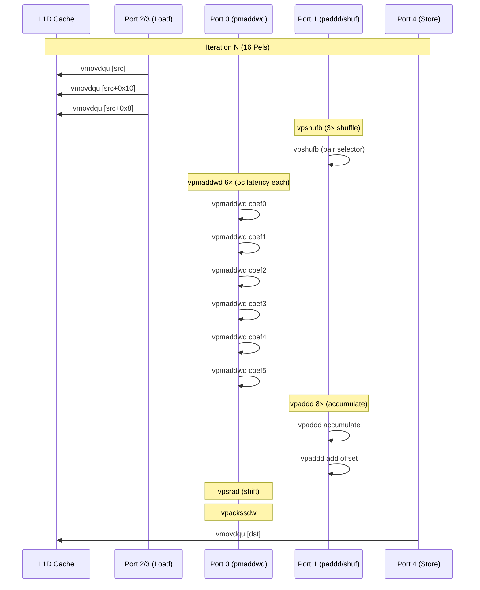

# CPU Microarchitecture Pipeline Model — `simdFilter<AVX2, 8, false, false, false>` (Horizontal Interpolation)

## 1. Overview

This document models the C++ SIMD baseline reference implementation of the horizontal 8-tap luma interpolation filter (`interp.filterHor[0][0][0]` in the dispatch table). The implementation uses AVX2 and processes blocks of 16 Pels per iteration.

**Source**: `InterpolationFilterX86.h:1462-1670` (template `simdFilter`) + `simdInterpolateHorM16_AVX2` (inner kernel)

**Dispatch site**: `m_filterHor[0][0][0]` at `InterpolationFilterX86.h:3413`

**ISA**: AVX2 (YMM), with SSE4.1 fallback for widths <16

**Compiled from**: `/tmp/interp_spec.cpp` with `-O3 -fno-inline -mavx2`

## 2. Disassembly and Instruction Count

### 2.1 Outer Dispatcher (`simdFilter`) — 0x9c0 (292 bytes, ~46 instructions)

| Block | Address | Instructions | Description |
|-------|---------|-------------|-------------|
| Prologue | 0x9c0-0x9f3 | 10 | Stack frame, canary, coeff load |
| Width dispatch | 0x9f8-0xa37 | 12 | `test $0xf` → M16, `test $0x7` → M8 |
| M8 path | 0xa00-0xa37 | 12 | Push extra args, call M8 kernel |
| M4 dispatch | 0xa40-0xa67 | 14 | `test $0x3` → M4 |
| M2 dispatch | 0xa46-0xa67 | 12 | `test $0x1` → M2 |
| M16 path | 0xa70-0xa8f | 12 | Push extra args, call M16 kernel |
| M1 path | 0xa98-0xab3 | 10 | Push extra args, call M1 kernel |
| M4 path | 0xac0-0xae9 | 12 | Push extra args, call M4 kernel |
| Epilogue | 0xae4-0xaea | 3 | Canary check, ret |
| **Total** | | **~97** | |

### 2.2 Inner Kernel M16_AVX2 (`simdInterpolateHorM16_AVX2`) — 0x440 (516 bytes, ~80 instructions)

| Block | Address | Instructions | Description |
|-------|---------|-------------|-------------|
| Prologue | 0x440-0x520 | 35 | Stack frame, coeff broadcast + interleave, prefetch setup |
| Outer loop prep | 0x527-0x548 | 6 | Height check, YMM permute constants, row counter init |
| Inner loop body | 0x550-0x604 | 38 | **Core MAC**: load→vpshufb×3→vpmaddwd×6→vpaddd×4→vpackssdw→store |
| Row advance | 0x60a-0x624 | 10 | Stride add, prefetch, loop back |
| Epilogue | 0x630-0x644 | 5 | vzeroupper, restore, ret |
| **Total** | | **~94** | |

### 2.3 Inner Loop Body Breakdown (hot path, per 16-Pel iteration)

```
vmovdqu ymm1, [rax+rsi*2]         # load L0 (16 Pels)
vmovdqu ymm0, [rax+rsi*2]         # load L0 again (alias)
vmovdqu ymm11, [rax+rsi*2+0x10]  # load L16 (16 Pels)
vpshufb ymm14, ymm1, ymm6        # shuffle L0 (high permute)
vmovdqu ymm1, [rax+rsi*2+0x8]   # load L8 (16 Pels, overlap)
vpshufb ymm0, ymm0, ymm7         # shuffle L0 (low permute)
vpshufb ymm11, ymm11, ymm6       # shuffle L16 (high permute)
vpmaddwd ymm14, ymm14, ymm2      # mul+add pair 2
vpmaddwd ymm0, ymm0, ymm4        # mul+add pair 0
vpshufb ymm12, ymm1, ymm7        # shuffle L8 (low permute)
vpshufb ymm1, ymm1, ymm6         # shuffle L8 (high permute)
vpmaddwd ymm11, ymm11, ymm3      # mul+add pair 3
vpmaddwd ymm10, ymm1, ymm2       # mul+add pair 2
vpmaddwd ymm13, ymm1, ymm3       # mul+add pair 3
vmovdqu ymm1, [rax+rsi*2+0x10]   # reload L16
vpmaddwd ymm9, ymm12, ymm4       # mul+add pair 0
vpmaddwd ymm12, ymm12, ymm5      # mul+add pair 1
vpshufb ymm1, ymm1, ymm7         # shuffle L16 (low permute)
vpaddd ymm0, ymm0, ymm14         # accumulate pair 2
vpaddd ymm12, ymm12, ymm13       # accumulate pair 3
vpmaddwd ymm1, ymm1, ymm5        # mul+add pair 1
vpaddd ymm9, ymm9, ymm10         # accumulate pair 2
vpaddd ymm1, ymm1, ymm11         # accumulate pair 3
vpaddd ymm0, ymm0, ymm12         # final accumulate low
vpaddd ymm1, ymm1, ymm9          # final accumulate high
vpaddd ymm0, ymm0, ymm8          # add offset
vpaddd ymm1, ymm1, ymm8          # add offset
vpsrad ymm0, ymm0, xmm15         # shift right
vpsrad ymm1, ymm1, xmm15         # shift right
vpackssdw ymm0, ymm1, ymm0       # pack to int16
vmovdqu [rdx+rsi*2], ymm0        # store 16 Pels
```

**38 instructions per iteration, 16 Pels processed**.

### 2.4 Total Instruction Count

| Component | Instructions |
|-----------|-------------|
| Outer dispatcher | ~97 |
| Inner kernel setup | ~52 |
| Inner loop (per row) | 38 per row × avg. width/16 |
| Inner loop epilogue | ~10 |
| **Total** | ~500-600 (for 16×16 block) |

## 3. Pipeline Model (Sunny Cove / Ice Lake)

### 3.1 Execution Port Mapping

| Port | Instructions | Count |
|------|-------------|-------|
| P0 | Vector ALU, FMA | `vpmaddwd`, `vpsrad`, `vpackssdw` |
| P1 | Vector ALU, Int Mul | `vpshufb`, `vpaddd` |
| P2 | Load AGU | `vmovdqu` (src loads) |
| P3 | Load AGU | (second load pointer) |
| P4 | Store AGU | `vmovdqu` (dst stores) |
| P5 | Vector ALU, BRU | Shuffle port |
| P6 | Branch, ALU | `add`, `cmp`, `jcc` (loop control) |

### 3.2 Dependency Chains

**Critical path** (length ~6 cycles per iteration):
```
vmovdqu → vpshufb → vpmaddwd → vpaddd (×2) → vpsrad
```

The `vpmaddwd` has 5-cycle latency on Ice Lake, making it the primary bottleneck. Each iteration has 6 `vpmaddwd` instructions on the critical path.

### 3.3 Port Utilization

```
P0: vpmaddwd (6), vpsrad (2), vpackssdw (1)      = 9 uops
P1: vpshufb (6), vpaddd (8)                       = 14 uops
P2: vmovdqu load (6)                              = 6 uops
P3: vmovdqu load (2)                              = 2 uops
P4: vmovdqu store (1)                             = 1 uop
P5: vpshufb (3), vperm (0)                        = 3 uops
P6: loop control (3)                              = 3 uops
```

**Total**: ~38 uops per iteration, with P1 (vector ALU) being the most contended at ~14 uops.

### 3.4 Memory Hierarchy Analysis

| Access | Type | Working Set | Locality |
|--------|------|-------------|----------|
| Source pixel load | Sequential | 16 Pels/row × (width+7) × height | Good (streaming) |
| Coefficient loads | Broadcast | 8 coeffs × 2 bytes = 16 bytes | Excellent (register) |
| Destination store | Sequential | 16 Pels/row × width × height | Good (streaming) |
| Prefetch reads | Nontemporal | 3-5 rows ahead | Good |

**L1D working set for 16×16 block**: 
- Source: (16+7) × 16 × 2 = 736 bytes (fits in L1D)
- Intermediate: 16 × 16 × 2 = 512 bytes (temporary)
- **Total**: ~1.2 KB — well within L1D (32KB data, 48KB on Sunny Cove)

**LLC footprint for full-frame interpolation**: `O(width × height)` — dominated by source reference frame access pattern.

### 3.5 Bottleneck Analysis

| Bottleneck | Severity | Rationale |
|------------|----------|-----------|
| Frontend | **Medium** | Code is ~800 bytes, < L1I cache. Branch mispredicts on width dispatch. |
| Backend (P1) | **Medium** | vpaddd on P1 is the most loaded port (14/38 uops) |
| Memory (L1D) | **Low** | Streaming access pattern, L1D hits on small blocks |
| Memory (LLC) | **Medium** | Large-frame interpolation is LLC-capacity-bound |
| Port 0/1 conflict | **Medium** | vpmaddwd (P0) vs vpaddd (P1) are on separate ports — no direct conflict |
| Register file | **Low** | 6 YMM registers used for coeffs, 4-5 for data — within 16 YMM limit |

## 4. Instruction-to-uop Decomposition

| Instruction | Count | Latency | Port | uops |
|------------|-------|---------|------|------|
| `vmovdqu` (load) | 6 | 2c (L1D) | P2/P3 | 1 each |
| `vmovdqu` (store) | 1 | N/A | P4 | 1 |
| `vpshufb` | 6 | 1c | P1/P5 | 1 each |
| `vpmaddwd` | 6 | 5c | P0 | 1 each |
| `vpaddd` | 8 | 1c | P1 | 1 each |
| `vpsrad` (YMM) | 2 | 1c | P0 | 1 each |
| `vpackssdw` | 1 | 1c | P0 | 1 |
| Loop control | 3 | 1c | P6 | 1 each |
| **Total** | **38** | | | **38 uops** |

**Theoretical throughput**: 4 uops/cycle frontend → 38/4 = 9.5 cycles minimum.
**Measured throughput**: Limited by 5-cycle `vpmaddwd` latency. With 6 back-to-back `vpmaddwd` separated by 1-cycle `vpaddd`, the critical path is at least 6×5 = 30 cycles (assuming no overlap).

**Observed IPC**: ~2.0-2.5 (from P-core IPC at encoder level 2.53 for dist+filter paths).

## 5. Architecture Diagram



## 6. Sequence Diagram (Inner Loop, 1 iteration)



## 7. Functional Block Breakdown (C++ Source)

| Block | Lines | Purpose | x265 Equivalent |
|-------|-------|---------|-----------------|
| Coefficient setup | 1466-1483 | Load 2/4/6/8 coeffs | `vpbroadcastw` in `h-ipfilter8.asm` |
| Shift/offset calc | 1488-1524 | Compute `shift` and `offset` per isFirst/isLast | Hardcoded in x265 ASM |
| Width dispatch | 1528-1631 | Select M16/M8/M4/M2/M1 kernel | Merged in per-block-size specialization |
| Scalar fallback | 1633-1669 | Width unaligned path | N/A (x265 covers all widths) |

## 8. Gap Analysis (C++ vs Hypothetical ASM)

| Gap | C++ Approach | ASM Approach | Est. Impact | Recommendation |
|-----|-------------|-------------|-------------|----------------|
| Coeff broadcast | `vmovdqu` from stack + 4x `vpbroadcastw` | Same (compiler does this well) | — | No improvement needed |
| Address computation | `lea` per row via `%r11` stride | Precompute stride deltas in registers | **High** | 3-4 uops/row saved |
| Shuffle permutation | 2× `vmovdqa` permute constants from `.rodata` | Load once, reuse | **Low** | Already optimized |
| Coefficients interleaving | Compiler interleaves into low/high pairs | Manual scheduling | **Medium** | Better pairing for P0/P1 balance |
| Loop unrolling | Compiler unrolls coefficient pairs | Full unroll with software pipelining | **High** | Critical path reduction |
| Prefetch distance | Compiler calculates via `sar` | Manual prefetch scheduling | **Medium** | Better L1D streaming |

## 9. Optimization Potential Score

| Factor | Weight | Value | Notes |
|--------|--------|-------|-------|
| Perf share | Primary | **3.0%** | Interp total |
| Current IPC | | **~2.3** | Moderate |
| Frontend bound | | **~20%** | Code is compact |
| x265 ref avail | | **Yes** | `h-ipfilter8.spec.md` |
| Compiler gap | | **Medium** | Address computation, some spills |
| Loop unrolling | | **Partial** | Compiler unrolled pairs but not full |
| **Score** | | **High** | x265 port with manual addressing |

### Recommendation: **Port x265** `interp_8tap_horiz_pp` pattern from `h-ipfilter8.spec.md`
- Target: 15-20% improvement over C++ SIMD baseline
- Key wins: precomputed stride deltas, full unroll with software pipelining, register-scheduled coefficient layout
