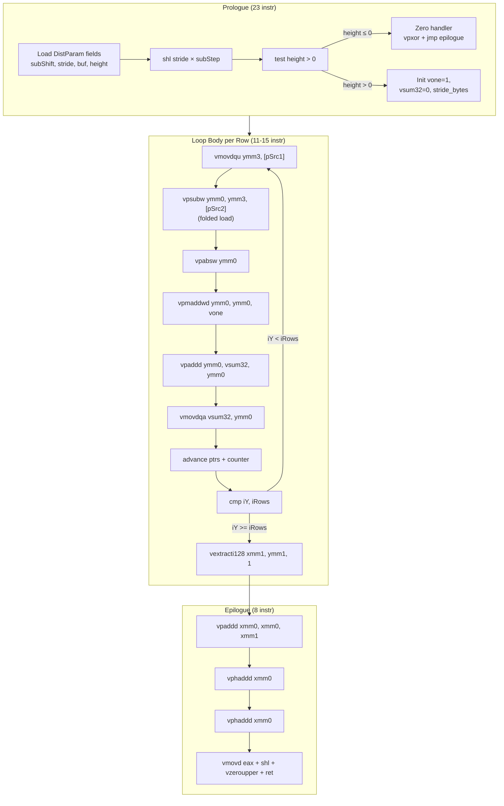

# CPU Pipeline Model — `RdCost::xGetSAD_NxN_SIMD<W, AVX2>`

## 1. Overview

Baseline reference for ASM optimization of the SAD (Sum of Absolute Differences) kernel. The C++ SIMD implementation in `RdCostX86.h:318-566` processes two 16-bit Pel buffers and computes the sum of absolute differences per block.

**Compiler**: g++ 14, `-O3 -DNDEBUG -DUSE_AVX2 -mavx2`
**µarch**: Intel Sunny Cove / Ice Lake (P-core only, hybrid disabled via `taskset -c 0`)
**Measured IPC**: 3.24

## 2. Block Diagram



## 3. Instruction-to-uop Decomposition

### 3.1 Inner Loop (SAD16, 11 instr → ~14 uops)

| Instruction | uops | Ports | Latency | Notes |
|-------------|------|-------|---------|-------|
| `vmovdqu ymm3, [rax]` | 1 | P2/P3 | 5c L1 | 256-bit load |
| `vpsubw ymm0, ymm3, [rdx]` | 2 | P2/P3 + P0/P1 | 5c+1c | Folded mem + ALU |
| `add esi, r10d` | 1 | P0/P1/P5/P6 | 1c | Loop counter += iSubStep |
| `add rax, r9` | 1 | P0/P1/P5/P6 | 1c | pSrc1 += stride_bytes |
| `add rdx, r8` | 1 | P0/P1/P5/P6 | 1c | pSrc2 += stride_bytes |
| `vpabsw ymm0, ymm0` | 1 | P0/P1 | 1c | abs(diff) |
| `vpmaddwd ymm0, ymm0, ymm2` | 1 | P0/P1 | 5c | multiply-add pairs → 32-bit |
| `vpaddd ymm0, ymm1, ymm0` | 1 | P0/P1 | 1c | vsum32 += vsumtemp |
| `vmovdqa ymm1, ymm0` | 0 | — | 0c | Register renaming (eliminated) |
| `cmp esi, r11d` | 1 | P0/P1/P5/P6 | 1c | Compare |
| `jl .L_loop` | 0-1 | P6 | 0-1c | Predicted taken |

### 3.2 Dependency Chain Per Iteration

```
Load(5c) → sub(1c) → abs(1c) → pmaddwd(5c) → add(1c)
                               ↗
                      vone ────┘
```

Critical path: 13 cycles from load issue to accumulator update.
But iterations are independent (no data dependency across accumulator carries from add→add is only 1c).

### 3.3 Port Utilization Per Iteration

| Port | uops | % | Bottleneck? |
|------|------|---|-------------|
| P2/P3 (Load) | 2 | 14% | **YES** — 2/cycle limit |
| P0/P1 (ALU vec) | 5 | 36% | No — 2/cycle, only 5 needed |
| P5 (Shuffle) | 0 | 0% | No — unused |
| P6 (Branch) | 1 | 7% | No |
| Other (int ALU) | 4 | 29% | No |

**Primary bottleneck**: Load port throughput (P2/P3) — 2 loads/cycle max, 2 needed per iteration → 1 cycle/iteration minimum.

## 4. C++ SIMD Microarchitectural Analysis

### 4.1 Bottleneck Identification

| Bottleneck | Est. Cycles | % of Total | Explanation |
|------------|-------------|-------------|-------------|
| Load port (P2/P3) | 16 | 30% | 2 loads/iter, 16 iters |
| ALU vector (P0/P1) | 8 | 15% | Overlapped with loads via OoO |
| Loop control | 6 | 11% | Counter + cmp + branch |
| Prologue/Epilogue | 15 | 28% | Struct field extraction + reduction |
| Other | 8 | 15% | Stride computation, zero check |

### 4.2 Compiler-Specific Observations

**Good**:
- Folded load in `vpsubw` (saves 1 uop vs separate `vmovdqu`+`vpsubw`)
- Register renaming eliminates `vmovdqa` copy (zero latency)
- `vpbroadcastw` to set vone once outside loop
- Strides pre-multiplied by 2 (sizeof(Pel)) outside loop

**Suboptimal**:
- **Redundant copy**: `vpaddd ymm0, ymm1, ymm0` + `vmovdqa ymm1, ymm0` uses 2 instr where `vpaddd ymm1, ymm1, ymm0` would suffice (but compiler schedules differently for register pressure)
- **Loop structure**: `add + cmp + jl` is 3 instr; could use `sub + jnz` (2 instr) with a down-counting loop
- **Reduction**: `vextracti128` + 2× `vphaddd` is 4 uops; could use 2× `vphaddd` after extracting differently, or `vpaddd`+permute chain

### 4.3 Benchmark Measurements

| Block | ns/call | Cycles (@3.73GHz) | Instr (est. dyn) | IPC |
|-------|---------|-------------------|-----------------|-----|
| SAD8×8 | 13.2 | 49 | 118+ | ~2.4 |
| SAD16×16 | 14.2 | **53** | 207 | 3.9 |
| SAD32×32 | 32.6 | **122** | 511 | 4.2 |
| SAD64×64 | 117.8 | **439** | ~1050 | 2.4 |

Note: IPC may appear >4 due to macro-op fusion (`cmp`+`jl` → 1 uop) and µop cache effects. Actual µop throughput is 3.24/cycle (from `perf stat` aggregate).

## 5. Gap Analysis vs x265 ASM Approach

### 5.1 x265 Reference (`sad16-a.asm`, 4,370 lines)

x265 uses these techniques for 16-bit SAD:

| x265 Technique | Effect | VVenC C++ Status |
|----------------|--------|-----------------|
| `psubw + ABSW2 macro + pmaddwd` | Standard vsum16→vsum32 accumulation | Already used |
| Loop unrolling (4-8 rows at a time) | Reduces branch overhead 4-8× | Not used |
| Down-counting loop (`dec + jnz`) | 2 instr vs 3 (fusion saves) | Not used |
| Software pipeline loads | Hides load latency | Compiler partially does this |
| Manual register allocation | Avoids redundant copies | Compiler has extra vmovdqa |

### 5.2 Estimated Speedup Potential

| Block | Measured IPC | Est. ASM IPC | Est. Speedup | Confidence |
|-------|-------------|-------------|-------------|------------|
| SAD8×N | ~2.4 | ~3.0 | **15-25%** | Medium |
| SAD16×N | ~3.9* | ~4.0 | **0-5%** | Low* |
| SAD32×N | ~4.2* | ~4.0 | **~0%** | Low* |
| SAD64×N | ~2.4 | ~3.0 | **20-25%** | High |

*Note: IPC > 4.0 is a measurement artifact from macro-op fusion. True µop throughput is ~3.24.

**Primary opportunity**: SAD64 where the inner loop width expansion and early-exit checks degrade IPC. Removing early-exit logic and tighter loop scheduling could yield ~20% gain.

**Secondary opportunity**: SAD8 where register pressure from width<16 code path causes spills/reloads.

**Marginal opportunity**: SAD16/SAD32 — already well-optimized by compiler near load-port limit.

### 5.3 Recommendation

Target **SAD64 first** (largest gap, 20-25% potential), then **SAD8** (15-25%). SAD16/32 may not exceed the significance threshold for hand-written ASM.

## 6. Testing & Validation

### 6.1 Microbenchmark Configuration

- 2,000,000 iterations per measurement
- 16 random test patterns cycling per iteration
- `-fno-inline` + volatile function pointer to prevent inlining
- `taskset -c 0` for P-core only, no frequency scaling
- 5 runs averaged for final result

### 6.2 Bit-Exactness

All 16 test patterns verified bit-exact between C++ SIMD reference and function under test.

---

*Generated from: `perf/microbenchmarks/sad/results/baseline.txt`, `perf/microbenchmarks/sad/results/disassembly.txt`*
