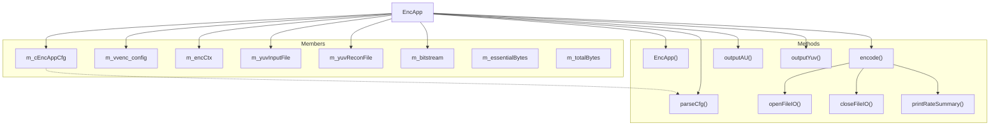
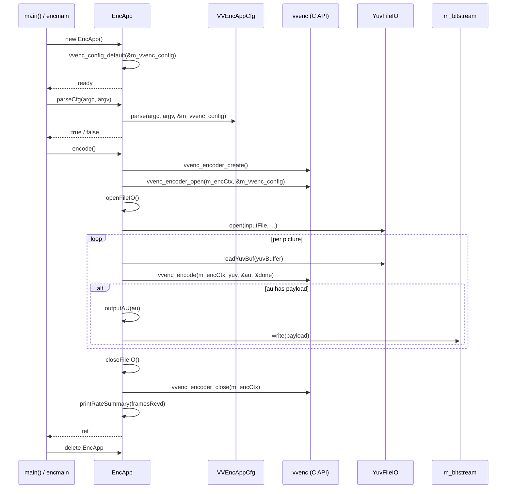

# EncApp — FFmpeg-Style Encoder Application Class

## Overview

`EncApp` is the encoder application class used by the `vvencFFapp` variant. It wraps encoder configuration (`vvenc_config`), application configuration (`VVEncAppCfg`), YUV file I/O (`YuvFileIO`), and bitstream output. Main entry points are `parseCfg()` for CLI argument handling and `encode()` for the encoding loop.

## Class Structure

## Encoding Sequence

## Key Design Decisions

| Decision | Rationale |
|---|---|
| **Separate `parseCfg` + `encode`** | Clean separation of configuration and execution; enables reuse in tests and alternative frontends |
| **`outputAU` returns byte count** | Caller can track bitstream size; `m_essentialBytes` / `m_totalBytes` for rate statistics |
| **`outputYuv` is static** | Matches C callback signature expected by `vvencEncoder` for reconstruction output |
| **`presetChangeCallback`** | Allows `--preset` to reinitialize config via `vvenc_init_preset` at any point during parsing |
