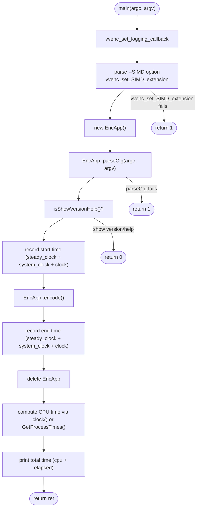
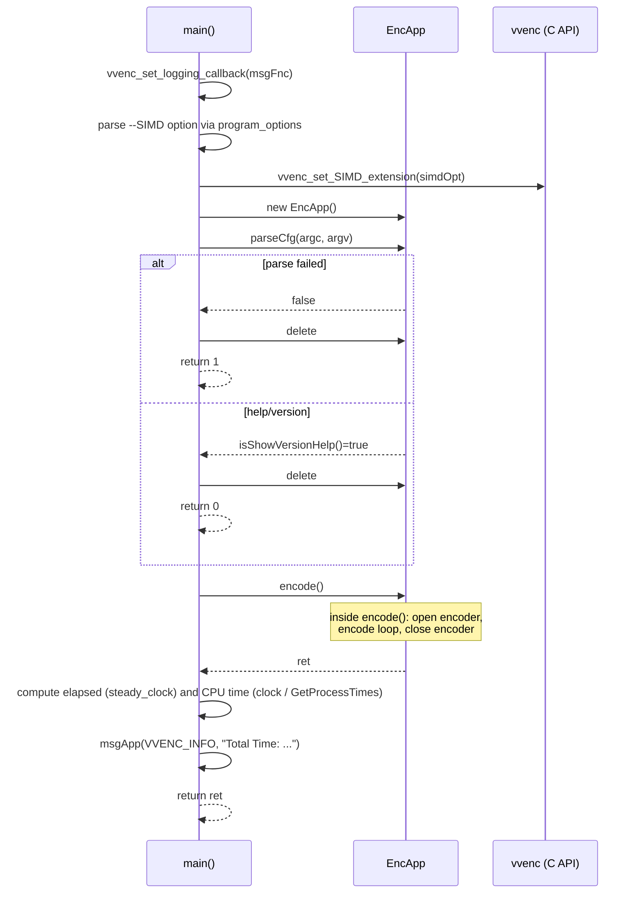

# encmain — FFmpeg-Style Encoder Main Entry Point

## Overview

`encmain.cpp` contains the `main()` function for the `vvencFFapp` variant of the VVenC encoder. It parses SIMD options, creates an `EncApp` instance, delegates to `EncApp::parseCfg()` and `EncApp::encode()`, and reports timing statistics.

## Program Flow

## Sequence Diagram

## Key Responsibilities

| Responsibility | Implementation |
|---|---|
| SIMD extension override | Parses `--SIMD` flag via `program_options::scanArgv` before creating `EncApp` |
| Lifecycle management | Creates and destroys `EncApp`; handles early exit on parse error or `--help`/`--version` |
| CPU time measurement | Uses `clock()` on POSIX (sum of all threads), `GetProcessTimes()` on Windows for accurate per-thread CPU time |
| Elapsed time measurement | `std::chrono::steady_clock` for high-resolution wall-clock timing |
| Logging callback | Registers `msgFnc` as global callback via `vvenc_set_logging_callback` |
