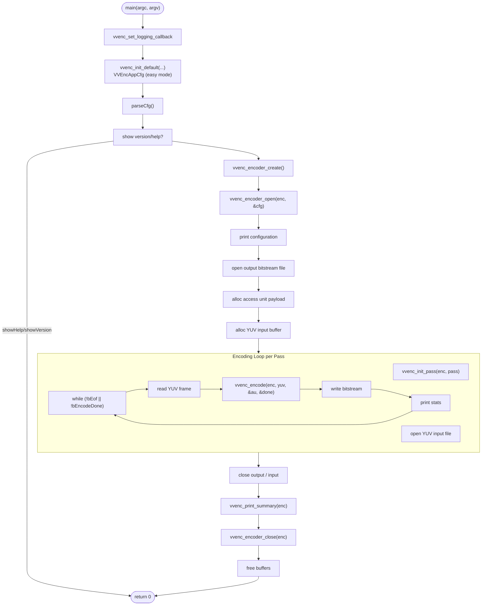
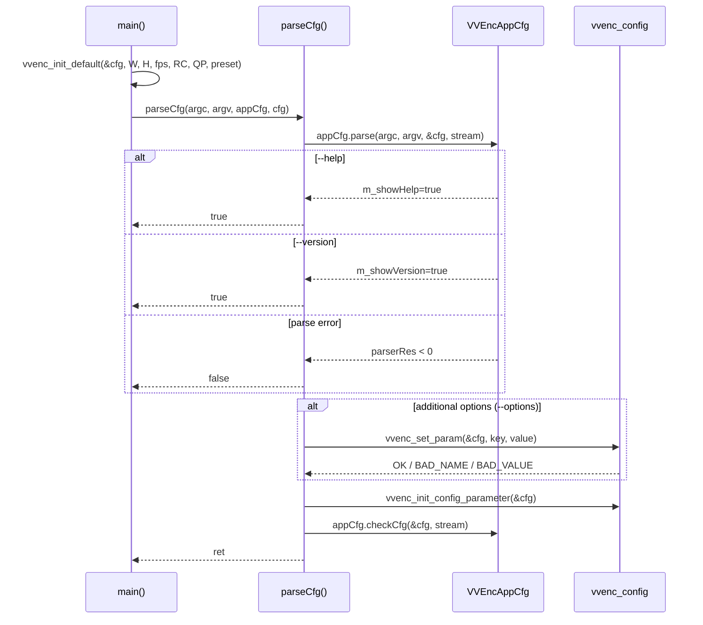

# vvencapp — Standalone CLI Encoder Application

## Overview

`vvencapp` is the standalone command-line encoder application. Its `main()` entry point parses CLI arguments via `parseCfg()`, opens input YUV and output bitstream files, calls the VVenC encoder library loop (`vvenc_encode`), and prints timing statistics.

## Application Flow

## CLI Argument Parsing Sequence

## Key Functions

| Function | Description |
|---|---|
| `main(argc, argv)` | Entry point; orchestrates init → encode loop → cleanup |
| `parseCfg(...)` | Parses CLI args via `VVEncAppCfg::parse()`, handles `--help`/`--version`, applies additional settings |
| `msgFnc(...)` | Global logging callback (va_list) |
| `msgApp(...)` | Convenience wrapper for `msgFnc` |
| `printVVEncErrorMsg(...)` | Format and print VVenC error codes |
| `changePreset(...)` | Callback for preset mode changes |
