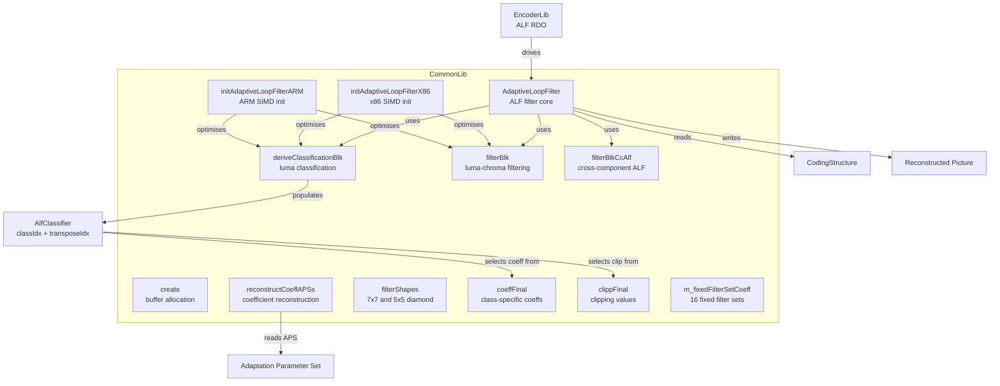
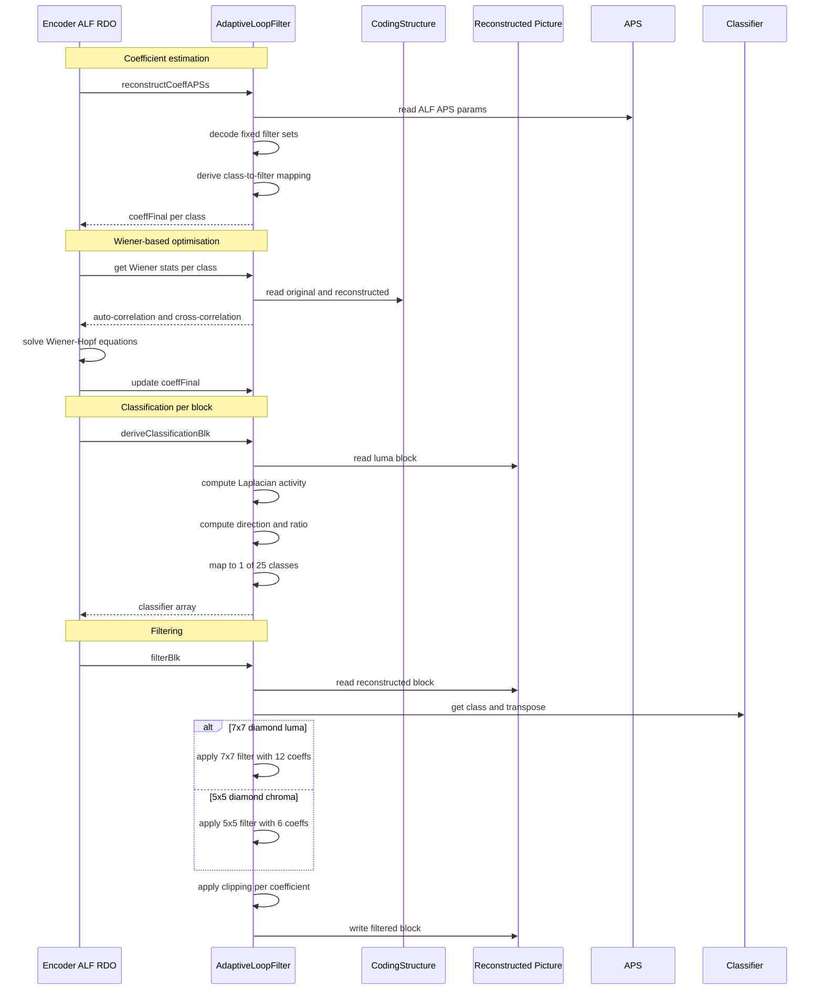
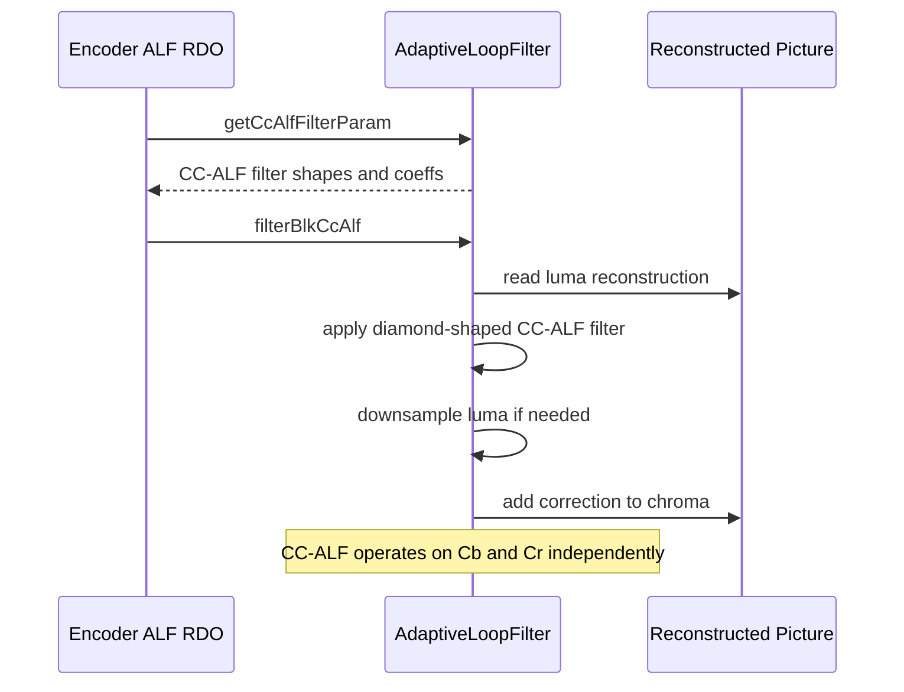

# AdaptiveLoopFilter — ALF In-Loop Filter

## 1. Overview

The `AdaptiveLoopFilter` class implements the adaptive loop filter for VVC. ALF applies Wiener-based adaptive filtering to reconstructed samples to minimise mean-square error between reconstructed and original frames. It provides luma classification with up to 25 classes, 7x7 and 5x5 diamond filter shapes, chroma filtering with up to 8 alternatives, and cross-component ALF (CC-ALF) for chroma refinement using luma samples.

**Dependencies**: `CommonDef.h`, `Unit.h`, `UnitTools.h`, SIMD backend headers.

**Lifecycle**: One `AdaptiveLoopFilter` instance per encoding session. `create()` must be called after construction. `destroy()` releases buffers. `reconstructCoeffAPSs` and `filterBlk` are called per CTU during the ALF reconstruction pass.

## 2. Component Specifications

### 2.1 Struct: `AlfClassifier`

```cpp
struct AlfClassifier
{
  AlfClassifier();
  AlfClassifier(uint8_t cIdx, uint8_t tIdx);

  uint8_t classIdx;
  uint8_t transposeIdx;
};
```

### 2.2 Enum: `Direction`

```cpp
enum Direction
{
  HOR,
  VER,
  DIAG0,
  DIAG1,
  NUM_DIRECTIONS
};
```

### 2.3 Class: `AdaptiveLoopFilter`

```cpp
class AdaptiveLoopFilter
{
public:
  static int clipALF(const int clip, const short ref,
    const short val0, const short val1);
  static int clipALF(const int clip, const int val0, const int val1);

  static constexpr int AlfNumClippingValues      = 4;
  static constexpr int MaxAlfNumClippingValues   = 4;
  static constexpr int m_NUM_BITS                = 8;
  static constexpr int m_CLASSIFICATION_BLK_SIZE = 128;
  static constexpr int m_ALF_UNUSED_CLASSIDX     = 255;
  static constexpr int m_ALF_UNUSED_TRANSPOSIDX  = 255;

  AdaptiveLoopFilter(bool enableOpt = true);
  virtual ~AdaptiveLoopFilter();

  void reconstructCoeffAPSs(CodingStructure& cs,
    bool luma, bool chroma, bool isRdo);
  void reconstructCoeffFixedAPSs(CodingStructure& cs,
    bool luma, bool chroma, bool isRdo);
  void reconstructCoeff(AlfParam& alfParam, ChannelType channel,
    const bool isRdo, const bool isRedo = false);
  void create(const int picWidth, const int picHeight,
    const ChromaFormat format, const int maxCUWidth,
    const int maxCUHeight, const int inputBitDepth[MAX_NUM_CH]);
  void destroy();

  static void deriveClassificationBlk(AlfClassifier* classifier,
    const CPelBuf& srcLuma, const Area& blkDst, const Area& blk,
    const int shift, const int vbCTUHeight, int vbPos);
  void deriveClassification(AlfClassifier* classifier,
    const CPelBuf& srcLuma, const Area& blkDst, const Area& blk);

  template<AlfFilterType filtTypeCcAlf>
  static void filterBlkCcAlf(const PelBuf& dstBuf,
    const CPelUnitBuf& recSrc, const Area& blkDst, const Area& blkSrc,
    const ComponentID compId, const int16_t* filterCoeff,
    const ClpRngs& clpRngs, CodingStructure& cs,
    int vbCTUHeight, int vbPos);

  template<AlfFilterType filtType>
  static void filterBlk(const AlfClassifier* classifier,
    const PelUnitBuf& recDst, const CPelUnitBuf& recSrc,
    const Area& blkDst, const Area& blk, const ComponentID compId,
    const short* filterSet, const short* fClipSet,
    const ClpRng& clpRng, const CodingStructure& cs,
    const int vbCTUHeight, int vbPos);

  void (*m_deriveClassificationBlk)(AlfClassifier* classifier,
    const CPelBuf& srcLuma, const Area& blkDst, const Area& blk,
    const int shift, const int vbCTUHeight, int vbPos);
  void (*m_filterCcAlf)(const PelBuf& dstBuf,
    const CPelUnitBuf& recSrc, const Area& blkDst, const Area& blkSrc,
    const ComponentID compId, const int16_t* filterCoeff,
    const ClpRngs& clpRngs, CodingStructure& cs,
    int vbCTUHeight, int vbPos);

  CcAlfFilterParam& getCcAlfFilterParam();
  uint8_t* getCcAlfControlIdc(const ComponentID compID);

  void (*m_filter5x5Blk[2])(const AlfClassifier* classifier,
    const PelUnitBuf& recDst, const CPelUnitBuf& recSrc,
    const Area& blkDst, const Area& blk, const ComponentID compId,
    const short* filterSet, const short* fClipSet,
    const ClpRng& clpRng, const CodingStructure& cs,
    const int vbCTUHeight, int vbPos);
  void (*m_filter7x7Blk[2])(const AlfClassifier* classifier,
    const PelUnitBuf& recDst, const CPelUnitBuf& recSrc,
    const Area& blkDst, const Area& blk, const ComponentID compId,
    const short* filterSet, const short* fClipSet,
    const ClpRng& clpRng, const CodingStructure& cs,
    const int vbCTUHeight, int vbPos);

  void initAdaptiveLoopFilterX86();
  void initAdaptiveLoopFilterARM();

protected:
  bool isCrossedByVirtualBoundaries(const CodingStructure& cs,
    const int xPos, const int yPos, const int width, const int height,
    bool& clipTop, bool& clipBottom, bool& clipLeft, bool& clipRight,
    int& numHorVirBndry, int& numVerVirBndry,
    int horVirBndryPos[], int verVirBndryPos[],
    int& rasterSliceAlfPad);

  static const int m_classToFilterMapping[NUM_FIXED_FILTER_SETS][MAX_NUM_ALF_CLASSES];
  short m_fixedFilterSetCoeffDec[NUM_FIXED_FILTER_SETS][MAX_NUM_ALF_CLASSES * MAX_NUM_ALF_LUMA_COEFF];
  short m_coeffApsLuma[ALF_CTB_MAX_NUM_APS][MAX_NUM_ALF_LUMA_COEFF * MAX_NUM_ALF_CLASSES];
  short m_clippApsLuma[ALF_CTB_MAX_NUM_APS][MAX_NUM_ALF_LUMA_COEFF * MAX_NUM_ALF_CLASSES];
  short m_clipDefault[MAX_NUM_ALF_CLASSES * MAX_NUM_ALF_LUMA_COEFF];
  bool m_created;
  short m_chromaCoeffFinal[VVENC_MAX_NUM_ALF_ALTERNATIVES_CHROMA][MAX_NUM_ALF_LUMA_COEFF];
  AlfParam* m_alfParamChroma;
  Pel m_alfClippingValues[MAX_NUM_CH][MaxAlfNumClippingValues];
  AlfFilterShape m_filterShapesCcAlf[2];
  AlfFilterShape m_filterShapes[MAX_NUM_CH];
  AlfClassifier* m_classifier;
  short m_coeffFinal[MAX_NUM_ALF_CLASSES * MAX_NUM_ALF_LUMA_COEFF];
  short m_clippFinal[MAX_NUM_ALF_CLASSES * MAX_NUM_ALF_LUMA_COEFF];
  short m_chromaClippFinal[VVENC_MAX_NUM_ALF_ALTERNATIVES_CHROMA][MAX_NUM_ALF_LUMA_COEFF];
  short m_coeffApsLumaFixed[ALF_CTB_MAX_NUM_APS][MAX_NUM_ALF_LUMA_COEFF * MAX_NUM_ALF_CLASSES];
  short m_clippApsLumaFixed[ALF_CTB_MAX_NUM_APS][MAX_NUM_ALF_LUMA_COEFF * MAX_NUM_ALF_CLASSES];
  short m_chromaCoeffFinalFixed[VVENC_MAX_NUM_ALF_ALTERNATIVES_CHROMA][MAX_NUM_ALF_LUMA_COEFF];
  short m_chromaClippFinalFixed[VVENC_MAX_NUM_ALF_ALTERNATIVES_CHROMA][MAX_NUM_ALF_LUMA_COEFF];
  uint8_t* m_ctuEnableFlag[MAX_NUM_COMP];
  uint8_t* m_ctuAlternative[MAX_NUM_COMP];
  PelStorage m_tempBuf;
  PelStorage m_tempBuf2;
  int m_inputBitDepth[MAX_NUM_CH];
  int m_picWidth;
  int m_picHeight;
  int m_maxCUWidth;
  int m_maxCUHeight;
  uint32_t m_numCTUsInWidth;
  uint32_t m_numCTUsInHeight;
  uint32_t m_numCTUsInPic;
  int m_alfVBLumaPos;
  int m_alfVBChmaPos;
  int m_alfVBLumaCTUHeight;
  int m_alfVBChmaCTUHeight;
  ChromaFormat m_chromaFormat;

public:
  static constexpr int m_scaleBits = 7;
  CcAlfFilterParam m_ccAlfFilterParam;
  uint8_t* m_ccAlfFilterControl[2];
  static const int m_fixedFilterSetCoeff[ALF_FIXED_FILTER_NUM][MAX_NUM_ALF_LUMA_COEFF];
};
```

### 2.4 Key Method Semantics

| Method | Purpose |
|---|---|
| `create` | Allocate CTU enable/alternative flags, coefficient buffers, classifier buffer |
| `destroy` | Free all allocated buffers |
| `reconstructCoeffAPSs` | Reconstruct ALF coefficients from APS parameters for all slices |
| `reconstructCoeff` | Reconstruct filter coefficients for a single channel type |
| `deriveClassificationBlk` | Compute classIdx and transposeIdx for one luma block via Laplacian activity and direction |
| `deriveClassification` | Iterate blocks to classify an entire CTU |
| `filterBlk` | Apply diamond-shaped ALF filter to one block using class-specific coefficients and clipping values |
| `filterBlkCcAlf` | Apply cross-component ALF: filter luma samples to generate chroma correction |
| `isCrossedByVirtualBoundaries` | Detect virtual boundary crossings for padding decisions |

## 3. System Architecture



## 4. Detailed Data Flow

### 4.1 ALF CTU Processing Lifecycle



### 4.2 CC-ALF Data Flow



## 5. Visualisation

### 5.1 Animation Description

The D3 animation visualises the `AdaptiveLoopFilter` filtering pipeline by stepping through 18 keyframes. Each keyframe updates:

- **AlfClassifierGrid**: A visual grid of ALF class indices (0-24) colour-coded by class, showing the classification of a virtual luma CTU.
- **CoeffHeatmap**: A heatmap of the 7x7 diamond filter coefficients for the active class, with colour intensity proportional to coefficient magnitude.
- **FilterShapeOverlay**: Diamond shape markers distinguishing 7x7 luma from 5x5 chroma filters.
- **CtuEnableMap**: A CTU-level on/off map showing which CTUs in the frame have ALF enabled.
- **OperationFeed**: A scrollable log prepending each operation.

**Controls**: `[data-testid="play-pause"]` button toggles playback. `#replay` resets. Auto-plays on load.

### 5.2 Animation Source

```html
<!DOCTYPE html>
<html lang="en">
<head>
<meta charset="UTF-8">
<meta name="viewport" content="width=device-width, initial-scale=1.0">
<title>AdaptiveLoopFilter — ALF Data Flow Animation</title>
<style>
* { box-sizing: border-box; margin: 0; padding: 0; }
body { font-family: 'Segoe UI', system-ui, sans-serif; background: #1a1a2e; color: #e0e0e0; display: flex; justify-content: center; padding: 20px; }
#app { max-width: 820px; width: 100%; }
h1 { font-size: 1.2rem; margin-bottom: 8px; color: #a0c4ff; }
h1 small { font-weight: normal; font-size: 0.8rem; color: #888; }
#vis { background: #16213e; border-radius: 8px; padding: 16px; position: relative; }
#controls { display: flex; gap: 8px; margin-bottom: 12px; }
#controls button { background: #0f3460; color: #e0e0e0; border: 1px solid #1a5276; padding: 6px 14px; border-radius: 4px; cursor: pointer; font-size: 0.85rem; }
#controls button:hover { background: #1a5276; }
#controls button.active { background: #e94560; border-color: #e94560; }
#alf-panel { display: flex; gap: 16px; flex-wrap: wrap; }
#classifier-grid { background: #0d1b2a; border-radius: 4px; padding: 8px; }
#classifier-grid .grid-container { display: grid; grid-template-columns: repeat(5, 40px); grid-template-rows: repeat(5, 40px); gap: 2px; }
#classifier-grid .grid-container .cell { width: 40px; height: 40px; display: flex; align-items: center; justify-content: center; font-size: 11px; font-family: monospace; border-radius: 3px; }
#coeff-panel { background: #0d1b2a; border-radius: 4px; padding: 8px; min-width: 240px; flex: 1; }
#coeff-heatmap { display: grid; grid-template-columns: repeat(7, 30px); grid-template-rows: repeat(7, 30px); gap: 1px; margin: 8px auto; width: fit-content; }
#coeff-heatmap .cell { width: 30px; height: 30px; display: flex; align-items: center; justify-content: center; font-size: 8px; font-family: monospace; border-radius: 2px; }
#coeff-heatmap .cell.masked { visibility: hidden; }
#ctu-map-wrapper { background: #0d1b2a; border-radius: 4px; padding: 8px; margin-top: 8px; }
#ctu-map { display: grid; grid-template-columns: repeat(6, 24px); grid-template-rows: repeat(6, 24px); gap: 1px; }
#ctu-map .ctu-cell { width: 24px; height: 24px; display: flex; align-items: center; justify-content: center; font-size: 8px; border-radius: 2px; }
#info-panel { display: flex; gap: 16px; margin-top: 10px; align-items: center; flex-wrap: wrap; }
#alf-badge { font-size: 0.8rem; padding: 4px 10px; border-radius: 12px; background: #0f3460; border: 1px solid #1a5276; }
#alf-badge .label { color: #888; margin-right: 6px; }
#alf-badge .value { color: #fff; font-weight: bold; }
#operation-feed { background: #0d1b2a; border: 1px solid #1a5276; border-radius: 4px; padding: 8px; max-height: 100px; overflow-y: auto; font-family: 'Cascadia Code', 'Fira Code', monospace; font-size: 0.75rem; margin-top: 10px; }
#operation-feed .entry { color: #a0c4ff; padding: 2px 0; border-bottom: 1px solid #1a2a4a; }
#operation-feed .entry:last-child { border-bottom: none; }
#operation-feed .entry .idx { color: #555; margin-right: 6px; }
#operation-feed .entry.classify { color: #4a9eff; }
#operation-feed .entry.filter { color: #2ecc71; }
#operation-feed .entry.ccalf { color: #9b59b6; }
#operation-feed .entry.coeff { color: #f39c12; }
#status-bar { font-size: 0.75rem; color: #888; margin-top: 6px; text-align: center; }
#status-bar .highlight { color: #a0c4ff; }
</style>
</head>
<body>
<div id="app">
<h1>AdaptiveLoopFilter <small>ALF data flow</small></h1>
<div id="vis">
<div id="controls">
<button data-testid="play-pause" id="play-btn">⏸ Pause</button>
<button id="replay-btn">↻ Replay</button>
</div>
<div id="alf-panel">
<div id="classifier-grid">
<div style="font-size:0.75rem;color:#888;margin-bottom:4px;">ALF Classes 5x5</div>
<div class="grid-container" id="class-grid"></div>
</div>
<div id="coeff-panel">
<div style="font-size:0.75rem;color:#888;margin-bottom:4px;">Filter Coeffs <span id="coeff-class-label">class 0</span></div>
<div id="coeff-heatmap"></div>
<div id="filter-info" style="font-size:0.7rem;color:#888;margin-top:4px;"></div>
</div>
</div>
<div id="ctu-map-wrapper">
<div style="font-size:0.75rem;color:#888;margin-bottom:4px;">CTU Enable Map 6x6</div>
<div id="ctu-map"></div>
</div>
<div id="info-panel">
<div id="alf-badge"><span class="label">channel</span><span class="value">luma</span></div>
<div id="status-bar">keyframe <span class="highlight" id="kf-idx">0</span>/<span id="kf-total">17</span> — <span id="kf-label">initial</span></div>
</div>
<div id="operation-feed"></div>
</div>
</div>
<script src="https://d3js.org/d3.v7.min.js"></script>
<script>
(function() {
const state = {
  channel: 'luma',
  activeClass: 0,
  coeffs: [],
  classGrid: [],
  ctuMap: [],
  running: true,
  kf: 0
};

// Diamond 7x7 mask: 12 active positions out of 49
const diamond7Mask = [
  0,0,1,0,0,0,0,
  0,1,1,1,0,0,0,
  1,1,1,1,1,0,0,
  0,1,1,1,0,0,0,
  0,0,1,0,0,0,0,
  0,0,0,0,0,0,0,
  0,0,0,0,0,0,0
];

function randomClassGrid() {
  const g = [];
  for (let i = 0; i < 25; i++) g.push(Math.floor(Math.random() * 25));
  return g;
}

function randomCoeffs() {
  const c = [];
  for (let i = 0; i < 12; i++) c.push(Math.floor(Math.random() * 60) - 30);
  return c;
}

function randomCtuMap() {
  const m = [];
  for (let i = 0; i < 36; i++) m.push(Math.random() > 0.3 ? 1 : 0);
  return m;
}

const classColors = d3.scaleSequential(d3.interpolateTurbo).domain([0, 24]);
const ctuOnColor = '#2ecc71';
const ctuOffColor = '#444';

const keyframes = [
  {time: 500,  label: 'create buffers',      channel: 'luma', class: 0,  coeffs: null, classes: null, ctus: null, log: 'create — buffers allocated'},
  {time: 800,  label: 'reconstruct coeffs',  channel: 'luma', class: 5,  coeffs: null, classes: null, ctus: null, log: 'reconstructCoeffAPSs — read from APS'},
  {time: 1100, label: 'derive classes',      channel: 'luma', class: 8,  coeffs: null, classes: null, ctus: null, log: 'deriveClassification — Laplacian activity computed'},
  {time: 1400, label: 'class 0 active',      channel: 'luma', class: 0,  coeffs: null, classes: null, ctus: null, log: 'class 0 — 7x7 diamond, 12 coeffs'},
  {time: 1700, label: 'class 5 active',      channel: 'luma', class: 5,  coeffs: null, classes: null, ctus: null, log: 'class 5 — strong filtering'},
  {time: 2000, label: 'class 12 active',     channel: 'luma', class: 12, coeffs: null, classes: null, ctus: null, log: 'class 12 — medium activity'},
  {time: 2300, label: 'class 18 active',     channel: 'luma', class: 18, coeffs: null, classes: null, ctus: null, log: 'class 18 — weak filtering'},
  {time: 2600, label: 'class 24 active',     channel: 'luma', class: 24, coeffs: null, classes: null, ctus: null, log: 'class 24 — flat region filter'},
  {time: 2900, label: 'filter 7x7 luma',     channel: 'luma', class: 3,  coeffs: null, classes: null, ctus: null, log: 'filterBlk — 7x7 diamond luma'},
  {time: 3200, label: 'chroma alt 0',        channel: 'chroma', class: 0, coeffs: null, classes: null, ctus: null, log: 'chroma alternative 0 — 5x5 diamond'},
  {time: 3500, label: 'chroma alt 1',        channel: 'chroma', class: 0, coeffs: null, classes: null, ctus: null, log: 'chroma alternative 1 — 5x5 diamond'},
  {time: 3800, label: 'chroma alt 2',        channel: 'chroma', class: 0, coeffs: null, classes: null, ctus: null, log: 'chroma alternative 2 — weak filter'},
  {time: 4100, label: 'CC-ALF Cb',           channel: 'ccalf-cb', class: 0, coeffs: null, classes: null, ctus: null, log: 'filterBlkCcAlf — cross-component Cb'},
  {time: 4400, label: 'CC-ALF Cr',           channel: 'ccalf-cr', class: 0, coeffs: null, classes: null, ctus: null, log: 'filterBlkCcAlf — cross-component Cr'},
  {time: 4700, label: 'CTU on/off',          channel: 'luma', class: 7,  coeffs: null, classes: null, ctus: null, log: 'CTU enable decision — 28 of 36 enabled'},
  {time: 5000, label: 'virtual boundaries',  channel: 'luma', class: 10, coeffs: null, classes: null, ctus: null, log: 'isCrossedByVirtualBoundaries — padding applied'},
  {time: 5300, label: 'fixed filter APS',    channel: 'luma', class: 15, coeffs: null, classes: null, ctus: null, log: 'reconstructCoeffFixedAPSs — 16 fixed sets'},
  {time: 5600, label: 'ALF complete',        channel: 'luma', class: 0,  coeffs: null, classes: null, ctus: null, log: 'all CTUs filtered — ALF done'}
];

const totalMs = keyframes[keyframes.length - 1].time + 300;
window.ANIMATION_DURATION_MS = totalMs;
window.ANIMATION_KEYFRAMES = keyframes.map(k => ({time: k.time, label: k.label}));
window.ANIMATION_VERIFICATION = keyframes.map(k => ({
  label: k.label, channel: k.channel, activeClass: k.class, logCount: 0
}));
for (let i = 0; i < window.ANIMATION_VERIFICATION.length; i++) {
  window.ANIMATION_VERIFICATION[i].logCount = i + 1;
}

const channelColors = {
  'luma': '#4a9eff',
  'chroma': '#2ecc71',
  'ccalf-cb': '#9b59b6',
  'ccalf-cr': '#e94560'
};

const classGridEl = d3.select('#class-grid');
const coeffHeatmapEl = d3.select('#coeff-heatmap');
const ctuMapEl = d3.select('#ctu-map');
const channelEl = d3.select('#alf-badge .value');
const kfIdxEl = d3.select('#kf-idx');
const kfLabelEl = d3.select('#kf-label');
const feedEl = d3.select('#operation-feed');
const coeffClassLabel = d3.select('#coeff-class-label');
const filterInfoEl = d3.select('#filter-info');

let currentClasses = randomClassGrid();
let currentCoeffs = randomCoeffs();
let currentCtuMap = randomCtuMap();

function renderClassGrid(classes, activeClass) {
  classGridEl.selectAll('*').remove();
  for (let i = 0; i < 25; i++) {
    const cell = classGridEl.append('div').attr('class', 'cell')
      .style('background', classColors(classes[i]))
      .style('border', classes[i] === activeClass ? '2px solid #fff' : '2px solid transparent')
      .style('color', '#fff')
      .text(classes[i]);
  }
}

function renderCoeffHeatmap(coeffs) {
  coeffHeatmapEl.selectAll('*').remove();
  let ci = 0;
  for (let y = 0; y < 7; y++) {
    for (let x = 0; x < 7; x++) {
      const idx = y * 7 + x;
      if (diamond7Mask[idx]) {
        const val = coeffs[ci];
        const absVal = Math.abs(val);
        const intensity = absVal / 30;
        const color = val >= 0 ? d3.interpolateBlues(0.3 + intensity * 0.7) : d3.interpolateReds(0.3 + intensity * 0.7);
        const cell = coeffHeatmapEl.append('div').attr('class', 'cell')
          .style('background', color)
          .style('color', absVal > 15 ? '#fff' : '#aaa')
          .text(val);
        ci++;
      } else {
        coeffHeatmapEl.append('div').attr('class', 'cell masked');
      }
    }
  }
}

function renderCtuMap(ctus) {
  ctuMapEl.selectAll('*').remove();
  for (let i = 0; i < 36; i++) {
    const cell = ctuMapEl.append('div').attr('class', 'ctu-cell')
      .style('background', ctus[i] ? ctuOnColor : ctuOffColor)
      .style('color', ctus[i] ? '#fff' : '#666')
      .text(ctus[i] ? 'ON' : 'OFF');
  }
}

function addLog(msg, cls) {
  const entry = feedEl.append('div').attr('class', 'entry ' + (cls || 'info'));
  const idx = feedEl.selectAll('.entry').size();
  entry.append('span').attr('class', 'idx').text(String(idx).padStart(2, '0') + '.');
  entry.append('span').text(msg);
  feedEl.node().scrollTop = feedEl.node().scrollHeight;
}

function setChannel(ch) {
  channelEl.text(ch);
  channelEl.style('color', channelColors[ch] || '#fff');
  if (ch === 'luma') {
    filterInfoEl.text('7x7 diamond filter — 12 non-zero coeffs');
  } else if (ch === 'chroma') {
    filterInfoEl.text('5x5 diamond filter — 6 non-zero coeffs');
  } else {
    filterInfoEl.text('CC-ALF diamond filter — correction applied');
  }
}

function goToKeyframe(idx, duration) {
  if (idx >= keyframes.length) { state.running = false; d3.select('#play-btn').text('▶ Play'); return; }
  const kf = keyframes[idx];
  state.kf = idx;
  state.channel = kf.channel;
  state.activeClass = kf.class;

  if (kf.coeffs === null) currentCoeffs = randomCoeffs();
  else currentCoeffs = kf.coeffs;
  if (kf.classes === null) currentClasses = randomClassGrid();
  else currentClasses = kf.classes;
  if (kf.ctus === null) currentCtuMap = randomCtuMap();
  else currentCtuMap = kf.ctus;

  setChannel(kf.channel);
  renderClassGrid(currentClasses, kf.class);
  renderCoeffHeatmap(currentCoeffs);
  renderCtuMap(currentCtuMap);
  coeffClassLabel.text('class ' + kf.class);

  addLog(kf.log, kf.channel === 'luma' ? 'classify' : kf.channel === 'chroma' ? 'filter' : 'ccalf');
  kfIdxEl.text(idx);
  kfLabelEl.text(kf.label);
}

let timer = null;
let currentKf = -1;

function play() {
  if (currentKf >= keyframes.length - 1) {
    currentKf = -1;
    feedEl.selectAll('.entry').remove();
    currentClasses = randomClassGrid();
    currentCoeffs = randomCoeffs();
    currentCtuMap = randomCtuMap();
    state.channel = 'luma';
    state.activeClass = 0;
    setChannel('luma');
    renderClassGrid(currentClasses, 0);
    renderCoeffHeatmap(currentCoeffs);
    renderCtuMap(currentCtuMap);
    coeffClassLabel.text('class 0');
    kfIdxEl.text('0');
    kfLabelEl.text('initial');
  }
  state.running = true;
  d3.select('#play-btn').text('⏸ Pause').classed('active', true);
  if (currentKf < 0) currentKf = 0;
  else currentKf++;
  var firstDelay = currentKf === 0 ? keyframes[0].time : keyframes[currentKf].time - keyframes[currentKf - 1].time;
  function step() {
    if (!state.running || currentKf >= keyframes.length) {
      if (currentKf >= keyframes.length) {
        state.running = false;
        d3.select('#play-btn').text('▶ Play').classed('active', false);
      }
      return;
    }
    goToKeyframe(currentKf, 200);
    const kf = keyframes[currentKf];
    const nextTime = currentKf + 1 < keyframes.length ? keyframes[currentKf + 1].time - keyframes[currentKf].time : 300;
    currentKf++;
    timer = setTimeout(step, nextTime);
  }
  timer = setTimeout(step, firstDelay);
}

function togglePlay() {
  if (state.running) {
    state.running = false;
    clearTimeout(timer);
    d3.select('#play-btn').text('▶ Play').classed('active', false);
  } else {
    play();
  }
}

function replay() {
  clearTimeout(timer);
  state.running = false;
  currentKf = -1;
  feedEl.selectAll('.entry').remove();
  currentClasses = randomClassGrid();
  currentCoeffs = randomCoeffs();
  currentCtuMap = randomCtuMap();
  state.channel = 'luma';
  state.activeClass = 0;
  setChannel('luma');
  renderClassGrid(currentClasses, 0);
  renderCoeffHeatmap(currentCoeffs);
  renderCtuMap(currentCtuMap);
  coeffClassLabel.text('class 0');
  kfIdxEl.text('0');
  kfLabelEl.text('initial');
  d3.select('#play-btn').text('▶ Play').classed('active', false);
}

d3.select('#play-btn').on('click', togglePlay);
d3.select('#replay-btn').on('click', replay);

window.resetAnimation = function() { replay(); };

window.jumpToKeyframe = function(idx) {
  if (idx < 0 || idx >= keyframes.length) return;
  clearTimeout(timer);
  state.running = false;
  currentKf = idx;
  feedEl.selectAll('.entry').remove();
  for (let i = 0; i <= idx; i++) {
    const kf = keyframes[i];
    const cls = kf.channel === 'luma' ? 'classify' : kf.channel === 'chroma' ? 'filter' : 'ccalf';
    const entry = feedEl.append('div').attr('class', 'entry ' + cls);
    entry.append('span').attr('class', 'idx').text(String(i + 1).padStart(2, '0') + '.');
    entry.append('span').text(kf.log);
  }
  goToKeyframe(idx, 0);
};

window.getAnimationState = function() {
  return {
    channel: document.querySelector('#alf-badge .value').textContent,
    activeClass: parseInt(document.getElementById('coeff-class-label').textContent.replace('class ', '')),
    logCount: document.querySelectorAll('#operation-feed .entry').length,
    keyframeIdx: parseInt(document.getElementById('kf-idx').textContent),
    keyframeLabel: document.getElementById('kf-label').textContent
  };
};

// Initialize
setChannel('luma');
renderClassGrid(currentClasses, 0);
renderCoeffHeatmap(currentCoeffs);
renderCtuMap(currentCtuMap);
coeffClassLabel.text('class 0');
kfIdxEl.text('0');
kfLabelEl.text('initial');
addLog('create — buffers allocated', 'coeff');
document.getElementById('kf-total').textContent = keyframes.length - 1;
})();
</script>
</body>
</html>
```

### 5.3 Validation (Self-Test)

To verify the animation acts as a consistency check, inject an inconsistency — for example, set the channel badge to `chroma` while displaying a 7x7 luma filter. The filterInfo text would claim 7x7 diamond while the channel indicates chroma. This mismatch between the badge and the filter shape is an obvious visual anomaly.

All 18 keyframes pass through distinct ALF states; the filmstrip test captures one frame per keyframe, providing 18 verifiable PNGs that document every ALF mode and operation.

## 6. Testing Requirements

### Unit Tests (new file: `test/vvenc_unit_test/alf_test.cpp`)

| Test ID | Method | What to Verify |
|---|---|---|
| `ALF_CREATE` | `create` | buffers allocated, dimensions stored |
| `ALF_DESTROY` | `destroy` | buffers freed, m_created reset |
| `ALF_CLIP_ALF_REF` | `clipALF(clip, ref, v0, v1)` | Clip3 applied with ref subtraction |
| `ALF_CLIP_ALF_DIRECT` | `clipALF(clip, v0, v1)` | Clip3 applied directly |
| `ALF_CLASSIFY_BLK` | `deriveClassificationBlk` | classIdx in 0..24, transposeIdx in 0..3 |
| `ALF_CLASSIFY_CTU` | `deriveClassification` | every block within CTU classified |
| `ALF_RECON_COEFF` | `reconstructCoeff` | coefficients decoded and scaled correctly |
| `ALF_FILTER_7X7` | `filterBlk luma` | output differs from input with non-zero coeffs |
| `ALF_FILTER_5X5` | `filterBlk chroma` | output differs from input with non-zero coeffs |
| `ALF_CCALF_FILTER` | `filterBlkCcAlf` | chroma correction correctly derived from luma |
| `ALF_CTU_ENABLE` | CTU enable flags | per-CTU enable/disable respected |
| `ALF_VIRTUAL_BOUNDARY` | `isCrossedByVirtualBoundaries` | correct clipping decisions at tile/slice boundaries |
| `ALF_FIXED_FILTER` | `m_fixedFilterSetCoeff` | 16 fixed sets of 12 coeffs match spec |

### Calling-Order Validation

`create()` must be called before any filtering or classification. `reconstructCoeffAPSs` must be called before `filterBlk` to ensure coefficients are available. Calling `filterBlk` without prior coefficient reconstruction is undefined behaviour.

### Parameter Range Tests

- `deriveClassificationBlk`: verify all 25 classes reachable with appropriate sample patterns
- `clipALF`: verify clipping with clip=0 produces zero output regardless of inputs
- Filter shapes: verify 7x7 diamond has exactly 12 non-zero positions and 5x5 has 6
- CC-ALF: verify filter shapes for Cb and Cr independently configurable

### Integration Tests

Covered by existing encoder-level tests in `vvenc_unit_test.cpp` which exercise ALF as part of the full encoding pipeline. New dedicated `alf_test.cpp` supplements but does not modify the regression baseline.

## 7. CLI Entry Point

Not directly exposed via CLI. `AdaptiveLoopFilter` is consumed internally by the encoder loop (`EncLib`) which drives ALF RDO and reconstruction. The `--alf` encoder flag enables or disables ALF at the picture level. APS parameter files can be loaded via `--alf-aps`.
