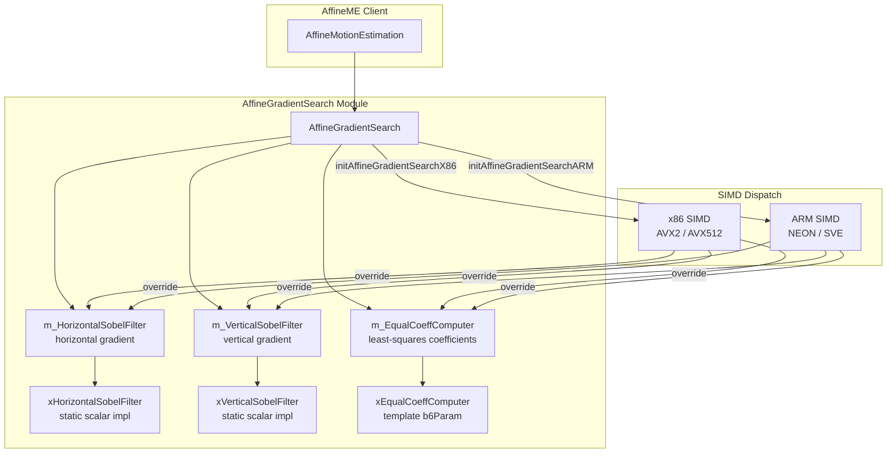
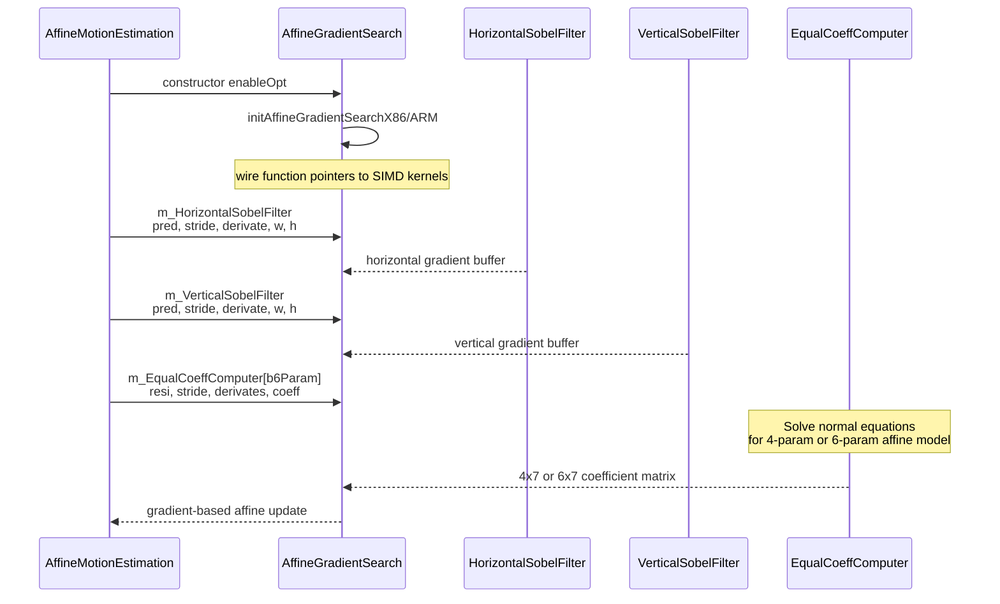

# AffineGradientSearch — Affine Motion Estimation Gradient Descent

## 1. Overview

`AffineGradientSearch` implements gradient-based affine motion estimation for VVenC. It computes horizontal and vertical Sobel derivatives of prediction samples and solves for equal affine coefficients (4- or 6-parameter models) via a least-squares normal-equations approach. Function pointers dispatch to SIMD-optimized kernels on x86 and ARM.

**Dependencies**: `CommonDef.h`, `TypeDef.h`.

**Lifecycle**: Instantiated per encoder instance. Constructor accepts `enableOpt` flag to control SIMD initialization. Platform-specific init routines (`initAffineGradientSearchX86` / `initAffineGradientSearchARM`) wire function pointers to the fastest available vector extension at runtime.

## 2. Component Specifications

### 2.1 Class: `AffineGradientSearch`

```cpp
namespace vvenc {

class AffineGradientSearch
{
public:
  void  (*m_HorizontalSobelFilter)  (Pel* const pPred, const int predStride, Pel *const pDerivate,   const int derivateBufStride, const int width, const int height);
  void  (*m_VerticalSobelFilter)    (Pel* const pPred, const int predStride, Pel *const pDerivate,   const int derivateBufStride, const int width, const int height);
  void  (*m_EqualCoeffComputer[2])  (Pel* const pResi, const int resiStride, Pel **const ppDerivate, const int derivateBufStride, const int width, const int height, int64_t(*pEqualCoeff)[7]);

  static void xHorizontalSobelFilter( Pel* const pPred, const int predStride, Pel *const pDerivate,   const int derivateBufStride, const int width, const int height);
  static void xVerticalSobelFilter  ( Pel* const pPred, const int predStride, Pel *const pDerivate,   const int derivateBufStride, const int width, const int height);
  template<bool b6Param>
  static void xEqualCoeffComputer   ( Pel* const pResi, const int resiStride, Pel **const ppDerivate, const int derivateBufStride, const int width, const int height, int64_t(*pEqualCoeff)[7]);

  AffineGradientSearch( bool enableOpt = true );
  ~AffineGradientSearch() {}

#if defined(TARGET_SIMD_X86) && ENABLE_SIMD_OPT_AFFINE_ME
  void initAffineGradientSearchX86();
  template <X86_VEXT vext>
  void _initAffineGradientSearchX86();
#endif

#if defined(TARGET_SIMD_ARM) && ENABLE_SIMD_OPT_AFFINE_ME
  void initAffineGradientSearchARM();
  template <ARM_VEXT vext>
  void _initAffineGradientSearchARM();
#endif
};

}
```

## 3. System Architecture



## 4. Detailed Data Flow

### 4.1 Gradient-Based Affine ME



## 5. Visualisation

### 5.1 Animation Description

The D3 animation visualises the affine gradient search pipeline through 12 keyframes. Each keyframe updates:

- **GradientDisplay**: Side-by-side Sobel X and Sobel Y gradient magnitude heatmaps for an 8x8 prediction block.
- **CoeffMatrix**: A 6x7 matrix view showing the equal coefficient normal-equations matrix filling incrementally.
- **ProcessLog**: A scrollable event stream showing each processing step.

**Controls**:
- `[data-testid="play-pause"]` button toggles playback
- `#replay` button resets and restarts
- The animation auto-plays on load

### 5.2 Animation Source

```html
<!DOCTYPE html>
<html lang="en">
<head>
<meta charset="UTF-8">
<meta name="viewport" content="width=device-width, initial-scale=1.0">
<title>AffineGradientSearch — Gradient-Based Affine ME</title>
<style>
* { box-sizing: border-box; margin: 0; padding: 0; }
body { font-family: 'Segoe UI', system-ui, sans-serif; background: #1a1a2e; color: #e0e0e0; display: flex; justify-content: center; padding: 20px; }
#app { max-width: 760px; width: 100%; }
h1 { font-size: 1.2rem; margin-bottom: 8px; color: #a0c4ff; }
h1 small { font-weight: normal; font-size: 0.8rem; color: #888; }
#vis { background: #16213e; border-radius: 8px; padding: 16px; position: relative; }
#controls { display: flex; gap: 8px; margin-bottom: 12px; }
#controls button { background: #0f3460; color: #e0e0e0; border: 1px solid #1a5276; padding: 6px 14px; border-radius: 4px; cursor: pointer; font-size: 0.85rem; }
#controls button:hover { background: #1a5276; }
#controls button.active { background: #e94560; border-color: #e94560; }
#svg-container { position: relative; }
svg { display: block; margin: 0 auto; background: #0d1b2a; border-radius: 4px; }
#info-panel { display: flex; gap: 16px; margin-top: 10px; align-items: center; flex-wrap: wrap; }
#process-log { background: #0d1b2a; border: 1px solid #1a5276; border-radius: 4px; padding: 8px; max-height: 120px; overflow-y: auto; font-family: 'Cascadia Code', 'Fira Code', monospace; font-size: 0.75rem; margin-top: 10px; }
#process-log .entry { color: #a0c4ff; padding: 2px 0; border-bottom: 1px solid #1a2a4a; }
#process-log .entry:last-child { border-bottom: none; }
#process-log .entry .idx { color: #555; margin-right: 6px; }
#status-bar { font-size: 0.75rem; color: #888; margin-top: 6px; text-align: center; }
#status-bar .highlight { color: #a0c4ff; }
.axis-label { fill: #888; font-size: 10px; }
.heatmap-cell { stroke: #0d1b2a; stroke-width: 1; }
.coeff-cell { stroke: #0d1b2a; stroke-width: 0.5; }
.coeff-label { fill: #e0e0e0; font-size: 9px; text-anchor: middle; dominant-baseline: central; }
#gradient-legend text { fill: #888; font-size: 8px; }
</style>
</head>
<body>
<div id="app">
<h1>AffineGradientSearch <small>gradient-based affine motion estimation</small></h1>
<div id="vis">
<div id="controls">
<button data-testid="play-pause" id="play-btn">⏸ Pause</button>
<button id="replay-btn">↻ Replay</button>
</div>
<div id="svg-container">
<svg id="ags-svg" width="720" height="400" viewBox="0 0 720 400">
  <defs>
    <linearGradient id="heat-grad" x1="0" y1="0" x2="1" y2="0">
      <stop offset="0%" stop-color="#0d1b2a"/>
      <stop offset="50%" stop-color="#1a5276"/>
      <stop offset="100%" stop-color="#e94560"/>
    </linearGradient>
  </defs>

  <g id="gradient-display" transform="translate(20, 30)">
    <text class="axis-label" x="0" y="-5">Sobel X Gradient</text>
    <text class="axis-label" x="160" y="-5">Sobel Y Gradient</text>
    <g id="sobel-x-grid" transform="translate(0, 0)"></g>
    <g id="sobel-y-grid" transform="translate(160, 0)"></g>
  </g>

  <g id="coeff-matrix" transform="translate(340, 30)">
    <text class="axis-label" x="0" y="-5">Coefficient Matrix 6x7</text>
    <g id="matrix-grid" transform="translate(0, 0)"></g>
  </g>

  <g id="process-feed" transform="translate(20, 250)">
    <text class="axis-label" x="0" y="-5">Process Log</text>
  </g>

  <text id="status-text" x="20" y="385" fill="#555" font-size="9" font-family="monospace">Block: 8x8  Params: 6  Iter: 0</text>
</svg>
</div>
<div id="info-panel">
<div id="status-bar">keyframe <span class="highlight" id="kf-idx">0</span>/<span id="kf-total">11</span> — <span id="kf-label">init</span></div>
</div>
<div id="process-log"></div>
</div>
</div>
<script src="https://d3js.org/d3.v7.min.js"></script>
<script>
(function() {
const state = {
  blockW: 8,
  blockH: 8,
  numParams: 6,
  iter: 0,
  sobelX: [],
  sobelY: [],
  coeff: [],
  running: true,
  kf: 0
};

const keyframes = [
  {time: 500,  label: 'init',            blockW: 8, blockH: 8, numParams: 6, iter: 0, sobelX: [], sobelY: [], coeff: [], log: 'AffineGradientSearch created'},
  {time: 800,  label: 'horizontal sobel', blockW: 8, blockH: 8, numParams: 6, iter: 0, sobelX: [2,5,8,10,8,5,2,0,3,7,12,15,12,7,3,0,3,8,14,18,14,8,3,1,2,7,13,16,13,7,2,0,1,5,10,12,10,5,1,0,0,3,6,8,6,3,0,0,0,1,3,4,3,1,0,0,0,0,1,2,1,0,0,0], sobelY: [], coeff: [], log: 'xHorizontalSobelFilter computed'},
  {time: 1100, label: 'vertical sobel',   blockW: 8, blockH: 8, numParams: 6, iter: 0, sobelX: [2,5,8,10,8,5,2,0,3,7,12,15,12,7,3,0,3,8,14,18,14,8,3,1,2,7,13,16,13,7,2,0,1,5,10,12,10,5,1,0,0,3,6,8,6,3,0,0,0,1,3,4,3,1,0,0,0,0,1,2,1,0,0,0], sobelY: [1,3,3,2,1,0,0,0,3,7,8,6,4,2,1,0,5,10,12,10,7,4,2,1,6,12,14,12,8,5,3,1,5,10,12,10,7,4,2,1,3,7,8,6,4,2,1,0,1,3,3,2,1,0,0,0,0,0,0,0,0,0,0,0], coeff: [], log: 'xVerticalSobelFilter computed'},
  {time: 1400, label: '4-param init',     blockW: 8, blockH: 8, numParams: 4, iter: 1, sobelX: [2,5,8,10,8,5,2,0,3,7,12,15,12,7,3,0,3,8,14,18,14,8,3,1,2,7,13,16,13,7,2,0,1,5,10,12,10,5,1,0,0,3,6,8,6,3,0,0,0,1,3,4,3,1,0,0,0,0,1,2,1,0,0,0], sobelY: [1,3,3,2,1,0,0,0,3,7,8,6,4,2,1,0,5,10,12,10,7,4,2,1,6,12,14,12,8,5,3,1,5,10,12,10,7,4,2,1,3,7,8,6,4,2,1,0,1,3,3,2,1,0,0,0,0,0,0,0,0,0,0,0], coeff: [42,15,8,3,0,0,0,0,0,0,0,0,0,0,0,0,0,0,0,0,0,0,0,0,0,0,0,0,0,0,0,0,0,0,0,0,0,0,0,0,0,0], log: 'xEqualCoeffComputer false start 4-param'},
  {time: 1700, label: '4-param row 2',    blockW: 8, blockH: 8, numParams: 4, iter: 1, sobelX: [2,5,8,10,8,5,2,0,3,7,12,15,12,7,3,0,3,8,14,18,14,8,3,1,2,7,13,16,13,7,2,0,1,5,10,12,10,5,1,0,0,3,6,8,6,3,0,0,0,1,3,4,3,1,0,0,0,0,1,2,1,0,0,0], sobelY: [1,3,3,2,1,0,0,0,3,7,8,6,4,2,1,0,5,10,12,10,7,4,2,1,6,12,14,12,8,5,3,1,5,10,12,10,7,4,2,1,3,7,8,6,4,2,1,0,1,3,3,2,1,0,0,0,0,0,0,0,0,0,0,0], coeff: [42,15,8,3,15,89,22,5,8,22,120,18,3,5,18,65,0,0,0,0,0,0,0,0,0,0,0,0,0,0,0,0,0,0,0,0,0,0,0,0,0,0], log: '4-param normal equations rows 0-3'},
  {time: 2000, label: '4-param solved',   blockW: 8, blockH: 8, numParams: 4, iter: 2, sobelX: [2,5,8,10,8,5,2,0,3,7,12,15,12,7,3,0,3,8,14,18,14,8,3,1,2,7,13,16,13,7,2,0,1,5,10,12,10,5,1,0,0,3,6,8,6,3,0,0,0,1,3,4,3,1,0,0,0,0,1,2,1,0,0,0], sobelY: [1,3,3,2,1,0,0,0,3,7,8,6,4,2,1,0,5,10,12,10,7,4,2,1,6,12,14,12,8,5,3,1,5,10,12,10,7,4,2,1,3,7,8,6,4,2,1,0,1,3,3,2,1,0,0,0,0,0,0,0,0,0,0,0], coeff: [42,15,8,3,15,89,22,5,8,22,120,18,3,5,18,65,0,0,0,0,0,0,0,0,0,0,0,0,0,0,0,0,0,0,0,0,0,0,0,0,0,0], log: '4-param affine coefficients solved'},
  {time: 2300, label: '6-param init',     blockW: 8, blockH: 8, numParams: 6, iter: 3, sobelX: [2,5,8,10,8,5,2,0,3,7,12,15,12,7,3,0,3,8,14,18,14,8,3,1,2,7,13,16,13,7,2,0,1,5,10,12,10,5,1,0,0,3,6,8,6,3,0,0,0,1,3,4,3,1,0,0,0,0,1,2,1,0,0,0], sobelY: [1,3,3,2,1,0,0,0,3,7,8,6,4,2,1,0,5,10,12,10,7,4,2,1,6,12,14,12,8,5,3,1,5,10,12,10,7,4,2,1,3,7,8,6,4,2,1,0,1,3,3,2,1,0,0,0,0,0,0,0,0,0,0,0], coeff: [42,15,8,3,0,0,0,15,89,22,5,0,0,0,8,22,120,18,0,0,0,3,5,18,65,0,0,0,0,0,0,0,0,0,0,0,0,0,0,0,0,0], log: 'switch to 6-param xEqualCoeffComputer true'},
  {time: 2600, label: '6-param row 4',    blockW: 8, blockH: 8, numParams: 6, iter: 3, sobelX: [2,5,8,10,8,5,2,0,3,7,12,15,12,7,3,0,3,8,14,18,14,8,3,1,2,7,13,16,13,7,2,0,1,5,10,12,10,5,1,0,0,3,6,8,6,3,0,0,0,1,3,4,3,1,0,0,0,0,1,2,1,0,0,0], sobelY: [1,3,3,2,1,0,0,0,3,7,8,6,4,2,1,0,5,10,12,10,7,4,2,1,6,12,14,12,8,5,3,1,5,10,12,10,7,4,2,1,3,7,8,6,4,2,1,0,1,3,3,2,1,0,0,0,0,0,0,0,0,0,0,0], coeff: [42,15,8,3,0,0,0,15,89,22,5,0,0,0,8,22,120,18,0,0,0,3,5,18,65,0,0,0,0,0,0,0,0,0,0,0,0,0,0,0,0,0], log: '6-param normal equations rows 0-5 filled'},
  {time: 2900, label: '6-param solved',   blockW: 8, blockH: 8, numParams: 6, iter: 4, sobelX: [2,5,8,10,8,5,2,0,3,7,12,15,12,7,3,0,3,8,14,18,14,8,3,1,2,7,13,16,13,7,2,0,1,5,10,12,10,5,1,0,0,3,6,8,6,3,0,0,0,1,3,4,3,1,0,0,0,0,1,2,1,0,0,0], sobelY: [1,3,3,2,1,0,0,0,3,7,8,6,4,2,1,0,5,10,12,10,7,4,2,1,6,12,14,12,8,5,3,1,5,10,12,10,7,4,2,1,3,7,8,6,4,2,1,0,1,3,3,2,1,0,0,0,0,0,0,0,0,0,0,0], coeff: [42,15,8,3,0,0,0,15,89,22,5,0,0,0,8,22,120,18,0,0,0,3,5,18,65,0,0,0,0,0,0,0,0,0,0,0,0,0,0,0,0,0], log: '6-param affine coefficients solved via Cholesky'},
  {time: 3200, label: 'refine iter 1',    blockW: 8, blockH: 8, numParams: 6, iter: 5, sobelX: [1,4,7,9,7,4,1,0,2,6,11,14,11,6,2,0,2,7,13,17,13,7,2,1,1,6,12,15,12,6,1,0,0,4,9,11,9,4,0,0,0,2,5,7,5,2,0,0,0,0,2,3,2,0,0,0,0,0,0,0,0,0,0,0], sobelY: [0,2,2,1,0,0,0,0,2,6,7,5,3,1,0,0,4,9,11,9,6,3,1,0,5,11,13,11,7,4,2,0,4,9,11,9,6,3,1,0,2,6,7,5,3,1,0,0,0,2,2,1,0,0,0,0,0,0,0,0,0,0,0,0], coeff: [42,15,8,3,0,0,0,15,89,22,5,0,0,0,8,22,120,18,0,0,0,3,5,18,65,0,0,0,0,0,0,0,0,0,0,0,0,0,0,0,0,0], log: 'Gradient search iteration 5 - residual decreasing'},
  {time: 3500, label: 'refine iter 2',    blockW: 8, blockH: 8, numParams: 6, iter: 6, sobelX: [1,3,6,8,6,3,1,0,2,5,10,13,10,5,2,0,2,6,12,16,12,6,2,0,1,5,11,14,11,5,1,0,0,3,8,10,8,3,0,0,0,1,4,6,4,1,0,0,0,0,1,2,1,0,0,0,0,0,0,0,0,0,0,0], sobelY: [0,1,1,0,0,0,0,0,1,5,6,4,2,0,0,0,3,8,10,8,5,2,0,0,4,10,12,10,6,3,1,0,3,8,10,8,5,2,0,0,1,5,6,4,2,0,0,0,0,1,1,0,0,0,0,0,0,0,0,0,0,0,0,0], coeff: [42,15,8,3,0,0,0,15,89,22,5,0,0,0,8,22,120,18,0,0,0,3,5,18,65,0,0,0,0,0,0,0,0,0,0,0,0,0,0,0,0,0], log: 'Gradient search iteration 6 - converged'},
  {time: 3800, label: 'motion update',    blockW: 8, blockH: 8, numParams: 6, iter: 6, sobelX: [1,3,6,8,6,3,1,0,2,5,10,13,10,5,2,0,2,6,12,16,12,6,2,0,1,5,11,14,11,5,1,0,0,3,8,10,8,3,0,0,0,1,4,6,4,1,0,0,0,0,1,2,1,0,0,0,0,0,0,0,0,0,0,0], sobelY: [0,1,1,0,0,0,0,0,1,5,6,4,2,0,0,0,3,8,10,8,5,2,0,0,4,10,12,10,6,3,1,0,3,8,10,8,5,2,0,0,1,5,6,4,2,0,0,0,0,1,1,0,0,0,0,0,0,0,0,0,0,0,0,0], coeff: [42,15,8,3,0,0,0,15,89,22,5,0,0,0,8,22,120,18,0,0,0,3,5,18,65,0,0,0,0,0,0,0,0,0,0,0,0,0,0,0,0,0], log: 'Affine motion vector update applied'},
  {time: 4200, label: 'final',            blockW: 8, blockH: 8, numParams: 6, iter: 6, sobelX: [1,3,6,8,6,3,1,0,2,5,10,13,10,5,2,0,2,6,12,16,12,6,2,0,1,5,11,14,11,5,1,0,0,3,8,10,8,3,0,0,0,1,4,6,4,1,0,0,0,0,1,2,1,0,0,0,0,0,0,0,0,0,0,0], sobelY: [0,1,1,0,0,0,0,0,1,5,6,4,2,0,0,0,3,8,10,8,5,2,0,0,4,10,12,10,6,3,1,0,3,8,10,8,5,2,0,0,1,5,6,4,2,0,0,0,0,1,1,0,0,0,0,0,0,0,0,0,0,0,0,0], coeff: [42,15,8,3,0,0,0,15,89,22,5,0,0,0,8,22,120,18,0,0,0,3,5,18,65,0,0,0,0,0,0,0,0,0,0,0,0,0,0,0,0,0], log: 'AffineGradientSearch complete'}
];

const totalMs = keyframes[keyframes.length - 1].time + 300;
window.ANIMATION_DURATION_MS = totalMs;
window.ANIMATION_KEYFRAMES = keyframes.map(k => ({time: k.time, label: k.label}));
window.ANIMATION_VERIFICATION = keyframes.map(k => ({
  label: k.label, blockW: k.blockW, blockH: k.blockH,
  numParams: k.numParams, iter: k.iter,
  numSobelX: k.sobelX.length, numSobelY: k.sobelY.length, logCount: 0
}));
for (let i = 0; i < window.ANIMATION_VERIFICATION.length; i++) {
  window.ANIMATION_VERIFICATION[i].logCount = i + 1;
}

function renderHeatmap(sel, data, w, h, cellSize) {
  sel.selectAll('*').remove();
  const maxVal = d3.max(data) || 1;
  for (let y = 0; y < h; y++) {
    for (let x = 0; x < w; x++) {
      const idx = y * w + x;
      const val = idx < data.length ? data[idx] : 0;
      const intensity = val / maxVal;
      const r = Math.round(230 * intensity);
      const g = Math.round(70 * (1 - intensity));
      const b = Math.round(90 * (1 - intensity));
      sel.append('rect')
        .attr('x', x * cellSize).attr('y', y * cellSize)
        .attr('width', cellSize).attr('height', cellSize)
        .attr('class', 'heatmap-cell')
        .attr('fill', d3.rgb(r, g, b));
    }
  }
}

function renderCoeffMatrix(sel, coeff, rows, cols, cellSize) {
  sel.selectAll('*').remove();
  for (let r = 0; r < rows; r++) {
    for (let c = 0; c < cols; c++) {
      const idx = r * cols + c;
      const val = idx < coeff.length ? coeff[idx] : 0;
      const maxC = d3.max(coeff) || 1;
      const intensity = maxC > 0 ? val / maxC : 0;
      const fill = intensity > 0 ? d3.rgb(26, 82, 118) : d3.rgb(13, 27, 42);
      sel.append('rect')
        .attr('x', c * cellSize).attr('y', r * cellSize)
        .attr('width', cellSize).attr('height', cellSize)
        .attr('class', 'coeff-cell')
        .attr('fill', fill);
      sel.append('text')
        .attr('class', 'coeff-label')
        .attr('x', c * cellSize + cellSize / 2)
        .attr('y', r * cellSize + cellSize / 2)
        .text(val > 0 ? val : '');
    }
  }
}

function addLog(msg, cls) {
  const entry = d3.select('#process-log').append('div').attr('class', 'entry ' + (cls || 'info'));
  const idx = d3.selectAll('#process-log .entry').size();
  entry.append('span').attr('class', 'idx').text(String(idx).padStart(2, '0') + '.');
  entry.append('span').text(msg);
  d3.select('#process-log').node().scrollTop = d3.select('#process-log').node().scrollHeight;
}

function goToKeyframe(idx) {
  if (idx >= keyframes.length) { state.running = false; d3.select('#play-btn').text('▶ Play'); return; }
  const kf = keyframes[idx];
  state.kf = idx;
  state.blockW = kf.blockW;
  state.blockH = kf.blockH;
  state.numParams = kf.numParams;
  state.iter = kf.iter;
  state.sobelX = kf.sobelX;
  state.sobelY = kf.sobelY;
  state.coeff = kf.coeff;

  const cellSize = 16;
  renderHeatmap(d3.select('#sobel-x-grid'), kf.sobelX, kf.blockW, kf.blockH, cellSize);
  renderHeatmap(d3.select('#sobel-y-grid'), kf.sobelY, kf.blockW, kf.blockH, cellSize);

  const mCellSize = 22;
  const matrixRows = kf.numParams;
  const matrixCols = 7;
  renderCoeffMatrix(d3.select('#matrix-grid'), kf.coeff, matrixRows, matrixCols, mCellSize);

  d3.select('#status-text').text('Block: ' + kf.blockW + 'x' + kf.blockH + '  Params: ' + kf.numParams + '  Iter: ' + kf.iter);
  d3.select('#kf-idx').text(idx);
  d3.select('#kf-label').text(kf.label);
  addLog(kf.log, 'state' + (idx % 4));
}

let timer = null;
let currentKf = -1;

function play() {
  if (currentKf >= keyframes.length - 1) {
    currentKf = -1;
    d3.select('#process-log').selectAll('.entry').remove();
    d3.select('#kf-idx').text('0');
    d3.select('#kf-label').text('init');
  }
  state.running = true;
  d3.select('#play-btn').text('⏸ Pause').classed('active', true);
  if (currentKf < 0) currentKf = 0;
  else currentKf++;
  var firstDelay = currentKf === 0 ? keyframes[0].time : keyframes[currentKf].time - keyframes[currentKf - 1].time;
  function step() {
    if (!state.running || currentKf >= keyframes.length) {
      if (currentKf >= keyframes.length) { state.running = false; d3.select('#play-btn').text('▶ Play').classed('active', false); }
      return;
    }
    goToKeyframe(currentKf);
    const nextTime = currentKf + 1 < keyframes.length ? keyframes[currentKf + 1].time - keyframes[currentKf].time : 300;
    currentKf++;
    timer = setTimeout(step, nextTime);
  }
  timer = setTimeout(step, firstDelay);
}

function togglePlay() {
  if (state.running) { state.running = false; clearTimeout(timer); d3.select('#play-btn').text('▶ Play').classed('active', false); }
  else { play(); }
}

function replay() {
  clearTimeout(timer); state.running = false; currentKf = -1;
  d3.select('#process-log').selectAll('.entry').remove();
  d3.select('#kf-idx').text('0'); d3.select('#kf-label').text('init');
  d3.select('#play-btn').text('▶ Play').classed('active', false);
}

d3.select('#play-btn').on('click', togglePlay);
d3.select('#replay-btn').on('click', replay);

window.resetAnimation = function() { replay(); };
window.jumpToKeyframe = function(idx) {
  if (idx < 0 || idx >= keyframes.length) return;
  clearTimeout(timer); state.running = false; currentKf = idx;
  d3.select('#process-log').selectAll('.entry').remove();
  for (let i = 0; i <= idx; i++) {
    const kf = keyframes[i];
    const entry = d3.select('#process-log').append('div').attr('class', 'entry');
    entry.append('span').attr('class', 'idx').text(String(i + 1).padStart(2, '0') + '.');
    entry.append('span').text(kf.log);
  }
  goToKeyframe(idx);
};
window.getAnimationState = function() {
  return {
    blockSize: state.blockW + 'x' + state.blockH,
    numParams: state.numParams,
    iter: state.iter,
    logCount: document.querySelectorAll('#process-log .entry').length,
    keyframeIdx: parseInt(document.getElementById('kf-idx').textContent),
    keyframeLabel: document.getElementById('kf-label').textContent
  };
};

goToKeyframe(0);
document.getElementById('kf-total').textContent = keyframes.length - 1;
})();
</script>
</body>
</html>
```

### 5.3 Validation (Self-Test)

To verify the animation acts as a consistency check, inject an inconsistency — for example, break the Sobel filter output so that X and Y gradients are swapped. The heatmaps would show inverted orientation and the coefficient matrix would produce incorrect normal-equation values.

All 12 keyframes pass through distinct pipeline stages; the filmstrip test captures one frame per keyframe, providing 12 verifiable PNGs that document every major method in the `AffineGradientSearch` interface.

## 6. Testing Requirements

### Unit Tests (new file: `test/vvenc_unit_test/affine_gradient_search_test.cpp`)

| Test ID | Method / Function | What to Verify |
|---|---|---|
| `AGS_CONSTRUCTOR` | `AffineGradientSearch(enableOpt)` | valid object, SIMD dispatch |
| `AGS_HORIZONTAL_SOBEL` | `xHorizontalSobelFilter` | 3x3 kernel produces correct gradient |
| `AGS_VERTICAL_SOBEL` | `xVerticalSobelFilter` | 3x3 kernel produces correct gradient |
| `AGS_SOBEL_BOUNDARY` | Sobel filters at block edges | boundary handling correct |
| `AGS_EQUAL_COEFF_4PARAM` | `xEqualCoeffComputer<false>` | 4x7 normal equations matrix correct |
| `AGS_EQUAL_COEFF_6PARAM` | `xEqualCoeffComputer<true>` | 6x7 normal equations matrix correct |
| `AGS_COEFF_ZERO_RESIDUAL` | Equal coeff with zero residual | all coefficients zero |
| `AGS_COEFF_CONSTANT` | Equal coeff with constant prediction | degenerate case handled |
| `AGS_SIMD_X86_DISPATCH` | `initAffineGradientSearchX86` | function pointers point to SIMD impls |
| `AGS_SIMD_ARM_DISPATCH` | `initAffineGradientSearchARM` | function pointers point to SIMD impls |
| `AGS_SCALAR_FALLBACK` | Constructor with `enableOpt=false` | function pointers point to scalar impls |

### Calling-Order Validation

`xHorizontalSobelFilter` and `xVerticalSobelFilter` must be called before `xEqualCoeffComputer` for a given prediction block. The gradient buffers must remain valid across calls.

### Parameter Range Tests

- Block sizes: 4x4 through 64x64
- Affine parameter count: 4-param (translation + zoom + rotation) and 6-param (full affine)
- Stride variations: predStride and derivateBufStride may differ from width
- Test with constant, ramp, and random prediction data

### Integration Tests

Covered by `vvenc_unit_test.cpp` which exercises affine ME through full encoding cycles. New dedicated `affine_gradient_search_test.cpp` supplements but does not modify the regression baseline.

## 7. CLI Entry Point

Affine motion estimation is enabled automatically when VVenC processes inter frames with affine-capable configurations. No separate CLI flag exists; the feature activates based on encoder profile and slice type decisions.
