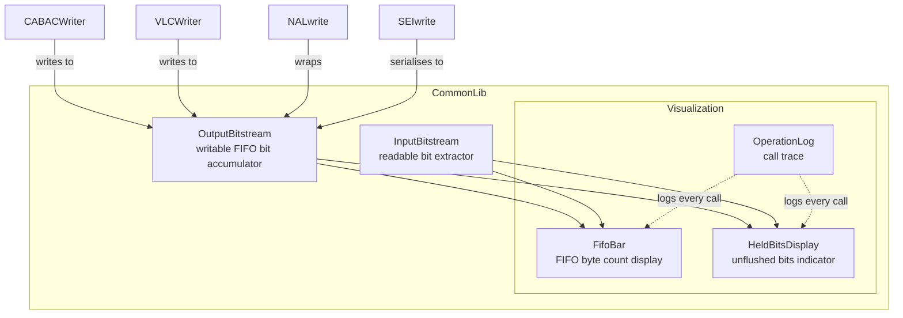
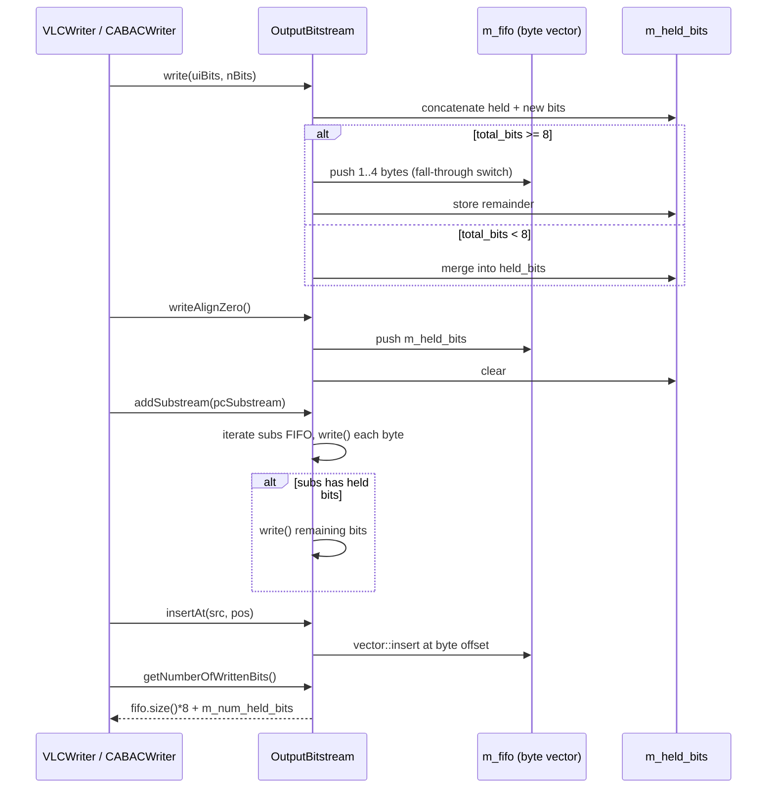
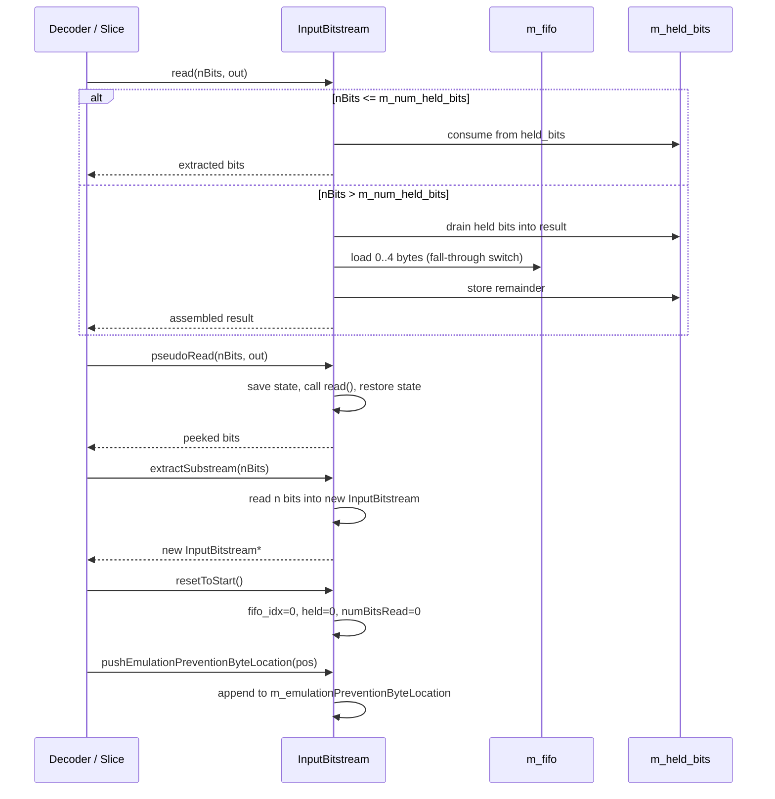

# BitStream — Bit-Level Stream Accumulator and Reader

## 1. Overview

The `BitStream` module provides two classes for bit-level I/O in the VVC bitstream pipeline:

- **`OutputBitstream`** — accumulates bits via FIFO to produce a byte-aligned bytestream. Used by `CABACWriter`, `VLCWriter`, and `NALwrite` during encoding.
- **`InputBitstream`** — extracts bits from a pre-populated bytestream. Used by the decoder to reconstruct syntax elements.

**Dependencies**: `CommonDef.h` (CHECK macro), `dtrace_next.h` (DTRACE), `<vector>`, `<stdint.h>`.

**Lifecycle**: Instances are created on the stack or embedded in encoding/decoding structures. `OutputBitstream::clear()` resets state; `InputBitstream::resetToStart()` rewinds the read cursor.

## 2. Component Specifications

### 2.1 Class: `OutputBitstream`

```cpp
#pragma once

#include "CommonDef.h"
#include <stdint.h>
#include <vector>

namespace vvenc {

class OutputBitstream
{
public:
  // --------------------------------------------------------------------------
  // Construction / destruction
  // --------------------------------------------------------------------------

  /** \brief Default constructor — calls clear(). */
  OutputBitstream();
  virtual ~OutputBitstream();

  // --------------------------------------------------------------------------
  // Writing
  // --------------------------------------------------------------------------

  /** \brief Append the least-significant uiNumberOfBits bits of uiBits.
   *  \param[in] uiBits           value containing bits to write
   *  \param[in] uiNumberOfBits   number of bits to append (1..32)
   */
  void write(uint32_t uiBits, uint32_t uiNumberOfBits);

  /** \brief Insert one-bits until the stream is byte-aligned. */
  void writeAlignOne();

  /** \brief Insert zero-bits until the stream is byte-aligned. */
  void writeAlignZero();

  /** \brief Write a single 1-bit then zero-align (trailing bit syntax). */
  void writeByteAlignment();

  // --------------------------------------------------------------------------
  // Substream operations
  // --------------------------------------------------------------------------

  /** \brief Append an entire substream's bits.
   *  \param[in] pcSubstream  substream to append
   */
  void addSubstream(const OutputBitstream* pcSubstream);

  /** \brief Insert byte-aligned stream at byte position pos.
   *  \param[in] src  source stream (must be byte-aligned)
   *  \param[in] pos  byte offset in this FIFO
   */
  void insertAt(const OutputBitstream& src, uint32_t pos);

  // --------------------------------------------------------------------------
  // Accessors
  // --------------------------------------------------------------------------

  /** \retval pointer to the start of the bytestream buffer */
  uint8_t* getByteStream() const;

  /** \retval number of valid bytes in the bytestream */
  uint32_t getByteStreamLength();

  /** \retval number of bits written since last clear() */
  uint32_t getNumberOfWrittenBits() const;

  /** \retval number of bits needed for byte alignment */
  int getNumBitsUntilByteAligned() const;

  /** \retval reference to internal FIFO (non-const) */
  std::vector<uint8_t>& getFIFO();

  /** \retval const reference to internal FIFO */
  const std::vector<uint8_t>& getFIFO() const;

  /** \retval currently held (unflushed) bits */
  uint8_t getHeldBits() const;

  /** \brief Count start-code emulation prevention bytes.
   *  \retval number of 00 00 {00,01,02,03} sequences found
   */
  int countStartCodeEmulations();

  // --------------------------------------------------------------------------
  // State management
  // --------------------------------------------------------------------------

  /** \brief Reset all internal state — clear FIFO and held bits. */
  void clear();

protected:
  std::vector<uint8_t> m_fifo;           ///< byte-level FIFO storage
  uint32_t             m_num_held_bits;  ///< count of unflushed bits (0..7)
  uint8_t              m_held_bits;      ///< unflushed bits, MSB-aligned big-endian
};

}
```

### 2.2 Class: `InputBitstream`

```cpp
namespace vvenc {

class InputBitstream
{
public:
  // --------------------------------------------------------------------------
  // Construction / destruction
  // --------------------------------------------------------------------------

  InputBitstream();
  virtual ~InputBitstream();
  InputBitstream(const InputBitstream& src);

  // --------------------------------------------------------------------------
  // Reading
  // --------------------------------------------------------------------------

  /** \brief Read bits — advances the read cursor.
   *  \param[in]  uiNumberOfBits  number of bits to read (1..32)
   *  \param[out] ruiBits         extracted bits (MSB-aligned)
   */
  void read(uint32_t uiNumberOfBits, uint32_t& ruiBits);

  /** \brief Peek at bits without advancing the cursor.
   *  \param[in]  uiNumberOfBits  number of bits to peek
   *  \param[out] ruiBits         extracted bits
   */
  void pseudoRead(uint32_t uiNumberOfBits, uint32_t& ruiBits);

  /** \brief Read a single byte (8 bits).
   *  \param[out] ruiBits  the byte read
   */
  void readByte(uint32_t& ruiBits);

  /** \brief Read trailing bits after the RBSP stop bit.
   *  \retval count of trailing bits consumed
   */
  uint32_t readOutTrailingBits();

  /** \brief Read and verify byte alignment (1 then zeros).
   *  \retval number of alignment bits consumed
   */
  uint32_t readByteAlignment();

  // --------------------------------------------------------------------------
  // Peek utilities
  // --------------------------------------------------------------------------

  /** \brief Peek at previous byte without advancing.
   *  \param[out] byte  previous byte value
   */
  void peekPreviousByte(uint32_t& byte);

  /** \brief Peek convenience — calls pseudoRead internally.
   *  \param[in] uiBits  number of bits to peek
   *  \retval extracted bits
   */
  uint32_t peekBits(uint32_t uiBits);

  // --------------------------------------------------------------------------
  // Substream extraction
  // --------------------------------------------------------------------------

  /** \brief Extract a substream of uiNumBits.
   *  \param[in] uiNumBits  number of bits to extract
   *  \retval new InputBitstream containing the extracted bits
   */
  InputBitstream* extractSubstream(uint32_t uiNumBits);

  // --------------------------------------------------------------------------
  // Accessors
  // --------------------------------------------------------------------------

  /** \retval current cursor as byte offset into FIFO */
  uint32_t getByteLocation() const;

  /** \retval currently held (unflushed) bits */
  uint8_t getHeldBits() const;

  /** \retval total bits read since construction */
  uint32_t getNumBitsRead();

  /** \retval bits remaining in the stream */
  uint32_t getNumBitsLeft();

  /** \retval bits needed for byte alignment */
  uint32_t getNumBitsUntilByteAligned();

  /** \retval non-const reference to internal FIFO */
  std::vector<uint8_t>& getFifo();

  /** \retval const reference to internal FIFO */
  const std::vector<uint8_t>& getFifo() const;

  /** \brief Rewind the read cursor to the start. */
  void resetToStart();

  // --------------------------------------------------------------------------
  // Emulation prevention byte tracking
  // --------------------------------------------------------------------------

  void     pushEmulationPreventionByteLocation(uint32_t pos);
  uint32_t numEmulationPreventionBytesRead() const;
  uint32_t getEmulationPreventionByteLocation(uint32_t idx) const;
  const std::vector<uint32_t>& getEmulationPreventionByteLocation() const;
  void     clearEmulationPreventionByteLocation();
  void     setEmulationPreventionByteLocation(const std::vector<uint32_t>& vec);

protected:
  std::vector<uint8_t>   m_fifo;
  std::vector<uint32_t>  m_emulationPreventionByteLocation;
  uint32_t               m_fifo_idx;
  uint32_t               m_num_held_bits;
  uint8_t                m_held_bits;
  uint32_t               m_numBitsRead;
};

}
```

## 3. System Architecture



## 4. Detailed Data Flow

### 4.1 OutputBitstream Write Lifecycle



### 4.2 InputBitstream Read Lifecycle



## 5. Visualisation

No D3 animation — the BitStream classes are internal utility types with no user-facing visualisation requirement. The FIFO accumulation and bit manipulation are well-covered by unit tests.

## 6. Testing Requirements

### Unit Tests (new file: `test/vvenc_unit_test/bitstream_test.cpp`)

| Test ID | Class / Method | What to Verify |
|---|---|---|
| `BS_OUTPUT_CONSTRUCTOR` | `OutputBitstream()` | fifo empty, held_bits==0, num_held_bits==0 |
| `BS_OUTPUT_CLEAR` | `clear()` | resets to post-constructor state |
| `BS_OUTPUT_WRITE_BASIC` | `write(0xA5, 8)` | single byte pushed to fifo |
| `BS_OUTPUT_WRITE_SUBBYTE` | `write(1, 1)` | bit accumulated in held_bits, no fifo push |
| `BS_OUTPUT_WRITE_MULTIBYTE` | `write(0xAABBCCDD, 32)` | 4 bytes pushed via fall-through switch |
| `BS_OUTPUT_WRITE_CROSS_BYTE` | `write(0x3F, 6); write(0x2, 2)` | second call creates aligned byte |
| `BS_OUTPUT_WRITE_ALIGN_ONE` | `writeAlignOne()` | one-bits until byte-aligned |
| `BS_OUTPUT_WRITE_ALIGN_ZERO` | `writeAlignZero()` | flushes held bits as last byte |
| `BS_OUTPUT_WRITE_BYTE_ALIGN` | `writeByteAlignment()` | trailing bit 1 then zero-align |
| `BS_OUTPUT_GET_BYTESTREAM` | `getByteStream()` | pointer to fifo.front() |
| `BS_OUTPUT_GET_LENGTH` | `getByteStreamLength()` | matches fifo.size() |
| `BS_OUTPUT_NUM_BITS` | `getNumberOfWrittenBits()` | fifo.size()*8 + num_held_bits |
| `BS_OUTPUT_NUM_BITS_ALIGN` | `getNumBitsUntilByteAligned()` | (8 - num_held_bits) & 0x7 |
| `BS_OUTPUT_HELD_BITS` | `getHeldBits()` | returns current m_held_bits |
| `BS_OUTPUT_ADD_SUBSTREAM` | `addSubstream()` | substream bits appended correctly |
| `BS_OUTPUT_INSERT_AT` | `insertAt()` | byte-aligned stream inserted at offset |
| `BS_OUTPUT_COUNT_EMUL` | `countStartCodeEmulations()` | detects 00 00 {00,01,02,03} sequences |
| `BS_INPUT_CONSTRUCTOR` | `InputBitstream()` | fifo empty, idx=0, held=0 |
| `BS_INPUT_READ_BASIC` | `read(8, out)` | reads one byte from fifo |
| `BS_INPUT_READ_ALIGNED_32` | `read(32, out)` | reads 4 bytes, no held bits |
| `BS_INPUT_READ_CROSS` | `read(10, out)` | reads across byte boundary |
| `BS_INPUT_PSEUDO_READ` | `pseudoRead(8, out)` | reads without advancing cursor |
| `BS_INPUT_PEEK_BITS` | `peekBits(8)` | non-destructive peek |
| `BS_INPUT_EXTRACT_SUBSTREAM` | `extractSubstream(16)` | new stream with 2 bytes |
| `BS_INPUT_RESET` | `resetToStart()` | rewinds idx, held, numBitsRead |
| `BS_INPUT_EMUL_PREVENT` | `pushEmulationPreventionByteLocation()` | track and retrieve locations |
| `BS_INPUT_READ_TRAILING` | `readOutTrailingBits()` | consumes trailing 1+zeros |
| `BS_INPUT_READ_BYTE_ALIGN` | `readByteAlignment()` | verifies 1 then zero bits |

### Calling-Order Validation

- Verify `write()` after `clear()` works (regression on internal held_bits state).
- Verify `read()` after `resetToStart()` re-reads from position 0.
- Verify `extractSubstream()` does not corrupt the parent stream's remaining bits.

### Parameter Range Tests

- `write(uiBits, nBits)` for nBits = 0: no-op (documented undefined behaviour for nBits > 32).
- `write()` with nBits = 32: all 32 bits consumed, full 4-byte push.
- `read(nBits)` for nBits = 0: no-op (documented).
- `read(nBits)` for nBits = 32: full 4-byte load.

### Integration Tests

Covered by the existing encoder integration tests (NAL write → CABAC → bitstream encode → decode round-trip). No dedicated BitStream integration test needed beyond the unit test suite.

## 7. CLI Entry Point

Not directly exposed via CLI. `OutputBitstream` and `InputBitstream` are internal data types consumed by `CABACWriter`, `VLCWriter`, `NALwrite`, `SEIwrite`, and the decoder slice parser.
