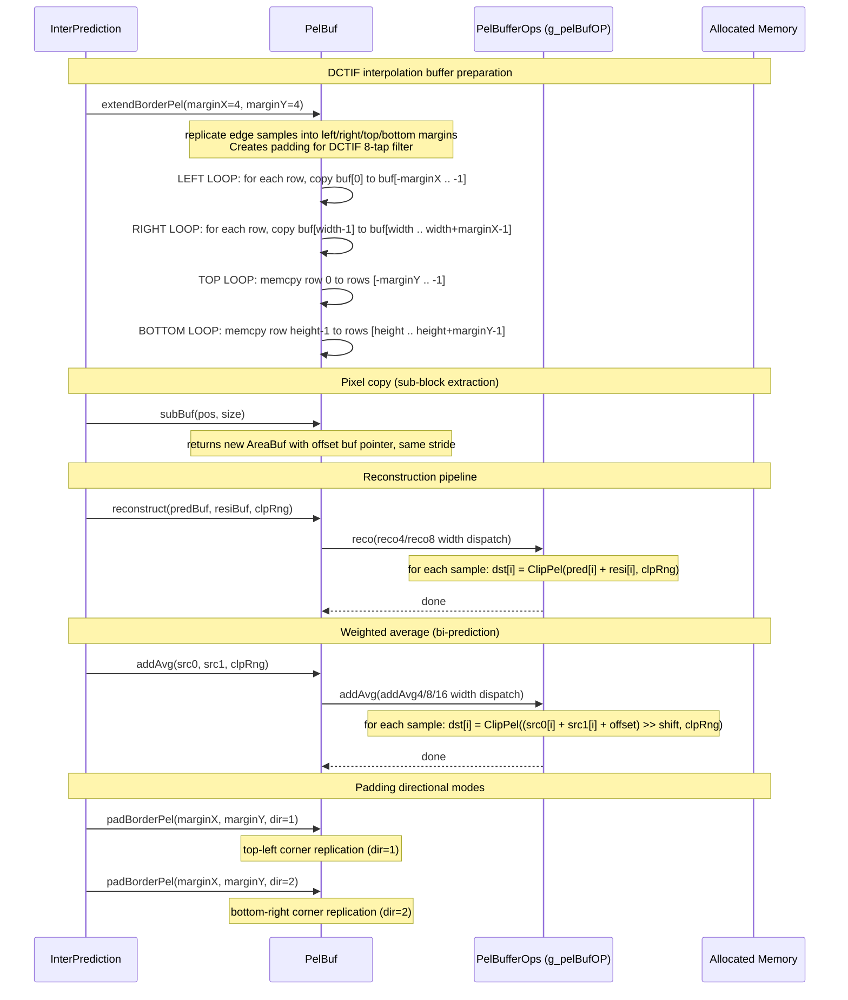
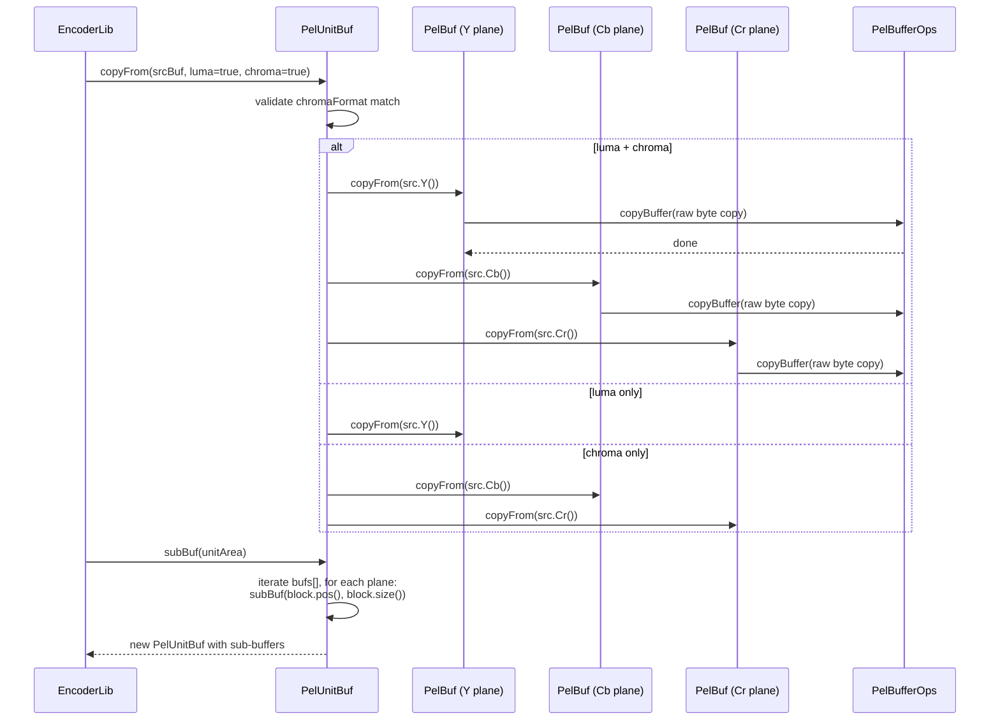

# Buffer — Pixel Buffer Operations for Luma/Chroma Planes

## 1. Overview

The `Buffer` module provides the foundational 2D memory layout abstraction for VVenC encoding. It is centred on `AreaBuf<T>` — a lightweight descriptor holding a typed pointer (`buf`), `stride`, `width`, and `height` — and its concrete aliases `PelBuf` / `CPelBuf` for pixel data. The `UnitBuf<T>` wrapper (`PelUnitBuf` / `CPelUnitBuf`) aggregates multiple plane descriptors for Y/Cb/Cr. The module covers padding, border extension, pixel copy, clipping, downsampling, reconstruction (pred+resi), DCTIF interpolation buffer margin management, and plane-level access. All heavy pixel loops are dispatched through the `PelBufferOps` function-pointer table, which is initialised at runtime for x86 SIMD (SSE4/AVX2/AVX-512) or ARM NEON.

**Dependencies**: `Common.h`, `CommonDef.h` (CHECK, ClpRng), `MotionInfo.h`, `vvenc/vvenc.h`.

**Lifecycle**: `PelStorage` and `CompStorage` are owning types requiring explicit `create()` / `destroy()` calls. `PelBuf` / `PelUnitBuf` are non-owning views that reference externally owned memory.

## 2. Component Specifications

### 2.1 Struct: `PelBufferOps`

```cpp
namespace vvenc {

struct PelBufferOps
{
  PelBufferOps();
  bool isInitX86Done;

#if ENABLE_SIMD_OPT_BUFFER && defined(TARGET_SIMD_X86)
  void initPelBufOpsX86();
  template<X86_VEXT vext>
  void _initPelBufOpsX86();
#endif

#if ENABLE_SIMD_OPT_BUFFER && defined(TARGET_SIMD_ARM)
  void initPelBufOpsARM();
  template<ARM_VEXT vext>
  void _initPelBufOpsARM();
#endif

  void ( *roundGeo )       ( const Pel* src, Pel* dest, const int numSamples, unsigned rshift, int offset, const ClpRng &clpRng);
  void ( *addAvg )         ( const Pel* src0, const Pel* src1, Pel* dst, int numsamples, unsigned shift, int offset, const ClpRng& clpRng );
  void ( *reco  )          ( const Pel* src0, const Pel* src1, Pel* dst, int numSamples, const ClpRng& clpRng );
  void ( *copyClip )       ( const Pel* src0,                  Pel* dst, int numSamples, const ClpRng& clpRng );
  void ( *addAvg4/8/16 )   ( width-specialised weighted average );
  void ( *sub4/8 )         ( width-specialised subtraction );
  void ( *wghtAvg4/8 )     ( width-specialised weighted average with BCW );
  void ( *copyClip4/8 )    ( width-specialised copy+clip );
  void ( *reco4/8 )        ( width-specialised reconstruction );
  void ( *linTf4/8 )       ( width-specialised linear transform );
  void ( *copyBuffer )     ( const char* src, int srcStride, char* dst, int dstStride, int width, int height );
  void ( *removeHighFreq4/8 )( Pel* dst, int dstStride, const Pel* src, int srcStride, int w, int h );
  void ( *transpose4x4/8x8 )( const Pel* src, int srcStride, Pel* dst, int dstStride );
  void ( *roundIntVector ) ( int* v, int size, unsigned int nShift, const int dmvLimit );
  void ( *mipMatrixMul_4_4/8_4/8_8 )( Pel* res, const Pel* input, const uint8_t* weight, const int maxVal, const int offset, bool transpose );
  void ( *weightCiip )     ( Pel* res, const Pel* intra, const int numSamples, int numIntra );
  void ( *applyLut )       ( const Pel* src, ptrdiff_t srcStride, Pel* dst, ptrdiff_t dstStride, int width, int height, const Pel* lut );
  void ( *fillPtrMap )     ( void** ptrMap, ptrdiff_t mapStride, int width, int height, void* val );
  uint64_t ( *AvgHighPassWithDownsampling )( int width, int height, const Pel* pSrc, int iSrcStride );
  uint64_t ( *AvgHighPass )( int width, int height, const Pel* pSrc, int iSrcStride );
  uint64_t ( *AvgHighPassWithDownsamplingDiff1st/2nd )( ... );
  uint64_t ( *HDHighPass/HDHighPass2 )( ... );
};

extern PelBufferOps g_pelBufOP;

}
```

### 2.2 Template Struct: `AreaBuf<T>` (aliased as `PelBuf`, `CPelBuf`)

```cpp
#include "Common.h"
#include "CommonDef.h"
#include <string.h>
#include <type_traits>

namespace vvenc {

template<typename T>
struct AreaBuf : public Size
{
  T*        buf;
  int       stride;

  // Constructors (buf, stride, width, height variants)
  AreaBuf();
  AreaBuf( T *_buf, const Size& size );
  AreaBuf( T *_buf, const int& _stride, const Size& size );
  AreaBuf( T *_buf, const SizeType& _width, const SizeType& _height );
  AreaBuf( T *_buf, const int& _stride, const SizeType& _width, const SizeType& _height );
  AreaBuf( const AreaBuf& )  = default;
  AreaBuf(       AreaBuf&& ) = default;

  // Conversion from AreaBuf<const T> to AreaBuf<T> (enables CPelBuf → PelBuf)
  template<bool T_IS_CONST = std::is_const<T>::value>
  AreaBuf( const AreaBuf<typename std::remove_const_t<T>>& other, std::enable_if_t<T_IS_CONST>* = 0 );

  // Pixel operations
  void fill                 ( const T &val );
  void memset               ( const int val );
  void copyFrom             ( const AreaBuf<const T>& other );
  void reconstruct          ( const AreaBuf<const T>& pred, const AreaBuf<const T>& resi, const ClpRng& clpRng );
  void copyClip             ( const AreaBuf<const T>& src, const ClpRng& clpRng );
  void subtract             ( const AreaBuf<const T>& minuend, const AreaBuf<const T>& subtrahend );
  void calcVarianceSplit    ( const AreaBuf<const T>& Org, const uint32_t size, int& varh, int& varv ) const;
  void extendBorderPel      ( unsigned marginX, unsigned marginY );
  void addAvg               ( const AreaBuf<const T>& other1, const AreaBuf<const T>& other2, const ClpRng& clpRng );
  T    getAvg               () const;
  void padBorderPel         ( unsigned marginX, unsigned marginY, int dir );
  void addWeightedAvg       ( const AreaBuf<const T>& other1, const AreaBuf<const T>& other2, const ClpRng& clpRng, const int8_t BcwIdx );
  void removeHighFreq       ( const AreaBuf<const T>& other, const bool bClip, const ClpRng& clpRng );
  void linearTransform      ( const int scale, const unsigned shift, const int offset, bool bClip, const ClpRng& clpRng );
  void transposedFrom       ( const AreaBuf<const T>& other );
  void weightCiip           ( const AreaBuf<const T>& intra, const int numIntra );
  void rspSignal            ( const Pel* pLUT );
  void rspSignal            ( const AreaBuf<const T>& other, const Pel* pLUT );
  void scaleSignal          ( const int scale, const bool dir, const ClpRng& clpRng );
  bool compare              ( const AreaBuf<const T>& other ) const;

  // Per-element access
  T& at( const int& x, const int& y );
  T& at( const Position& pos );
  T* bufAt( const int& x, const int& y );
  T* bufAt( const Position& pos );

  // Sub-buffer extraction
  AreaBuf<      T> subBuf( const Area& area );
  AreaBuf<const T> subBuf( const Area& area ) const;
  AreaBuf<      T> subBuf( const Position& pos, const Size& size );
  AreaBuf<const T> subBuf( const Position& pos, const Size& size ) const;
  AreaBuf<      T> subBuf( const int& x, const int& y, const unsigned& _w, const unsigned& _h );
  AreaBuf<const T> subBuf( const int& x, const int& y, const unsigned& _w, const unsigned& _h ) const;
};

typedef AreaBuf<      Pel>  PelBuf;
typedef AreaBuf<const Pel> CPelBuf;

}
```

### 2.3 Template Struct: `UnitBuf<T>` (aliased as `PelUnitBuf`, `CPelUnitBuf`)

```cpp
namespace vvenc {

template<typename T>
struct UnitBuf
{
  typedef static_vector<AreaBuf<T>,       MAX_NUM_COMP> UnitBufBuffers;
  typedef static_vector<AreaBuf<const T>, MAX_NUM_COMP> ConstUnitBufBuffers;

  ChromaFormat    chromaFormat;
  UnitBufBuffers  bufs;

  // Constructors
  UnitBuf();
  UnitBuf( const ChromaFormat _chromaFormat, const UnitBufBuffers&  _bufs );
  UnitBuf( const ChromaFormat _chromaFormat,       UnitBufBuffers&& _bufs );
  UnitBuf( const ChromaFormat _chromaFormat, const AreaBuf<T>&  blkY );
  UnitBuf( const ChromaFormat _chromaFormat,       AreaBuf<T>&& blkY );
  UnitBuf( const ChromaFormat _chromaFormat, const AreaBuf<T>&  blkY, const AreaBuf<T>&  blkCb, const AreaBuf<T>&  blkCr );
  UnitBuf( const ChromaFormat _chromaFormat,       AreaBuf<T>&& blkY,       AreaBuf<T>&& blkCb,       AreaBuf<T>&& blkCr );
  UnitBuf( const UnitBuf& )  = default;
  UnitBuf(       UnitBuf&& ) = default;

  // Conversion from UnitBuf<const T> to UnitBuf<T>
  template<bool T_IS_COST = std::is_const<T>::value>
  UnitBuf( const UnitBuf<typename std::remove_const<T>::type>& other, std::enable_if_t<T_IS_COST>* = 0 );

  // Plane access
        AreaBuf<T>& get( const ComponentID comp );
  const AreaBuf<T>& get( const ComponentID comp ) const;
        AreaBuf<T>& Y();
  const AreaBuf<T>& Y() const;
        AreaBuf<T>& Cb();
  const AreaBuf<T>& Cb() const;
        AreaBuf<T>& Cr();
  const AreaBuf<T>& Cr() const;
  bool valid() const;

  // Multi-plane operations
  void fill                 ( const T& val );
  void copyFrom             ( const UnitBuf<const T> &other, const bool luma = true, const bool chroma = true );
  void reconstruct          ( const UnitBuf<const T>& pred, const UnitBuf<const T>& resi, const ClpRngs& clpRngs );
  void copyClip             ( const UnitBuf<const T> &src, const ClpRngs& clpRngs, const bool lumaOnly = false, const bool chromaOnly = false );
  void subtract             ( const UnitBuf<const T>& minuend, const UnitBuf<const T>& subtrahend );
  void addAvg               ( const UnitBuf<const T>& other1, const UnitBuf<const T>& other2, const ClpRngs& clpRngs, const bool chromaOnly = false, const bool lumaOnly = false);
  void addWeightedAvg       ( const UnitBuf<const T>& other1, const UnitBuf<const T>& other2, const ClpRngs& clpRngs, const uint8_t BcwIdx = BCW_DEFAULT, const bool chromaOnly = false, const bool lumaOnly = false);
  void padBorderPel         ( unsigned margin, int dir );
  void extendBorderPel      ( unsigned margin, bool scale = false );
  void extendBorderPelTop   ( int x, int size, int margin );
  void extendBorderPelBot   ( int x, int size, int margin );
  void extendBorderPelLft   ( int y, int size, int margin );
  void extendBorderPelRgt   ( int y, int size, int margin );
  void removeHighFreq       ( const UnitBuf<const T>& other, const bool bClip, const ClpRngs& clpRngs );

        UnitBuf<      T> subBuf (const UnitArea& subArea);
  const UnitBuf<const T> subBuf (const UnitArea& subArea) const;
};

typedef UnitBuf<      Pel>  PelUnitBuf;
typedef UnitBuf<const Pel> CPelUnitBuf;

}
```

### 2.4 Struct: `PelStorage` (Owning PelUnitBuf)

```cpp
namespace vvenc {

struct PelStorage : public PelUnitBuf
{
  PelStorage();
  ~PelStorage();

  void swap( PelStorage& other );
  void createFromBuf( PelUnitBuf buf );
  void takeOwnership( PelStorage& other );
  void create( const UnitArea& _unit );
  void create( const ChromaFormat &_chromaFormat, const Area& _area );
  void create( const ChromaFormat &_chromaFormat, const Area& _area, const unsigned _maxCUSize, const unsigned _margin = 0, const unsigned _alignment = 0, const bool _scaleChromaMargin = true );
  void destroy();
  void compactResize( const UnitArea& area );

         PelBuf getBuf( const CompArea& blk );
  const CPelBuf getBuf( const CompArea& blk ) const;
         PelBuf getBuf( const ComponentID CompID );
  const CPelBuf getBuf( const ComponentID CompID ) const;
         PelUnitBuf getBuf( const UnitArea& unit );
  const CPelUnitBuf getBuf( const UnitArea& unit ) const;
         Pel* getOrigin( const int id ) const;
         PelUnitBuf getBuf( const int strY, const int strCb, const int strCr, const UnitArea& unit );
  const CPelUnitBuf getBuf( const int strY, const int strCb, const int strCr, const UnitArea& unit ) const;
         PelUnitBuf getBufPart( const UnitArea& unit );
  const CPelUnitBuf getBufPart( const UnitArea& unit ) const;
         PelUnitBuf getCompactBuf(const UnitArea& unit);
  const CPelUnitBuf getCompactBuf(const UnitArea& unit) const;
         PelBuf     getCompactBuf(const CompArea& blk);
  const CPelBuf     getCompactBuf(const CompArea& blk) const;

private:
  UnitArea m_maxArea;
  Pel* m_origin[MAX_NUM_COMP];
};

}
```

### 2.5 Struct: `CompStorage` (Owning Single-Component PelBuf)

```cpp
namespace vvenc {

struct CompStorage : public PelBuf
{
  ~CompStorage();
  void compactResize( const Size& size );
  void create( const Size& size );
  void destroy();
  bool valid();

private:
  ptrdiff_t m_allocSize = 0;
  Pel*      m_memory    = nullptr;
};

}
```

### 2.6 Free Functions

```cpp
namespace vvenc {

void copyPadToPelUnitBuf( PelUnitBuf pelUnitBuf, const vvencYUVBuffer& yuvBuffer, const ChromaFormat& chFmt );
void setupYuvBuffer( const PelUnitBuf& pelUnitBuf, vvencYUVBuffer& yuvBuffer, const Window* confWindow );

}
```

### 2.7 Helper: `SortedPelUnitBufs<N>`

```cpp
namespace vvenc {

template<int NumEntries>
struct SortedPelUnitBufs
{
  void create(ChromaFormat cform, int maxWidth, int maxHeight);
  void destroy();
  void reset();
  void reduceTo(int numModes);
  void prepare( const UnitArea& ua, int numModes );
  PelUnitBuf* getBufFromSortedList( int idx ) const;
  PelBuf&     getTestBuf( ComponentID compId ) const;
  PelUnitBuf& getTestBuf() const;
  void swap( unsigned pos1, unsigned pos2 );
  void insert( int insertPos, int RdListSize );

private:
  PelUnitBuf*                             m_TestBuf;
  static_vector<PelUnitBuf*,NumEntries>   m_sortedList;
  static_vector<PelUnitBuf, NumEntries+1> m_pacBufs;
  static_vector<PelStorage, NumEntries+1> m_acStorage;
};

}
```

## 3. System Architecture

```mermaid
graph TB
    subgraph CommonLib
        PB[PelBufferOps<br/>SIMD function-pointer dispatch]

        subgraph AreaBuf / PelBuf
            AB[AreaBuf<br/>buf + stride + size]

            PBuf[PelBuf<br/>mutable pixel buffer]

            CPBuf[CPelBuf<br/>read-only pixel buffer]

            EB[extendBorderPel<br/>DCTIF margin padding]
            PD[padBorderPel<br/>top-left/bottom-right dir]
            CF[copyFrom / copyClip<br/>pixel transfer]
            RC[reconstruct<br/>pred + resi → recon]
            AV[addAvg / addWeightedAvg<br/>weighted average]
        end

        subgraph UnitBuf / PelUnitBuf
            UB[UnitBuf&lt;T&gt;<br/>Y + Cb + Cr planes]
            PUB[PelUnitBuf = UnitBuf&lt;Pel&gt;]
            CPUB[CPelUnitBuf = UnitBuf&lt;const Pel&gt;]

            PS[PelStorage<br/>self-allocating UnitBuf]
            CS[CompStorage<br/>self-allocating single plane]
        end

        subgraph Helpers
            Sorted[SortedPelUnitBufs&lt;N&gt;<br/>sorted RDO candidate buffers]
            CPad[copyPadToPelUnitBuf<br/>YUV import]
            SUp[setupYuvBuffer<br/>YUV export]
        end
    end

    InterPrediction[InterPrediction] -->|DCTIF ref margin| EB
    InterPrediction -->|weighted average| AV
    InterPrediction -->|reference padding| PD

    EncoderLib[EncoderLib] -->|motion search buffer| PUB
    EncoderLib -->|reconstruction| PS

    LoopFilter[LoopFilter] -->|border extension| EB

    Quantization[Quantization] -->|residual buffer| PBuf

    Sorted -->|RDO mode list| EncoderLib

    PB -.->|SIMD dispatch| g_pelBufOP
```



## 4. Detailed Data Flow

### 4.1 Padding → Copy → Interpolation Flow



### 4.2 Multi-Plane UnitBuf Copy Flow



## 5. Visualisation

No D3 animation — the Buffer module provides low-level 2D memory abstractions with no user-facing visualisation requirement. All pixel operations (padding, copy, clip, reconstruction) are well-covered by the existing VVenC encoder integration tests and the unit test table below.

## 6. Testing Requirements

### Unit Tests (new file: `test/vvenc_unit_test/buffer_test.cpp`)

| Test ID | Class / Method | What to Verify |
|---|---|---|
| `BUF_AREABUF_DEFAULT_CTOR` | `AreaBuf()` | buf==nullptr, stride==0, width==0, height==0 |
| `BUF_AREABUF_VALUE_CTOR` | `AreaBuf(ptr, w, h)` | buf==ptr, stride==w, width==w, height==h |
| `BUF_AREABUF_STRIDE_CTOR` | `AreaBuf(ptr, stride, w, h)` | buf==ptr, stride==stride, width==w, height==h |
| `BUF_AREABUF_SUBBUF` | `subBuf(area)` | returns correct offset buf pointer, matching size |
| `BUF_AREABUF_FILL_ZERO` | `fill(0)` | all samples == 0; strided layout handled correctly |
| `BUF_AREABUF_FILL_VAL` | `fill(val)` | all samples == val |
| `BUF_AREABUF_MEMSET` | `memset(0)` | byte-level zero fill |
| `BUF_AREABUF_COPYFROM` | `copyFrom(src)` | contiguous and non-contiguous strides match |
| `BUF_AREABUF_GETAVG` | `getAvg()` | DC value of block |
| `BUF_AREABUF_COMPARE_EQ` | `compare()` | identical buffers → true |
| `BUF_AREABUF_COMPARE_NEQ` | `compare()` | different buffers → false |
| `BUF_AREABUF_EXTEND_BORDER` | `extendBorderPel(mX, mY)` | margin samples replicate edge; CHECK on insufficient stride |
| `BUF_AREABUF_EXTEND_TOP` | `extendBorderPelTop(x, sz, m)` | top rows replicate first row |
| `BUF_AREABUF_EXTEND_BOT` | `extendBorderPelBot(x, sz, m)` | bottom rows replicate last row |
| `BUF_AREABUF_EXTEND_LFT` | `extendBorderPelLft(y, sz, m)` | left columns replicate first col |
| `BUF_AREABUF_EXTEND_RGT` | `extendBorderPelRgt(y, sz, m)` | right columns replicate last col |
| `BUF_AREABUF_PAD_DIR1` | `padBorderPel(mX, mY, 1)` | top-left corner padded |
| `BUF_AREABUF_PAD_DIR2` | `padBorderPel(mX, mY, 2)` | bottom-right corner padded |
| `BUF_AREABUF_COPYCLIP` | `copyClip(src, clpRng)` | samples clipped to clpRng bounds |
| `BUF_AREABUF_RECONSTRUCT` | `reconstruct(pred, resi, clpRng)` | pred+resi with clipping; overflow safe |
| `BUF_AREABUF_SUBTRACT` | `subtract(minuend, subtrahend)` | per-sample difference |
| `BUF_AREABUF_ADDAVG` | `addAvg(a, b, clpRng)` | (a+b+offset)>>shift clipped |
| `BUF_AREABUF_WEIGHTED_AVG` | `addWeightedAvg(a, b, clpRng, idx)` | BCW-weighted blend |
| `BUF_AREABUF_ADD_HIGHFREQ` | `removeHighFreq(src, bClip, clpRng)` | dst = 2*dst - src, optional clip |
| `BUF_AREABUF_LINEAR_TF` | `linearTransform(scale, shift, off, clip, rng)` | dst = ClipPel((src*scale+off)>>shift) |
| `BUF_AREABUF_WEIGHT_CIIP` | `weightCiip(intra, numIntra)` | CIIP weighted blending |
| `BUF_AREABUF_RSP_SIGNAL` | `rspSignal(lut)` | LUT-based reshaping |
| `BUF_AREABUF_SCALE_SIGNAL` | `scaleSignal(scale, dir, rng)` | directional scaling |
| `BUF_AREABUF_TRANSPOSE` | `transposedFrom(src)` | width/height swapped on completion |
| `BUF_PELSTORAGE_CREATE` | `PelStorage::create(area)` | allocates memory; buf!=nullptr, valid sizes |
| `BUF_PELSTORAGE_DESTROY` | `PelStorage::destroy()` | memory freed; valid()==false |
| `BUF_PELSTORAGE_GETBUF` | `PelStorage::getBuf(compID)` | returns PelBuf referencing internal origin |
| `BUF_PELSTORAGE_SWAP` | `PelStorage::swap(other)` | origin pointers exchanged |
| `BUF_COMPSTORAGE_CREATE` | `CompStorage::create(size)` | allocates Pel[]; buf valid |
| `BUF_COMPSTORAGE_DESTROY` | `CompStorage::destroy()` | delete[] called; memory released |
| `BUF_PELUNITBUF_CTOR` | `PelUnitBuf(chFmt, Y, Cb, Cr)` | chromaFormat set, 3 planes stored |
| `BUF_PELUNITBUF_COPYFROM` | `PelUnitBuf::copyFrom(src)` | per-plane copy respects luma/chroma flags |
| `BUF_PELUNITBUF_EXTEND` | `PelUnitBuf::extendBorderPel(margin)` | chroma margin scaled by subsampling |
| `BUF_PELUNITBUF_SUBBUF` | `PelUnitBuf::subBuf(unitArea)` | returns sub-buffer for each component |
| `BUF_COPY_PAD_TO_UNIT` | `copyPadToPelUnitBuf()` | YUV import with padding |

### Calling-Order Validation

- `extendBorderPel()` before `subBuf()` — extended margin must be accessible through sub-buffer views
- `destroy()` followed by `create()` — re-create after destroy must succeed (memory reuse)
- `copyFrom()` with mismatched `chromaFormat` must CHECK-fail

### Parameter Range Tests

- `extendBorderPel(marginX, marginY)`: margin=0 is no-op; large margins trigger CHECK on `w+2*marginX > stride`
- `padBorderPel(marginX, marginY, dir)`: dir=0 should be no-op (documented dir ∈ {1,2} only)
- `reconstruct(pred, resi, clpRng)`: pred and resi at clip range extremes (min/max Pel values)
- `fill(val)`: val at Pel min, Pel max, 0, -1
- `copyClip()`: src samples outside clpRng must be clamped

### Integration Tests

Covered by the VVenC encoder integration suite — reconstruction loop, motion compensation, loop filter, and rate control all exercise the Buffer module extensively. The pixel-accurate encoder output comparison (MD5 checksums) across the standard test sequences validates correctness.

## 7. CLI Entry Point

Not directly exposed via CLI. `PelBuf`, `CPelBuf`, `PelUnitBuf`, `CPelUnitBuf`, `PelStorage`, and `CompStorage` are internal data types consumed by all encoding stages: `InterPrediction`, `IntraPrediction`, `LoopFilter`, `Quantization`, `RateCtrl`, and `EncoderLib`.
