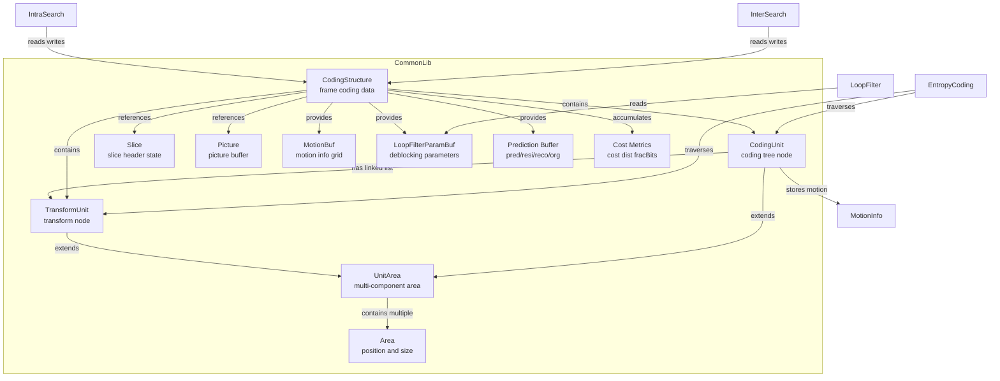
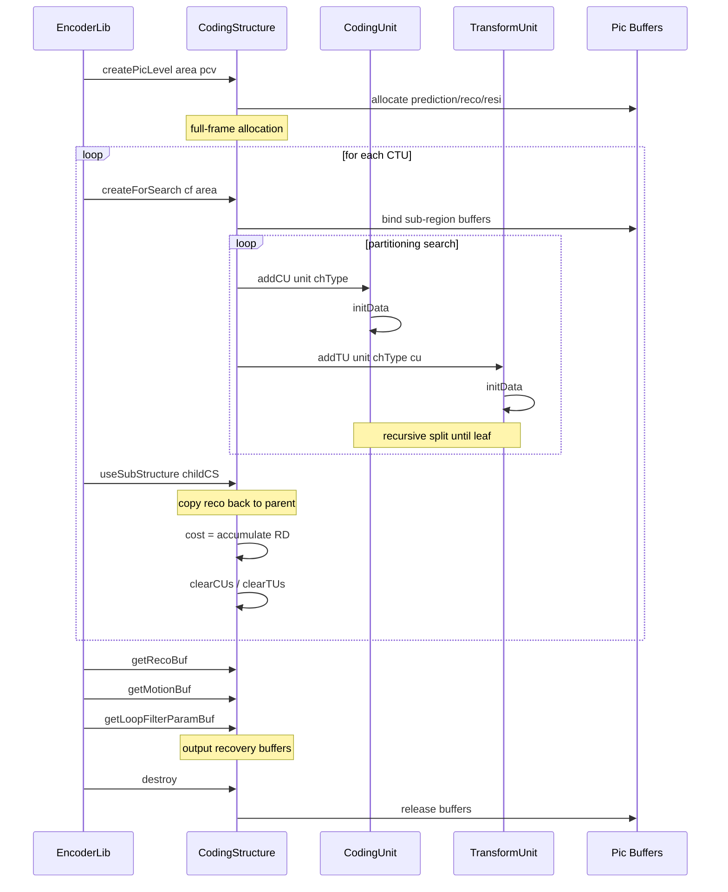
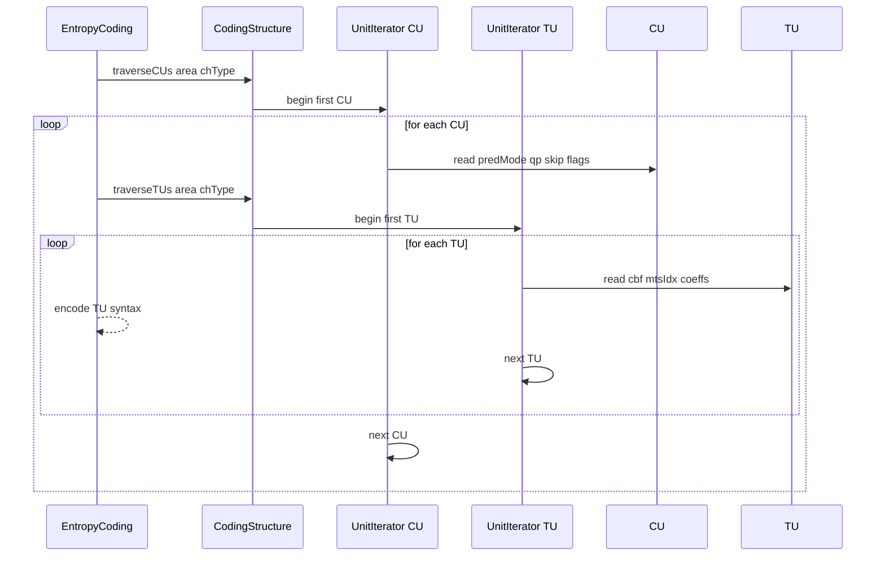

# CodingStructure — Frame-Level Coding Data Container

## 1. Overview

The `CodingStructure` class holds all coding information for a VVC picture region: partitioning trees CUs, TUs, reference picture buffers prediction/residual/reconstruction, motion information map, SAO/ALF loop-filter parameters, and RD cost accumulators. It serves as the central data hub between the encoder's search, motion estimation, and entropy coding stages.

**Dependencies**: `Unit.h` (`UnitArea`, `CompArea`, `CodingUnit`, `TransformUnit`), `Slice.h`, `CommonDef.h`, `UnitPartitioner.h`, `Buffer.h`.

**Lifecycle**: Created via `createPicLevel` at picture boundaries or `createForSearch` for sub-region search; destroyed via `destroy`. Sub-structures are spliced in/out via `useSubStructure` / `copyStructure` during recursive partitioning search.

## 2. Component Specifications

### 2.1 Enum: `PictureType`

```cpp
namespace vvenc {

enum PictureType
{
  PIC_RECONSTRUCTION = 0,
  PIC_ORIGINAL,
  PIC_ORIGINAL_RSP,
  PIC_PREDICTION,
  PIC_RESIDUAL,
  PIC_SAO_TEMP,
  NUM_PIC_TYPES,
  PIC_ORIGINAL_RSP_REC,
};

}
```

### 2.2 Class: `CodingStructure`

```cpp
#pragma once

#include "Unit.h"
#include "CommonDef.h"
#include "UnitPartitioner.h"
#include "Slice.h"

#include <vector>
#include <mutex>

namespace vvenc {

struct Picture;

class CodingStructure
{
public:

  UnitArea         area;
  UnitArea         _maxArea;

  Picture*         picture;
  CodingStructure* parent;
  CodingStructure* lumaCS;
  Slice*           slice;

  UnitScale        unitScale[MAX_NUM_COMP];

  int         baseQP;
  int         prevQP[MAX_NUM_CH];
  int         currQP[MAX_NUM_CH];
  int         chromaQpAdj;
  const SPS*  sps;
  const PPS*  pps;
  PicHeader*  picHeader;
  APS*        alfAps[ALF_CTB_MAX_NUM_APS];
  APS*        lmcsAps;
  APS*        scalinglistAps;
  const VPS*  vps;
  const PreCalcValues* pcv;

  CodingStructure( XUCache& unitCache, std::mutex* mutex );
  void createPicLevel( const UnitArea& _unit, const PreCalcValues* _pcv );
  void createForSearch( const ChromaFormat _chromaFormat, const Area& _area );
  void destroy();
  void releaseIntermediateData();

  void rebindPicBufs();
  void createCoeffs();
  void destroyCoeffs();

  void allocateVectorsAtPicLevel();

  // --- global accessors ---

  const CodingUnit*    getCU(const Position& pos, const ChannelType _chType, const TreeType _treeType) const;
  const TransformUnit* getTU(const Position& pos, const ChannelType _chType, const int subTuIdx = -1) const;

  CodingUnit*          getCU(const Position& pos, const ChannelType _chType, const TreeType _treeType);
  CodingUnit*          getLumaCU( const Position& pos );
  TransformUnit*       getTU(const Position& pos, const ChannelType _chType, const int subTuIdx = -1);

  const CodingUnit*    getCU(const ChannelType& _chType, const TreeType _treeType) const;
  const TransformUnit* getTU(const ChannelType& _chType) const;

  CodingUnit*          getCU(const ChannelType& _chType, const TreeType _treeType);
  TransformUnit*       getTU(const ChannelType& _chType);

  const CodingUnit*    getCURestricted(const Position& pos, const Position curPos,
                          const unsigned curSliceIdx, const unsigned curTileIdx,
                          const ChannelType _chType, const TreeType treeType) const;
  const CodingUnit*    getCURestricted(const Position& pos, const CodingUnit& curCu,
                          const ChannelType _chType) const;
  const TransformUnit* getTURestricted(const Position& pos, const TransformUnit& curTu,
                          const ChannelType _chType) const;

  CodingUnit&     addCU(const UnitArea& unit, const ChannelType _chType, CodingUnit* cuInit = nullptr);
  TransformUnit&  addTU(const UnitArea& unit, const ChannelType _chType,
                        CodingUnit* cu, TransformUnit* tuInit = nullptr);
  void addEmptyTUs( Partitioner &partitioner, CodingUnit* cu );

  CUTraverser     traverseCUs(const UnitArea& _unit, const ChannelType _chType);
  TUTraverser     traverseTUs(const UnitArea& _unit, const ChannelType _chType);

  cCUTraverser    traverseCUs(const UnitArea& _unit, const ChannelType _chType) const;
  cTUTraverser    traverseTUs(const UnitArea& _unit, const ChannelType _chType) const;

  // --- encoding search utilities ---

  double      cost;
  double      costDbOffset;
  double      lumaCost;
  uint64_t    fracBits;
  Distortion  dist;
  Distortion  interHad;

  void initStructData  ( const int QP = MAX_INT, const bool skipMotBuf = true,
                         const UnitArea* area = nullptr );
  void initSubStructure( CodingStructure& cs, const ChannelType chType,
                         const UnitArea& subArea, const bool isTuEnc,
                         PelStorage* pOrgBuffer = nullptr,
                         PelStorage* pRspBuffer = nullptr);
  void compactResize   ( const UnitArea& area );

  void copyStructure   (const CodingStructure& cs, const ChannelType chType,
                        const TreeType treeType, const bool copyTUs = false,
                        const bool copyRecoBuffer = false);
  void useSubStructure ( CodingStructure& cs, const ChannelType chType,
                         const TreeType treeType, const UnitArea& subArea,
                         const bool cpyRecoToPic = true);

  void clearTUs( bool force = false );
  void clearCUs( bool force = false );

  void createTempBuffers( const bool isTopLayer );
  void destroyTempBuffers();

  // --- public data ---

  std::vector<    CodingUnit*> cus;
  std::vector< TransformUnit*> tus;

  LutMotionCand motionLut;
  std::vector<LutMotionCand> motionLutBuf;
  void addMiToLut(static_vector<HPMVInfo, MAX_NUM_HMVP_CANDS>& lut, const HPMVInfo &mi);

  // --- motion buffer access ---

  CodingStructure*  bestParent;
  bool              resetIBCBuffer;

  MotionBuf getMotionBuf( const     Area& _area );
  MotionBuf getMotionBuf( const UnitArea& _area );
  MotionBuf getMotionBuf();

  const CMotionBuf getMotionBuf( const     Area& _area ) const;
  const CMotionBuf getMotionBuf( const UnitArea& _area ) const;
  const CMotionBuf getMotionBuf() const;

  MotionInfo& getMotionInfo( const Position& pos );
  const MotionInfo& getMotionInfo( const Position& pos ) const;

  MotionInfo const* getMiMapPtr()    const;
  MotionInfo      * getMiMapPtr();
  ptrdiff_t         getMiMapStride() const;

  // --- loop filter parameter access ---

  LFPBuf getLoopFilterParamBuf(const DeblockEdgeDir& edgeDir);
  const CLFPBuf getLoopFilterParamBuf(const DeblockEdgeDir& edgeDir) const;

  LoopFilterParam const* getLFPMapPtr   ( const DeblockEdgeDir edgeDir ) const;
  LoopFilterParam      * getLFPMapPtr   ( const DeblockEdgeDir edgeDir );
  ptrdiff_t              getLFPMapStride() const;

  // --- temporary data buffers ---

         PelBuf       getPredBuf(const CompArea& blk);
         PelBuf       getResiBuf(const CompArea& blk);
         PelBuf       getRecoBuf(const CompArea& blk);
         PelBuf       getOrgBuf(const CompArea& blk);
         PelBuf       getRspOrgBuf(const CompArea& blk);
         PelBuf       getRspRecoBuf(const CompArea &blk);
  const CPelBuf       getPredBuf(const CompArea& blk) const;
  const CPelBuf       getResiBuf(const CompArea& blk) const;
  const CPelBuf       getRecoBuf(const CompArea& blk) const;
  const CPelBuf       getOrgBuf(const CompArea& blk) const;
  const CPelBuf       getRspOrgBuf(const CompArea& blk) const;
  const CPelBuf       getRspRecoBuf(const CompArea &blk) const;

         PelUnitBuf   getPredBuf(const UnitArea& unit);
         PelUnitBuf   getResiBuf(const UnitArea& unit);
         PelUnitBuf   getRecoBuf(const UnitArea& unit);
         PelUnitBuf   getOrgBuf(const UnitArea& unit);
  const CPelUnitBuf   getPredBuf(const UnitArea& unit) const;
  const CPelUnitBuf   getResiBuf(const UnitArea& unit) const;
  const CPelUnitBuf   getRecoBuf(const UnitArea& unit) const;
  const CPelUnitBuf   getOrgBuf(const UnitArea& unit) const;

  // --- direct buffer references ---

         PelUnitBuf&  getPredBuf();
         PelUnitBuf&  getResiBuf();
         PelUnitBuf&  getRecoBuf();
         PelUnitBuf&  getOrgBuf();
  const CPelUnitBuf   getPredBuf() const;
  const CPelUnitBuf   getResiBuf() const;
  const CPelUnitBuf   getRecoBuf() const;
  const CPelUnitBuf   getOrgBuf() const;

         PelUnitBuf&  getRecoBufRef();
         PelBuf&      getRspRecoBuf();
  const CPelBuf       getRspRecoBuf() const;
         PelBuf&      getRspOrgBuf();
  const CPelBuf       getRspOrgBuf() const;
};

}
```

### 2.3 Supporting Structs

```cpp
namespace vvenc {

struct Area : public Position, public Size
{
  Area();
  Area(const Position& _pos, const Size& _size);
  Area(PosType _x, PosType _y, SizeType _w, SizeType _h);

  Position& pos();
  const Position& pos() const;
  Size& size();
  const Size& size() const;

  const Position& topLeft() const;
  Position topRight() const;
  Position bottomLeft() const;
  Position bottomRight() const;
  Position center() const;

  bool contains(const Position& _pos) const;
  bool contains(const Area& _area) const;
};

struct UnitArea
{
  ChromaFormat     chromaFormat;
  UnitBlocksType   blocks;

  CompArea& Y();
  const CompArea& Y() const;
  CompArea& Cb();
  const CompArea& Cb() const;
  CompArea& Cr();
  const CompArea& Cr() const;
  CompArea& block(const ComponentID comp);
  const CompArea& block(const ComponentID comp) const;

  bool contains(const UnitArea& other) const;
  bool contains(const UnitArea& other, const ChannelType chType) const;

  const Position& lumaPos() const;
  const Size& lumaSize() const;
  const Position& chromaPos() const;
  const Size& chromaSize() const;

  SizeType lwidth() const;
  SizeType lheight() const;
  PosType lx() const;
  PosType ly() const;

  bool valid() const;
};

struct CodingUnit : public UnitArea,
                    public IntraPredictionData,
                    public InterPredictionData
{
  CodingStructure*  cs;
  ChannelType       chType;
  Slice*            slice;

  PredMode          predMode;
  uint8_t           depth;
  uint8_t           qtDepth;
  uint8_t           btDepth;
  uint8_t           mtDepth;
  int8_t            qp;
  int8_t            chromaQpAdj;
  SplitSeries       splitSeries;
  TreeType          treeType;
  ModeType          modeType;
  bool              skip;
  bool              affine;
  bool              geo;
  uint8_t           imv;
  uint8_t           sbtInfo;
  uint8_t           mtsFlag;
  uint8_t           lfnstIdx;
  uint8_t           BcwIdx;
  uint8_t           ispMode;
  uint32_t          tileIdx;

  void initData();
  void initPuData();

  const MotionInfo& getMotionInfo() const;
  const MotionInfo& getMotionInfo(const Position& pos) const;
  MotionBuf getMotionBuf();
  CMotionBuf getMotionBuf() const;

  unsigned       idx;
  CodingUnit*    next;
  TransformUnit* firstTU;
  TransformUnit* lastTU;
};

struct TransformUnit : public UnitArea
{
  CodingUnit*      cu;
  CodingStructure* cs;
  ChannelType      chType;
  int              chromaAdj;
  bool             noResidual;
  uint8_t          jointCbCr;
  uint8_t          mtsIdx[MAX_NUM_TBLOCKS];
  uint8_t          cbf[MAX_NUM_TBLOCKS];
  int16_t          lastPos[MAX_NUM_TBLOCKS];

  unsigned         idx;
  TransformUnit*   next;
  TransformUnit*   prev;

  CoeffSigBuf getCoeffs(ComponentID id);
  const CCoeffSigBuf getCoeffs(ComponentID id) const;
};

struct CtuInfo
{
  // CTU-level coding statistics and boundary information.
};

}
```

## 3. System Architecture



## 4. Detailed Data Flow

### 4.1 Frame Encoding Lifecycle



### 4.2 CU/TU Traversal Flow



## 5. Visualisation

### 5.1 Animation Description

The CodingStructure data-flow animation visualises the frame encoding lifecycle across 14 keyframes:

- **AreaView**: A rectangle representing the current coding area, shrinking as partition depth increases.
- **BufferBar**: Stacked horizontal bars showing prediction/residual/reconstruction buffer sizes.
- **CUCountBadge**: A counter of live CU/TU objects in the current structure.
- **CostMeter**: A gauge showing accumulated RD cost, dist, and fracBits.
- **OperationFeed**: A scrollable log of method calls.

**Keyframe sequence**:
1. `createPicLevel` — full-frame area shown, buffers allocated
2. `allocateVectorsAtPicLevel` — CU/TU vectors sized
3. `createForSearch` — sub-area selected
4. `addCU` — first CU added
5. `addTU` — first TU attached to CU
6. `addEmptyTUs` — child TUs added via partitioner
7. `useSubStructure` — child substructure spliced in
8. `copyStructure` — result copied back
9. `cost accumulation` — cost/dist/fracBits updated
10. `getPredBuf` / `getResiBuf` — buffer access highlighted
11. `getMotionBuf` — motion info grid highlighted
12. `getLoopFilterParamBuf` — deblocking params highlighted
13. `clearCUs` / `clearTUs` — CU/TU count drops
14. `destroy` — all resources released

### 5.2 Animation Source

Not applicable — D3 animation not required for this spec.

## 6. Testing Requirements

### Unit Tests (new file: `test/vvenc_unit_test/coding_structure_test.cpp`)

| Test ID | Method / Function | What to Verify |
|---|---|---|
| `CS_CREATE_PIC_LEVEL` | `createPicLevel` | area matches, buffers non-null |
| `CS_CREATE_FOR_SEARCH` | `createForSearch` | sub-area correctly bound |
| `CS_ADD_CU` | `addCU` | CU inserted into cus vector, valid chType |
| `CS_ADD_TU` | `addTU` | TU inserted into tus vector, linked to CU |
| `CS_GET_CU` | `getCU pos chType treeType` | returns correct CU at position |
| `CS_GET_TU` | `getTU pos chType` | returns correct TU at position |
| `CS_GET_RESTRICTED` | `getCURestricted` | respects slice/tile boundaries |
| `CS_TRAVERSE_CUS` | `traverseCUs` | iterator visits all CUs in area |
| `CS_TRAVERSE_TUS` | `traverseTUs` | iterator visits all TUs in area |
| `CS_COPY_STRUCTURE` | `copyStructure` | deep copy preserves tree topology |
| `CS_USE_SUB_STRUCTURE` | `useSubStructure` | child reco merged into parent |
| `CS_PRED_BUF` | `getPredBuf` | returns valid PelBuf for CompArea |
| `CS_RESI_BUF` | `getResiBuf` | returns valid PelBuf for CompArea |
| `CS_RECO_BUF` | `getRecoBuf` | returns valid PelBuf for CompArea |
| `CS_ORG_BUF` | `getOrgBuf` | returns valid PelBuf for CompArea |
| `CS_MOTION_BUF` | `getMotionBuf` | returns non-null MotionBuf |
| `CS_MOTION_INFO` | `getMotionInfo pos` | returns valid MotionInfo at pos |
| `CS_LOOP_FILTER_PARAM` | `getLoopFilterParamBuf` | returns non-null LFPBuf |
| `CS_CLEAR_CUS` | `clearCUs` | cus vector cleared |
| `CS_CLEAR_TUS` | `clearTUs` | tus vector cleared |
| `CS_COST_ACCUM` | `cost` / `dist` / `fracBits` | members readable after encode |
| `CS_DESTROY` | `destroy` | all resources released |

### Calling-Order Validation

- `createPicLevel` must be called before any `addCU` / `addTU`.
- `createForSearch` must be called after `createPicLevel` for sub-region encoding.
- `clearCUs` / `clearTUs` must not be called during active traversal.
- `useSubStructure` must be called while source CS is still valid.

### Parameter Range Tests

- `addCU` / `addTU`: verify with all valid `ChromaFormat` and `ChannelType` values.
- `getCU` / `getTU`: out-of-range Position returns nullptr.
- `createForSearch`: zero-area sub-region returns gracefully.

### Integration Tests

Covered by `vvenc_unit_test.cpp` which exercises full encode/decode cycles through CodingStructure. New dedicated file supplements but does not modify the regression baseline.

## 7. CLI Entry Point

Not directly exposed via CLI. `CodingStructure` is an internal container consumed by `EncoderLib`, `DecoderLib`, and all coding tools within `CommonLib`.
