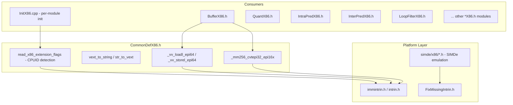
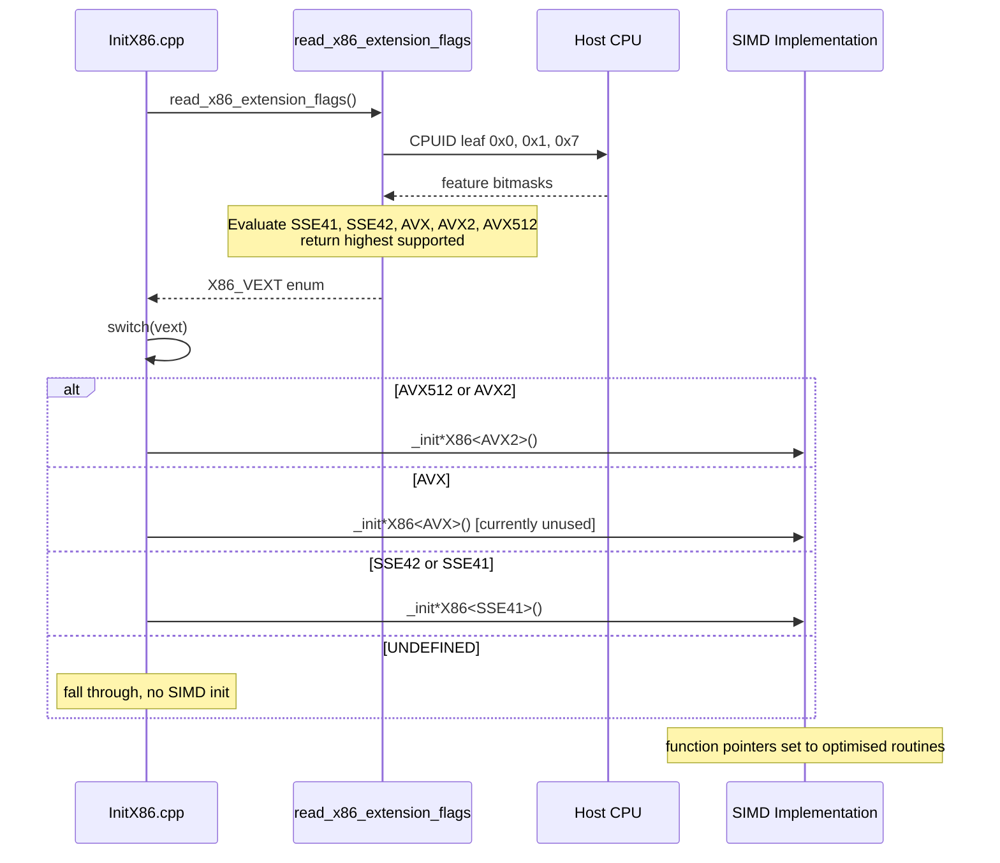

# CommonDefX86 — x86 CPUID / SIMD Extension Detection

## 1. Overview

`CommonDefX86.h` provides x86 SIMD abstraction for the VVenC encoder. It handles CPUID-based extension detection, maps VVC encoder SIMD levels (SSE41, SSE42, AVX, AVX2, AVX512) to the appropriate SIMDe or native intrinsic headers, and defines utility macros (`_vv_loadl_epi64` / `_vv_storel_epi64`) and helper functions (`_mm256_cvtepi32_epi16x`) used by per-module SIMD implementations.

**Dependencies**: `CommonDef.h`, `FixMissingIntrin.h`, `<immintrin.h>` (Linux) or `<intrin.h>` (Windows), optionally `<simde/x86/*.h>` for cross-platform emulation.

**Lifecycle**: Stateless — all functions are queries (`read_x86_extension_flags`) or inline helpers. No initialization required beyond the first call to `read_x86_extension_flags`, which caches the result internally.

## 2. Component Specifications

### 2.1 SIMD selection logic

```cpp
#if defined(TARGET_SIMD_X86) && ENABLE_SIMD_OPT

#  if REAL_TARGET_X86 || REAL_TARGET_WASM
#    ifdef _WIN32
#      include <intrin.h>
#    else
#      include <immintrin.h>
#    endif
#  else
#    define SIMDE_ENABLE_NATIVE_ALIASES
#  endif

#  include "FixMissingIntrin.h"

#  ifdef USE_AVX512
#    define SIMDX86 AVX512
#    include <simde/x86/avx512.h>
#  elif defined USE_AVX2
#    define SIMDX86 AVX2
#    include <simde/x86/avx2.h>
#  elif defined USE_AVX
#    define SIMDX86 AVX
#    include <simde/x86/avx.h>
#  elif defined USE_SSE42
#    define SIMDX86 SSE42
#    include <simde/x86/sse4.2.h>
#  elif defined USE_SSE41
#    define SIMDX86 SSE41
#    include <simde/x86/sse4.1.h>
#  endif

namespace vvenc {
using namespace x86_simd;
```

### 2.2 Extension query API

| Function | Signature | Purpose |
|---|---|---|
| `x86_vext_to_string` | `(X86_VEXT)` → `const std::string&` | Convert extension enum to human-readable name |
| `string_to_x86_vext` | `(const std::string&)` → `X86_VEXT` | Parse extension name string back to enum |
| `read_x86_extension_flags` | `(X86_VEXT request = UNDEFINED)` → `X86_VEXT` | Detect host CPU capabilities, return highest supported level |
| `read_x86_extension_name` | `()` → `const std::string&` | Return name of highest detected extension |

The `X86_VEXT` enum (from `x86_simd` namespace) ranks: `UNDEFINED < SSE41 < SSE42 < AVX < AVX2 < AVX512`.

### 2.3 Portability macros

```cpp
#if (defined REAL_TARGET_ARM && !defined REAL_TARGET_AARCH64)
#  define _vv_loadl_epi64  _mm_loadu_si64
#  define _vv_storel_epi64 _mm_storeu_si64
#else
#  define _vv_loadl_epi64  _mm_loadl_epi64
#  define _vv_storel_epi64 _mm_storel_epi64
#endif
```

### 2.4 AVX2 utility

```cpp
static inline __m128i _mm256_cvtepi32_epi16x( __m256i& v )
{
  return _mm_packs_epi32(
    _mm256_castsi256_si128( v ),
    _mm256_extracti128_si256( v, 1 ) );
}
```

## 3. Dependency Graph



## 4. Detailed Data Flow



## 5. Visualisation

No D3 animation — CPUID detection is a one-shot query at encoder startup with no interactive visualisation component.

## 6. Testing Requirements

### Unit Tests

| Test ID | Function | What to Verify |
|---|---|---|
| `X86_VEXT_STRING_ROUNDTRIP` | `x86_vext_to_string` + `string_to_x86_vext` | Round-trip: `string_to_x86_vext(x86_vext_to_string(e)) == e` for all `X86_VEXT` values |
| `X86_VEXT_STRING_INVALID` | `string_to_x86_vext("INVALID")` | Returns `UNDEFINED` or throws |
| `X86_READ_FLAGS_DEFAULT` | `read_x86_extension_flags()` | Returns at least `SSE41` on x86-64 host |
| `X86_READ_FLAGS_REQUEST` | `read_x86_extension_flags(AVX2)` | Returns `AVX2` when host supports it and request <= host; returns host max otherwise |
| `X86_READ_NAME` | `read_x86_extension_name()` | Returns non-empty string matching detected extension |
| `X86_MM256_PACK` | `_mm256_cvtepi32_epi16x` | AVX2 pack: 8×int32 → 8×int16 with saturation |
| `X86_VV_LOAD_MACRO` | `_vv_loadl_epi64` | Loads 64-bit without alignment fault on ARM 32-bit |
| `X86_VV_STORE_MACRO` | `_vv_storel_epi64` | Stores 64-bit without alignment fault on ARM 32-bit |
| `X86_SIMDE_ALIASES` | `SIMDE_ENABLE_NATIVE_ALIASES` guard | Defined iff !REAL_TARGET_X86 && !REAL_TARGET_WASM |

### Cross-Compilation Validation

- `TARGET_SIMD_X86` and `ENABLE_SIMD_OPT` must be defined for any SIMD code to compile.
- The `SIMDX86` macro must match the highest `USE_*` define present.
- Only one `USE_*` define should be active; conflicting defines must produce a compile error.

## 7. CLI Entry Point

Not directly exposed via CLI. `read_x86_extension_flags` is invoked internally by `InitX86.cpp` at startup. The `--simd` encoder CLI flag (if present in the encoder wrapper) controls which `USE_*` define is compiled.
