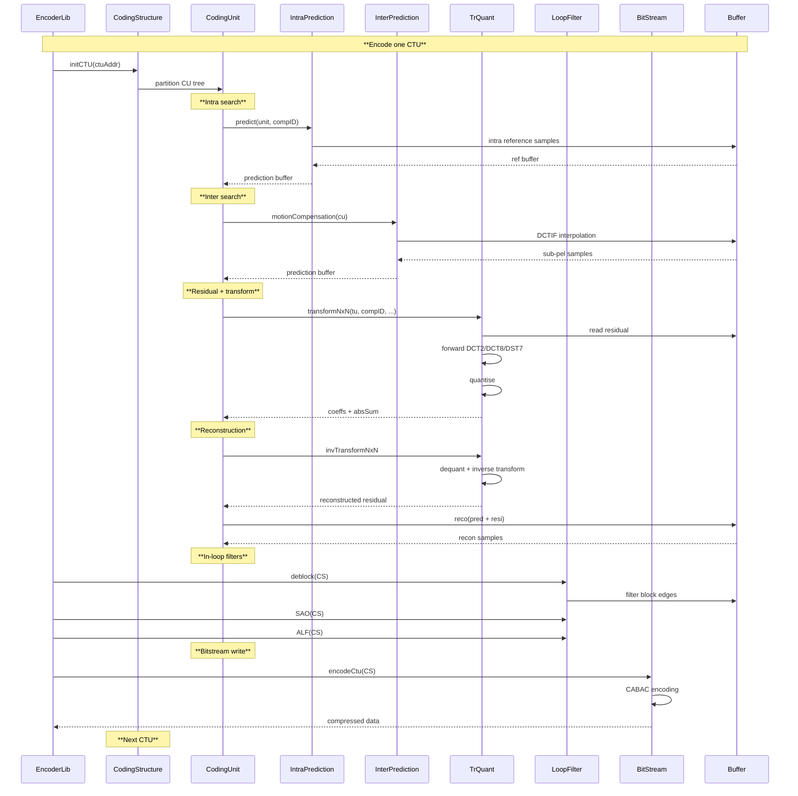

# CommonLib — Common Library (Innermost Dependency Layer)

## 1. Overview

CommonLib is the innermost dependency layer of the VVenC encoder. It provides all fundamental data types, coding tools, and infrastructure used by every higher-level module (EncoderLib, DecoderLib). No module depends on EncoderLib or DecoderLib; all modules depend on CommonLib.

**Dependencies**: None within the encoder — depends only on standard library and platform intrinsics.

**Lifecycle**: No single lifecycle — components are constructed individually by higher-level modules.

## 2. Component Specifications

| # | Spec File | Role |
|---|-----------|------|
| 1 | `AdaptiveLoopFilter.spec.md` | ALF filter class — luma/chroma Wiener-based adaptive loop filter |
| 2 | `AffineGradientSearch.spec.md` | Affine gradient-based motion refinement |
| 3 | `BitStream.spec.md` | Bitstream read/write with Annex-B start-code emulation |
| 4 | `Buffer.spec.md` | PelBuf/CPelBuf 2D buffer descriptors, pixel ops, SIMD dispatch |
| 5 | `CodingStructure.spec.md` | Per-frame coding state — CTU/CU/PU/TU tree, reference pictures |
| 6 | `CommonDefX86.spec.md` | x86 SIMD detection and dispatch tables (SSE4/AVX2/AVX-512) |
| 7 | `ContextModelling.spec.md` | CABAC context derivation per coding tool |
| 8 | `Contexts.spec.md` | CABAC context state arrays and initialisation |
| 9 | `DepQuant.spec.md` | Dependent quantisation (DP-65, DP-83 variants) |
| 10 | `dtrace.spec.md` | Debug trace logging infrastructure |
| 11 | `InitX86.spec.md` | x86 SIMD feature detection and kernel initialisation; populates g_vvenc via syncToGlobal() |
| 12 | `Primitives.spec.md` | Central VVencPrimitive dispatch table — g_vvenc global, vvenc_setup_primitives chain, full dispatch catalog |
| 13 | `asm-primitives.spec.md` | NASM assembly registration infrastructure — setupAssemblyPrimitives(), extern C declarations |
| 14 | `InterpolationFilter.spec.md` | DCTIF interpolation filter for sub-pel motion compensation |
| 15 | `InterPrediction.spec.md` | Inter prediction — motion compensation, weighted prediction, BDOF |
| 16 | `IntraPrediction.spec.md` | Intra prediction — DC/Planar/Angular/MIP/CCLM |
| 17 | `LoopFilter.spec.md` | Deblocking filter (VVC-style wider-strength, luma/chroma) |
| 18 | `MatrixIntraPrediction.spec.md` | MIP — matrix-based intra prediction |
| 19 | `MCTF.spec.md` | Motion-compensated temporal filter (denoising pre-filter) |
| 20 | `Mv.spec.md` | Motion vector with arithmetic, precision, AMVR/affine/IBC helpers |
| 21 | `PicYuvMD5.spec.md` | MD5 hash computation for picture data |
| 22 | `Picture.spec.md` | Picture buffer management, PicShared pool |
| 23 | `ProfileLevelTier.spec.md` | VVC profile/tier/level constraints and checks |
| 24 | `Quant.spec.md` | Base quantisation — HDQ, sign hiding, scaling lists |
| 25 | `QuantRDOQ.spec.md` | RDO quantisation (rate-distortion optimised quant) |
| 26 | `QuantRDOQ2.spec.md` | Integer-only RDOQ variant |
| 27 | `RdCost.spec.md` | Rate-distortion cost computation (SSE/weighted) |
| 28 | `Reshape.spec.md` | In-loop luma mapping with chroma scaling (reshaping) |
| 29 | `Rom.spec.md` | ROM tables — transforms, quantisation, scan patterns |
| 30 | `SampleAdaptiveOffset.spec.md` | SAO — sample adaptive offset loop filter |
| 31 | `SearchSpaceCounter.spec.md` | Encoder search-space statistics counter |
| 32 | `SEI.spec.md` | SEI message types and parameter set storage |
| 33 | `Slice.spec.md` | Slice header, PPS, SPS, VPS parameter sets |
| 34 | `StatCounter.spec.md` | Per-picture statistics accumulator |
| 35 | `TimeProfiler.spec.md` | Lightweight timing profiler for encoder stages |
| 36 | `TrQuant.spec.md` | Forward/inverse transform + quantisation pipeline |
| 37 | `TrQuant_EMT.spec.md` | EMT — explicit multiple transform selection |
| 38 | `Unit.spec.md` | Coding unit / prediction unit / transform unit data structures |
| 39 | `UnitPartitioner.spec.md` | CTU partitioning — QT/MTT/BT/TT split decision logic |
| 40 | `UnitTools.spec.md` | Helper functions for unit geometry and neighbour access |

## 3. System Architecture

```mermaid
graph TB
    subgraph Core_Data
        Mv[Mv<br/>motion vector]
        Unit[Unit<br/>CU/PU/TU structures]
        Position[Position / Size<br/>geometry types]
        Picture[Picture<br/>frame buffer]
        CodingStructure[CodingStructure<br/>CTU tree state]
        Slice[Slice / PPS / SPS / VPS<br/>param sets]
        Rom[Rom<br/>ROM lookup tables]
    end

    subgraph Transform
        TrQuant[TrQuant<br/>transform + quant pipeline]
        TrQuant_EMT[TrQuant_EMT<br/>explicit MTS]
        DepQuant[DepQuant<br/>dependent quantisation]
        Quant[Quant<br/>base quantiser]
        QuantRDOQ[QuantRDOQ<br/>RDOQ]
        QuantRDOQ2[QuantRDOQ2<br/>integer RDOQ]
    end

    subgraph Prediction
        IntraPrediction[IntraPrediction<br/>DC/Planar/Angular/MIP/CCLM]
        MatrixIntraPrediction[MatrixIntraPrediction<br/>MIP]
        InterPrediction[InterPrediction<br/>MC/weighted/BDOF]
        InterpolationFilter[InterpolationFilter<br/>DCTIF sub-pel]
        AffineGradientSearch[AffineGradientSearch<br/>affine refinement]
        MCTF[MCTF<br/>temporal filter]
    end

    subgraph Loop_Filters
        AdaptiveLoopFilter[AdaptiveLoopFilter<br/>ALF]
        SampleAdaptiveOffset[SampleAdaptiveOffset<br/>SAO]
        LoopFilter[LoopFilter<br/>deblocking]
        Reshape[Reshape<br/>luma mapping]
    end

    subgraph Infrastructure
        BitStream[BitStream<br/>Annex-B I/O]
        Buffer[Buffer<br/>pixel operations]
        Contexts[Contexts<br/>CABAC states]
        ContextModelling[ContextModelling<br/>ctx derivation]
        RdCost[RdCost<br/>RD cost]
        dtrace[dtrace<br/>debug trace]
        TimeProfiler[TimeProfiler<br/>profiling]
        StatCounter[StatCounter<br/>statistics]
        SearchSpaceCounter[SearchSpaceCounter<br/>search stats]
        ProfileLevelTier[ProfileLevelTier<br/>PTL constraints]
        SEI[SEI<br/>messages]
        PicYuvMD5[PicYuvMD5<br/>MD5 hash]
        InitX86[InitX86<br/>SIMD detection]
        CommonDefX86[CommonDefX86<br/>SIMD dispatch]
    end

    CodingStructure -->|owns| Unit
    CodingStructure -->|references| Picture
    CodingStructure -->|reads| Slice

    Prediction -->|reads/writes| Mv
    Prediction -->|reads| CodingStructure
    Prediction -->|uses| InterpolationFilter
    Prediction -->|uses| Buffer

    Transform -->|reads| CodingStructure
    Transform -->|uses| Quant
    Transform -->|uses| DepQuant
    Transform -->|uses| Contexts
    Transform -->|uses| Rom

    Loop_Filters -->|reads| CodingStructure
    Loop_Filters -->|uses| Buffer

    Infrastructure -->|used by all| Prediction
    Infrastructure -->|used by all| Transform
    Infrastructure -->|used by all| Loop_Filters
```

### 3.1 SIMD Variant Summary

| Component | x86 (SSE4.1) | x86 (AVX2) | x86 (AVX-512) | ARM NEON | ARM SVE |
|-----------|:---:|:---:|:---:|:---:|:---:|
| Buffer ops (PelBufferOps) | ✓ | ✓ | ✓ | ✓ | — |
| InterpolationFilter | ✓ | ✓ | ✓ | ✓ | — |
| IntraPrediction | ✓ | ✓ | ✓ | ✓ | — |
| InterPrediction | ✓ | ✓ | ✓ | ✓ | — |
| AdaptiveLoopFilter | ✓ | ✓ | ✓ | — | — |
| SampleAdaptiveOffset | ✓ | ✓ | ✓ | — | — |
| LoopFilter | ✓ | ✓ | ✓ | — | — |
| TrQuant (transforms) | ✓ | ✓ | ✓ | — | — |
| Quant / DepQuant | ✓ | ✓ | ✓ | — | — |
| AffineGradientSearch | ✓ | ✓ | ✓ | — | — |
| MCTF | ✓ | ✓ | ✓ | ✓ | — |
| RdCost | ✓ | ✓ | ✓ | — | — |

## 4. Detailed Data Flow

## 5. Visualisation

No D3 animation — CommonLib is a static library of data types and coding tools. Individual component animations exist in the component-level spec files (see Mv, TrQuant, Buffer, etc.).

## 6. Testing Requirements

### Unit Tests (new file: `test/vvenc_unit_test/commonlib_test.cpp`)

| Test ID | Scope | What to Verify |
|---------|-------|---------------|
| `CL_ALL_COMPONENTS_LINK` | All 40 spec files | Each component header compiles and symbols resolve |
| `CL_MV_BASIC` | Mv | Construction, arithmetic, precision, clipping |
| `CL_BUFFER_OPS` | Buffer | PelBuf stride/layout, copy, padding, reconstruction |
| `CL_TRQUANT_ROUNDTRIP` | TrQuant | Forward + inverse transform round-trip preserves energy |
| `CL_CONTEXT_INIT` | Contexts | CABAC context tables initialised to VVC defaults |
| `CL_BITSTREAM_RW` | BitStream | Write + read back produces identical bit pattern |
| `CL_CODINGSTRUCT_LIFECYCLE` | CodingStructure | create/destroy cycle, CTU tree integrity |
| `CL_SLICE_PARAMS` | Slice | SPS/PPS/VPS field accessors and constraints |
| `CL_ROM_TABLES` | Rom | DCT2/DCT8/DST7 transform matrices match spec |

### Integration Tests

Covered by `vvenc_unit_test.cpp` which exercises CommonLib components through EncoderLib calls.

## 7. CLI Entry Point

Not directly exposed. CommonLib is statically linked into the encoder library (`libvvenc`) and consumed exclusively through EncoderLib.
