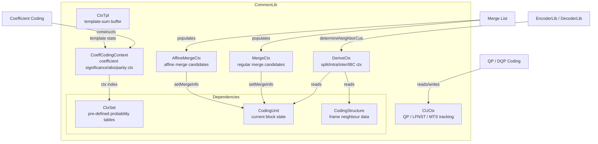
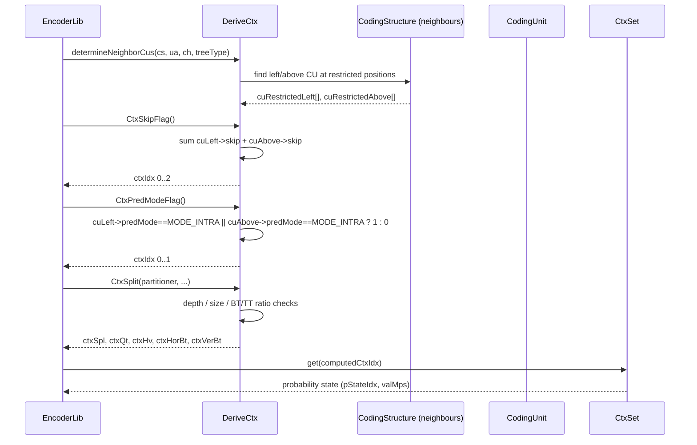
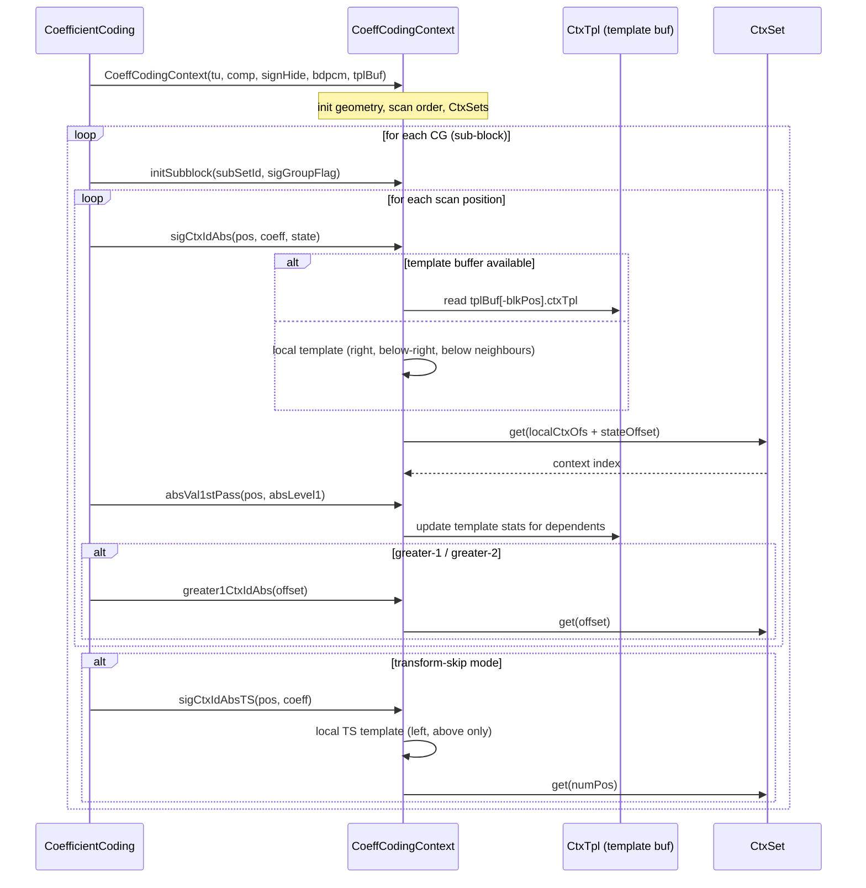

# ContextModelling — CABAC Context Derivation

## 1. Overview

The `ContextModelling` module provides CABAC probability context derivation functions for all VVC syntax elements. It is primarily a collection of structs (`DeriveCtx`, `CoeffCodingContext`, `CUCtx`, `MergeCtx`, `AffineMergeCtx`, `CtxTpl`) that implement context-index lookups based on spatial neighbour data, coefficient statistics, and coding-unit properties. Context derivation is deterministic given the neighbouring decoded state — no mutable global state persists between coding units.

**Dependencies**: `Contexts.h` (`CtxSet`), `Unit.h` / `UnitPartitioner.h` (coding unit/primitives), `Slice.h`, `CommonDef.h`.

**Lifecycle**: Instances are stack-allocated or embedded in encoder/decoder state (`CodingStructure`, `EncLib`, `DecLib`). `DeriveCtx` requires explicit `determineNeighborCus()` before use; `CoeffCodingContext` is constructed per transform unit and used as a stateless context resolver per coefficient pass.

## 2. Component Specifications

### 2.1 Struct: `CtxTpl`

```cpp
namespace vvenc {

/** \brief Template context for on-the-fly template-based coefficient coding.
 *         Lower 5 bits hold absSum1, upper 3 bits hold numPos.
 */
struct CtxTpl
{
  uint8_t ctxTpl;
};

}
```

### 2.2 Struct: `CoeffCodingContext`

```cpp
namespace vvenc {

/** \brief Context provider for residual coefficient coding (regular and transform-skip).
 *         Constructed per TransformUnit; provides inline context-ID methods for
 *         significance, parity, greater-1, greater-2, pass-1 absolute value,
 *         and sign-hiding decisions. Also manages sub-block (CG) scanning state.
 *
 *  \param[in]  tu        transform unit containing coefficient block geometry
 *  \param[in]  component colour component (luma/chroma)
 *  \param[in]  signHide  sign-bit hiding enabled
 *  \param[in]  bdpcm     BDPCM mode active
 *  \param[in]  tplBuf    optional template-sum buffer (nullptr = use on-the-fly template)
 */
struct CoeffCodingContext
{
  // --- Construction / sub-block init ---
  CoeffCodingContext(const TransformUnit& tu, ComponentID component, bool signHide, bool bdpcm = false, CtxTpl* tplBuf = nullptr);
  void initSubblock(int SubsetId, bool sigGroupFlag = false);

  // --- Significant-coefficient-group query ---
  void  resetSigGroup();
  void  setSigGroup();
  bool  noneSigGroup();
  int   lastSubSet();
  bool  isLastSubSet();
  bool  only1stSigGroup();
  void  setScanPosLast(int posLast);

  // --- Geometry / scan accessors ---
  ComponentID compID()                    const;
  int         subSetId()                  const;
  int         subSetPos()                 const;
  int         cgPosY()                    const;
  int         cgPosX()                    const;
  unsigned    width()                     const;
  unsigned    height()                    const;
  unsigned    log2CGWidth()               const;
  unsigned    log2CGHeight()              const;
  unsigned    log2CGSize()                const;
  int         maxLog2TrDRange()           const;
  unsigned    maxNumCoeff()               const;
  int         scanPosLast()               const;
  int         minSubPos()                 const;
  int         maxSubPos()                 const;
  bool        isLast()                    const;
  bool        isNotFirst()                const;
  bool        isSigGroup(int scanPosCG)   const;
  bool        isSigGroup()                const;
  bool        signHiding()                const;
  bool        hideSign(int posFirst, int posLast) const;
  unsigned    blockPos(int scanPos)       const;
  unsigned    posX(int scanPos)           const;
  unsigned    posY(int scanPos)           const;
  unsigned    maxLastPosX()               const;
  unsigned    maxLastPosY()               const;
  unsigned    lastXCtxId(unsigned posLastX)  const;
  unsigned    lastYCtxId(unsigned posLastY)  const;
  unsigned    sigGroupCtxId(bool ts = false) const;
  bool        bdpcm()                     const;

  // --- Regular-mode context derivation ---
  unsigned sigCtxIdAbs(int scanPos, const TCoeffSig* coeff, const int state);
  unsigned sigCtxIdAbsWithAcc(const int scanPos, const int state);
  void     absVal1stPass(const int scanPos, const TCoeffSig absLevel1);
  void     remAbsVal1stPass(const int scanPos, const TCoeffSig absLevel1);
  uint8_t  ctxOffsetAbs();
  unsigned parityCtxIdAbs(uint8_t offset)     const;
  unsigned greater1CtxIdAbs(uint8_t offset)   const;
  unsigned greater2CtxIdAbs(uint8_t offset)   const;
  unsigned templateAbsSum(int scanPos, const TCoeffSig* coeff, int baseLevel);

  // --- Transform-skip (TS) mode context derivation ---
  unsigned sigCtxIdAbsTS(int scanPos, const TCoeffSig* coeff);
  unsigned parityCtxIdAbsTS()                         const;
  unsigned greaterXCtxIdAbsTS(uint8_t offset)         const;
  unsigned lrg1CtxIdAbsTS(int scanPos, const TCoeffSig* coeff, int bdpcm);
  unsigned signCtxIdAbsTS(int scanPos, const TCoeffSig* coeff, int bdpcm);

  // --- TS neighbour helpers ---
  void neighTS(int& rightPixel, int& belowPixel, int scanPos, const TCoeffSig* coeff);
  int  deriveModCoeff(int rightPixel, int belowPixel, int absCoeff, int bdpcm = 0);
  int  decDeriveModCoeff(int rightPixel, int belowPixel, int absCoeff);

  // --- Data members ---
  int  remRegBins;  ///< remaining regular-coded bins (modified during coefficient decoding)
};

}
```

### 2.3 Struct: `CUCtx`

```cpp
namespace vvenc {

/** \brief CU-level context tracking for QP-delta and LFNST/MTS constraint flags.
 *         Lightweight struct constructed per coding unit.
 *
 *  \param[in]  _qp  initial QP for prediction (default-initialised to 0)
 */
struct CUCtx
{
  CUCtx();
  explicit CUCtx(int _qp);

  bool        isDQPCoded;                ///< DQP has been coded for this CU
  bool        isChromaQpAdjCoded;        ///< chroma QP adjustment coded
  bool        qgStart;                   ///< quantisation group start
  bool        lfnstLastScanPos;          ///< LFNST last-scan-position flag
  int8_t      qp;                        ///< previous QP for QP prediction
  bool        violatesLfnstConstrained[MAX_NUM_CH];  ///< LFNST constraint violation per channel
  bool        violatesMtsCoeffConstraint;            ///< MTS coefficient constraint violation
  bool        mtsLastScanPos;            ///< MTS last-scan-position flag
};

}
```

### 2.4 Struct: `MergeCtx`

```cpp
namespace vvenc {

/** \brief Regular merge candidate list context.
 *         Holds spatial/temporal merge candidates and BCW indices derived
 *         from neighbouring CUs during merge list construction.
 */
struct MergeCtx
{
  MergeCtx();

  void setMmvdMergeCandiInfo(CodingUnit& cu, const MmvdIdx candIdx) const;
  void setMergeInfo(CodingUnit& cu, const int candIdx) const;
  void getMmvdDeltaMv(const Slice& slice, const MmvdIdx candIdx, Mv deltaMv[NUM_REF_PIC_LIST_01]) const;

  MvField       mvFieldNeighbours[MRG_MAX_NUM_CANDS][NUM_REF_PIC_LIST_01];
  uint8_t       BcwIdx           [MRG_MAX_NUM_CANDS];
  unsigned char interDirNeighbours[MRG_MAX_NUM_CANDS];
  MergeType     mrgTypeNeighbours [MRG_MAX_NUM_CANDS];
  int           numValidMergeCand;
  bool          hasMergedCandList;

  MvField       mmvdBaseMv  [MMVD_BASE_MV_NUM][NUM_REF_PIC_LIST_01];
  bool          mmvdUseAltHpelIf[MMVD_BASE_MV_NUM];
  bool          useAltHpelIf[MRG_MAX_NUM_CANDS];
};

}
```

### 2.5 Struct: `AffineMergeCtx`

```cpp
namespace vvenc {

/** \brief Affine merge candidate list context.
 *         Holds up to AFFINE_MRG_MAX_NUM_CANDS candidates, each with
 *         3 control-point motion vectors per reference list.
 */
struct AffineMergeCtx
{
  AffineMergeCtx();

  MvField       mvFieldNeighbours[AFFINE_MRG_MAX_NUM_CANDS][NUM_REF_PIC_LIST_01][3];
  unsigned char interDirNeighbours[AFFINE_MRG_MAX_NUM_CANDS];
  EAffineModel  affineType       [AFFINE_MRG_MAX_NUM_CANDS];
  uint8_t       BcwIdx           [AFFINE_MRG_MAX_NUM_CANDS];
  int           numValidMergeCand;
  int           maxNumMergeCand;
  MergeType     mergeType        [AFFINE_MRG_MAX_NUM_CANDS];
  MotionBuf     subPuMvpMiBuf;
};

}
```

### 2.6 Struct: `DeriveCtx`

```cpp
namespace vvenc {

/** \brief Primary context-derivation dispatcher for VVC syntax elements.
 *         Provides inline static and member functions that map spatial
 *         neighbour properties to CABAC context indices.
 *
 *  Pre-condition: call determineNeighborCus() before invoking any Ctx* method.
 */
struct DeriveCtx
{
  const CodingUnit* cuRestrictedLeft[MAX_NUM_CH];
  const CodingUnit* cuRestrictedAbove[MAX_NUM_CH];

  /** \brief Resolve spatial neighbour CUs for context derivation.
   *  \param[in] cs        coding structure
   *  \param[in] ua        unit area (current block)
   *  \param[in] ch        channel type (luma / chroma)
   *  \param[in] treeType  coding tree type (single / dual)
   */
  void determineNeighborCus(const CodingStructure& cs, const UnitArea& ua,
                            const ChannelType ch, const TreeType treeType);

  /** \brief CBF context for a given component.
   *  \param[in] compID    colour component
   *  \param[in] prevCbf   previous CBF (for chroma inter)
   *  \param[in] ispIdx    ISP sub-partition index
   *  \retval CABAC context index
   */
  static unsigned CtxQtCbf(ComponentID compID, bool prevCbf = false, int ispIdx = 0);

  /** \brief Split-flag contexts (QT/BT/TT). */
  void CtxSplit(const Partitioner& partitioner, unsigned& ctxSpl, unsigned& ctxQt,
                unsigned& ctxHv, unsigned& ctxHorBt, unsigned& ctxVerBt,
                const bool canSplit[6]) const;

  /** \brief MIP flag context.
   *  \retval 0 or 1 based on intra mode of left/above neighbours
   */
  unsigned CtxMipFlag(const CodingUnit& cu) const;

  /** \brief Inter direction context.
   *  \retval 7 - floor(log2(cu.lumaSize().area() + 1) / 2)
   */
  unsigned CtxInterDir(const CodingUnit& cu) const;

  /** \brief Mode-consistency flag (intra neighbours → 1). */
  unsigned CtxModeConsFlag() const;

  /** \brief Affine flag context. Sum of left+above affine flags (0..2). */
  unsigned CtxAffineFlag() const;

  /** \brief Skip flag context. Sum of left+above skip flags (0..2). */
  unsigned CtxSkipFlag() const;

  /** \brief Pred-mode flag context (intra neighbour → 1). */
  unsigned CtxPredModeFlag() const;

  /** \brief IBC flag context. Sum of left+above IBC flags (0..2). */
  unsigned CtxIBCFlag(const CodingUnit& cu) const;
};

}
```

## 3. System Architecture



## 4. Detailed Data Flow

### 4.1 Syntax-Element Context Derivation



### 4.2 Coefficient Coding Context Flow



## 5. Visualisation

No D3 animation — context derivation is deterministic combinatoric logic with no animated data flow.

## 6. Testing Requirements

### Unit Tests

| Test ID | Struct / Method | What to Verify |
|---|---|---|
| `CTX_CBF_LUMA_ISP` | `DeriveCtx::CtxQtCbf(COMP_Y, false, ispIdx)` | ispIdx>0 for luma returns 2..3; ispIdx=0 returns 0 |
| `CTX_CBF_CHROMA` | `DeriveCtx::CtxQtCbf(COMP_Cr, true, 0)` | Cr+prevCbf returns 1 |
| `CTX_SPLIT_DEPTH` | `DeriveCtx::CtxSplit` | split context increases with BT/TT depth |
| `CTX_MIP_FLAG` | `DeriveCtx::CtxMipFlag` | 0 when neighbours non-intra; 1 when any neighbour is intra |
| `CTX_INTER_DIR` | `DeriveCtx::CtxInterDir` | larger blocks → smaller context index |
| `CTX_AFFINE_FLAG` | `DeriveCtx::CtxAffineFlag` | 0..2 based on left+above affine |
| `CTX_SKIP_FLAG` | `DeriveCtx::CtxSkipFlag` | 0..2 based on left+above skip |
| `CTX_IBC_FLAG` | `DeriveCtx::CtxIBCFlag` | 0..2 based on left+above IBC mode |
| `CTX_LAST_POS` | `CoeffCodingContext::lastXCtxId / lastYCtxId` | context shifts with posLast >> shift |
| `CTX_SIG_CG` | `CoeffCodingContext::sigGroupCtxId` | depends on neighbour CG significance |
| `CTX_SIG_REG` | `CoeffCodingContext::sigCtxIdAbs` | template-sum + diag-based context offset |
| `CTX_SIG_TS` | `CoeffCodingContext::sigCtxIdAbsTS` | numPos 0..2 based on left/above non-zero |
| `CTX_PARITY` | `CoeffCodingContext::parityCtxIdAbs` | context depends on template offset |
| `CTX_GREATER1` | `CoeffCodingContext::greater1CtxIdAbs` | context 0..4 based on template sum+diag |
| `CTX_GREATER2` | `CoeffCodingContext::greater2CtxIdAbs` | context 0..4 based on template sum+diag |
| `CTX_ABS1ST_UPDATE` | `CoeffCodingContext::absVal1stPass` | template buffer updated for 5 dependents |
| `CTX_CU_DQP` | `CUCtx` | isDQPCoded / isChromaQpAdjCoded propagate correctly |
| `CTX_MERGE_NUM` | `MergeCtx::numValidMergeCand` | correctly counts spatial+TMP candidates |
| `CTX_AFFINE_MERGE` | `AffineMergeCtx` | 3 control-point MVs per reference list |

### Calling-Order Validation

- `DeriveCtx::determineNeighborCus()` must be called before any `Ctx*` method — undefined otherwise.
- `CoeffCodingContext::initSubblock()` must be called per CG before per-position queries.
- `CoeffCodingContext::absVal1stPass()` must be called only for non-zero absolute levels.

### Parameter Range Tests

- `CtxQtCbf(compID, prevCbf, ispIdx)`: validate max returned index ≤ CtxSet allocation.
- `CtxInterDir(cu)`: verify area-based index never exceeds 6.
- `sigCtxIdAbs(pos, coeff, state)`: verify state 0..2 maps to correct CtxSet bank.
- `lastXCtxId(posLastX)`: verify posLastX >> shift does not overflow table.

### Integration Tests

Covered by `vvenc_unit_test.cpp` which exercises context derivation as part of full encode/decode cycle. Dedicated context-modelling tests supplement regression coverage without altering enc/dec baseline.

## 7. CLI Entry Point

Not directly exposed via CLI. Context-modelling functions are internal to the encoder and decoder libraries (`EncoderLib`, `DecoderLib`), invoked during CABAC coding of individual syntax elements.
