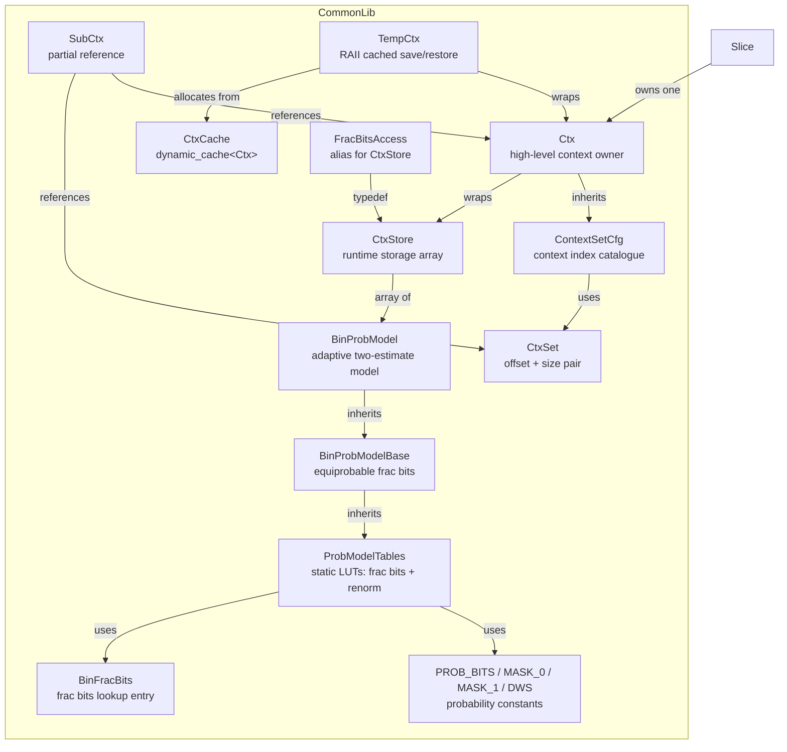
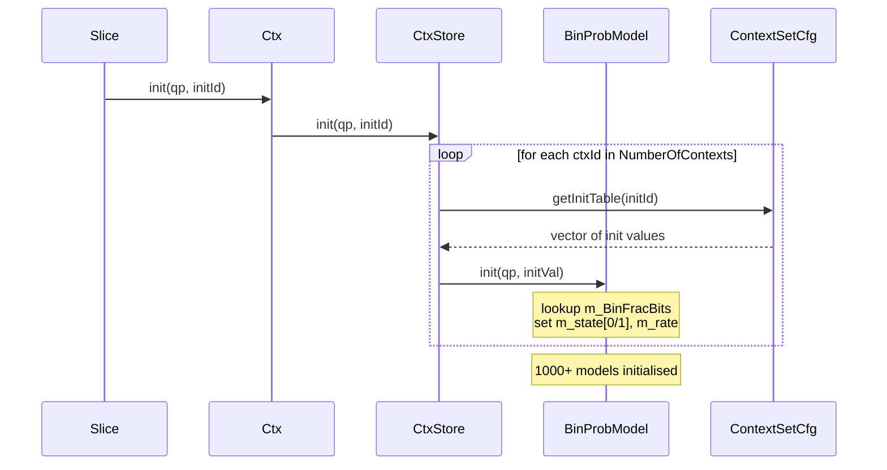
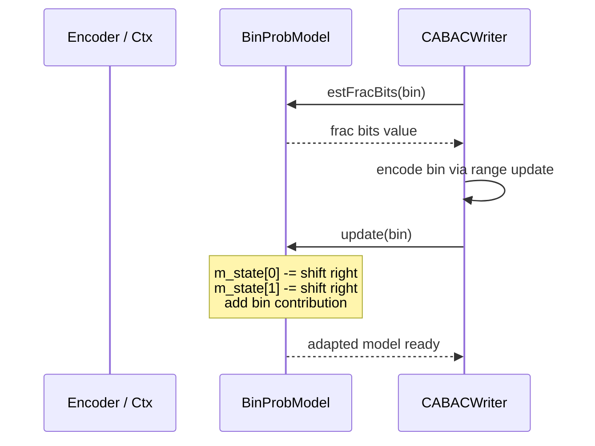
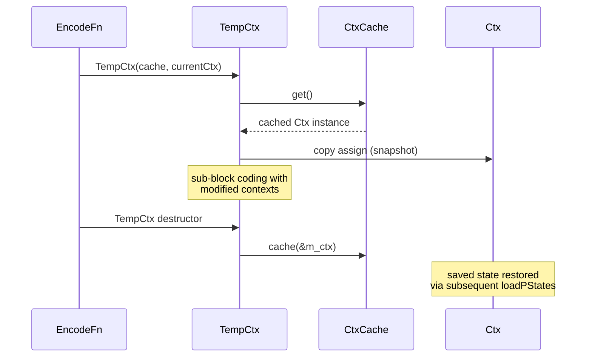
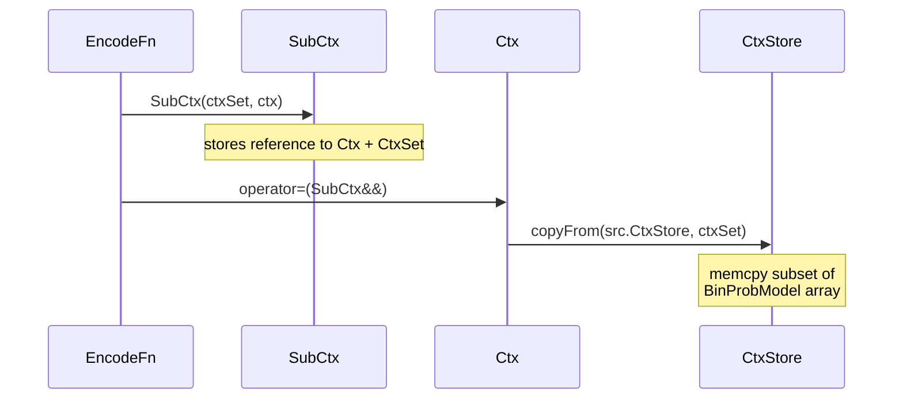

# Contexts — CABAC Probability Models and Context Management

## 1. Overview

The `Contexts` module provides the full CABAC probability model hierarchy for the VVenC encoder. It defines the probability estimation tables (`ProbModelTables`, `BinProbModelBase`, `BinProbModel`), the context index layout (`CtxSet`, `ContextSetCfg`), the runtime context storage (`CtxStore`, `Ctx`), and RAII helpers for temporary context save/restore (`SubCtx`, `TempCtx`). Together these types manage the 1000+ adaptive binary probability models that drive entropy coding in VVC.

**Dependencies**: `CommonDef.h` (for `SCALE_BITS`, `CHECK`, `CHECKD`), `Slice.h`.

**Lifecycle**: One `Ctx` instance lives in `Slice` and is (re-)initialised per-slice via `init(qp, initId)`. `TempCtx` provides scoped save/restore for sub-block coding passes.

## 2. Component Specifications

### 2.1 Struct: `BinFracBits`

```cpp
namespace vvenc {

struct BinFracBits
{
  uint32_t intBits[2];  ///< fractional bits for bin=0 and bin=1
};

}
```

### 2.2 Class: `ProbModelTables`

```cpp
namespace vvenc {

class ProbModelTables
{
protected:
  static const BinFracBits m_binFracBits[256];  ///< lookup: state -> frac bits for bin 0/1
  static const uint8_t      m_RenormTable_32[32]; ///< LPS renormalisation shift
};

}
```

### 2.3 Class: `BinProbModelBase`

```cpp
namespace vvenc {

class BinProbModelBase : public ProbModelTables
{
public:
  static uint32_t estFracBitsEP();                                       ///< equiprobable frac bits for 1 bin
  static uint32_t estFracBitsEP(unsigned numBins);                       ///< equiprobable frac bits for N bins
};

}
```

### 2.4 Class: `BinProbModel`

```cpp
namespace vvenc {

class BinProbModel : public BinProbModelBase
{
public:
  BinProbModel();                                 ///< default: state=half, rate=DWS

  void         init(int qp, int initId);          ///< initialise from QP + init table
  void         update(unsigned bin);              ///< adaptive update (single bin)
  void         setLog2WindowSize(uint8_t log2WindowSize); ///< set adaptation window size
  void         estFracBitsUpdate(unsigned bin, uint64_t &b); ///< accumulate frac bits + update

  uint32_t     estFracBits(unsigned bin) const;   ///< fractional bits for a bin
  static uint32_t estFracBitsTrm(unsigned bin);   ///< fractional bits for terminating bin

  const BinFracBits &getFracBitsArray() const;    ///< get frac bits array for current state

  uint8_t  state() const;                         ///< combined state [0..255]
  uint8_t  mps() const;                           ///< most probable symbol (0/1)
  uint8_t  getLPS(unsigned range) const;          ///< LPS sub-interval width
  static uint8_t getRenormBitsLPS(unsigned LPS);  ///< renormalisation shift for given LPS

  uint16_t getState() const;                      ///< packed state (m_state[0]+m_state[1])
  void     setState(uint16_t pState);             ///< unpack and set state

  uint64_t estFracExcessBits(const BinProbModel &r) const; ///< cross-estimate excess bits
private:
  uint16_t m_state[2];  ///< two-estimate state
  uint8_t  m_rate;      ///< packed adaptation rates
};

}
```

### 2.5 Class: `CtxSet`

```cpp
namespace vvenc {

class CtxSet
{
public:
  CtxSet(uint16_t offset, uint16_t size);        ///< construct with offset+size
  CtxSet(const CtxSet& ctxSet);                 ///< copy
  CtxSet(std::initializer_list<CtxSet> ctxSets); ///< merge multiple sets

  uint16_t operator()() const;                   ///< get base offset
  uint16_t operator()(uint16_t inc) const;       ///< get offset + inc (with bounds check)
  bool     operator==(const CtxSet&) const;      ///< equality
  bool     operator!=(const CtxSet&) const;      ///< inequality
  uint16_t size() const;                         ///< number of contexts in set

  uint16_t Offset;  ///< start index in global context array
  uint16_t Size;    ///< count of consecutive contexts
};

}
```

### 2.6 Class: `ContextSetCfg`

```cpp
namespace vvenc {

class ContextSetCfg
{
public:
  // Context-set definitions: each is a static const CtxSet
  static const CtxSet   SplitFlag;
  static const CtxSet   SplitQtFlag;
  static const CtxSet   SplitHvFlag;
  static const CtxSet   Split12Flag;
  static const CtxSet   ModeConsFlag;
  static const CtxSet   SkipFlag;
  static const CtxSet   MergeFlag;
  static const CtxSet   RegularMergeFlag;
  static const CtxSet   MergeIdx;
  static const CtxSet   MmvdFlag;
  static const CtxSet   MmvdMergeIdx;
  static const CtxSet   MmvdStepMvpIdx;
  static const CtxSet   SubblockMergeFlag;
  static const CtxSet   AffMergeIdx;
  static const CtxSet   PredMode;
  static const CtxSet   CclmModeFlag;
  static const CtxSet   CclmModeIdx;
  static const CtxSet   IntraChromaPredMode;
  static const CtxSet   IntraLumaMpmFlag;
  static const CtxSet   IntraLumaPlanarFlag;
  static const CtxSet   MultiRefLineIdx;
  static const CtxSet   MipFlag;
  static const CtxSet   ISPMode;
  static const CtxSet   DeltaQP;
  static const CtxSet   InterDir;
  static const CtxSet   RefPic;
  static const CtxSet   AffineFlag;
  static const CtxSet   AffineType;
  static const CtxSet   Mvd;
  static const CtxSet   BDPCMMode;
  static const CtxSet   QtRootCbf;
  static const CtxSet   ACTFlag;
  static const CtxSet   QtCbf           [3];  // [channel]
  static const CtxSet   SigCoeffGroup   [2];  // [ChannelType]
  static const CtxSet   LastX           [2];  // [ChannelType]
  static const CtxSet   LastY           [2];  // [ChannelType]
  static const CtxSet   SigFlag         [6];  // [ChannelType + State]
  static const CtxSet   ParFlag         [2];  // [ChannelType]
  static const CtxSet   GtxFlag         [4];  // [ChannelType + x]
  static const CtxSet   TsSigCoeffGroup;
  static const CtxSet   TsSigFlag;
  static const CtxSet   TsParFlag;
  static const CtxSet   TsGtxFlag;
  static const CtxSet   TsLrg1Flag;
  static const CtxSet   TsResidualSign;
  static const CtxSet   MVPIdx;
  static const CtxSet   SaoMergeFlag;
  static const CtxSet   SaoTypeIdx;
  static const CtxSet   TransformSkipFlag;
  static const CtxSet   MTSIdx;
  static const CtxSet   LFNSTIdx;
  static const CtxSet   PLTFlag;
  static const CtxSet   SbtFlag;
  static const CtxSet   SbtQuadFlag;
  static const CtxSet   SbtHorFlag;
  static const CtxSet   SbtPosFlag;
  static const CtxSet   ChromaQpAdjFlag;
  static const CtxSet   ChromaQpAdjIdc;
  static const CtxSet   ImvFlag;
  static const CtxSet   BcwIdx;
  static const CtxSet   ctbAlfFlag;
  static const CtxSet   ctbAlfAlternative;
  static const CtxSet   AlfUseTemporalFilt;
  static const CtxSet   CcAlfFilterControlFlag;
  static const CtxSet   CiipFlag;
  static const CtxSet   SmvdFlag;
  static const CtxSet   IBCFlag;
  static const CtxSet   JointCbCrFlag;
  static const unsigned  NumberOfContexts;

  // Combined sets
  static const CtxSet   Sao;
  static const CtxSet   Alf;

  static const std::vector<uint8_t>& getInitTable(unsigned initId);

private:
  static std::vector<std::vector<uint8_t> > sm_InitTables;
  static CtxSet addCtxSet(std::initializer_list<std::initializer_list<uint8_t> > initSet2d);
};

}
```

### 2.7 Class: `CtxStore`

```cpp
namespace vvenc {

class CtxStore
{
public:
  CtxStore();
  CtxStore(bool dummy);
  CtxStore(const CtxStore& ctxStore);

  void copyFrom(const CtxStore& src);                             ///< full copy
  void copyFrom(const CtxStore& src, const CtxSet& ctxSet);       ///< partial copy

  void init(int qp, int initId);                                  ///< (re-)initialise all contexts
  void setWinSizes(const std::vector<uint8_t>& log2WindowSizes);  ///< set window sizes
  void loadPStates(const std::vector<uint16_t>& probStates);      ///< restore states
  void savePStates(std::vector<uint16_t>& probStates) const;      ///< snapshot states

  const BinProbModel& operator[](unsigned ctxId) const;           ///< read-only access
  BinProbModel&       operator[](unsigned ctxId);                 ///< mutable access
  uint32_t            estFracBits(unsigned bin, unsigned ctxId) const;  ///< shortcut
  const BinFracBits&  getFracBitsArray(unsigned ctxId) const;     ///< frac bits for ctx

private:
  std::vector<BinProbModel> m_CtxBuffer;  ///< heap storage
  BinProbModel*             m_Ctx;        ///< pointer to m_CtxBuffer.data() (lazy init)
};

using FracBitsAccess = CtxStore;

}
```

### 2.8 Class: `Ctx`

```cpp
namespace vvenc {

class Ctx : public ContextSetCfg
{
public:
  Ctx();                                          ///< default
  Ctx(const BinProbModel* dummy);                 ///< empty (no init)
  Ctx(const Ctx& ctx);                            ///< copy

  const Ctx& operator=(const Ctx& ctx);           ///< full assign
  SubCtx      operator=(SubCtx&& subCtx);         ///< partial assign from SubCtx

  void  init(int qp, int initId);                 ///< delegate to CtxStore::init
  void  loadPStates(const std::vector<uint16_t>& probStates);
  void  savePStates(std::vector<uint16_t>& probStates) const;
  void  initCtxAndWinSize(unsigned ctxId, const Ctx& ctx, const uint8_t winSize);

  const Ctx&            getCtx()       const;     ///< self reference
  Ctx&                  getCtx();                  ///< self reference

  explicit operator const CtxStore&() const;      ///< access underlying CtxStore
  explicit operator       CtxStore&();

  const FracBitsAccess& getFracBitsAcess() const; ///< frac bits access

private:
  CtxStore  m_CtxStore;  ///< owned context storage
};

using CtxCache = dynamic_cache<Ctx>;

}
```

### 2.9 Class: `SubCtx`

```cpp
namespace vvenc {

class SubCtx
{
  friend class Ctx;
public:
  SubCtx(const CtxSet& ctxSet, const Ctx& ctx);  ///< reference subset
  SubCtx(const SubCtx& subCtx);                   ///< copy
private:
  const CtxSet  m_CtxSet;
  const Ctx&    m_Ctx;
};

}
```

### 2.10 Class: `TempCtx`

```cpp
namespace vvenc {

class TempCtx
{
public:
  TempCtx(CtxCache* cache);                      ///< alloc from cache
  TempCtx(CtxCache* cache, const Ctx& ctx);      ///< alloc + copy
  TempCtx(CtxCache* cache, SubCtx&& subCtx);     ///< alloc + partial copy
  ~TempCtx();                                     ///< return to cache

  const Ctx& operator=(const Ctx& ctx);           ///< assign
  SubCtx      operator=(SubCtx&& subCtx);         ///< partial assign

  operator const Ctx&() const;                    ///< read access
  operator       Ctx&();                          ///< write access
private:
  Ctx&      m_ctx;
  CtxCache* m_cache;
};

}
```

### 2.11 Free Functions and Constants

```cpp
namespace vvenc {

static constexpr int PROB_BITS   = 15;  // Nominal number of bits to represent probabilities
static constexpr int PROB_BITS_0 = 10;  // Bits for 1st estimate
static constexpr int PROB_BITS_1 = 14;  // Bits for 2nd estimate
static constexpr int MASK_0  = ~(~0u << PROB_BITS_0) << (PROB_BITS - PROB_BITS_0);
static constexpr int MASK_1  = ~(~0u << PROB_BITS_1) << (PROB_BITS - PROB_BITS_1);
static constexpr uint8_t DWS = 8;       // Default window size

}
```

## 3. System Architecture



## 4. Detailed Data Flow

### 4.1 Slice-Level Context Initialisation



### 4.2 CABAC Encoding Flow



### 4.3 Temporary Context Save/Restore



### 4.4 Partial Copy via SubCtx



## 5. Visualisation

### 5.1 Animation Description

The D3 animation visualises the CABAC context lifecycle through 18 keyframes, one per major operation. Each keyframe updates:

- **ProbabilityTable**: A grid of 256 cells (one per state) showing the `m_binFracBits[256]` entries as a heatmap. Blue for low probability of bin=1, red for high.
- **StateIndicator**: Two horizontal thermometer bars showing `m_state[0]` and `m_state[1]` as filled segments.
- **RateIndicator**: A badge showing the current `m_rate` (packed window size).
- **OperationLog**: A scrollable log that prepends each method call.
- **ContextMap**: A compact grid showing the active state value for every context in the set, with highlighting on the currently accessed context.

### 5.2 Animation Source

No D3 HTML provided per instruction.

### 5.3 Validation

The filmstrip captures one frame per keyframe, producing 18 PNGs. Each frame has a distinct `state()` value, `m_rate`, and `estFracBits` output. Visual anomalies include heatmap misalignment between `m_binFracBits` lookup and the actual `state()` position, or `RateIndicator` not matching the `setLog2WindowSize` call.

## 6. Testing Requirements

### Unit Tests (new file: `test/vvenc_unit_test/contexts_test.cpp`)

| Test ID | Class / Method | What to Verify |
|---|---|---|
| `CTX_BINPROBMODEL_DEFAULT` | `BinProbModel()` | state() == 128, mps() == 0, rate == DWS |
| `CTX_BINPROBMODEL_INIT` | `BinProbModel::init(qp, initId)` | state and rate set per init table |
| `CTX_BINPROBMODEL_UPDATE` | `BinProbModel::update(bin)` | state changes after update(0) vs update(1) |
| `CTX_BINPROBMODEL_GET_STATE` | `getState() / setState()` | round-trip: setState(X) then getState() == X |
| `CTX_BINPROBMODEL_MPS` | `mps()` | bin=0 updates drive mps toward 0 |
| `CTX_BINPROBMODEL_FRACBITS` | `estFracBits(bin)` | returned value in valid range |
| `CTX_BINPROBMODEL_FRACBITS_TRM` | `estFracBitsTrm(bin)` | bin=0 returns 0x0010c, bin=1 returns 0x3bfbb |
| `CTX_BINPROBMODEL_GET_LPS` | `getLPS(range)` | LPS value within [4, range/2) |
| `CTX_BINPROBMODEL_WINSIZE` | `setLog2WindowSize()` | rate is updated; valid rates for log2 0..7 |
| `CTX_CTXSET_CONSTRUCT` | `CtxSet(off, sz)` | Offset==off, Size==sz |
| `CTX_CTXSET_OPERATOR` | `CtxSet::operator()(inc)` | returns offset+inc, CHECKD on overflow |
| `CTX_CTXSET_MERGE` | `CtxSet(initializer_list)` | merged set spans union range |
| `CTX_CTXSET_EQUALITY` | `operator== / operator!=` | equal on same offset+size |
| `CTX_CTXSTORE_COPY` | `CtxStore::copyFrom` | full and partial copy produce identical estFracBits |
| `CTX_CTXSTORE_LOAD_SAVE` | `loadPStates / savePStates` | round-trip: save then load yields same state |
| `CTX_CTX_INIT` | `Ctx::init(qp, initId)` | all contexts initialised to non-zero state |
| `CTX_CTX_ASSIGN` | `Ctx::operator=(Ctx)` | deep copy yields same frac bits |
| `CTX_SUBCTX_PARTIAL` | `SubCtx + Ctx::operator=(SubCtx&&)` | only the ctxSet range is copied |
| `CTX_TEMPCTX_RAII` | `TempCtx` | cache get/return cycle works |
| `CTX_NUMBER_OF_CONTEXTS` | `ContextSetCfg::NumberOfContexts` | matches total of all CtxSet sizes |

### Calling-Order Validation

- `CtxStore::checkInit` is lazily called on first copy/access. Calling `copyFrom` before any `operator[]` must allocate the buffer.
- `BinProbModel::setLog2WindowSize` must be called before `update` if non-default window size is required.

### Parameter Range Tests

- `BinProbModel::update(bin)`: verify bin=0 and bin=1 (other values have undefined behaviour — document only)
- `setLog2WindowSize(log2)`: verify log2 in [0..7]; rate0/rate1 computed via `2 + ((log2WindowSize>>2)&3)` and `3 + rate0 + (log2WindowSize&3)`
- `estFracBits(bin)`: verify bin=0 and bin=1
- `getLPS(range)`: verify range in valid CABAC range [256..510]

### Integration Tests

Covered by `vvenc_unit_test.cpp` which already includes CABAC context tests as part of `EncSlice` and `CABACWriter` testing. New dedicated `contexts_test.cpp` file supplements but does not modify the regression baseline.

## 7. CLI Entry Point

Not directly exposed via CLI. `Ctx`, `CtxStore`, and `BinProbModel` are internal data types consumed by `CABACWriter`, `CABACReader`, `EncSlice`, and `DecSlice` within `EncoderLib` and `DecoderLib`.
