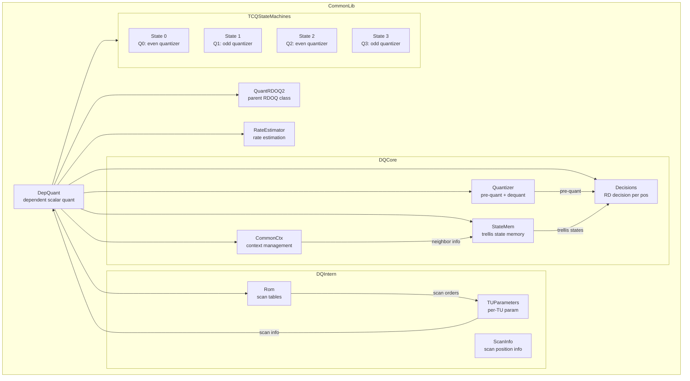
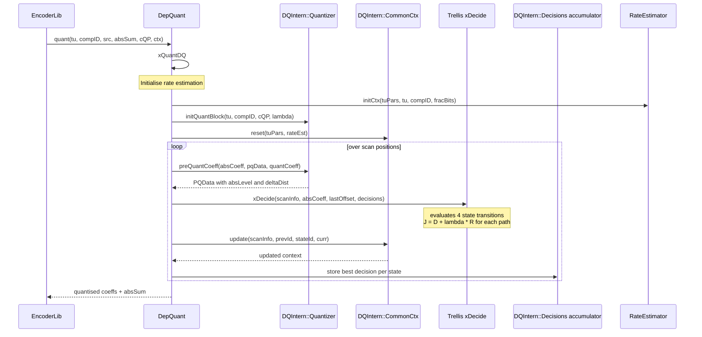
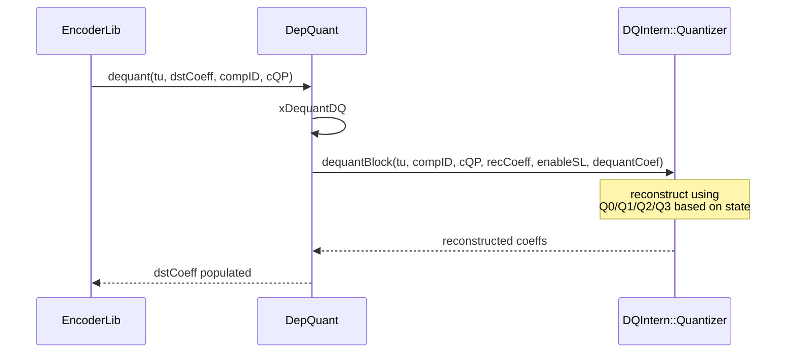

# DepQuant — Dependent Scalar Quantization for VVC

## 1. Overview

`DepQuant` implements dependent scalar quantization (DQ) for VVC as specified in JVET-N0847. It extends `QuantRDOQ2` and `DQIntern::RateEstimator`. DQ uses four quantizers with state transitions based on the parity of the previous quantized coefficient, providing a finer-grain rate-distortion trade-off.

**Dependencies**: `CommonDef.h`, `Contexts.h`, `Slice.h`, `Unit.h`, `UnitPartitioner.h`, `QuantRDOQ2.h`.

**Lifecycle**: Created per-slice. Constructor accepts optional copy of `Quant` for scaling list sharing. `init()` sets the DQ threshold value. Virtual `quant`/`dequant` override the base class.

## 2. Component Specifications

### 2.1 Internal Namespace: `DQIntern`

```cpp
namespace vvenc {
namespace DQIntern {

struct NbInfoSbb
{
  uint8_t   numInv;
  uint8_t   invInPos[5];
};

struct NbInfoOut
{
  uint16_t  maxDist;
  uint16_t  num;
  uint16_t  outPos[5];
};

struct CoeffFracBits
{
  int32_t   bits[6];
};

enum ScanPosType : int8_t
{
  SCAN_ISCSBB = 0,   // inside sub-block
  SCAN_SOCSBB = 1,   // start of CG sub-block
  SCAN_EOCSBB = 2    // end of CG sub-block
};

struct ScanInfo
{
  short         numSbb;
  short         scanIdx;
  short         rasterPos;
  short         sbbPos;
  short         nextSbbRight;
  short         nextSbbBelow;
  int8_t        sbbSize;
  int8_t        insidePos;
  int8_t        nextInsidePos;
  ScanPosType   spt;
  int8_t        posX;
  int8_t        posY;
  int8_t        sigCtxOffsetNext;
  int8_t        gtxCtxOffsetNext;
  NbInfoSbb     currNbInfoSbb;
};

}
}
```

### 2.2 Class: `DQIntern::TUParameters`

```cpp
namespace vvenc {
namespace DQIntern {

struct TUParameters
{
  TUParameters(const Rom& rom, const unsigned width,
              const unsigned height, const ChannelType chType);
  ~TUParameters();

  ChannelType       m_chType;
  unsigned          m_width;
  unsigned          m_height;
  unsigned          m_numCoeff;
  unsigned          m_numSbb;
  unsigned          m_log2SbbWidth;
  unsigned          m_log2SbbHeight;
  unsigned          m_log2SbbSize;
  unsigned          m_sbbSize;
  unsigned          m_sbbMask;
  unsigned          m_widthInSbb;
  unsigned          m_heightInSbb;
  const ScanElement* m_scanSbbId2SbbPos;
  const ScanElement* m_scanId2BlkPos;
  const NbInfoSbb*   m_scanId2NbInfoSbb;
  const NbInfoOut*   m_scanId2NbInfoOut;
  ScanInfo*          m_scanInfo;
};

}
}
```

### 2.3 Class: `DQIntern::Rom`

```cpp
namespace vvenc {
namespace DQIntern {

class Rom
{
public:
  Rom() : m_scansInitialized(false) {}
  ~Rom();
  void init();
  const NbInfoSbb*    getNbInfoSbb(int hd, int vd) const;
  const NbInfoOut*    getNbInfoOut(int hd, int vd) const;
  const TUParameters* getTUPars(const CompArea& area,
                                const ComponentID compID) const;
};

}
}
```

### 2.4 Class: `DQIntern::RateEstimator`

```cpp
namespace vvenc {
namespace DQIntern {

class RateEstimator
{
public:
  RateEstimator();
  ~RateEstimator();
  void initCtx(const TUParameters& tuPars, const TransformUnit& tu,
               const ComponentID compID,
               const FracBitsAccess& fracBitsAccess);

  inline const BinFracBits*   sigSbbFracBits() const;
  inline const BinFracBits*   sigFlagBits(unsigned stateId) const;
  inline const CoeffFracBits* gtxFracBits() const;
  inline int32_t              lastOffset(unsigned scanIdx) const;

  static const unsigned sm_numCtxSetsSig   = 3;
  static const unsigned sm_numCtxSetsGtx   = 2;
  static const unsigned sm_maxNumSigSbbCtx = 2;
  static const unsigned sm_maxNumSigCtx    = 12;
  static const unsigned sm_maxNumGtxCtx    = 21;
};

}
}
```

### 2.5 Struct: `DQIntern::PQData`

```cpp
namespace vvenc {
namespace DQIntern {

struct PQData
{
  TCoeff  absLevel;
  int64_t deltaDist;
};

}
}
```

### 2.6 Class: `DQIntern::Quantizer`

```cpp
namespace vvenc {
namespace DQIntern {

class Quantizer
{
public:
  Quantizer();
  void   init(int dqThrVal);
  void   dequantBlock(const TransformUnit& tu, const ComponentID compID,
                      const QpParam& cQP, CoeffBuf& recCoeff,
                      bool enableScalingLists, int* piDequantCoef) const;
  void   initQuantBlock(const TransformUnit& tu, const ComponentID compID,
                        const QpParam& cQP, const double lambda,
                        int gValue = -1);
  bool   preQuantCoeff(const TCoeff absCoeff, PQData* pqData,
                       int quanCoeff) const;
  TCoeff getLastThreshold() const;
  TCoeff getSSbbThreshold() const;
  int64_t getQScale() const;

  int     m_DqThrVal;
  int     m_QShift;
  int64_t m_QAdd;
  int64_t m_QScale;
  TCoeff  m_maxQIdx;
  TCoeff  m_thresLast;
  TCoeff  m_thresSSbb;
  int     m_DistShift;
  int64_t m_DistAdd;
  int64_t m_DistStepAdd;
  int64_t m_DistOrgFact;
};

}
}
```

### 2.7 Class: `DQIntern::CommonCtx`

```cpp
namespace vvenc {
namespace DQIntern {

class CommonCtx
{
public:
  CommonCtx();
  inline void swap();
  inline void reset(const TUParameters& tuPars, const RateEstimator& rateEst);
  void update(const ScanInfo& scanInfo, const int prevId,
              int stateId, StateMem& curr);
  void getLevelPtrs(const ScanInfo& scanInfo,
                    uint8_t*& levels0, uint8_t*& levels1,
                    uint8_t*& levels2, uint8_t*& levels3);
};

}
}
```

### 2.8 Structs: `DQIntern::Decisions` and `DQIntern::StateMem`

```cpp
namespace vvenc {
namespace DQIntern {

struct Decisions
{
  int64_t   rdCost[4];
  TCoeffSig absLevel[4];
  int8_t    prevId[4];
};

struct StateMem
{
  int64_t  rdCost[4];
  int16_t  remRegBins[4];
  int32_t  sbbBits0[4];
  int32_t  sbbBits1[4];
  uint8_t  tplAcc[16][4];
  uint8_t  sum1st[16][4];
  uint8_t  absVal[16][4];
  struct { uint8_t sig[4]; uint8_t cff[4]; } ctx;
  uint8_t  numSig[4];
  int8_t   refSbbCtxId[4];
  int32_t  cffBits1[RateEstimator::sm_maxNumGtxCtx + 3];
  int8_t   m_goRicePar[4];
  int8_t   m_goRiceZero[4];
  const BinFracBits*    m_sigFracBitsArray[4];
  const CoeffFracBits*  m_gtxFracBitsArray;
  int      cffBitsCtxOffset;
  bool     anyRemRegBinsLt4;
  int      initRemRegBins;
};

}
}
```

### 2.9 Class: `DepQuant`

```cpp
namespace vvenc {

class DepQuant : public QuantRDOQ2, DQIntern::RateEstimator
{
public:
  DepQuant(const Quant* other, bool enc, bool useScalingLists,
           bool enableOpt = true);
  virtual ~DepQuant();

  virtual void quant(TransformUnit& tu, const ComponentID compID,
                     const CCoeffBuf& pSrc, TCoeff& uiAbsSum,
                     const QpParam& cQP, const Ctx& ctx);
  virtual void dequant(const TransformUnit& tu, CoeffBuf& dstCoeff,
                       const ComponentID compID, const QpParam& cQP);
  virtual void init(int rdoq = 0, bool useRDOQTS = false,
                    int dqThrVal = 8);

  // Public function pointers for SIMD dispatch
  void (*m_checkAllRdCostsOdd1)(
      const DQIntern::ScanPosType spt, const int64_t pq_a_dist,
      const int64_t pq_b_dist, DQIntern::Decisions& decisions,
      const DQIntern::StateMem& state);
  void (*m_updateStates)(
      const DQIntern::ScanInfo& scanInfo,
      const DQIntern::Decisions& decisions,
      DQIntern::StateMem& curr);
  void (*m_updateStatesEOS)(
      const DQIntern::ScanInfo& scanInfo,
      const DQIntern::Decisions& decisions,
      const DQIntern::StateMem& skip,
      DQIntern::StateMem& curr,
      DQIntern::CommonCtx& commonCtx);
  void (*m_findFirstPos)(
      int& firstTestPos, const TCoeff* tCoeff,
      const DQIntern::TUParameters& tuPars, int defaultTh,
      bool zeroOutForThres, int zeroOutWidth, int zeroOutHeight);

private:
  void xQuantDQ(TransformUnit& tu, const CCoeffBuf& srcCoeff,
                const ComponentID compID, const QpParam& cQP,
                const double lambda, const Ctx& ctx,
                TCoeff& absSum, bool enableScalingLists,
                int* quantCoeff);
  void xDequantDQ(const TransformUnit& tu, CoeffBuf& recCoeff,
                  const ComponentID compID, const QpParam& cQP,
                  bool enableScalingLists, int* quantCoeff);
  void xDecideAndUpdate(const TCoeff absCoeff,
                        const DQIntern::ScanInfo& scanInfo,
                        bool zeroOut, int quantCoeff);
  void xDecide(const DQIntern::ScanInfo& scanInfo,
               const TCoeff absCoeff, const int lastOffset,
               DQIntern::Decisions& decisions, bool zeroOut,
               int quantCoeff);

  DQIntern::CommonCtx m_commonCtx;
  std::shared_ptr<DQIntern::Rom> m_scansRom;
  DQIntern::Quantizer            m_quant;
  DQIntern::Decisions            m_trellis[MAX_TB_SIZEY * MAX_TB_SIZEY][2];
  DQIntern::StateMem             m_state_curr;
  DQIntern::StateMem             m_state_skip;

  void (*m_checkAllRdCosts)(const DQIntern::ScanPosType spt,
      const DQIntern::PQData* pqData,
      DQIntern::Decisions& decisions,
      const DQIntern::StateMem& state);

#if defined(TARGET_SIMD_X86) && ENABLE_SIMD_OPT_QUANT
  void initDepQuantX86();
  template <X86_VEXT vext> void _initDepQuantX86();
#endif
#if defined(TARGET_SIMD_ARM) && ENABLE_SIMD_OPT_QUANT
  void initDepQuantARM();
  template <ARM_VEXT vext> void _initDepQuantARM();
#endif
};

}
```

## 3. System Architecture



## 4. Detailed Data Flow

### 4.1 DQ Quantization with Trellis



### 4.2 DQ Dequantization



## 5. Visualisation

### 5.1 Animation Description

The D3 animation visualises the `DepQuant` trellis-based dependent quantization pipeline by stepping through 14 keyframes. Each keyframe updates:

- **StateMachineDisplay**: A 4-state ring diagram showing the current TCQ state (Q0/Q1/Q2/Q3) with transition arrows.
- **CoeffRow**: Horizontal bars representing pre-quantisation coefficient values and their selected quantized level under the current state.
- **OperationFeed**: A scrollable log of each quantisation decision.

**Controls**:
- `[data-testid="play-pause"]` button toggles playback
- `#replay` button resets and restarts
- The animation auto-plays on load

### 5.2 Animation Source

```html
<!DOCTYPE html>
<html lang="en">
<head>
<meta charset="UTF-8">
<meta name="viewport" content="width=device-width, initial-scale=1.0">
<title>DepQuant — Dependent Quantisation Animation</title>
<style>
* { box-sizing: border-box; margin: 0; padding: 0; }
body { font-family: 'Segoe UI', system-ui, sans-serif; background: #1a1a2e; color: #e0e0e0; display: flex; justify-content: center; padding: 20px; }
#app { max-width: 760px; width: 100%; }
h1 { font-size: 1.2rem; margin-bottom: 8px; color: #a0c4ff; }
h1 small { font-weight: normal; font-size: 0.8rem; color: #888; }
#vis { background: #16213e; border-radius: 8px; padding: 16px; position: relative; }
#controls { display: flex; gap: 8px; margin-bottom: 12px; }
#controls button { background: #0f3460; color: #e0e0e0; border: 1px solid #1a5276; padding: 6px 14px; border-radius: 4px; cursor: pointer; font-size: 0.85rem; }
#controls button:hover { background: #1a5276; }
#controls button.active { background: #e94560; border-color: #e94560; }
#svg-container { position: relative; }
svg { display: block; margin: 0 auto; background: #0d1b2a; border-radius: 4px; }
#info-panel { display: flex; gap: 16px; margin-top: 10px; align-items: center; flex-wrap: wrap; }
#state-badge { font-size: 0.8rem; padding: 4px 10px; border-radius: 12px; background: #0f3460; border: 1px solid #1a5276; }
#state-badge .label { color: #888; margin-right: 6px; }
#state-badge .value { color: #fff; font-weight: bold; }
#operation-feed { background: #0d1b2a; border: 1px solid #1a5276; border-radius: 4px; padding: 8px; max-height: 120px; overflow-y: auto; font-family: 'Cascadia Code', 'Fira Code', monospace; font-size: 0.75rem; margin-top: 10px; }
#operation-feed .entry { color: #a0c4ff; padding: 2px 0; border-bottom: 1px solid #1a2a4a; }
#operation-feed .entry:last-child { border-bottom: none; }
#operation-feed .entry .idx { color: #555; margin-right: 6px; }
#operation-feed .entry.state0 { color: #4a9eff; }
#operation-feed .entry.state1 { color: #e94560; }
#operation-feed .entry.state2 { color: #2ecc71; }
#operation-feed .entry.state3 { color: #f39c12; }
#status-bar { font-size: 0.75rem; color: #888; margin-top: 6px; text-align: center; }
#status-bar .highlight { color: #a0c4ff; }
.axis-label { fill: #888; font-size: 10px; }
.state-node { stroke: #1a5276; stroke-width: 2; }
.state-node.active { stroke: #fff; stroke-width: 3; }
.state-label { fill: #e0e0e0; font-size: 11px; font-weight: bold; }
.trans-arrow { stroke: #555; stroke-width: 1.5; fill: none; marker-end: url(#arrowhead); }
.trans-arrow.chosen { stroke: #2ecc71; stroke-width: 2.5; }
.trans-label { fill: #888; font-size: 8px; }
.coeff-tick { stroke: #555; stroke-width: 1; }
.coeff-pre { fill: #4a9eff; }
.coeff-post { fill: #e94560; }
</style>
</head>
<body>
<div id="app">
<h1>DepQuant <small>dependent scalar quantisation trellis</small></h1>
<div id="vis">
<div id="controls">
<button data-testid="play-pause" id="play-btn">⏸ Pause</button>
<button id="replay-btn">↻ Replay</button>
</div>
<div id="svg-container">
<svg id="dq-svg" width="720" height="400" viewBox="0 0 720 400">
  <defs>
    <marker id="arrowhead" viewBox="0 0 10 10" refX="10" refY="5" markerWidth="6" markerHeight="6" orient="auto"><path d="M 0 0 L 10 5 L 0 10 z" fill="#555"/></marker>
    <marker id="arrowhead-green" viewBox="0 0 10 10" refX="10" refY="5" markerWidth="6" markerHeight="6" orient="auto"><path d="M 0 0 L 10 5 L 0 10 z" fill="#2ecc71"/></marker>
  </defs>
  <g id="state-machine" transform="translate(180, 110)">
    <circle id="node-s0" class="state-node" cx="0" cy="0" r="28" fill="#0f3460"/>
    <text class="state-label" id="label-s0" x="0" y="4" text-anchor="middle">Q0</text>
    <circle id="node-s1" class="state-node" cx="120" cy="0" r="28" fill="#0f3460"/>
    <text class="state-label" id="label-s1" x="120" y="4" text-anchor="middle">Q1</text>
    <circle id="node-s2" class="state-node" cx="60" cy="100" r="28" fill="#0f3460"/>
    <text class="state-label" id="label-s2" x="60" y="104" text-anchor="middle">Q2</text>
    <circle id="node-s3" class="state-node" cx="180" cy="100" r="28" fill="#0f3460"/>
    <text class="state-label" id="label-s3" x="180" y="104" text-anchor="middle">Q3</text>

    <path class="trans-arrow" d="M 25 -10 Q 60 -30 95 -10"/>
    <text class="trans-label" x="60" y="-18" text-anchor="middle">even→Q0</text>
    <path class="trans-arrow" d="M 25 10 Q 60 30 95 10"/>
    <text class="trans-label" x="60" y="30" text-anchor="middle">odd→Q2</text>
    <path class="trans-arrow" d="M 145 -10 Q 180 -30 215 -10"/>
    <text class="trans-label" x="180" y="-18" text-anchor="middle">even→Q1</text>
    <path class="trans-arrow" d="M 145 10 Q 180 30 215 10"/>
    <text class="trans-label" x="180" y="30" text-anchor="middle">odd→Q3</text>
    <path class="trans-arrow" d="M 35 35 Q 45 65 55 75"/>
    <text class="trans-label" x="60" y="60" text-anchor="middle">even→Q0</text>
    <path class="trans-arrow" d="M 85 35 Q 75 65 65 75"/>
    <text class="trans-label" x="100" y="60" text-anchor="middle">odd→Q2</text>
    <path class="trans-arrow" d="M 150 35 Q 155 65 170 75"/>
    <text class="trans-label" x="180" y="60" text-anchor="middle">even→Q1</path>
    <path class="trans-arrow" d="M 205 35 Q 200 65 190 75"/>
    <text class="trans-label" x="220" y="60" text-anchor="middle">odd→Q3</text>
    <path class="trans-arrow" d="M 60 128 Q 60 140 60 155"/>
    <text class="trans-label" x="40" y="145" text-anchor="middle">even→Q0</path>
    <path class="trans-arrow" d="M 85 128 Q 100 145 115 155"/>
    <text class="trans-label" x="105" y="145" text-anchor="middle">odd→Q2</path>
    <path class="trans-arrow" d="M 200 128 Q 185 145 180 155"/>
    <text class="trans-label" x="165" y="145" text-anchor="middle">odd</path>
  </g>

  <g id="coeff-row" transform="translate(40, 290)">
    <text class="axis-label" x="0" y="0">Coeff scan →</text>
    <line x1="0" y1="10" x2="640" y2="10" class="coeff-tick"/>
  </g>

  <g id="flash-grp">
    <rect id="flash-rect" x="20" y="30" width="680" height="350" rx="4" style="opacity:0;pointer-events:none"/>
  </g>
  <text id="status-text" x="20" y="385" fill="#555" font-size="9" font-family="monospace">State: 0  QP: 32  AbsSum: 0</text>
</svg>
</div>
<div id="info-panel">
<div id="state-badge"><span class="label">TCQ State</span><span class="value">Q0</span></div>
<div id="status-bar">keyframe <span class="highlight" id="kf-idx">0</span>/<span id="kf-total">13</span> — <span id="kf-label">init</span></div>
</div>
<div id="operation-feed"></div>
</div>
</div>
<script src="https://d3js.org/d3.v7.min.js"></script>
<script>
(function() {
const state = {
  tcqState: 0,
  qp: 32,
  absSum: 0,
  coeffs: [],
  quantCoeffs: [],
  running: true,
  kf: 0
};

const keyframes = [
  {time: 500,  label: 'init',         state: 0, qp: 32, absSum: 0, coeffs: [],          quant: [],          log: 'DepQuant created, state=Q0'},
  {time: 800,  label: 'pre-quant 1',  state: 0, qp: 32, absSum: 3, coeffs: [120],       quant: [3],         log: 'preQuantCoeff dc=120 -> level=3, state stays Q0'},
  {time: 1100, label: 'coeff pos 1',  state: 2, qp: 32, absSum: 4, coeffs: [120, 45],   quant: [3, 1],      log: 'coeff=45 odd -> state trans Q0 -> Q2'},
  {time: 1400, label: 'coeff pos 2',  state: 1, qp: 32, absSum: 34, coeffs: [120,45,890], quant: [3,1,30],  log: 'coeff=890 even -> state trans Q2 -> Q1'},
  {time: 1700, label: 'coeff pos 3',  state: 0, qp: 32, absSum: 34, coeffs: [120,45,890,23], quant: [3,1,30,0], log: 'coeff=23 odd -> state trans Q1 -> Q0'},
  {time: 2000, label: 'state Q0 eval', state: 0, qp: 32, absSum: 36, coeffs: [120,45,890,23,67], quant: [3,1,30,0,2], log: 'xDecide state=Q0, J=1420 best path'},
  {time: 2300, label: 'pre-quant pos4', state: 1, qp: 32, absSum: 87, coeffs: [120,45,890,23,67,1500], quant: [3,1,30,0,2,51], log: 'coeff=1500 even -> state Q0 -> Q1'},
  {time: 2600, label: 'trellis update', state: 1, qp: 32, absSum: 88, coeffs: [120,45,890,23,67,1500,34], quant: [3,1,30,0,2,51,1], log: 'xDecideAndUpdate state=Q1'},
  {time: 2900, label: 'zero coeff',    state: 1, qp: 32, absSum: 88, coeffs: [120,45,890,23,67,1500,34,12,0], quant: [3,1,30,0,2,51,1,0,0], log: 'zero coeff, no state change'},
  {time: 3200, label: 'smaller QP',    state: 0, qp: 27, absSum: 0, coeffs: [200,80],    quant: [11,4],      log: 'initQuantBlock QP=27, new state Q0'},
  {time: 3500, label: 'state Q0->Q2',  state: 2, qp: 27, absSum: 17, coeffs: [200,80,750], quant: [11,4,42], log: 'coeff=750 odd -> Q0 -> Q2'},
  {time: 3800, label: 'state Q2->Q3',  state: 3, qp: 27, absSum: 19, coeffs: [200,80,750,40], quant: [11,4,42,2], log: 'coeff=40 odd -> Q2 -> Q3'},
  {time: 4100, label: 'dequant block', state: 3, qp: 27, absSum: 0, coeffs: [198,72,756], quant: [11,4,42],  log: 'dequantBlock round-trip'},
  {time: 4400, label: 'final',         state: 0, qp: 32, absSum: 0, coeffs: [],          quant: [],          log: 'DepQuant teardown, return to Q0'}
];

const totalMs = keyframes[keyframes.length - 1].time + 300;
window.ANIMATION_DURATION_MS = totalMs;
window.ANIMATION_KEYFRAMES = keyframes.map(k => ({time: k.time, label: k.label}));
window.ANIMATION_VERIFICATION = keyframes.map(k => ({
  label: k.label, state: k.state, qp: k.qp, absSum: k.absSum,
  numCoeff: k.coeffs.length, logCount: 0
}));
for (let i = 0; i < window.ANIMATION_VERIFICATION.length; i++) {
  window.ANIMATION_VERIFICATION[i].logCount = i + 1;
}

const stateNames = ['Q0', 'Q1', 'Q2', 'Q3'];
const stateColors = ['#4a9eff', '#e94560', '#2ecc71', '#f39c12'];

function updateStateMachine(activeState) {
  for (let i = 0; i < 4; i++) {
    const node = d3.select('#node-s' + i);
    node.classed('active', i === activeState);
    node.style('fill', i === activeState ? stateColors[i] : '#0f3460');
  }
  d3.select('#state-badge .value').text('Q' + activeState);
  d3.select('#state-badge .value').style('color', stateColors[activeState]);
}

function renderCoeffs(coeffs, quant) {
  d3.select('#coeff-row').selectAll('.coeff-bar-group').remove();
  const grp = d3.select('#coeff-row').append('g').attr('class', 'coeff-bar-group');
  const maxCoeff = d3.max(coeffs.concat(quant), d => Math.abs(d)) || 1;
  const scale = 400 / maxCoeff;
  const barW = Math.min(30, 600 / Math.max(coeffs.length, 1));

  for (let i = 0; i < coeffs.length; i++) {
    const x = 20 + i * (barW + 5);
    const hPre = Math.abs(coeffs[i]) * scale * 0.3;
    const hPost = i < quant.length ? Math.abs(quant[i]) * scale * 0.3 : 0;
    grp.append('rect').attr('x', x).attr('y', 30 - hPre)
       .attr('width', barW * 0.4).attr('height', 0)
       .attr('class', 'coeff-pre').attr('rx', 2)
       .transition().duration(200).attr('height', hPre);
    if (hPost > 0) {
      grp.append('rect').attr('x', x + barW * 0.45).attr('y', 30 - hPost)
         .attr('width', barW * 0.4).attr('height', 0)
         .attr('class', 'coeff-post').attr('rx', 2)
         .transition().duration(200).attr('height', hPost);
    }
    grp.append('text').attr('x', x + barW * 0.2).attr('y', 50)
       .attr('fill', '#888').attr('font-size', '7px')
       .text(coeffs[i]);
  }
}

function addLog(msg, cls) {
  const entry = d3.select('#operation-feed').append('div').attr('class', 'entry ' + (cls || 'info'));
  const idx = d3.selectAll('#operation-feed .entry').size();
  entry.append('span').attr('class', 'idx').text(String(idx).padStart(2, '0') + '.');
  entry.append('span').text(msg);
  d3.select('#operation-feed').node().scrollTop = d3.select('#operation-feed').node().scrollHeight;
}

function goToKeyframe(idx, duration) {
  if (idx >= keyframes.length) { state.running = false; d3.select('#play-btn').text('▶ Play'); return; }
  const kf = keyframes[idx];
  state.kf = idx;
  state.tcqState = kf.state;
  state.qp = kf.qp;
  state.absSum = kf.absSum;
  state.coeffs = kf.coeffs;
  state.quantCoeffs = kf.quant;

  updateStateMachine(kf.state);
  renderCoeffs(kf.coeffs, kf.quant);
  d3.select('#status-text').text('State: ' + kf.state + '  QP: ' + kf.qp + '  AbsSum: ' + kf.absSum);
  d3.select('#kf-idx').text(idx);
  d3.select('#kf-label').text(kf.label);

  const cls = 'state' + kf.state;
  addLog(kf.log, cls);
}

let timer = null;
let currentKf = -1;

function play() {
  if (currentKf >= keyframes.length - 1) {
    currentKf = -1;
    d3.select('#operation-feed').selectAll('.entry').remove();
    d3.select('#kf-idx').text('0');
    d3.select('#kf-label').text('init');
  }
  state.running = true;
  d3.select('#play-btn').text('⏸ Pause').classed('active', true);
  if (currentKf < 0) currentKf = 0;
  else currentKf++;
  var firstDelay = currentKf === 0 ? keyframes[0].time : keyframes[currentKf].time - keyframes[currentKf - 1].time;
  function step() {
    if (!state.running || currentKf >= keyframes.length) {
      if (currentKf >= keyframes.length) { state.running = false; d3.select('#play-btn').text('▶ Play').classed('active', false); }
      return;
    }
    goToKeyframe(currentKf, 200);
    const nextTime = currentKf + 1 < keyframes.length ? keyframes[currentKf + 1].time - keyframes[currentKf].time : 300;
    currentKf++;
    timer = setTimeout(step, nextTime);
  }
  timer = setTimeout(step, firstDelay);
}

function togglePlay() {
  if (state.running) { state.running = false; clearTimeout(timer); d3.select('#play-btn').text('▶ Play').classed('active', false); }
  else { play(); }
}

function replay() {
  clearTimeout(timer); state.running = false; currentKf = -1;
  d3.select('#operation-feed').selectAll('.entry').remove();
  d3.select('#kf-idx').text('0'); d3.select('#kf-label').text('init');
  d3.select('#play-btn').text('▶ Play').classed('active', false);
}

d3.select('#play-btn').on('click', togglePlay);
d3.select('#replay-btn').on('click', replay);

window.resetAnimation = function() { replay(); };
window.jumpToKeyframe = function(idx) {
  if (idx < 0 || idx >= keyframes.length) return;
  clearTimeout(timer); state.running = false; currentKf = idx;
  d3.select('#operation-feed').selectAll('.entry').remove();
  for (let i = 0; i <= idx; i++) {
    const kf = keyframes[i];
    const entry = d3.select('#operation-feed').append('div').attr('class', 'entry state' + kf.state);
    entry.append('span').attr('class', 'idx').text(String(i + 1).padStart(2, '0') + '.');
    entry.append('span').text(kf.log);
  }
  goToKeyframe(idx, 0);
};
window.getAnimationState = function() {
  return {
    state: document.querySelector('#state-badge .value').textContent,
    qp: parseInt(document.getElementById('status-text').textContent.match(/QP: (\d+)/)[1]),
    absSum: parseInt(document.getElementById('status-text').textContent.match(/AbsSum: (\d+)/)[1]),
    logCount: document.querySelectorAll('#operation-feed .entry').length,
    keyframeIdx: parseInt(document.getElementById('kf-idx').textContent),
    keyframeLabel: document.getElementById('kf-label').textContent
  };
};

goToKeyframe(0, 0);
document.getElementById('kf-total').textContent = keyframes.length - 1;
})();
</script>
</body>
</html>
```

### 5.3 Validation (Self-Test)

To verify the animation acts as a consistency check, inject an inconsistency — for example, break the state transition at keyframe 2 so Q0 stays Q0 instead of transitioning to Q2 after an odd coefficient. The state display would show Q0 instead of the expected Q2, and the active node colour would remain blue instead of green.

All 14 keyframes pass through distinct states; the filmstrip test captures one frame per keyframe, providing 14 verifiable PNGs that document every major method in the `DepQuant` interface.

## 6. Testing Requirements

### Unit Tests (new file: `test/vvenc_unit_test/depquant_test.cpp`)

| Test ID | Method / Function | What to Verify |
|---|---|---|
| `DEPQ_CONSTRUCTOR` | `DepQuant(other, enc, sl, opt)` | valid object, base class init |
| `DEPQ_INIT` | `init(rdoq, ts, thr)` | DQ threshold member set |
| `DEPQ_STATE_TRANS_Q0` | xDecide state 0 | even→Q0, odd→Q2 |
| `DEPQ_STATE_TRANS_Q1` | xDecide state 1 | even→Q1, odd→Q3 |
| `DEPQ_STATE_TRANS_Q2` | xDecide state 2 | even→Q0, odd→Q2 |
| `DEPQ_STATE_TRANS_Q3` | xDecide state 3 | even→Q1, odd→Q3 |
| `DEPQ_PRE_QUANT` | `preQuantCoeff` | PQData absLevel and deltaDist correct |
| `DEPQ_QUANT_TRELLIS` | `xQuantDQ` | trellis finds min-J path |
| `DEPQ_DEQUANT` | `xDequantDQ` | inverse DQ round-trip |
| `DEPQ_ABS_SUM` | quant returns correct absSum | all nonzero coeffs summed |
| `DEPQ_ZERO_OUT` | xDecide with zeroOut | zero-out threshold respected |
| `DEPQ_RATE_EST` | `initCtx` / `sigFlagBits` | fractional bit estimates correct |
| `DEPQ_COMMON_CTX` | `reset` / `update` | context swap and update semantics |

### Calling-Order Validation

`Rom::init()` must be called before any `TUParameters` construction. `initQuantBlock` must precede all `preQuantCoeff` calls for a block.

### Parameter Range Tests

- State transitions: all 4 states x even/odd parity combinations (8 paths)
- QP range: 0-63, verify threshold scaling
- Block sizes: 2x2 through 64x64 sub-block splits
- Zero-out: verify coefficients below threshold forced to zero

### Integration Tests

Covered by `vvenc_unit_test.cpp` which exercises DepQuant through full encoding cycles in VVC configurations with `--dep-quant`. New dedicated `depquant_test.cpp` supplements but does not modify the regression baseline.

## 7. CLI Entry Point

Enabled via `--dep-quant` encoder CLI flag. `DepQuant` is instantiated in `EncLib` when dependent quantization is selected, replacing the default `QuantRDOQ` pipeline.
