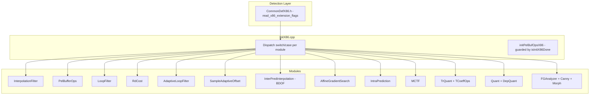
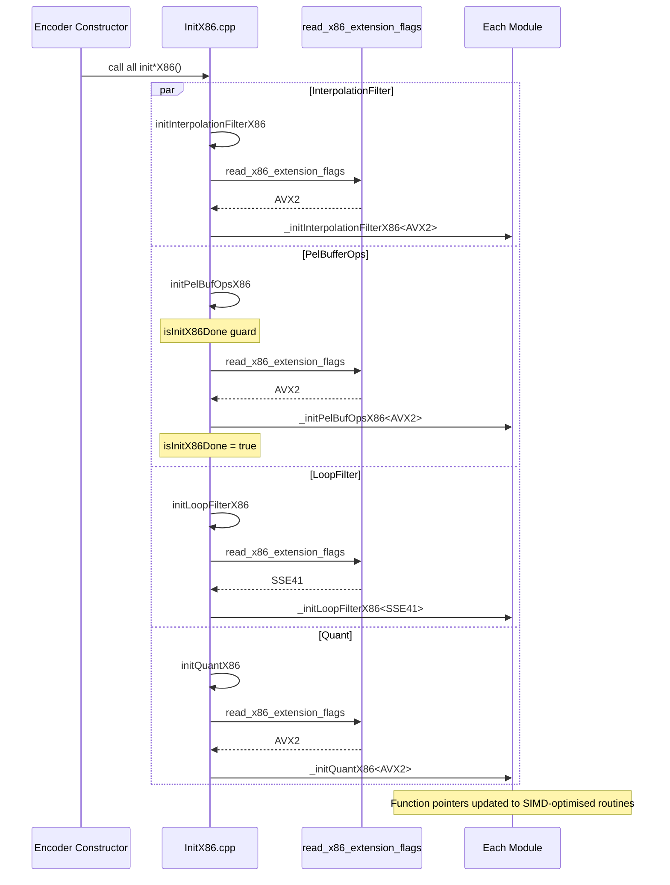

# InitX86 — Per-Module SIMD Function Pointer Initialization

## 1. Overview

`InitX86.cpp` (no corresponding `.h` — the file compiles as part of `CommonLib` and is guarded by `#ifdef TARGET_SIMD_X86`) initialises per-module SIMD function pointers for each subsystem of the VVenC encoder. Each module exposes an `init*X86()` method that calls `read_x86_extension_flags()` from `CommonDefX86.h`, then dispatches to templated `_init*X86<SIMDLevel>()` functions that install optimised AVX2 or SSE41 routines into function pointer tables.

Modules that have explicit function pointer dispatch (InterpolationFilter, DepQuant, IntraPrediction, etc.) also call `syncToGlobal()` after populating their tables, copying function pointers to the central `g_vvenc` dispatch table. See `Primitives.spec.md §3` for the full dispatch table catalog.

**Dependencies**: `CommonDefX86.h`, `InterpolationFilter.h`, `TrQuant.h`, `RdCost.h`, `Unit.h`, `LoopFilter.h`, `AdaptiveLoopFilter.h`, `SampleAdaptiveOffset.h`, `InterPrediction.h`, `IntraPrediction.h`, `AffineGradientSearch.h`, `MCTF.h`, `TrQuant_EMT.h`, `QuantRDOQ2.h`, `SEIFilmGrainAnalyzer.h`.

**Lifecycle**: Called once during encoder construction. Each `init*X86` is idempotent (some use `isInitX86Done` guard). The dispatch reads CPU capabilities and selects the highest available SIMD level. On non-x86 targets or when `ENABLE_SIMD_OPT` is off, the entire file is excluded from compilation.

## 2. Component Specifications

### 2.1 Initialization functions and their modules

| Module Class | Init Function | Guard Macro | AVX2 | SSE41 |
|---|---|---|---|---|
| `InterpolationFilter` | `initInterpolationFilterX86` | `ENABLE_SIMD_OPT_MCIF` | yes | yes |
| `PelBufferOps` | `initPelBufOpsX86` | `ENABLE_SIMD_OPT_BUFFER` | yes | yes |
| `LoopFilter` | `initLoopFilterX86` | `ENABLE_SIMD_DBLF` | yes | yes |
| `RdCost` | `initRdCostX86` | `ENABLE_SIMD_OPT_DIST` | yes* | yes |
| `AdaptiveLoopFilter` | `initAdaptiveLoopFilterX86` | `ENABLE_SIMD_OPT_ALF` | yes | yes |
| `SampleAdaptiveOffset` | `initSampleAdaptiveOffsetX86` | `ENABLE_SIMD_OPT_SAO` | yes | yes |
| `InterPredInterpolation` | `initInterPredictionX86` | `ENABLE_SIMD_OPT_BDOF` | yes | yes |
| `AffineGradientSearch` | `initAffineGradientSearchX86` | `ENABLE_SIMD_OPT_AFFINE_ME` | yes | yes |
| `IntraPrediction` | `initIntraPredictionX86` | `ENABLE_SIMD_OPT_INTRAPRED` | yes | yes |
| `MCTF` | `initMCTF_X86` | `ENABLE_SIMD_OPT_MCTF` | yes | yes |
| `TCoeffOps` | `initTCoeffOpsX86` | `ENABLE_SIMD_TRAFO` | yes | yes |
| `TrQuant` | `initTrQuantX86` | `ENABLE_SIMD_TRAFO` | yes | yes |
| `Quant` | `initQuantX86` | `ENABLE_SIMD_OPT_QUANT` | yes | yes |
| `DepQuant` | `initDepQuantX86` | `ENABLE_SIMD_OPT_QUANT` | yes | SSE42 |
| `Canny` | `initFGACannyX86` | `ENABLE_SIMD_OPT_FGA` | yes | yes |
| `Morph` | `initFGAMorphX86` | `ENABLE_SIMD_OPT_FGA` | yes | yes |
| `FGAnalyzer` | `initFGAnalyzerX86` | `ENABLE_SIMD_OPT_FGA` | yes | yes |

*`RdCost` AVX2 has a MSVC 17.38-specific workaround that skips AVX2 init to avoid a compiler bug.

### 2.2 Dispatch pattern

Every init function follows the same pattern:

```cpp
void ModuleName::initModuleX86()
{
  auto vext = read_x86_extension_flags();
  switch (vext){
    case AVX512:
    case AVX2:
#if ENABLE_AVX2_IMPLEMENTATIONS
      _initModuleX86<AVX2>();
      break;
#endif
    case AVX:
      // _initModuleX86<AVX>();  // fall through - not implemented
    case SSE42:
    case SSE41:
      _initModuleX86<SSE41>();
      break;
    default:
      break;
  }
}
```

AVX512 falls through to AVX2; AVX falls through to SSE41. The `PelBufferOps` init is additionally guarded by `isInitX86Done` to run only once.

## 3. Dependency Graph



## 4. Detailed Data Flow



## 5. Visualisation

No D3 animation — SIMD initialisation is a one-time dispatch at encoder startup with no interactive element.

## 6. Testing Requirements

### Unit Tests

| Test ID | Function | What to Verify |
|---|---|---|
| `INIT_DISPATCH_AVX2` | All `init*X86` on AVX2 host | Each `_init*X86<AVX2>` is called; fallthrough from AVX512 to AVX2 |
| `INIT_DISPATCH_SSE41` | All `init*X86` on SSE41 host | Each `_init*X86<SSE41>` is called; fallthrough from AVX and SSE42 to SSE41 |
| `INIT_DISPATCH_UNDEF` | All `init*X86` when `UNDEFINED` | No init called — function pointers remain at scalar defaults |
| `INIT_PELBUF_ONCE` | `initPelBufOpsX86` called twice | `isInitX86Done` prevents second dispatch |
| `INIT_RDCOST_AVX2_MSVC` | `initRdCostX86` under MSVC 17.38 | AVX2 init skipped due to compiler bug workaround |
| `INIT_DEPQUANT_SSE42` | `initDepQuantX86` on SSE42 | SSE42 init called (DepQuant has SSE42-specific path) |
| `INIT_CANNY_FGA` | `initFGACannyX86` | Canny edge-detection SIMD init |
| `INIT_MORPH_FGA` | `initFGAMorphX86` | Morphological FGA SIMD init |
| `INIT_ANALYZER_FGA` | `initFGAnalyzerX86` | Film grain analyzer SIMD init |
| `INIT_MCTF_SSE41` | `initMCTF_X86` on SSE41 | SSE41 MCTF init; SSE42 skipped |
| `INIT_ENABLE_AVX2_FLAG` | `ENABLE_AVX2_IMPLEMENTATIONS` | Defined only on REAL_TARGET_X86 or SIMD_EVERYWHERE >= AVX2 |

### Guard Validation

Each init function must be guarded by its corresponding `ENABLE_SIMD_OPT_*` / `ENABLE_SIMD_*` macro. Verify that when the guard is undefined, the function is absent and linking uses scalar fallbacks.

## 7. CLI Entry Point

Not directly exposed via CLI. `InitX86` is internal and called automatically by encoder construction. The compile-time defines (`USE_SSE41`, `USE_AVX2`, `USE_AVX512`, etc.) and the runtime CPUID result determine which SIMD routines are installed.
