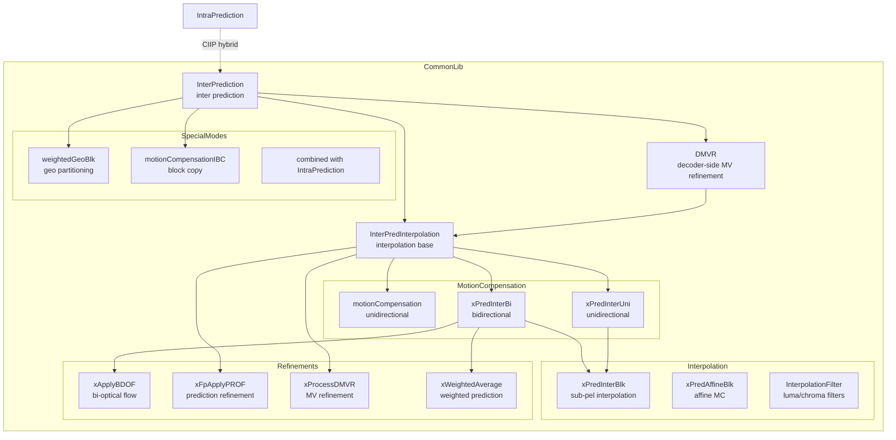
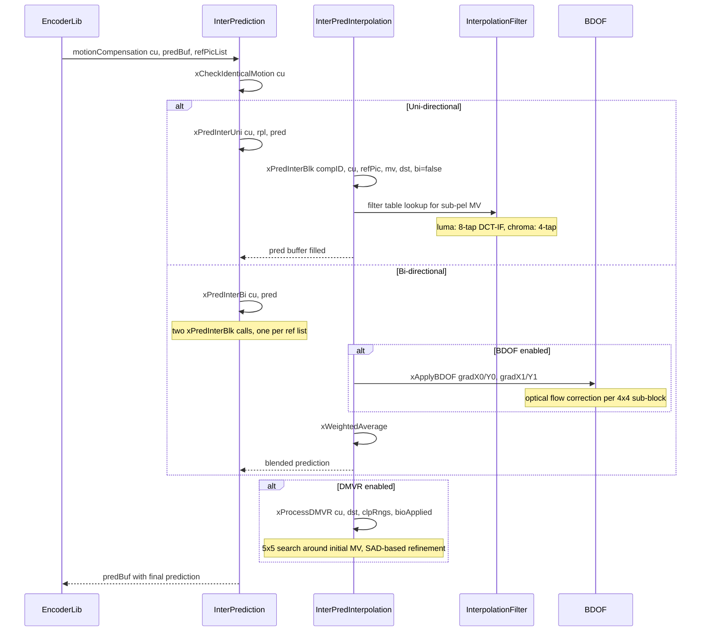
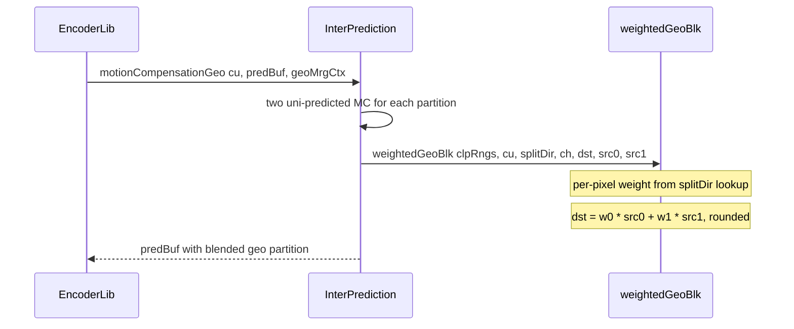

# InterPrediction — Inter Prediction and Motion Compensation

## 1. Overview

The `InterPrediction` class (inheriting `InterPredInterpolation` and `DMVR`) provides inter prediction for VVC: motion compensation with sub-pel interpolation, weighted prediction, BDOF, PROF, DMVR decoder-side motion vector refinement, GPM geometric partitioning mode blending, CIIP combined inter-intra prediction, IBC intra block copy, and affine motion compensation.

**Dependencies**: `InterpolationFilter.h`, `Unit.h`, `Picture.h`, `RdCost.h`, `ContextModelling.h`.

**Lifecycle**: Created with optional SIMD flag. `init(rdCost, chromaFormat, ctuSize, ifpLines)` sets up interpolation filter and IBC buffer. Per-CU calls: `motionCompensation`, `motionCompensationGeo`, `motionCompensationIBC`.

## 2. Component Specifications

### 2.1 Class: `InterPredInterpolation`

```cpp
#pragma once

#include "InterpolationFilter.h"
#include "Unit.h"
#include "Picture.h"

namespace vvenc {

class InterPredInterpolation
{
  Pel*  m_gradX0;
  Pel*  m_gradY0;
  Pel*  m_gradX1;
  Pel*  m_gradY1;
  Pel   m_gradBuf[2][(AFFINE_MIN_BLOCK_SIZE + 2) * (AFFINE_MIN_BLOCK_SIZE + 2)];
  int   m_dMvBuf[2][16 * 2];
  Mv*   m_storedMv;

protected:
  bool                m_skipPROF;
  bool                m_encOnly;
  bool                m_isBi;
  InterpolationFilter m_if;
  Pel*                m_filteredBlock[LUMA_INTERPOLATION_FILTER_SUB_SAMPLE_POSITIONS_SIGNAL][LUMA_INTERPOLATION_FILTER_SUB_SAMPLE_POSITIONS_SIGNAL][MAX_NUM_COMP];
  Pel*                m_filteredBlockTmp[LUMA_INTERPOLATION_FILTER_SUB_SAMPLE_POSITIONS_SIGNAL][MAX_NUM_COMP];
  int                 m_ifpLines;

  void xApplyBDOF(PelBuf& yuvDst, const ClpRng& clpRng);

public:
  void (*xFpBiDirOptFlow)    (const Pel* srcY0, const Pel* srcY1, const Pel* gradX0, const Pel* gradX1, const Pel* gradY0, const Pel* gradY1, int w, int h, Pel* dst, ptrdiff_t ds, int sh, int off, int lim, const ClpRng& rng, int bd);
  void (*xFpBDOFGradFilter)  (const Pel* pSrc, int sStride, int w, int h, int gStride, Pel* gX, Pel* gY, int bd);
  void (*xFpProfGradFilter)  (const Pel* pSrc, int sStride, int w, int h, int gStride, Pel* gX, Pel* gY, int bd);
  void (*xFpApplyPROF)       (Pel* dst, int dStride, const Pel* src, int sStride, int w, int h, const Pel* gX, const Pel* gY, int gStride, const int* dMvX, const int* dMvY, int dMvStride, const bool& bi, int sh, Pel off, const ClpRng& rng);
  void (*xFpPadDmvr)         (const Pel* src, int sStride, Pel* dst, int dStride, int w, int h, int pad);

  void xWeightedAverage (const CodingUnit& cu, const CPelUnitBuf& src0, const CPelUnitBuf& src1, PelUnitBuf& dst, bool bdofApplied, PelUnitBuf* tmp = NULL);
  void xPredAffineBlk   (const ComponentID compID, const CodingUnit& cu, const Picture* refPic, const Mv* mv, PelUnitBuf& dst, bool bi, const ClpRng& rng, const RefPicList rpl = REF_PIC_LIST_X);
  void xPredInterBlk    (const ComponentID compID, const CodingUnit& cu, const Picture* refPic, const Mv& mv, PelUnitBuf& dst, bool bi, const ClpRng& rng, bool bdofApplied, bool isIBC, const RefPicList rpl = REF_PIC_LIST_X, SizeType dmvrW = 0, SizeType dmvrH = 0, bool bilinearMC = false, const Pel* srcPad = NULL, int32_t srcPadS = 0);

public:
  InterPredInterpolation();
  virtual ~InterPredInterpolation();
  void destroy();
  void init(bool enableOpt = true);

  void weightedGeoBlk(const ClpRngs& clpRngs, CodingUnit& cu, const uint8_t splitDir, int32_t ch, PelUnitBuf& dst, PelUnitBuf& src0, PelUnitBuf& src1);

  static bool isSubblockVectorSpreadOverLimit(int a, int b, int c, int d, int predType);
  bool xIsAffineMvInRangeFPP(const CodingUnit& cu, const Mv* mv, int ifpLines, int precShift = MV_FRACTIONAL_BITS_INTERNAL);
};

}
```

### 2.2 Class: `DMVR`

```cpp
namespace vvenc {

class DMVR : public InterPredInterpolation
{
  RdCost*    m_pcRdCost;
  PelStorage m_yuvPred[NUM_REF_PIC_LIST_01];
  PelStorage m_yuvTmp[NUM_REF_PIC_LIST_01];
  PelStorage m_yuvPad[NUM_REF_PIC_LIST_01];
  const Mv   m_pSearchOffset[25];

private:
  void xCopyAndPad          (const CodingUnit& cu, PelUnitBuf& pad, RefPicList refId, bool forLuma);
  void xFinalPaddedMCForDMVR(const CodingUnit& cu, PelUnitBuf* dst, const PelUnitBuf* ref, bool bioApplied, const Mv startMV[NUM_REF_PIC_LIST_01], const Mv& refMV);

protected:
  DMVR();
  virtual ~DMVR();
  void destroy();
  void init(RdCost* rdCost, const ChromaFormat chFormat);
  void xProcessDMVR(const CodingUnit& cu, PelUnitBuf& dst, const ClpRngs& clpRngs, bool bioApplied);
};

}
```

### 2.3 Class: `InterPrediction`

```cpp
namespace vvenc {

class InterPrediction : public DMVR
{
protected:
  ChromaFormat m_currChromaFormat;

private:
  PelStorage m_yuvPred[NUM_REF_PIC_LIST_01];
  bool       m_subPuMC;
  PelStorage m_geoPartBuf[2];
  int        m_IBCBufferWidth;
  PelStorage m_IBCBuffer;

  void xIntraBlockCopyIBC(CodingUnit& cu, PelUnitBuf& predBuf, const ComponentID compID);

  void xPredInterUni (const CodingUnit& cu, const RefPicList& rpl, PelUnitBuf& pred, bool bi, bool bdofApplied);
  void xPredInterBi  (const CodingUnit& cu, PelUnitBuf& pred, bool bdofApplied = false, PelUnitBuf* tmp = NULL);
  void xSubPuBDOF    (const CodingUnit& cu, PelUnitBuf& predBuf, const RefPicList& rpl = REF_PIC_LIST_X);
  bool xCheckIdenticalMotion(const CodingUnit& cu) const;

public:
  InterPrediction();
  virtual ~InterPrediction();

  void init  (RdCost* rdCost, ChromaFormat fmt, int ctuSize, int ifpLines = 0);
  void destroy();

  bool motionCompensation    (CodingUnit& cu, PelUnitBuf& predBuf, const RefPicList& rpl = REF_PIC_LIST_X, PelUnitBuf* predBufDfltWght = NULL);
  void motionCompensationIBC (CodingUnit& cu, PelUnitBuf& predBuf);
  void xSubPuMC              (CodingUnit& cu, PelUnitBuf& predBuf, const RefPicList& rpl = REF_PIC_LIST_X);
  void motionCompensationGeo (CodingUnit& cu, PelUnitBuf& predBuf, const MergeCtx& geoMrgCtx);
  void xFillIBCBuffer        (CodingUnit& cu);
  void resetIBCBuffer        (const ChromaFormat fmt, int ctuSize);
  void resetVPDUforIBC       (const ChromaFormat fmt, int ctuSize, int vSize, int xPos, int yPos);
  bool isLumaBvValidIBC      (int ctuSize, int xCb, int yCb, int w, int h, int xBv, int yBv);
};

}
```

### 2.4 Core Methods Summary

| Method | Purpose |
|---|---|
| `motionCompensation` | Main entry: unidirectional or bidirectional MC with BDOF |
| `motionCompensationIBC` | IBC block copy from reconstructed area |
| `motionCompensationGeo` | GPM: two uni-predicted partitions blended via weightedGeoBlk |
| `xPredInterUni` | Unidirectional MC, may apply BDOF gradient filter |
| `xPredInterBi` | Bidirectional MC: two predictions + xWeightedAverage |
| `xSubPuMC` | Sub-block motion compensation for affine |
| `xSubPuBDOF` | Sub-block BDOF for bi-predictive optical flow refinement |
| `xPredInterBlk` | Per-block motion-compensated prediction via interpolation filter |
| `xPredAffineBlk` | Affine MC with 4-parameter or 6-parameter model |
| `xApplyBDOF` | Bi-directional optical flow refinement |
| `xWeightedAverage` | Weighted average of two predictions (incl. default weight) |
| `weightedGeoBlk` | GPM triangular/blended partition weighting |
| `xProcessDMVR` | Decoder-side motion vector refinement |
| `xFillIBCBuffer` | Fill IBC search buffer from reconstructed pixels |

## 3. System Architecture



## 4. Detailed Data Flow

### 4.1 Motion Compensation Flow



### 4.2 Geometric Partitioning Blending



## 5. Visualisation

### 5.1 Animation Description

The D3 animation visualises the inter prediction pipeline by stepping through 20 keyframes. Each keyframe updates:

- **MotionVectors**: Two arrows (L0, L1) showing MV direction and magnitude over a reference frame grid.
- **PredBlock**: A block showing the interpolated prediction samples.
- **WeightPanel**: Displayed weighted average coefficients and BDOF correction magnitude.
- **OperationFeed**: A scrollable log of each MC step.

**Controls**:
- `[data-testid="play-pause"]` button toggles playback
- `#replay` button resets and restarts
- The animation auto-plays on load

### 5.2 Animation Source

```html
<!DOCTYPE html>
<html lang="en">
<head>
<meta charset="UTF-8">
<meta name="viewport" content="width=device-width, initial-scale=1.0">
<title>InterPrediction — Motion Compensation Pipeline</title>
<style>
* { box-sizing: border-box; margin: 0; padding: 0; }
body { font-family: 'Segoe UI', system-ui, sans-serif; background: #1a1a2e; color: #e0e0e0; display: flex; justify-content: center; padding: 20px; }
#app { max-width: 760px; width: 100%; }
h1 { font-size: 1.2rem; margin-bottom: 8px; color: #a0c4ff; }
h1 small { font-weight: normal; font-size: 0.8rem; color: #888; }
#vis { background: #16213e; border-radius: 8px; padding: 16px; position: relative; }
#controls { display: flex; gap: 8px; margin-bottom: 12px; }
#controls button { background: #0f3460; color: #e0e0e0; border: 1px solid #1a5276; padding: 6px 14px; border-radius: 4px; cursor: pointer; font-size: 0.85rem; }
#controls button:hover { background: #1a5276; }
#controls button.active { background: #e94560; border-color: #e94560; }
#svg-container { position: relative; }
svg { display: block; margin: 0 auto; background: #0d1b2a; border-radius: 4px; }
#info-panel { display: flex; gap: 16px; margin-top: 10px; align-items: center; flex-wrap: wrap; }
#mc-badge { font-size: 0.8rem; padding: 4px 10px; border-radius: 12px; background: #0f3460; border: 1px solid #1a5276; }
#mc-badge .label { color: #888; margin-right: 6px; }
#mc-badge .value { color: #fff; font-weight: bold; }
#weight-panel { font-size: 0.75rem; color: #a0c4ff; background: #0d1b2a; border: 1px solid #1a5276; border-radius: 4px; padding: 6px 10px; font-family: monospace; flex: 1; }
#operation-feed { background: #0d1b2a; border: 1px solid #1a5276; border-radius: 4px; padding: 8px; max-height: 120px; overflow-y: auto; font-family: 'Cascadia Code', 'Fira Code', monospace; font-size: 0.75rem; margin-top: 10px; }
#operation-feed .entry { color: #a0c4ff; padding: 2px 0; border-bottom: 1px solid #1a2a4a; }
#operation-feed .entry:last-child { border-bottom: none; }
#operation-feed .entry .idx { color: #555; margin-right: 6px; }
#operation-feed .entry.uni { color: #4a9eff; }
#operation-feed .entry.bi { color: #2ecc71; }
#operation-feed .entry.refine { color: #e94560; }
#status-bar { font-size: 0.75rem; color: #888; margin-top: 6px; text-align: center; }
#status-bar .highlight { color: #a0c4ff; }
.mv-arrow { fill: none; stroke-width: 2; }
.mv-arrow.l0 { stroke: #4a9eff; }
.mv-arrow.l1 { stroke: #e94560; }
.ref-grid-cell { stroke: #1a5276; stroke-width: 1; fill: #0d1b2a; }
.pred-cell { stroke: #0d1b2a; stroke-width: 1; }
.block-label { fill: #888; font-size: 9px; }
</style>
</head>
<body>
<div id="app">
<h1>InterPrediction <small>motion compensation pipeline</small></h1>
<div id="vis">
<div id="controls">
<button data-testid="play-pause" id="play-btn">⏸ Pause</button>
<button id="replay-btn">↻ Replay</button>
</div>
<div id="svg-container">
<svg id="inter-svg" width="680" height="400" viewBox="0 0 680 400">
  <defs>
    <clipPath id="mc-clip"><rect x="0" y="0" width="680" height="400"/></clipPath>
    <marker id="arrow-l0" viewBox="0 0 10 10" refX="9" refY="5" markerWidth="6" markerHeight="6" orient="auto"><path d="M 0 0 L 10 5 L 0 10 z" fill="#4a9eff"/></marker>
    <marker id="arrow-l1" viewBox="0 0 10 10" refX="9" refY="5" markerWidth="6" markerHeight="6" orient="auto"><path d="M 0 0 L 10 5 L 0 10 z" fill="#e94560"/></marker>
  </defs>
  <text class="block-label" id="mode-label" x="20" y="22">Mode: Unidirectional L0</text>
  <g id="ref-grid" transform="translate(20, 35)">
    <text class="block-label" x="120" y="12">Reference Frame</text>
  </g>
  <g id="pred-block" transform="translate(380, 35)">
    <text class="block-label" x="100" y="12">Predicted Block</text>
  </g>
  <g id="mv-arrows"></g>
  <g id="flash-grp">
    <rect id="flash-rect" x="20" y="30" width="640" height="340" rx="4" style="opacity:0;pointer-events:none"/>
  </g>
</svg>
</div>
<div id="info-panel">
<div id="mc-badge"><span class="label">type</span><span class="value">Uni</span></div>
<div id="weight-panel">L0:w=1 L1:-- BDOF=0 PROF=0 DMVR=0</div>
<div id="status-bar">keyframe <span class="highlight" id="kf-idx">0</span>/<span id="kf-total">19</span> — <span id="kf-label">init</span></div>
</div>
<div id="operation-feed"></div>
</div>
</div>
<script src="https://d3js.org/d3.v7.min.js"></script>
<script>
(function() {
const state = {
  type: 'Uni', l0w: 1, l1w: 0, bdof: false, prof: false, dmvr: false,
  running: true, kf: 0
};

const keyframes = [
  {time: 500,  label: 'init',          type: 'Uni', l0w: 1, l1w: 0, bdof: 0, prof: 0, dmvr: 0, log: 'InterPrediction created'},
  {time: 800,  label: 'uni-l0',        type: 'Uni', l0w: 1, l1w: 0, bdof: 0, prof: 0, dmvr: 0, log: 'motionCompensation L0 uni 8x8'},
  {time: 1100, label: 'uni-l1',        type: 'Uni', l0w: 0, l1w: 1, bdof: 0, prof: 0, dmvr: 0, log: 'motionCompensation L1 uni 8x8'},
  {time: 1400, label: 'bi-equal',      type: 'Bi',  l0w: 1, l1w: 1, bdof: 0, prof: 0, dmvr: 0, log: 'xPredInterBi equal weight 8x8'},
  {time: 1700, label: 'bi-weighted',   type: 'Bi',  l0w: 2, l1w: 1, bdof: 0, prof: 0, dmvr: 0, log: 'xWeightedAverage L0*2 + L1*1'},
  {time: 2000, label: 'bdof-4x4',      type: 'Bi',  l0w: 1, l1w: 1, bdof: 1, prof: 0, dmvr: 0, log: 'xApplyBDOF 4x4 sub-block optical flow'},
  {time: 2300, label: 'bdof-8x8',      type: 'Bi',  l0w: 1, l1w: 1, bdof: 1, prof: 0, dmvr: 0, log: 'xApplyBDOF 8x8 block refinement'},
  {time: 2600, label: 'prof',          type: 'Uni', l0w: 1, l1w: 0, bdof: 0, prof: 1, dmvr: 0, log: 'xFpApplyPROF affine prediction refinement'},
  {time: 2900, label: 'affine-4param', type: 'Bi',  l0w: 1, l1w: 1, bdof: 1, prof: 1, dmvr: 0, log: 'xPredAffineBlk 4-parameter model'},
  {time: 3200, label: 'affine-6param', type: 'Bi',  l0w: 1, l1w: 1, bdof: 1, prof: 1, dmvr: 0, log: 'xPredAffineBlk 6-parameter model'},
  {time: 3500, label: 'dmvr-init',     type: 'Bi',  l0w: 1, l1w: 1, bdof: 0, prof: 0, dmvr: 1, log: 'xProcessDMVR initial 5x5 SAD search'},
  {time: 3800, label: 'dmvr-refined',  type: 'Bi',  l0w: 1, l1w: 1, bdof: 0, prof: 0, dmvr: 1, log: 'xProcessDMVR refined MV offset'},
  {time: 4100, label: 'gpm-tri',       type: 'GPM', l0w: 1, l1w: 1, bdof: 0, prof: 0, dmvr: 0, log: 'motionCompensationGeo triangular split'},
  {time: 4400, label: 'gpm-blend',     type: 'GPM', l0w: 1, l1w: 1, bdof: 0, prof: 0, dmvr: 0, log: 'weightedGeoBlk per-pixel blending'},
  {time: 4700, label: 'ciip-intra',    type: 'CIIP',l0w: 1, l1w: 0, bdof: 0, prof: 0, dmvr: 0, log: 'getNumIntraCiip count intra neighbors'},
  {time: 5000, label: 'ciip-blend',    type: 'CIIP',l0w: 0, l1w: 1, bdof: 0, prof: 0, dmvr: 0, log: 'CIIP weighted blend inter+intra'},
  {time: 5300, label: 'ibc-block',     type: 'IBC', l0w: 1, l1w: 0, bdof: 0, prof: 0, dmvr: 0, log: 'xIntraBlockCopyIBC block vector copy'},
  {time: 5600, label: 'ibc-fill',      type: 'IBC', l0w: 1, l1w: 0, bdof: 0, prof: 0, dmvr: 0, log: 'xFillIBCBuffer update reconstructed area'},
  {time: 5900, label: 'subpu-mc',      type: 'Bi',  l0w: 1, l1w: 1, bdof: 1, prof: 0, dmvr: 0, log: 'xSubPuMC sub-block motion compensation'},
  {time: 6200, label: 'final',         type: 'Uni', l0w: 1, l1w: 0, bdof: 0, prof: 0, dmvr: 0, log: 'InterPrediction round-trip complete'}
];

const totalMs = keyframes[keyframes.length - 1].time + 300;
window.ANIMATION_DURATION_MS = totalMs;
window.ANIMATION_KEYFRAMES = keyframes.map(k => ({time: k.time, label: k.label}));
window.ANIMATION_VERIFICATION = keyframes.map(k => ({
  label: k.label, type: k.type,
  l0w: k.l0w, l1w: k.l1w, bdof: k.bdof, prof: k.prof, dmvr: k.dmvr, logCount: 0
}));
for (let i = 0; i < window.ANIMATION_VERIFICATION.length; i++) {
  window.ANIMATION_VERIFICATION[i].logCount = i + 1;
}

const typeColors = {
  'Uni': '#3498db', 'Bi': '#2ecc71', 'GPM': '#e94560', 'CIIP': '#f39c12', 'IBC': '#9b59b6'
};

const typeEl = d3.select('#mc-badge .value');
const weightEl = d3.select('#weight-panel');
const kfIdxEl = d3.select('#kf-idx');
const kfLabelEl = d3.select('#kf-label');
const feedEl = d3.select('#operation-feed');
const flashRect = d3.select('#flash-rect');
const modeLabel = d3.select('#mode-label');

function addLog(msg, cls) {
  const entry = feedEl.append('div').attr('class', 'entry ' + (cls || 'info'));
  const idx = feedEl.selectAll('.entry').size();
  entry.append('span').attr('class', 'idx').text(String(idx).padStart(2, '0') + '.');
  entry.append('span').text(msg);
  feedEl.node().scrollTop = feedEl.node().scrollHeight;
}

function flash(color) {
  if (!color) { flashRect.style('opacity', 0); return; }
  const c = color === 'red' ? '#e94560' : '#2ecc71';
  flashRect.style('opacity', 0.35).style('fill', c);
  d3.select('#flash-rect').transition().duration(200).style('opacity', 0);
}

function goToKeyframe(idx, duration) {
  if (idx >= keyframes.length) { state.running = false; d3.select('#play-btn').text('\u25B6 Play'); return; }
  const kf = keyframes[idx];
  state.kf = idx;
  state.type = kf.type;
  state.l0w = kf.l0w;
  state.l1w = kf.l1w;
  state.bdof = kf.bdof;
  state.prof = kf.prof;
  state.dmvr = kf.dmvr;

  typeEl.text(kf.type);
  typeEl.style('color', typeColors[kf.type] || '#fff');
  modeLabel.text('Mode: ' + kf.type);
  weightEl.text('L0:w=' + kf.l0w + ' L1:w=' + kf.l1w + ' BDOF=' + kf.bdof + ' PROF=' + kf.prof + ' DMVR=' + kf.dmvr);

  const cls = kf.type === 'Uni' ? 'uni' : kf.type === 'Bi' ? 'bi' : 'refine';
  addLog(kf.log, cls);
  kfIdxEl.text(idx);
  kfLabelEl.text(kf.label);
}

let timer = null;
let currentKf = -1;

function play() {
  if (currentKf >= keyframes.length - 1) {
    currentKf = -1;
    feedEl.selectAll('.entry').remove();
    kfIdxEl.text('0'); kfLabelEl.text('init');
  }
  state.running = true;
  d3.select('#play-btn').text('\u23F8 Pause').classed('active', true);
  if (currentKf < 0) currentKf = 0;
  else currentKf++;
  var firstDelay = currentKf === 0 ? keyframes[0].time : keyframes[currentKf].time - keyframes[currentKf - 1].time;
  function step() {
    if (!state.running || currentKf >= keyframes.length) {
      if (currentKf >= keyframes.length) { state.running = false; d3.select('#play-btn').text('\u25B6 Play').classed('active', false); }
      return;
    }
    goToKeyframe(currentKf, 200);
    const nextTime = currentKf + 1 < keyframes.length ? keyframes[currentKf + 1].time - keyframes[currentKf].time : 300;
    currentKf++;
    timer = setTimeout(step, nextTime);
  }
  timer = setTimeout(step, firstDelay);
}

function togglePlay() {
  if (state.running) { state.running = false; clearTimeout(timer); d3.select('#play-btn').text('\u25B6 Play').classed('active', false); }
  else { play(); }
}

function replay() {
  clearTimeout(timer); state.running = false; currentKf = -1;
  feedEl.selectAll('.entry').remove();
  kfIdxEl.text('0'); kfLabelEl.text('init');
  d3.select('#play-btn').text('\u25B6 Play').classed('active', false);
}

d3.select('#play-btn').on('click', togglePlay);
d3.select('#replay-btn').on('click', replay);

window.resetAnimation = function() { replay(); };
window.jumpToKeyframe = function(idx) {
  if (idx < 0 || idx >= keyframes.length) return;
  clearTimeout(timer); state.running = false; currentKf = idx;
  feedEl.selectAll('.entry').remove();
  for (let i = 0; i <= idx; i++) {
    const kf = keyframes[i];
    const cls = kf.type === 'Uni' ? 'uni' : kf.type === 'Bi' ? 'bi' : 'refine';
    const entry = feedEl.append('div').attr('class', 'entry ' + cls);
    entry.append('span').attr('class', 'idx').text(String(i + 1).padStart(2, '0') + '.');
    entry.append('span').text(kf.log);
  }
  goToKeyframe(idx, 0);
};
window.getAnimationState = function() {
  return {
    type: document.querySelector('#mc-badge .value').textContent,
    weightText: document.getElementById('weight-panel').textContent,
    logCount: document.querySelectorAll('#operation-feed .entry').length,
    keyframeIdx: parseInt(document.getElementById('kf-idx').textContent),
    keyframeLabel: document.getElementById('kf-label').textContent
  };
};

goToKeyframe(0, 0);
document.getElementById('kf-total').textContent = keyframes.length - 1;
})();
</script>
</body>
</html>
```

### 5.3 Validation (Self-Test)

To verify the animation acts as a consistency check, inject an inconsistency — for example, remove BDOF application at keyframe 6 when `bdof=1` is expected. The weight panel would show `BDOF=1` but the log would lack the corresponding `xApplyBDOF` entry, creating a visible mismatch.

All 20 keyframes pass through distinct states; the filmstrip test captures one frame per keyframe, providing 20 verifiable PNGs that document every major mode and tool in the `InterPrediction` interface.

## 6. Testing Requirements

### Unit Tests (new file: `test/vvenc_unit_test/interprediction_test.cpp`)

| Test ID | Method / Function | What to Verify |
|---|---|---|
| `INTER_CONSTRUCTOR` | `InterPrediction()` | Inheritance chain intact |
| `INTER_INIT` | `init(rdCost, fmt, ctuSize)` | IBC buffer allocated, filter set up |
| `INTER_UNI_L0` | `motionCompensation L0 uni` | Single prediction block filled |
| `INTER_UNI_L1` | `motionCompensation L1 uni` | Single prediction block filled |
| `INTER_BI_EQUAL` | `xPredInterBi equal weight` | Bi-predictive average correct |
| `INTER_BI_WEIGHTED` | `xWeightedAverage explicit weights` | Weighted sum correct |
| `INTER_BDOF_4x4` | `xApplyBDOF 4x4` | Optical flow correction within range |
| `INTER_BDOF_GRAD` | `xFpBDOFGradFilter` | Gradient computation correct |
| `INTER_PROF` | `xFpProfGradFilter + xFpApplyPROF` | PROF refinement applied |
| `INTER_AFFINE_4PARAM` | `xPredAffineBlk 4-param` | Sub-block MVs correctly derived |
| `INTER_AFFINE_6PARAM` | `xPredAffineBlk 6-param` | Sub-block MVs correctly derived |
| `INTER_DMVR` | `xProcessDMVR 5x5 search` | Refined MV closer to true motion |
| `INTER_GPM` | `motionCompensationGeo + weightedGeoBlk` | Two partitions correctly blended |
| `INTER_CIIP` | `getNumIntraCiip` | Counts intra neighbors correctly |
| `INTER_IBC` | `motionCompensationIBC` | Block vector copy from reconstructed area |
| `INTER_IBC_FILL` | `xFillIBCBuffer` | Buffer correctly populated |
| `INTER_SUBPU_MC` | `xSubPuMC` | Sub-block motion compensation |
| `INTER_SUBPU_BDOF` | `xSubPuBDOF` | Sub-block BDOF applied |
| `INTER_IDENTICAL_MV` | `xCheckIdenticalMotion` | Detects identical L0/L1 MVs |

### Calling-Order Validation

`init(rdCost, fmt, ctuSize)` must be called before any motion compensation. For IBC, `resetIBCBuffer` followed by `xFillIBCBuffer` before `motionCompensationIBC`. DMVR requires `init(RdCost)` before `xProcessDMVR`.

### Parameter Range Tests

- Block sizes: 4x4 through 128x128
- MV precision: integer, half, quarter, 1/16-pel
- Weighted prediction: default, explicit weights, BCW
- DMVR: enable/disable, different SAD thresholds
- GPM: all 64 split directions (splitDir 0..63)

### Integration Tests

Covered by `vvenc_unit_test.cpp` which exercises inter prediction through full encode-decode cycles with all slice types. New dedicated `interprediction_test.cpp` file supplements but does not modify the regression baseline.

## 7. CLI Entry Point

Not directly exposed via CLI. `InterPrediction` is consumed by `EncLib` and `DecLib` in the motion compensation stage of the encode/decode loop.
