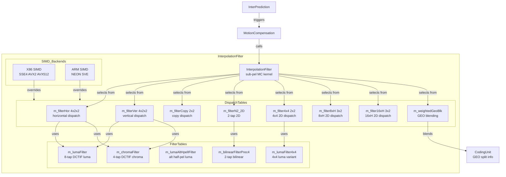
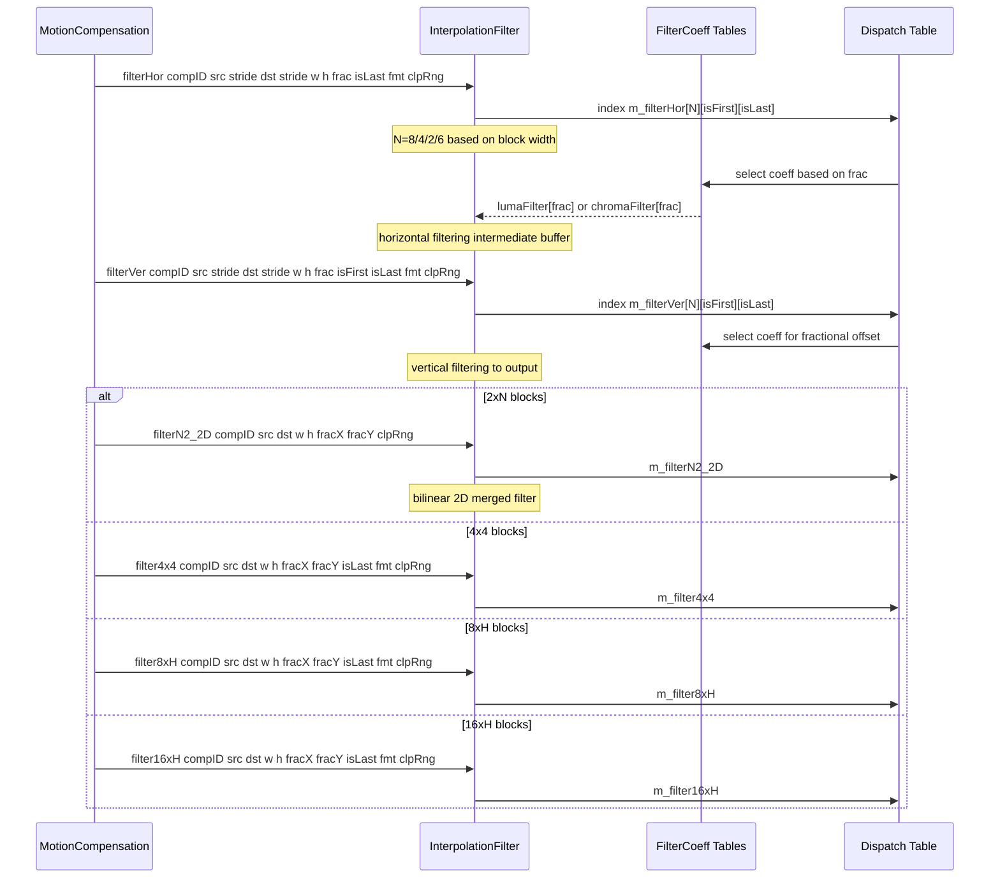
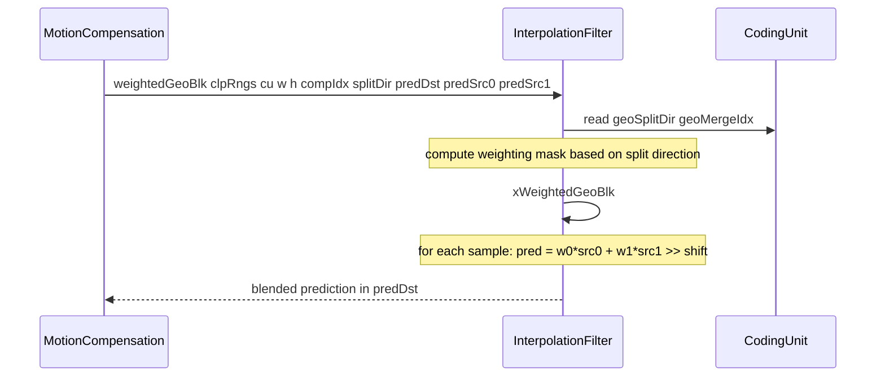
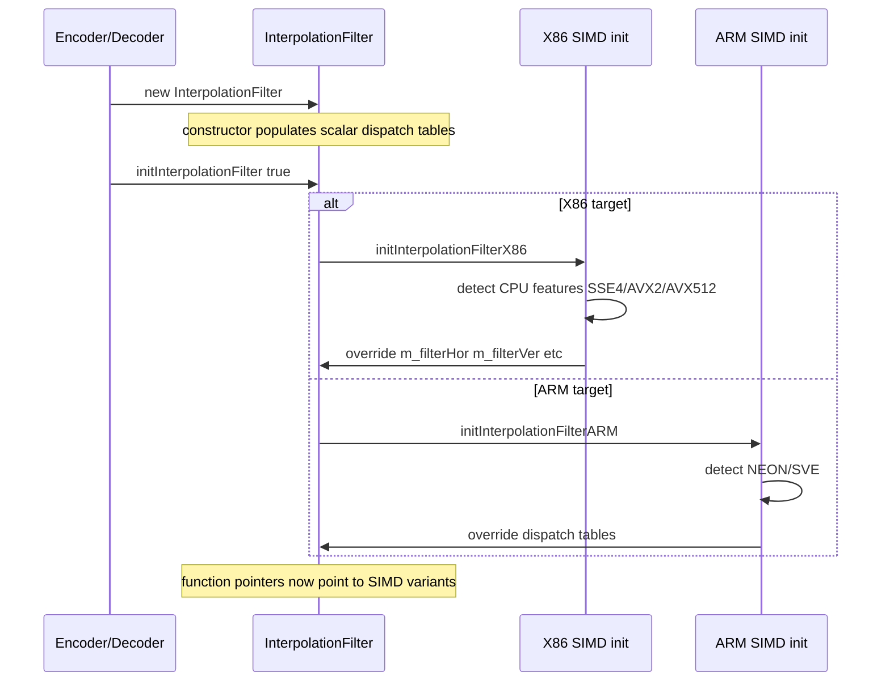

# InterpolationFilter — Sub-Pel Motion Compensation Kernels

## 1. Overview

The `InterpolationFilter` class provides DCTIF-based luma and chroma interpolation kernels for VVC sub-pel motion compensation. It supports 1/16-pel luma precision 8-tap DCTIF, 1/32-pel chroma precision 4-tap DCTIF, alternative half-pel luma filter, bilinear filter, and 2D optimised paths for block sizes 2, 4, 8, and 16. SIMD backends X86 and ARM dispatch via function-pointer tables initialised at construction.

**Dependencies**: `CommonDef.h` (`Pel`, `TFilterCoeff`, `NTAPS_LUMA`, `NTAPS_CHROMA`, `NTAPS_BILINEAR`, `LUMA_INTERPOLATION_FILTER_SUB_SAMPLE_POSITIONS`, `CHROMA_INTERPOLATION_FILTER_SUB_SAMPLE_POSITIONS`), `Unit.h` (`ComponentID`, `ChromaFormat`, `CodingUnit`), `Buffer.h` (`PelUnitBuf`).

**Lifecycle**: Instantiated once per encoder/decoder session. Constructor populates function-pointer dispatch tables. `initInterpolationFilter` optionally replaces with optimised SIMD routines.

## 2. Component Specifications

### 2.1 Preprocessor Constants

```cpp
#define IF_INTERNAL_PREC 14
#define IF_FILTER_PREC    6
#define IF_INTERNAL_OFFS (1 << (IF_INTERNAL_PREC - 1))
#define IF_INTERNAL_PREC_BILINEAR 10
#define IF_FILTER_PREC_BILINEAR   4
```

### 2.2 Class: `InterpolationFilter`

```cpp
#pragma once

#include "CommonDef.h"
#include "Common.h"
#include "Unit.h"

namespace vvenc {

class InterpolationFilter
{
public:
  static const TFilterCoeff m_lumaFilter4x4
    [LUMA_INTERPOLATION_FILTER_SUB_SAMPLE_POSITIONS + 1][NTAPS_LUMA];
  static const TFilterCoeff m_lumaFilter
    [LUMA_INTERPOLATION_FILTER_SUB_SAMPLE_POSITIONS + 1][NTAPS_LUMA];
  static const TFilterCoeff m_lumaAltHpelIFilter[NTAPS_LUMA];
  static const TFilterCoeff m_chromaFilter
    [CHROMA_INTERPOLATION_FILTER_SUB_SAMPLE_POSITIONS + 1][NTAPS_CHROMA];
  static const TFilterCoeff m_bilinearFilterPrec4
    [LUMA_INTERPOLATION_FILTER_SUB_SAMPLE_POSITIONS][NTAPS_BILINEAR];

  // --- static filter templates ---

  template<bool isFirst, bool isLast>
  static void filterCopy(const ClpRng& clpRng, const Pel* src, int srcStride,
                         Pel* dst, int dstStride, int width, int height,
                         bool biMCForDMVR);

  template<int N, bool isVertical, bool isFirst, bool isLast>
  static void filter(const ClpRng& clpRng, Pel const *src, int srcStride,
                     Pel* dst, int dstStride, int width, int height,
                     TFilterCoeff const *coeff);

  template<int N>
  void filterHor(const ClpRng& clpRng, Pel const* src, int srcStride,
                 Pel* dst, int dstStride, int width, int height,
                 bool isLast, TFilterCoeff const *coeff);

  template<int N>
  void filterVer(const ClpRng& clpRng, Pel const* src, int srcStride,
                 Pel* dst, int dstStride, int width, int height,
                 bool isFirst, bool isLast, TFilterCoeff const *coeff);

  // --- block-size specialised ---

  template<bool isLast, int w>
  static void filterWxH_N2(const ClpRng& clpRng, Pel const *src, int srcStride,
                           Pel* dst, int dstStride, int width, int height,
                           TFilterCoeff const *coeffH, TFilterCoeff const *coeffV);

  template<bool isLast, int w>
  static void filterWxH_N4(const ClpRng& clpRng, Pel const *src, int srcStride,
                           Pel* dst, int dstStride, int width, int height,
                           TFilterCoeff const *coeffH, TFilterCoeff const *coeffV);

  template<bool isLast, int w>
  static void filterWxH_N8(const ClpRng& clpRng, Pel const *src, int srcStride,
                           Pel* dst, int dstStride, int width, int height,
                           TFilterCoeff const *coeffH, TFilterCoeff const *coeffV);

  static void scalarFilterN2_2D(const ClpRng& clpRng, Pel const *src, int srcStride,
                                Pel* dst, int dstStride, int width, int height,
                                TFilterCoeff const *ch, TFilterCoeff const *cv);

  // --- geometric blending ---

  static void xWeightedGeoBlk(const ClpRngs &clpRngs, const CodingUnit& cu,
                              const uint32_t width, const uint32_t height,
                              const ComponentID compIdx, const uint8_t splitDir,
                              PelUnitBuf &predDst, PelUnitBuf &predSrc0,
                              PelUnitBuf &predSrc1);
  void weightedGeoBlk(const ClpRngs &clpRngs, const CodingUnit& cu,
                      const uint32_t width, const uint32_t height,
                      const ComponentID compIdx, const uint8_t splitDir,
                      PelUnitBuf &predDst, PelUnitBuf &predSrc0,
                      PelUnitBuf &predSrc1);

  InterpolationFilter();
  ~InterpolationFilter() {}

  // --- function-pointer dispatch tables ---

  void (*m_filterN2_2D)(const ClpRng& clpRng, Pel const *src, int srcStride,
                        Pel* dst, int dstStride, int width, int height,
                        TFilterCoeff const *ch, TFilterCoeff const *cv);
  void (*m_filterHor[4][2][2])(const ClpRng& clpRng, Pel const *src, int srcStride,
                               Pel* dst, int dstStride, int width, int height,
                               TFilterCoeff const *coeff);
  void (*m_filterVer[4][2][2])(const ClpRng& clpRng, Pel const *src, int srcStride,
                               Pel* dst, int dstStride, int width, int height,
                               TFilterCoeff const *coeff);
  void (*m_filterCopy[2][2])(const ClpRng& clpRng, Pel const *src, int srcStride,
                             Pel* dst, int dstStride, int width, int height,
                             bool biMCForDMVR);
  void (*m_filter4x4[2][2])(const ClpRng& clpRng, Pel const *src, int srcStride,
                            Pel* dst, int dstStride, int width, int height,
                            TFilterCoeff const *coeffH, TFilterCoeff const *coeffV);
  void (*m_filter8xH[3][2])(const ClpRng& clpRng, Pel const *src, int srcStride,
                            Pel* dst, int dstStride, int width, int height,
                            TFilterCoeff const *coeffH, TFilterCoeff const *coeffV);
  void (*m_filter16xH[3][2])(const ClpRng& clpRng, Pel const *src, int srcStride,
                             Pel* dst, int dstStride, int width, int height,
                             TFilterCoeff const *coeffH, TFilterCoeff const *coeffV);
  void (*m_weightedGeoBlk)(const ClpRngs &clpRngs, const CodingUnit& cu,
                           const uint32_t width, const uint32_t height,
                           const ComponentID compIdx, const uint8_t splitDir,
                           PelUnitBuf &predDst, PelUnitBuf &predSrc0,
                           PelUnitBuf &predSrc1);

  // --- initialisation ---

  void initInterpolationFilter( bool enable );
#if defined(TARGET_SIMD_X86) && ENABLE_SIMD_OPT_MCIF
  void initInterpolationFilterX86();
  template <X86_VEXT vext>
  void _initInterpolationFilterX86();
#endif
#if defined(TARGET_SIMD_ARM) && ENABLE_SIMD_OPT_MCIF
  void initInterpolationFilterARM();
  template <ARM_VEXT vext>
  void _initInterpolationFilterARM();
#endif

  void syncToGlobal();                  // Sync per-instance dispatch tables to the global g_vvenc singleton.

  // --- public entry points ---

  void filterN2_2D(const ComponentID compID, Pel const *src, int srcStride,
                   Pel* dst, int dstStride, int width, int height,
                   int fracX, int fracY, const ClpRng& clpRng);
  void filter4x4(const ComponentID compID, Pel const *src, int srcStride,
                 Pel* dst, int dstStride, int width, int height,
                 int fracX, int fracY, bool isLast, const ChromaFormat fmt,
                 const ClpRng& clpRng, bool useAltHpelIf = false,
                 int nFilterIdx = 0);
  void filter8xH(const ComponentID compID, Pel const *src, int srcStride,
                 Pel* dst, int dstStride, int width, int height,
                 int fracX, int fracY, bool isLast, const ChromaFormat fmt,
                 const ClpRng& clpRng, bool useAltHpelIf = false,
                 int nFilterIdx = 0);
  void filter16xH(const ComponentID compID, Pel const *src, int srcStride,
                  Pel* dst, int dstStride, int width, int height,
                  int fracX, int fracY, bool isLast, const ChromaFormat fmt,
                  const ClpRng& clpRng, bool useAltHpelIf = false,
                  int nFilterIdx = 0);
  void filterHor(const ComponentID compID, Pel const* src, int srcStride,
                 Pel* dst, int dstStride, int width, int height,
                 int frac, bool isLast, const ChromaFormat fmt,
                 const ClpRng& clpRng, bool useAltHpelIf = false,
                 int nFilterIdx = 0, int reduceTap = 0);
  void filterVer(const ComponentID compID, Pel const* src, int srcStride,
                 Pel* dst, int dstStride, int width, int height,
                 int frac, bool isFirst, bool isLast, const ChromaFormat fmt,
                 const ClpRng& clpRng, bool useAltHpelIf = false,
                 int nFilterIdx = 0, int reduceTap = 0);

  static TFilterCoeff const * const getChromaFilterTable(const int deltaFract);
};

}
```

## 3. System Architecture



## 4. Detailed Data Flow

### 4.1 Sub-Pel Motion Compensation



### 4.2 Geometric Blending Flow



### 4.3 SIMD Initialisation



## 5. Visualisation

### 5.1 Animation Description

The interpolation filter animation visualises the sub-pel motion compensation pipeline across 12 keyframes:

- **FilterSelect**: A dropdown indicator showing which block-size specialised path is active (copy / hor-ver / N2 / 4x4 / 8xH / 16xH / geo).
- **KernelView**: A grid visualising the selected DCTIF coefficients highlighting nonzero taps.
- **FractionIndicator**: A marker showing the current sub-pel fraction 0-15 for luma or 0-31 for chroma.
- **SIMDBadge**: An icon indicating scalar vs X86 vs ARM SIMD dispatch.
- **OperationFeed**: A scrollable log of each filter invocation.

**Keyframe sequence**:
1. Constructor — dispatch tables populated with scalar kernels
2. `initInterpolationFilter X86` — dispatch overridden to AVX2
3. `filterHor` luma 1/4-pel — horizontal 8-tap
4. `filterVer` luma 1/4-pel — vertical 8-tap
5. `filterN2_2D` bilinear — 2-tap 2D merged
6. `filter4x4` 4x4 block — specialised 2D path
7. `filter8xH` 8xH block — specialised 2D path
8. `filter16xH` 16xH block — specialised 2D path
9. `filterCopy` DMVR — direct copy path
10. `filterHor` chroma 1/32-pel — chroma 4-tap horizontal
11. `filterVer` chroma 1/32-pel — chroma 4-tap vertical
12. `weightedGeoBlk` — geometric partitioning blending

### 5.2 Animation Source

Not applicable — D3 animation not required for this spec.

## 6. Testing Requirements

### Unit Tests (new file: `test/vvenc_unit_test/interpolation_filter_test.cpp`)

| Test ID | Method / Function | What to Verify |
|---|---|---|
| `IF_CONSTRUCTOR` | `InterpolationFilter()` | dispatch tables non-null |
| `IF_INIT_X86` | `initInterpolationFilterX86` | table pointers changed to SIMD variants |
| `IF_INIT_ARM` | `initInterpolationFilterARM` | table pointers changed to SIMD variants |
| `IF_FILTER_COPY` | `filterCopy` | identity copy with clamping |
| `IF_FILTER_HOR_LUMA` | `filterHor` luma | 8-tap horizontal at all 16 sub-pel positions |
| `IF_FILTER_VER_LUMA` | `filterVer` luma | 8-tap vertical at all 16 sub-pel positions |
| `IF_FILTER_HOR_CHROMA` | `filterHor` chroma | 4-tap horizontal at all 32 sub-pel positions |
| `IF_FILTER_VER_CHROMA` | `filterVer` chroma | 4-tap vertical at all 32 sub-pel positions |
| `IF_FILTER_N2_2D` | `filterN2_2D` | bilinear 2D produces correct intermediate precision |
| `IF_FILTER_4X4` | `filter4x4` | block-specialised path matches general path |
| `IF_FILTER_8XH` | `filter8xH` | block-specialised path matches general path |
| `IF_FILTER_16XH` | `filter16xH` | block-specialised path matches general path |
| `IF_LUMA_FILTER_COEFF` | `m_lumaFilter` | DC gain = 64 at integer position |
| `IF_CHROMA_FILTER_COEFF` | `m_chromaFilter` | DC gain = 64 at integer position |
| `IF_BILINEAR_FILTER_COEFF` | `m_bilinearFilterPrec4` | sum of coeffs = 16 at each position |
| `IF_ALT_HPEL_COEFF` | `m_lumaAltHpelIFilter` | symmetric 0 3 9 20 20 9 3 0 |
| `IF_WEIGHTED_GEO` | `weightedGeoBlk` | blended output sum of weighted inputs |
| `IF_GET_CHROMA_TABLE` | `getChromaFilterTable` | returns correct row by deltaFract |
| `IF_IS_FIRST_LAST` | isFirst/isLast template params | boundary handling at picture edges |

### Calling-Order Validation

- `initInterpolationFilter` must be called after constructor but before any filter operations.
- Horizontal filtering must complete before vertical when using separable two-pass.
- Block-specialised 2D paths `filter4x4` / `filter8xH` / `filter16xH` are self-contained and do not require a separate hor/ver pass.

### Parameter Range Tests

- `filterHor` / `filterVer` `frac`: luma 0-15, chroma 0-31.
- `width` / `height`: all valid block dimensions 2, 4, 8, 16, 32, 64, 128.
- `reduceTap`: 0 full-tap, 1 reduced-tap boundary handling.
- `useAltHpelIf`: true/false for half-pel luma positions.

### Integration Tests

Covered by `vvenc_unit_test.cpp` which exercises motion compensation through full encode/decode cycles. New dedicated file supplements but does not modify the regression baseline.

## 7. CLI Entry Point

Not directly exposed via CLI. `InterpolationFilter` is an internal utility consumed by `MotionCompensation` within `EncoderLib` and `DecoderLib`.
