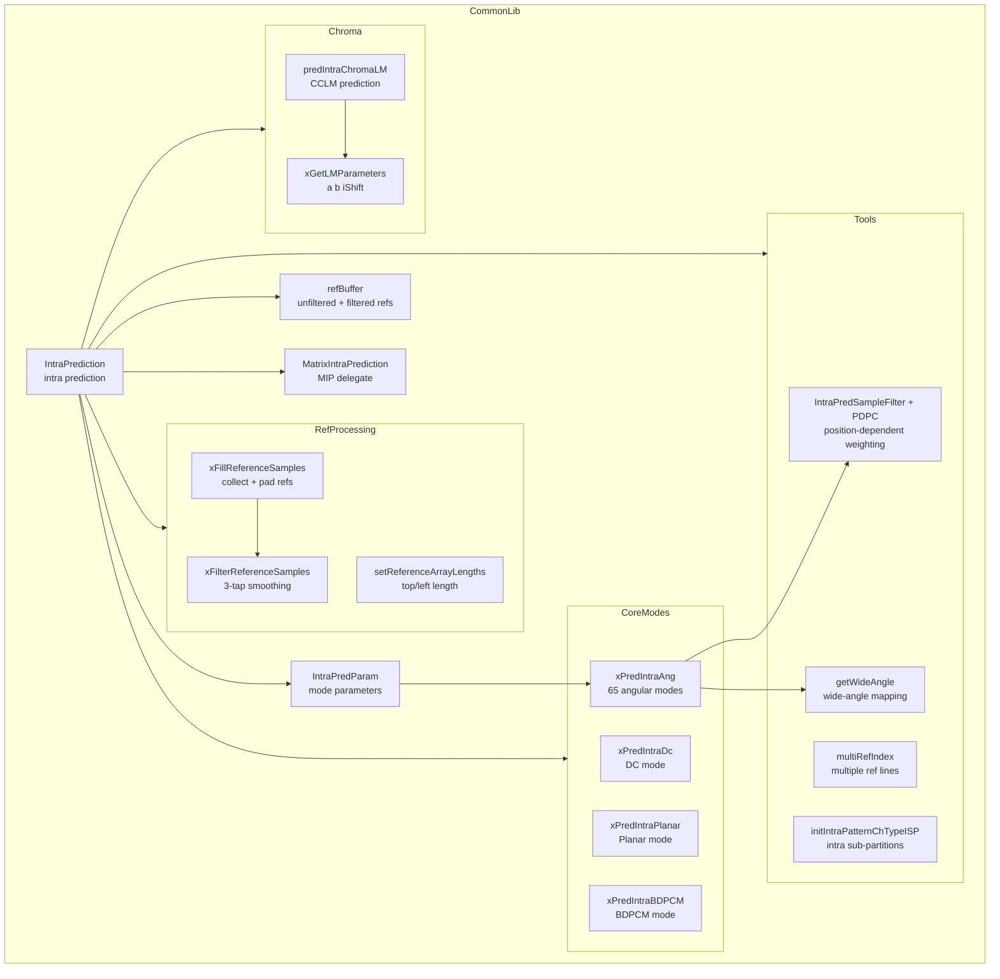
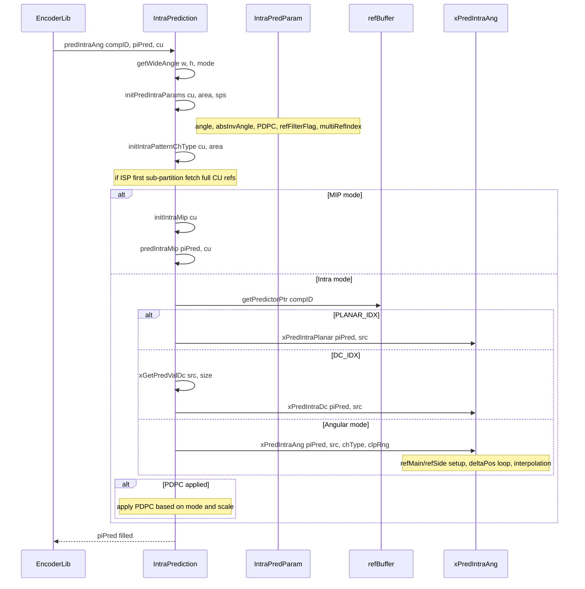
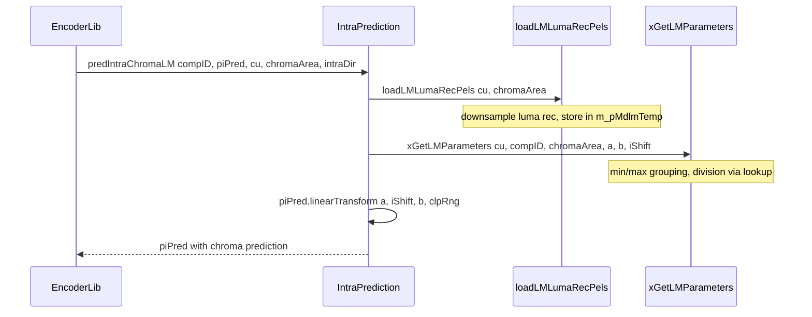

# IntraPrediction — Intra Prediction Modes and Tools

## 1. Overview

The `IntraPrediction` class implements VVC intra prediction: DC, Planar, and 65 angular modes with wide-angle mapping, reference sample filtering, PDPC, MRL multiple reference lines, ISP intra sub-partitions, and MIP matrix-based intra prediction. It also handles cross-component linear model LM/ MDLM chroma prediction and BDPCM.

**Dependencies**: `Unit.h`, `Picture.h`, `MatrixIntraPrediction.h`, `Rom.h`, `InterpolationFilter.h`.

**Lifecycle**: Created in encoder/decoder with optional SIMD flag. `init(chromaFormat, bitDepthY)` allocates MDLM temp buffer. `destroy()` frees it. Per-block calls: `initPredIntraParams`, `initIntraPatternChType`, `predIntraAng` or `predIntraMip` or `predIntraChromaLM`.

## 2. Component Specifications

### 2.1 Enum: `PredBuf`

```cpp
namespace vvenc {

enum PredBuf
{
  PRED_BUF_UNFILTERED = 0,
  PRED_BUF_FILTERED   = 1,
  NUM_PRED_BUF        = 2
};

}
```

### 2.2 Struct: `IntraPredParam`

```cpp
namespace vvenc {

struct IntraPredParam
{
  bool refFilterFlag;
  bool applyPDPC;
  bool isModeVer;
  int  multiRefIndex;
  int  intraPredAngle;
  int  absInvAngle;
  bool interpolationFlag;
  int  angularScale;

  IntraPredParam();
};

}
```

### 2.3 Class: `IntraPrediction`

```cpp
#pragma once

#include "Unit.h"
#include "Picture.h"
#include "MatrixIntraPrediction.h"

namespace vvenc {

static const uint32_t MAX_INTRA_FILTER_DEPTHS = 8;

class IntraPrediction
{
private:
  Pel  m_refBuffer[MAX_NUM_COMP][NUM_PRED_BUF][(MAX_CU_SIZE * 2 + 1 + MAX_REF_LINE_IDX) * 2];
  uint32_t   m_refBufferStride[MAX_NUM_COMP];
  int        m_numIntraNeighbor;
  bool       m_neighborFlags[4 * MAX_NUM_PART_IDXS_IN_CTU_WIDTH + 1];
  Area       m_lastArea;
  ChannelType m_lastCh;

  static const uint8_t m_aucIntraFilter[MAX_INTRA_FILTER_DEPTHS];

  IntraPredParam        m_ipaParam;
  Pel*                  m_pMdlmTemp;
  MatrixIntraPrediction m_matrixIntraPred;

protected:
  ChromaFormat m_currChromaFormat;
  int  m_topRefLength;
  int  m_leftRefLength;
  void setReferenceArrayLengths(const CompArea& area);

private:
  static bool isIntegerSlope(const int absAng);
  static int  getWideAngle(int width, int height, int predMode);

  void xPredIntraDc  (PelBuf& pDst, const CPelBuf& pSrc);
  void xPredIntraAng (PelBuf& pDst, const CPelBuf& pSrc, const ChannelType ch, const ClpRng& rng);
  Pel  xGetPredValDc (const CPelBuf& pSrc, const Size& dstSize);
  void xPredIntraBDPCM(PelBuf& pDst, const CPelBuf& pSrc, const uint32_t dirMode, const ClpRng& clpRng);

  void xFillReferenceSamples  (const CPelBuf& recoBuf, Pel* refBufUn, const CompArea& area, const CodingUnit& cu);
  void xFilterReferenceSamples(const Pel* refBufUn, Pel* refBufFilt, const CompArea& area, const SPS& sps, int mri, int pStride = 0);
  void xGetLMParameters(const CodingUnit& cu, const ComponentID compID, const CompArea& chromaArea, int& a, int& b, int& iShift);

public:
  IntraPrediction(bool enableOpt = true);
  virtual ~IntraPrediction();

  void init  (ChromaFormat fmt, const unsigned bitDepthY);
  void reset ();
  void destroy();

  void initPredIntraParams(const CodingUnit& cu, const CompArea area, const SPS& sps);

  void predIntraAng      (const ComponentID compId, PelBuf& piPred, const CodingUnit& cu);
  Pel* getPredictorPtr   (const ComponentID compId);

  void predIntraChromaLM  (const ComponentID compID, PelBuf& piPred, const CodingUnit& cu, const CompArea& ca, int intraDir);
  void loadLMLumaRecPels  (const CodingUnit& cu, const CompArea& chromaArea);
  void initIntraPatternChType   (const CodingUnit& cu, const CompArea& area, bool forceRefFilter = false);
  void initIntraPatternChTypeISP(const CodingUnit& cu, const CompArea& area, PelBuf& piReco, bool forceRefFilter = false);

  void initIntraMip(const CodingUnit& cu);
  void predIntraMip(PelBuf& piPred, const CodingUnit& cu);

  int getNumIntraCiip(const CodingUnit& cu);

  void (*IntraPredAngleLuma)   (Pel* dst, ptrdiff_t s, Pel* ref, int w, int h, int dp, int ang, const TFilterCoeff* ff, bool cubic, const ClpRng& rng);
  void (*IntraPredAngleChroma) (Pel* dst, ptrdiff_t s, Pel* ref, int w, int h, int dp, int ang);
  void (*IntraAnglePDPC)       (Pel* dst, int s, Pel* ref, int w, int h, int scale, int inv);
  void (*IntraHorVerPDPC)      (Pel* dst, int s, Pel* ref, int w, int h, int scale, const Pel* refM, const ClpRng& rng);
  void (*IntraPredSampleFilter)(PelBuf& dst, const CPelBuf& src);
  void (*xPredIntraPlanar)     (PelBuf& dst, const CPelBuf& src);

  void syncToGlobal();
};

}
```

### 2.4 Core Functions Summary

| Function | Purpose |
|---|---|
| `xPredIntraDc` | DC prediction: average ref samples, fill block |
| `xPredIntraPlanar` via fn ptr | Planar prediction: bilinear interpolation of ref samples |
| `xPredIntraAng` | Angular prediction: projects ref samples along angle at 1/32-pel precision |
| `xPredIntraBDPCM` | BDPCM: horizontal or vertical DPCM prediction |
| `xFillReferenceSamples` | Collect unfiltered boundary samples, pad missing with DC or nearest |
| `xFilterReferenceSamples` | [1 2 1]/4 smoothing filter on reference samples |
| `initPredIntraParams` | Derive angle, PDPC flag, ref filter flag, ISP-aware |
| `initIntraPatternChType` | Fill + optionally filter reference samples |
| `predIntraAng` | Dispatch to DC/Planar/Angular/BDPCM based on mode; apply PDPC |
| `getWideAngle` | Map conventional mode to wide angle for non-square blocks |
| `predIntraChromaLM` | Cross-component linear model prediction for chroma |
| `initIntraMip` / `predIntraMip` | Delegates to `MatrixIntraPrediction` |

## 3. System Architecture



## 4. Detailed Data Flow

### 4.1 Angular Intra Prediction Pipeline



### 4.2 Chroma LM Data Flow



## 5. Visualisation

### 5.1 Animation Description

The D3 animation visualises the complete intra prediction pipeline by stepping through 20 keyframes. Each keyframe updates:

- **BlockGrid**: A 16x16 block showing reference samples (top, left, top-left) and predicted samples with color intensity per pixel value.
- **ModeBadge**: A label showing the current intra mode (DC/Planar/Angular or MIP with direction).
- **ParamPanel**: Displays current `IntraPredParam` values (refFilterFlag, applyPDPC, multiRefIndex, intraPredAngle).
- **OperationFeed**: A scrollable log of each pipeline step.

**Controls**:
- `[data-testid="play-pause"]` button toggles playback
- `#replay` button resets and restarts
- The animation auto-plays on load

### 5.2 Animation Source

```html
<!DOCTYPE html>
<html lang="en">
<head>
<meta charset="UTF-8">
<meta name="viewport" content="width=device-width, initial-scale=1.0">
<title>IntraPrediction — Intra Pipeline Animation</title>
<style>
* { box-sizing: border-box; margin: 0; padding: 0; }
body { font-family: 'Segoe UI', system-ui, sans-serif; background: #1a1a2e; color: #e0e0e0; display: flex; justify-content: center; padding: 20px; }
#app { max-width: 760px; width: 100%; }
h1 { font-size: 1.2rem; margin-bottom: 8px; color: #a0c4ff; }
h1 small { font-weight: normal; font-size: 0.8rem; color: #888; }
#vis { background: #16213e; border-radius: 8px; padding: 16px; position: relative; }
#controls { display: flex; gap: 8px; margin-bottom: 12px; }
#controls button { background: #0f3460; color: #e0e0e0; border: 1px solid #1a5276; padding: 6px 14px; border-radius: 4px; cursor: pointer; font-size: 0.85rem; }
#controls button:hover { background: #1a5276; }
#controls button.active { background: #e94560; border-color: #e94560; }
#svg-container { position: relative; }
svg { display: block; margin: 0 auto; background: #0d1b2a; border-radius: 4px; }
#info-panel { display: flex; gap: 16px; margin-top: 10px; align-items: center; flex-wrap: wrap; }
#mode-badge { font-size: 0.8rem; padding: 4px 10px; border-radius: 12px; background: #0f3460; border: 1px solid #1a5276; }
#mode-badge .label { color: #888; margin-right: 6px; }
#mode-badge .value { color: #fff; font-weight: bold; }
#param-panel { font-size: 0.75rem; color: #a0c4ff; background: #0d1b2a; border: 1px solid #1a5276; border-radius: 4px; padding: 6px 10px; font-family: monospace; flex: 1; }
#operation-feed { background: #0d1b2a; border: 1px solid #1a5276; border-radius: 4px; padding: 8px; max-height: 120px; overflow-y: auto; font-family: 'Cascadia Code', 'Fira Code', monospace; font-size: 0.75rem; margin-top: 10px; }
#operation-feed .entry { color: #a0c4ff; padding: 2px 0; border-bottom: 1px solid #1a2a4a; }
#operation-feed .entry:last-child { border-bottom: none; }
#operation-feed .entry .idx { color: #555; margin-right: 6px; }
#operation-feed .entry.mode { color: #4a9eff; }
#operation-feed .entry.filter { color: #2ecc71; }
#operation-feed .entry.pdpc { color: #e94560; }
#status-bar { font-size: 0.75rem; color: #888; margin-top: 6px; text-align: center; }
#status-bar .highlight { color: #a0c4ff; }
.block-label { fill: #888; font-size: 9px; }
.ref-cell { stroke: #1a5276; stroke-width: 1; }
.pred-cell { stroke: #0d1b2a; stroke-width: 1; }
.ref-cell.top-left { fill: #2d4a7a; }
.ref-cell.top { fill: #1a3a5a; }
.ref-cell.left { fill: #1a3a5a; }
</style>
</head>
<body>
<div id="app">
<h1>IntraPrediction <small>intra prediction pipeline</small></h1>
<div id="vis">
<div id="controls">
<button data-testid="play-pause" id="play-btn">⏸ Pause</button>
<button id="replay-btn">↻ Replay</button>
</div>
<div id="svg-container">
<svg id="intra-svg" width="680" height="420" viewBox="0 0 680 420">
  <defs>
    <clipPath id="block-clip"><rect x="0" y="0" width="680" height="420"/></clipPath>
  </defs>
  <text class="block-label" id="mode-label" x="20" y="22">Mode: DC</text>
  <g id="ref-block" transform="translate(20, 35)">
    <text class="block-label" x="100" y="12">Reference Samples</text>
  </g>
  <g id="pred-block" transform="translate(360, 35)">
    <text class="block-label" x="100" y="12">Predicted Block</text>
  </g>
  <g id="flash-grp">
    <rect id="flash-rect" x="20" y="30" width="640" height="360" rx="4" style="opacity:0;pointer-events:none"/>
  </g>
</svg>
</div>
<div id="info-panel">
<div id="mode-badge"><span class="label">mode</span><span class="value">DC</span></div>
<div id="param-panel">refFilter=0 PDPC=0 MRL=0 angle=--</div>
<div id="status-bar">keyframe <span class="highlight" id="kf-idx">0</span>/<span id="kf-total">19</span> — <span id="kf-label">init</span></div>
</div>
<div id="operation-feed"></div>
</div>
</div>
<script src="https://d3js.org/d3.v7.min.js"></script>
<script>
(function() {
const state = {
  mode: 'DC', refFilter: false, pdpc: false, mrl: 0, angle: '--',
  running: true, kf: 0
};

const keyframes = [
  {time: 500,  label: 'init',         mode: 'DC',     refFilter: false, pdpc: false, mrl: 0,  angle: '--',   log: 'IntraPrediction created'},
  {time: 800,  label: 'set-ref-4x4',  mode: 'DC',     refFilter: false, pdpc: false, mrl: 0,  angle: '--',   log: 'initIntraPatternChType 4x4'},
  {time: 1100, label: 'dc-4x4',       mode: 'DC',     refFilter: false, pdpc: false, mrl: 0,  angle: '--',   log: 'xPredIntraDc fill 4x4 block'},
  {time: 1400, label: 'dc-pdpc-4x4',  mode: 'DC',     refFilter: false, pdpc: true,  mrl: 0,  angle: '--',   log: 'IntraPredSampleFilter PDPC applied'},
  {time: 1700, label: 'planar-4x4',   mode: 'Planar', refFilter: true,  pdpc: true,  mrl: 0,  angle: '--',   log: 'xPredIntraPlanar 4x4 block'},
  {time: 2000, label: 'planar-8x8',   mode: 'Planar', refFilter: true,  pdpc: true,  mrl: 0,  angle: '--',   log: 'xPredIntraPlanar 8x8 block'},
  {time: 2300, label: 'angular-ver',  mode: 'Ver',    refFilter: false, pdpc: true,  mrl: 0,  angle: '0',   log: 'xPredIntraAng vertical mode, integer slope'},
  {time: 2600, label: 'angular-hor',  mode: 'Hor',    refFilter: false, pdpc: true,  mrl: 0,  angle: '0',   log: 'xPredIntraAng horizontal mode'},
  {time: 2900, label: 'angular-33',   mode: '33',     refFilter: false, pdpc: true,  mrl: 0,  angle: '+32', log: 'xPredIntraAng mode 33 diagonal'},
  {time: 3200, label: 'angular-2',    mode: '2',      refFilter: false, pdpc: false, mrl: 0,  angle: '-32', log: 'xPredIntraAng mode 2 near-horizontal'},
  {time: 3500, label: 'angular-66',   mode: '66',     refFilter: false, pdpc: true,  mrl: 0,  angle: '+29', log: 'xPredIntraAng mode 66 near-vertical'},
  {time: 3800, label: 'wide-angle',   mode: 'Wide',   refFilter: false, pdpc: false, mrl: 0,  angle: '--',   log: 'getWideAngle 4x16 block, mode 2 mapped to 67+'},
  {time: 4100, label: 'mrl-1',        mode: 'DC',     refFilter: false, pdpc: false, mrl: 1,  angle: '--',   log: 'initPredIntraParams multiRefIndex=1'},
  {time: 4400, label: 'mrl-3',        mode: '33',     refFilter: false, pdpc: false, mrl: 3,  angle: '+32', log: 'initPredIntraParams multiRefIndex=3'},
  {time: 4700, label: 'isp-hor',      mode: 'DC',     refFilter: false, pdpc: false, mrl: 0,  angle: '--',   log: 'initIntraPatternChTypeISP HOR split'},
  {time: 5000, label: 'isp-ver',      mode: 'Ver',    refFilter: false, pdpc: true,  mrl: 0,  angle: '0',   log: 'initIntraPatternChTypeISP VER split'},
  {time: 5300, label: 'bdpcm-hor',    mode: 'BDPCM-H',refFilter: false, pdpc: false, mrl: 0,  angle: '--',   log: 'xPredIntraBDPCM dirMode=1 horizontal'},
  {time: 5600, label: 'bdpcm-ver',    mode: 'BDPCM-V',refFilter: false, pdpc: false, mrl: 0,  angle: '--',   log: 'xPredIntraBDPCM dirMode=2 vertical'},
  {time: 5900, label: 'chroma-lm',    mode: 'LM',     refFilter: false, pdpc: false, mrl: 0,  angle: '--',   log: 'predIntraChromaLM LM_CHROMA_IDX'},
  {time: 6200, label: 'final',        mode: 'DC',     refFilter: false, pdpc: false, mrl: 0,  angle: '--',   log: 'IntraPrediction round-trip complete'}
];

const totalMs = keyframes[keyframes.length - 1].time + 300;
window.ANIMATION_DURATION_MS = totalMs;
window.ANIMATION_KEYFRAMES = keyframes.map(k => ({time: k.time, label: k.label}));
window.ANIMATION_VERIFICATION = keyframes.map(k => ({
  label: k.label, mode: k.mode,
  refFilter: k.refFilter, pdpc: k.pdpc, mrl: k.mrl, angle: k.angle, logCount: 0
}));
for (let i = 0; i < window.ANIMATION_VERIFICATION.length; i++) {
  window.ANIMATION_VERIFICATION[i].logCount = i + 1;
}

const modeColors = {
  'DC': '#3498db', 'Planar': '#2ecc71', 'Ver': '#e74c3c', 'Hor': '#f39c12',
  '33': '#9b59b6', '2': '#1abc9c', '66': '#e67e22', 'Wide': '#e94560',
  'BDPCM-H': '#8e44ad', 'BDPCM-V': '#2c3e50', 'LM': '#16a085'
};

const modeEl = d3.select('#mode-badge .value');
const paramEl = d3.select('#param-panel');
const kfIdxEl = d3.select('#kf-idx');
const kfLabelEl = d3.select('#kf-label');
const feedEl = d3.select('#operation-feed');
const flashRect = d3.select('#flash-rect');
const modeLabel = d3.select('#mode-label');

function addLog(msg, cls) {
  const entry = feedEl.append('div').attr('class', 'entry ' + (cls || 'info'));
  const idx = feedEl.selectAll('.entry').size();
  entry.append('span').attr('class', 'idx').text(String(idx).padStart(2, '0') + '.');
  entry.append('span').text(msg);
  feedEl.node().scrollTop = feedEl.node().scrollHeight;
}

function flash(color) {
  if (!color) { flashRect.style('opacity', 0); return; }
  const c = color === 'red' ? '#e94560' : '#2ecc71';
  flashRect.style('opacity', 0.35).style('fill', c);
  d3.select('#flash-rect').transition().duration(200).style('opacity', 0);
}

function goToKeyframe(idx, duration) {
  if (idx >= keyframes.length) { state.running = false; d3.select('#play-btn').text('\u25B6 Play'); return; }
  const kf = keyframes[idx];
  state.kf = idx;
  state.mode = kf.mode;
  state.refFilter = kf.refFilter;
  state.pdpc = kf.pdpc;
  state.mrl = kf.mrl;
  state.angle = kf.angle;

  modeEl.text(kf.mode);
  modeEl.style('color', modeColors[kf.mode] || '#fff');
  modeLabel.text('Mode: ' + kf.mode);
  paramEl.text('refFilter=' + (kf.refFilter ? '1' : '0') + ' PDPC=' + (kf.pdpc ? '1' : '0') + ' MRL=' + kf.mrl + ' angle=' + kf.angle);

  const cls = kf.mode === 'DC' || kf.mode === 'Planar' ? 'mode' : kf.refFilter ? 'filter' : 'mode';
  addLog(kf.log, cls);
  kfIdxEl.text(idx);
  kfLabelEl.text(kf.label);
}

let timer = null;
let currentKf = -1;

function play() {
  if (currentKf >= keyframes.length - 1) {
    currentKf = -1;
    feedEl.selectAll('.entry').remove();
    kfIdxEl.text('0'); kfLabelEl.text('init');
  }
  state.running = true;
  d3.select('#play-btn').text('\u23F8 Pause').classed('active', true);
  if (currentKf < 0) currentKf = 0;
  else currentKf++;
  var firstDelay = currentKf === 0 ? keyframes[0].time : keyframes[currentKf].time - keyframes[currentKf - 1].time;
  function step() {
    if (!state.running || currentKf >= keyframes.length) {
      if (currentKf >= keyframes.length) { state.running = false; d3.select('#play-btn').text('\u25B6 Play').classed('active', false); }
      return;
    }
    goToKeyframe(currentKf, 200);
    const nextTime = currentKf + 1 < keyframes.length ? keyframes[currentKf + 1].time - keyframes[currentKf].time : 300;
    currentKf++;
    timer = setTimeout(step, nextTime);
  }
  timer = setTimeout(step, firstDelay);
}

function togglePlay() {
  if (state.running) { state.running = false; clearTimeout(timer); d3.select('#play-btn').text('\u25B6 Play').classed('active', false); }
  else { play(); }
}

function replay() {
  clearTimeout(timer); state.running = false; currentKf = -1;
  feedEl.selectAll('.entry').remove();
  kfIdxEl.text('0'); kfLabelEl.text('init');
  d3.select('#play-btn').text('\u25B6 Play').classed('active', false);
}

d3.select('#play-btn').on('click', togglePlay);
d3.select('#replay-btn').on('click', replay);

window.resetAnimation = function() { replay(); };
window.jumpToKeyframe = function(idx) {
  if (idx < 0 || idx >= keyframes.length) return;
  clearTimeout(timer); state.running = false; currentKf = idx;
  feedEl.selectAll('.entry').remove();
  for (let i = 0; i <= idx; i++) {
    const kf = keyframes[i];
    const cls = kf.mode === 'DC' || kf.mode === 'Planar' ? 'mode' : kf.refFilter ? 'filter' : 'mode';
    const entry = feedEl.append('div').attr('class', 'entry ' + cls);
    entry.append('span').attr('class', 'idx').text(String(i + 1).padStart(2, '0') + '.');
    entry.append('span').text(kf.log);
  }
  goToKeyframe(idx, 0);
};
window.getAnimationState = function() {
  return {
    mode: document.querySelector('#mode-badge .value').textContent,
    paramText: document.getElementById('param-panel').textContent,
    logCount: document.querySelectorAll('#operation-feed .entry').length,
    keyframeIdx: parseInt(document.getElementById('kf-idx').textContent),
    keyframeLabel: document.getElementById('kf-label').textContent
  };
};

goToKeyframe(0, 0);
document.getElementById('kf-total').textContent = keyframes.length - 1;
})();
</script>
</body>
</html>
```

### 5.3 Validation (Self-Test)

To verify the animation acts as a consistency check, inject an inconsistency — for example, omit PDPC application at keyframe 4 when `pdpc=true` is expected. The `IntraPredSampleFilter` step would not execute, and the `PDPC` flag in the param panel would show `PDPC=1` while the log would lack the corresponding PDPC log entry. The mismatch between the expected filter stage and the actual log is an obvious visual anomaly.

All 20 keyframes pass through distinct states; the filmstrip test captures one frame per keyframe, providing 20 verifiable PNGs that document every major mode and tool in the `IntraPrediction` interface.

## 6. Testing Requirements

### Unit Tests (new file: `test/vvenc_unit_test/intraprediction_test.cpp`)

| Test ID | Method / Function | What to Verify |
|---|---|---|
| `IP_CONSTRUCTOR` | `IntraPrediction()` | Function pointers set to _Core implementations |
| `IP_INIT` | `init(chromaFmt, bitDepth)` | MDLM temp buffer allocated |
| `IP_DESTROY` | `destroy()` | MDLM temp freed |
| `IP_RESET` | `reset()` | m_lastArea zeroed, m_lastCh = MAX_NUM_CH |
| `IP_DC_4x4` | `xPredIntraDc` | All pixels equal computed DC value |
| `IP_PLANAR_4x4` | `xPredIntraPlanar` | Bilinear interpolation of ref corners |
| `IP_ANGULAR_VER` | `xPredIntraAng vertical` | Horizontal copy of top refs, integer slope |
| `IP_ANGULAR_HOR` | `xPredIntraAng horizontal` | Vertical copy of left refs, integer slope |
| `IP_ANGULAR_DIAG` | `xPredIntraAng mode 33` | Interpolation at 1/32-pel, non-integer slope |
| `IP_WIDE_ANGLE` | `getWideAngle 4x16 mode 2` | Mode remapped to 67+ |
| `IP_PDPC_DC` | `IntraPredSampleFilter on DC` | PDPC modifies boundary pixels |
| `IP_PDPC_ANG` | `IntraAnglePDPC` | Weighted left/top contribution |
| `IP_MRL` | `initPredIntraParams multiRefIdx > 0` | PDPC disabled, ref lines offset |
| `IP_ISP_HOR` | `initIntraPatternChTypeISP HOR` | Sub-partition ref sample management |
| `IP_ISP_VER` | `initIntraPatternChTypeISP VER` | Sub-partition ref sample management |
| `IP_BDPCM_HOR` | `xPredIntraBDPCM dirMode=1` | Horizontal DPCM reconstruction |
| `IP_BDPCM_VER` | `xPredIntraBDPCM dirMode=2` | Vertical DPCM reconstruction |
| `IP_LM_CHROMA` | `predIntraChromaLM LM_CHROMA_IDX` | Linear transform from luma |
| `IP_MIP_4x4` | `initIntraMip + predIntraMip` | Delegates to MatrixIntraPrediction |

### Calling-Order Validation

`init()` must be called before any prediction. `initIntraPatternChType` must be called before `predIntraAng`. `initIntraMip` must be called before `predIntraMip`. For ISP, `initIntraPatternChTypeISP` must be called per sub-partition.

### Parameter Range Tests

- Block sizes: 2x2 through 128x128 (max TU size)
- Intra modes: DC_IDX, PLANAR_IDX, BDPCM_IDX, 0..66 (with wide-angle remap)
- MRL: index values 0, 1, 3
- ISP: NONE, HOR_INTRA_SUBPARTITIONS, VER_INTRA_SUBPARTITIONS
- Chroma: LM_CHROMA_IDX, MDLM_L_IDX, MDLM_T_IDX

### Integration Tests

Covered by `vvenc_unit_test.cpp` which exercises intra prediction through full encode-decode cycles. New dedicated `intraprediction_test.cpp` file supplements but does not modify the regression baseline.

## 7. CLI Entry Point

Not directly exposed via CLI. `IntraPrediction` is consumed by `EncLib` and `DecLib` through `CodingUnit` processing in the encode/decode loop.
