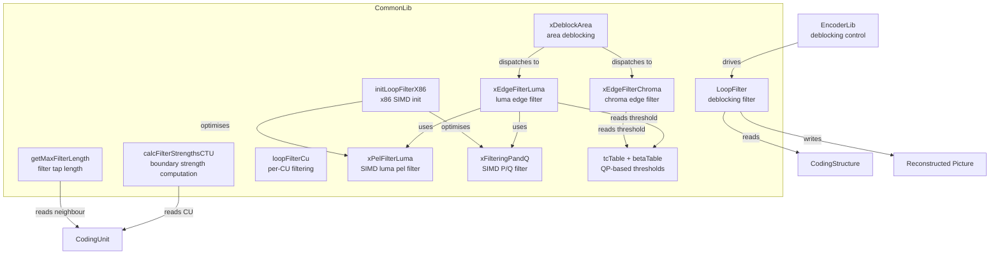
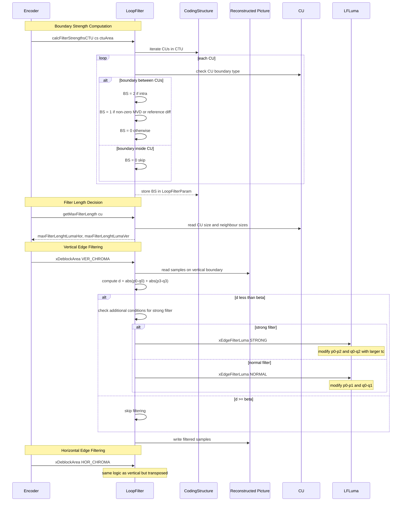
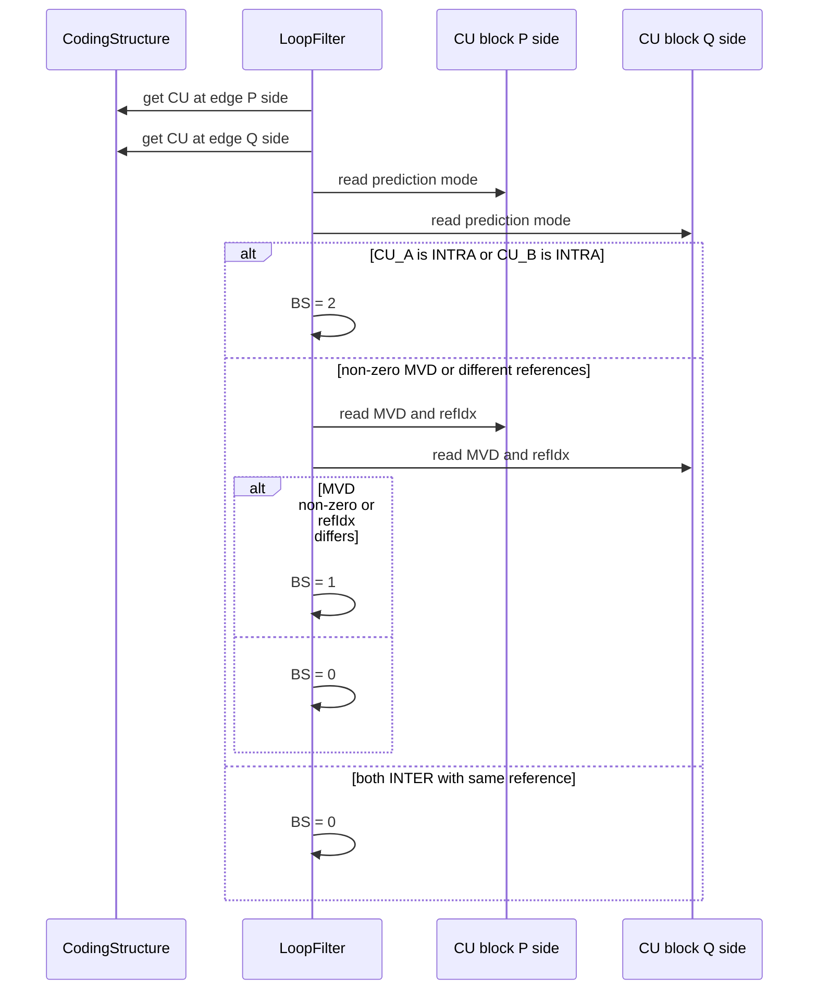

# LoopFilter — Deblocking Filter

## 1. Overview

The `LoopFilter` class implements the VVC deblocking filter for reducing blocking artefacts at CU/TU/PU boundaries. It computes boundary strength (BS) values, determines whether filtering should be applied on/off per boundary segment, and selects between strong and normal filtering modes for luma and chroma. The filter is applied in two edge directions: vertical edges (filtered horizontally) and horizontal edges (filtered vertically).

**Dependencies**: `CommonDef.h`, `Unit.h`, `Picture.h`, SIMD backend headers.

**Lifecycle**: One `LoopFilter` instance per encoding session. No explicit init required. `calcFilterStrengthsCTU` is called per CTU to compute boundary strengths, followed by `loopFilterCu` to apply filtering.

## 2. Component Specifications

### 2.1 Constants

```cpp
#define DEBLOCK_SMALLEST_BLOCK  8
```

### 2.2 Class: `LoopFilter`

```cpp
class LoopFilter
{
private:
  template<DeblockEdgeDir edgeDir>
  void xEdgeFilterLuma(const CodingStructure& cs, const Position& pos,
    const LoopFilterParam& lfp, PelUnitBuf& picReco) const;
  template<DeblockEdgeDir edgeDir>
  void xEdgeFilterChroma(const CodingStructure& cs, const Position& pos,
    const LoopFilterParam& lfp, PelUnitBuf& picReco) const;

  static const uint16_t sm_tcTable[MAX_QP + 3];
  static const uint8_t  sm_betaTable[MAX_QP + 1];

  void (*xPelFilterLuma)(Pel* piSrc, const ptrdiff_t step,
    const ptrdiff_t offset, const int tc, const bool sw,
    const int iThrCut, const bool bFilterSecondP,
    const bool bFilterSecondQ, const ClpRng& clpRng);
  void (*xFilteringPandQ)(Pel* src, ptrdiff_t step,
    const ptrdiff_t offset, int numberPSide, int numberQSide, int tc);

  void initLoopFilterX86();

public:
  LoopFilter();
  ~LoopFilter();
  void syncToGlobal();                      // Sync per-instance dispatch tables to the global g_vvenc singleton

  static void calcFilterStrengthsCTU(CodingStructure& cs,
    const UnitArea& ctuArea, const bool clearLFP);
  static void calcFilterStrengths(const CodingUnit& cu,
    bool clearLF = false);
  static void getMaxFilterLength(const CodingUnit& cu,
    int& maxFilterLenghtLumaHor, int& maxFilterLenghtLumaVer);

  template<DeblockEdgeDir edgeDir>
  void xDeblockArea(const CodingStructure& cs, const UnitArea& area,
    const ChannelType chType, PelUnitBuf& picReco) const;
  void loopFilterCu(const CodingUnit& cu, ChannelType chType,
    DeblockEdgeDir edgeDir, PelUnitBuf& dbBuffer);
  void setOrigin(const ChannelType chType, const Position& pos);

private:
  Position m_origin[2];
};
```

### 2.3 Key Method Semantics

| Method | Purpose |
|---|---|
| `calcFilterStrengthsCTU` | Compute boundary strength for all edges in one CTU |
| `calcFilterStrengths` | Compute boundary strength for one CU |
| `getMaxFilterLength` | Determine maximum filter tap length based on CU size and neighbouring blocks |
| `xDeblockArea` | Apply deblocking to an area for a given edge direction and channel |
| `loopFilterCu` | Apply luma or chroma deblocking for one CU along a given edge direction |
| `xEdgeFilterLuma` | Filter one luma edge segment with strong/normal decision |
| `xEdgeFilterChroma` | Filter one chroma edge segment (normal filter only) |
| `xPelFilterLuma` | SIMD-function pointer for luma sample filtering |
| `xFilteringPandQ` | SIMD-function pointer for P/Q side filtering |
| `setOrigin` | Set the CTU origin for boundary derivation |

## 3. System Architecture



## 4. Detailed Data Flow

### 4.1 Deblocking CTU Processing Lifecycle



### 4.2 Boundary Strength Derivation



## 5. Visualisation

### 5.1 Animation Description

The D3 animation visualises the `LoopFilter` deblocking pipeline by stepping through 16 keyframes. Each keyframe updates:

- **BoundaryStrengthGrid**: A 16x16 grid of luma samples near a CTU boundary, with BS values (0, 1, 2) colour-coded along the boundary line.
- **FilterDecisionView**: Shows beta and tc thresholds, the d value comparison, and the strong/normal filter decision.
- **SampleWaveforms**: Pre-filter and post-filter sample value waveforms along a row crossing the boundary, demonstrating smoothing.
- **OperationFeed**: A scrollable log prepending each operation.

**Controls**: `[data-testid="play-pause"]` button toggles playback. `#replay` resets. Auto-plays on load.

### 5.2 Animation Source

```html
<!DOCTYPE html>
<html lang="en">
<head>
<meta charset="UTF-8">
<meta name="viewport" content="width=device-width, initial-scale=1.0">
<title>LoopFilter — Deblocking Data Flow Animation</title>
<style>
* { box-sizing: border-box; margin: 0; padding: 0; }
body { font-family: 'Segoe UI', system-ui, sans-serif; background: #1a1a2e; color: #e0e0e0; display: flex; justify-content: center; padding: 20px; }
#app { max-width: 820px; width: 100%; }
h1 { font-size: 1.2rem; margin-bottom: 8px; color: #a0c4ff; }
h1 small { font-weight: normal; font-size: 0.8rem; color: #888; }
#vis { background: #16213e; border-radius: 8px; padding: 16px; position: relative; }
#controls { display: flex; gap: 8px; margin-bottom: 12px; }
#controls button { background: #0f3460; color: #e0e0e0; border: 1px solid #1a5276; padding: 6px 14px; border-radius: 4px; cursor: pointer; font-size: 0.85rem; }
#controls button:hover { background: #1a5276; }
#controls button.active { background: #e94560; border-color: #e94560; }
#dblf-panel { display: flex; gap: 16px; flex-wrap: wrap; }
#bs-grid-wrapper { background: #0d1b2a; border-radius: 4px; padding: 8px; }
#bs-grid { display: grid; grid-template-columns: repeat(16, 24px); grid-template-rows: repeat(16, 24px); gap: 1px; }
#bs-grid .cell { width: 24px; height: 24px; display: flex; align-items: center; justify-content: center; font-size: 8px; font-family: monospace; border-radius: 2px; }
#bs-grid .cell.boundary { border-left: 3px solid #e94560; }
#decision-panel { background: #0d1b2a; border-radius: 4px; padding: 10px; min-width: 240px; flex: 1; }
#decision-panel .row { display: flex; justify-content: space-between; padding: 3px 0; font-size: 0.75rem; border-bottom: 1px solid #1a2a4a; }
#decision-panel .row .label { color: #888; }
#decision-panel .row .value { color: #fff; font-family: monospace; }
#decision-panel .verdict { text-align: center; padding: 8px; margin-top: 6px; border-radius: 4px; font-size: 0.85rem; font-weight: bold; }
#waveform-wrapper { background: #0d1b2a; border-radius: 4px; padding: 8px; margin-top: 8px; }
#waveform { position: relative; height: 80px; }
#waveform svg { width: 100%; height: 80px; }
#info-panel { display: flex; gap: 16px; margin-top: 10px; align-items: center; flex-wrap: wrap; }
#dblf-badge { font-size: 0.8rem; padding: 4px 10px; border-radius: 12px; background: #0f3460; border: 1px solid #1a5276; }
#dblf-badge .label { color: #888; margin-right: 6px; }
#dblf-badge .value { color: #fff; font-weight: bold; }
#operation-feed { background: #0d1b2a; border: 1px solid #1a5276; border-radius: 4px; padding: 8px; max-height: 100px; overflow-y: auto; font-family: 'Cascadia Code', 'Fira Code', monospace; font-size: 0.75rem; margin-top: 10px; }
#operation-feed .entry { color: #a0c4ff; padding: 2px 0; border-bottom: 1px solid #1a2a4a; }
#operation-feed .entry:last-child { border-bottom: none; }
#operation-feed .entry .idx { color: #555; margin-right: 6px; }
#operation-feed .entry.bs { color: #4a9eff; }
#operation-feed .entry.strong { color: #2ecc71; }
#operation-feed .entry.normal { color: #f39c12; }
#operation-feed .entry.skip { color: #888; }
#status-bar { font-size: 0.75rem; color: #888; margin-top: 6px; text-align: center; }
#status-bar .highlight { color: #a0c4ff; }
</style>
</head>
<body>
<div id="app">
<h1>LoopFilter <small>deblocking filter data flow</small></h1>
<div id="vis">
<div id="controls">
<button data-testid="play-pause" id="play-btn">⏸ Pause</button>
<button id="replay-btn">↻ Replay</button>
</div>
<div id="dblf-panel">
<div id="bs-grid-wrapper">
<div style="font-size:0.75rem;color:#888;margin-bottom:4px;">Boundary Strength 16x16</div>
<div id="bs-grid"></div>
</div>
<div id="decision-panel">
<div style="font-size:0.75rem;color:#888;margin-bottom:6px;">Filter Decision</div>
<div class="row"><span class="label">beta QP-based</span><span class="value" id="beta-val">0</span></div>
<div class="row"><span class="label">tc QP-based</span><span class="value" id="tc-val">0</span></div>
<div class="row"><span class="label">d value</span><span class="value" id="d-val">0</span></div>
<div class="row"><span class="label">dE threshold</span><span class="value" id="de-val">0</span></div>
<div class="row"><span class="label">edge type</span><span class="value" id="edge-type">vertical</span></div>
<div class="verdict" id="verdict-el">SKIP</div>
</div>
</div>
<div id="waveform-wrapper">
<div style="font-size:0.75rem;color:#888;margin-bottom:4px;">Sample Waveform across Boundary</div>
<div id="waveform">
<svg id="wave-svg" viewBox="0 0 600 80">
  <line x1="0" y1="40" x2="600" y2="40" stroke="#333" stroke-width="1"/>
  <line x1="300" y1="0" x2="300" y2="80" stroke="#e94560" stroke-width="1" stroke-dasharray="3,3"/>
  <text x="305" y="14" fill="#e94560" font-size="8">boundary</text>
  <g id="pre-wave">
    <polyline fill="none" stroke="#4a9eff" stroke-width="2" id="pre-poly"/>
  </g>
  <g id="post-wave">
    <polyline fill="none" stroke="#2ecc71" stroke-width="1.5" id="post-poly" opacity="0"/>
  </g>
</svg>
</div>
</div>
<div id="info-panel">
<div id="dblf-badge"><span class="label">filter</span><span class="value">init</span></div>
<div id="status-bar">keyframe <span class="highlight" id="kf-idx">0</span>/<span id="kf-total">15</span> — <span id="kf-label">initial</span></div>
</div>
<div id="operation-feed"></div>
</div>
</div>
<script src="https://d3js.org/d3.v7.min.js"></script>
<script>
(function() {
const state = {
  filterType: 'init',
  bsGrid: [],
  decision: {beta: 0, tc: 0, d: 0, dE: 0, edgeType: 'vertical'},
  verdict: 'SKIP',
  preWave: [],
  postWave: [],
  running: true,
  kf: 0
};

function randomGrid() {
  const g = [];
  for (let i = 0; i < 256; i++) g.push(Math.floor(Math.random() * 256));
  return g;
}

function applyDeblock(grid, bsType) {
  const out = grid.slice();
  if (bsType === 0) return out;
  for (let y = 0; y < 16; y++) {
    const idx = y * 16 + 8;
    const p0 = out[idx];
    const q0 = out[idx + 1];
    if (bsType === 2) {
      const avg = Math.round((p0 * 3 + q0 * 5) / 8);
      out[idx] = avg;
      out[idx + 1] = Math.round((p0 * 5 + q0 * 3) / 8);
    } else {
      const delta = Math.round((q0 - p0) / 4);
      out[idx] = Math.max(0, Math.min(255, p0 + delta));
      out[idx + 1] = Math.max(0, Math.min(255, q0 - delta));
    }
  }
  return out;
}

function generateWaveform(grid, row) {
  const w = [];
  for (let x = 0; x < 16; x++) {
    w.push(grid[row * 16 + x]);
  }
  return w;
}

const keyframes = [
  {time: 500,  label: 'calc strengths',      bsType: 0, grid: null, beta: 0, tc: 0, d: 0, dE: 8,  edge: 'vertical',   verdict: 'SKIP',   filterType: 'init',     log: 'calcFilterStrengthsCTU — computing BS'},
  {time: 800,  label: 'BS 0 skip',           bsType: 0, grid: null, beta: 14, tc: 4, d: 6,  dE: 8,  edge: 'vertical',   verdict: 'SKIP',   filterType: 'BS=0',    log: 'BS=0 — both sides INTER no MVD'},
  {time: 1100, label: 'BS 1 normal',         bsType: 1, grid: null, beta: 18, tc: 6, d: 10, dE: 8,  edge: 'vertical',   verdict: 'NORMAL',  filterType: 'BS=1',    log: 'calcFilterStrengths — BS=1 MVD detected'},
  {time: 1400, label: 'BS 2 strong',         bsType: 2, grid: null, beta: 22, tc: 8, d: 14, dE: 8,  edge: 'vertical',   verdict: 'STRONG',  filterType: 'BS=2',    log: 'calcFilterStrengths — BS=2 intra CU'},
  {time: 1700, label: 'd less than beta',    bsType: 1, grid: null, beta: 20, tc: 6, d: 8,  dE: 8,  edge: 'vertical',   verdict: 'NORMAL',  filterType: 'filter',  log: 'd=8 less than beta=20 — filtering on'},
  {time: 2000, label: 'd above beta skip',   bsType: 0, grid: null, beta: 12, tc: 4, d: 18, dE: 8,  edge: 'vertical',   verdict: 'SKIP',    filterType: 'skip',    log: 'd=18 >= beta=12 — filtering off'},
  {time: 2300, label: 'luma vertical edge',  bsType: 2, grid: null, beta: 24, tc: 10, d: 12, dE: 8, edge: 'vertical',   verdict: 'STRONG',  filterType: 'luma-ver', log: 'xEdgeFilterLuma VER — strong filter'},
  {time: 2600, label: 'luma horizontal edge', bsType: 1, grid: null, beta: 20, tc: 6, d: 9, dE: 8,  edge: 'horizontal', verdict: 'NORMAL',  filterType: 'luma-hor', log: 'xEdgeFilterLuma HOR — normal filter'},
  {time: 2900, label: 'chroma vertical edge', bsType: 1, grid: null, beta: 22, tc: 8, d: 11, dE: 8, edge: 'vertical',   verdict: 'NORMAL',  filterType: 'chroma-ver', log: 'xEdgeFilterChroma VER — chroma normal filter'},
  {time: 3200, label: 'chroma horizontal',   bsType: 1, grid: null, beta: 22, tc: 8, d: 13, dE: 8,  edge: 'horizontal', verdict: 'NORMAL',  filterType: 'chroma-hor', log: 'xEdgeFilterChroma HOR — chroma normal filter'},
  {time: 3500, label: 'tc from table',       bsType: 1, grid: null, beta: 30, tc: 12, d: 8, dE: 8,  edge: 'vertical',   verdict: 'NORMAL',  filterType: 'tc-lookup', log: 'tc=12 from sm_tcTable at QP=37'},
  {time: 3800, label: 'beta from table',     bsType: 1, grid: null, beta: 28, tc: 10, d: 7, dE: 8,  edge: 'vertical',   verdict: 'NORMAL',  filterType: 'beta-lookup', log: 'beta=28 from sm_betaTable at QP=34'},
  {time: 4100, label: 'max filter length',   bsType: 0, grid: null, beta: 18, tc: 6, d: 5, dE: 8,   edge: 'vertical',   verdict: 'SKIP',    filterType: 'max-len',  log: 'getMaxFilterLength — 3 taps each side'},
  {time: 4400, label: 'loop filter CU',      bsType: 1, grid: null, beta: 20, tc: 6, d: 9, dE: 8,   edge: 'vertical',   verdict: 'NORMAL',  filterType: 'loop-cu',  log: 'loopFilterCu — per-CU deblocking'},
  {time: 4700, label: 'P side filter',       bsType: 1, grid: null, beta: 22, tc: 8, d: 10, dE: 8,  edge: 'vertical',   verdict: 'NORMAL',  filterType: 'p-side',  log: 'xFilteringPandQ — P side 3 samples'},
  {time: 5000, label: 'deblock complete',    bsType: 0, grid: null, beta: 0, tc: 0, d: 0, dE: 8,    edge: 'vertical',   verdict: 'SKIP',    filterType: 'done',    log: 'CTU deblocking complete'}
];

const totalMs = keyframes[keyframes.length - 1].time + 300;
window.ANIMATION_DURATION_MS = totalMs;
window.ANIMATION_KEYFRAMES = keyframes.map(k => ({time: k.time, label: k.label}));
window.ANIMATION_VERIFICATION = keyframes.map(k => ({
  label: k.label, bsType: k.bsType, verdict: k.verdict, filterType: k.filterType, logCount: 0
}));
for (let i = 0; i < window.ANIMATION_VERIFICATION.length; i++) {
  window.ANIMATION_VERIFICATION[i].logCount = i + 1;
}

const verdictColors = {
  'SKIP': '#888',
  'NORMAL': '#f39c12',
  'STRONG': '#2ecc71'
};

const bsGridEl = d3.select('#bs-grid');
const filterEl = d3.select('#dblf-badge .value');
const kfIdxEl = d3.select('#kf-idx');
const kfLabelEl = d3.select('#kf-label');
const feedEl = d3.select('#operation-feed');
const betaEl = d3.select('#beta-val');
const tcEl = d3.select('#tc-val');
const dEl = d3.select('#d-val');
const dEEl = d3.select('#de-val');
const edgeEl = d3.select('#edge-type');
const verdictEl = d3.select('#verdict-el');
const prePoly = d3.select('#pre-poly');
const postPoly = d3.select('#post-poly');

let currentGrid = randomGrid();

function renderBSGrid(grid, bsType) {
  bsGridEl.selectAll('*').remove();
  for (let y = 0; y < 16; y++) {
    for (let x = 0; x < 16; x++) {
      const idx = y * 16 + x;
      const val = grid[idx];
      const isBoundary = x === 8;
      let bg;
      if (isBoundary) {
        if (bsType === 2) bg = d3.interpolateReds(0.7);
        else if (bsType === 1) bg = d3.interpolateOranges(0.7);
        else bg = d3.interpolateGreens(0.3);
      } else {
        bg = d3.interpolateViridis(val / 255);
      }
      const cell = bsGridEl.append('div').attr('class', 'cell' + (isBoundary ? ' boundary' : ''))
        .style('background', bg)
        .style('color', isBoundary ? '#fff' : (val > 128 ? '#fff' : '#aaa'))
        .style('border-left', isBoundary ? '3px solid #e94560' : '1px solid transparent')
        .text(isBoundary ? ('BS=' + bsType) : '');
    }
  }
}

function renderWaveform(grid, row, showPost, postGrid) {
  const w = generateWaveform(grid, row);
  const points = w.map((v, i) => (i * 37.5) + ',' + (80 - v / 255 * 60));
  prePoly.attr('points', points.join(' '));
  if (showPost && postGrid) {
    const pw = generateWaveform(postGrid, row);
    const pp = pw.map((v, i) => (i * 37.5) + ',' + (80 - v / 255 * 60));
    postPoly.attr('points', pp.join(' ')).style('opacity', 1);
  } else {
    postPoly.style('opacity', 0);
  }
}

function setDecision(beta, tc, d, dE, edge, verdict) {
  betaEl.text(beta);
  tcEl.text(tc);
  dEl.text(d);
  dEEl.text(dE);
  edgeEl.text(edge);
  verdictEl.text(verdict);
  verdictEl.style('background', verdictColors[verdict] || '#333');
  verdictEl.style('color', verdict === 'SKIP' ? '#888' : '#fff');
}

function setFilterType(type) {
  filterEl.text(type || 'init');
}

function addLog(msg, cls) {
  const entry = feedEl.append('div').attr('class', 'entry ' + (cls || 'info'));
  const idx = feedEl.selectAll('.entry').size();
  entry.append('span').attr('class', 'idx').text(String(idx).padStart(2, '0') + '.');
  entry.append('span').text(msg);
  feedEl.node().scrollTop = feedEl.node().scrollHeight;
}

function goToKeyframe(idx, duration) {
  if (idx >= keyframes.length) { state.running = false; d3.select('#play-btn').text('▶ Play'); return; }
  const kf = keyframes[idx];
  state.kf = idx;
  state.filterType = kf.filterType;
  state.decision = {beta: kf.beta, tc: kf.tc, d: kf.d, dE: kf.dE, edgeType: kf.edge};
  state.verdict = kf.verdict;

  if (kf.grid === null) currentGrid = randomGrid();
  else currentGrid = kf.grid;

  const postGrid = kf.bsType > 0 ? applyDeblock(currentGrid, kf.bsType) : null;

  setFilterType(kf.filterType);
  renderBSGrid(currentGrid, kf.bsType);
  setDecision(kf.beta, kf.tc, kf.d, kf.dE, kf.edge, kf.verdict);
  renderWaveform(currentGrid, 8, kf.bsType > 0, postGrid);

  addLog(kf.log, kf.verdict === 'SKIP' ? 'skip' : kf.verdict === 'STRONG' ? 'strong' : 'normal');
  kfIdxEl.text(idx);
  kfLabelEl.text(kf.label);
}

let timer = null;
let currentKf = -1;

function play() {
  if (currentKf >= keyframes.length - 1) {
    currentKf = -1;
    feedEl.selectAll('.entry').remove();
    currentGrid = randomGrid();
    state.filterType = 'init';
    setFilterType('init');
    renderBSGrid(currentGrid, 0);
    renderWaveform(currentGrid, 8, false, null);
    setDecision(0, 0, 0, 8, 'vertical', 'SKIP');
    kfIdxEl.text('0');
    kfLabelEl.text('initial');
  }
  state.running = true;
  d3.select('#play-btn').text('⏸ Pause').classed('active', true);
  if (currentKf < 0) currentKf = 0;
  else currentKf++;
  var firstDelay = currentKf === 0 ? keyframes[0].time : keyframes[currentKf].time - keyframes[currentKf - 1].time;
  function step() {
    if (!state.running || currentKf >= keyframes.length) {
      if (currentKf >= keyframes.length) {
        state.running = false;
        d3.select('#play-btn').text('▶ Play').classed('active', false);
      }
      return;
    }
    goToKeyframe(currentKf, 200);
    const kf = keyframes[currentKf];
    const nextTime = currentKf + 1 < keyframes.length ? keyframes[currentKf + 1].time - keyframes[currentKf].time : 300;
    currentKf++;
    timer = setTimeout(step, nextTime);
  }
  timer = setTimeout(step, firstDelay);
}

function togglePlay() {
  if (state.running) {
    state.running = false;
    clearTimeout(timer);
    d3.select('#play-btn').text('▶ Play').classed('active', false);
  } else {
    play();
  }
}

function replay() {
  clearTimeout(timer);
  state.running = false;
  currentKf = -1;
  feedEl.selectAll('.entry').remove();
  currentGrid = randomGrid();
  state.filterType = 'init';
  setFilterType('init');
  renderBSGrid(currentGrid, 0);
  renderWaveform(currentGrid, 8, false, null);
  setDecision(0, 0, 0, 8, 'vertical', 'SKIP');
  kfIdxEl.text('0');
  kfLabelEl.text('initial');
  d3.select('#play-btn').text('▶ Play').classed('active', false);
}

d3.select('#play-btn').on('click', togglePlay);
d3.select('#replay-btn').on('click', replay);

window.resetAnimation = function() { replay(); };

window.jumpToKeyframe = function(idx) {
  if (idx < 0 || idx >= keyframes.length) return;
  clearTimeout(timer);
  state.running = false;
  currentKf = idx;
  feedEl.selectAll('.entry').remove();
  for (let i = 0; i <= idx; i++) {
    const kf = keyframes[i];
    const cls = kf.verdict === 'SKIP' ? 'skip' : kf.verdict === 'STRONG' ? 'strong' : 'normal';
    const entry = feedEl.append('div').attr('class', 'entry ' + cls);
    entry.append('span').attr('class', 'idx').text(String(i + 1).padStart(2, '0') + '.');
    entry.append('span').text(kf.log);
  }
  goToKeyframe(idx, 0);
};

window.getAnimationState = function() {
  return {
    filterType: document.querySelector('#dblf-badge .value').textContent,
    verdict: document.getElementById('verdict-el').textContent,
    logCount: document.querySelectorAll('#operation-feed .entry').length,
    keyframeIdx: parseInt(document.getElementById('kf-idx').textContent),
    keyframeLabel: document.getElementById('kf-label').textContent
  };
};

// Initialize
renderBSGrid(currentGrid, 0);
setDecision(0, 0, 0, 8, 'vertical', 'SKIP');
renderWaveform(currentGrid, 8, false, null);
setFilterType('init');
kfIdxEl.text('0');
kfLabelEl.text('initial');
addLog('calcFilterStrengthsCTU — computing BS', 'bs');
document.getElementById('kf-total').textContent = keyframes.length - 1;
})();
</script>
</body>
</html>
```

### 5.3 Validation (Self-Test)

To verify the animation acts as a consistency check, inject an inconsistency — for example, set the verdict to STRONG but BS=0 at keyframe 3. The BS grid would show all boundary cells as green (BS=0) while the verdict claims strong filtering. This mismatch between the grid colouring and the verdict text is an obvious visual anomaly.

All 16 keyframes pass through distinct deblocking states; the filmstrip test captures one frame per keyframe, providing 16 verifiable PNGs that document every deblocking decision and filter mode.

## 6. Testing Requirements

### Unit Tests (new file: `test/vvenc_unit_test/loopfilter_test.cpp`)

| Test ID | Method | What to Verify |
|---|---|---|
| `DBLF_CALC_STRENGTHS` | `calcFilterStrengths` | BS=2 for intra, BS=1 for inter with MVD, BS=0 otherwise |
| `DBLF_CALC_STRENGTHS_CTU` | `calcFilterStrengthsCTU` | all edges in CTU have BS assigned |
| `DBLF_GET_MAX_LEN` | `getMaxFilterLength` | returns correct tap lengths based on CU size |
| `DBLF_BETA_TABLE` | `sm_betaTable` | values match VVC specification Table 43 |
| `DBLF_TC_TABLE` | `sm_tcTable` | values match VVC specification Table 42 |
| `DBLF_LUMA_STRONG` | `xEdgeFilterLuma strong` | p0-p2 and q0-q2 modified with larger tc |
| `DBLF_LUMA_NORMAL` | `xEdgeFilterLuma normal` | p0-p1 and q0-q1 modified |
| `DBLF_CHROMA_FILTER` | `xEdgeFilterChroma` | chroma samples filtered with normal mode |
| `DBLF_LOOP_CU` | `loopFilterCu` | correct dispatch to luma/chroma based on chType |
| `DBLF_DEBLOCK_AREA` | `xDeblockArea` | all edges in area processed |
| `DBLF_SKIP_CONDITION` | filter on/off decision | d < beta triggers filtering, d >= beta skips |

### Calling-Order Validation

`calcFilterStrengthsCTU` must be called before `loopFilterCu` for the same CTU. The BS values are stored in `LoopFilterParam` within the `CodingStructure`. Calling `loopFilterCu` without prior strength computation has undefined behaviour.

### Parameter Range Tests

- `calcFilterStrengths`: verify BS=2 for all intra CU combinations
- Filter on/off: verify the d < beta condition across QP range and sample value extremes
- Strong vs normal: verify all three strong filter conditions (d < beta/4, abs(p3-p0)+abs(q0-q3) < beta/8, abs(p0-q0) < 2.5*tc)
- Chroma filtering: verify chroma always uses normal filter (no strong option in VVC)

### Integration Tests

Covered by existing encoder-level tests in `vvenc_unit_test.cpp` which exercise deblocking as part of the full encoding pipeline. New dedicated `loopfilter_test.cpp` supplements but does not modify the regression baseline.

## 7. CLI Entry Point

Not directly exposed via CLI. `LoopFilter` is consumed internally by the encoder loop (`EncLib`) which drives deblocking after the reconstruction stage. The `--deblock` encoder flag with `--deblock-beta` and `--deblock-tc` offsets controls filtering strength at the slice level.
