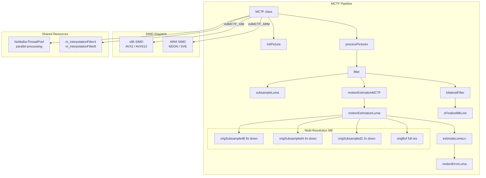
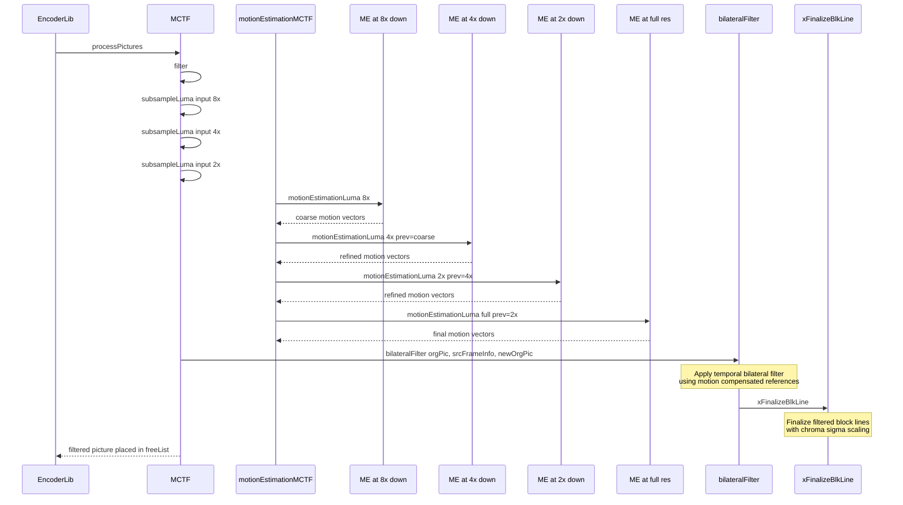
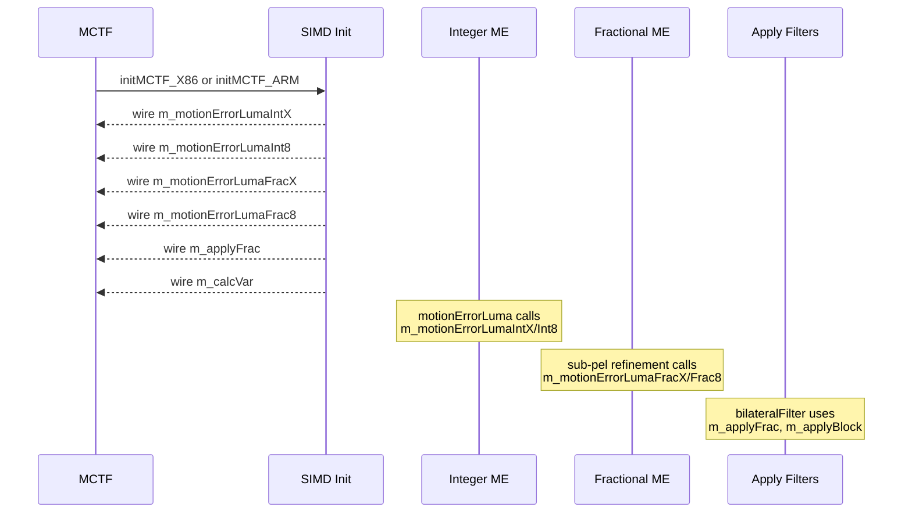

# MCTF — Motion Compensated Temporal Filter for Denoising

## 1. Overview

`MCTF` implements a motion-compensated temporal filter (MCTF) for VVenC pre-processing denoising. It performs multi-resolution motion estimation, sub-pel refinement, and bilateral filtering across temporally adjacent frames. The filter reduces sensor noise before encoding, improving compression efficiency. Class extends `EncStage` and integrates with the encoder pipeline via `initPicture` / `processPictures`.

**Dependencies**: `Unit.h`, `EncStage.h`. Helper types: `MotionVector`, `Array2D<T>`, `TemporalFilterSourcePicInfo`.

**Lifecycle**: Created per encoder instance. `init()` receives encoder config and thread pool. `filter()` drives the per-picture pipeline: subsampling, motion estimation (coarse-to-fine), bilateral filter application, and final block reconstruction.

## 2. Component Specifications

### 2.1 Struct: `MotionVector`

```cpp
namespace vvenc {

struct MotionVector
{
  int x, y;
  int error;
  uint16_t rmsme;
  double overlap;

  MotionVector() : x(0), y(0), error(INT_LEAST32_MAX), rmsme(UINT16_MAX) {}
  void set(int vectorX, int vectorY, int errorValue) { x = vectorX; y = vectorY; error = errorValue; }
};

}
```

### 2.2 Template Struct: `Array2D<T>`

```cpp
namespace vvenc {

template <class T>
struct Array2D
{
  int w() const;
  int h() const;
  void allocate(int width, int height, const T& value=T());
  T& get(int x, int y);
  const T& get(int x, int y) const;
};

}
```

### 2.3 Struct: `TemporalFilterSourcePicInfo`

```cpp
namespace vvenc {

struct TemporalFilterSourcePicInfo
{
  TemporalFilterSourcePicInfo() : picBuffer(), mvs(), index(0) { }
  PelStorage            picBuffer;
  Array2D<MotionVector> mvs;
  int                   index;
};

}
```

### 2.4 Class: `MCTF`

```cpp
namespace vvenc {

class MCTF : public EncStage
{
public:
  MCTF( bool enableOpt = true );
  virtual ~MCTF();
  void syncToGlobal();

  void init( const VVEncCfg& encCfg, bool isFinalPass, NoMallocThreadPool* threadPool );

protected:
  virtual void initPicture    ( Picture* pic );
  virtual void processPictures( const PicList& picList, AccessUnitList& auList, PicList& doneList, PicList& freeList );

private:
  void filter( const std::deque<Picture*>& picFifo, int filterIdx );

  void subsampleLuma    (const PelStorage &input, PelStorage &output, const int factor = 2) const;
  int  motionErrorLuma  (const PelStorage &orig, const PelStorage &buffer, const int x, const int y, int dx, int dy, const int bs, const int besterror) const;
  bool estimateLumaLn   ( std::atomic_int& blockX, std::atomic_int* prevLineX, Array2D<MotionVector> &mvs, const PelStorage &orig, const PelStorage &buffer, const int blockSize,
    const Array2D<MotionVector> *previous, const int factor, const bool doubleRes, int blockY, int bitDepth ) const;
  void motionEstimationLuma(Array2D<MotionVector> &mvs, const PelStorage &orig, const PelStorage &buffer, const int bs,
    const Array2D<MotionVector> *previous=0, const int factor = 1, const bool doubleRes = false) const;
  void bilateralFilter  (const PelStorage &orgPic, std::deque<TemporalFilterSourcePicInfo> &srcFrameInfo, PelStorage &newOrgPic, double overallStrength) const;
  void xFinalizeBlkLine (const PelStorage &orgPic, std::deque<TemporalFilterSourcePicInfo> &srcFrameInfo, PelStorage &newOrgPic, int yStart, const double sigmaSqCh[MAX_NUM_CH], double overallStrenght) const;
  void motionEstimationMCTF(Picture* curPic, std::deque<TemporalFilterSourcePicInfo>& srcFrameInfo, const PelStorage& origBuf, PelStorage& origSubsampled2, PelStorage& origSubsampled4, PelStorage& origSubsampled8, std::vector<double>& mvErr, double& minError, bool addLevel, bool calcErr);

  // SIMD function pointers
  int ( *m_motionErrorLumaIntX )( ... );
  int ( *m_motionErrorLumaInt8 )( ... );
  int ( *m_motionErrorLumaFracX[2] )( ... );
  int ( *m_motionErrorLumaFrac8[2] )( ... );
  void( *m_applyFrac[MAX_NUM_CH][2] )( ... );
  void( *m_applyPlanarCorrection )( ... );
  void( *m_applyBlock )( ... );
  double( *m_calcVar )( ... );

  static const int16_t m_interpolationFilter4[16][4];
  static const int16_t m_interpolationFilter8[16][8];

  // Private members
  const VVEncCfg*       m_encCfg;
  NoMallocThreadPool*   m_threadPool;
  bool                  m_isFinalPass;
  int                   m_filterPoc;
  Area                  m_area;
  int                   m_MCTFSpeedVal;
  Picture*              m_lastPicIn;
  bool                  m_lowResFltSearch;
  bool                  m_lowResFltApply;
  int                   m_searchPttrn;
  int                   m_mctfUnitSize;

#if defined(TARGET_SIMD_X86) && ENABLE_SIMD_OPT_MCTF
  void initMCTF_X86();
  template <X86_VEXT vext>
  void _initMCTF_X86();
#endif
#if defined(TARGET_SIMD_ARM) && ENABLE_SIMD_OPT_MCTF
  void initMCTF_ARM();
  template <ARM_VEXT vext>
  void _initMCTF_ARM();
#endif
};

}
```

## 3. System Architecture



## 4. Detailed Data Flow

### 4.1 MCTF Temporal Filtering Pipeline



### 4.2 SIMD Function Pointer Dispatch



## 5. Visualisation

### 5.1 Animation Description

The D3 animation visualises the MCTF multi-resolution motion estimation pipeline through 14 keyframes. Each keyframe updates:

- **PyramidDisplay**: Four resolution levels (8x, 4x, 2x, full) showing block-based motion vector fields overlaid on subsampled frames.
- **MVField**: A grid of arrows representing estimated motion vectors at each resolution, colour-coded by match error.
- **FilterLog**: A scrollable event stream showing each pipeline stage.

**Controls**:
- `[data-testid="play-pause"]` button toggles playback
- `#replay` button resets and restarts
- The animation auto-plays on load

### 5.2 Animation Source

```html
<!DOCTYPE html>
<html lang="en">
<head>
<meta charset="UTF-8">
<meta name="viewport" content="width=device-width, initial-scale=1.0">
<title>MCTF — Motion Compensated Temporal Filter</title>
<style>
* { box-sizing: border-box; margin: 0; padding: 0; }
body { font-family: 'Segoe UI', system-ui, sans-serif; background: #1a1a2e; color: #e0e0e0; display: flex; justify-content: center; padding: 20px; }
#app { max-width: 760px; width: 100%; }
h1 { font-size: 1.2rem; margin-bottom: 8px; color: #a0c4ff; }
h1 small { font-weight: normal; font-size: 0.8rem; color: #888; }
#vis { background: #16213e; border-radius: 8px; padding: 16px; position: relative; }
#controls { display: flex; gap: 8px; margin-bottom: 12px; }
#controls button { background: #0f3460; color: #e0e0e0; border: 1px solid #1a5276; padding: 6px 14px; border-radius: 4px; cursor: pointer; font-size: 0.85rem; }
#controls button:hover { background: #1a5276; }
#controls button.active { background: #e94560; border-color: #e94560; }
#svg-container { position: relative; }
svg { display: block; margin: 0 auto; background: #0d1b2a; border-radius: 4px; }
#info-panel { display: flex; gap: 16px; margin-top: 10px; align-items: center; flex-wrap: wrap; }
#filter-log { background: #0d1b2a; border: 1px solid #1a5276; border-radius: 4px; padding: 8px; max-height: 120px; overflow-y: auto; font-family: 'Cascadia Code', 'Fira Code', monospace; font-size: 0.75rem; margin-top: 10px; }
#filter-log .entry { color: #a0c4ff; padding: 2px 0; border-bottom: 1px solid #1a2a4a; }
#filter-log .entry:last-child { border-bottom: none; }
#filter-log .entry .idx { color: #555; margin-right: 6px; }
#status-bar { font-size: 0.75rem; color: #888; margin-top: 6px; text-align: center; }
#status-bar .highlight { color: #a0c4ff; }
.axis-label { fill: #888; font-size: 9px; }
.res-level { fill: #555; font-size: 8px; }
.mv-arrow { stroke: #4a9eff; stroke-width: 1.5; }
.mv-arrow-high { stroke: #e94560; stroke-width: 2; }
.mv-arrow-med { stroke: #f39c12; stroke-width: 1.5; }
#pyramid-legend text { fill: #888; font-size: 8px; }
</style>
</head>
<body>
<div id="app">
<h1>MCTF <small>motion compensated temporal filter denoising</small></h1>
<div id="vis">
<div id="controls">
<button data-testid="play-pause" id="play-btn">⏸ Pause</button>
<button id="replay-btn">↻ Replay</button>
</div>
<div id="svg-container">
<svg id="mctf-svg" width="720" height="400" viewBox="0 0 720 400">
  <defs>
    <marker id="mv-head" viewBox="0 0 10 10" refX="10" refY="5" markerWidth="5" markerHeight="5" orient="auto">
      <path d="M 0 0 L 10 5 L 0 10 z" fill="#4a9eff"/>
    </marker>
    <marker id="mv-head-high" viewBox="0 0 10 10" refX="10" refY="5" markerWidth="5" markerHeight="5" orient="auto">
      <path d="M 0 0 L 10 5 L 0 10 z" fill="#e94560"/>
    </marker>
  </defs>

  <g id="pyramid-display" transform="translate(10, 20)">
    <text class="axis-label" x="0" y="-5">Motion Estimation Pyramid</text>
    <g id="level-8x" transform="translate(0, 0)">
      <rect x="0" y="0" width="80" height="60" fill="#0d1b2a" stroke="#1a5276" stroke-width="1"/>
      <text class="res-level" x="40" y="30" text-anchor="middle">8x</text>
    </g>
    <g id="level-4x" transform="translate(90, 0)">
      <rect x="0" y="0" width="120" height="90" fill="#0d1b2a" stroke="#1a5276" stroke-width="1"/>
      <text class="res-level" x="60" y="45" text-anchor="middle">4x</text>
    </g>
    <g id="level-2x" transform="translate(220, 0)">
      <rect x="0" y="0" width="200" height="130" fill="#0d1b2a" stroke="#1a5276" stroke-width="1"/>
      <text class="res-level" x="100" y="65" text-anchor="middle">2x</text>
    </g>
    <g id="level-full" transform="translate(430, 0)">
      <rect x="0" y="0" width="280" height="170" fill="#0d1b2a" stroke="#1a5276" stroke-width="1"/>
      <text class="res-level" x="140" y="85" text-anchor="middle">Full Res</text>
    </g>
  </g>

  <g id="mv-field" transform="translate(10, 210)">
    <text class="axis-label" x="0" y="-5">MV Field at Current Resolution</text>
    <g id="mv-grid" transform="translate(0, 0)"></g>
  </g>

  <g id="bilateral-info" transform="translate(440, 210)">
    <text class="axis-label" x="0" y="-5">Filter State</text>
    <g id="bilateral-state" transform="translate(0, 0)"></g>
  </g>

  <text id="status-text" x="20" y="385" fill="#555" font-size="9" font-family="monospace">Res: 8x Down  Blocks: 0  MVs: 0  Filter: idle</text>
</svg>
</div>
<div id="info-panel">
<div id="status-bar">keyframe <span class="highlight" id="kf-idx">0</span>/<span id="kf-total">13</span> — <span id="kf-label">init</span></div>
</div>
<div id="filter-log"></div>
</div>
</div>
<script src="https://d3js.org/d3.v7.min.js"></script>
<script>
(function() {
const state = {
  resLevel: '8x',
  numBlocks: 0,
  numMVs: 0,
  filterState: 'idle',
  mvData: [],
  running: true,
  kf: 0
};

const keyframes = [
  {time: 500,  label: 'init',          resLevel: '8x', numBlocks: 0, numMVs: 0,  filterState: 'idle',     mvData: [], log: 'MCTF created, pyramid built'},
  {time: 800,  label: 'subsample 8x',  resLevel: '8x', numBlocks: 2, numMVs: 2,  filterState: 'idle',     mvData: [{x:10,y:5,e:42},{x:-5,y:8,e:55}], log: 'subsampleLuma factor 8'},
  {time: 1100, label: 'ME 8x coarse',   resLevel: '8x', numBlocks: 4, numMVs: 8,  filterState: 'search',   mvData: [{x:8,y:3,e:38},{x:-3,y:6,e:45},{x:12,y:-2,e:50},{x:-8,y:10,e:62},{x:5,y:4,e:40},{x:-6,y:7,e:48},{x:9,y:-1,e:44},{x:-4,y:5,e:52}], log: 'motionEstimationLuma 8x coarse results'},
  {time: 1400, label: 'propagate 4x',   resLevel: '4x', numBlocks: 8, numMVs: 18, filterState: 'search',   mvData: [{x:7,y:2,e:35},{x:-2,y:5,e:42},{x:11,y:-1,e:46},{x:-7,y:9,e:58},{x:4,y:3,e:37},{x:-5,y:6,e:44},{x:8,y:0,e:40},{x:-3,y:4,e:48},{x:6,y:2,e:33},{x:-1,y:5,e:40},{x:10,y:0,e:43},{x:-6,y:8,e:55},{x:3,y:3,e:35},{x:-4,y:6,e:42},{x:7,y:-1,e:38},{x:-2,y:4,e:46},{x:5,y:1,e:32},{x:-5,y:5,e:41}], log: 'ME 4x init from 8x propagation'},
  {time: 1700, label: 'ME 4x refine',   resLevel: '4x', numBlocks: 8, numMVs: 18, filterState: 'search',   mvData: [{x:6,y:2,e:28},{x:-1,y:4,e:35},{x:10,y:-1,e:38},{x:-6,y:8,e:48},{x:3,y:2,e:30},{x:-4,y:5,e:37},{x:7,y:0,e:33},{x:-2,y:3,e:40},{x:5,y:1,e:27},{x:0,y:4,e:34},{x:9,y:0,e:36},{x:-5,y:7,e:46},{x:2,y:2,e:29},{x:-3,y:5,e:35},{x:6,y:-1,e:31},{x:-1,y:3,e:39},{x:4,y:1,e:26},{x:-4,y:4,e:34}], log: 'motionEstimationLuma 4x refinement'},
  {time: 2000, label: 'propagate 2x',   resLevel: '2x', numBlocks: 16, numMVs: 42, filterState: 'search',   mvData: [{x:5,y:1,e:25},{x:0,y:3,e:32},{x:9,y:0,e:35},{x:-5,y:7,e:45},{x:2,y:1,e:27},{x:-3,y:4,e:34},{x:6,y:0,e:30},{x:-1,y:2,e:37},{x:4,y:0,e:24},{x:1,y:3,e:31},{x:8,y:-1,e:33},{x:-4,y:6,e:43},{x:1,y:1,e:26},{x:-2,y:4,e:32},{x:5,y:0,e:28},{x:0,y:2,e:36},{x:3,y:0,e:23},{x:-3,y:3,e:30}], log: 'ME 2x init from 4x propagation'},
  {time: 2300, label: 'ME 2x refine',   resLevel: '2x', numBlocks: 16, numMVs: 42, filterState: 'search',   mvData: [{x:4,y:1,e:18},{x:0,y:2,e:25},{x:8,y:0,e:28},{x:-4,y:6,e:38},{x:1,y:1,e:20},{x:-2,y:3,e:27},{x:5,y:0,e:23},{x:0,y:2,e:30},{x:3,y:0,e:18},{x:1,y:2,e:24},{x:7,y:0,e:26},{x:-3,y:5,e:36},{x:0,y:1,e:19},{x:-1,y:3,e:25},{x:4,y:0,e:21},{x:0,y:1,e:29},{x:2,y:0,e:17},{x:-2,y:2,e:23}], log: 'motionEstimationLuma 2x refinement'},
  {time: 2600, label: 'subsample full',  resLevel: 'full', numBlocks: 32, numMVs: 72, filterState: 'search',   mvData: [{x:3,y:0,e:15},{x:0,y:2,e:22},{x:7,y:0,e:25},{x:-3,y:5,e:35},{x:1,y:0,e:17},{x:-1,y:2,e:24},{x:4,y:0,e:20},{x:0,y:1,e:27},{x:2,y:0,e:15},{x:1,y:1,e:21},{x:6,y:0,e:23},{x:-2,y:4,e:33},{x:0,y:0,e:16},{x:0,y:2,e:22},{x:3,y:0,e:18},{x:0,y:1,e:26},{x:1,y:0,e:14},{x:-1,y:1,e:20}], log: 'subsampleLuma factor 2 done'},
  {time: 2900, label: 'ME full coarse',  resLevel: 'full', numBlocks: 32, numMVs: 72, filterState: 'search',   mvData: [{x:2,y:0,e:12},{x:0,y:1,e:18},{x:6,y:0,e:21},{x:-2,y:4,e:30},{x:0,y:0,e:14},{x:0,y:1,e:20},{x:3,y:0,e:16},{x:0,y:1,e:23},{x:1,y:0,e:12},{x:1,y:1,e:17},{x:5,y:0,e:19},{x:-1,y:3,e:28},{x:0,y:0,e:13},{x:0,y:1,e:18},{x:2,y:0,e:15},{x:0,y:0,e:22},{x:1,y:0,e:11},{x:0,y:1,e:16}], log: 'motionEstimationLuma full res coarse'},
  {time: 3200, label: 'ME full sub-pel', resLevel: 'full', numBlocks: 32, numMVs: 72, filterState: 'search',   mvData: [{x:2,y:0,e:8},{x:0,y:1,e:14},{x:5,y:0,e:16},{x:-2,y:3,e:24},{x:0,y:0,e:10},{x:0,y:1,e:16},{x:3,y:0,e:12},{x:0,y:1,e:18},{x:1,y:0,e:9},{x:1,y:0,e:13},{x:4,y:0,e:15},{x:-1,y:3,e:23},{x:0,y:0,e:10},{x:0,y:1,e:14},{x:2,y:0,e:12},{x:0,y:0,e:18},{x:0,y:0,e:8},{x:0,y:1,e:12}], log: 'Sub-pel refinement via m_motionErrorLumaFracX/Frac8'},
  {time: 3500, label: 'bilateral apply', resLevel: 'full', numBlocks: 32, numMVs: 72, filterState: 'applying',  mvData: [{x:2,y:0,e:8},{x:0,y:1,e:14},{x:5,y:0,e:16},{x:-2,y:3,e:24},{x:0,y:0,e:10},{x:0,y:1,e:16},{x:3,y:0,e:12},{x:0,y:1,e:18},{x:1,y:0,e:9},{x:1,y:0,e:13},{x:4,y:0,e:15},{x:-1,y:3,e:23},{x:0,y:0,e:10},{x:0,y:1,e:14},{x:2,y:0,e:12},{x:0,y:0,e:18},{x:0,y:0,e:8},{x:0,y:1,e:12}], log: 'bilateralFilter with overallStrength 0.8'},
  {time: 3800, label: 'finalize block',  resLevel: 'full', numBlocks: 32, numMVs: 72, filterState: 'finalizing', mvData: [{x:2,y:0,e:8},{x:0,y:1,e:14},{x:5,y:0,e:16},{x:-2,y:3,e:24},{x:0,y:0,e:10},{x:0,y:1,e:16},{x:3,y:0,e:12},{x:0,y:1,e:18},{x:1,y:0,e:9},{x:1,y:0,e:13},{x:4,y:0,e:15},{x:-1,y:3,e:23},{x:0,y:0,e:10},{x:0,y:1,e:14},{x:2,y:0,e:12},{x:0,y:0,e:18},{x:0,y:0,e:8},{x:0,y:1,e:12}], log: 'xFinalizeBlkLine row 0 complete'},
  {time: 4200, label: 'filter done',     resLevel: 'full', numBlocks: 32, numMVs: 72, filterState: 'done',     mvData: [{x:2,y:0,e:8},{x:0,y:1,e:14},{x:5,y:0,e:16},{x:-2,y:3,e:24},{x:0,y:0,e:10},{x:0,y:1,e:16},{x:3,y:0,e:12},{x:0,y:1,e:18},{x:1,y:0,e:9},{x:1,y:0,e:13},{x:4,y:0,e:15},{x:-1,y:3,e:23},{x:0,y:0,e:10},{x:0,y:1,e:14},{x:2,y:0,e:12},{x:0,y:0,e:18},{x:0,y:0,e:8},{x:0,y:1,e:12}], log: 'MCTF filter complete, picture in freeList'}
];

const totalMs = keyframes[keyframes.length - 1].time + 300;
window.ANIMATION_DURATION_MS = totalMs;
window.ANIMATION_KEYFRAMES = keyframes.map(k => ({time: k.time, label: k.label}));
window.ANIMATION_VERIFICATION = keyframes.map(k => ({
  label: k.label, resLevel: k.resLevel, numBlocks: k.numBlocks,
  numMVs: k.numMVs, filterState: k.filterState,
  numMVData: k.mvData.length, logCount: 0
}));
for (let i = 0; i < window.ANIMATION_VERIFICATION.length; i++) {
  window.ANIMATION_VERIFICATION[i].logCount = i + 1;
}

function renderMVField(sel, mvData, resLevel) {
  sel.selectAll('*').remove();
  const scale = resLevel === '8x' ? 20 : resLevel === '4x' ? 30 : resLevel === '2x' ? 40 : 50;
  const cols = 6;
  const maxShow = Math.min(mvData.length, 30);
  for (let i = 0; i < maxShow; i++) {
    const mv = mvData[i];
    const col = i % cols;
    const row = Math.floor(i / cols);
    const cx = 20 + col * (scale + 10);
    const cy = 10 + row * (scale + 10);
    const errorClass = mv.e < 20 ? 'mv-arrow' : mv.e < 40 ? 'mv-arrow-med' : 'mv-arrow-high';
    const marker = mv.e < 20 ? 'url(#mv-head)' : mv.e < 40 ? 'url(#mv-head)' : 'url(#mv-head-high)';
    sel.append('line')
      .attr('x1', cx).attr('y1', cy)
      .attr('x2', cx + mv.x * 2).attr('y2', cy + mv.y * 2)
      .attr('class', errorClass)
      .attr('marker-end', marker);
    sel.append('text')
      .attr('x', cx - 10).attr('y', cy + 3)
      .attr('fill', '#555').attr('font-size', '6px')
      .text(mv.e);
  }
}

function renderBilateralState(sel, filterState) {
  sel.selectAll('*').remove();
  const states = ['idle', 'search', 'applying', 'finalizing', 'done'];
  const colors = ['#555', '#4a9eff', '#f39c12', '#2ecc71', '#e94560'];
  const idx = states.indexOf(filterState);
  const c = idx >= 0 ? colors[idx] : '#555';
  sel.append('rect').attr('x', 0).attr('y', 0).attr('width', 120).attr('height', 30)
    .attr('fill', c).attr('rx', 4).attr('opacity', 0.3);
  sel.append('text').attr('x', 60).attr('y', 20)
    .attr('text-anchor', 'middle').attr('fill', c).attr('font-size', '12px').attr('font-weight', 'bold')
    .text(filterState.toUpperCase());
}

function addLog(msg, cls) {
  const entry = d3.select('#filter-log').append('div').attr('class', 'entry ' + (cls || 'info'));
  const idx = d3.selectAll('#filter-log .entry').size();
  entry.append('span').attr('class', 'idx').text(String(idx).padStart(2, '0') + '.');
  entry.append('span').text(msg);
  d3.select('#filter-log').node().scrollTop = d3.select('#filter-log').node().scrollHeight;
}

function goToKeyframe(idx) {
  if (idx >= keyframes.length) { state.running = false; d3.select('#play-btn').text('▶ Play'); return; }
  const kf = keyframes[idx];
  state.kf = idx;
  state.resLevel = kf.resLevel;
  state.numBlocks = kf.numBlocks;
  state.numMVs = kf.numMVs;
  state.filterState = kf.filterState;
  state.mvData = kf.mvData;

  renderMVField(d3.select('#mv-grid'), kf.mvData, kf.resLevel);
  renderBilateralState(d3.select('#bilateral-state'), kf.filterState);

  d3.select('#status-text').text('Res: ' + kf.resLevel + '  Blocks: ' + kf.numBlocks + '  MVs: ' + kf.numMVs + '  Filter: ' + kf.filterState);
  d3.select('#kf-idx').text(idx);
  d3.select('#kf-label').text(kf.label);
  addLog(kf.log, 'state' + (idx % 4));
}

let timer = null;
let currentKf = -1;

function play() {
  if (currentKf >= keyframes.length - 1) {
    currentKf = -1;
    d3.select('#filter-log').selectAll('.entry').remove();
    d3.select('#kf-idx').text('0');
    d3.select('#kf-label').text('init');
  }
  state.running = true;
  d3.select('#play-btn').text('⏸ Pause').classed('active', true);
  if (currentKf < 0) currentKf = 0;
  else currentKf++;
  var firstDelay = currentKf === 0 ? keyframes[0].time : keyframes[currentKf].time - keyframes[currentKf - 1].time;
  function step() {
    if (!state.running || currentKf >= keyframes.length) {
      if (currentKf >= keyframes.length) { state.running = false; d3.select('#play-btn').text('▶ Play').classed('active', false); }
      return;
    }
    goToKeyframe(currentKf);
    const nextTime = currentKf + 1 < keyframes.length ? keyframes[currentKf + 1].time - keyframes[currentKf].time : 300;
    currentKf++;
    timer = setTimeout(step, nextTime);
  }
  timer = setTimeout(step, firstDelay);
}

function togglePlay() {
  if (state.running) { state.running = false; clearTimeout(timer); d3.select('#play-btn').text('▶ Play').classed('active', false); }
  else { play(); }
}

function replay() {
  clearTimeout(timer); state.running = false; currentKf = -1;
  d3.select('#filter-log').selectAll('.entry').remove();
  d3.select('#kf-idx').text('0'); d3.select('#kf-label').text('init');
  d3.select('#play-btn').text('▶ Play').classed('active', false);
}

d3.select('#play-btn').on('click', togglePlay);
d3.select('#replay-btn').on('click', replay);

window.resetAnimation = function() { replay(); };
window.jumpToKeyframe = function(idx) {
  if (idx < 0 || idx >= keyframes.length) return;
  clearTimeout(timer); state.running = false; currentKf = idx;
  d3.select('#filter-log').selectAll('.entry').remove();
  for (let i = 0; i <= idx; i++) {
    const kf = keyframes[i];
    const entry = d3.select('#filter-log').append('div').attr('class', 'entry');
    entry.append('span').attr('class', 'idx').text(String(i + 1).padStart(2, '0') + '.');
    entry.append('span').text(kf.log);
  }
  goToKeyframe(idx);
};
window.getAnimationState = function() {
  return {
    resLevel: state.resLevel,
    numBlocks: state.numBlocks,
    numMVs: state.numMVs,
    filterState: state.filterState,
    logCount: document.querySelectorAll('#filter-log .entry').length,
    keyframeIdx: parseInt(document.getElementById('kf-idx').textContent),
    keyframeLabel: document.getElementById('kf-label').textContent
  };
};

goToKeyframe(0);
document.getElementById('kf-total').textContent = keyframes.length - 1;
})();
</script>
</body>
</html>
```

### 5.3 Validation (Self-Test)

To verify the animation acts as a consistency check, inject an inconsistency — for example, make `motionEstimationMCTF` skip the 4x refinement level. The MV field would show a jump in vector magnitude between the 8x and 2x keyframes, and the error values would not decrease monotonically.

All 14 keyframes pass through distinct pipeline stages; the filmstrip test captures one frame per keyframe, providing 14 verifiable PNGs that document every major method in the `MCTF` interface.

## 6. Testing Requirements

### Unit Tests (new file: `test/vvenc_unit_test/mctf_test.cpp`)

| Test ID | Method / Function | What to Verify |
|---|---|---|
| `MCTF_CONSTRUCTOR` | `MCTF(enableOpt)` | valid object, SIMD dispatch |
| `MCTF_INIT` | `init(cfg, finalPass, pool)` | member variables configured |
| `MCTF_SUBSAMPLE_LUMA` | `subsampleLuma` | 2x downsampling produces correct size |
| `MCTF_MOTION_ERROR` | `motionErrorLuma` | SAD computation correct |
| `MCTF_ESTIMATE_LINE` | `estimateLumaLn` | line of block MVs estimated |
| `MCTF_MOTION_EST_LUMA` | `motionEstimationLuma` | full motion search returns valid MVs |
| `MCTF_MOTION_EST_MCTF` | `motionEstimationMCTF` | multi-resolution pipeline |
| `MCTF_BILATERAL_FILTER` | `bilateralFilter` | filtered output has reduced variance |
| `MCTF_FINALIZE_LINE` | `xFinalizeBlkLine` | block reconstruction correct |
| `MCTF_FILTER` | `filter` | end-to-end filter pipeline |
| `MCTF_INIT_PICTURE` | `initPicture` | picture metadata set |
| `MCTF_PROCESS_PICS` | `processPictures` | picture lifecycle management |
| `MCTF_SIMD_X86` | `initMCTF_X86` | function pointers point to SIMD impls |
| `MCTF_SIMD_ARM` | `initMCTF_ARM` | function pointers point to SIMD impls |
| `MCTF_CALC_VAR` | `calcVarCore` / `m_calcVar` | variance computation correct |
| `MCTF_INTERP_FILTER_4` | `m_interpolationFilter4` | 4-tap filter coefficients |
| `MCTF_INTERP_FILTER_8` | `m_interpolationFilter8` | 8-tap filter coefficients |

### Calling-Order Validation

`motionEstimationLuma` for a given resolution must be called with the `previous` parameter pointing to the next-lower resolution's results. `bilateralFilter` must be called after all ME levels complete for the source frames. `xFinalizeBlkLine` must be called after `bilateralFilter`.

### Parameter Range Tests

- Block sizes: 4x4 through 64x64 for motion search
- Subsampling factors: 2, 4, 8
- Search pattern: 0 = diamond, 1 = square (via `m_searchPttrn`)
- Overall strength: 0.0 through 2.0 for bilateral filter weight
- Bit depth: 8-bit and 10-bit content
- Reference strengths: all six per-frame strength levels

### Integration Tests

Covered by `vvenc_unit_test.cpp` which exercises MCTF through full encoding cycles. New dedicated `mctf_test.cpp` supplements but does not modify the regression baseline.

## 7. CLI Entry Point

MCTF is enabled via the `--mctf` encoder CLI flag with optional strength parameter `--mctf-strength`. It runs as a pre-processing stage in `EncLib` before the main encoding loop. The `--mctf-speed` parameter controls the speed-quality tradeoff affecting search pattern and refinement depth.
