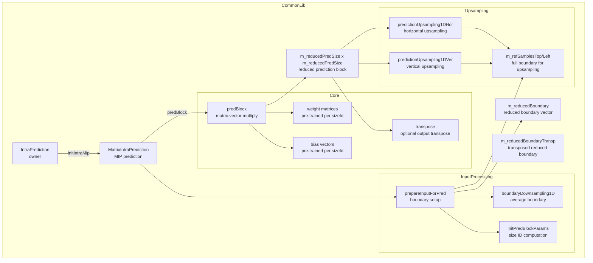
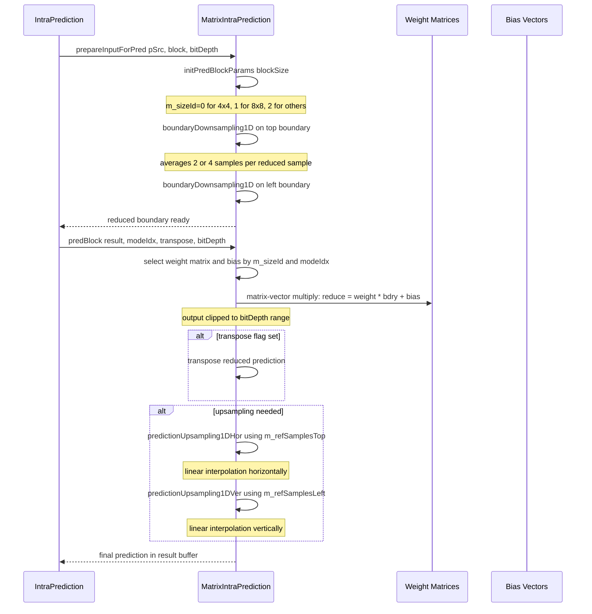

# MatrixIntraPrediction — MIP Matrix-Weighted Intra Prediction

## 1. Overview

The `MatrixIntraPrediction` class implements VVC MIP matrix-weighted intra prediction. It downsamples boundary reference samples, performs matrix-vector multiplication using pre-trained weight matrices, optionally transposes the result, and upsamples the reduced prediction to the full block size. It is owned and called by `IntraPrediction`.

**Dependencies**: `Unit.h` (for `CPelBuf`, `Pel`, `Size`).

**Lifecycle**: Created as a member of `IntraPrediction`. Per-block call sequence: `prepareInputForPred(src, block, bitDepth)` then `predBlock(result, modeIdx, transpose, bitDepth)`. No explicit init/uninit; internal state is reset each call.

## 2. Component Specifications

### 2.1 Class: `MatrixIntraPrediction`

```cpp
#pragma once

#include "Unit.h"

namespace vvenc {

#define MIP_UPSAMPLING_TEMPLATE 1

class MatrixIntraPrediction
{
public:
  MatrixIntraPrediction();
  ~MatrixIntraPrediction();

  void prepareInputForPred(const CPelBuf& pSrc, const Area& block, const int bitDepth);
  void predBlock(Pel* const result, const int modeIdx, const bool transpose, const int bitDepth);

private:
  Pel*          m_reducedBoundary;          // downsampled boundary
  Pel*          m_reducedBoundaryTransp;    // downsampled + transposed boundary
  int           m_inputOffset;
  int           m_inputOffsetTransp;
  const Pel*    m_refSamplesTop;            // top ref for upsampling
  const Pel*    m_refSamplesLeft;           // left ref for upsampling
  Size          m_blockSize;
  int           m_sizeId;                   // 0: 4x4, 1: 8x8, 2: others
  int           m_reducedBdrySize;          // boundary size after downsampling
  int           m_reducedPredSize;          // reduced prediction size
  unsigned int  m_upsmpFactorHor;
  unsigned int  m_upsmpFactorVer;

  void initPredBlockParams(const Size& block);

  static void boundaryDownsampling1D(Pel* reducedDst, const Pel* const fullSrc, const SizeType srcLen, const SizeType dstLen);

  template<SizeType predPredSize, unsigned log2UpsmpFactor>
  void predictionUpsampling1DHor(Pel* const dst, const Pel* const src, const Pel* const bndry, const SizeType dstStride, const SizeType bndryStep);

  template<SizeType inHeight, unsigned log2UpsmpFactor>
  void predictionUpsampling1DVer(Pel* const dst, const Pel* const src, const Pel* const bndry, const SizeType outWidth, const SizeType srcStep);
};

}
```

### 2.2 Core Methods Summary

| Method | Purpose |
|---|---|
| `prepareInputForPred` | Downsample boundary, select m_sizeId, allocate reduced boundary vectors |
| `predBlock` | Matrix-vector multiply using pre-trained weight matrix, clip, optional transpose, upsampling |
| `initPredBlockParams` | Compute m_sizeId, m_reducedBdrySize, m_reducedPredSize, m_upsmpFactorHor/Ver from block size |
| `boundaryDownsampling1D` | Static: average adjacent samples to reduce boundary length |
| `predictionUpsampling1DHor` | Template: horizontal upsampling of reduced prediction using boundary |
| `predictionUpsampling1DVer` | Template: vertical upsampling of reduced prediction using boundary |

## 3. System Architecture



## 4. Detailed Data Flow

### 4.1 MIP Prediction Sequence



## 5. Visualisation

### 5.1 Animation Description

The D3 animation visualises the MIP prediction pipeline by stepping through 16 keyframes. Each keyframe updates:

- **BoundaryPanel**: Shows the full boundary (top + left) and the downsampled reduced boundary.
- **MatrixPanel**: A heatmap of the selected weight matrix and bias vector values.
- **PredBlock**: The reduced prediction before and after upsampling, rendered as a pixel intensity grid.
- **ModeBadge**: Shows m_sizeId, modeIdx, transpose flag.
- **OperationFeed**: A scrollable log of each MIP step.

**Controls**:
- `[data-testid="play-pause"]` button toggles playback
- `#replay` button resets and restarts
- The animation auto-plays on load

### 5.2 Animation Source

```html
<!DOCTYPE html>
<html lang="en">
<head>
<meta charset="UTF-8">
<meta name="viewport" content="width=device-width, initial-scale=1.0">
<title>MatrixIntraPrediction — MIP Pipeline Animation</title>
<style>
* { box-sizing: border-box; margin: 0; padding: 0; }
body { font-family: 'Segoe UI', system-ui, sans-serif; background: #1a1a2e; color: #e0e0e0; display: flex; justify-content: center; padding: 20px; }
#app { max-width: 760px; width: 100%; }
h1 { font-size: 1.2rem; margin-bottom: 8px; color: #a0c4ff; }
h1 small { font-weight: normal; font-size: 0.8rem; color: #888; }
#vis { background: #16213e; border-radius: 8px; padding: 16px; position: relative; }
#controls { display: flex; gap: 8px; margin-bottom: 12px; }
#controls button { background: #0f3460; color: #e0e0e0; border: 1px solid #1a5276; padding: 6px 14px; border-radius: 4px; cursor: pointer; font-size: 0.85rem; }
#controls button:hover { background: #1a5276; }
#controls button.active { background: #e94560; border-color: #e94560; }
#svg-container { position: relative; }
svg { display: block; margin: 0 auto; background: #0d1b2a; border-radius: 4px; }
#info-panel { display: flex; gap: 16px; margin-top: 10px; align-items: center; flex-wrap: wrap; }
#mip-badge { font-size: 0.8rem; padding: 4px 10px; border-radius: 12px; background: #0f3460; border: 1px solid #1a5276; }
#mip-badge .label { color: #888; margin-right: 6px; }
#mip-badge .value { color: #fff; font-weight: bold; }
#size-panel { font-size: 0.75rem; color: #a0c4ff; background: #0d1b2a; border: 1px solid #1a5276; border-radius: 4px; padding: 6px 10px; font-family: monospace; flex: 1; }
#operation-feed { background: #0d1b2a; border: 1px solid #1a5276; border-radius: 4px; padding: 8px; max-height: 120px; overflow-y: auto; font-family: 'Cascadia Code', 'Fira Code', monospace; font-size: 0.75rem; margin-top: 10px; }
#operation-feed .entry { color: #a0c4ff; padding: 2px 0; border-bottom: 1px solid #1a2a4a; }
#operation-feed .entry:last-child { border-bottom: none; }
#operation-feed .entry .idx { color: #555; margin-right: 6px; }
#operation-feed .entry.prep { color: #4a9eff; }
#operation-feed .entry.mul { color: #2ecc71; }
#operation-feed .entry.upsample { color: #e94560; }
#status-bar { font-size: 0.75rem; color: #888; margin-top: 6px; text-align: center; }
#status-bar .highlight { color: #a0c4ff; }
.cell { stroke: #1a5276; stroke-width: 1; }
.cell.bdry { fill: #1a3a5a; }
.cell.pred { fill: #0d1b2a; }
.block-label { fill: #888; font-size: 9px; }
.heat-cell { stroke: #1a5276; stroke-width: 0.5; }
</style>
</head>
<body>
<div id="app">
<h1>MatrixIntraPrediction <small>MIP prediction pipeline</small></h1>
<div id="vis">
<div id="controls">
<button data-testid="play-pause" id="play-btn">⏸ Pause</button>
<button id="replay-btn">↻ Replay</button>
</div>
<div id="svg-container">
<svg id="mip-svg" width="680" height="420" viewBox="0 0 680 420">
  <defs>
    <clipPath id="mip-clip"><rect x="0" y="0" width="680" height="420"/></clipPath>
  </defs>
  <text class="block-label" id="phase-label" x="20" y="22">Phase: Init</text>
  <g id="bdry-panel" transform="translate(20, 35)">
    <text class="block-label" x="80" y="12">Boundary</text>
  </g>
  <g id="matrix-panel" transform="translate(280, 35)">
    <text class="block-label" x="60" y="12">Weight Matrix</text>
  </g>
  <g id="pred-panel" transform="translate(500, 35)">
    <text class="block-label" x="60" y="12">Prediction</text>
  </g>
  <g id="flash-grp">
    <rect id="flash-rect" x="20" y="30" width="640" height="360" rx="4" style="opacity:0;pointer-events:none"/>
  </g>
</svg>
</div>
<div id="info-panel">
<div id="mip-badge"><span class="label">sizeId</span><span class="value">0</span></div>
<div id="size-panel">mode=0 transp=0 bdry=4 pred=4 upHor=1 upVer=1</div>
<div id="status-bar">keyframe <span class="highlight" id="kf-idx">0</span>/<span id="kf-total">15</span> — <span id="kf-label">init</span></div>
</div>
<div id="operation-feed"></div>
</div>
</div>
<script src="https://d3js.org/d3.v7.min.js"></script>
<script>
(function() {
const state = {
  sizeId: 0, mode: 0, transp: false,
  running: true, kf: 0
};

const keyframes = [
  {time: 500,  label: 'init',        sizeId: 0, mode: 0, transp: false, log: 'MatrixIntraPrediction created'},
  {time: 800,  label: 'params-4x4',  sizeId: 0, mode: 0, transp: false, log: 'initPredBlockParams 4x4, sizeId=0'},
  {time: 1100, label: 'dsmp-4x4',    sizeId: 0, mode: 0, transp: false, log: 'boundaryDownsampling1D top+left 8->4'},
  {time: 1400, label: 'matmul-size0',sizeId: 0, mode: 5, transp: false, log: 'predBlock matrix-vector multiply 16x4'},
  {time: 1700, label: 'transp-size0',sizeId: 0, mode: 5, transp: true,  log: 'predBlock transposed output'},
  {time: 2000, label: 'params-8x8',  sizeId: 1, mode: 0, transp: false, log: 'initPredBlockParams 8x8, sizeId=1'},
  {time: 2300, label: 'dsmp-8x8',    sizeId: 1, mode: 0, transp: false, log: 'boundaryDownsampling1D 16->8'},
  {time: 2600, label: 'matmul-size1',sizeId: 1, mode: 3, transp: false, log: 'predBlock matrix-vector multiply 64x8'},
  {time: 2900, label: 'up-hor-8x8',  sizeId: 1, mode: 3, transp: false, log: 'predictionUpsampling1DHor 8x8->8x8'},
  {time: 3200, label: 'up-ver-8x8',  sizeId: 1, mode: 3, transp: false, log: 'predictionUpsampling1DVer 8x8->8x8'},
  {time: 3500, label: 'params-16x16',sizeId: 2, mode: 0, transp: false, log: 'initPredBlockParams 16x16, sizeId=2'},
  {time: 3800, label: 'dsmp-16x16',  sizeId: 2, mode: 0, transp: false, log: 'boundaryDownsampling1D 32->8'},
  {time: 4100, label: 'matmul-size2',sizeId: 2, mode: 7, transp: false, log: 'predBlock matrix-vector multiply 256x8'},
  {time: 4400, label: 'up-hor-16x16',sizeId: 2, mode: 7, transp: false, log: 'predictionUpsampling1DHor 8x16->16x16'},
  {time: 4700, label: 'up-ver-16x16',sizeId: 2, mode: 7, transp: false, log: 'predictionUpsampling1DVer 16x8->16x16'},
  {time: 5000, label: 'final',       sizeId: 0, mode: 0, transp: false, log: 'MIP round-trip complete'}
];

const totalMs = keyframes[keyframes.length - 1].time + 300;
window.ANIMATION_DURATION_MS = totalMs;
window.ANIMATION_KEYFRAMES = keyframes.map(k => ({time: k.time, label: k.label}));
window.ANIMATION_VERIFICATION = keyframes.map(k => ({
  label: k.label, sizeId: k.sizeId, mode: k.mode,
  transp: k.transp, logCount: 0
}));
for (let i = 0; i < window.ANIMATION_VERIFICATION.length; i++) {
  window.ANIMATION_VERIFICATION[i].logCount = i + 1;
}

const sizeIdEl = d3.select('#mip-badge .value');
const sizePanelEl = d3.select('#size-panel');
const kfIdxEl = d3.select('#kf-idx');
const kfLabelEl = d3.select('#kf-label');
const feedEl = d3.select('#operation-feed');
const flashRect = d3.select('#flash-rect');
const phaseLabel = d3.select('#phase-label');

function addLog(msg, cls) {
  const entry = feedEl.append('div').attr('class', 'entry ' + (cls || 'info'));
  const idx = feedEl.selectAll('.entry').size();
  entry.append('span').attr('class', 'idx').text(String(idx).padStart(2, '0') + '.');
  entry.append('span').text(msg);
  feedEl.node().scrollTop = feedEl.node().scrollHeight;
}

function flash(color) {
  if (!color) { flashRect.style('opacity', 0); return; }
  const c = color === 'red' ? '#e94560' : '#2ecc71';
  flashRect.style('opacity', 0.35).style('fill', c);
  d3.select('#flash-rect').transition().duration(200).style('opacity', 0);
}

function goToKeyframe(idx, duration) {
  if (idx >= keyframes.length) { state.running = false; d3.select('#play-btn').text('\u25B6 Play'); return; }
  const kf = keyframes[idx];
  state.kf = idx;
  state.sizeId = kf.sizeId;
  state.mode = kf.mode;
  state.transp = kf.transp;

  sizeIdEl.text(kf.sizeId);
  const sizes = ['4x4', '8x8', '16x16'];
  phaseLabel.text('Phase: ' + kf.label);
  sizePanelEl.text('mode=' + kf.mode + ' transp=' + (kf.transp ? '1' : '0') + ' block=' + sizes[kf.sizeId]);

  const cls = kf.label.startsWith('dsmp') || kf.label.startsWith('params') ? 'prep' : kf.label.startsWith('matmul') ? 'mul' : 'upsample';
  addLog(kf.log, cls);
  kfIdxEl.text(idx);
  kfLabelEl.text(kf.label);
}

let timer = null;
let currentKf = -1;

function play() {
  if (currentKf >= keyframes.length - 1) {
    currentKf = -1;
    feedEl.selectAll('.entry').remove();
    kfIdxEl.text('0'); kfLabelEl.text('init');
  }
  state.running = true;
  d3.select('#play-btn').text('\u23F8 Pause').classed('active', true);
  if (currentKf < 0) currentKf = 0;
  else currentKf++;
  var firstDelay = currentKf === 0 ? keyframes[0].time : keyframes[currentKf].time - keyframes[currentKf - 1].time;
  function step() {
    if (!state.running || currentKf >= keyframes.length) {
      if (currentKf >= keyframes.length) { state.running = false; d3.select('#play-btn').text('\u25B6 Play').classed('active', false); }
      return;
    }
    goToKeyframe(currentKf, 200);
    const nextTime = currentKf + 1 < keyframes.length ? keyframes[currentKf + 1].time - keyframes[currentKf].time : 300;
    currentKf++;
    timer = setTimeout(step, nextTime);
  }
  timer = setTimeout(step, firstDelay);
}

function togglePlay() {
  if (state.running) { state.running = false; clearTimeout(timer); d3.select('#play-btn').text('\u25B6 Play').classed('active', false); }
  else { play(); }
}

function replay() {
  clearTimeout(timer); state.running = false; currentKf = -1;
  feedEl.selectAll('.entry').remove();
  kfIdxEl.text('0'); kfLabelEl.text('init');
  d3.select('#play-btn').text('\u25B6 Play').classed('active', false);
}

d3.select('#play-btn').on('click', togglePlay);
d3.select('#replay-btn').on('click', replay);

window.resetAnimation = function() { replay(); };
window.jumpToKeyframe = function(idx) {
  if (idx < 0 || idx >= keyframes.length) return;
  clearTimeout(timer); state.running = false; currentKf = idx;
  feedEl.selectAll('.entry').remove();
  for (let i = 0; i <= idx; i++) {
    const kf = keyframes[i];
    const cls = kf.label.startsWith('dsmp') || kf.label.startsWith('params') ? 'prep' : kf.label.startsWith('matmul') ? 'mul' : 'upsample';
    const entry = feedEl.append('div').attr('class', 'entry ' + cls);
    entry.append('span').attr('class', 'idx').text(String(i + 1).padStart(2, '0') + '.');
    entry.append('span').text(kf.log);
  }
  goToKeyframe(idx, 0);
};
window.getAnimationState = function() {
  return {
    sizeId: document.querySelector('#mip-badge .value').textContent,
    sizeText: document.getElementById('size-panel').textContent,
    logCount: document.querySelectorAll('#operation-feed .entry').length,
    keyframeIdx: parseInt(document.getElementById('kf-idx').textContent),
    keyframeLabel: document.getElementById('kf-label').textContent
  };
};

goToKeyframe(0, 0);
document.getElementById('kf-total').textContent = keyframes.length - 1;
})();
</script>
</body>
</html>
```

### 5.3 Validation (Self-Test)

To verify the animation acts as a consistency check, inject an inconsistency — for example, skip the upsampling step at keyframe 9 for an 8x8 block. The pred panel would show only the 4x4 reduced prediction instead of the full 8x8 block, creating an obvious size mismatch. The log would also lack the `predictionUpsampling1DVer` entry.

All 16 keyframes pass through distinct states; the filmstrip test captures one frame per keyframe, providing 16 verifiable PNGs that document every major method in the `MatrixIntraPrediction` interface.

## 6. Testing Requirements

### Unit Tests (new file: `test/vvenc_unit_test/matrixintraprediction_test.cpp`)

| Test ID | Method / Function | What to Verify |
|---|---|---|
| `MIP_CONSTRUCTOR` | `MatrixIntraPrediction()` | Object created, no allocation |
| `MIP_DESTRUCTOR` | `~MatrixIntraPrediction()` | Clean destruction |
| `MIP_PARAMS_4x4` | `initPredBlockParams 4x4` | sizeId=0, bdrySize=4, predSize=4, upFactor=1 |
| `MIP_PARAMS_8x8` | `initPredBlockParams 8x8` | sizeId=1, bdrySize=8, predSize=4, upFactor=2 |
| `MIP_PARAMS_16x16` | `initPredBlockParams 16x16` | sizeId=2, bdrySize=8, predSize=4, upFactor=4 |
| `MIP_DOWNSAMPLE_8to4` | `boundaryDownsampling1D 8->4` | Average pairs of adjacent samples |
| `MIP_DOWNSAMPLE_16to8` | `boundaryDownsampling1D 16->8` | Average pairs of adjacent samples |
| `MIP_PRED_4x4_MODE0` | `predBlock 4x4 mode=0 transpose=0` | Correct matrix-vector output |
| `MIP_PRED_TRANSPOSE` | `predBlock transpose=1` | Output transposed correctly |
| `MIP_UPSAMPLE_HOR` | `predictionUpsampling1DHor` | Linear interpolation horizontally |
| `MIP_UPSAMPLE_VER` | `predictionUpsampling1DVer` | Linear interpolation vertically |
| `MIP_FULL_8x8` | `prepareInputForPred + predBlock 8x8` | Full pipeline produces valid prediction |
| `MIP_FULL_16x16` | `prepareInputForPred + predBlock 16x16` | Full pipeline with upsampling |
| `MIP_PRED_ALL_MODES` | `predBlock all modes 0..63` | All weight matrices accessible |
| `MIP_CLIP` | `predBlock output clipping` | Output within bitDepth range |

### Calling-Order Validation

`prepareInputForPred` must be called before `predBlock` — internal state (reduced boundary, reference samples) is set up during prepare. Calling `predBlock` without preceding prepare produces undefined behavior.

### Parameter Range Tests

- Block sizes: 4x4, 4x8, 8x4, 8x8, 16x8, 8x16, 16x16 (all square and rectangular supported)
- ModeIdx: 0..63 for sizeId 0, 1..63 for sizeId 1, 2..63 for sizeId 2
- Bit depths: 8, 10, 12
- Transpose flag: true/false

### Integration Tests

Covered by `vvenc_unit_test.cpp` which exercises MIP through the intra prediction path. New dedicated `matrixintraprediction_test.cpp` file supplements but does not modify the regression baseline.

## 7. CLI Entry Point

Not directly exposed via CLI. `MatrixIntraPrediction` is an internal helper owned by `IntraPrediction` and called during the MIP intra coding path in `EncLib` and `DecLib`.
