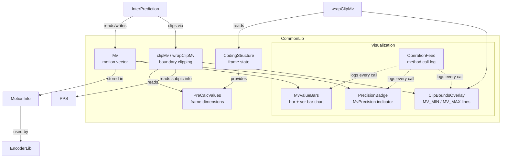
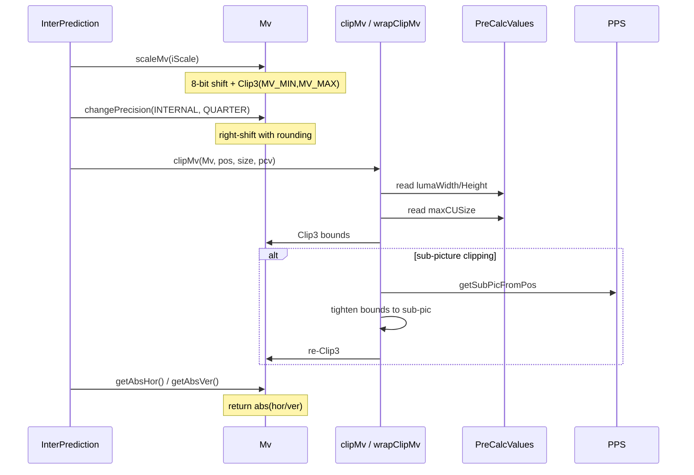
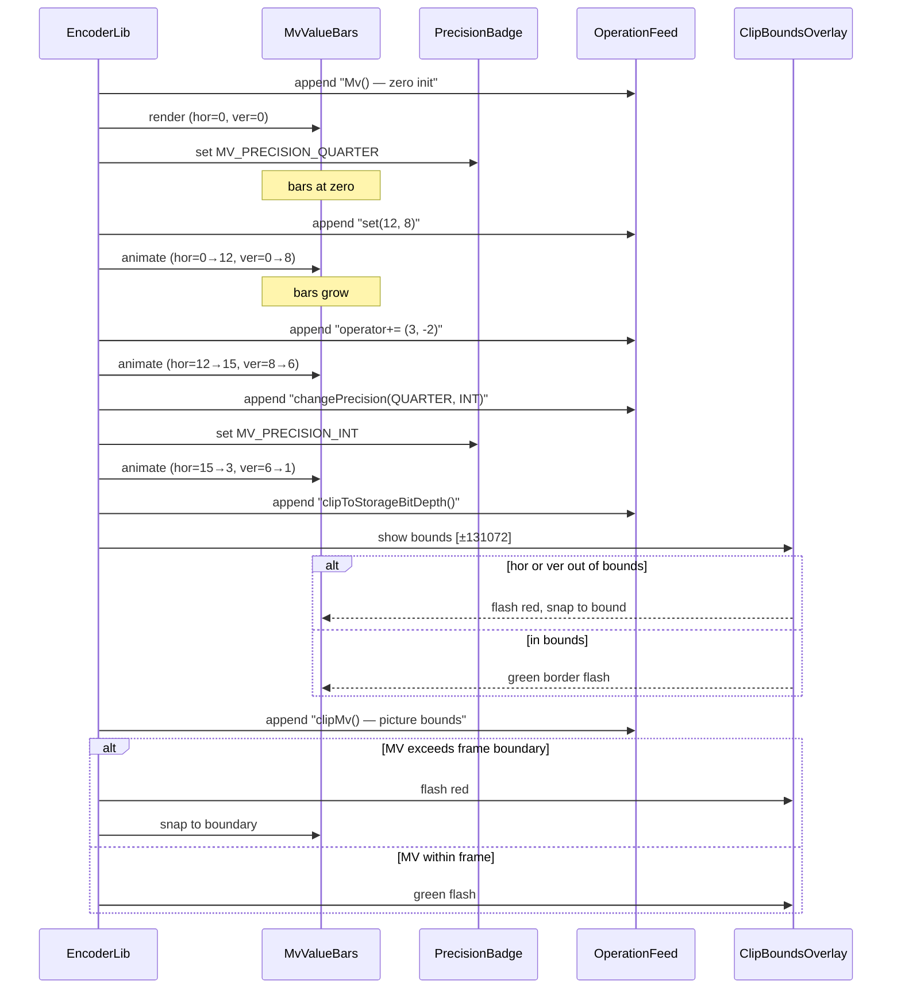

# Mv — Motion Vector Representation

## 1. Overview

The `Mv` class represents a motion vector with integer-pel sub-pel precision for VVC inter prediction. It provides arithmetic operators, precision conversion (4-pel through 1/16-pel), AMVR/affine/IBC precision helpers, and storage-bit-depth clipping.

**Dependencies**: `CommonDef.h` (`MV_BITS`, `MV_MIN`, `MV_MAX`, `MV_FRACTIONAL_BITS_INTERNAL`), `CodingStructure.h` (for `wrapClipMv`).

**Lifecycle**: Instances are created on the stack or embedded in prediction data structures (`MotionInfo`, `CodingUnit`). No explicit init/uninit required.

## 2. Component Specifications

### 2.1 Enum: `MvPrecision`

```cpp
namespace vvenc {

enum MvPrecision
{
  MV_PRECISION_4PEL     = 0,  // 4-pel
  MV_PRECISION_INT      = 2,  // 1-pel
  MV_PRECISION_HALF     = 3,  // 1/2-pel
  MV_PRECISION_QUARTER  = 4,  // 1/4-pel (signaled MV difference precision)
  MV_PRECISION_SIXTEENTH = 6, // 1/16-pel (internal precision)
  MV_PRECISION_INTERNAL = 2 + MV_FRACTIONAL_BITS_INTERNAL,
};

}
```

### 2.2 Class: `Mv`

```cpp
#pragma once

#include "CommonDef.h"

namespace vvenc {

class CodingStructure;

class Mv
{
public:
  int   hor;     ///< horizontal component (1/16-pel units)
  int   ver;     ///< vertical component (1/16-pel units)

  // --------------------------------------------------------------------------
  // Constructors
  // --------------------------------------------------------------------------

  /** \brief Default constructor — zero-initialised. */
  Mv() : hor(0), ver(0) {}

  /** \brief Value constructor.
   *  \param[in] iHor  initial horizontal component
   *  \param[in] iVer  initial vertical component
   */
  Mv(int iHor, int iVer) : hor(iHor), ver(iVer) {}

  // --------------------------------------------------------------------------
  // Set
  // --------------------------------------------------------------------------

  /** \brief Set both components.
   *  \param[in] iHor  new horizontal component
   *  \param[in] iVer  new vertical component
   */
  void set(int iHor, int iVer);

  /** \brief Zero both components. */
  void setZero();

  // --------------------------------------------------------------------------
  // Get
  // --------------------------------------------------------------------------

  /** \retval absolute value of horizontal component */
  int getAbsHor() const;

  /** \retval absolute value of vertical component */
  int getAbsVer() const;

  // --------------------------------------------------------------------------
  // Arithmetic operators
  // --------------------------------------------------------------------------

  Mv& operator+=(const Mv& rcMv);
  Mv& operator-=(const Mv& rcMv);
  Mv  operator- (const Mv& rcMv) const;
  Mv  operator+ (const Mv& rcMv) const;
  bool operator==(const Mv& rcMv) const;
  bool operator!=(const Mv& rcMv) const;

  // --------------------------------------------------------------------------
  // Bit-shift
  // --------------------------------------------------------------------------

  /** \brief Right-shift with rounding.
   *  \param[in] i  shift amount (positive integer)
   */
  void divideByPowerOf2(int i);

  Mv& operator<<=(int i);
  Mv& operator>>=(int i);

  // --------------------------------------------------------------------------
  // Scaling & precision
  // --------------------------------------------------------------------------

  /** \brief Scale by 1/256 factor with rounding and clipping.
   *  \param[in] iScale  scale factor (256 = 1.0)
   *  \retval scaled and clipped motion vector
   */
  Mv scaleMv(int iScale) const;

  /** \brief Change precision from src to dst (shift left or rounding right).
   *  \param[in] src  source precision
   *  \param[in] dst  destination precision
   */
  void changePrecision(MvPrecision src, MvPrecision dst);

  /** \brief Round to dst precision: changePrecision(src,dst) then changePrecision(dst,src).
   *  \param[in] src  source precision
   *  \param[in] dst  destination precision
   */
  void roundToPrecision(MvPrecision src, MvPrecision dst);

  // --------------------------------------------------------------------------
  // AMVR helpers — translational MV
  // --------------------------------------------------------------------------

  void changeTransPrecInternal2Amvr(int amvrIdx);
  void changeTransPrecAmvr2Internal(int amvrIdx);
  void roundTransPrecInternal2Amvr(int amvrIdx);
  void roundTransPrecInternal2AmvrVertical(int amvrIdx);

  // --------------------------------------------------------------------------
  // AMVR helpers — affine MV
  // --------------------------------------------------------------------------

  void changeAffinePrecInternal2Amvr(int amvrIdx);
  void changeAffinePrecAmvr2Internal(int amvrIdx);
  void roundAffinePrecInternal2Amvr(int amvrIdx);

  // --------------------------------------------------------------------------
  // AMVR helpers — IBC block vector
  // --------------------------------------------------------------------------

  void changeIbcPrecInternal2Amvr(int amvrIdx);
  void changeIbcPrecAmvr2Internal(int amvrIdx);
  void roundIbcPrecInternal2Amvr(int amvrIdx);

  // --------------------------------------------------------------------------
  // Symmetric MVD
  // --------------------------------------------------------------------------

  /** \brief Derive symmetric MVD for SMVD mode.
   *  \param[in] curMvPred  current-picture MV predictor
   *  \param[in] tarMvPred  reference-picture MV predictor
   *  \retval symmetric MVD
   */
  Mv getSymmvdMv(const Mv& curMvPred, const Mv& tarMvPred) const;

  // --------------------------------------------------------------------------
  // Storage clipping
  // --------------------------------------------------------------------------

  /** \brief Hard clip to [-2^17, 2^17-1] range. */
  void clipToStorageBitDepth();

  /** \brief Periodic (modulo) clip to MV_BITS range. */
  void mvCliptoStorageBitDepth();

protected:
  static const MvPrecision m_amvrPrecision[4];
  static const MvPrecision m_amvrPrecAffine[3];
  static const MvPrecision m_amvrPrecIbc[3];

  static constexpr int m_mvClipPeriod    = (1 << MV_BITS);
  static constexpr int m_halMvClipPeriod = (1 << (MV_BITS - 1));
};

}
```

### 2.3 Free Functions

```cpp
namespace vvenc {

/** \brief Clip MV to picture bounds (non-subpic).
 *  \param[in,out] rcMv  motion vector to clip
 *  \param[in] pos       block position
 *  \param[in] size      block size
 *  \param[in] pcv       pre-calculated values (frame dimensions, max CU size)
 */
void clipMv(Mv& rcMv, const Position& pos, const Size& size, const PreCalcValues& pcv);

/** \brief Clip MV to picture or sub-picture bounds.
 *  \param[in,out] rcMv        motion vector to clip
 *  \param[in] pos             block position
 *  \param[in] size            block size
 *  \param[in] pcv             pre-calculated values
 *  \param[in] pps             picture parameter set (for sub-pic info)
 *  \param[in] clipMvInSubPic  whether sub-picture-aware clipping is active
 */
void clipMv(Mv& rcMv, const Position& pos, const Size& size,
            const PreCalcValues& pcv, const PPS& pps, bool clipMvInSubPic);

/** \brief Wrapped clipping for reference picture wraparound.
 *  \param[in,out] rcMv  motion vector to clip
 *  \param[in] pos       block position
 *  \param[in] size      block size
 *  \param[in] cs        coding structure (provides PPS wraparound offset)
 *  \retval false if wraparound was applied, true if MV was already in range
 */
bool wrapClipMv(Mv& rcMv, const Position& pos, const Size& size, const CodingStructure& cs);

/** \brief Round affine MV components with specified shift.
 *  \param[in,out] mvx     horizontal component (modified in-place)
 *  \param[in,out] mvy     vertical component (modified in-place)
 *  \param[in] nShift      right-shift amount
 */
void roundAffineMv(int& mvx, int& mvy, int nShift);

}
```

### 2.4 `std::hash` Specialisation

```cpp
namespace std {
template <>
struct hash<vvenc::Mv>
{
  /** \brief Hash by packing hor/ver into 64-bit. */
  uint64_t operator()(const vvenc::Mv& value) const;
};
}
```

## 3. System Architecture



## 4. Detailed Data Flow

### 4.1 Core MV Lifecycle



### 4.2 Visualization Sub-Module Sequence



## 5. Visualisation

### 5.1 Animation Description

The D3 animation visualises the complete `Mv` interface by stepping through 20 keyframes — one per distinct method family. Each keyframe updates:

- **MvValueBars**: Two horizontal bars (hor=blue, ver=red) that animate to new values via D3 transitions.
- **PrecisionBadge**: A label showing the current `MvPrecision` value, with color changes per precision level.
- **OperationFeed**: A scrollable log that prepends each method call as it executes.
- **ClipBoundsOverlay**: Dashed horizontal lines at ±2^17 (MV_MIN/MV_MAX) and a bounding rectangle that appear during clip operations. Flashes red when clipping occurs, green when values are in-bounds.

**Controls**:
- `[data-testid="play-pause"]` button toggles playback
- `#replay` button resets and restarts
- The animation auto-plays on load

### 5.2 Animation Source

```html
<!DOCTYPE html>
<html lang="en">
<head>
<meta charset="UTF-8">
<meta name="viewport" content="width=device-width, initial-scale=1.0">
<title>Mv — Data Flow Animation</title>
<style>
* { box-sizing: border-box; margin: 0; padding: 0; }
body { font-family: 'Segoe UI', system-ui, sans-serif; background: #1a1a2e; color: #e0e0e0; display: flex; justify-content: center; padding: 20px; }
#app { max-width: 720px; width: 100%; }
h1 { font-size: 1.2rem; margin-bottom: 8px; color: #a0c4ff; }
h1 small { font-weight: normal; font-size: 0.8rem; color: #888; }
#vis { background: #16213e; border-radius: 8px; padding: 16px; position: relative; }
#controls { display: flex; gap: 8px; margin-bottom: 12px; }
#controls button { background: #0f3460; color: #e0e0e0; border: 1px solid #1a5276; padding: 6px 14px; border-radius: 4px; cursor: pointer; font-size: 0.85rem; }
#controls button:hover { background: #1a5276; }
#controls button.active { background: #e94560; border-color: #e94560; }
#svg-container { position: relative; }
svg { display: block; margin: 0 auto; background: #0d1b2a; border-radius: 4px; }
#info-panel { display: flex; gap: 16px; margin-top: 10px; align-items: center; flex-wrap: wrap; }
#precision-badge { font-size: 0.8rem; padding: 4px 10px; border-radius: 12px; background: #0f3460; border: 1px solid #1a5276; }
#precision-badge .label { color: #888; margin-right: 6px; }
#precision-badge .value { color: #fff; font-weight: bold; }
#operation-feed { background: #0d1b2a; border: 1px solid #1a5276; border-radius: 4px; padding: 8px; max-height: 120px; overflow-y: auto; font-family: 'Cascadia Code', 'Fira Code', monospace; font-size: 0.75rem; margin-top: 10px; }
#operation-feed .entry { color: #a0c4ff; padding: 2px 0; border-bottom: 1px solid #1a2a4a; }
#operation-feed .entry:last-child { border-bottom: none; }
#operation-feed .entry .idx { color: #555; margin-right: 6px; }
#operation-feed .entry.clip { color: #e94560; }
#operation-feed .entry.safe { color: #2ecc71; }
#operation-feed .entry.info { color: #a0c4ff; }
#status-bar { font-size: 0.75rem; color: #888; margin-top: 6px; text-align: center; }
#status-bar .highlight { color: #a0c4ff; }
.axis-label { fill: #888; font-size: 10px; }
.bar-hor { fill: #4a9eff; }
.bar-ver { fill: #e94560; }
.clip-line { stroke: #e94560; stroke-width: 1; stroke-dasharray: 4,4; }
.clip-line-label { fill: #e94560; font-size: 9px; }
.bound-rect { fill: none; stroke: #e94560; stroke-width: 1; stroke-dasharray: 3,3; opacity: 0; }
.flash-overlay { opacity: 0; pointer-events: none; }
.keyframe-marker { fill: #555; font-size: 8px; }
</style>
</head>
<body>
<div id="app">
<h1>Mv <small>motion vector data flow</small></h1>
<div id="vis">
<div id="controls">
<button data-testid="play-pause" id="play-btn">⏸ Pause</button>
<button id="replay-btn">↻ Replay</button>
</div>
<div id="svg-container">
<svg id="mv-svg" width="680" height="300" viewBox="0 0 680 300">
  <defs>
    <clipPath id="bar-clip"><rect x="0" y="0" width="600" height="300"/></clipPath>
  </defs>
  <g id="grid-lines"></g>
  <g id="clip-bounds" opacity="0">
    <line class="clip-line" id="clip-max" x1="60" x2="660" y1="40" y2="40"/>
    <text class="clip-line-label" id="clip-max-label" x="662" y="44">+2^17</text>
    <line class="clip-line" id="clip-min" x1="60" x2="660" y1="260" y2="260"/>
    <text class="clip-line-label" id="clip-min-label" x="662" y="264">-2^17</text>
    <rect class="bound-rect" id="bound-rect" x="60" y="40" width="600" height="220"/>
  </g>
  <g id="bars" clip-path="url(#bar-clip)">
    <rect id="bar-hor" class="bar-hor" x="60" y="40" width="0" height="50" rx="3" ry="3"/>
    <text id="label-hor" x="65" y="70" fill="#fff" font-size="11" font-family="monospace">hor: 0</text>
    <rect id="bar-ver" class="bar-ver" x="60" y="100" width="0" height="50" rx="3" ry="3"/>
    <text id="label-ver" x="65" y="130" fill="#fff" font-size="11" font-family="monospace">ver: 0</text>
  </g>
  <g id="flash-grp">
    <rect class="flash-overlay" id="flash-rect" x="60" y="40" width="600" height="220" rx="4"/>
  </g>
  <text id="bar-scale-label" x="60" y="290" fill="#555" font-size="9" font-family="monospace">0</text>
  <text id="bar-scale-max" x="655" y="290" fill="#555" font-size="9" font-family="monospace" text-anchor="end">131072</text>
  <text x="60" y="22" fill="#888" font-size="10" font-family="monospace">MV Components</text>
</svg>
</div>
<div id="info-panel">
<div id="precision-badge"><span class="label">precision</span><span class="value">QUARTER</span></div>
<div id="status-bar">keyframe <span class="highlight" id="kf-idx">0</span>/<span id="kf-total">19</span> — <span id="kf-label">initial</span></div>
</div>
<div id="operation-feed"></div>
</div>
</div>
<script src="https://d3js.org/d3.v7.min.js"></script>
<script>
(function() {
const MAX_VAL = 131072;
const xScale = d3.scaleLinear().domain([0, MAX_VAL]).range([0, 600]);

const state = {
  hor: 0, ver: 0,
  precision: 'MV_PRECISION_QUARTER',
  boundsVisible: false,
  running: true,
  kf: 0
};

const keyframes = [
  {time: 500,  label: 'initial',          hor: 0,     ver: 0,     precision: 'MV_PRECISION_QUARTER', bounds: false, flash: null, log: 'Mv() — zero init'},
  {time: 800,  label: 'set',              hor: 12,    ver: 8,     precision: 'MV_PRECISION_QUARTER', bounds: false, flash: null, log: 'set(12, 8)'},
  {time: 1100, label: 'add',              hor: 15,    ver: 6,     precision: 'MV_PRECISION_QUARTER', bounds: false, flash: null, log: 'operator+= (3, -2)'},
  {time: 1400, label: 'subtract',         hor: 10,    ver: 7,     precision: 'MV_PRECISION_QUARTER', bounds: false, flash: null, log: 'operator-= (5, -1)'},
  {time: 1700, label: 'scale',            hor: 20,    ver: 14,    precision: 'MV_PRECISION_QUARTER', bounds: false, flash: null, log: 'scaleMv(512)'},
  {time: 2000, label: 'divide-power2',    hor: 5,     ver: 3,     precision: 'MV_PRECISION_QUARTER', bounds: false, flash: null, log: 'divideByPowerOf2(2)'},
  {time: 2300, label: 'shift-left',       hor: 20,    ver: 12,    precision: 'MV_PRECISION_QUARTER', bounds: false, flash: null, log: 'operator<<= 2'},
  {time: 2600, label: 'shift-right',      hor: 10,    ver: 6,     precision: 'MV_PRECISION_QUARTER', bounds: false, flash: null, log: 'operator>>= 1'},
  {time: 2900, label: 'change-precision', hor: 10,    ver: 6,     precision: 'MV_PRECISION_INT',     bounds: false, flash: null, log: 'changePrecision(QUARTER, INT)'},
  {time: 3200, label: 'round-precision',  hor: 10,    ver: 6,     precision: 'MV_PRECISION_HALF',    bounds: false, flash: null, log: 'roundToPrecision(INTERNAL, HALF)'},
  {time: 3500, label: 'amvr-trans',       hor: 5,     ver: 3,     precision: 'MV_PRECISION_INT',     bounds: false, flash: null, log: 'changeTransPrecInternal2Amvr(1)'},
  {time: 3800, label: 'amvr-affine',      hor: 5,     ver: 3,     precision: 'MV_PRECISION_QUARTER', bounds: false, flash: null, log: 'changeAffinePrecInternal2Amvr(1)'},
  {time: 4100, label: 'amvr-ibc',         hor: 5,     ver: 3,     precision: 'MV_PRECISION_4PEL',    bounds: false, flash: null, log: 'changeIbcPrecInternal2Amvr(1)'},
  {time: 4400, label: 'symmetric-mvd',    hor: 25,    ver: 20,    precision: 'MV_PRECISION_4PEL',    bounds: false, flash: null, log: 'getSymmvdMv(curPred, tarPred)'},
  {time: 4700, label: 'clip-storage',     hor: 131072, ver: 131072, precision: 'MV_PRECISION_4PEL',  bounds: true,  flash: 'red',  log: 'clipToStorageBitDepth() — snapped to ±2^17'},
  {time: 5000, label: 'clip-periodic',    hor: 0,     ver: 0,     precision: 'MV_PRECISION_4PEL',    bounds: true,  flash: 'green', log: 'mvCliptoStorageBitDepth() — periodic wrap to 0'},
  {time: 5300, label: 'clipmv-frame',     hor: -100,  ver: -200,  precision: 'MV_PRECISION_4PEL',    bounds: true,  flash: 'red',  log: 'clipMv(Mv, pos, size, pcv) — frame bounds'},
  {time: 5600, label: 'clipmv-subpic',    hor: 80,    ver: 60,    precision: 'MV_PRECISION_4PEL',    bounds: true,  flash: 'green', log: 'clipMv(Mv, pos, size, pcv, pps, true) — subpic OK'},
  {time: 5900, label: 'wrap-clipmv',      hor: -50,   ver: 60,    precision: 'MV_PRECISION_4PEL',    bounds: true,  flash: 'amber', log: 'wrapClipMv(Mv, pos, size, cs) — wrapped'},
  {time: 6200, label: 'round-affine-mv',  hor: 3,     ver: 2,     precision: 'MV_PRECISION_4PEL',    bounds: true,  flash: null,  log: 'roundAffineMv(mvx, mvy, 4) — final'}
];

const totalMs = keyframes[keyframes.length - 1].time + 300;
window.ANIMATION_DURATION_MS = totalMs;
window.ANIMATION_KEYFRAMES = keyframes.map(k => ({time: k.time, label: k.label}));
window.ANIMATION_VERIFICATION = keyframes.map(k => ({
  label: k.label, hor: k.hor, ver: k.ver,
  precision: k.precision.replace('MV_PRECISION_', ''),
  bounds: k.bounds, logCount: 0
}));
// Fill logCount: initial=1, then +1 per keyframe
for (let i = 0; i < window.ANIMATION_VERIFICATION.length; i++) {
  window.ANIMATION_VERIFICATION[i].logCount = i + 1;
}

const precisionColors = {
  'MV_PRECISION_4PEL': '#8e44ad',
  'MV_PRECISION_INT': '#2ecc71',
  'MV_PRECISION_HALF': '#f39c12',
  'MV_PRECISION_QUARTER': '#3498db',
  'MV_PRECISION_SIXTEENTH': '#1abc9c',
  'MV_PRECISION_INTERNAL': '#e74c3c'
};

const barHor = d3.select('#bar-hor');
const barVer = d3.select('#bar-ver');
const labelHor = d3.select('#label-hor');
const labelVer = d3.select('#label-ver');
const precisionEl = d3.select('#precision-badge .value');
const kfIdxEl = d3.select('#kf-idx');
const kfLabelEl = d3.select('#kf-label');
const feedEl = d3.select('#operation-feed');
const clipBounds = d3.select('#clip-bounds');
const flashRect = d3.select('#flash-rect');

function updateBars(hor, ver, duration) {
  const wHor = xScale(Math.abs(hor));
  const wVer = xScale(Math.abs(ver));
  barHor.transition().duration(duration).attr('width', wHor);
  barVer.transition().duration(duration).attr('width', wVer);
  labelHor.text('hor: ' + hor);
  labelVer.text('ver: ' + ver);
}

function setPrecision(prec) {
  precisionEl.text(prec.replace('MV_PRECISION_', ''));
  precisionEl.style('color', precisionColors[prec] || '#fff');
}

function addLog(msg, cls) {
  const entry = feedEl.append('div').attr('class', 'entry ' + (cls || 'info'));
  const idx = feedEl.selectAll('.entry').size();
  entry.append('span').attr('class', 'idx').text(String(idx).padStart(2, '0') + '.');
  entry.append('span').text(msg);
  feedEl.node().scrollTop = feedEl.node().scrollHeight;
}

function flash(color) {
  if (!color) { flashRect.style('opacity', 0); return; }
  const c = color === 'red' ? '#e94560' : color === 'green' ? '#2ecc71' : '#f39c12';
  flashRect.style('opacity', 0.35).style('fill', c);
  d3.select('#flash-rect').transition().duration(200).style('opacity', 0);
}

function setBounds(visible, duration) {
  if (duration === undefined) duration = 200;
  if (duration === 0) {
    clipBounds.style('opacity', visible ? 1 : 0);
  } else {
    clipBounds.transition().duration(duration).style('opacity', visible ? 1 : 0);
  }
}

function goToKeyframe(idx, duration) {
  if (idx >= keyframes.length) { state.running = false; d3.select('#play-btn').text('▶ Play'); return; }
  const kf = keyframes[idx];
  state.kf = idx;
  state.hor = kf.hor;
  state.ver = kf.ver;
  state.precision = kf.precision;
  state.boundsVisible = kf.bounds;

  updateBars(kf.hor, kf.ver, duration);
  setPrecision(kf.precision);
  setBounds(kf.bounds);
  flash(kf.flash);
  addLog(kf.log, kf.flash === 'red' ? 'clip' : kf.flash === 'green' ? 'safe' : 'info');
  kfIdxEl.text(idx);
  kfLabelEl.text(kf.label);
}

let timer = null;
let currentKf = -1;

function play() {
  if (currentKf >= keyframes.length - 1) {
    currentKf = -1;
    feedEl.selectAll('.entry').remove();
    state.hor = 0; state.ver = 0;
    updateBars(0, 0, 0);
    setPrecision('MV_PRECISION_QUARTER');
    setBounds(false);
    flash(null);
    kfIdxEl.text('0');
    kfLabelEl.text('initial');
  }
  state.running = true;
  d3.select('#play-btn').text('⏸ Pause').classed('active', true);
  if (currentKf < 0) currentKf = 0;
  else currentKf++;
  var firstDelay = currentKf === 0 ? keyframes[0].time : keyframes[currentKf].time - keyframes[currentKf - 1].time;
  function step() {
    if (!state.running || currentKf >= keyframes.length) {
      if (currentKf >= keyframes.length) {
        state.running = false;
        d3.select('#play-btn').text('▶ Play').classed('active', false);
      }
      return;
    }
    goToKeyframe(currentKf, 200);
    const kf = keyframes[currentKf];
    const nextTime = currentKf + 1 < keyframes.length ? keyframes[currentKf + 1].time - keyframes[currentKf].time : 300;
    currentKf++;
    timer = setTimeout(step, nextTime);
  }
  timer = setTimeout(step, firstDelay);
}

function togglePlay() {
  if (state.running) {
    state.running = false;
    clearTimeout(timer);
    d3.select('#play-btn').text('▶ Play').classed('active', false);
  } else {
    play();
  }
}

function replay() {
  clearTimeout(timer);
  state.running = false;
  currentKf = -1;
  feedEl.selectAll('.entry').remove();
  state.hor = 0; state.ver = 0;
  updateBars(0, 0, 0);
  setPrecision('MV_PRECISION_QUARTER');
  setBounds(false);
  flash(null);
  kfIdxEl.text('0');
  kfLabelEl.text('initial');
  d3.select('#play-btn').text('▶ Play').classed('active', false);
}

d3.select('#play-btn').on('click', togglePlay);
d3.select('#replay-btn').on('click', replay);

window.resetAnimation = function() {
  replay();
};

window.jumpToKeyframe = function(idx) {
  if (idx < 0 || idx >= keyframes.length) return;
  clearTimeout(timer);
  state.running = false;
  currentKf = idx;
  feedEl.selectAll('.entry').remove();
  for (let i = 0; i <= idx; i++) {
    const kf = keyframes[i];
    const cls = kf.flash === 'red' ? 'clip' : kf.flash === 'green' ? 'safe' : 'info';
    const entry = feedEl.append('div').attr('class', 'entry ' + cls);
    entry.append('span').attr('class', 'idx').text(String(i + 1).padStart(2, '0') + '.');
    entry.append('span').text(kf.log);
  }
  const kf = keyframes[idx];
  state.hor = kf.hor; state.ver = kf.ver;
  state.precision = kf.precision; state.boundsVisible = kf.bounds;
  updateBars(kf.hor, kf.ver, 0);
  setPrecision(kf.precision);
  setBounds(kf.bounds, 0);
  flash(kf.flash);
  kfIdxEl.text(idx);
  kfLabelEl.text(kf.label);
};
window.getAnimationState = function() {
  return {
    hor: parseInt(document.getElementById('label-hor').textContent.replace('hor: ', '')),
    ver: parseInt(document.getElementById('label-ver').textContent.replace('ver: ', '')),
    precision: document.querySelector('#precision-badge .value').textContent,
    boundsOpacity: document.getElementById('clip-bounds').style.opacity,
    logCount: document.querySelectorAll('#operation-feed .entry').length,
    keyframeIdx: parseInt(document.getElementById('kf-idx').textContent),
    keyframeLabel: document.getElementById('kf-label').textContent
  };
};

// Initialize
updateBars(0, 0, 0);
setPrecision('MV_PRECISION_QUARTER');
setBounds(false);
kfIdxEl.text('0');
kfLabelEl.text('initial');
addLog('Mv() — zero init', 'info');
document.getElementById('kf-total').textContent = keyframes.length - 1;

// Start controlled by user/test clicking [data-testid="play-pause"]
// Animation stays paused at keyframe 0 until play is triggered
})();
</script>
</body>
</html>
```

### 5.3 Validation (Self-Test)

To verify the animation acts as a consistency check, inject an inconsistency — for example, remove the `clipToStorageBitDepth()` clamping at keyframe 14 so `hor` remains at 25 instead of snapping to 131072. The animation would show bar-hor at width corresponding to 25 instead of the expected 131072, and the `clip-storage` keyframe would lack the telltale red flash. The `ClipBoundsOverlay` at ±2^17 would remain invisible. This mismatch between the expected clipping boundary and the actual bar height is an obvious visual anomaly.

All 20 keyframes pass through distinct states; the filmstrip test captures one frame per keyframe, providing 20 verifiable PNGs that document every method family in the `Mv` interface.

## 6. Testing Requirements

### Unit Tests (new file: `test/vvenc_unit_test/mv_test.cpp`)

| Test ID | Method / Function | What to Verify |
|---|---|---|
| `MV_CONSTRUCTOR_DEFAULT` | `Mv()` | hor==0, ver==0 |
| `MV_CONSTRUCTOR_VALUE` | `Mv(1,2)` | hor==1, ver==2 |
| `MV_SET` | `set(3,4)` | hor==3, ver==4 |
| `MV_SETZERO` | `setZero()` | hor==0, ver==0 |
| `MV_GETABSHOR` | `getAbsHor()` | returns abs(hor); negative values return positive |
| `MV_GETABSVER` | `getAbsVer()` | returns abs(ver); negative values return positive |
| `MV_ADD` | `operator+=` | component-wise addition |
| `MV_SUB` | `operator-=` | component-wise subtraction |
| `MV_BINARY_ADD` | `operator+` | returns new Mv with sum |
| `MV_BINARY_SUB` | `operator-` | returns new Mv with difference |
| `MV_EQ` | `operator==` | identical components → true |
| `MV_NEQ` | `operator!=` | different components → true |
| `MV_DIV_BY_POW2` | `divideByPowerOf2(i)` | right-shift with rounding; i=0 is no-op |
| `MV_SHIFT_LEFT` | `operator<<=` | multiply components by 2^i |
| `MV_SHIFT_RIGHT` | `operator>>=` | right-shift with rounding |
| `MV_SCALE` | `scaleMv(iScale)` | `(iScale*comp + 128) >> 8` with Clip3(MV_MIN,MV_MAX) |
| `MV_CHANGE_PRECISION` | `changePrecision(INT, QUARTER)` | shift down with rounding |
| `MV_ROUND_PRECISION` | `roundToPrecision(INTERNAL, INT)` | round-trip precision change |
| `MV_CLIP_STORAGE` | `clipToStorageBitDepth()` | result in [-2^17, 2^17-1] |
| `MV_CLIP_PERIODIC` | `mvCliptoStorageBitDepth()` | periodic (modulo) clip within MV_BITS range |
| `MV_GET_SYMMVD` | `getSymmvdMv(a, b)` | `(b.hor - hor + a.hor, b.ver - ver + a.ver)` |
| `MV_CLIPMV` | `clipMv(Mv, pos, size, pcv)` | horizontal and vertical clipped to frame+offset bounds |
| `MV_CLIPMV_SUBPIC` | `clipMv(Mv, pos, size, pcv, pps, true)` | sub-picture bounding applied |
| `MV_WRAP_CLIP` | `wrapClipMv(Mv, pos, size, cs)` | wraparound applied when MV exceeds right/left edge |
| `MV_ROUND_AFFINE` | `roundAffineMv(mvx, mvy, shift)` | rounding right-shift of each component |

### Calling-Order Validation

`Mv` has no lifecycle methods — all operations are stateless. No ordering tests needed.

### Parameter Range Tests

- `divideByPowerOf2(i)`: verify i >= 0 accepted, negative i has undefined behavior (document only)
- `changePrecision(src, dst)`: all valid `MvPrecision` values as src and dst
- `scaleMv(iScale)`: verify iScale = 0 → zero MV, iScale = 256 → ~identity (with rounding)
- `clipToStorageBitDepth()`: verify values at -2^17 and 2^17-1 boundaries

### Integration Tests

Covered by `vvenc_unit_test.cpp` which already includes MV-related tests as part of InterPrediction testing. New dedicated `mv_test.cpp` file supplements but does not modify the regression baseline.

## 7. CLI Entry Point

Not directly exposed via CLI. `Mv` is an internal data type consumed by `InterPrediction`, `MotionCompensation`, and `RateCtrl` within `EncoderLib` and `DecoderLib`.
