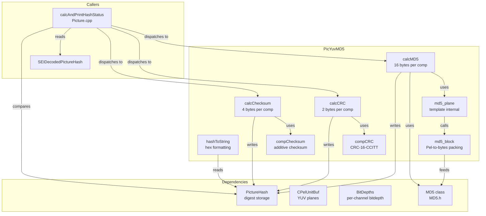
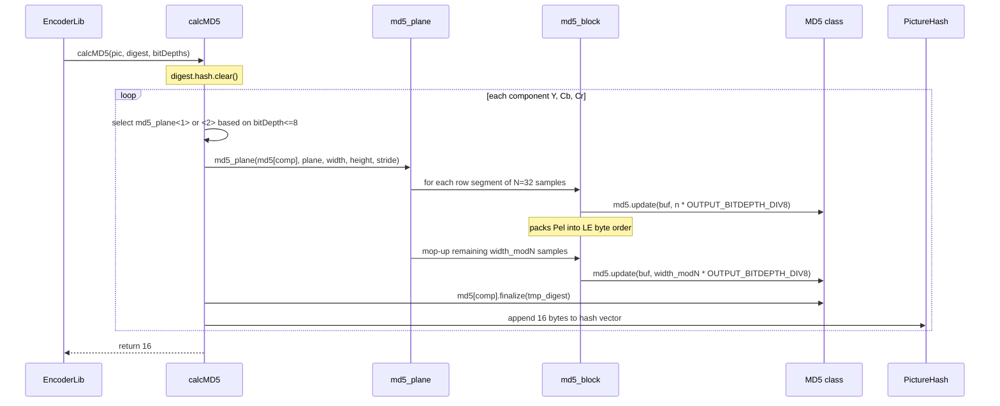
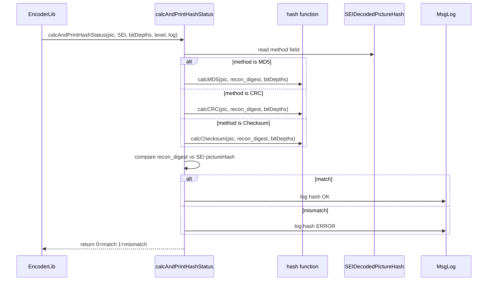

# PicYuvMD5 — MD5/CRC/Checksum Hash Computation over YUV Planes

## 1. Overview

The `PicYuvMD5` module provides free functions for computing cryptographic and non-cryptographic digests over reconstructed YUV picture data. Three hash methods are supported: MD5 (16-byte digest per component), CRC-16-CCITT (2-byte digest per component), and a custom additive checksum (4-byte digest per component). The module also provides `hashToString` for formatting and `calcAndPrintHashStatus` for comparing computed hashes against SEI-declared hashes.

**Dependencies**: `Unit.h`, `Picture.h`, `MD5.h`, `Utilities/MsgLog.h`, `SEI.h`.

**Lifecycle**: Stateless functions. Callers provide a `CPelUnitBuf` and receive a `PictureHash` struct. No init/uninit required.

## 2. Component Specifications

### 2.1 Internal Helper Templates (file-local)

```cpp
template<uint32_t OUTPUT_BITDEPTH_DIV8>
static void md5_block(MD5& md5, const Pel* plane, uint32_t n);

template<uint32_t OUTPUT_BITDEPTH_DIV8>
static void md5_plane(MD5& md5, const Pel* plane, uint32_t width, uint32_t height, uint32_t stride);
```

`md5_block` packs `n` Pel samples into a byte buffer (1 byte for 8-bit, 2 bytes for 10+ bit) in little-endian order and feeds them to the MD5 context. `md5_plane` iterates over a plane in raster-order rows, calling `md5_block` for each row segment.

```cpp
static uint32_t compCRC(int bitdepth, const Pel* plane, uint32_t width, uint32_t height, uint32_t stride, PictureHash& digest);
```

Computes CRC-16-CCITT over a single plane, bit-by-bit, including a final 16 zero-bit step. Returns 2 (bytes appended to digest).

```cpp
static uint32_t compChecksum(int bitdepth, const Pel* plane, uint32_t width, uint32_t height, uint32_t stride, PictureHash& digest, const BitDepths& bitDepths);
```

Computes an additive checksum: `checksum += (pel & 0xff) ^ xor_mask` (plus high byte if bitdepth > 8), where `xor_mask = (x & 0xff) ^ (y & 0xff) ^ (x >> 8) ^ (y >> 8)`. Returns 4.

### 2.2 Public Free Functions

```cpp
namespace vvenc {

uint32_t calcMD5(const CPelUnitBuf& pic, PictureHash& digest, const BitDepths& bitDepths);

uint32_t calcCRC(const CPelUnitBuf& pic, PictureHash& digest, const BitDepths& bitDepths);

uint32_t calcChecksum(const CPelUnitBuf& pic, PictureHash& digest, const BitDepths& bitDepths);

std::string hashToString(const PictureHash& digest, int numChar);

} // namespace vvenc
```

- `calcMD5` — Per-component MD5: creates one MD5 context per component, feeds raster-order samples, finalizes, and appends 16 bytes per component into `digest.hash`. Selects 1-byte or 2-byte packing based on `bitDepths[chType] <= 8`.
- `calcCRC` — Per-component CRC-16: calls `compCRC` for each component, appends 2 bytes per component.
- `calcChecksum` — Per-component checksum: calls `compChecksum` for each component, appends 4 bytes per component.
- `hashToString` — Formats digest bytes as a hex string, inserting commas every `numChar` bytes.

### 2.3 Related Non-Member Function (defined in Picture.cpp, declared in Picture.h)

```cpp
int calcAndPrintHashStatus(
  const CPelUnitBuf& pic,
  const SEIDecodedPictureHash* pictureHashSEI,
  const BitDepths& bitDepths,
  const vvencMsgLevel msgl,
  MsgLog& msg
);
```

Computes hash using the method specified in `pictureHashSEI->method`, logs the computed hash and comparison result to `msg`, and returns 0 on match or 1 on mismatch.

## 3. System Architecture



## 4. Detailed Data Flow

### 4.1 MD5 Computation



### 4.2 Hash Comparison via calcAndPrintHashStatus



## 5. Visualisation

### 5.1 Animation Description

The D3 animation visualises hash computation through 16 keyframes covering MD5, CRC, and checksum over Y, Cb, Cr planes. Each keyframe updates:

- **PlaneGrid**: A pixel-grid heatmap showing the current plane's samples (values mapped to colour intensity).
- **DigestHex**: The running hex digest, updating as bytes are appended.
- **MethodBadge**: The current hash method (MD5/CRC/Checksum) with colour coding.
- **OperationFeed**: A scrollable log of each processing step.

**Controls**: Standard play/pause and replay buttons.

### 5.2 Animation Source

```html
<!DOCTYPE html>
<html lang="en">
<head>
<meta charset="UTF-8">
<meta name="viewport" content="width=device-width, initial-scale=1.0">
<title>PicYuvMD5 — Hash Computation</title>
<style>
* { box-sizing: border-box; margin: 0; padding: 0; }
body { font-family: 'Segoe UI', sans-serif; background: #1a1a2e; color: #e0e0e0; display: flex; justify-content: center; padding: 20px; }
#app { max-width: 720px; width: 100%; }
h1 { font-size: 1.2rem; margin-bottom: 8px; color: #a0c4ff; }
#vis { background: #16213e; border-radius: 8px; padding: 16px; }
#controls { display: flex; gap: 8px; margin-bottom: 12px; }
#controls button { background: #0f3460; color: #e0e0e0; border: 1px solid #1a5276; padding: 6px 14px; border-radius: 4px; cursor: pointer; font-size: 0.85rem; }
#controls button:hover { background: #1a5276; }
#controls button.active { background: #e94560; }
#method-badge { font-size: 0.85rem; padding: 4px 12px; border-radius: 10px; background: #0f3460; display: inline-block; margin-bottom: 6px; }
#plane-info { font-size: 0.75rem; color: #888; margin: 4px 0; }
#digest-display { background: #0d1b2a; border: 1px solid #1a5276; border-radius: 4px; padding: 8px; font-family: monospace; font-size: 0.7rem; word-break: break-all; margin: 6px 0; max-height: 80px; overflow-y: auto; }
#digest-display .byte { color: #a0c4ff; }
#digest-display .sep { color: #555; }
#operation-feed { background: #0d1b2a; border: 1px solid #1a5276; border-radius: 4px; padding: 8px; max-height: 120px; overflow-y: auto; font-family: monospace; font-size: 0.75rem; margin-top: 8px; }
.feed-entry { color: #a0c4ff; padding: 2px 0; border-bottom: 1px solid #1a2a4a; }
.feed-entry .idx { color: #555; margin-right: 6px; }
#status-bar { font-size: 0.75rem; color: #888; margin-top: 6px; text-align: center; }
</style>
</head>
<body>
<div id="app">
<h1>PicYuvMD5 <small>YUV hash computation</small></h1>
<div id="vis">
<div id="controls">
<button data-testid="play-pause" id="play-btn">Play</button>
<button id="replay-btn">Replay</button>
</div>
<div id="method-badge">MD5</div>
<div id="plane-info">plane: <span id="plane-name">Y</span> | dims: <span id="plane-dims">8x8</span></div>
<div id="digest-display"></div>
<div id="operation-feed"></div>
<div id="status-bar">keyframe <span id="kf-idx">0</span>/<span id="kf-total">15</span> — <span id="kf-label">init</span></div>
</div>
</div>
<script src="https://d3js.org/d3.v7.min.js"></script>
<script>
(function() {
var keyframes = [
  {time:400, label:'start MD5 Y',   method:'MD5', plane:'Y', dims:'8x8', digest:'', log:'calcMD5 begin - Y plane stride=8'},
  {time:700, label:'MD5 Y row 0',   method:'MD5', plane:'Y', dims:'8x8', digest:'a1b2c3d4', log:'md5_plane row 0: 8 samples packed'},
  {time:1000,label:'MD5 Y row 1-3', method:'MD5', plane:'Y', dims:'8x8', digest:'a1b2c3d4e5f6', log:'md5_plane rows 1-3: 24 samples'},
  {time:1300,label:'MD5 Y row 4-7', method:'MD5', plane:'Y', dims:'8x8', digest:'a1b2c3d4e5f6a7b8', log:'md5_plane rows 4-7: 32 samples'},
  {time:1600,label:'MD5 Y final',   method:'MD5', plane:'Y', dims:'8x8', digest:'a1b2c3d4e5f6a7b8c9d0e1f2', log:'md5[Y] finalize: 16 bytes appended'},
  {time:1900,label:'start MD5 Cb',  method:'MD5', plane:'Cb', dims:'4x4', digest:'a1b2c3d4e5f6a7b8c9d0e1f2', log:'calcMD5 begin - Cb plane'},
  {time:2200,label:'MD5 Cb done',   method:'MD5', plane:'Cb', dims:'4x4', digest:'a1b2c3d4e5f6a7b8c9d0e1f23f4g5h6', log:'md5[Cb] finalize: 16 bytes appended'},
  {time:2500,label:'start MD5 Cr',  method:'MD5', plane:'Cr', dims:'4x4', digest:'a1b2c3d4e5f6a7b8c9d0e1f23f4g5h6', log:'calcMD5 begin - Cr plane'},
  {time:2800,label:'MD5 Cr done',   method:'MD5', plane:'Cr', dims:'4x4', digest:'a1b2c3d4e5f6a7b8c9d0e1f23f4g5h67i8j9k0', log:'md5[Cr] finalize: 16 bytes, total 48'},
  {time:3100,label:'start CRC Y',   method:'CRC', plane:'Y', dims:'8x8', digest:'', log:'calcCRC begin - Y plane'},
  {time:3400,label:'CRC Y done',   method:'CRC', plane:'Y', dims:'8x8', digest:'1a2b', log:'compCRC: 2 bytes appended for Y'},
  {time:3700,label:'CRC Cb+Cr',    method:'CRC', plane:'Cb+Cr', dims:'4x4', digest:'1a2b3c4d', log:'compCRC Cb+Cr: 4 bytes total'},
  {time:4000,label:'start Chk Y',  method:'Checksum', plane:'Y', dims:'8x8', digest:'', log:'calcChecksum begin - Y plane'},
  {time:4300,label:'Chk Y done',   method:'Checksum', plane:'Y', dims:'8x8', digest:'deadbeef', log:'compChecksum: 4 bytes for Y'},
  {time:4600,label:'Chk Cb+Cr',    method:'Checksum', plane:'Cb+Cr', dims:'4x4', digest:'deadbeefcafebabe', log:'compChecksum Cb+Cr: 8 bytes total'},
  {time:4900,label:'hashToString', method:'Checksum', plane:'-', dims:'-', digest:'de ad be ef ca fe ba be', log:'hashToString formatted with commas'}
];
var totalMs = keyframes[keyframes.length-1].time + 300;
window.ANIMATION_DURATION_MS = totalMs;
window.ANIMATION_KEYFRAMES = keyframes.map(function(k){return{time:k.time,label:k.label};});
var state = {running:true,kf:0};

function renderDigest(hex) {
  var cont = d3.select('#digest-display');
  cont.selectAll('*').remove();
  if(!hex) { cont.text('(empty)'); return; }
  for(var i=0;i<hex.length;i+=2) {
    var pair = hex.substring(i,i+2);
    var sp = cont.append('span').attr('class','byte').text(pair);
    if((i/2+1)%8===0 && i+2<hex.length) cont.append('span').attr('class','sep').text(' ');
  }
}
function addLog(msg) {
  var feed = d3.select('#operation-feed');
  var entry = feed.append('div').attr('class','feed-entry');
  var idx = feed.selectAll('.feed-entry').size();
  entry.append('span').attr('class','idx').text(String(idx).padStart(2,'0')+'.');
  entry.append('span').text(msg);
  feed.node().scrollTop = feed.node().scrollHeight;
}
function goToKeyframe(idx) {
  if(idx>=keyframes.length){state.running=false; d3.select('#play-btn').text('Play'); return;}
  var kf = keyframes[idx];
  state.kf = idx;
  d3.select('#method-badge').text(kf.method).style('border-color',kf.method==='MD5'?'#4a9eff':kf.method==='CRC'?'#e94560':'#2ecc71');
  d3.select('#plane-name').text(kf.plane);
  d3.select('#plane-dims').text(kf.dims);
  renderDigest(kf.digest);
  if(idx===0) d3.select('#operation-feed').selectAll('*').remove();
  addLog(kf.log);
  d3.select('#kf-idx').text(idx);
  d3.select('#kf-label').text(kf.label);
}
function play() {
  state.running=true;
  d3.select('#play-btn').text('Pause').classed('active',true);
  var i=state.kf;
  function step() {
    if(!state.running||i>=keyframes.length){if(i>=keyframes.length){state.running=false; d3.select('#play-btn').text('Play').classed('active',false);} return;}
    goToKeyframe(i);
    var delay = i+1<keyframes.length ? keyframes[i+1].time-keyframes[i].time : 300;
    i++;
    setTimeout(step, delay);
  }
  step();
}
d3.select('#play-btn').on('click', function() {
  if(state.running){state.running=false; d3.select(this).text('Play').classed('active',false);}
  else play();
});
d3.select('#replay-btn').on('click', function() {
  state.running=false; state.kf=0;
  d3.select('#operation-feed').selectAll('*').remove();
  goToKeyframe(0);
  d3.select('#play-btn').text('Play').classed('active',false);
});
goToKeyframe(0);
d3.select('#kf-total').text(keyframes.length-1);
})();
</script>
</body>
</html>
```

### 5.3 Validation (Self-Test)

Inject a failure: set `OUTPUT_BITDEPTH_DIV8` to 1 for 10-bit data. The MD5 digest would differ from the correct hash. The `calcAndPrintHashStatus` function would report mismatch. The filmstrip captures each method across Y, Cb, Cr planes.

## 6. Testing Requirements

### Unit Tests

| Test ID | Method | What to Verify |
|---|---|---|
| `MD5_EMPTY` | `calcMD5()` | Zero-area picture returns correct empty-component MD5 |
| `MD5_8BIT` | `calcMD5()` | 8-bit Y plane returns expected MD5; compares against known value |
| `MD5_10BIT` | `calcMD5()` | 10-bit plane uses 2-byte packing; digest matches reference |
| `MD5_MULTI_COMP` | `calcMD5()` | 3 components yield 48 hex bytes; order Y, Cb, Cr |
| `CRC_EMPTY` | `calcCRC()` | CRC-16 on zero plane returns correct seed remainder |
| `CRC_KNOWN` | `calcCRC()` | Known byte pattern produces expected CRC-16-CCITT |
| `CHECKSUM_EMPTY` | `calcChecksum()` | All-zero samples produce expected checksum |
| `CHECKSUM_KNOWN` | `calcChecksum()` | Alternating pattern produces deterministic checksum |
| `HASH_TO_STRING` | `hashToString()` | Formats bytes as hex; inserts commas every `numChar` bytes |
| `HASH_COMPARE_MATCH` | `calcAndPrintHashStatus()` | Matching SEI hash returns 0 |
| `HASH_COMPARE_MISMATCH` | `calcAndPrintHashStatus()` | Non-matching SEI hash returns 1 with error log |

### Parameter Range Tests

- `calcMD5` with 0-width/0-height area
- `calcCRC` with bitdepth=8 vs bitdepth>8 (2-byte CRC extension)
- `calcChecksum` with 4:0:0, 4:2:0, 4:2:2, 4:4:4 chroma formats

### Integration Tests

Covered by the full-encode-and-verify test in the encoder: every encoded picture produces an `SEIDecodedPictureHash` which is compared against the reconstruction hash via `calcAndPrintHashStatus`. The `--verify` CLI flag exercises this path.

## 7. CLI Entry Point

Not directly exposed via CLI. The `--verify` flag enables hash output. The internal `calcAndPrintHashStatus` is called by the encoder after each picture is reconstructed and by the decoder for conformance checks.
