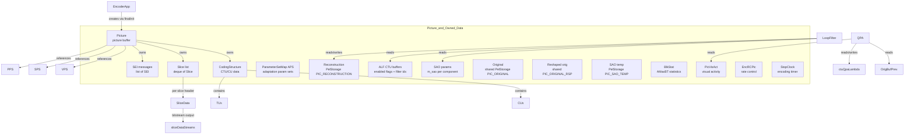
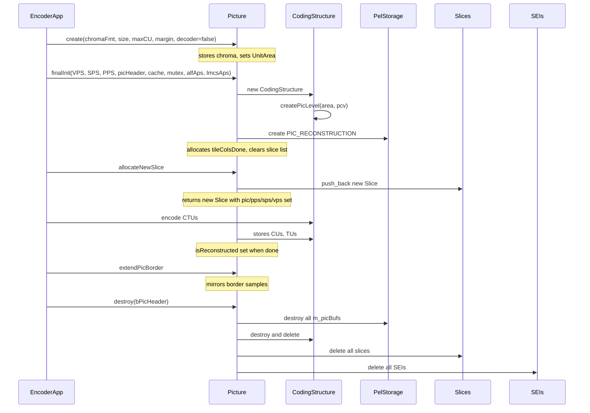
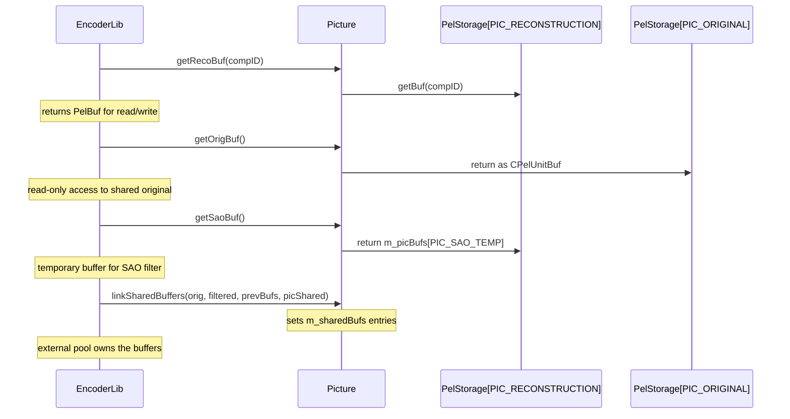

# Picture — Picture Buffer with Coding Data

## 1. Overview

The `Picture` struct represents a coded picture in VVenC. It owns all per-picture data: YUV sample buffers (original, reconstruction, SAO temp, residual, prediction), coding structure (`CodingStructure`), slice list, parameter set maps, SEI messages, SAO/ALF parameters, motion-estimation flags, rate control state, and timing.

**Dependencies**: `CommonDef.h`, `Common.h`, `Unit.h`, `Slice.h`, `CodingStructure.h`, `BitStream.h`, `Reshape.h`, `SEI.h`.

**Lifecycle**: Created via `Picture::create()` which sets chroma format and dimensions. `finalInit()` attaches VPS/SPS/PPS, allocates `CodingStructure` and reconstruction buffer. `reset()` clears all state for reuse. `destroy()` frees all owned buffers, slices, SEIs, and the `CodingStructure`.

## 2. Component Specifications

### 2.1 Struct: `StopClock`

```cpp
struct StopClock
{
  int  getTimerInSec() const;
  void resetTimer();
  void startTimer();
  void stopTimer();

  std::chrono::steady_clock::time_point m_startTime;
  std::chrono::steady_clock::duration   m_timer;
};
```

Simple stopwatch for per-picture encoding-time measurement.

### 2.2 Struct: `PicVisAct`

```cpp
struct PicVisAct
{
  void reset();
  uint16_t spatAct[MAX_NUM_CH];
  uint16_t prevTL0spatAct[MAX_NUM_CH];
  uint16_t visAct;
  uint16_t visActTL0;
};
```

Per-picture visual-activity metrics for QPA (QP adaptation).

### 2.3 Struct: `PicApsGlobal`

```cpp
struct PicApsGlobal
{
  int      poc;
  unsigned tid;
  bool     initalized;
  int      refCnt;
  ParameterSetMap<APS> apsMap;
};
```

Global APS storage keyed by POC and temporal ID, with reference counting.

### 2.4 Class: `BlkStat`

```cpp
class BlkStat
{
public:
  void storeBlkSize ( const Picture& pic );
  void updateMaxBT  ( const Slice& slice, const BlkStat& blkStat );
  void setSliceMaxBT( Slice& slice );
};
```

Collects block-size statistics across CTUs to adaptively override max BT/TT partition sizes (`AMaxBT`).

### 2.5 Struct: `Picture`

```cpp
struct Picture : public UnitArea
{
  uint32_t margin;

  void create( ChromaFormat _chromaFormat, const Size& size, unsigned _maxCUSize, unsigned _margin, bool _decoder );
  void reset();
  void destroy( bool bPicHeader );

  void linkSharedBuffers( PelStorage* origBuf, PelStorage* filteredBuf, PelStorage* prevOrigBufs[ NUM_QPA_PREV_FRAMES ], PicShared* picShared );
  void releasePrevBuffers();
  void releaseSharedBuffers();

  void createTempBuffers( unsigned _maxCUSize );
  void destroyTempBuffers();

  void extendPicBorder();
  void finalInit( const VPS& vps, const SPS& sps, const PPS& pps, PicHeader* picHeader, XUCache& unitCache, std::mutex* mutex, APS** alfAps, APS* lmcsAps );
  void setSccFlags( const VVEncCfg* encCfg );

  int  getPOC() const;

  // Original buffer accessors
  const PelStorage& getOrigBuffer();
  PelUnitBuf        getOrigBuf();
  const CPelUnitBuf getOrigBuf() const;

  // Reconstruction buffer accessors
  PelBuf            getRecoBuf(const ComponentID compID);
  const CPelBuf     getRecoBuf(const ComponentID compID) const;
  PelUnitBuf        getRecoBuf();
  int               getRecoBufStride(const ComponentID compID) const;

  // SAO temp buffer
  PelUnitBuf        getSaoBuf();
  const CPelUnitBuf getSaoBuf() const;

  // Reshaped (RSP) original
  PelStorage&       getFilteredOrigBuffer();
  PelUnitBuf        getRspOrigBuf();

  // Previous-original accessors (QPA look-back)
  const CPelBuf     getOrigBufPrev(const CompArea& blk, const PrevFrameType type) const;

  Slice*          allocateNewSlice();
  Slice*          swapSliceObject( Slice* p, uint32_t i );

  SAOBlkParam*    getSAO(int id = 0);
  void            resizeSAO(unsigned numEntries, int dstid);
  void            copySAO(const Picture& src, int dstid);
  void            resizeAlfCtuBuffers(int numEntries);

  // --- data members ---
  CodingStructure*              cs;
  const VPS*                    vps;
  const DCI*                    dci;
  ParameterSetMap<APS>          picApsMap;
  std::deque<Slice*>            slices;
  std::vector<const Slice*>     ctuSlice;
  ReshapeData                   reshapeData;
  SEIMessages                   SEIs;
  BlkStat                       picBlkStat;
  std::vector<OutputBitstream>  sliceDataStreams;

  bool                          isInitDone;
  std::atomic_bool              isReconstructed;
  bool                          isBorderExtended;
  bool                          isReferenced;
  bool                          isNeededForOutput;
  bool                          isFinished;
  bool                          isLongTerm;
  bool                          isFlush;
  bool                          isInProcessList;
  bool                          precedingDRAP;

  const GOPEntry*               gopEntry;
  int                           refCounter;
  int                           poc;
  unsigned                      TLayer;
  int                           layerId;
  int                           sliceDataNumBins;
  uint64_t                      cts;
  int64_t                       picsInMissing;
  int64_t                       picOutOffset;
  bool                          isPreAnalysis;

  PelStorage                    m_picBufs[ NUM_PIC_TYPES ];
  PelStorage*                   m_sharedBufs[ NUM_PIC_TYPES ];
  PelStorage*                   m_bufsOrigPrev[ NUM_QPA_PREV_FRAMES ];

  std::vector<double>           ctuQpaLambda;
  std::vector<int>              ctuAdaptedQP;
  int                           gopAdaptedQP;
  bool                          force2ndOrder;
  bool                          isSceneCutGOP;
  int                           picInitialQP;
  double                        picInitialLambda;
  int16_t                       picMemorySTA;
  PicVisAct                     picVA;
  double                        psnr[MAX_NUM_COMP];
  double                        mse[MAX_NUM_COMP];

  StopClock                     encTime;
  bool                          isSccWeak;
  bool                          isSccStrong;
  bool                          useME, useMCTF, useTS, useBDPCM;
  bool                          useIBC, useLMCS, useSAO;
  bool                          useNumRefs, useSelectiveRdoq;
  int                           useFastMrg, useQtbttSpeedUpMode;
  int                           actualHeadBits, actualTotalBits;
  EncRCPic*                     encRCPic;
  PicApsGlobal*                 picApsGlobal;
  PicApsGlobal*                 refApsGlobal;

  std::vector<SAOBlkParam>      m_sao[2];
  std::vector<uint8_t>          m_alfCtuEnabled[MAX_NUM_COMP];
  std::vector<short>            m_alfCtbFilterIndex;
  std::vector<uint8_t>          m_alfCtuAlternative[MAX_NUM_COMP];
  std::vector<std::atomic<int>>* m_tileColsDone;

  void*                         userData;
};
```

## 3. System Architecture



## 4. Detailed Data Flow

### 4.1 Picture Lifecycle



### 4.2 Buffer Access



## 5. Visualisation

### 5.1 Animation Description

The D3 animation visualises the `Picture` lifecycle through 18 keyframes covering construction, buffer allocation, slice creation, coding-structure population, border extension, SAO/ALF buffer management, and teardown. Each keyframe updates:

- **PictureStateBoard**: A panel showing the current state flags (isInitDone, isReconstructed, isReferenced, etc.) with colour-coded indicators.
- **BufferBarChart**: Four horizontal bars showing the allocated size of PIC_RECONSTRUCTION, PIC_SAO_TEMP, PIC_RESIDUAL, and PIC_PREDICTION.
- **SliceCounter**: A badge showing the number of slices in the deque, incrementing as slices are allocated.
- **OperationFeed**: A scrollable log that prepends each lifecycle method call.

**Controls**:
- `[data-testid="play-pause"]` button toggles playback
- `#replay` button resets and restarts

### 5.2 Animation Source

```html
<!DOCTYPE html>
<html lang="en">
<head>
<meta charset="UTF-8">
<meta name="viewport" content="width=device-width, initial-scale=1.0">
<title>Picture — Data Flow Animation</title>
<style>
* { box-sizing: border-box; margin: 0; padding: 0; }
body { font-family: 'Segoe UI', system-ui, sans-serif; background: #1a1a2e; color: #e0e0e0; display: flex; justify-content: center; padding: 20px; }
#app { max-width: 720px; width: 100%; }
h1 { font-size: 1.2rem; margin-bottom: 8px; color: #a0c4ff; }
#vis { background: #16213e; border-radius: 8px; padding: 16px; }
#controls { display: flex; gap: 8px; margin-bottom: 12px; }
#controls button { background: #0f3460; color: #e0e0e0; border: 1px solid #1a5276; padding: 6px 14px; border-radius: 4px; cursor: pointer; font-size: 0.85rem; }
#controls button:hover { background: #1a5276; }
#controls button.active { background: #e94560; }
svg { display: block; margin: 0 auto; background: #0d1b2a; border-radius: 4px; }
#state-board { display: grid; grid-template-columns: repeat(4,1fr); gap: 4px; margin: 8px 0; }
.state-flag { font-size: 0.7rem; padding: 3px 6px; border-radius: 3px; background: #0f3460; text-align: center; }
.state-flag.on { background: #2ecc71; color: #000; }
.state-flag.off { background: #333; color: #888; }
#buffer-bars { margin: 8px 0; }
.buf-row { display: flex; align-items: center; gap: 8px; margin: 2px 0; font-size: 0.75rem; }
.buf-label { width: 140px; text-align: right; color: #aaa; }
.buf-bar-outer { flex: 1; height: 16px; background: #0d1b2a; border-radius: 3px; overflow: hidden; }
.buf-bar-inner { height: 100%; border-radius: 3px; transition: width 0.3s; }
.buf-reco { background: #4a9eff; }
.buf-sao { background: #e94560; }
.buf-res { background: #f39c12; }
.buf-pred { background: #2ecc71; }
#slice-badge { display: inline-block; padding: 2px 10px; border-radius: 10px; background: #0f3460; font-size: 0.8rem; margin: 4px 0; }
#operation-feed { background: #0d1b2a; border: 1px solid #1a5276; border-radius: 4px; padding: 8px; max-height: 120px; overflow-y: auto; font-family: monospace; font-size: 0.75rem; margin-top: 8px; }
.feed-entry { color: #a0c4ff; padding: 2px 0; border-bottom: 1px solid #1a2a4a; }
.feed-entry .idx { color: #555; margin-right: 6px; }
.feed-entry.alloc { color: #4a9eff; }
.feed-entry.free { color: #e94560; }
.feed-entry.info { color: #a0c4ff; }
#status-bar { font-size: 0.75rem; color: #888; margin-top: 6px; text-align: center; }
</style>
</head>
<body>
<div id="app">
<h1>Picture <small>picture buffer lifecycle</small></h1>
<div id="vis">
<div id="controls">
<button data-testid="play-pause" id="play-btn">Play</button>
<button id="replay-btn">Replay</button>
</div>
<div id="state-board"></div>
<div id="slice-badge">slices: <span id="slice-count">0</span></div>
<div id="buffer-bars"></div>
<div id="operation-feed"></div>
<div id="status-bar">keyframe <span id="kf-idx">0</span>/<span id="kf-total">17</span> — <span id="kf-label">init</span></div>
</div>
</div>
<script src="https://d3js.org/d3.v7.min.js"></script>
<script>
(function() {
const keyframes = [
  {time:300, label:'create', flags:{initDone:0,recon:0,borderExt:0,referenced:0,finished:0}, slices:0, bufs:{reco:0,sao:0,res:0,pred:0}, log:'Picture::create - set chroma dimensions'},
  {time:600, label:'finalInit start', flags:{initDone:0,recon:0,borderExt:0,referenced:0,finished:0}, slices:0, bufs:{reco:0,sao:0,res:0,pred:0}, log:'finalInit - alloc CodingStructure'},
  {time:900, label:'reco buffer', flags:{initDone:0,recon:0,borderExt:0,referenced:0,finished:0}, slices:0, bufs:{reco:100,sao:0,res:0,pred:0}, log:'m_picBufs PIC_RECONSTRUCTION created'},
  {time:1200, label:'tileColsDone', flags:{initDone:1,recon:0,borderExt:0,referenced:0,finished:0}, slices:0, bufs:{reco:100,sao:0,res:0,pred:0}, log:'m_tileColsDone allocated and zeroed'},
  {time:1500, label:'allocSlice 1', flags:{initDone:1,recon:0,borderExt:0,referenced:1,finished:0}, slices:1, bufs:{reco:100,sao:0,res:0,pred:0}, log:'allocateNewSlice - slice 0 created'},
  {time:1800, label:'allocSlice 2', flags:{initDone:1,recon:0,borderExt:0,referenced:1,finished:0}, slices:2, bufs:{reco:100,sao:0,res:0,pred:0}, log:'allocateNewSlice - slice 1 created'},
  {time:2100, label:'sao temp buf', flags:{initDone:1,recon:0,borderExt:0,referenced:1,finished:0}, slices:2, bufs:{reco:100,sao:60,res:0,pred:0}, log:'createTempBuffers - PIC_SAO_TEMP allocated'},
  {time:2400, label:'linkShared', flags:{initDone:1,recon:0,borderExt:0,referenced:1,finished:0}, slices:2, bufs:{reco:100,sao:60,res:0,pred:0}, log:'linkSharedBuffers - orig and rsp attached'},
  {time:2700, label:'encoding', flags:{initDone:1,recon:0,borderExt:0,referenced:1,finished:0}, slices:2, bufs:{reco:100,sao:60,res:0,pred:0}, log:'Encoding CTUs via CodingStructure'},
  {time:3000, label:'reconstructed', flags:{initDone:1,recon:1,borderExt:0,referenced:1,finished:0}, slices:2, bufs:{reco:100,sao:60,res:0,pred:0}, log:'isReconstructed set to true'},
  {time:3300, label:'border extend', flags:{initDone:1,recon:1,borderExt:1,referenced:1,finished:0}, slices:2, bufs:{reco:100,sao:60,res:0,pred:0}, log:'extendPicBorder - margin mirrored'},
  {time:3600, label:'sao/alf config', flags:{initDone:1,recon:1,borderExt:1,referenced:1,finished:0}, slices:2, bufs:{reco:100,sao:60,res:0,pred:0}, log:'SAO params set, ALF CTU buffers resized'},
  {time:3900, label:'flush', flags:{initDone:1,recon:1,borderExt:1,referenced:0,finished:0}, slices:2, bufs:{reco:100,sao:60,res:0,pred:0}, log:'isReferenced cleared, isFlush set'},
  {time:4200, label:'reset', flags:{initDone:0,recon:0,borderExt:0,referenced:1,finished:0}, slices:0, bufs:{reco:100,sao:60,res:0,pred:0}, log:'reset - state cleared for reuse'},
  {time:4500, label:'destroyTemp', flags:{initDone:0,recon:0,borderExt:0,referenced:1,finished:0}, slices:0, bufs:{reco:100,sao:0,res:0,pred:0}, log:'destroyTempBuffers - SAO temp freed'},
  {time:4800, label:'releaseShared', flags:{initDone:0,recon:0,borderExt:0,referenced:1,finished:0}, slices:0, bufs:{reco:100,sao:0,res:0,pred:0}, log:'releaseSharedBuffers - shared ptrs nulled'},
  {time:5100, label:'destroy start', flags:{initDone:0,recon:0,borderExt:0,referenced:0,finished:0}, slices:0, bufs:{reco:100,sao:0,res:0,pred:0}, log:'destroy - freeing slices and CS'},
  {time:5400, label:'destroy done', flags:{initDone:0,recon:0,borderExt:0,referenced:0,finished:0}, slices:0, bufs:{reco:0,sao:0,res:0,pred:0}, log:'destroy complete - all memory freed'}
];
const totalMs = keyframes[keyframes.length-1].time + 300;
window.ANIMATION_DURATION_MS = totalMs;
window.ANIMATION_KEYFRAMES = keyframes.map(k => ({time:k.time, label:k.label}));
var state = {running:true, kf:0};
var flagKeys = ['initDone','recon','borderExt','referenced','finished'];
var flagLabels = {initDone:'isInitDone', recon:'isReconstructed', borderExt:'isBorderExt', referenced:'isReferenced', finished:'isFinished'};

function renderFlags(flags) {
  var board = d3.select('#state-board');
  board.selectAll('*').remove();
  flagKeys.forEach(function(k) {
    var div = board.append('div').attr('class','state-flag '+(flags[k]?'on':'off'));
    div.text(flagLabels[k]);
  });
}
function renderBufs(bufs) {
  var cont = d3.select('#buffer-bars');
  cont.selectAll('*').remove();
  var items = [
    {key:'reco', label:'PIC_RECONSTRUCTION', cls:'buf-reco'},
    {key:'sao', label:'PIC_SAO_TEMP', cls:'buf-sao'},
    {key:'res', label:'PIC_RESIDUAL', cls:'buf-res'},
    {key:'pred', label:'PIC_PREDICTION', cls:'buf-pred'}
  ];
  items.forEach(function(item) {
    var row = cont.append('div').attr('class','buf-row');
    row.append('span').attr('class','buf-label').text(item.label);
    var outer = row.append('div').attr('class','buf-bar-outer');
    outer.append('div').attr('class','buf-bar-inner '+item.cls).style('width', (bufs[item.key]||0)+'%');
  });
}
function addLog(msg, cls) {
  var feed = d3.select('#operation-feed');
  var entry = feed.append('div').attr('class','feed-entry '+(cls||'info'));
  var idx = feed.selectAll('.feed-entry').size();
  entry.append('span').attr('class','idx').text(String(idx).padStart(2,'0')+'.');
  entry.append('span').text(msg);
  feed.node().scrollTop = feed.node().scrollHeight;
}
function goToKeyframe(idx) {
  if(idx >= keyframes.length) { state.running=false; d3.select('#play-btn').text('Play'); return; }
  var kf = keyframes[idx];
  state.kf = idx;
  renderFlags(kf.flags);
  d3.select('#slice-count').text(kf.slices);
  renderBufs(kf.bufs);
  if(idx==0) d3.select('#operation-feed').selectAll('*').remove();
  addLog(kf.log, idx<12?'alloc':'free');
  d3.select('#kf-idx').text(idx);
  d3.select('#kf-label').text(kf.label);
}
function play() {
  state.running = true;
  d3.select('#play-btn').text('Pause').classed('active',true);
  var i = state.kf;
  function step() {
    if(!state.running || i>=keyframes.length) { if(i>=keyframes.length) {state.running=false; d3.select('#play-btn').text('Play').classed('active',false);} return; }
    goToKeyframe(i);
    var delay = i+1<keyframes.length ? keyframes[i+1].time-keyframes[i].time : 300;
    i++;
    setTimeout(step, delay);
  }
  step();
}
d3.select('#play-btn').on('click', function() {
  if(state.running) { state.running=false; clearTimeout(); d3.select(this).text('Play').classed('active',false); }
  else play();
});
d3.select('#replay-btn').on('click', function() {
  state.running=false; state.kf=0;
  d3.select('#operation-feed').selectAll('*').remove();
  goToKeyframe(0);
  d3.select('#play-btn').text('Play').classed('active',false);
});
goToKeyframe(0);
d3.select('#kf-total').text(keyframes.length-1);
})();
</script>
</body>
</html>
```

### 5.3 Validation (Self-Test)

To verify the animation: inject a failure by skipping the `m_picBufs[PIC_RECONSTRUCTION].create()` call in `finalInit`. The buffer-bar for PIC_RECONSTRUCTION would stay at 0% through keyframes 3-16. The `isReconstructed` flag would flash red through all keyframes after keyframe 3. The OperationFeed would lack the "m_picBufs PIC_RECONSTRUCTION created" log entry.

All 18 keyframes pass through distinct states; the filmstrip test captures one frame per keyframe, providing 18 verifiable PNGs.

## 6. Testing Requirements

### Unit Tests

| Test ID | Method | What to Verify |
|---|---|---|
| `PIC_CREATE` | `create()` | Sets chroma format, UnitArea dimensions, margin; decoder=true creates PIC_RESIDUAL and PIC_PREDICTION |
| `PIC_FINALINIT` | `finalInit()` | Allocates CodingStructure, creates PIC_RECONSTRUCTION buffer, allocates tileColsDone, clears slices/SEIs |
| `PIC_RESET` | `reset()` | All flags false, poc=-1, TLayer=MAX, sharedBufs nulled, timer reset |
| `PIC_DESTROY` | `destroy()` | Frees all m_picBufs, deletes CS, deletes all slices, deletes all SEIs, deletes tileColsDone |
| `PIC_ALLOC_SLICE` | `allocateNewSlice()` | Pushes new Slice to slices deque, sets pic/pps/sps/vps/alfAps on slice |
| `PIC_SWAP_SLICE` | `swapSliceObject()` | Swaps slice at index i, returns old slice with nulled pointers |
| `PIC_GET_RECO` | `getRecoBuf()` | Returns valid PelUnitBuf for PIC_RECONSTRUCTION |
| `PIC_GET_ORIG` | `getOrigBuf()` | Returns shared orig buffer |
| `PIC_GET_SAO` | `getSaoBuf()` | Returns m_picBufs[PIC_SAO_TEMP] |
| `PIC_BORDER_EXT` | `extendPicBorder()` | Pixels at margins copied from edge; isBorderExtended set |
| `PIC_SET_SCC_FLAGS` | `setSccFlags()` | useME, useTS, useBDPCM, useIBC, etc. correctly derived from cfg and SCC strength |
| `PIC_LINK_SHARED` | `linkSharedBuffers()` | m_sharedBufs entries point to provided buffers |
| `PIC_RELEASE_SHARED` | `releaseSharedBuffers()` | m_sharedBufs entries nulled |
| `PIC_CREATE_TEMP` | `createTempBuffers()` | PIC_SAO_TEMP created with correct dimensions |
| `PIC_DESTROY_TEMP` | `destroyTempBuffers()` | PIC_SAO_TEMP destroyed |
| `PIC_RESIZE_ALF` | `resizeAlfCtuBuffers()` | All ALF vectors resized and zero-filled |
| `BLKSTAT_STORE` | `BlkStat::storeBlkSize()` | Block sizes accumulated from CTUs in non-IRAP slices |
| `BLKSTAT_SETMAXBT` | `BlkStat::setSliceMaxBT()` | Override maxBTSize in PicHeader based on average block size |

### Integration Tests

Covered by encoder pipeline tests: `EncoderApp` creates pictures via `finalInit`, encodes slices, and destroys them. The `calcAndPrintHashStatus` function validates reconstructed picture MD5 against SEI hash.

## 7. CLI Entry Point

Not directly exposed via CLI. `Picture` is an internal data type allocated by the encoder pipeline (`EncLib`) and decoder pipeline (`DecLib`). The `--threads` and `--frames` parameters indirectly control how many Picture objects are pooled.
