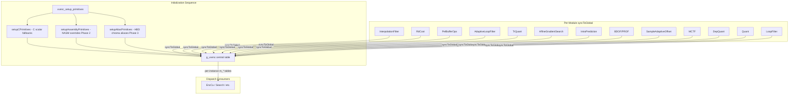
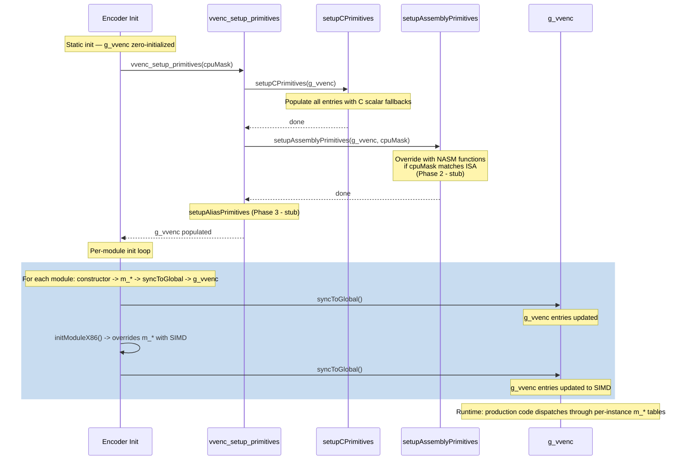

# Primitives — Centralized SIMD/Primitive Dispatch Table

## 1. Overview

The `Primitives` module provides a single global dispatch table (`g_vvenc`) that consolidates all CPU-intensive function pointers into one `VVencPrimitive` struct. This centralizes the 17 per-module function pointer initialization paths (`init*X86()` functions in `InitX86.cpp`) into one setup chain:

```
vvenc_setup_primitives(cpuMask)
  → setupCPrimitives(g_vvenc)                // C scalar fallbacks
  → setupAssemblyPrimitives(g_vvenc, cpuMask) // NASM overrides (Phase 2)
  → setupAliasPrimitives(g_vvenc)             // HBD/chroma aliases (Phase 3)
```

**Dependencies**: `CommonDef.h`, `Common.h`, and all module headers whose function pointer types appear in `VVencPrimitive` (InterpolationFilter, RdCost, Buffer, AdaptiveLoopFilter, TrQuant, AffineGradientSearch, IntraPrediction, InterPrediction, SampleAdaptiveOffset, MCTF, DepQuant, Quant, LoopFilter).

**Lifecycle**: `g_vvenc` is zero-initialized at static init time. Per-module constructors populate per-instance `m_*` tables and call `syncToGlobal()` which copies to `g_vvenc`. Module init functions (e.g., `initInterpolationFilter(true)`) override per-instance tables with SIMD versions and call `syncToGlobal()` again. Assembly registration (Phase 2) overrides directly through `setupAssemblyPrimitives()`.

## 2. Component Specifications

### 2.1 Struct: `VVencPrimitive`

```cpp
#pragma once
#include "CommonDef.h"
#include "Common.h"

template<typename T> struct AreaBuf;
template<typename T> struct UnitBuf;
namespace vvenc {

class DistParam;
class AlfClassifier;
struct AlfFilterShape;
namespace DQIntern {
  enum ScanPosType : int8_t;
  struct ScanInfo;
  struct TUParameters;
  struct PQData;
  struct Decisions;
  struct StateMem;
  struct CommonCtx;
}

const int VVENC_DF_TOTAL_FUNCTIONS = 34;

struct VVencPrimitive
{
  struct InterpFilter {
    void (*filterN2_2D)(const ClpRng&, Pel const*, int, Pel*, int, int, int, TFilterCoeff const*, TFilterCoeff const*);
    void (*filterHor[4][2][2])(const ClpRng&, Pel const*, int, Pel*, int, int, int, TFilterCoeff const*);
    void (*filterVer[4][2][2])(const ClpRng&, Pel const*, int, Pel*, int, int, int, TFilterCoeff const*);
    void (*filterCopy[2][2])(const ClpRng&, Pel const*, int, Pel*, int, int, int, bool);
    void (*filter4x4[2][2])(const ClpRng&, Pel const*, int, Pel*, int, int, int, TFilterCoeff const*, TFilterCoeff const*);
    void (*filter8xH[3][2])(const ClpRng&, Pel const*, int, Pel*, int, int, int, TFilterCoeff const*, TFilterCoeff const*);
    void (*filter16xH[3][2])(const ClpRng&, Pel const*, int, Pel*, int, int, int, TFilterCoeff const*, TFilterCoeff const*);
  } interp;

  struct DistortionTable {
    Distortion (*afpDistortFunc[2][VVENC_DF_TOTAL_FUNCTIONS])(const DistParam&);
    void       (*afpDistortFuncX5[2])(const DistParam&, Distortion*, bool);
  } dist;

  struct PelBufOps {
    void (*addAvg)(const Pel*, const Pel*, Pel*, int, unsigned, int, const ClpRng&);
    void (*reco)(const Pel*, const Pel*, Pel*, int, const ClpRng&);
    void (*copyClip)(const Pel*, Pel*, int, const ClpRng&);
    void (*copyBuffer)(const char*, int, char*, int, int, int);
    void (*roundIntVector)(int*, int, unsigned int, const int);
    uint64_t (*AvgHighPass)(int, int, const Pel*, int);
    uint64_t (*AvgHighPassWithDownsampling)(int, int, const Pel*, int);
  } pelbuf;

  struct AlfOps {
    void (*deriveClassificationBlk)(AlfClassifier*, const AreaBuf<const Pel>&, const Area&, const Area&, int, int, int);
    void (*filterCcAlf)(const AreaBuf<Pel>&, const UnitBuf<const Pel>&, const Area&, const Area&, const AlfFilterShape&, const short*, const int*);
    void (*filter5x5Blk[2])(const AlfClassifier*, const UnitBuf<Pel>&, const UnitBuf<const Pel>&, const Area&, int);
    void (*filter7x7Blk[2])(const AlfClassifier*, const UnitBuf<Pel>&, const UnitBuf<const Pel>&, const Area&, int);
  } alf;

  struct TrQuantOps {
    void (*fwdLfnstNxN)(int*, int*, uint32_t, uint32_t, uint32_t, int);
    void (*invLfnstNxN)(int*, int*, uint32_t, uint32_t, uint32_t, int);
    void (*fwdICT)(AreaBuf<Pel>&, AreaBuf<Pel>&);
    void (*invICT)(AreaBuf<Pel>&, AreaBuf<Pel>&);
    void (*fastFwdCore_2D[5])(const TMatrixCoeff*, const TCoeff*, TCoeff*, unsigned, unsigned, unsigned, int);
    void (*fastInvCore[5])(const TMatrixCoeff*, const TCoeff*, TCoeff*, unsigned, unsigned, unsigned);
    void (*roundClip8)(TCoeff*, unsigned, unsigned, unsigned, const TCoeff, const TCoeff, const TCoeff, const TCoeff);
    void (*roundClip4)(TCoeff*, unsigned, unsigned, unsigned, const TCoeff, const TCoeff, const TCoeff, const TCoeff);
  } tr;

  struct AffineOps {
    void (*horizontalSobelFilter)(Pel*, int, Pel*, int, int, int);
    void (*verticalSobelFilter)(Pel*, int, Pel*, int, int, int);
    void (*equalCoeffComputer[2])(Pel*, int, Pel**, int, int, int, int64_t(*)[7]);
  } affine;

  struct IntraOps {
    void (*angleLuma)(Pel*, ptrdiff_t, Pel*, int, int, int, int, const TFilterCoeff*, bool, const ClpRng&);
    void (*angleChroma)(Pel*, ptrdiff_t, Pel*, int, int, int, int);
    void (*anglePDPC)(Pel*, int, Pel*, int, int, int, int);
    void (*horVerPDPC)(Pel*, int, Pel*, int, int, int, const Pel*, const ClpRng&);
    void (*sampleFilter)(AreaBuf<Pel>&, const AreaBuf<const Pel>&);
    void (*intraPlanar)(AreaBuf<Pel>&, const AreaBuf<const Pel>&);
  } intra;

  struct BdofOps {
    void (*biDirOptFlow)(const Pel*, const Pel*, const Pel*, const Pel*, const Pel*, const Pel*, int, int, Pel*, ptrdiff_t, int, int, int, const ClpRng&, int);
    void (*bdofGradFilter)(const Pel*, int, int, int, int, Pel*, Pel*, int);
    void (*profGradFilter)(const Pel*, int, int, int, int, Pel*, Pel*, int);
    void (*applyProf)(Pel*, int, const Pel*, int, int, int, const Pel*, const Pel*, int, const int*, const int*, int, const bool&, int, Pel, const ClpRng&);
    void (*padDmvr)(const Pel*, int, Pel*, int, int, int, int);
  } bdof;

  struct SaoOps {
    void (*offsetBlock)(int, int, int, int, Pel*, Pel*, int, int, int64_t*, int64_t*);
    void (*calcEo0)(int, int, int, int, Pel*, Pel*, int, int, int64_t*, int64_t*);
    void (*calcEo90)(int, int, int, int, Pel*, Pel*, int, int, int64_t*, int64_t*, int8_t*);
    void (*calcEo135)(int, int, int, int, Pel*, Pel*, int, int, int64_t*, int64_t*, int8_t*, int8_t*);
    void (*calcEo45)(int, int, int, int, Pel*, Pel*, int, int, int64_t*, int64_t*, int8_t*);
  } sao;

  struct MctfOps {
    int (*motionErrorLumaIntX)(const Pel*, ptrdiff_t, const Pel*, ptrdiff_t, int, int, int);
    int (*motionErrorLumaInt8)(const Pel*, ptrdiff_t, const Pel*, ptrdiff_t, int, int, int);
  } mctf;

  struct DqOps {
    void (*checkAllRdCosts)(DQIntern::ScanPosType, const DQIntern::PQData*, DQIntern::Decisions&, const DQIntern::StateMem&);
    void (*checkAllRdCostsOdd1)(DQIntern::ScanPosType, int64_t, int64_t, DQIntern::Decisions&, const DQIntern::StateMem&);
    void (*updateStates)(const DQIntern::ScanInfo&, const DQIntern::Decisions&, DQIntern::StateMem&);
    void (*updateStatesEOS)(const DQIntern::ScanInfo&, const DQIntern::Decisions&, const DQIntern::StateMem&, DQIntern::StateMem&, DQIntern::CommonCtx&);
    void (*findFirstPos)(int&, const TCoeff*, const DQIntern::TUParameters&, int, bool, int, int);
  } dq;

  struct QuantOps {
    void (*xDeQuant)(int, int, int, const TCoeffSig*, size_t, TCoeff*, int, int, const TCoeff);
    void (*xQuant)(int, int, int, int, int, bool, int);
  } quant;

  struct LfOps {
    void (*pelFilterLuma)(Pel*, ptrdiff_t, ptrdiff_t, int, bool, int, bool, bool, const ClpRng&);
    void (*filterPandQ)(Pel*, ptrdiff_t, ptrdiff_t, int, int, int);
  } lf;
};

extern VVencPrimitive g_vvenc;

void vvenc_setup_primitives(int cpuMask);
void setupCPrimitives(VVencPrimitive& p);
void setupAssemblyPrimitives(VVencPrimitive& p, int cpuMask);
void setupAliasPrimitives(VVencPrimitive& p);

} // namespace vvenc
```

## 3. Dispatch Table Catalog

This section lists every function pointer entry in `g_vvenc`, its C scalar fallback, intrinsic SIMD override, and future NASM assembly name.

### 3.1 interp — InterpolationFilter (~3.0% perf)

Source: `InterpolationFilter.h/.cpp` | X86 Init: `InterpolationFilterX86.h`

| `g_vvenc` path | Dispatch site | C scalar | Intrinsic (ISA) | NASM | Source member |
|---|---|---|---|---|---|
| `interp.filterN2_2D` | `filterN2_2D()` | `scalarFilterN2_2D` | `(same)` | — | `m_filterN2_2D` |
| `interp.filterHor[0][0][0]` | `filterHor()` | `filter<8,false,false,false>` | `(same)` | — | `m_filterHor[0][0][0]` |
| `interp.filterHor[0][0][1]` | ↑ | `filter<8,false,false,true>` | `(same)` | — | `m_filterHor[0][0][1]` |
| `interp.filterHor[0][1][0]` | ↑ | `filter<8,false,true,false>` | `(same)` | — | `m_filterHor[0][1][0]` |
| `interp.filterHor[0][1][1]` | ↑ | `filter<8,false,true,true>` | `(same)` | — | `m_filterHor[0][1][1]` |
| `interp.filterHor[1][0][0]` | ↑ | `filter<4,false,false,false>` | `(same)` | — | `m_filterHor[1][0][0]` |
| `interp.filterHor[1][0][1]` | ↑ | `filter<4,false,false,true>` | `(same)` | — | `m_filterHor[1][0][1]` |
| `interp.filterHor[1][1][0]` | ↑ | `filter<4,false,true,false>` | `(same)` | — | `m_filterHor[1][1][0]` |
| `interp.filterHor[1][1][1]` | ↑ | `filter<4,false,true,true>` | `(same)` | — | `m_filterHor[1][1][1]` |
| `interp.filterHor[2][0][0]` | ↑ | `filter<2,false,false,false>` | `(same)` | — | `m_filterHor[2][0][0]` |
| `interp.filterHor[2][1][0]` | ↑ | `filter<2,false,true,false>` | `(same)` | — | `m_filterHor[2][1][0]` |
| `interp.filterHor[3][0][0]` | ↑ | `filter<6,false,false,false>` | `(same)` | — | `m_filterHor[3][0][0]` |
| `interp.filterHor[3][1][0]` | ↑ | `filter<6,false,true,false>` | `(same)` | — | `m_filterHor[3][1][0]` |
| `interp.filterVer[0][0][0]` | `filterVer()` | `filter<8,true,false,false>` | `(same)` | — | `m_filterVer[0][0][0]` |
| `interp.filterVer[0][1][0]` | ↑ | `filter<8,true,true,false>` | `(same)` | — | `m_filterVer[0][1][0]` |
| `interp.filterVer[1][0][0]` | ↑ | `filter<4,true,false,false>` | `(same)` | — | `m_filterVer[1][0][0]` |
| `interp.filterVer[1][1][0]` | ↑ | `filter<4,true,true,false>` | `(same)` | — | `m_filterVer[1][1][0]` |
| `interp.filterVer[2][0][0]` | ↑ | `filter<2,true,false,false>` | `(same)` | — | `m_filterVer[2][0][0]` |
| `interp.filterVer[3][0][0]` | ↑ | `filter<6,true,false,false>` | `(same)` | — | `m_filterVer[3][0][0]` |
| `interp.filterCopy[0][0]` | `filterHor/Ver()` | `filterCopy<false,false>` | `(same)` | — | `m_filterCopy[0][0]` |
| `interp.filterCopy[1][0]` | ↑ | `filterCopy<true,false>` | `(same)` | — | `m_filterCopy[1][0]` |
| `interp.filter4x4[0][0]` | `filter4x4()` | `filterWxH_N8<false,4>` | `(same)` | — | `m_filter4x4[0][0]` |
| `interp.filter4x4[0][1]` | ↑ | `filterWxH_N8<true,4>` | `(same)` | — | `m_filter4x4[0][1]` |
| `interp.filter4x4[1][0]` | ↑ | `filterWxH_N4<false,4>` | `(same)` | — | `m_filter4x4[1][0]` |
| `interp.filter4x4[1][1]` | ↑ | `filterWxH_N4<true,4>` | `(same)` | — | `m_filter4x4[1][1]` |
| `interp.filter8xH[0][0]` | `filter8xH()` | `filterWxH_N8<false,8>` | `(same)` | — | `m_filter8xH[0][0]` |
| `interp.filter8xH[0][1]` | ↑ | `filterWxH_N8<true,8>` | `(same)` | — | `m_filter8xH[0][1]` |
| `interp.filter8xH[1][0]` | ↑ | `filterWxH_N4<false,8>` | `(same)` | — | `m_filter8xH[1][0]` |
| `interp.filter16xH[0][0]` | `filter16xH()` | `filterWxH_N8<false,16>` | `(same)` | — | `m_filter16xH[0][0]` |
| `interp.filter16xH[0][1]` | ↑ | `filterWxH_N8<true,16>` | `(same)` | — | `m_filter16xH[0][1]` |
| `interp.filter16xH[1][0]` | ↑ | `filterWxH_N4<false,16>` | `(same)` | — | `m_filter16xH[1][0]` |
| `interp.filter16xH[1][1]` | ↑ | `filterWxH_N4<true,16>` | `(same)` | — | `m_filter16xH[1][1]` |

### 3.2 dist — RdCost (~8.6% perf)

Source: `RdCost.h/.cpp` | X86 Init: `RdCostX86.h` | **Note**: struct declared but `syncToGlobal()` not yet wired.

| `g_vvenc` path | Dispatch site | C scalar | Intrinsic (ISA) | NASM | Source member |
|---|---|---|---|---|---|
| `dist.afpDistortFunc[0][DF_SSE]` | `getDistPart(SSE)` | `xGetSSE` | `xGetSSE_SIMD<vext>` | — | `m_afpDistortFunc[0][DF_SSE]` |
| `dist.afpDistortFunc[0][DF_SSE4]` | ↑ | `xGetSSE4` | `xGetSSE_NxN_SIMD<4,vext>` | — | `m_afpDistortFunc[0][DF_SSE4]` |
| `dist.afpDistortFunc[0][DF_SSE8]` | ↑ | `xGetSSE8` | `xGetSSE_NxN_SIMD<8,vext>` | — | `m_afpDistortFunc[0][DF_SSE8]` |
| `dist.afpDistortFunc[0][DF_SSE16]` | ↑ | `xGetSSE16` | `xGetSSE_NxN_SIMD<16,vext>` | — | `m_afpDistortFunc[0][DF_SSE16]` |
| `dist.afpDistortFunc[0][DF_SSE32]` | ↑ | `xGetSSE32` | `xGetSSE_NxN_SIMD<32,vext>` | — | `m_afpDistortFunc[0][DF_SSE32]` |
| `dist.afpDistortFunc[0][DF_SSE64]` | ↑ | `xGetSSE64` | `xGetSSE_NxN_SIMD<64,vext>` | — | `m_afpDistortFunc[0][DF_SSE64]` |
| `dist.afpDistortFunc[0][DF_SSE128]` | ↑ | `xGetSSE128` | `xGetSSE_NxN_SIMD<128,vext>` | — | `m_afpDistortFunc[0][DF_SSE128]` |
| `dist.afpDistortFunc[0][DF_SAD]` | `getDistPart(SAD)` | `xGetSAD` | `xGetSAD_SIMD<vext>` | — | `m_afpDistortFunc[0][DF_SAD]` |
| `dist.afpDistortFunc[0][DF_SAD4]` | ↑ | `xGetSAD4` | `xGetSAD_NxN_SIMD<4,vext>` | — | `m_afpDistortFunc[0][DF_SAD4]` |
| `dist.afpDistortFunc[0][DF_SAD8]` | ↑ | `xGetSAD8` | `xGetSAD_NxN_SIMD<8,vext>` | — | `m_afpDistortFunc[0][DF_SAD8]` |
| `dist.afpDistortFunc[0][DF_SAD16]` | ↑ | `xGetSAD16` | `xGetSAD_NxN_SIMD<16,vext>` | — | `m_afpDistortFunc[0][DF_SAD16]` |
| `dist.afpDistortFunc[0][DF_SAD32]` | ↑ | `xGetSAD32` | `xGetSAD_NxN_SIMD<32,vext>` | — | `m_afpDistortFunc[0][DF_SAD32]` |
| `dist.afpDistortFunc[0][DF_SAD64]` | ↑ | `xGetSAD64` | `xGetSAD_NxN_SIMD<64,vext>` | — | `m_afpDistortFunc[0][DF_SAD64]` |
| `dist.afpDistortFunc[0][DF_HAD]` | `getDistPart(HAD)` | `xGetHADs<false>` | `xGetHADs_SIMD<vext,false>` | — | `m_afpDistortFunc[0][DF_HAD]` |
| `dist.afpDistortFunc[0][DF_HAD_fast]` | ↑ | `xGetHADs<true>` | `xGetHADs_SIMD<vext,true>` | — | `m_afpDistortFunc[0][DF_HAD_fast]` |
| `dist.afpDistortFunc[0][DF_HAD_2SAD]` | ↑ | `xGetHAD2SADs` | `xGetHAD2SADs_SIMD<vext>` | — | `m_afpDistortFunc[0][DF_HAD_2SAD]` |
| `dist.afpDistortFunc[0][DF_SAD_WITH_MASK]` | ↑ | `xGetSADwMask` | `xGetSADwMask_SIMD<vext>` | — | `m_afpDistortFunc[0][DF_SAD_WITH_MASK]` |
| `dist.afpDistortFunc[1][*]` | (mirror of [0]) | (memcpy from [0]) | (same) | — | `m_afpDistortFunc[1][*]` |
| `dist.afpDistortFuncX5[0]` | DMVR | `xGetSAD8X5` | `xGetSADX5_8xN_SIMD<vext>` | — | `m_afpDistortFuncX5[0]` |
| `dist.afpDistortFuncX5[1]` | DMVR | `xGetSAD16X5` | `xGetSADX5_16xN_SIMD<vext>` | — | `m_afpDistortFuncX5[1]` |

### 3.3 pelbuf — PelBufferOps (<1% perf)

Source: `Buffer.h/.cpp` | X86 Init: `BufferX86.h` | **Note**: struct declared but `syncToGlobal()` not yet wired.

| `g_vvenc` path | Dispatch site | C scalar | Intrinsic (ISA) | NASM | Source member |
|---|---|---|---|---|---|
| `pelbuf.addAvg` | `addAvg()` | — | `(same)` | — | `g_pelBufOP.addAvg` |
| `pelbuf.reco` | `reconstruct()` | — | `(same)` | — | `g_pelBufOP.reco` |
| `pelbuf.copyClip` | `copyClip()` | — | `(same)` | — | `g_pelBufOP.copyClip` |
| `pelbuf.copyBuffer` | `copyFrom()` | — | `(same)` | — | `g_pelBufOP.copyBuffer` |
| `pelbuf.roundIntVector` | internal | — | `(same)` | — | `g_pelBufOP.roundIntVector` |
| `pelbuf.AvgHighPass` | AvgHighPass | — | `(same)` | — | `g_pelBufOP.AvgHighPass` |
| `pelbuf.AvgHighPassWithDownsampling` | ↑ | — | `(same)` | — | `g_pelBufOP.AvgHighPassWithDownsampling` |

### 3.4 alf — AdaptiveLoopFilter (~3.0% perf)

Source: `AdaptiveLoopFilter.h/.cpp` | X86 Init: `AdaptiveLoopFilterX86.h`

| `g_vvenc` path | Dispatch site | C scalar | Intrinsic (ISA) | NASM | Source member |
|---|---|---|---|---|---|
| `alf.deriveClassificationBlk` | pre-ALF analysis | — | `(same)` | — | `m_deriveClassificationBlk` |
| `alf.filterCcAlf` | CC-ALF | — | `(same)` | — | `m_filterCcAlf` |
| `alf.filter5x5Blk[0]` | ALF filter 5x5 | — | `(same)` | — | `m_filter5x5Blk[0]` |
| `alf.filter5x5Blk[1]` | ↑ | — | `(same)` | — | `m_filter5x5Blk[1]` |
| `alf.filter7x7Blk[0]` | ALF filter 7x7 | — | `(same)` | — | `m_filter7x7Blk[0]` |
| `alf.filter7x7Blk[1]` | ↑ | — | `(same)` | — | `m_filter7x7Blk[1]` |

### 3.5 tr — TrQuant + TCoeffOps (~1.6% perf)

Source: `TrQuant.h/.cpp`, `TrQuant_EMT.h` | X86 Init: `TrafoX86.h`

| `g_vvenc` path | Dispatch site | C scalar | Intrinsic (ISA) | NASM | Source member |
|---|---|---|---|---|---|
| `tr.fwdLfnstNxN` | LFNST forward | — | `(same)` | — | `m_fwdLfnstNxN` |
| `tr.invLfnstNxN` | LFNST inverse | — | `(same)` | — | `m_invLfnstNxN` |
| `tr.fwdICT` | ICT forward | — | `(same)` | — | `m_fwdICT` (double ptr) |
| `tr.invICT` | ICT inverse | — | `(same)` | — | `m_invICT` (double ptr) |
| `tr.fastFwdCore_2D[0..4]` | DCT forward | `fastFwdCore_2D_C` | `(same)` | — | `g_tCoeffOps.fastFwdCore_2D[0..4]` |
| `tr.fastInvCore[0..4]` | DCT inverse | `fastInvCore_C` | `(same)` | — | `g_tCoeffOps.fastInvCore[0..4]` |
| `tr.roundClip8` | coeff rounding | — | `(same)` | — | `g_tCoeffOps.roundClip8` |
| `tr.roundClip4` | coeff rounding | — | `(same)` | — | `g_tCoeffOps.roundClip4` |

### 3.6 affine — AffineGradientSearch (~1.5% perf)

Source: `AffineGradientSearch.h/.cpp` | X86 Init: `AffineGradientSearchX86.h`

| `g_vvenc` path | Dispatch site | C scalar | Intrinsic (ISA) | NASM | Source member |
|---|---|---|---|---|---|
| `affine.horizontalSobelFilter` | affine ME | — | `simdHorizontalSobelFilter<vext>` | — | `m_HorizontalSobelFilter` |
| `affine.verticalSobelFilter` | affine ME | — | `simdVerticalSobelFilter<vext>` | — | `m_VerticalSobelFilter` |
| `affine.equalCoeffComputer[0]` | affine ME | — | `simdEqualCoeffComputer<true>` | — | `m_EqualCoeffComputer[0]` |
| `affine.equalCoeffComputer[1]` | affine ME | — | `simdEqualCoeffComputer<false>` | — | `m_EqualCoeffComputer[1]` |

### 3.7 intra — IntraPrediction (~2.4% perf)

Source: `IntraPrediction.h/.cpp` | X86 Init: `IntraPredX86.h`

| `g_vvenc` path | Dispatch site | C scalar | Intrinsic (ISA) | NASM | Source member |
|---|---|---|---|---|---|
| `intra.angleLuma` | `xPredIntraAng()` | `IntraPredAngleLuma_Core` | `IntraPredAngleLumaCore_SIMD<vext>` | — | `IntraPredAngleLuma` |
| `intra.angleChroma` | ↑ | `IntraPredAngleChroma_Core` | — | — | `IntraPredAngleChroma` |
| `intra.anglePDPC` | ↑ | `IntraAnglePDPC_Core` | — | — | `IntraAnglePDPC` |
| `intra.horVerPDPC` | ↑ | `IntraHorVerPDPC_Core` | — | — | `IntraHorVerPDPC` |
| `intra.sampleFilter` | ↑ | — | — | — | `IntraPredSampleFilter` |
| `intra.intraPlanar` | ↑ | `xPredIntraPlanar_Core` | — | — | `xPredIntraPlanar` |

### 3.8 bdof — BDOF/PROF (~2.0% perf)

Source: `InterPrediction.h/.cpp` | X86 Init: `InterPredX86.h`

| `g_vvenc` path | Dispatch site | C scalar | Intrinsic (ISA) | NASM | Source member |
|---|---|---|---|---|---|
| `bdof.biDirOptFlow` | BDOF | — | `xFpBiDirOptFlow_SIMD<vext>` | — | `xFpBiDirOptFlow` |
| `bdof.bdofGradFilter` | BDOF | — | `xFpBDOFGradFilter_SIMD<vext>` | — | `xFpBDOFGradFilter` |
| `bdof.profGradFilter` | PROF | — | `xFpProfGradFilter_SIMD<vext>` | — | `xFpProfGradFilter` |
| `bdof.applyProf` | PROF | — | `xFpApplyPROF_SIMD<vext>` | — | `xFpApplyPROF` |
| `bdof.padDmvr` | DMVR | — | `xFpPadDmvr_SIMD<vext>` | — | `xFpPadDmvr` |

### 3.9 sao — SampleAdaptiveOffset (<0.5% perf)

Source: `SampleAdaptiveOffset.h/.cpp` | X86 Init: `SampleAdaptiveOffsetX86.h`

| `g_vvenc` path | Dispatch site | C scalar | Intrinsic (ISA) | NASM | Source member |
|---|---|---|---|---|---|
| `sao.offsetBlock` | SAO offset | — | `(same)` | — | `offsetBlock` |
| `sao.calcEo0` | SAO EO class 0 | — | `(same)` | — | `calcSaoStatisticsEo0` |
| `sao.calcEo90` | SAO EO class 90 | — | `(same)` | — | `calcSaoStatisticsEo90` |
| `sao.calcEo135` | SAO EO class 135 | — | `(same)` | — | `calcSaoStatisticsEo135` |
| `sao.calcEo45` | SAO EO class 45 | — | `(same)` | — | `calcSaoStatisticsEo45` |

### 3.10 mctf — MCTF (<0.5% perf)

Source: `MCTF.h/.cpp` | X86 Init: `MCTFX86.h`

| `g_vvenc` path | Dispatch site | C scalar | Intrinsic (ISA) | NASM | Source member |
|---|---|---|---|---|---|
| `mctf.motionErrorLumaIntX` | MCTF ME | — | `(same)` | — | `m_motionErrorLumaIntX` |
| `mctf.motionErrorLumaInt8` | MCTF ME | — | `(same)` | — | `m_motionErrorLumaInt8` |

### 3.11 dq — DepQuant (~21.7% perf)

Source: `DepQuant.h/.cpp` | X86 Init: `DepQuantX86.h` | **Note**: largest hotspot; intrinsic uses `DQInternSimd::` namespace (separate from `DQIntern::` C refs)

| `g_vvenc` path | Dispatch site | C scalar | Intrinsic (ISA) | NASM | Source member |
|---|---|---|---|---|---|
| `dq.checkAllRdCosts` | `xDecideAndUpdate()` | `DQIntern::checkAllRdCosts` | `DQInternSimd::checkAllRdCosts<vext>` | — | `m_checkAllRdCosts` |
| `dq.checkAllRdCostsOdd1` | ↑ | `DQIntern::checkAllRdCostsOdd1` | `DQInternSimd::checkAllRdCostsOdd1<vext>` | — | `m_checkAllRdCostsOdd1` |
| `dq.updateStates` | ↑ | `DQIntern::updateStates` | `DQInternSimd::updateStates<vext>` | — | `m_updateStates` |
| `dq.updateStatesEOS` | ↑ | `DQIntern::updateStatesEOS` | `DQInternSimd::updateStatesEOS<vext>` | — | `m_updateStatesEOS` |
| `dq.findFirstPos` | ↑ | — | — | — | `m_findFirstPos` |

### 3.12 quant — Quant (<0.5% perf)

Source: `Quant.h/.cpp` | X86 Init: `QuantX86.h`

| `g_vvenc` path | Dispatch site | C scalar | Intrinsic (ISA) | NASM | Source member |
|---|---|---|---|---|---|
| `quant.xDeQuant` | dequantization | — | `(same)` | — | `xDeQuant` |
| `quant.xQuant` | quantization | — | `(same)` | — | `xQuant` |

### 3.13 lf — LoopFilter (<0.5% perf)

Source: `LoopFilter.h/.cpp` | X86 Init: `LoopFilterX86.h`

| `g_vvenc` path | Dispatch site | C scalar | Intrinsic (ISA) | NASM | Source member |
|---|---|---|---|---|---|
| `lf.pelFilterLuma` | deblock luma | — | `(same)` | — | `xPelFilterLuma` |
| `lf.filterPandQ` | deblock P/Q | — | `(same)` | — | `xFilteringPandQ` |

## 4. System Architecture



## 5. Detailed Data Flow



## 6. Testing Requirements

### Unit Tests

| Test ID | What to Verify | Module |
|---------|---------------|--------|
| `INIT_DISPATCH_AVX2` | `init*X86()` dispatches AVX2 template | InitX86 |
| `INIT_DISPATCH_SSE41` | `init*X86()` dispatches SSE41 template | InitX86 |
| `INIT_PELBUF_ONCE` | `initPelBufOpsX86()` idempotent | PelBufferOps |
| `INIT_RDCOST_AVX2_MSVC` | MSVC workaround for RdCost AVX2 | RdCost |
| `SYNC_INTERP` | `syncToGlobal()` copies InterpolationFilter pointers | InterpolationFilter |
| `SYNC_DEPQUANT` | `syncToGlobal()` copies DepQuant pointers | DepQuant |
| `SYNC_INTRAPRED` | `syncToGlobal()` copies IntraPrediction pointers | IntraPrediction |
| `SYNC_BDOF` | `syncToGlobal()` copies BDOF pointers | InterPrediction |
| `SYNC_ALF` | `syncToGlobal()` copies ALF pointers | AdaptiveLoopFilter |
| `SYNC_AFFINE` | `syncToGlobal()` copies Affine pointers | AffineGradientSearch |
| `SYNC_TRQUANT` | `syncToGlobal()` copies TrQuant pointers | TrQuant |
| `SYNC_SAO` | `syncToGlobal()` copies SAO pointers | SampleAdaptiveOffset |
| `SYNC_MCTF` | `syncToGlobal()` copies MCTF pointers | MCTF |
| `SYNC_QUANT` | `syncToGlobal()` copies Quant pointers | Quant |
| `SYNC_LOOPFILTER` | `syncToGlobal()` copies LoopFilter pointers | LoopFilter |

### Integration Tests

| Test | Scope |
|------|-------|
| `Test_vvencinterfacetest` | C API lifecycle — verifies no segfault from init order |
| `Test_vvenclibtest-*` | SDK black-box — verifies encoding works with SIMD dispatch |
| `ASM_REGISTRATION` | Phase 2: verify `setupAssemblyPrimitives()` overrides correctly |

### Post-Migration Validation

After each module's dispatch is switched from `m_*` to `g_vvenc` (Phase 3), run:
1. Bit-exact test: encode with C scalar vs SIMD vs NASM — all outputs identical
2. Performance test: verify no regression from indirection
