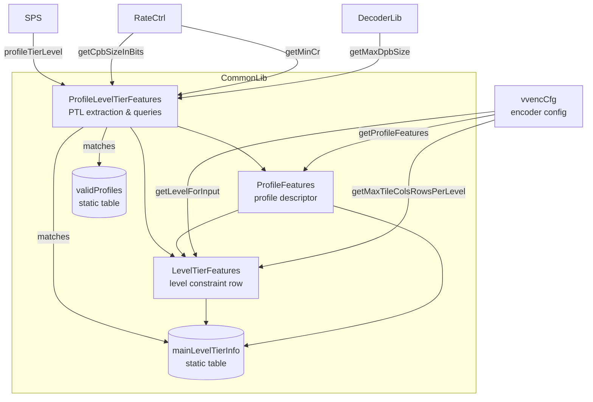
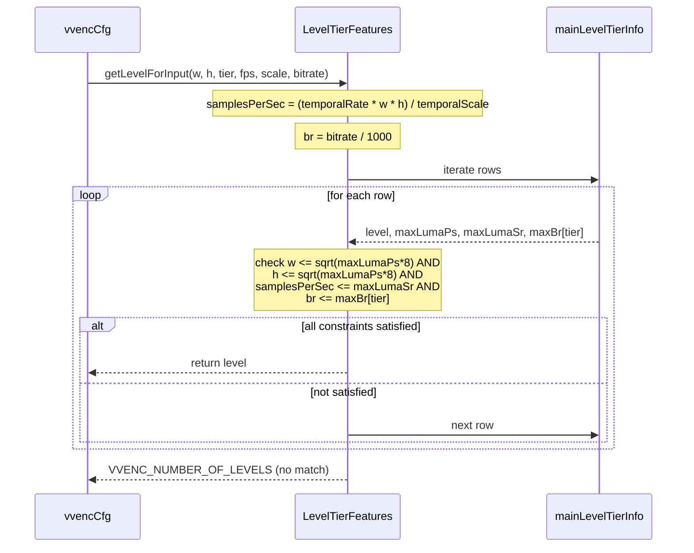
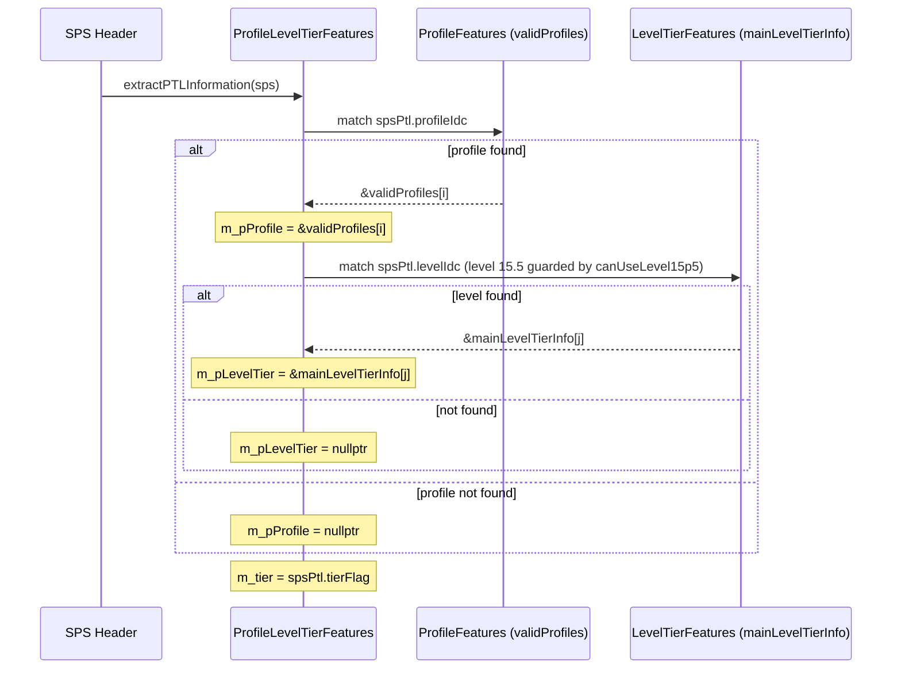
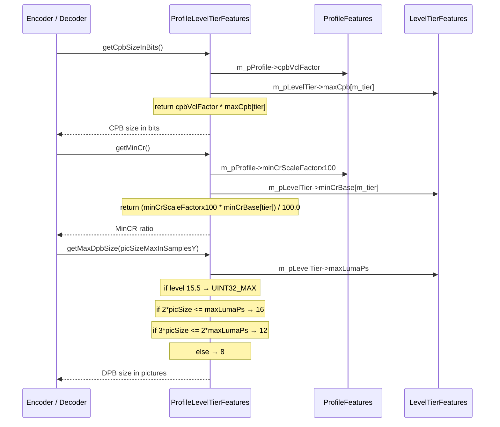

# ProfileLevelTier — Profile, Level and Tier Constraints

## 1. Overview

The `ProfileLevelTier` module provides the VVC profile, level, and tier constraint tables and lookup logic. It supplies the static level/feature tables defined in VVC Specification Annex A, profile feature descriptors, and a `ProfileLevelTierFeatures` class that extracts PTL information from `SPS` headers and computes derived quantities (CPB size, MinCR, DPB size).

**Dependencies**: `CommonDef.h` (`VVENC_NUMBER_OF_TIERS`, `MAX_UINT`), `vvencCfg.h` (`vvencLevel`, `vvencProfile`, `vvencTier`), `Slice.h` (`ProfileTierLevel`, `SPS`).

**Lifecycle**: Static tables are compiled into the binary. `ProfileLevelTierFeatures` instances are created on the stack or embedded in encoder configuration — init via `extractPTLInformation(SPS)`.

## 2. Component Specifications

### 2.1 Struct: `LevelTierFeatures`

```cpp
#pragma once

#include "CommonLib/CommonDef.h"
#include <stdint.h>

namespace vvenc {

struct LevelTierFeatures
{
  vvencLevel    level;
  uint32_t      maxLumaPs;
  uint32_t      maxCpb[VVENC_NUMBER_OF_TIERS];
  uint32_t      maxSlicesPerAu;
  uint32_t      maxTilesPerAu;
  uint32_t      maxTileCols;
  uint32_t      maxTileRows;
  uint64_t      maxLumaSr;
  uint32_t      maxBr[VVENC_NUMBER_OF_TIERS];
  uint32_t      minCrBase[VVENC_NUMBER_OF_TIERS];

  uint32_t      getMaxPicWidthInLumaSamples()  const;
  uint32_t      getMaxPicHeightInLumaSamples() const;

  static vvencLevel getMaxLevel(vvencProfile profile);
  static vvencLevel getLevelForInput(uint32_t width, uint32_t height, bool tier, int temporalRate, int temporalScale, int bitrate);
  static void       getMaxTileColsRowsPerLevel(vvencLevel level, uint32_t &maxCols, uint32_t &maxRows);
};

}
```

**Fields**:

| Field | Type | Description |
|---|---|---|
| `level` | `vvencLevel` | The VVC level enum value (LEVEL1 … LEVEL15_5) |
| `maxLumaPs` | `uint32_t` | Maximum luma picture size in samples |
| `maxCpb[2]` | `uint32_t` | Maximum CPB size per tier (Main/High), in CPB-factor units |
| `maxSlicesPerAu` | `uint32_t` | Maximum number of slices per access unit |
| `maxTilesPerAu` | `uint32_t` | Maximum number of tiles per access unit |
| `maxTileCols` | `uint32_t` | Maximum tile columns |
| `maxTileRows` | `uint32_t` | Maximum tile rows |
| `maxLumaSr` | `uint64_t` | Maximum luma sample rate (samples/sec) |
| `maxBr[2]` | `uint32_t` | Maximum bitrate per tier, in BR-factor units |
| `minCrBase[2]` | `uint32_t` | Minimum compression ratio base per tier |

**Methods**:

- `getMaxPicWidthInLumaSamples()` → `uint32_t`: returns `sqrt(maxLumaPs * 8)`, the derived square picture width.
- `getMaxPicHeightInLumaSamples()` → `uint32_t`: same formula as width (square constraint assumed).
- `getMaxLevel(profile)` → `vvencLevel`: returns `VVENC_LEVEL15_5` if the profile allows it, otherwise `VVENC_LEVEL6_3`.
- `getLevelForInput(width, height, tier, temporalRate, temporalScale, bitrate)` → `vvencLevel`: iterates the `mainLevelTierInfo` table and returns the first level whose picture size, sample rate, and bitrate constraints are satisfied, or `VVENC_NUMBER_OF_LEVELS` if none match.
- `getMaxTileColsRowsPerLevel(level, &maxCols, &maxRows)`: looks up the level in the table; if not found, falls back to `MAX_TILE_COLS` / `MAX_TILES / MAX_TILE_COLS`.

### 2.2 Static Table: `mainLevelTierInfo`

```cpp
static const LevelTierFeatures mainLevelTierInfo[] =
{
  // level,       maxLumaPs,   maxCpb[2],         maxSlices, maxTiles, cols, rows, maxLumaSr,      maxBr[2],         minCr[2]
  { VVENC_LEVEL1  ,    36864, {      350,      0 },       16,       1,    1,    1,   552960ULL,    {     128,      0 }, { 2, 2 } },
  { VVENC_LEVEL2  ,   122880, {     1500,      0 },       16,       1,    1,    1,  3686400ULL,    {    1500,      0 }, { 2, 2 } },
  { VVENC_LEVEL2_1,   245760, {     3000,      0 },       20,       1,    1,    1,  7372800ULL,    {    3000,      0 }, { 2, 2 } },
  { VVENC_LEVEL3  ,   552960, {     6000,      0 },       30,       4,    2,    2, 16588800ULL,    {    6000,      0 }, { 2, 2 } },
  { VVENC_LEVEL3_1,   983040, {    10000,      0 },       40,       9,    3,    3, 33177600ULL,    {   10000,      0 }, { 2, 2 } },
  { VVENC_LEVEL4  ,  2228224, {    12000,  30000 },       75,      25,    5,    5, 66846720ULL,    {   12000,  30000 }, { 4, 4 } },
  { VVENC_LEVEL4_1,  2228224, {    20000,  50000 },       75,      25,    5,    5,133693440ULL,    {   20000,  50000 }, { 4, 4 } },
  { VVENC_LEVEL5  ,  8912896, {    25000, 100000 },      200,     110,   10,   11,267386880ULL,    {   25000, 100000 }, { 6, 4 } },
  { VVENC_LEVEL5_1,  8912896, {    40000, 160000 },      200,     110,   10,   11,534773760ULL,    {   40000, 160000 }, { 8, 4 } },
  { VVENC_LEVEL5_2,  8912896, {    60000, 240000 },      200,     110,   10,   11,1069547520ULL,   {   60000, 240000 }, { 8, 4 } },
  { VVENC_LEVEL6  , 35651584, {    80000, 240000 },      600,     440,   20,   22,1069547520ULL,   {   60000, 240000 }, { 8, 4 } },
  { VVENC_LEVEL6_1, 35651584, {   120000, 480000 },      600,     440,   20,   22,2139095040ULL,   {  120000, 480000 }, { 8, 4 } },
  { VVENC_LEVEL6_2, 35651584, {   180000, 800000 },      600,     440,   20,   22,4278190080ULL,   {  240000, 800000 }, { 8, 4 } },
  { VVENC_LEVEL6_3, 80216064, {   240000, 800000 },     1000,     990,   30,   33,4812963840ULL,   {  320000, 800000 }, { 8, 4 } },
  { VVENC_LEVEL15_5,MAX_UINT, { MAX_UINT,MAX_UINT }, MAX_UINT,MAX_UINT,MAX_UINT,MAX_UINT,MAX_CNFUINT64,{MAX_UINT,MAX_UINT},{ 0,0 } },
  { VVENC_LEVEL_AUTO }
};
```

The sentinel `VVENC_LEVEL_AUTO` entry terminates iteration. `VVENC_LEVEL15_5` is an unconstrained placeholder (all limits set to MAX).

### 2.3 Struct: `ProfileFeatures`

```cpp
namespace vvenc {

struct ProfileFeatures
{
  vvencProfile             profile;
  const char              *pNameString;
  uint32_t                 maxBitDepth;
  ChromaFormat             maxChromaFormat;
  bool                     canUseLevel15p5;
  uint32_t                 cpbVclFactor;
  uint32_t                 cpbNalFactor;
  uint32_t                 formatCapabilityFactorx1000;
  uint32_t                 minCrScaleFactorx100;
  const LevelTierFeatures *pLevelTiersListInfo;
  bool                     onePictureOnlyFlagMustBe1;

  static const ProfileFeatures *getProfileFeatures(const vvencProfile p);
};

}
```

**Fields**:

| Field | Type | Description |
|---|---|---|
| `profile` | `vvencProfile` | VVC profile identifier |
| `pNameString` | `const char*` | Human-readable profile name (e.g. `"Main_10"`) |
| `maxBitDepth` | `uint32_t` | Maximum bit depth supported by this profile |
| `maxChromaFormat` | `ChromaFormat` | Maximum chroma format (`CHROMA_420` or `CHROMA_444`) |
| `canUseLevel15p5` | `bool` | Whether the profile permits level 15.5 (unconstrained) |
| `cpbVclFactor` | `uint32_t` | VCL CPB multiplier factor |
| `cpbNalFactor` | `uint32_t` | NAL CPB multiplier factor |
| `formatCapabilityFactorx1000` | `uint32_t` | Format capability factor (×1000) |
| `minCrScaleFactorx100` | `uint32_t` | MinCR scale factor (×100) |
| `pLevelTiersListInfo` | `const LevelTierFeatures*` | Pointer to the `mainLevelTierInfo` table |
| `onePictureOnlyFlagMustBe1` | `bool` | Whether `general_one_picture_only_flag` must be 1 (still-picture profiles) |

**Method**:

- `getProfileFeatures(profile)` → `const ProfileFeatures*`: walks `validProfiles[]` and returns the matching entry, or the sentinel (`VVENC_PROFILE_AUTO`) entry if not found.

### 2.4 Static Table: `validProfiles`

```cpp
static const ProfileFeatures validProfiles[] = {
  // profile,                            name,                              BD,  fmt,   15.5, cpbVcl, cpbNal, fcf(x1000), minCr(x100), levelInfo,          onePicOnly
  { VVENC_MAIN_10_STILL_PICTURE,          "Main_10_Still_Picture",          10,  CHROMA_420, true,  1000,   1100,   1875,       100,          mainLevelTierInfo, true  },
  { VVENC_MULTILAYER_MAIN_10_STILL_PICTURE,"Multilayer_Main_10_Still_Picture",10,CHROMA_420, true,  1000,   1100,   1875,       100,          mainLevelTierInfo, true  },
  { VVENC_MAIN_10_444_STILL_PICTURE,      "Main_444_10_Still_Picture",      10,  CHROMA_444, true,  2500,   2750,   3750,       75,           mainLevelTierInfo, true  },
  { VVENC_MULTILAYER_MAIN_10_444_STILL_PICTURE,"Multilayer_Main_444_10_Still_Picture",10,CHROMA_444,true,2500,2750,3750,75,mainLevelTierInfo, true  },
  { VVENC_MAIN_10,                        "Main_10",                        10,  CHROMA_420, false, 1000,   1100,   1875,       100,          mainLevelTierInfo, false },
  { VVENC_MULTILAYER_MAIN_10,             "Multilayer_Main_10",             10,  CHROMA_420, false, 1000,   1100,   1875,       100,          mainLevelTierInfo, false },
  { VVENC_MAIN_10_444,                    "Main_444_10",                    10,  CHROMA_444, false, 2500,   2750,   3750,       75,           mainLevelTierInfo, false },
  { VVENC_MULTILAYER_MAIN_10_444,         "Multilayer_Main_444_10",         10,  CHROMA_444, false, 2500,   2750,   3750,       75,           mainLevelTierInfo, false },
  { VVENC_PROFILE_AUTO,                   0 }
};
```

Most-constrained profiles appear first (still-picture variants before their general counterparts).

### 2.5 Class: `ProfileLevelTierFeatures`

```cpp
namespace vvenc {

class ProfileLevelTierFeatures
{
private:
  const ProfileFeatures   *m_pProfile;
  const LevelTierFeatures *m_pLevelTier;
  vvencTier                m_tier;
public:
  ProfileLevelTierFeatures() : m_pProfile(nullptr), m_pLevelTier(nullptr), m_tier(VVENC_TIER_MAIN) {}

  void extractPTLInformation(const SPS &sps);

  const ProfileFeatures     *getProfileFeatures()   const { return m_pProfile; }
  const LevelTierFeatures   *getLevelTierFeatures() const { return m_pLevelTier; }
  vvencTier                  getTier()              const { return m_tier; }
  uint64_t getCpbSizeInBits()                       const;
  double   getMinCr()                               const;
  uint32_t getMaxDpbSize(uint32_t picSizeMaxInSamplesY) const;
};

}
```

**Constructor**: Initialises all pointers to `nullptr` and tier to `VVENC_TIER_MAIN`.

**`extractPTLInformation(sps)`**: Reads `sps.profileTierLevel` and walks `validProfiles[]` to match the profile ID. Then walks the matched profile's `pLevelTiersListInfo` to identify the level. Level 15.5 is only accepted if `canUseLevel15p5` is true.

**`getCpbSizeInBits()`** → `uint64_t`: returns `cpbVclFactor * maxCpb[tier]` or 0 if not initialised.

**`getMinCr()`** → `double`: returns `(minCrScaleFactorx100 * minCrBase[tier]) / 100.0` or 0.0 if not initialised.

**`getMaxDpbSize(picSizeMaxInSamplesY)`** → `uint32_t`: per VVC spec:
- Level 15.5 → `UINT32_MAX` (unconstrained).
- `2 * picSizeMaxInSamplesY <= maxLumaPs` → 16.
- `3 * picSizeMaxInSamplesY <= 2 * maxLumaPs` → 12.
- Otherwise → 8.

## 3. System Architecture



## 4. Detailed Data Flow

### 4.1 Encoder Initialisation — Level Inference



### 4.2 PTL Information Extraction from SPS



### 4.3 Query Flow — CPB, MinCR, DPB



## 5. Visualisation

No D3 animation. All data is compile-time constant tables. The relationships are fully captured by the architecture and sequence diagrams above.

## 6. Testing Requirements

### Unit Tests (new file: `test/vvenc_unit_test/profile_level_tier_test.cpp`)

| Test ID | Method | What to Verify |
|---|---|---|
| `PLT_LEVEL6_3_MAIN_10` | `getLevelForInput(3840,2160,false,50,1,20000)` | returns `VVENC_LEVEL6_3` |
| `PLT_LEVEL6_3_HEIGHT` | `getLevelForInput(1920,1080,false,50,1,80000)` | returns `VVENC_LEVEL6_3` (height-limited) |
| `PLT_LEVEL5_1_BITRATE` | `getLevelForInput(1920,1080,false,50,1,45000)` | returns `VVENC_LEVEL5_1` (bitrate 40000 < 45000) |
| `PLT_LEVEL5_BITRATE` | `getLevelForInput(1920,1080,false,50,1,28000)` | returns `VVENC_LEVEL5` (25000 < 28000 ≤ 40000) |
| `PLT_LEVEL4` | `getLevelForInput(1920,1080,false,30,1,12500)` | returns `VVENC_LEVEL4` (12000 < 12500 ≤ 20000) |
| `PLT_LEVEL3` | `getLevelForInput(1920,1080,false,15,1,7000)` | returns `VVENC_LEVEL3` |
| `PLT_LEVEL3_1` | `getLevelForInput(1920,1080,false,24,1,11000)` | returns `VVENC_LEVEL3_1` |
| `PLT_SR_1` | `getLevelForInput(1280,720,false,60,1,15000)` | returns `VVENC_LEVEL3_1` (33177600 SR limit) |
| `PLT_SR_2` | `getLevelForInput(1280,720,false,30,1,7000)` | returns `VVENC_LEVEL3` (16588800 SR limit satisfied) |
| `PLT_SR_3` | `getLevelForInput(720,480,false,30,1,3000)` | returns `VVENC_LEVEL2_1` (7372800 SR limit) |
| `PLT_SR_4` | `getLevelForInput(352,288,false,30,1,500)` | returns `VVENC_LEVEL1` |
| `PLT_MAX_TILE_COLS_ROWS` | `getMaxTileColsRowsPerLevel(VVENC_LEVEL5, ...)` | cols==10, rows==11 |
| `PLT_MAX_LEVEL_MAIN_10` | `getMaxLevel(VVENC_MAIN_10)` | returns `VVENC_LEVEL6_3` |
| `PLT_MAX_LEVEL_STILL` | `getMaxLevel(VVENC_MAIN_10_STILL_PICTURE)` | returns `VVENC_LEVEL15_5` |
| `PLT_PROFILE_FEATURES` | `getProfileFeatures(VVENC_MAIN_10)` | returns non-null, `maxBitDepth==10`, `maxChromaFormat==CHROMA_420` |
| `PLT_PROFILE_NULL` | `getProfileFeatures(VVENC_PROFILE_AUTO)` | returns sentinel entry |
| `PLT_GET_CPB` | `getCpbSizeInBits()` after `extractPTLInformation` with known SPS | returns `cpbVclFactor * maxCpb[tier]` |
| `PLT_GET_MINCR` | `getMinCr()` | returns `(minCrScaleFactorx100 * minCrBase[tier]) / 100.0` |
| `PLT_GET_DPB_16` | `getMaxDpbSize(1)` with level 5.1 (maxLumaPs=8912896) | returns 16 (`2*1 ≤ 8912896`) |
| `PLT_GET_DPB_12` | `getMaxDpbSize(5000000)` with level 5.1 | returns 12 (`3*5000000 ≤ 2*8912896`) |
| `PLT_GET_DPB_8` | `getMaxDpbSize(5000000)` with level 5 (maxLumaPs=8912896) | returns 8 |
| `PLT_GET_DPB_15_5` | `getMaxDpbSize(...)` on level 15.5 | returns `UINT32_MAX` |

### Calling-Order Validation

`extractPTLInformation` must be called before any query method. Uninitialised state (`nullptr` members) must return 0 / 0.0 / nullptr gracefully.

### Parameter Range Tests

- `getLevelForInput`: width=0/height=0 should fail gracefully (return `VVENC_NUMBER_OF_LEVELS`)
- `getMaxDpbSize`: picSizeMaxInSamplesY=0 handling
- Bitrate near integer boundaries for levels 5.1/5.2/6/6.1/6.2/6.3

### Integration Tests

Covered by `vvenc_unit_test.cpp` which exercises `extractPTLInformation` as part of SPS decoding tests and encoder config validation.

## 7. CLI Entry Point

Not directly exposed via CLI. The level inference (`getLevelForInput`) is called during encoder configuration in `vvencCfg.cpp` at lines 896 and 906. Tile constraint query (`getMaxTileColsRowsPerLevel`) is called at line 2484 of `vvencCfg.cpp`. The `ProfileLevelTierFeatures` class is used internally by `EncLib` and `DecLib` for CPB/MinCR/DPB compliance checks.
