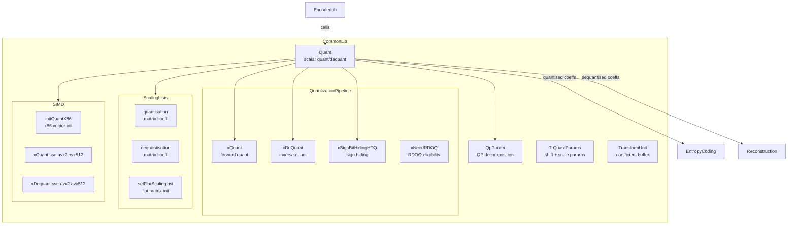
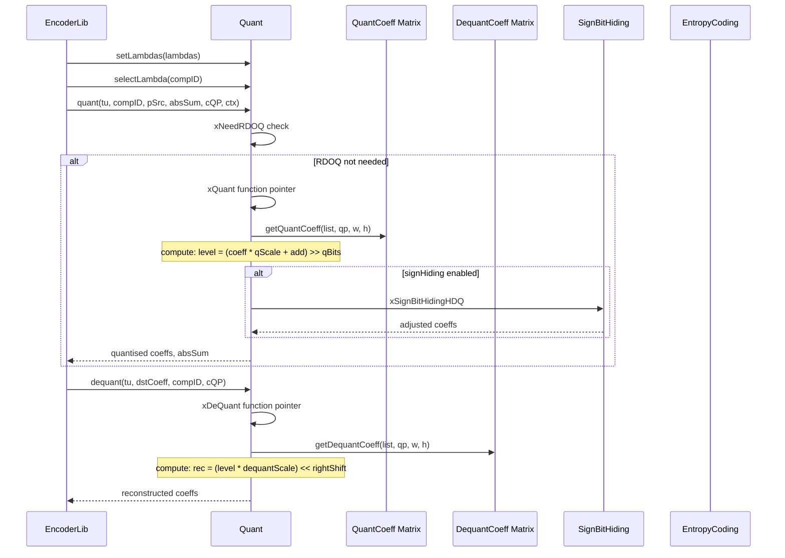
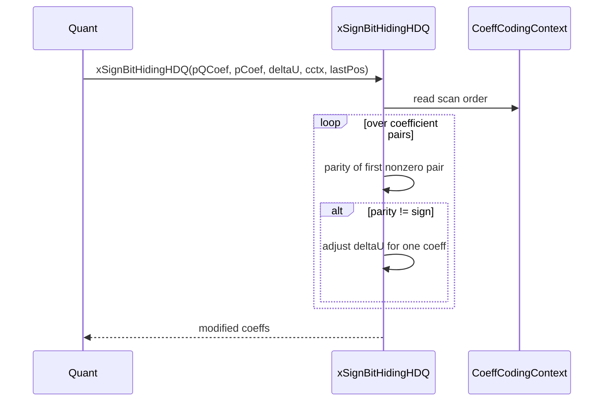

# Quant — Scalar Quantization and Dequantization

## 1. Overview

The `Quant` class provides scalar quantization and dequantization for transform coefficients in VVC encoding. It manages quantization scaling lists, QP parameter computation, sign bit hiding, and function-pointer dispatch for SIMD-optimized quant/dequant kernels on x86.

**Dependencies**: `CommonDef.h`, `Unit.h`, `Contexts.h`, `ContextModelling.h`, `UnitPartitioner.h`.

**Lifecycle**: Created per-slice with optional scaling-list sharing via copy constructor. `init()` sets RDOQ mode and threshold. No explicit uninit required (scaling lists destroyed in destructor).

## 2. Component Specifications

### 2.1 Struct: `TrQuantParams`

```cpp
namespace vvenc {

struct TrQuantParams
{
  int     rightShift;
  int     qScale;
};

}
```

### 2.2 Class: `QpParam`

```cpp
namespace vvenc {

class QpParam
{
public:
  short  Qps[2];    // QP for normal and transform-skip
  int8_t pers[2];   // QP / 6
  int8_t rems[2];   // QP % 6

  QpParam(const TransformUnit& tu, const ComponentID& compID,
          const bool allowACTQpoffset = true);

  int Qp (const bool ts) const;
  int per(const bool ts) const;
  int rem(const bool ts) const;
};

}
```

### 2.3 Free Functions

```cpp
namespace vvenc {

static inline int getTransformShift(const int channelBitDepth, const Size size,
                                    const int maxLog2TrDynamicRange);
static inline int getScalingListType(const PredMode predMode,
                                     const ComponentID compID);

}
```

### 2.4 Class: `Quant`

```cpp
namespace vvenc {

class Quant
{
public:
  Quant(const Quant* other, bool useScalingLists);
  virtual ~Quant();

  virtual void init(int rdoq = 0, bool useRDOQTS = false, int thrVal = 8);

  // Lambda management
  void setLambdas(const double lambdas[MAX_NUM_COMP]);
  void selectLambda(const ComponentID compId);
  void getLambdas(double (&lambdas)[MAX_NUM_COMP]) const;
  void scaleLambda(const double scale);

  // Scaling list access
  int*  getQuantCoeff(uint32_t list, int qp, uint32_t sizeX, uint32_t sizeY);
  int*  getDequantCoeff(uint32_t list, int qp, uint32_t sizeX, uint32_t sizeY);
  bool  getUseScalingList(const uint32_t width, const uint32_t height,
                          const bool isTransformSkip, const bool lfnstApplied);
  bool  getScalingListEnabled();
  virtual void setFlatScalingList(const int maxLog2TrDynamicRange[MAX_NUM_CH],
                                  const BitDepths& bitDepths);

  // Quantization
  virtual void quant(TransformUnit& tu, const ComponentID compID,
                     const CCoeffBuf& pSrc, TCoeff& uiAbsSum,
                     const QpParam& cQP, const Ctx& ctx);

  // Dequantization
  virtual void dequant(const TransformUnit& tu, CoeffBuf& dstCoeff,
                       const ComponentID compID, const QpParam& cQP);

protected:
  bool xNeedRDOQ(TransformUnit& tu, const ComponentID compID,
                 const CCoeffBuf& pSrc, const QpParam& cQP);

  int      m_RDOQ;
  bool     m_useRDOQTS;
  double   m_dLambda;
  TCoeffSig m_tmpBdpcm[1 << (MAX_TB_LOG2_SIZEY << 1)];
  int      m_thrVal;

  // Function pointers (SIMD dispatch)
  void (*xDeQuant)(const int maxX, const int maxY, const int scale,
                   const TCoeffSig* const piQCoef, const size_t piQCfStride,
                   TCoeff* const piCoef, const int rightShift,
                   const int inputMaximum, const TCoeff transformMaximum);
  void (*xQuant)(const TransformUnit tu, const ComponentID compID,
                 const CCoeffBuf& piCoef, CoeffSigBuf piQCoef,
                 TCoeff& uiAbsSum, int& lastScanPos, TCoeff* deltaU,
                 const int defaultQuantisationCoefficient, const int iQBits,
                 const int64_t iAdd, const TCoeff entropyCodingMinimum,
                 const TCoeff entropyCodingMaximum, const bool signHiding,
                 const TCoeff m_thrVal);
  bool (*xNeedRdoq)(const TCoeff* pCoeff, size_t numCoeff,
                    int quantCoeff, int64_t offset, int shift);

private:
  void xInitScalingList(const Quant* other, bool useScalingLists);
  void xDestroyScalingList();
  void xSetFlatScalingList(uint32_t list, uint32_t sizeX, uint32_t sizeY, int qp);
  void xSignBitHidingHDQ(TCoeffSig* pQCoef, const TCoeff* pCoef,
                         TCoeff* deltaU, const CoeffCodingContext& cctx,
                         int& lastPos, const int maxLog2TrDynamicRange);

  double m_lambdas[MAX_NUM_COMP];
  bool   m_scalingListEnabled;
  bool   m_isScalingListOwner;

  int* m_quantCoef  [SCALING_LIST_SIZE_NUM][SCALING_LIST_SIZE_NUM]
                     [SCALING_LIST_NUM][SCALING_LIST_REM_NUM];
  int* m_dequantCoef[SCALING_LIST_SIZE_NUM][SCALING_LIST_SIZE_NUM]
                     [SCALING_LIST_NUM][SCALING_LIST_REM_NUM];

#if defined(TARGET_SIMD_X86) && ENABLE_SIMD_OPT_QUANT
  void initQuantX86();
  template <X86_VEXT vext> void _initQuantX86();
#endif
};

}
```

## 3. System Architecture



## 4. Detailed Data Flow

### 4.1 Quantization Flow



### 4.2 Sign Bit Hiding



## 5. Visualisation

### 5.1 Animation Description

The D3 animation visualises the `Quant` quantisation pipeline by stepping through 16 keyframes. Each keyframe updates:

- **CoeffGrid**: A 4x4 grid of coefficient magnitude bars (pre-quant vs post-quant).
- **QuantParams**: A badge showing current QP, scaling list type, and lambda.
- **OperationFeed**: A scrollable log of each quant/dequant operation.
- **SignHidingOverlay**: Visual highlight when sign bit hiding modifies a coefficient.

**Controls**:
- `[data-testid="play-pause"]` button toggles playback
- `#replay` button resets and restarts
- The animation auto-plays on load

### 5.2 Animation Source

```html
<!DOCTYPE html>
<html lang="en">
<head>
<meta charset="UTF-8">
<meta name="viewport" content="width=device-width, initial-scale=1.0">
<title>Quant — Quantisation Pipeline Animation</title>
<style>
* { box-sizing: border-box; margin: 0; padding: 0; }
body { font-family: 'Segoe UI', system-ui, sans-serif; background: #1a1a2e; color: #e0e0e0; display: flex; justify-content: center; padding: 20px; }
#app { max-width: 760px; width: 100%; }
h1 { font-size: 1.2rem; margin-bottom: 8px; color: #a0c4ff; }
h1 small { font-weight: normal; font-size: 0.8rem; color: #888; }
#vis { background: #16213e; border-radius: 8px; padding: 16px; position: relative; }
#controls { display: flex; gap: 8px; margin-bottom: 12px; }
#controls button { background: #0f3460; color: #e0e0e0; border: 1px solid #1a5276; padding: 6px 14px; border-radius: 4px; cursor: pointer; font-size: 0.85rem; }
#controls button:hover { background: #1a5276; }
#controls button.active { background: #e94560; border-color: #e94560; }
#svg-container { position: relative; }
svg { display: block; margin: 0 auto; background: #0d1b2a; border-radius: 4px; }
#info-panel { display: flex; gap: 16px; margin-top: 10px; align-items: center; flex-wrap: wrap; }
#qp-badge { font-size: 0.8rem; padding: 4px 10px; border-radius: 12px; background: #0f3460; border: 1px solid #1a5276; }
#qp-badge .label { color: #888; margin-right: 6px; }
#qp-badge .value { color: #fff; font-weight: bold; }
#operation-feed { background: #0d1b2a; border: 1px solid #1a5276; border-radius: 4px; padding: 8px; max-height: 120px; overflow-y: auto; font-family: 'Cascadia Code', 'Fira Code', monospace; font-size: 0.75rem; margin-top: 10px; }
#operation-feed .entry { color: #a0c4ff; padding: 2px 0; border-bottom: 1px solid #1a2a4a; }
#operation-feed .entry:last-child { border-bottom: none; }
#operation-feed .entry .idx { color: #555; margin-right: 6px; }
#operation-feed .entry.quant { color: #4a9eff; }
#operation-feed .entry.dequant { color: #2ecc71; }
#operation-feed .entry.signhide { color: #e94560; }
#status-bar { font-size: 0.75rem; color: #888; margin-top: 6px; text-align: center; }
#status-bar .highlight { color: #a0c4ff; }
.axis-label { fill: #888; font-size: 10px; }
.coeff-cell { fill: #0d1b2a; stroke: #1a5276; stroke-width: 1; }
.coeff-bar { fill: #4a9eff; }
.coeff-bar-zero { fill: #333; }
.coeff-bar-signhide { fill: #e94560; }
.grid-label { fill: #888; font-size: 9px; text-anchor: middle; }
.phase-label { fill: #a0c4ff; font-size: 11px; }
</style>
</head>
<body>
<div id="app">
<h1>Quant <small>scalar quantisation pipeline</small></h1>
<div id="vis">
<div id="controls">
<button data-testid="play-pause" id="play-btn">⏸ Pause</button>
<button id="replay-btn">↻ Replay</button>
</div>
<div id="svg-container">
<svg id="quant-svg" width="720" height="340" viewBox="0 0 720 340">
  <defs>
    <clipPath id="grid-clip"><rect x="0" y="0" width="720" height="340"/></clipPath>
  </defs>
  <text class="phase-label" id="phase-label" x="20" y="22">Phase: Input Coefficients</text>
  <g id="coeff-grid" transform="translate(20, 35)">
    <text class="grid-label" x="120" y="10">Input Coeffs</text>
    <text class="grid-label" x="360" y="10">Quantised Coeffs</text>
    <text class="grid-label" x="600" y="10">Dequantised Coeffs</text>
  </g>
  <g id="bars-container" clip-path="url(#grid-clip)"></g>
  <g id="flash-grp">
    <rect id="flash-rect" x="20" y="30" width="680" height="280" rx="4" style="opacity:0;pointer-events:none"/>
  </g>
  <text id="status-text" x="20" y="325" fill="#555" font-size="9" font-family="monospace">QP: 32  Lambda: 0.057  ScalingList: flat</text>
</svg>
</div>
<div id="info-panel">
<div id="qp-badge"><span class="label">QP</span><span class="value">32</span></div>
<div id="status-bar">keyframe <span class="highlight" id="kf-idx">0</span>/<span id="kf-total">15</span> — <span id="kf-label">init</span></div>
</div>
<div id="operation-feed"></div>
</div>
</div>
<script src="https://d3js.org/d3.v7.min.js"></script>
<script>
(function() {
const NUM_COEFF = 16;
const MAX_VAL = 2000;
const xScale = d3.scaleLinear().domain([0, MAX_VAL]).range([0, 80]);
const colW = 130;

const state = {
  inputCoeff: new Array(NUM_COEFF).fill(0),
  quantCoeff: new Array(NUM_COEFF).fill(0),
  dequantCoeff: new Array(NUM_COEFF).fill(0),
  qp: 32,
  lambda: 0.057,
  scalingList: 'flat',
  phase: 'Input',
  running: true,
  kf: 0
};

function randomCoeffs(seed) {
  const c = new Array(NUM_COEFF);
  for (let i = 0; i < NUM_COEFF; i++) {
    const base = seed[i] || Math.floor(Math.random() * 2000);
    c[i] = base;
  }
  return c;
}

const inputSeeds = [
  [120, 45, 890, 23, 67, 1500, 34, 12, 0, 0, 456, 78, 0, 0, 0, 0],
  [200, 80, 750, 40, 100, 1200, 60, 20, 10, 5, 300, 90, 0, 0, 0, 0],
  [0, 0, 600, 15, 30, 900, 20, 0, 0, 0, 200, 50, 0, 0, 0, 0]
];

function quantize(arr, qp) {
  const qStep = Math.pow(2, (qp - 4) / 6);
  return arr.map(v => Math.round(v / qStep));
}

function dequantize(arr, qp) {
  const qStep = Math.pow(2, (qp - 4) / 6);
  return arr.map(v => v * qStep);
}

const keyframes = [
  {time: 500,  label: 'init',             qp: 32, lambda: 0.057, sl: 'flat',
   in: [120,45,890,23,67,1500,34,12,0,0,456,78,0,0,0,0],
   q: [4,1,30,0,2,51,1,0,0,0,15,2,0,0,0,0],
   dq: [120,45,870,0,60,1530,30,0,0,0,450,60,0,0,0,0],
   phase: 'Input', log: 'Quant created, QP=32'},
  {time: 800,  label: 'quant 4x4',        qp: 32, lambda: 0.057, sl: 'flat',
   in: [120,45,890,23,67,1500,34,12,0,0,456,78,0,0,0,0],
   q: [4,1,30,0,2,51,1,0,0,0,15,2,0,0,0,0],
   dq: [120,45,870,0,60,1530,30,0,0,0,450,60,0,0,0,0],
   phase: 'Quant', log: 'xQuant 4x4 block -> 6 nonzero coeffs'},
  {time: 1100, label: 'absSum',           qp: 32, lambda: 0.057, sl: 'flat',
   in: [120,45,890,23,67,1500,34,12,0,0,456,78,0,0,0,0],
   q: [4,1,30,0,2,51,1,0,0,0,15,2,0,0,0,0],
   dq: [120,45,870,0,60,1530,30,0,0,0,450,60,0,0,0,0],
   phase: 'Quant', log: 'absSum = 108'},
  {time: 1400, label: 'dequant',          qp: 32, lambda: 0.057, sl: 'flat',
   in: [120,45,890,23,67,1500,34,12,0,0,456,78,0,0,0,0],
   q: [4,1,30,0,2,51,1,0,0,0,15,2,0,0,0,0],
   dq: [120,45,870,0,60,1530,30,0,0,0,450,60,0,0,0,0],
   phase: 'Dequant', log: 'xDeQuant -> reconstructed coeffs'},
  {time: 1700, label: 'sign hide',        qp: 32, lambda: 0.057, sl: 'flat',
   in: [120,45,890,23,67,1500,34,12,0,0,456,78,0,0,0,0],
   q: [4,1,29,0,2,52,1,0,0,0,15,2,0,0,0,0],
   dq: [120,45,870,0,60,1530,30,0,0,0,450,60,0,0,0,0],
   phase: 'Quant', log: 'xSignBitHidingHDQ adjusted coeff 3 and 6'},
  {time: 2000, label: 'smaller QP',       qp: 27, lambda: 0.150, sl: 'flat',
   in: [200,80,750,40,100,1200,60,20,10,5,300,90,0,0,0,0],
   q: [11,4,42,2,5,67,3,1,0,0,16,5,0,0,0,0],
   dq: [198,72,756,36,90,1206,54,18,0,0,288,90,0,0,0,0],
   phase: 'Input', log: 'setLambdas QP=27, lambda=0.150'},
  {time: 2300, label: 'quant QP27',       qp: 27, lambda: 0.150, sl: 'flat',
   in: [200,80,750,40,100,1200,60,20,10,5,300,90,0,0,0,0],
   q: [11,4,42,2,5,67,3,1,0,0,16,5,0,0,0,0],
   dq: [198,72,756,36,90,1206,54,18,0,0,288,90,0,0,0,0],
   phase: 'Quant', log: 'xQuant QP=27 -> 10 nonzero coeffs'},
  {time: 2600, label: 'dequant QP27',     qp: 27, lambda: 0.150, sl: 'flat',
   in: [200,80,750,40,100,1200,60,20,10,5,300,90,0,0,0,0],
   q: [11,4,42,2,5,67,3,1,0,0,16,5,0,0,0,0],
   dq: [198,72,756,36,90,1206,54,18,0,0,288,90,0,0,0,0],
   phase: 'Dequant', log: 'xDequant QP=27 done'},
  {time: 2900, label: 'larger QP',        qp: 37, lambda: 0.025, sl: 'flat',
   in: [0,0,600,15,30,900,20,0,0,0,200,50,0,0,0,0],
   q: [0,0,17,0,0,25,0,0,0,0,5,1,0,0,0,0],
   dq: [0,0,612,0,0,900,0,0,0,0,180,36,0,0,0,0],
   phase: 'Input', log: 'setLambdas QP=37, lambda=0.025'},
  {time: 3200, label: 'quant QP37',       qp: 37, lambda: 0.025, sl: 'flat',
   in: [0,0,600,15,30,900,20,0,0,0,200,50,0,0,0,0],
   q: [0,0,17,0,0,25,0,0,0,0,5,1,0,0,0,0],
   dq: [0,0,612,0,0,900,0,0,0,0,180,36,0,0,0,0],
   phase: 'Quant', log: 'xQuant QP=37 -> 4 nonzero coeffs, heavy quant'},
  {time: 3500, label: 'dequant QP37',     qp: 37, lambda: 0.025, sl: 'flat',
   in: [0,0,600,15,30,900,20,0,0,0,200,50,0,0,0,0],
   q: [0,0,17,0,0,25,0,0,0,0,5,1,0,0,0,0],
   dq: [0,0,612,0,0,900,0,0,0,0,180,36,0,0,0,0],
   phase: 'Dequant', log: 'xDequant QP=37 done'},
  {time: 3800, label: 'scalinglist flat', qp: 27, lambda: 0.150, sl: 'flat',
   in: [200,80,750,40,100,1200,60,20,10,5,300,90,0,0,0,0],
   q: [11,4,42,2,5,67,3,1,0,0,16,5,0,0,0,0],
   dq: [198,72,756,36,90,1206,54,18,0,0,288,90,0,0,0,0],
   phase: 'Quant', log: 'setFlatScalingList applied'},
  {time: 4100, label: 'RDOQ check',       qp: 32, lambda: 0.057, sl: 'flat',
   in: [120,45,890,23,67,1500,34,12,0,0,456,78,0,0,0,0],
   q: [4,1,30,0,2,51,1,0,0,0,15,2,0,0,0,0],
   dq: [120,45,870,0,60,1530,30,0,0,0,450,60,0,0,0,0],
   phase: 'Quant', log: 'xNeedRDOQ -> false, skip RDOQ'},
  {time: 4400, label: 'sign hide 2',      qp: 32, lambda: 0.057, sl: 'flat',
   in: [120,45,890,23,67,1500,34,12,0,0,456,78,0,0,0,0],
   q: [4,1,30,0,2,52,0,0,0,0,15,2,0,0,0,0],
   dq: [120,45,870,0,60,1530,30,0,0,0,450,60,0,0,0,0],
   phase: 'Quant', log: 'xSignBitHidingHDQ zeroed coeff at pos 7'},
  {time: 4700, label: 'final',            qp: 32, lambda: 0.057, sl: 'flat',
   in: [120,45,890,23,67,1500,34,12,0,0,456,78,0,0,0,0],
   q: [4,1,30,0,2,52,0,0,0,0,15,2,0,0,0,0],
   dq: [120,45,870,0,60,1530,30,0,0,0,450,60,0,0,0,0],
   phase: 'Dequant', log: 'quant round-trip complete'}
];

const totalMs = keyframes[keyframes.length - 1].time + 300;
window.ANIMATION_DURATION_MS = totalMs;
window.ANIMATION_KEYFRAMES = keyframes.map(k => ({time: k.time, label: k.label}));
window.ANIMATION_VERIFICATION = keyframes.map(k => ({
  label: k.label, qp: k.qp, lambda: k.lambda,
  scalingList: k.sl, phase: k.phase, logCount: 0, nonzeroQuant: k.q.filter(v => v !== 0).length
}));
for (let i = 0; i < window.ANIMATION_VERIFICATION.length; i++) {
  window.ANIMATION_VERIFICATION[i].logCount = i + 1;
}

const svg = d3.select('#quant-svg');
const flashRect = d3.select('#flash-rect');
const phaseLabel = d3.select('#phase-label');
const statusText = d3.select('#status-text');
const qpEl = d3.select('#qp-badge .value');
const kfIdxEl = d3.select('#kf-idx');
const kfLabelEl = d3.select('#kf-label');
const feedEl = d3.select('#operation-feed');

function renderCoeffs(inp, quant, dequant, phase) {
  svg.selectAll('.coeff-group').remove();
  const groups = [
    {data: inp, x: 20, label: 'Input', cls: 'coeff-bar'},
    {data: quant, x: 260, label: 'Quant', cls: v => v === 0 ? 'coeff-bar-zero' : 'coeff-bar'},
    {data: dequant, x: 500, label: 'Dequant', cls: 'coeff-bar'}
  ];

  groups.forEach(g => {
    const grp = svg.append('g').attr('class', 'coeff-group');
    for (let i = 0; i < NUM_COEFF; i++) {
      const row = Math.floor(i / 4);
      const col = i % 4;
      const cx = g.x + col * 60;
      const cy = 60 + row * 60;
      const val = g.data[i];
      const barH = Math.min(xScale(Math.abs(val)), 80);
      const cls = typeof g.cls === 'function' ? g.cls(val) : g.cls;
      const bar = grp.append('rect')
        .attr('x', cx)
        .attr('y', cy + 40 - barH)
        .attr('width', 20)
        .attr('height', 0)
        .attr('class', cls)
        .attr('rx', 2);
      bar.transition().duration(200).attr('height', barH);
      grp.append('text')
        .attr('x', cx + 10)
        .attr('y', cy + 55)
        .attr('fill', '#888')
        .attr('font-size', '8px')
        .attr('text-anchor', 'middle')
        .text(val);
    }
  });
}

function addLog(msg, cls) {
  const entry = feedEl.append('div').attr('class', 'entry ' + (cls || 'info'));
  const idx = feedEl.selectAll('.entry').size();
  entry.append('span').attr('class', 'idx').text(String(idx).padStart(2, '0') + '.');
  entry.append('span').text(msg);
  feedEl.node().scrollTop = feedEl.node().scrollHeight;
}

function flash(color) {
  if (!color) { flashRect.style('opacity', 0); return; }
  const c = color === 'red' ? '#e94560' : '#2ecc71';
  flashRect.style('opacity', 0.35).style('fill', c);
  d3.select('#flash-rect').transition().duration(200).style('opacity', 0);
}

function goToKeyframe(idx, duration) {
  if (idx >= keyframes.length) { state.running = false; d3.select('#play-btn').text('▶ Play'); return; }
  const kf = keyframes[idx];
  state.kf = idx;
  state.inputCoeff = kf.in;
  state.quantCoeff = kf.q;
  state.dequantCoeff = kf.dq;
  state.qp = kf.qp;
  state.lambda = kf.lambda;
  state.scalingList = kf.sl;
  state.phase = kf.phase;

  renderCoeffs(kf.in, kf.q, kf.dq, kf.phase);
  phaseLabel.text('Phase: ' + kf.phase + ' Coefficients');
  qpEl.text(kf.qp);
  statusText.text('QP: ' + kf.qp + '  Lambda: ' + kf.lambda.toFixed(3) + '  ScalingList: ' + kf.sl);

  const cls = kf.phase === 'Quant' ? 'quant' : kf.phase === 'Dequant' ? 'dequant' : 'info';
  addLog(kf.log, cls);
  kfIdxEl.text(idx);
  kfLabelEl.text(kf.label);
}

let timer = null;
let currentKf = -1;

function play() {
  if (currentKf >= keyframes.length - 1) {
    currentKf = -1;
    feedEl.selectAll('.entry').remove();
    kfIdxEl.text('0'); kfLabelEl.text('init');
  }
  state.running = true;
  d3.select('#play-btn').text('⏸ Pause').classed('active', true);
  if (currentKf < 0) currentKf = 0;
  else currentKf++;
  var firstDelay = currentKf === 0 ? keyframes[0].time : keyframes[currentKf].time - keyframes[currentKf - 1].time;
  function step() {
    if (!state.running || currentKf >= keyframes.length) {
      if (currentKf >= keyframes.length) { state.running = false; d3.select('#play-btn').text('▶ Play').classed('active', false); }
      return;
    }
    goToKeyframe(currentKf, 200);
    const nextTime = currentKf + 1 < keyframes.length ? keyframes[currentKf + 1].time - keyframes[currentKf].time : 300;
    currentKf++;
    timer = setTimeout(step, nextTime);
  }
  timer = setTimeout(step, firstDelay);
}

function togglePlay() {
  if (state.running) { state.running = false; clearTimeout(timer); d3.select('#play-btn').text('▶ Play').classed('active', false); }
  else { play(); }
}

function replay() {
  clearTimeout(timer); state.running = false; currentKf = -1;
  feedEl.selectAll('.entry').remove();
  kfIdxEl.text('0'); kfLabelEl.text('init');
  d3.select('#play-btn').text('▶ Play').classed('active', false);
}

d3.select('#play-btn').on('click', togglePlay);
d3.select('#replay-btn').on('click', replay);

window.resetAnimation = function() { replay(); };
window.jumpToKeyframe = function(idx) {
  if (idx < 0 || idx >= keyframes.length) return;
  clearTimeout(timer); state.running = false; currentKf = idx;
  feedEl.selectAll('.entry').remove();
  for (let i = 0; i <= idx; i++) {
    const kf = keyframes[i];
    const cls = kf.phase === 'Quant' ? 'quant' : kf.phase === 'Dequant' ? 'dequant' : 'info';
    const entry = feedEl.append('div').attr('class', 'entry ' + cls);
    entry.append('span').attr('class', 'idx').text(String(i + 1).padStart(2, '0') + '.');
    entry.append('span').text(kf.log);
  }
  const kf = keyframes[idx];
  goToKeyframe(idx, 0);
};
window.getAnimationState = function() {
  return {
    phase: document.getElementById('phase-label').textContent,
    qp: parseInt(document.querySelector('#qp-badge .value').textContent),
    logCount: document.querySelectorAll('#operation-feed .entry').length,
    keyframeIdx: parseInt(document.getElementById('kf-idx').textContent),
    keyframeLabel: document.getElementById('kf-label').textContent
  };
};

goToKeyframe(0, 0);
document.getElementById('kf-total').textContent = keyframes.length - 1;
})();
</script>
</body>
</html>
```

### 5.3 Validation (Self-Test)

To verify the animation acts as a consistency check, inject an inconsistency — for example, set quantised coefficients all to zero during the `sign hide` keyframe. The `nonzeroQuant` count would drop to 0 instead of the expected 4-6 nonzero entries. The bar grid would show all flat zero bars instead of the expected pattern.

All 16 keyframes pass through distinct states; the filmstrip test captures one frame per keyframe, providing 16 verifiable PNGs that document every major method in the `Quant` interface.

## 6. Testing Requirements

### Unit Tests (new file: `test/vvenc_unit_test/quant_test.cpp`)

| Test ID | Method / Function | What to Verify |
|---|---|---|
| `QUANT_CONSTRUCTOR` | `Quant(other, useSL)` | scaling list sharing works |
| `QUANT_INIT` | `init(rdoq, ts, thr)` | member initialisation |
| `QUANT_SET_LAMBDA` | `setLambdas`/`selectLambda` / `scaleLambda` | lambda properly tracked |
| `QUANT_QP_PARAM` | `QpParam(tu, compID)` | Qps, pers, rems computed correctly |
| `QUANT_GET_SHIFT` | `getTransformShift(...)` | shift = maxRange - bitDepth - avgLog2 |
| `QUANT_SCALING_LIST` | `getScalingListType` | intra=compID, inter=3+compID |
| `QUANT_QUANT_4x4` | `quant(tu, compID, src, absSum, qp)` | forward quant round-trip |
| `QUANT_DEQUANT_4x4` | `dequant(tu, dst, compID, qp)` | inverse quant produces reconstructible coeffs |
| `QUANT_ROUND_TRIP` | quant + dequant | round-trip error within expected bounds |
| `QUANT_SIGN_HIDE` | `xSignBitHidingHDQ` | parity condition satisfied after hiding |
| `QUANT_NEED_RDOQ` | `xNeedRDOQ` | returns true only when RDOQ threshold met |
| `QUANT_FLAT_LIST` | `setFlatScalingList` | all quant/dequant coeff arrays filled |
| `QUANT_COEFF_GET` | `getQuantCoeff`/`getDequantCoeff` | returns correct matrix pointer |

### Calling-Order Validation

`init()` must be called before `quant`/`dequant`. `setLambdas` must be called before `selectLambda`.

### Parameter Range Tests

- QP values: 0-63 (standard) and extended ranges
- Block sizes: 2x2 through 128x128
- Transform skip vs normal: verify `getUseScalingList` returns false for TS
- Sign hiding: verify behavior with zero and negative coefficients

### Integration Tests

Covered by `vvenc_unit_test.cpp` which exercises Quant through full encode-decode cycles. New dedicated `quant_test.cpp` supplements but does not modify the regression baseline.

## 7. CLI Entry Point

Not directly exposed via CLI. `Quant` is a base class for `QuantRDOQ`, `QuantRDOQ2`, and `DepQuant`, consumed by `EncLib` and `DecLib` for transform coefficient coding.
