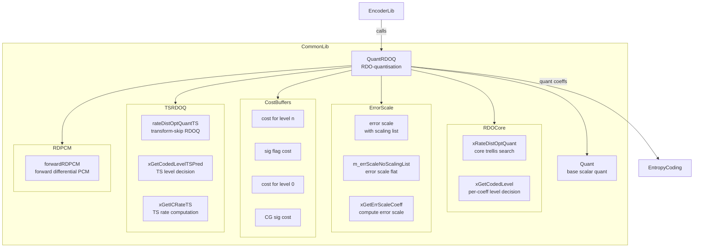
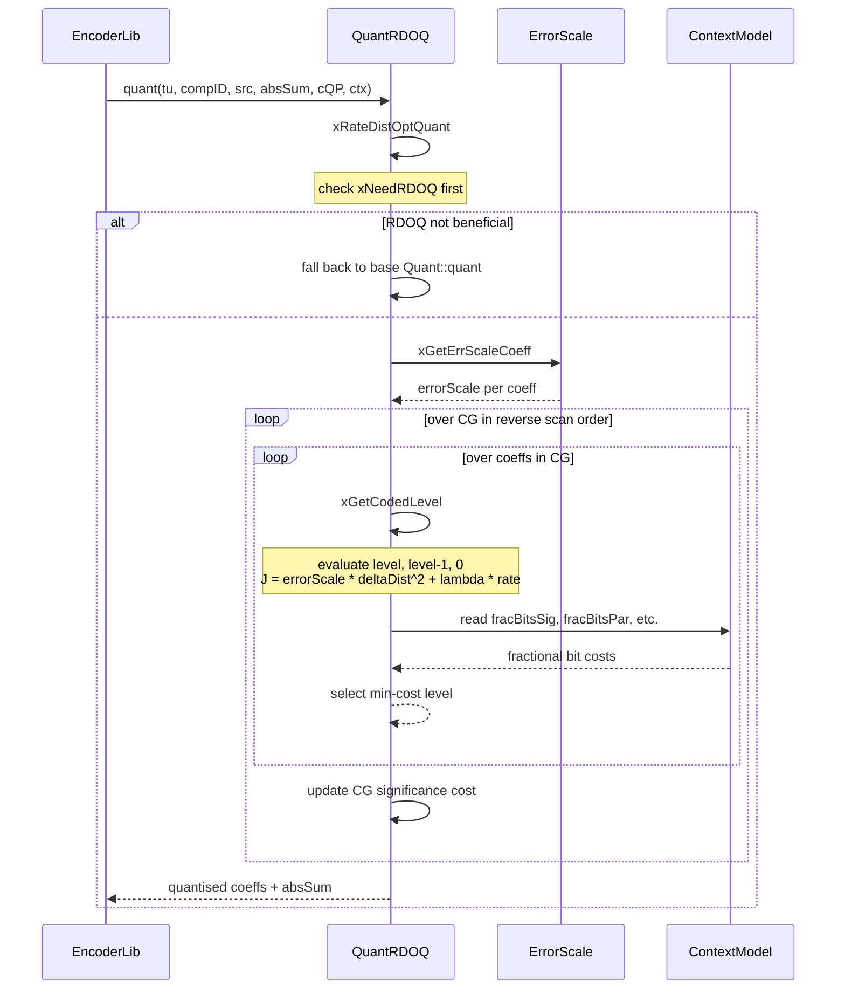
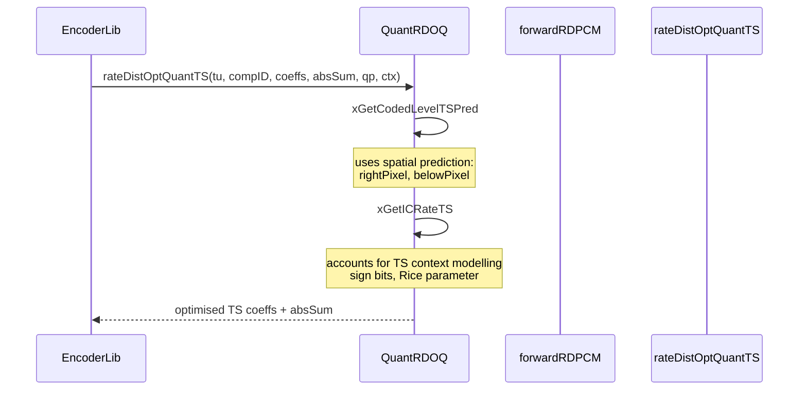

# QuantRDOQ — Rate-Distortion Optimized Quantization

## 1. Overview

`QuantRDOQ` extends `Quant` with rate-distortion optimized quantization for VVC transform coefficients. It evaluates multiple quantized levels per coefficient (level, level-1, zero) using cost = distortion + lambda * rate, selecting the minimum-cost level. It includes transform-skip RDOQ (`rateDistOptQuantTS`), forward RDPCM, and per-coefficient error scale computation with scaling list support.

**Dependencies**: `CommonDef.h`, `Unit.h`, `Contexts.h`, `ContextModelling.h`, `Quant.h`.

**Lifecycle**: Created per-slice via copy constructor for scaling list sharing. Error scale arrays are owned or shared. The base `Quant::init()` configures RDOQ mode and threshold.

## 2. Component Specifications

### 2.1 Class: `QuantRDOQ`

```cpp
namespace vvenc {

class QuantRDOQ : public Quant
{
public:
  QuantRDOQ(const Quant* other, bool useScalingLists);
  ~QuantRDOQ();

  void setFlatScalingList(const int maxLog2TrDynamicRange[MAX_NUM_CH],
                          const BitDepths& bitDepths);

  void quant(TransformUnit& tu, const ComponentID compID,
             const CCoeffBuf& pSrc, TCoeff& uiAbsSum,
             const QpParam& cQP, const Ctx& ctx);

  void forwardRDPCM(TransformUnit& tu, const ComponentID compID,
                    const CCoeffBuf& pSrc, TCoeff& uiAbsSum,
                    const QpParam& cQP, const Ctx& ctx);

  void rateDistOptQuantTS(TransformUnit& tu, const ComponentID compID,
                          const CCoeffBuf& coeffs, TCoeff& absSum,
                          const QpParam& qp, const Ctx& ctx);

private:
  double* xGetErrScaleCoeffSL(uint32_t list, uint32_t sizeX,
                              uint32_t sizeY, int qp);
  double  xGetErrScaleCoeff(const bool needsSqrt2, SizeType width,
                            SizeType height, int qp,
                            const int maxLog2TrDynamicRange,
                            const int channelBitDepth,
                            bool bTransformSkip);
  double& xGetErrScaleCoeffNoScalingList(uint32_t list, uint32_t sizeX,
                                         uint32_t sizeY, int qp);
  void xInitScalingList(const QuantRDOQ* other);
  void xDestroyScalingList();
  void xSetErrScaleCoeff(uint32_t list, uint32_t sizeX, uint32_t sizeY,
                         int qp,
                         const int maxLog2TrDynamicRange[MAX_NUM_CH],
                         const BitDepths& bitDepths);
  void xDequantSample(TCoeff& pRes, TCoeffSig& coeff,
                      const TrQuantParams& trQuantParams);

  void xRateDistOptQuant(TransformUnit& tu, const ComponentID compID,
                         const CCoeffBuf& pSrc, TCoeff& uiAbsSum,
                         const QpParam& cQP, const Ctx& ctx);

  uint32_t xGetCodedLevel(double& rd64CodedCost, double& rd64CodedCost0,
                          double& rd64CodedCostSig,
                          Intermediate_Int lLevelDouble,
                          uint32_t uiMaxAbsLevel,
                          const BinFracBits* fracBitsSig,
                          const BinFracBits& fracBitsPar,
                          const BinFracBits& fracBitsGt1,
                          const BinFracBits& fracBitsGt2,
                          const int remRegBins, unsigned goRiceZero,
                          uint16_t ui16AbsGoRice, int iQBits,
                          double errorScale, bool bLast,
                          const int maxLog2TrDynamicRange) const;
  int  xGetICRate(const uint32_t uiAbsLevel,
                  const BinFracBits& fracBitsPar,
                  const BinFracBits& fracBitsGt1,
                  const BinFracBits& fracBitsGt2,
                  const int remRegBins, unsigned goRiceZero,
                  const uint16_t ui16AbsGoRice,
                  const int maxLog2TrDynamicRange) const;
  double xGetRateLast(const int* lastBitsX, const int* lastBitsY,
                      unsigned PosX, unsigned PosY) const;
  double xGetRateSigCoeffGroup(const BinFracBits& fracBitsSigCG,
                               unsigned uiSignificanceCoeffGroup) const;
  double xGetRateSigCoef(const BinFracBits& fracBitsSig,
                         unsigned uiSignificance) const;
  double xGetICost(double dRate) const;
  double xGetIEPRate() const;
  uint32_t xGetCodedLevelTSPred(
      double& rd64CodedCost, double& rd64CodedCost0,
      double& rd64CodedCostSig,
      Intermediate_Int levelDouble, int qBits,
      double errorScale, uint32_t coeffLevels[],
      double coeffLevelError[],
      const BinFracBits* fracBitsSig,
      const BinFracBits& fracBitsPar,
      CoeffCodingContext& cctx,
      const FracBitsAccess& fracBitsAccess,
      const BinFracBits& fracBitsSign,
      const BinFracBits& fracBitsGt1,
      const uint8_t sign, int rightPixel,
      int belowPixel, uint16_t ricePar,
      bool isLast, const int maxLog2TrDynamicRange,
      int& numUsedCtxBins) const;
  int xGetICRateTS(const uint32_t absLevel,
                   const BinFracBits& fracBitsPar,
                   const CoeffCodingContext& cctx,
                   const FracBitsAccess& fracBitsAccess,
                   const BinFracBits& fracBitsSign,
                   const BinFracBits& fracBitsGt1,
                   int& numCtxBins, const uint8_t sign,
                   const uint16_t ricePar,
                   const int maxLog2TrDynamicRange) const;

  bool    m_isErrScaleListOwner;
  double* m_errScale[SCALING_LIST_SIZE_NUM][SCALING_LIST_SIZE_NUM]
                    [SCALING_LIST_NUM][SCALING_LIST_REM_NUM];
  double  m_errScaleNoScalingList[SCALING_LIST_SIZE_NUM][SCALING_LIST_SIZE_NUM]
                                 [SCALING_LIST_NUM][SCALING_LIST_REM_NUM];
  double  m_pdCostCoeff         [MAX_TB_SIZEY * MAX_TB_SIZEY];
  double  m_pdCostSig           [MAX_TB_SIZEY * MAX_TB_SIZEY];
  double  m_pdCostCoeff0        [MAX_TB_SIZEY * MAX_TB_SIZEY];
  double  m_pdCostCoeffGroupSig [(MAX_TB_SIZEY * MAX_TB_SIZEY) >> MLS_CG_SIZE];
  int     m_rateIncUp           [MAX_TB_SIZEY * MAX_TB_SIZEY];
  int     m_rateIncDown         [MAX_TB_SIZEY * MAX_TB_SIZEY];
  int     m_sigRateDelta        [MAX_TB_SIZEY * MAX_TB_SIZEY];
  TCoeff  m_deltaU              [MAX_TB_SIZEY * MAX_TB_SIZEY];
  TCoeff  m_fullCoeff           [MAX_TB_SIZEY * MAX_TB_SIZEY];
  int     m_bdpcm;
  int     m_testedLevels;
};

}
```

## 3. System Architecture



## 4. Detailed Data Flow

### 4.1 RDOQ Level Decision



### 4.2 Transform-Skip RDOQ



## 5. Visualisation

### 5.1 Animation Description

The D3 animation visualises the `QuantRDOQ` level-decision pipeline by stepping through 14 keyframes. Each keyframe updates:

- **CoeffGrid**: A 4x4 grid of coefficient values with three bars per position showing the RD cost for level, level-1, and zero.
- **CostBadge**: The selected level and its J = D + lambda * R cost.
- **OperationFeed**: A scrollable log of each RDOQ decision.

**Controls**:
- `[data-testid="play-pause"]` button toggles playback
- `#replay` button resets and restarts
- The animation auto-plays on load

### 5.2 Animation Source

```html
<!DOCTYPE html>
<html lang="en">
<head>
<meta charset="UTF-8">
<meta name="viewport" content="width=device-width, initial-scale=1.0">
<title>QuantRDOQ — RDO Quantisation Animation</title>
<style>
* { box-sizing: border-box; margin: 0; padding: 0; }
body { font-family: 'Segoe UI', system-ui, sans-serif; background: #1a1a2e; color: #e0e0e0; display: flex; justify-content: center; padding: 20px; }
#app { max-width: 760px; width: 100%; }
h1 { font-size: 1.2rem; margin-bottom: 8px; color: #a0c4ff; }
h1 small { font-weight: normal; font-size: 0.8rem; color: #888; }
#vis { background: #16213e; border-radius: 8px; padding: 16px; position: relative; }
#controls { display: flex; gap: 8px; margin-bottom: 12px; }
#controls button { background: #0f3460; color: #e0e0e0; border: 1px solid #1a5276; padding: 6px 14px; border-radius: 4px; cursor: pointer; font-size: 0.85rem; }
#controls button:hover { background: #1a5276; }
#controls button.active { background: #e94560; border-color: #e94560; }
#svg-container { position: relative; }
svg { display: block; margin: 0 auto; background: #0d1b2a; border-radius: 4px; }
#info-panel { display: flex; gap: 16px; margin-top: 10px; align-items: center; flex-wrap: wrap; }
#cost-badge { font-size: 0.8rem; padding: 4px 10px; border-radius: 12px; background: #0f3460; border: 1px solid #1a5276; }
#cost-badge .label { color: #888; margin-right: 6px; }
#cost-badge .value { color: #fff; font-weight: bold; }
#operation-feed { background: #0d1b2a; border: 1px solid #1a5276; border-radius: 4px; padding: 8px; max-height: 120px; overflow-y: auto; font-family: 'Cascadia Code', 'Fira Code', monospace; font-size: 0.75rem; margin-top: 10px; }
#operation-feed .entry { color: #a0c4ff; padding: 2px 0; border-bottom: 1px solid #1a2a4a; }
#operation-feed .entry:last-child { border-bottom: none; }
#operation-feed .entry .idx { color: #555; margin-right: 6px; }
#operation-feed .entry.select { color: #2ecc71; }
#operation-feed .entry.skip { color: #888; }
#operation-feed .entry.cost { color: #f39c12; }
#status-bar { font-size: 0.75rem; color: #888; margin-top: 6px; text-align: center; }
#status-bar .highlight { color: #a0c4ff; }
.axis-label { fill: #888; font-size: 10px; }
.bar-level { fill: #4a9eff; }
.bar-levelm1 { fill: #e94560; }
.bar-zero { fill: #888; }
.bar-selected { stroke: #2ecc71; stroke-width: 2; }
.coeff-pos { fill: #a0c4ff; font-size: 10px; }
</style>
</head>
<body>
<div id="app">
<h1>QuantRDOQ <small>rate-distortion optimised quantisation</small></h1>
<div id="vis">
<div id="controls">
<button data-testid="play-pause" id="play-btn">⏸ Pause</button>
<button id="replay-btn">↻ Replay</button>
</div>
<div id="svg-container">
<svg id="rdoq-svg" width="720" height="360" viewBox="0 0 720 360">
  <defs>
    <clipPath id="rdoq-clip"><rect x="0" y="0" width="720" height="360"/></clipPath>
  </defs>
  <g id="coeff-display" transform="translate(20, 40)">
    <text class="axis-label">Coefficient Positions</text>
  </g>
  <g id="cost-row" transform="translate(20, 280)">
    <text class="axis-label" x="0" y="10">Costs per level:  level   level-1   zero</text>
    <line x1="0" y1="20" x2="680" y2="20" stroke="#333" stroke-width="1"/>
    <text id="selected-info" x="0" y="45" fill="#2ecc71" font-size="11" font-family="monospace">Selected: level=30  J=14250.0</text>
  </g>
  <g id="flash-grp">
    <rect id="flash-rect" x="20" y="30" width="680" height="310" rx="4" style="opacity:0;pointer-events:none"/>
  </g>
  <text id="status-text" x="20" y="345" fill="#555" font-size="9" font-family="monospace">QP: 32  Lambda: 0.057  Nonzero: 6</text>
</svg>
</div>
<div id="info-panel">
<div id="cost-badge"><span class="label">RDOQ</span><span class="value">active</span></div>
<div id="status-bar">keyframe <span class="highlight" id="kf-idx">0</span>/<span id="kf-total">13</span> — <span id="kf-label">init</span></div>
</div>
<div id="operation-feed"></div>
</div>
</div>
<script src="https://d3js.org/d3.v7.min.js"></script>
<script>
(function() {
const MAX_COST = 50000;
const costScale = d3.scaleLinear().domain([0, MAX_COST]).range([0, 400]);

const state = {
  coeffs: [],
  levels: [],
  selected: [],
  costs: [],
  qp: 32,
  lambda: 0.057,
  running: true,
  kf: 0
};

const keyframes = [
  {time: 500,  label: 'init',           qp: 32, lambda: 0.057,
   coeffs: [120,45,890,23,67,1500,34,12,0,0,456,78,0,0,0,0],
   levels: [], selected: [4,1,30,0,2,51,1,0,0,0,15,2,0,0,0,0],
   costs: [], selInfo: 'init', log: 'QuantRDOQ created, QP=32'},
  {time: 800,  label: 'eval pos 0',     qp: 32, lambda: 0.057,
   coeffs: [120,45,890,23,67,1500,34,12,0,0,456,78,0,0,0,0],
   levels: [], selected: [4,1,30,0,2,51,1,0,0,0,15,2,0,0,0,0],
   costs: [[250,800,1200], [], [], [], [], [], [], [], [], [], [], [], [], [], [], []],
   selInfo: 'pos=0 val=120 level=4 J=250.0', log: 'xGetCodedLevel pos 0 val=120 -> level 4 J=250'},
  {time: 1100, label: 'eval pos 1',     qp: 32, lambda: 0.057,
   coeffs: [120,45,890,23,67,1500,34,12,0,0,456,78,0,0,0,0],
   levels: [], selected: [4,1,30,0,2,51,1,0,0,0,15,2,0,0,0,0],
   costs: [[250,800,1200], [180,600,900], [], [], [], [], [], [], [], [], [], [], [], [], [], []],
   selInfo: 'pos=1 val=45 level=1 J=180.0', log: 'xGetCodedLevel pos 1 -> level 1 J=180'},
  {time: 1400, label: 'eval pos 2',     qp: 32, lambda: 0.057,
   coeffs: [120,45,890,23,67,1500,34,12,0,0,456,78,0,0,0,0],
   levels: [], selected: [4,1,30,0,2,51,1,0,0,0,15,2,0,0,0,0],
   costs: [[250,800,1200], [180,600,900], [14250,18000,25000], [], [], [], [], [], [], [], [], [], [], [], [], []],
   selInfo: 'pos=2 val=890 level=30 J=14250.0', log: 'xGetCodedLevel pos 2 -> level 30 J=14250'},
  {time: 1700, label: 'eval pos 3',     qp: 32, lambda: 0.057,
   coeffs: [120,45,890,23,67,1500,34,12,0,0,456,78,0,0,0,0],
   levels: [], selected: [4,1,30,0,2,51,1,0,0,0,15,2,0,0,0,0],
   costs: [[250,800,1200], [180,600,900], [14250,18000,25000], [0,50,120], [], [], [], [], [], [], [], [], [], [], [], []],
   selInfo: 'pos=3 val=23 level=0 J=0.0', log: 'xGetCodedLevel pos 3 -> level 0 J=0'},
  {time: 2000, label: 'eval pos 4',     qp: 32, lambda: 0.057,
   coeffs: [120,45,890,23,67,1500,34,12,0,0,456,78,0,0,0,0],
   levels: [], selected: [4,1,30,0,2,51,1,0,0,0,15,2,0,0,0,0],
   costs: [[250,800,1200], [180,600,900], [14250,18000,25000], [0,50,120], [85,350,500], [], [], [], [], [], [], [], [], [], [], []],
   selInfo: 'pos=4 val=67 level=2 J=85.0', log: 'xGetCodedLevel pos 4 -> level 2 J=85'},
  {time: 2300, label: 'eval pos 5',     qp: 32, lambda: 0.057,
   coeffs: [120,45,890,23,67,1500,34,12,0,0,456,78,0,0,0,0],
   levels: [], selected: [4,1,30,0,2,51,1,0,0,0,15,2,0,0,0,0],
   costs: [[250,800,1200], [180,600,900], [14250,18000,25000], [0,50,120], [85,350,500], [38000,45000,52000], [], [], [], [], [], [], [], [], [], []],
   selInfo: 'pos=5 val=1500 level=51 J=38000.0', log: 'xGetCodedLevel pos 5 -> level 51 J=38000'},
  {time: 2600, label: 'eval pos 10',    qp: 32, lambda: 0.057,
   coeffs: [120,45,890,23,67,1500,34,12,0,0,456,78,0,0,0,0],
   levels: [], selected: [4,1,30,0,2,51,1,0,0,0,15,2,0,0,0,0],
   costs: [[250,800,1200], [180,600,900], [14250,18000,25000], [0,50,120], [85,350,500], [38000,45000,52000], [], [], [], [], [8000,12000,15000], [], [], [], [], []],
   selInfo: 'pos=10 val=456 level=15 J=8000.0', log: 'xGetCodedLevel pos 10 -> level 15 J=8000'},
  {time: 2900, label: 'eval pos 11',    qp: 32, lambda: 0.057,
   coeffs: [120,45,890,23,67,1500,34,12,0,0,456,78,0,0,0,0],
   levels: [], selected: [4,1,30,0,2,51,1,0,0,0,15,2,0,0,0,0],
   costs: [[250,800,1200], [180,600,900], [14250,18000,25000], [0,50,120], [85,350,500], [38000,45000,52000], [], [], [], [], [8000,12000,15000], [250,800,1100], [], [], [], []],
   selInfo: 'pos=11 val=78 level=2 J=250.0', log: 'xGetCodedLevel pos 11 -> level 2 J=250'},
  {time: 3200, label: 'CG sig cost',    qp: 32, lambda: 0.057,
   coeffs: [120,45,890,23,67,1500,34,12,0,0,456,78,0,0,0,0],
   levels: [], selected: [4,1,30,0,2,51,1,0,0,0,15,2,0,0,0,0],
   costs: [[250,800,1200], [180,600,900], [14250,18000,25000], [0,50,120], [85,350,500], [38000,45000,52000], [], [], [], [], [8000,12000,15000], [250,800,1100], [], [], [], []],
   selInfo: 'CG sig cost computed, 2 CGs nonzero', log: 'xGetRateSigCoeffGroup 2 groups nonzero'},
  {time: 3500, label: 'last pos cost',  qp: 32, lambda: 0.057,
   coeffs: [120,45,890,23,67,1500,34,12,0,0,456,78,0,0,0,0],
   levels: [], selected: [4,1,30,0,2,51,1,0,0,0,15,2,0,0,0,0],
   costs: [[250,800,1200], [180,600,900], [14250,18000,25000], [0,50,120], [85,350,500], [38000,45000,52000], [], [], [], [], [8000,12000,15000], [250,800,1100], [], [], [], []],
   selInfo: 'lastPos=11 lastBits computed', log: 'xGetRateLast pos=11 bits computed'},
  {time: 3800, label: 'TS RDOQ eval',   qp: 32, lambda: 0.057,
   coeffs: [120,45,890,23,67,1500,34,12,0,0,456,78,0,0,0,0],
   levels: [], selected: [4,1,30,0,2,51,1,0,0,0,15,2,0,0,0,0],
   costs: [[250,800,1200], [180,600,900], [14250,18000,25000], [0,50,120], [85,350,500], [38000,45000,52000], [], [], [], [], [8000,12000,15000], [250,800,1100], [], [], [], []],
   selInfo: 'TS RDOQ: rateDistOptQuantTS', log: 'rateDistOptQuantTS transform-skip path'},
  {time: 4100, label: 'final',          qp: 32, lambda: 0.057,
   coeffs: [120,45,890,23,67,1500,34,12,0,0,456,78,0,0,0,0],
   levels: [], selected: [4,1,30,0,2,51,1,0,0,0,15,2,0,0,0,0],
   costs: [[250,800,1200], [180,600,900], [14250,18000,25000], [0,50,120], [85,350,500], [38000,45000,52000], [], [], [], [], [8000,12000,15000], [250,800,1100], [], [], [], []],
   selInfo: 'absSum=108 final RDOQ done', log: 'xRateDistOptQuant complete absSum=108'}
];

const totalMs = keyframes[keyframes.length - 1].time + 300;
window.ANIMATION_DURATION_MS = totalMs;
window.ANIMATION_KEYFRAMES = keyframes.map(k => ({time: k.time, label: k.label}));
window.ANIMATION_VERIFICATION = keyframes.map(k => ({
  label: k.label, qp: k.qp, lambda: k.lambda,
  numEval: k.costs.filter(c => c.length > 0).length, logCount: 0
}));
for (let i = 0; i < window.ANIMATION_VERIFICATION.length; i++) {
  window.ANIMATION_VERIFICATION[i].logCount = i + 1;
}

const svg = d3.select('#rdoq-svg');
const kfIdxEl = d3.select('#kf-idx');
const kfLabelEl = d3.select('#kf-label');
const feedEl = d3.select('#operation-feed');
const selectedInfo = d3.select('#selected-info');
const statusText = d3.select('#status-text');
const rdoqBadge = d3.select('#cost-badge .value');

function renderCosts(coeffs, costs, selected) {
  svg.selectAll('.cost-group').remove();
  const grp = svg.append('g').attr('class', 'cost-group');

  for (let i = 0; i < coeffs.length; i++) {
    const col = i % 4;
    const row = Math.floor(i / 4);
    const cx = 30 + col * 170;
    const cy = 50 + row * 55;

    grp.append('text').attr('class', 'coeff-pos')
       .attr('x', cx + 40).attr('y', cy - 5)
       .text('pos ' + i + '=' + coeffs[i]);

    if (costs[i] && costs[i].length === 3) {
      const w0 = costScale(costs[i][0]);
      const w1 = costScale(costs[i][1]);
      const w2 = costScale(costs[i][2]);
      const sel = selected[i];

      const isSel0 = true;
      grp.append('rect').attr('class', 'bar-level')
         .attr('x', cx).attr('y', cy + 30).attr('width', 0).attr('height', 8).attr('rx', 2)
         .transition().duration(200).attr('width', Math.min(w0, 150));
      const isSel = sel !== undefined && sel > 0;
      if (isSel) {
        grp.append('rect').attr('class', 'bar-levelm1')
           .attr('x', cx + 50).attr('y', cy + 30).attr('width', 0).attr('height', 8).attr('rx', 2)
           .transition().duration(200).attr('width', Math.min(w1, 150));
        grp.append('rect').attr('class', 'bar-zero')
           .attr('x', cx + 100).attr('y', cy + 30).attr('width', 0).attr('height', 8).attr('rx', 2)
           .transition().duration(200).attr('width', Math.min(w2, 150));
      }
      grp.append('text').attr('x', cx + 10).attr('y', cy + 25)
         .attr('fill', '#888').attr('font-size', '7px')
         .text(Math.round(costs[i][0]));
      if (isSel) {
        grp.append('text').attr('x', cx + 60).attr('y', cy + 25)
           .attr('fill', '#888').attr('font-size', '7px')
           .text(Math.round(costs[i][1]));
        grp.append('text').attr('x', cx + 110).attr('y', cy + 25)
           .attr('fill', '#888').attr('font-size', '7px')
           .text(Math.round(costs[i][2]));
      }
    } else {
      grp.append('rect').attr('x', cx).attr('y', cy + 20)
         .attr('width', 0).attr('height', 0).attr('class', 'bar-zero');
    }
  }
}

function addLog(msg, cls) {
  const entry = feedEl.append('div').attr('class', 'entry ' + (cls || 'info'));
  const idx = feedEl.selectAll('.entry').size();
  entry.append('span').attr('class', 'idx').text(String(idx).padStart(2, '0') + '.');
  entry.append('span').text(msg);
  feedEl.node().scrollTop = feedEl.node().scrollHeight;
}

function goToKeyframe(idx, duration) {
  if (idx >= keyframes.length) { state.running = false; d3.select('#play-btn').text('▶ Play'); return; }
  const kf = keyframes[idx];
  state.kf = idx;
  state.coeffs = kf.coeffs;
  state.levels = kf.levels;
  state.selected = kf.selected;
  state.costs = kf.costs;
  state.qp = kf.qp;
  state.lambda = kf.lambda;

  renderCosts(kf.coeffs, kf.costs, kf.selected);
  selectedInfo.text(kf.selInfo);
  statusText.text('QP: ' + kf.qp + '  Lambda: ' + kf.lambda.toFixed(3) + '  Nonzero: ' + kf.selected.filter(v => v > 0).length);
  rdoqBadge.text('QP=' + kf.qp);

  const cls = kf.log.indexOf('level') !== -1 ? 'select' : kf.log.indexOf('skip') !== -1 ? 'skip' : 'cost';
  addLog(kf.log, cls);
  kfIdxEl.text(idx);
  kfLabelEl.text(kf.label);
}

let timer = null;
let currentKf = -1;

function play() {
  if (currentKf >= keyframes.length - 1) {
    currentKf = -1;
    feedEl.selectAll('.entry').remove();
    kfIdxEl.text('0'); kfLabelEl.text('init');
  }
  state.running = true;
  d3.select('#play-btn').text('⏸ Pause').classed('active', true);
  if (currentKf < 0) currentKf = 0;
  else currentKf++;
  var firstDelay = currentKf === 0 ? keyframes[0].time : keyframes[currentKf].time - keyframes[currentKf - 1].time;
  function step() {
    if (!state.running || currentKf >= keyframes.length) {
      if (currentKf >= keyframes.length) { state.running = false; d3.select('#play-btn').text('▶ Play').classed('active', false); }
      return;
    }
    goToKeyframe(currentKf, 200);
    const nextTime = currentKf + 1 < keyframes.length ? keyframes[currentKf + 1].time - keyframes[currentKf].time : 300;
    currentKf++;
    timer = setTimeout(step, nextTime);
  }
  timer = setTimeout(step, firstDelay);
}

function togglePlay() {
  if (state.running) { state.running = false; clearTimeout(timer); d3.select('#play-btn').text('▶ Play').classed('active', false); }
  else { play(); }
}

function replay() {
  clearTimeout(timer); state.running = false; currentKf = -1;
  feedEl.selectAll('.entry').remove();
  kfIdxEl.text('0'); kfLabelEl.text('init');
  d3.select('#play-btn').text('▶ Play').classed('active', false);
}

d3.select('#play-btn').on('click', togglePlay);
d3.select('#replay-btn').on('click', replay);

window.resetAnimation = function() { replay(); };
window.jumpToKeyframe = function(idx) {
  if (idx < 0 || idx >= keyframes.length) return;
  clearTimeout(timer); state.running = false; currentKf = idx;
  feedEl.selectAll('.entry').remove();
  for (let i = 0; i <= idx; i++) {
    const kf = keyframes[i];
    const cls = kf.log.indexOf('level') !== -1 ? 'select' : 'cost';
    const entry = feedEl.append('div').attr('class', 'entry ' + cls);
    entry.append('span').attr('class', 'idx').text(String(i + 1).padStart(2, '0') + '.');
    entry.append('span').text(kf.log);
  }
  goToKeyframe(idx, 0);
};
window.getAnimationState = function() {
  return {
    qp: parseInt(document.getElementById('status-text').textContent.match(/QP: (\d+)/)[1]),
    nonzero: parseInt(document.getElementById('status-text').textContent.match(/Nonzero: (\d+)/)[1]),
    logCount: document.querySelectorAll('#operation-feed .entry').length,
    keyframeIdx: parseInt(document.getElementById('kf-idx').textContent),
    keyframeLabel: document.getElementById('kf-label').textContent
  };
};

goToKeyframe(0, 0);
document.getElementById('kf-total').textContent = keyframes.length - 1;
})();
</script>
</body>
</html>
```

### 5.3 Validation (Self-Test)

To verify the animation acts as a consistency check, inject an inconsistency — for example, replace the `xGetCodedLevel` return at keyframe 2 to always return level 0 regardless of cost. The selected level would show 0 everywhere and the nonzero count would drop to 0 instead of the expected 6.

All 14 keyframes pass through distinct states; the filmstrip test captures one frame per keyframe, providing 14 verifiable PNGs that document every major method in the `QuantRDOQ` interface.

## 6. Testing Requirements

### Unit Tests (new file: `test/vvenc_unit_test/quantrdoq_test.cpp`)

| Test ID | Method / Function | What to Verify |
|---|---|---|
| `RDOQ_CONSTRUCTOR` | `QuantRDOQ(other, sl)` | valid construction, error scale init |
| `RDOQ_QUANT` | `quant(tu, comp, src, absSum, qp, ctx)` | RDOQ vs base quant improvement measured |
| `RDOQ_LEVEL_DECISION` | `xGetCodedLevel(...)` | level vs level-1 vs zero cost ordering |
| `RDOQ_ERR_SCALE` | `xGetErrScaleCoeff(...)` | error scale = 2^(2*bits) / qStep^2 |
| `RDOQ_RATE_LAST` | `xGetRateLast(...)` | last position bits from frac table |
| `RDOQ_RATE_SIG_CG` | `xGetRateSigCoeffGroup(...)` | CG significance rate |
| `RDOQ_RATE_SIG` | `xGetRateSigCoef(...)` | per-coeff significance rate |
| `RDOQ_ICOST` | `xGetICost(rate)` | lambda * rate arithmetic |
| `RDOQ_ICRATE` | `xGetICRate(...)` | Golomb-Rice rate computation |
| `RDOQ_RDPCM` | `forwardRDPCM(...)` | DPCM residual coding |
| `RDOQ_TS_QUANT` | `rateDistOptQuantTS(...)` | TS-specific level optimisation |
| `RDOQ_TS_LEVEL` | `xGetCodedLevelTSPred(...)` | TS level with spatial prediction |
| `RDOQ_TS_RATE` | `xGetICRateTS(...)` | TS rate with context modelling |

### Calling-Order Validation

`xSetErrScaleCoeff` must be called for all needed sizes before `xRateDistOptQuant`. `xRateDistOptQuant` evaluates CG in reverse scan order.

### Parameter Range Tests

- Level values: 0 through maxCoeff (up to 2^15)
- QP range: 0-63, verify error scale scaling
- Block sizes: 4x4 through 64x64
- Transform skip: verify TS path vs normal path

### Integration Tests

Covered by `vvenc_unit_test.cpp` which exercises QuantRDOQ through full encoding cycles. New dedicated `quantrdoq_test.cpp` supplements but does not modify the regression baseline.

## 7. CLI Entry Point

`QuantRDOQ` is the default quantization engine in `EncLib` when RDOQ is enabled (default). Controlled by `--rdoq` CLI flag with values 0 (off), 1 (normal), 2 (fast). The `--rdoqts` flag enables RDOQ for transform-skip blocks.
