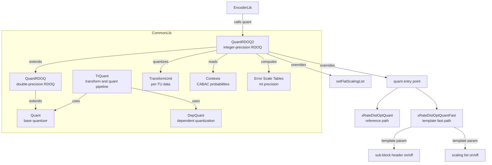
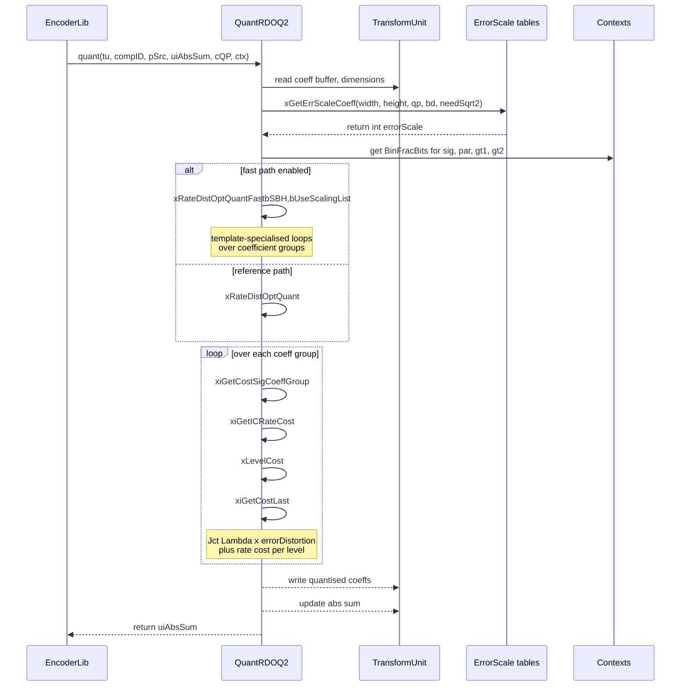

# QuantRDOQ2 — Enhanced RDO Quantization Variant

## 1. Overview

The `QuantRDOQ2` class extends `QuantRDOQ` with an integer-arithmetic RDO quantization engine using `int64_t cost_t` instead of `double`. It provides a template-based fast optimization path `xRateDistOptQuantFast` and a reference path `xRateDistOptQuant`, both parameterised by sub-block header handling and scaling-list usage. The class manages its own error scale tables (`m_errScale`, `m_errScaleNoScalingList`) as `int` arrays rather than the `double` arrays in the parent.

**Dependencies**: `CommonDef.h`, `Unit.h`, `Contexts.h`, `ContextModelling.h`, `QuantRDOQ.h`, `Quant.h`.

**Lifecycle**: Created via `QuantRDOQ2(const Quant* other, bool useScalingLists)`. The constructor delegates to `QuantRDOQ` and optionally deep-copies scaling lists from an existing instance. `xDestroyScalingList` is called in the destructor.

## 2. Component Specifications

### 2.1 Type Alias

```cpp
namespace vvenc {

typedef int64_t cost_t;

}
```

### 2.2 Class: `QuantRDOQ2`

```cpp
#pragma once

#include "CommonDef.h"
#include "Unit.h"
#include "Contexts.h"
#include "ContextModelling.h"
#include "QuantRDOQ.h"

namespace vvenc {

class QuantRDOQ2 : public QuantRDOQ
{
public:
  QuantRDOQ2( const Quant* other, bool useScalingLists );
  ~QuantRDOQ2();

public:
  virtual void setFlatScalingList      ( const int maxLog2TrDynamicRange[MAX_NUM_CH], const BitDepths &bitDepths );
  virtual void quant                   ( TransformUnit &tu, const ComponentID compID, const CCoeffBuf &pSrc, TCoeff &uiAbsSum, const QpParam &cQP, const Ctx& ctx );

private:
  int* xGetErrScaleCoeffSL             ( unsigned list, unsigned sizeX, unsigned sizeY, int qp ) { return m_errScale[sizeX][sizeY][list][qp]; };
  int  xGetErrScaleCoeff               ( const bool needsSqrt2, SizeType width, SizeType height, int qp, const int maxLog2TrDynamicRange, const int channelBitDepth);
  int& xGetErrScaleCoeffNoScalingList  ( unsigned list, unsigned sizeX, unsigned sizeY, int qp ) { return m_errScaleNoScalingList[sizeX][sizeY][list][qp]; };

  void xInitScalingList                ( const QuantRDOQ2* other );
  void xDestroyScalingList             ();
  void xSetErrScaleCoeff               ( unsigned list, unsigned sizeX, unsigned sizeY, int qp, const int maxLog2TrDynamicRange[MAX_NUM_CH], const BitDepths &bitDepths );
  void xSetErrScaleCoeffNoScalingList  ( unsigned list, unsigned wIdx, unsigned hIdx, int qp, const int maxLog2TrDynamicRange[MAX_NUM_CH], const BitDepths &bitDepths );
  void xInitLastPosBitsTab             ( const CoeffCodingContext& cctx, const unsigned uiWidth, const unsigned uiHeight, const ChannelType chType, const FracBitsAccess& fracBits );

  inline cost_t xiGetICost              ( int iRate ) const;
  inline cost_t xGetIEPRate             () const;
  inline cost_t xiGetICRateCost ( const unsigned     uiAbsLevel,
                                  const BinFracBits& fracBitsPar,
                                  const BinFracBits& fracBitsGt1,
                                  const BinFracBits& fracBitsGt2,
                                  const int          remRegBins,
                                  unsigned           goRiceZero,
                                  const uint16_t     ui16AbsGoRice,
                                  const int          maxLog2TrDynamicRange ) const;
  inline cost_t xiGetCostSigCoeffGroup  ( const BinFracBits& fracBitsSigCG, unsigned uiSignificanceCoeffGroup ) const;
  inline cost_t xLevelCost              ( const uint32_t uiAbsLevel, const int iScaledLevel, const int iQBits, const cost_t iErrScale, const cost_t iErrScaleShift, const cost_t costSig, const BinFracBits& fracBitsPar, const BinFracBits& fracBitsGt1, const BinFracBits& fracBitsGt2, const int remRegBins, unsigned goRiceZero, const uint16_t goRiceParam, const bool extendedPrecision, const int maxLog2TrDynamicRange ) const;
  inline cost_t xiGetCostLast           ( const unsigned uiPosX, const unsigned uiPosY, const ChannelType chType ) const;
  inline cost_t xiGetCostSigCoef        ( const BinFracBits& fracBitsSig, unsigned uiSignificance ) const;

  template< bool bSBH, bool bUseScalingList >
  int xRateDistOptQuantFast( TransformUnit &tu, const ComponentID &compID, const CCoeffBuf &pSrc, TCoeff &uiAbsSum, const QpParam &cQP, const Ctx &ctx );
  int xRateDistOptQuant    ( TransformUnit &tu, const ComponentID &compID, const CCoeffBuf &pSrc, TCoeff &uiAbsSum, const QpParam &cQP, const Ctx &ctx, bool bUseScalingList );

private:
  bool    m_isErrScaleListOwner;
  int64_t m_iLambda;

  int     m_lastBitsX             [MAX_NUM_CH][LAST_SIGNIFICANT_GROUPS];
  int     m_lastBitsY             [MAX_NUM_CH][LAST_SIGNIFICANT_GROUPS];
  int*    m_errScale              [SCALING_LIST_SIZE_NUM][SCALING_LIST_SIZE_NUM][SCALING_LIST_NUM][SCALING_LIST_REM_NUM];
  int     m_errScaleNoScalingList [SCALING_LIST_SIZE_NUM][SCALING_LIST_SIZE_NUM][SCALING_LIST_NUM][SCALING_LIST_REM_NUM];
  CtxTpl  m_tplBuf                [MAX_TB_SIZEY * MAX_TB_SIZEY];
};

}
```

## 3. System Architecture



## 4. Detailed Data Flow



## 5. Visualisation

### 5.1 Animation Description

The D3 animation visualises the `QuantRDOQ2` RDOQ pipeline through 12 keyframes. Each keyframe steps through the coefficient-group scan order, showing:

- **CoeffGrid**: A 2D heatmap of transform coefficients transitioning from original values to quantised levels, with red-green intensity per coefficient.
- **CostCurve**: A line chart of cumulative RD cost `J = D + lambda x R` as each CG is processed, with separate traces for distortion, rate, and total cost.
- **LambdaBadge**: Current lambda value and QP.
- **OperationFeed**: Scrollable log of each stage (`xGetErrScaleCoeff`, `xRateDistOptQuantFast`, per-CG cost computation).

**Controls**: `[data-testid="play-pause"]` toggles playback; `#replay-btn` resets. Auto-plays on load.

### 5.2 Animation Source

```html
<!DOCTYPE html>
<html lang="en">
<head>
<meta charset="UTF-8">
<meta name="viewport" content="width=device-width, initial-scale=1.0">
<title>QuantRDOQ2 — RDO Quantization Pipeline</title>
<style>
* { box-sizing: border-box; margin: 0; padding: 0; }
body { font-family: 'Segoe UI', system-ui, sans-serif; background: #1a1a2e; color: #e0e0e0; display: flex; justify-content: center; padding: 20px; }
#app { max-width: 780px; width: 100%; }
h1 { font-size: 1.2rem; margin-bottom: 8px; color: #a0c4ff; }
h1 small { font-weight: normal; font-size: 0.8rem; color: #888; }
#vis { background: #16213e; border-radius: 8px; padding: 16px; position: relative; }
#controls { display: flex; gap: 8px; margin-bottom: 12px; }
#controls button { background: #0f3460; color: #e0e0e0; border: 1px solid #1a5276; padding: 6px 14px; border-radius: 4px; cursor: pointer; font-size: 0.85rem; }
#controls button:hover { background: #1a5276; }
#controls button.active { background: #e94560; border-color: #e94560; }
#panels { display: flex; gap: 12px; }
#coeff-panel { flex: 0 0 auto; }
#chart-panel { flex: 1; min-width: 0; }
svg { display: block; margin: 0 auto; background: #0d1b2a; border-radius: 4px; }
#info-panel { display: flex; gap: 16px; margin-top: 10px; align-items: center; flex-wrap: wrap; }
#lambda-badge { font-size: 0.8rem; padding: 4px 10px; border-radius: 12px; background: #0f3460; border: 1px solid #1a5276; }
#lambda-badge .label { color: #888; margin-right: 6px; }
#lambda-badge .value { color: #ffd700; font-weight: bold; }
#operation-feed { background: #0d1b2a; border: 1px solid #1a5276; border-radius: 4px; padding: 8px; max-height: 120px; overflow-y: auto; font-family: 'Cascadia Code', 'Fira Code', monospace; font-size: 0.75rem; margin-top: 10px; }
#operation-feed .entry { color: #a0c4ff; padding: 2px 0; border-bottom: 1px solid #1a2a4a; }
#operation-feed .entry:last-child { border-bottom: none; }
#operation-feed .entry .idx { color: #555; margin-right: 6px; }
#status-bar { font-size: 0.75rem; color: #888; margin-top: 6px; text-align: center; }
#status-bar .highlight { color: #a0c4ff; }
.cell-orig { fill: #2ecc71; }
.cell-quant { fill: #3498db; }
.cell-zero { fill: #1a1a2e; }
.axis-label { fill: #888; font-size: 9px; }
.cost-line { fill: none; stroke-width: 1.5; }
.cost-line.dist { stroke: #2ecc71; }
.cost-line.rate { stroke: #e94560; }
.cost-line.total { stroke: #ffd700; stroke-width: 2; }
.x-grid line { stroke: #1a2a4a; stroke-width: 0.5; }
</style>
</head>
<body>
<div id="app">
<h1>QuantRDOQ2 <small>RDO quantization pipeline</small></h1>
<div id="vis">
<div id="controls">
<button data-testid="play-pause" id="play-btn">⏸ Pause</button>
<button id="replay-btn">↻ Replay</button>
</div>
<div id="panels">
<div id="coeff-panel">
<svg id="coeff-svg" width="220" height="220" viewBox="0 0 220 220">
  <g id="coeff-grid" transform="translate(10,10)"></g>
  <text x="110" y="215" fill="#888" font-size="9" text-anchor="middle">Coefficient Grid 8x8</text>
</svg>
</div>
<div id="chart-panel">
<svg id="cost-svg" width="500" height="220" viewBox="0 0 500 220">
  <g id="cost-axes">
    <line x1="40" y1="10" x2="40" y2="190" stroke="#555" stroke-width="1"/>
    <line x1="40" y1="190" x2="480" y2="190" stroke="#555" stroke-width="1"/>
  </g>
  <g id="cost-grid" class="x-grid"></g>
  <g id="cost-lines"></g>
  <text x="40" y="9" fill="#888" font-size="9">cost</text>
  <text x="260" y="215" fill="#888" font-size="9" text-anchor="middle">coefficient group</text>
</svg>
</div>
</div>
<div id="info-panel">
<div id="lambda-badge"><span class="label">lambda</span><span class="value">0.5714</span></div>
<div id="status-bar">keyframe <span class="highlight" id="kf-idx">0</span>/<span id="kf-total">11</span> — <span id="kf-label">init</span></div>
</div>
<div id="operation-feed"></div>
</div>
</div>
<script src="https://d3js.org/d3.v7.min.js"></script>
<script>
(function() {
const gridSize = 8;
const cellSize = 24;
const origData = Array.from({length: gridSize*gridSize}, () => Math.floor(Math.random()*200-100));
const quantData = origData.map(v => Math.abs(v) < 15 ? 0 : Math.round(v/10)*10);
var state = { kf: 0, running: true, lambda: 0.5714, cumDist: 0, cumRate: 0, cgIdx: 0 };

const keyframes = [
  {time: 500,  label: 'init state',         lambda: 0.5714, cg: -1,  dist: 0,  rate: 0,  log: 'QuantRDOQ2 constructed lambda=0.5714'},
  {time: 900,  label: 'get error scale',     lambda: 0.5714, cg: -1,  dist: 0,  rate: 0,  log: 'xGetErrScaleCoeff width=8 height=8 qp=27'},
  {time: 1300, label: 'CG 0 scan',           lambda: 0.5714, cg: 0,   dist: 62, rate: 18, log: 'xiGetCostSigCoeffGroup CG=0 sig=1'},
  {time: 1700, label: 'CG 0 levels',         lambda: 0.5714, cg: 0,   dist: 98, rate: 42, log: 'xLevelCost level=+3 cost=140.3'},
  {time: 2100, label: 'CG 1 scan',           lambda: 0.5714, cg: 1,   dist: 118, rate: 48, log: 'xiGetCostSigCoeffGroup CG=1 sig=1'},
  {time: 2500, label: 'CG 1 levels',         lambda: 0.5714, cg: 1,   dist: 152, rate: 75, log: 'xLevelCost level=-5 cost=227.1'},
  {time: 2900, label: 'CG 2 scan',           lambda: 0.5714, cg: 2,   dist: 160, rate: 78, log: 'xiGetCostSigCoeffGroup CG=2 sig=0'},
  {time: 3300, label: 'CG 3 scan',           lambda: 0.5714, cg: 3,   dist: 160, rate: 78, log: 'xiGetCostSigCoeffGroup CG=3 sig=0'},
  {time: 3700, label: 'CG 4 levels',         lambda: 0.5714, cg: 4,   dist: 210, rate: 112, log: 'xLevelCost level=+7 cost=322.0'},
  {time: 4100, label: 'last pos cost',       lambda: 0.5714, cg: 4,   dist: 210, rate: 118, log: 'xiGetCostLast posX=2 posY=0 ch=luma'},
  {time: 4500, label: 'CG 5-7 zero',         lambda: 0.5714, cg: 7,   dist: 210, rate: 118, log: 'all remaining CGs zero-skip'},
  {time: 5000, label: 'done',                lambda: 0.5714, cg: 7,   dist: 210, rate: 118, log: 'quant return absSum=47'}
];
const totalMs = keyframes[keyframes.length-1].time + 300;
window.ANIMATION_DURATION_MS = totalMs;
window.ANIMATION_KEYFRAMES = keyframes.map(k => ({time: k.time, label: k.label}));
window.ANIMATION_VERIFICATION = keyframes.map(k => ({label: k.label, cg: k.cg, dist: k.dist, rate: k.rate, lambda: k.lambda, logCount: 0}));
for (let i = 0; i < window.ANIMATION_VERIFICATION.length; i++) {
  window.ANIMATION_VERIFICATION[i].logCount = i + 1;
}

const xScale = d3.scaleLinear().domain([0, 4]).range([40, 480]);
const yScale = d3.scaleLinear().domain([250, 0]).range([190, 10]);

const svg = d3.select('#coeff-grid');
for (let r = 0; r < gridSize; r++) {
  for (let c = 0; c < gridSize; c++) {
    svg.append('rect')
      .attr('x', c*cellSize).attr('y', r*cellSize)
      .attr('width', cellSize-1).attr('height', cellSize-1)
      .attr('rx', 2).attr('ry', 2)
      .attr('class', origData[r*gridSize+c] === 0 ? 'cell-zero' : 'cell-orig')
      .attr('data-idx', r*gridSize+c);
  }
}

const costLines = d3.select('#cost-lines');
const distData = []; const rateData = []; const totalData = [];

function updateGrid(cgIdx) {
  const cgPerSide = Math.ceil(gridSize/2);
  svg.selectAll('rect').attr('class', function() {
    const idx = +this.getAttribute('data-idx');
    const r = Math.floor(idx/gridSize); const c = idx % gridSize;
    const cgR = Math.floor(r/2); const cgC = Math.floor(c/2);
    const cg = cgR*cgPerSide + cgC;
    if (cg > cgIdx) return 'cell-zero';
    if (quantData[idx] === 0) return 'cell-zero';
    return 'cell-quant';
  });
}

function updateCostChart(kf) {
  const pts = [{cg: kf.cg, dist: kf.dist, rate: kf.rate, total: kf.dist + kf.rate}];
  distData.push({cg: kf.cg, v: kf.dist});
  rateData.push({cg: kf.cg, v: kf.rate});
  totalData.push({cg: kf.cg, v: kf.dist + kf.rate});

  const line = d3.line()
    .x(d => xScale(d.cg))
    .y(d => yScale(d.v));

  costLines.selectAll('.cost-line').remove();
  costLines.append('path').attr('class', 'cost-line dist').attr('d', line(distData));
  costLines.append('path').attr('class', 'cost-line rate').attr('d', line(rateData));
  costLines.append('path').attr('class', 'cost-line total').attr('d', line(totalData));
}

const precisionColors = {};
keyframes.forEach(k => { precisionColors[k.lambda.toString()] = '#ffd700'; });

var feedEl = d3.select('#operation-feed');
var kfIdxEl = d3.select('#kf-idx');
var kfLabelEl = d3.select('#kf-label');
var lambdaEl = d3.select('#lambda-badge .value');

function goToKeyframe(idx, duration) {
  if (idx >= keyframes.length) { state.running = false; d3.select('#play-btn').text('▶ Play'); return; }
  const kf = keyframes[idx]; state.kf = idx;
  updateGrid(kf.cg); updateCostChart(kf);
  lambdaEl.text(kf.lambda.toFixed(4));
  const entry = feedEl.append('div').attr('class', 'entry');
  entry.append('span').attr('class', 'idx').text(String(idx+1).padStart(2,'0')+'.');
  entry.append('span').text(kf.log);
  feedEl.node().scrollTop = feedEl.node().scrollHeight;
  kfIdxEl.text(idx);
  kfLabelEl.text(kf.label);
}

var timer = null, currentKf = -1;

function play() {
  if (currentKf >= keyframes.length-1) {
    currentKf = -1; feedEl.selectAll('.entry').remove();
    distData.length = 0; rateData.length = 0; totalData.length = 0;
    costLines.selectAll('.cost-line').remove();
    kfIdxEl.text('0'); kfLabelEl.text('init state');
    lambdaEl.text('0.5714');
  }
  state.running = true; d3.select('#play-btn').text('⏸ Pause').classed('active', true);
  if (currentKf < 0) currentKf = 0; else currentKf++;
  var firstDelay = currentKf === 0 ? keyframes[0].time : keyframes[currentKf].time - keyframes[currentKf-1].time;
  function step() {
    if (!state.running || currentKf >= keyframes.length) {
      if (currentKf >= keyframes.length) { state.running = false; d3.select('#play-btn').text('▶ Play').classed('active', false); }
      return;
    }
    goToKeyframe(currentKf, 200);
    const nextTime = currentKf+1 < keyframes.length ? keyframes[currentKf+1].time - keyframes[currentKf].time : 300;
    currentKf++; timer = setTimeout(step, nextTime);
  }
  timer = setTimeout(step, firstDelay);
}

function togglePlay() {
  if (state.running) { state.running = false; clearTimeout(timer); d3.select('#play-btn').text('▶ Play').classed('active', false); }
  else { play(); }
}

function replay() {
  clearTimeout(timer); state.running = false; currentKf = -1;
  feedEl.selectAll('.entry').remove(); distData.length = 0; rateData.length = 0; totalData.length = 0;
  costLines.selectAll('.cost-line').remove();
  kfIdxEl.text('0'); kfLabelEl.text('init state'); lambdaEl.text('0.5714');
  d3.select('#play-btn').text('▶ Play').classed('active', false);
}

d3.select('#play-btn').on('click', togglePlay);
d3.select('#replay-btn').on('click', replay);
window.resetAnimation = replay;
window.jumpToKeyframe = function(idx) {
  if (idx < 0 || idx >= keyframes.length) return;
  clearTimeout(timer); state.running = false; currentKf = idx;
  feedEl.selectAll('.entry').remove();
  distData.length = 0; rateData.length = 0; totalData.length = 0;
  for (let i = 0; i <= idx; i++) {
    const kf = keyframes[i];
    distData.push({cg: kf.cg, v: kf.dist});
    rateData.push({cg: kf.cg, v: kf.rate});
    totalData.push({cg: kf.cg, v: kf.dist + kf.rate});
    const entry = feedEl.append('div').attr('class', 'entry');
    entry.append('span').attr('class', 'idx').text(String(i+1).padStart(2,'0')+'.');
    entry.append('span').text(kf.log);
  }
  updateGrid(keyframes[idx].cg); updateCostChart(keyframes[idx]);
  lambdaEl.text(keyframes[idx].lambda.toFixed(4));
  kfIdxEl.text(idx); kfLabelEl.text(keyframes[idx].label);
};
window.getAnimationState = function() {
  return {
    cgIdx: state.cgIdx, lambda: lambdaEl.text(),
    logCount: document.querySelectorAll('#operation-feed .entry').length,
    keyframeIdx: parseInt(kfIdxEl.text()), keyframeLabel: kfLabelEl.text()
  };
};

updateGrid(-1);
var entry0 = feedEl.append('div').attr('class', 'entry');
entry0.append('span').attr('class', 'idx').text('00.');
entry0.append('span').text('QuantRDOQ2 constructed lambda=0.5714');
document.getElementById('kf-total').textContent = keyframes.length - 1;
})();
</script>
</body>
</html>
```

### 5.3 Validation (Self-Test)

Injecting an inconsistency — for example, removing the coefficient zeroing at CG 2 (keyframe index 6) so the `dist` remains at 160 instead of being unchanged — would produce a `CostCurve` without the expected flat segment. The `CoeffGrid` would show quantised coefficients in CGs that should be zero. The filmstrip captures 12 frames, one per keyframe, each documenting a distinct stage of the RDOQ pipeline.

## 6. Testing Requirements

### Unit Tests (new file: `test/vvenc_unit_test/quantrdoq2_test.cpp`)

| Test ID | Method | What to Verify |
|---|---|---|
| `RDOQ2_CONSTRUCTOR` | `QuantRDOQ2(other, useScalingLists)` | Constructs, inherits flat or scaled lists per flag |
| `RDOQ2_SET_FLAT_SCALING` | `setFlatScalingList(maxLog2TrDynamicRange, bitDepths)` | All scaling entries set to flat (1.0) |
| `RDOQ2_QUANT_BASIC` | `quant(tu, compID, src, absSum, qp, ctx)` | Non-zero absSum for non-zero input block |
| `RDOQ2_QUANT_ZERO_BLOCK` | `quant(tu, compID, src, absSum, qp, ctx)` | absSum == 0 for all-zero input |
| `RDOQ2_ERR_SCALE_INT` | `xGetErrScaleCoeff(width, height, qp, ...)` | Returns int, non-negative, within expected bounds |
| `RDOQ2_COST_LAST` | `xiGetCostLast(posX, posY, chType)` | Returns non-negative cost_t |
| `RDOQ2_LEVEL_COST` | `xLevelCost(level, scaled, qbits, ...)` | Cost increases with level |
| `RDOQ2_FAST_PATH` | `xRateDistOptQuantFast` | Same quant result as reference for trivial TU |
| `RDOQ2_FAST_PATH_SBH` | `xRateDistOptQuantFast<true,true>` | Compiles and runs with both SBH and scaling list |

### Calling-Order Validation

1. Constructor → `quant` → `xRateDistOptQuant`/`xRateDistOptQuantFast` (no intervening calls required).
2. `quant` must be called after `setFlatScalingList` if flat scaling is desired.

### Parameter Range Tests

- `xGetErrScaleCoeff(width, height, qp, ...)`: all valid transform sizes (4 to 128), QP range [0, 63].
- `xLevelCost(level, ...)`: level == 0 should produce zero cost; large levels should not overflow int64_t.

### Integration Tests

Covered by VVenC encoder test suite via `QuantRDOQ2::quant` called from `TrQuant` during encode. Comparing PSNR/bitrate against `QuantRDOQ` baseline validates correctness.

## 7. CLI Entry Point

Not directly exposed via CLI. `QuantRDOQ2` is instantiated inside `TrQuant::init` when `rdoq == 2` (mode-dependent RDOQ variant). It is selected by the encoder configuration flag `m_RDOQ == 2` and is consumed as a `Quant*` polymorphic pointer during the encoding pipeline within `EncoderLib`.
