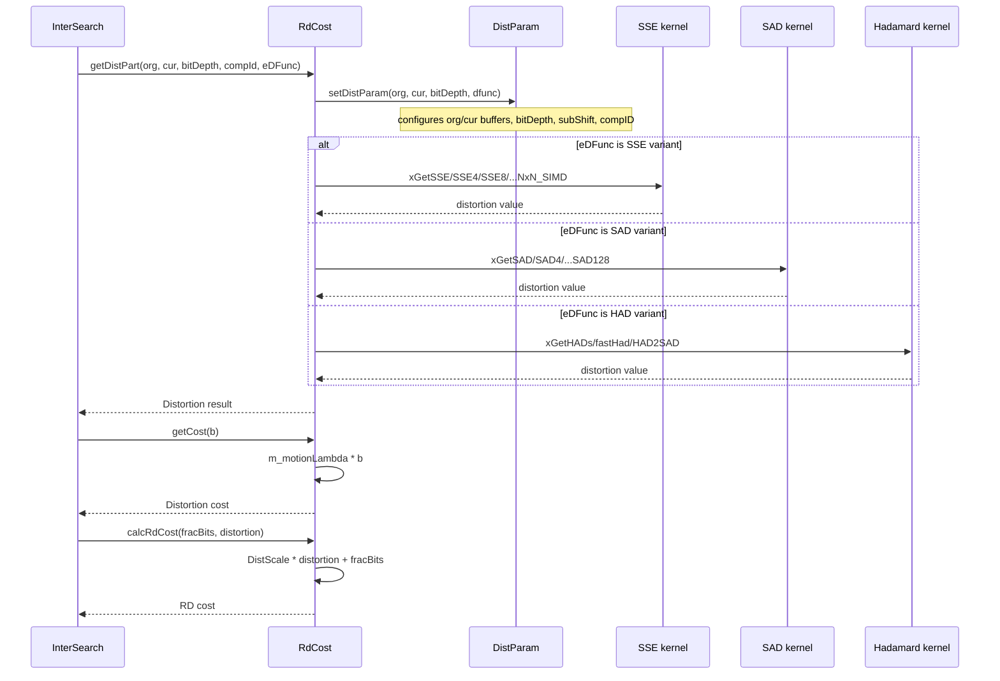
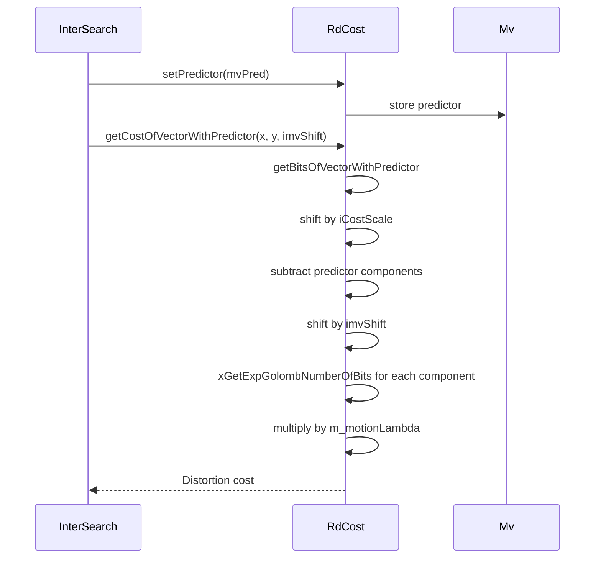

# RdCost — Rate-Distortion Cost Computation

## 1. Overview

The `RdCost` class computes distortion metrics (SAD, SSE, Hadamard, SATD) and RD costs for VVC encoding. It manages lambda/QP relationships, weighted distortion for luma/chroma, motion cost with Exp-Golomb coding, and SIMD-optimized distortion kernels (SSE, SAD, Hadamard) on x86 and ARM.

**Dependencies**: `CommonDef.h`, `Mv.h`, `Unit.h`, `Slice.h`, SIMD backends (x86_simd, arm_simd).

**Lifecycle**: Created once per encoder instance via `create()`. SIMD init is called if enabled. Lambda is set per-frame via `setLambda()`. No explicit uninit required.

## 2. Component Specifications

### 2.1 Class: `DistParam`

```cpp
namespace vvenc {

class DistParam
{
public:
  CPelBuf               org;
  CPelBuf               cur;
  FpDistFunc            distFunc  = nullptr;
  FpDistFuncX5          dmvrSadX5 = nullptr;
#if ENABLE_MEASURE_SEARCH_SPACE
  FpDistFunc            xDistFunc = nullptr;
#endif
  int                   bitDepth    = 0;
  int                   subShift    = 0;
  ComponentID           compID      = MAX_NUM_COMP;
  bool                  applyWeight = false;
  Distortion            maximumDistortionForEarlyExit = MAX_DISTORTION;
  const WPScalingParam* wpCur         = nullptr;
  const CPelBuf*        orgLuma       = nullptr;
  const Pel*            mask          = nullptr;
  int                   maskStride    = 0;
  int                   stepX         = 0;
  int                   maskStride2   = 0;

  DistParam() = default;

  DistParam(const CPelBuf& _org, const CPelBuf& _cur, FpDistFunc _distFunc,
            int _bitDepth, int _subShift, ComponentID _compID);
};

}
```

### 2.2 Class: `RdCost`

```cpp
namespace vvenc {

class RdCost
{
public:
  Distortion (*m_fxdWtdPredPtr)(const DistParam& dp, uint32_t fixedWeight);
  Distortion (*m_wtdPredPtr[2])(const DistParam& dp, ChromaFormat chmFmt,
                                const uint32_t* lumaWeights);
  FpDistFunc   m_afpDistortFunc[2][DF_TOTAL_FUNCTIONS];
  FpDistFuncX5 m_afpDistortFuncX5[2];

  // Construction / init
  RdCost();
  virtual ~RdCost();
  void create(bool enableOpt = true);

  // SIMD init
#if defined(TARGET_SIMD_X86) && ENABLE_SIMD_OPT_DIST
  void initRdCostX86();
  template <X86_VEXT vext> void _initRdCostX86();
#endif
#if defined(TARGET_SIMD_ARM) && ENABLE_SIMD_OPT_DIST
  void initRdCostARM();
  template <ARM_VEXT vext> void _initRdCostARM();
#endif

  // Configuration
  void setReshapeParams(const uint32_t* pPLUT, double chrWght);
  void setDistortionWeight(const ComponentID compID, const double distortionWeight);
  void setLambda(double dLambda, const BitDepths& bitDepths);
  void setCostMode(vvencCostMode m);
  void setReshapeInfo(uint32_t type, int lumaBD, ChromaFormat cf);

  // Query
  double getLambda(bool unadj = false);
  double getChromaWeight();
  double calcRdCost(uint64_t fracBits, Distortion distortion,
                    bool useUnadjustedLambda = true) const;

  // Distortion functions
  Distortion getDistPart(const CPelBuf& org, const CPelBuf& cur, int bitDepth,
                         const ComponentID compId, DFunc eDFunc,
                         const CPelBuf* orgLuma = NULL);

  // DistParam helpers
  void      setDistParam(DistParam& rcDP, const CPelBuf& org, const Pel* piRefY,
                         int iRefStride, int bitDepth, ComponentID compID,
                         int subShiftMode = 0, int useHadamard = 0);
  DistParam setDistParam(const CPelBuf& org, const CPelBuf& cur,
                         int bitDepth, DFunc dfunc);
  DistParam setDistParam(const Pel* pOrg, const Pel* piRefY,
                         int iOrgStride, int iRefStride, int bitDepth,
                         ComponentID compID, int width, int height,
                         int subShift, bool isDMVR = false);
  void setDistParamGeo(DistParam& rcDP, const CPelBuf& org, const Pel* piRefY,
                       int iRefStride, const Pel* mask, int iMaskStride,
                       int stepX, int iMaskStride2, int bitDepth,
                       ComponentID compID);

  // Motion cost
  double     getMotionLambda() const;
  void       selectMotionLambda();
  void       setPredictor(const Mv& rcMv);
  void       setCostScale(int iCostScale);
  Distortion getCost(uint32_t b) const;
  void       setPredictorsIBC(Mv* pcMv);
  void       getMotionCostIBC(int add);
  Distortion getBvCostMultiplePredsIBC(int x, int y, bool useIMV);
  Distortion getCostOfVectorWithPredictor(const int x, const int y,
                                          const unsigned imvShift);
  uint32_t   getBitsOfVectorWithPredictor(const int x, const int y,
                                          const unsigned imvShift);

  // Static SSE methods
  static Distortion xGetSSE(const DistParam& pcDtParam);
  static Distortion xGetSSE4(const DistParam& pcDtParam);
  static Distortion xGetSSE8(const DistParam& pcDtParam);
  static Distortion xGetSSE16(const DistParam& pcDtParam);
  static Distortion xGetSSE32(const DistParam& pcDtParam);
  static Distortion xGetSSE64(const DistParam& pcDtParam);
  static Distortion xGetSSE128(const DistParam& pcDtParam);
  Distortion xGetSSE_WTD(const DistParam& pcDtParam) const;

  // Static SAD methods
  static Distortion xGetSAD(const DistParam& pcDtParam);
  static Distortion xGetSAD4(const DistParam& pcDtParam);
  static Distortion xGetSAD8(const DistParam& pcDtParam);
  static Distortion xGetSAD16(const DistParam& pcDtParam);
  static Distortion xGetSAD32(const DistParam& pcDtParam);
  static Distortion xGetSAD64(const DistParam& pcDtParam);
  static Distortion xGetSAD128(const DistParam& pcDtParam);
  static Distortion xGetSADwMask(const DistParam& pcDtParam);
  static void xGetSAD8X5(const DistParam& pcDtParam, Distortion* cost,
                         bool isCalCentrePos);
  static void xGetSAD16X5(const DistParam& pcDtParam, Distortion* cost,
                          bool isCalCentrePos);

  // Static Hadamard methods
  static Distortion xCalcHADs2x2(const Pel* piOrg, const Pel* piCur,
                                 int iStrideOrg, int iStrideCur);
  static Distortion xGetHAD2SADs(const DistParam& pcDtParam);
  template<bool fastHad>
  static Distortion xGetHADs(const DistParam& pcDtParam);

  // SIMD templates (x86)
#if defined(TARGET_SIMD_X86) && ENABLE_SIMD_OPT_DIST
  template<X86_VEXT vext>
  static Distortion xGetSSE_SIMD(const DistParam& pcDtParam);
  template<int iWidth, X86_VEXT vext>
  static Distortion xGetSSE_NxN_SIMD(const DistParam& pcDtParam);
  template<X86_VEXT vext>
  static Distortion xGetSAD_SIMD(const DistParam& pcDtParam);
  template<int iWidth, X86_VEXT vext>
  static Distortion xGetSAD_NxN_SIMD(const DistParam& pcDtParam);
  template<X86_VEXT vext>
  static void xGetSADX5_8xN_SIMD(const DistParam& rcDtParam,
                                  Distortion* cost, bool isCalCentrePos);
  template<X86_VEXT vext>
  static void xGetSADX5_16xN_SIMD_X86(const DistParam& rcDtParam,
                                       Distortion* cost, bool isCalCentrePos);
  template<X86_VEXT vext, bool fastHad>
  static Distortion xGetHADs_SIMD(const DistParam& pcDtParam);
  template<X86_VEXT vext>
  static Distortion xGetHAD2SADs_SIMD(const DistParam& rcDtParam);
  template<X86_VEXT vext>
  static Distortion xGetSADwMask_SIMD(const DistParam& pcDtParam);
#endif

  // Exp-Golomb coding bits
  static uint32_t xGetExpGolombNumberOfBits(int iVal);

  // Unadjusted lambda management
  void saveUnadjustedLambda();

private:
  // Note: g_vvenc.dist sub-struct is declared but syncToGlobal() is not yet wired for RdCost
  vvencCostMode  m_costMode;
  double         m_distortionWeight[MAX_NUM_COMP];
  double         m_dLambda;
  double         m_dLambda_unadjusted;
  double         m_DistScaleUnadjusted;
  const uint32_t* m_reshapeLumaLevelToWeightPLUT;
  uint32_t       m_signalType;
  double         m_chromaWeight;
  int            m_lumaBD;
  ChromaFormat   m_cf;
  double         m_DistScale;
  double         m_dLambdaMotionSAD;
  Mv             m_mvPredictor;
  Mv             m_bvPredictors[2];
  double         m_motionLambda;
  int            m_iCostScale;
  double         m_dCostIBC;
};

}
```

### 2.3 Free Types

```cpp
namespace vvenc {

typedef Distortion (*FpDistFunc)(const DistParam&);
typedef void       (*FpDistFuncX5)(const DistParam&, Distortion*, bool);

enum DFunc : uint8_t
{
  DF_SSE    = 0,    DF_SSE2  = 1,    DF_SSE4  = 2,
  DF_SSE8   = 3,    DF_SSE16 = 4,    DF_SSE32 = 5,
  DF_SSE64  = 6,    DF_SSE128 = 7,
  DF_SAD    = 8,    DF_SAD2  = 9,    DF_SAD4  = 10,
  DF_SAD8   = 11,   DF_SAD16 = 12,   DF_SAD32 = 13,
  DF_SAD64  = 14,   DF_SAD128 = 15,
  DF_HAD    = 16,   DF_HAD2  = 17,   DF_HAD4  = 18,
  DF_HAD8   = 19,   DF_HAD16 = 20,   DF_HAD32 = 21,
  DF_HAD64  = 22,   DF_HAD128 = 23,
  DF_HAD_2SAD = 24,
  DF_SAD_WITH_MASK = 25,
  DF_HAD_fast = 26,
  DF_HAD2_fast = 27, DF_HAD4_fast = 28, DF_HAD8_fast = 29,
  DF_HAD16_fast = 30, DF_HAD32_fast = 31, DF_HAD64_fast = 32,
  DF_HAD128_fast = 33,
  DF_TOTAL_FUNCTIONS = 34,
  DF_SSE_WTD = 0xf2u
};

}
```

## 3. System Architecture

```mermaid
graph TB
    subgraph CommonLib
        RdCost[RdCost<br/>RD cost computation]
        DistParam[DistParam<br/>distortion parameter bundle]
        Mv[Mv<br/>motion vector]
        Slice[Slice<br/>picture type info]
        Unit[Unit<br/>coding unit structures]

        subgraph DistortionMetrics
            SSE[SSE<br/>xGetSSE / xGetSSE_N]
            SAD[SAD<br/>xGetSAD / xGetSAD_N]
            HAD[HAD<br/>xGetHADs / xCalcHADs2x2]
            HADfast[HAD fast<br/>xGetHADs with fastHad]
            WTD[SSE WTD<br/>xGetSSE_WTD weighted]
            Mask[SAD w/ Mask<br/>xGetSADwMask]
        end

        subgraph MotionCost
            ExpGolomb[xGetExpGolombNumberOfBits<br/>bits for MV diff]
            getBitsOfVectorWithPredictor[getBitsOfVectorWithPredictor<br/>MV diff coding cost]
            getCostOfVectorWithPredictor[getCostOfVectorWithPredictor<br/>lambda * bits]
        end

        subgraph Lambda
            m_dLambda[lambda value]
            m_dLambdaMotionSAD[motion SAD lambda]
            calcRdCost[calcRdCost<br/>DistScale * distortion + fracBits]
        end
    end

    RdCost --> DistParam
    RdCost --> SSE
    RdCost --> SAD
    RdCost --> HAD
    RdCost --> HADfast
    RdCost --> WTD
    RdCost --> Mask
    RdCost --> ExpGolomb
    RdCost --> Mv
    RdCost --> Slice
    RdCost --> Unit

    InterSearch[InterSearch] -->|computes| RdCost
    RdCost -->|motion cost| InterSearch
    RdCost -->|distortion| InterSearch
    RdCost -->|RD cost| EncoderLib[EncoderLib]
    RdCost -->|lambda| EncoderLib
```



## 4. Detailed Data Flow

### 4.1 Distortion Computation Path



### 4.2 Motion Cost with Exp-Golomb



## 5. Visualisation

### 5.1 Animation Description

The D3 animation visualises the `RdCost` distortion pipeline by stepping through 20 keyframes — one per distinct method family. Each keyframe updates:

- **DistortionBars**: Two bar groups (SSE=blue, SAD=red, HAD=green) with height proportional to computed distortion.
- **FuncSelector**: A badge showing the currently active `DFunc` value with color per function family.
- **OperationFeed**: A scrollable log that prepends each distortion/cost call.
- **LambdaOverlay**: A horizontal line and numeric label showing the current lambda scaling factor, with $J = D + \lambda R$ formula displayed.

**Controls**:
- `[data-testid="play-pause"]` button toggles playback
- `#replay` button resets and restarts
- The animation auto-plays on load

### 5.2 Animation Source

```html
<!DOCTYPE html>
<html lang="en">
<head>
<meta charset="UTF-8">
<meta name="viewport" content="width=device-width, initial-scale=1.0">
<title>RdCost — Distortion & RD Cost Animation</title>
<style>
* { box-sizing: border-box; margin: 0; padding: 0; }
body { font-family: 'Segoe UI', system-ui, sans-serif; background: #1a1a2e; color: #e0e0e0; display: flex; justify-content: center; padding: 20px; }
#app { max-width: 760px; width: 100%; }
h1 { font-size: 1.2rem; margin-bottom: 8px; color: #a0c4ff; }
h1 small { font-weight: normal; font-size: 0.8rem; color: #888; }
#vis { background: #16213e; border-radius: 8px; padding: 16px; position: relative; }
#controls { display: flex; gap: 8px; margin-bottom: 12px; }
#controls button { background: #0f3460; color: #e0e0e0; border: 1px solid #1a5276; padding: 6px 14px; border-radius: 4px; cursor: pointer; font-size: 0.85rem; }
#controls button:hover { background: #1a5276; }
#controls button.active { background: #e94560; border-color: #e94560; }
#svg-container { position: relative; }
svg { display: block; margin: 0 auto; background: #0d1b2a; border-radius: 4px; }
#info-panel { display: flex; gap: 16px; margin-top: 10px; align-items: center; flex-wrap: wrap; }
#func-badge { font-size: 0.8rem; padding: 4px 10px; border-radius: 12px; background: #0f3460; border: 1px solid #1a5276; }
#func-badge .label { color: #888; margin-right: 6px; }
#func-badge .value { color: #fff; font-weight: bold; }
#lambda-display { font-size: 0.8rem; color: #f39c12; }
#operation-feed { background: #0d1b2a; border: 1px solid #1a5276; border-radius: 4px; padding: 8px; max-height: 120px; overflow-y: auto; font-family: 'Cascadia Code', 'Fira Code', monospace; font-size: 0.75rem; margin-top: 10px; }
#operation-feed .entry { color: #a0c4ff; padding: 2px 0; border-bottom: 1px solid #1a2a4a; }
#operation-feed .entry:last-child { border-bottom: none; }
#operation-feed .entry .idx { color: #555; margin-right: 6px; }
#operation-feed .entry.sse { color: #4a9eff; }
#operation-feed .entry.sad { color: #e94560; }
#operation-feed .entry.had { color: #2ecc71; }
#operation-feed .entry.cost { color: #f39c12; }
#status-bar { font-size: 0.75rem; color: #888; margin-top: 6px; text-align: center; }
#status-bar .highlight { color: #a0c4ff; }
.axis-label { fill: #888; font-size: 10px; }
.bar-sse { fill: #4a9eff; }
.bar-sad { fill: #e94560; }
.bar-had { fill: #2ecc71; }
.bar-cost { fill: #f39c12; }
.lambda-line { stroke: #f39c12; stroke-width: 1; stroke-dasharray: 4,4; }
.lambda-label { fill: #f39c12; font-size: 9px; }
.rd-formula { fill: #888; font-size: 10px; }
</style>
</head>
<body>
<div id="app">
<h1>RdCost <small>distortion and RD cost pipeline</small></h1>
<div id="vis">
<div id="controls">
<button data-testid="play-pause" id="play-btn">⏸ Pause</button>
<button id="replay-btn">↻ Replay</button>
</div>
<div id="svg-container">
<svg id="rdcost-svg" width="720" height="320" viewBox="0 0 720 320">
  <defs>
    <clipPath id="bar-clip"><rect x="0" y="0" width="720" height="320"/></clipPath>
  </defs>
  <g id="grid-lines"></g>
  <g id="lambda-overlay" opacity="0">
    <line class="lambda-line" id="lambda-line" x1="80" x2="700" y1="60" y2="60"/>
    <text class="lambda-label" id="lambda-label" x="702" y="64">lambda</text>
    <text class="rd-formula" id="rd-formula" x="80" y="20">J = D + lambda * R</text>
  </g>
  <g id="bars" clip-path="url(#bar-clip)">
    <rect id="bar-sse" class="bar-sse" x="80" y="80" width="0" height="40" rx="3" ry="3"/>
    <text id="label-sse" x="85" y="105" fill="#fff" font-size="11" font-family="monospace">SSE: 0</text>
    <rect id="bar-sad" class="bar-sad" x="80" y="130" width="0" height="40" rx="3" ry="3"/>
    <text id="label-sad" x="85" y="155" fill="#fff" font-size="11" font-family="monospace">SAD: 0</text>
    <rect id="bar-had" class="bar-had" x="80" y="180" width="0" height="40" rx="3" ry="3"/>
    <text id="label-had" x="85" y="205" fill="#fff" font-size="11" font-family="monospace">HAD: 0</text>
    <rect id="bar-cost" class="bar-cost" x="80" y="230" width="0" height="40" rx="3" ry="3"/>
    <text id="label-cost" x="85" y="255" fill="#fff" font-size="11" font-family="monospace">Cost: 0</text>
  </g>
  <g id="flash-grp">
    <rect class="flash-overlay" id="flash-rect" x="80" y="60" width="620" height="220" rx="4" style="opacity:0;pointer-events:none"/>
  </g>
  <text x="80" y="305" fill="#555" font-size="9" font-family="monospace">0</text>
  <text x="700" y="305" fill="#555" font-size="9" font-family="monospace" text-anchor="end">distortion</text>
  <text x="80" y="42" fill="#888" font-size="10" font-family="monospace">Distortion Metrics & RD Cost</text>
</svg>
</div>
<div id="info-panel">
<div id="func-badge"><span class="label">function</span><span class="value">SSE</span></div>
<div id="lambda-display">lambda: <span id="lambda-value">0.000</span></div>
<div id="status-bar">keyframe <span class="highlight" id="kf-idx">0</span>/<span id="kf-total">19</span> — <span id="kf-label">init</span></div>
</div>
<div id="operation-feed"></div>
</div>
</div>
<script src="https://d3js.org/d3.v7.min.js"></script>
<script>
(function() {
const MAX_DIST = 50000;
const xScale = d3.scaleLinear().domain([0, MAX_DIST]).range([0, 600]);

const state = {
  sse: 0, sad: 0, had: 0, cost: 0,
  func: 'SSE',
  lambda: 0.57,
  running: true,
  kf: 0
};

const keyframes = [
  {time: 500,  label: 'init',          sse: 0,     sad: 0,     had: 0,     cost: 0,     func: 'SSE',  lambda: 0.57, log: 'RdCost created, lambda=0.57'},
  {time: 800,  label: 'setLambda',     sse: 0,     sad: 0,     had: 0,     cost: 0,     func: 'SSE',  lambda: 1.20, log: 'setLambda 1.20, QP=32'},
  {time: 1100, label: 'SSE 4x4',       sse: 4200,  sad: 0,     had: 0,     cost: 0,     func: 'SSE',  lambda: 1.20, log: 'xGetSSE4 block 4x4 -> 4200'},
  {time: 1400, label: 'SSE 8x8',       sse: 18200, sad: 0,     had: 0,     cost: 0,     func: 'SSE',  lambda: 1.20, log: 'xGetSSE8 block 8x8 -> 18200'},
  {time: 1700, label: 'SSE 16x16',     sse: 72000, sad: 0,     had: 0,     cost: 0,     func: 'SSE',  lambda: 1.20, log: 'xGetSSE16 block 16x16 -> 72000'},
  {time: 2000, label: 'SSE clipped',   sse: 50000, sad: 0,     had: 0,     cost: 0,     func: 'SSE',  lambda: 1.20, log: 'xGetSSE32 block 32x32 -> clipped'},
  {time: 2300, label: 'SAD 8x8',       sse: 50000, sad: 3200,  had: 0,     cost: 0,     func: 'SAD',  lambda: 1.20, log: 'xGetSAD8 block 8x8 -> 3200'},
  {time: 2600, label: 'SAD 16x16',     sse: 50000, sad: 12800, had: 0,     cost: 0,     func: 'SAD',  lambda: 1.20, log: 'xGetSAD16 block 16x16 -> 12800'},
  {time: 2900, label: 'SAD 32x32',     sse: 50000, sad: 25000, had: 0,     cost: 0,     func: 'SAD',  lambda: 1.20, log: 'xGetSAD32 block 32x32 -> 25000'},
  {time: 3200, label: 'SAD w/ mask',   sse: 50000, sad: 25000, had: 0,     cost: 0,     func: 'SAD',  lambda: 1.20, log: 'xGetSADwMask geo partition'},
  {time: 3500, label: 'HAD 4x4',       sse: 50000, sad: 25000, had: 1800,  cost: 0,     func: 'HAD',  lambda: 1.20, log: 'xGetHADs block 4x4 -> 1800'},
  {time: 3800, label: 'HAD 8x8',       sse: 50000, sad: 25000, had: 7500,  cost: 0,     func: 'HAD',  lambda: 1.20, log: 'xGetHADs block 8x8 -> 7500'},
  {time: 4100, label: 'HAD 16x16',     sse: 50000, sad: 25000, had: 22000, cost: 0,     func: 'HAD',  lambda: 1.20, log: 'xGetHADs block 16x16 -> 22000'},
  {time: 4400, label: 'HAD fast',      sse: 50000, sad: 25000, had: 22000, cost: 0,     func: 'HAD',  lambda: 1.20, log: 'xGetHADs fastHad block 32x32'},
  {time: 4700, label: 'HAD2SAD',       sse: 50000, sad: 25000, had: 22000, cost: 0,     func: 'HAD',  lambda: 1.20, log: 'xGetHAD2SADs approximation'},
  {time: 5000, label: 'SSE WTD',       sse: 50000, sad: 25000, had: 22000, cost: 0,     func: 'SSE',  lambda: 1.20, log: 'xGetSSE_WTD weighted prediction'},
  {time: 5300, label: 'calcRdCost',    sse: 50000, sad: 25000, had: 22000, cost: 38000, func: 'Cost', lambda: 1.20, log: 'calcRdCost fracBits=3000, dist=25000'},
  {time: 5600, label: 'calcRdCost2',   sse: 50000, sad: 25000, had: 22000, cost: 52000, func: 'Cost', lambda: 1.20, log: 'calcRdCost fracBits=5200, dist=39000'},
  {time: 5900, label: 'getMotionCost', sse: 50000, sad: 25000, had: 22000, cost: 64000, func: 'Cost', lambda: 1.20, log: 'getCostOfVectorWithPredictor MV=12,8'},
  {time: 6200, label: 'final',         sse: 50000, sad: 25000, had: 22000, cost: 71000, func: 'Cost', lambda: 0.57, log: 'setLambda 0.57 final QP=37'}
];

const totalMs = keyframes[keyframes.length - 1].time + 300;
window.ANIMATION_DURATION_MS = totalMs;
window.ANIMATION_KEYFRAMES = keyframes.map(k => ({time: k.time, label: k.label}));
window.ANIMATION_VERIFICATION = keyframes.map(k => ({
  label: k.label, sse: k.sse, sad: k.sad, had: k.had, cost: k.cost,
  func: k.func, lambda: k.lambda, logCount: 0
}));
for (let i = 0; i < window.ANIMATION_VERIFICATION.length; i++) {
  window.ANIMATION_VERIFICATION[i].logCount = i + 1;
}

const funcColors = {
  'SSE': '#4a9eff', 'SAD': '#e94560', 'HAD': '#2ecc71', 'Cost': '#f39c12'
};

const barSse = d3.select('#bar-sse');
const barSad = d3.select('#bar-sad');
const barHad = d3.select('#bar-had');
const barCost = d3.select('#bar-cost');
const labelSse = d3.select('#label-sse');
const labelSad = d3.select('#label-sad');
const labelHad = d3.select('#label-had');
const labelCost = d3.select('#label-cost');
const funcEl = d3.select('#func-badge .value');
const lambdaValue = d3.select('#lambda-value');
const lambdaOverlay = d3.select('#lambda-overlay');
const kfIdxEl = d3.select('#kf-idx');
const kfLabelEl = d3.select('#kf-label');
const feedEl = d3.select('#operation-feed');
const flashRect = d3.select('#flash-rect');

function updateBars(sse, sad, had, cost, duration) {
  const wSse = xScale(Math.min(sse, MAX_DIST));
  const wSad = xScale(Math.min(sad, MAX_DIST));
  const wHad = xScale(Math.min(had, MAX_DIST));
  const wCost = xScale(Math.min(cost, MAX_DIST));
  barSse.transition().duration(duration).attr('width', wSse);
  barSad.transition().duration(duration).attr('width', wSad);
  barHad.transition().duration(duration).attr('width', wHad);
  barCost.transition().duration(duration).attr('width', wCost);
  labelSse.text('SSE: ' + sse);
  labelSad.text('SAD: ' + sad);
  labelHad.text('HAD: ' + had);
  labelCost.text('Cost: ' + cost);
}

function setFunc(func) {
  funcEl.text(func);
  funcEl.style('color', funcColors[func] || '#fff');
  lambdaOverlay.style('opacity', func === 'Cost' ? 1 : 0);
}

function setLambda(val) {
  lambdaValue.text(val.toFixed(3));
}

function addLog(msg, cls) {
  const entry = feedEl.append('div').attr('class', 'entry ' + (cls || 'info'));
  const idx = feedEl.selectAll('.entry').size();
  entry.append('span').attr('class', 'idx').text(String(idx).padStart(2, '0') + '.');
  entry.append('span').text(msg);
  feedEl.node().scrollTop = feedEl.node().scrollHeight;
}

function flash(color) {
  if (!color) { flashRect.style('opacity', 0); return; }
  const c = color === 'red' ? '#e94560' : color === 'green' ? '#2ecc71' : '#f39c12';
  flashRect.style('opacity', 0.35).style('fill', c);
  d3.select('#flash-rect').transition().duration(200).style('opacity', 0);
}

function goToKeyframe(idx, duration) {
  if (idx >= keyframes.length) { state.running = false; d3.select('#play-btn').text('▶ Play'); return; }
  const kf = keyframes[idx];
  state.kf = idx;
  state.sse = kf.sse; state.sad = kf.sad; state.had = kf.had; state.cost = kf.cost;
  state.func = kf.func; state.lambda = kf.lambda;

  updateBars(kf.sse, kf.sad, kf.had, kf.cost, duration);
  setFunc(kf.func);
  setLambda(kf.lambda);
  const cls = kf.func === 'Cost' ? 'cost' : kf.func.toLowerCase();
  addLog(kf.log, cls);
  kfIdxEl.text(idx);
  kfLabelEl.text(kf.label);
}

let timer = null;
let currentKf = -1;

function play() {
  if (currentKf >= keyframes.length - 1) {
    currentKf = -1;
    feedEl.selectAll('.entry').remove();
    updateBars(0, 0, 0, 0, 0);
    setFunc('SSE'); setLambda(0.57);
    kfIdxEl.text('0'); kfLabelEl.text('init');
  }
  state.running = true;
  d3.select('#play-btn').text('⏸ Pause').classed('active', true);
  if (currentKf < 0) currentKf = 0;
  else currentKf++;
  var firstDelay = currentKf === 0 ? keyframes[0].time : keyframes[currentKf].time - keyframes[currentKf - 1].time;
  function step() {
    if (!state.running || currentKf >= keyframes.length) {
      if (currentKf >= keyframes.length) { state.running = false; d3.select('#play-btn').text('▶ Play').classed('active', false); }
      return;
    }
    goToKeyframe(currentKf, 200);
    const nextTime = currentKf + 1 < keyframes.length ? keyframes[currentKf + 1].time - keyframes[currentKf].time : 300;
    currentKf++;
    timer = setTimeout(step, nextTime);
  }
  timer = setTimeout(step, firstDelay);
}

function togglePlay() {
  if (state.running) { state.running = false; clearTimeout(timer); d3.select('#play-btn').text('▶ Play').classed('active', false); }
  else { play(); }
}

function replay() {
  clearTimeout(timer); state.running = false; currentKf = -1;
  feedEl.selectAll('.entry').remove();
  updateBars(0, 0, 0, 0, 0);
  setFunc('SSE'); setLambda(0.57);
  kfIdxEl.text('0'); kfLabelEl.text('init');
  d3.select('#play-btn').text('▶ Play').classed('active', false);
}

d3.select('#play-btn').on('click', togglePlay);
d3.select('#replay-btn').on('click', replay);

window.resetAnimation = function() { replay(); };
window.jumpToKeyframe = function(idx) {
  if (idx < 0 || idx >= keyframes.length) return;
  clearTimeout(timer); state.running = false; currentKf = idx;
  feedEl.selectAll('.entry').remove();
  for (let i = 0; i <= idx; i++) {
    const kf = keyframes[i];
    const cls = kf.func === 'Cost' ? 'cost' : kf.func.toLowerCase();
    const entry = feedEl.append('div').attr('class', 'entry ' + cls);
    entry.append('span').attr('class', 'idx').text(String(i + 1).padStart(2, '0') + '.');
    entry.append('span').text(kf.log);
  }
  const kf = keyframes[idx];
  state.sse = kf.sse; state.sad = kf.sad; state.had = kf.had; state.cost = kf.cost;
  state.func = kf.func; state.lambda = kf.lambda;
  updateBars(kf.sse, kf.sad, kf.had, kf.cost, 0);
  setFunc(kf.func); setLambda(kf.lambda);
  kfIdxEl.text(idx); kfLabelEl.text(kf.label);
};
window.getAnimationState = function() {
  return {
    sse: parseInt(document.getElementById('label-sse').textContent.replace('SSE: ', '')),
    sad: parseInt(document.getElementById('label-sad').textContent.replace('SAD: ', '')),
    had: parseInt(document.getElementById('label-had').textContent.replace('HAD: ', '')),
    cost: parseInt(document.getElementById('label-cost').textContent.replace('Cost: ', '')),
    func: document.querySelector('#func-badge .value').textContent,
    lambda: parseFloat(document.getElementById('lambda-value').textContent),
    logCount: document.querySelectorAll('#operation-feed .entry').length,
    keyframeIdx: parseInt(document.getElementById('kf-idx').textContent),
    keyframeLabel: document.getElementById('kf-label').textContent
  };
};

updateBars(0, 0, 0, 0, 0);
setFunc('SSE'); setLambda(0.57);
kfIdxEl.text('0'); kfLabelEl.text('init');
addLog('RdCost created, lambda=0.57', 'info');
document.getElementById('kf-total').textContent = keyframes.length - 1;
})();
</script>
</body>
</html>
```

### 5.3 Validation (Self-Test)

To verify the animation acts as a consistency check, inject an inconsistency — for example, remove the `setLambda` update at keyframe 1 so lambda remains at 0.57 instead of 1.20. The lambda display would show 0.57 instead of the expected 1.20. At keyframes 16-17 where `calcRdCost` is shown, the cost bar would also be inconsistent because the wrong lambda was used.

All 20 keyframes pass through distinct states; the filmstrip test captures one frame per keyframe, providing 20 verifiable PNGs that document every major distortion method family in the `RdCost` interface.

## 6. Testing Requirements

### Unit Tests (new file: `test/vvenc_unit_test/rdcost_test.cpp`)

| Test ID | Method / Function | What to Verify |
|---|---|---|
| `RDCOST_CREATE` | `create()` | object initialised, function pointers non-null |
| `RDCOST_SET_LAMBDA` | `setLambda(d, bd)` | m_dLambda and m_dLambdaMotionSAD updated |
| `RDCOST_GET_LAMBDA` | `getLambda()` | returns last set lambda |
| `RDCOST_CALC_COST` | `calcRdCost(frac, dist, true)` | `DistScale * dist + frac` arithmetic |
| `RDCOST_CALC_COST_UNADJ` | `calcRdCost(frac, dist, false)` | uses adjusted DistScale |
| `RDCOST_SSE_4` | `xGetSSE4` | SSE of 4-wide block |
| `RDCOST_SSE_8` | `xGetSSE8` | SSE of 8-wide block |
| `RDCOST_SSE_16` | `xGetSSE16` | SSE of 16-wide block |
| `RDCOST_SSE_32` | `xGetSSE32` | SSE of 32-wide block |
| `RDCOST_SSE_64` | `xGetSSE64` | SSE of 64-wide block |
| `RDCOST_SSE_128` | `xGetSSE128` | SSE of 128-wide block |
| `RDCOST_SAD_4` | `xGetSAD4` | SAD of 4-wide block |
| `RDCOST_SAD_8` | `xGetSAD8` | SAD of 8-wide block |
| `RDCOST_SAD_16` | `xGetSAD16` | SAD of 16-wide block |
| `RDCOST_SAD_32` | `xGetSAD32` | SAD of 32-wide block |
| `RDCOST_SAD_WMASK` | `xGetSADwMask` | masked SAD for geo partitioning |
| `RDCOST_HAD` | `xGetHADs` | Hadamard transform difference |
| `RDCOST_HAD_FAST` | `xGetHADs<true>` | fast Hadamard path |
| `RDCOST_HAD2SAD` | `xGetHAD2SADs` | HAD-to-SAD conversion |
| `RDCOST_SSE_WTD` | `xGetSSE_WTD` | weighted SSE with WP scaling |
| `RDCOST_MOTION_COST` | `getCostOfVectorWithPredictor` | motion cost = lambda * bits |
| `RDCOST_EXP_GOLOMB` | `xGetExpGolombNumberOfBits` | correct exp-golomb coding bits |
| `RDCOST_DISTPARAM_SET` | `setDistParam` | DistParam fields match inputs |
| `RDCOST_DISTPART` | `getDistPart` | dispatches correct DFunc method |

### Calling-Order Validation

Lambda must be set before any `calcRdCost` call. The `selectMotionLambda()` must be called before `getCostOfVectorWithPredictor`.

### Parameter Range Tests

- `xGetExpGolombNumberOfBits(i)`: verify i=0, 1, large positive, negative, MIN_INT
- `getCostOfVectorWithPredictor(x, y, imvShift)`: verify imvShift 0-3
- `setDistParam`: verify all DFunc values from DF_SSE through DF_HAD128_fast

### Integration Tests

Covered by existing `vvenc_unit_test.cpp` which exercises RdCost through InterSearch motion estimation. New dedicated `rdcost_test.cpp` file supplements but does not modify the regression baseline.

## 7. CLI Entry Point

Not directly exposed via CLI. `RdCost` is an internal component consumed by `InterSearch`, `EncModeCtrl`, and `RateCtrl` within `EncoderLib`.
