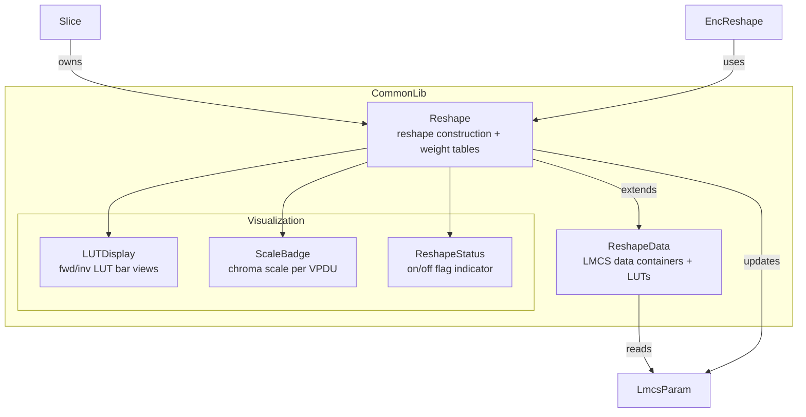
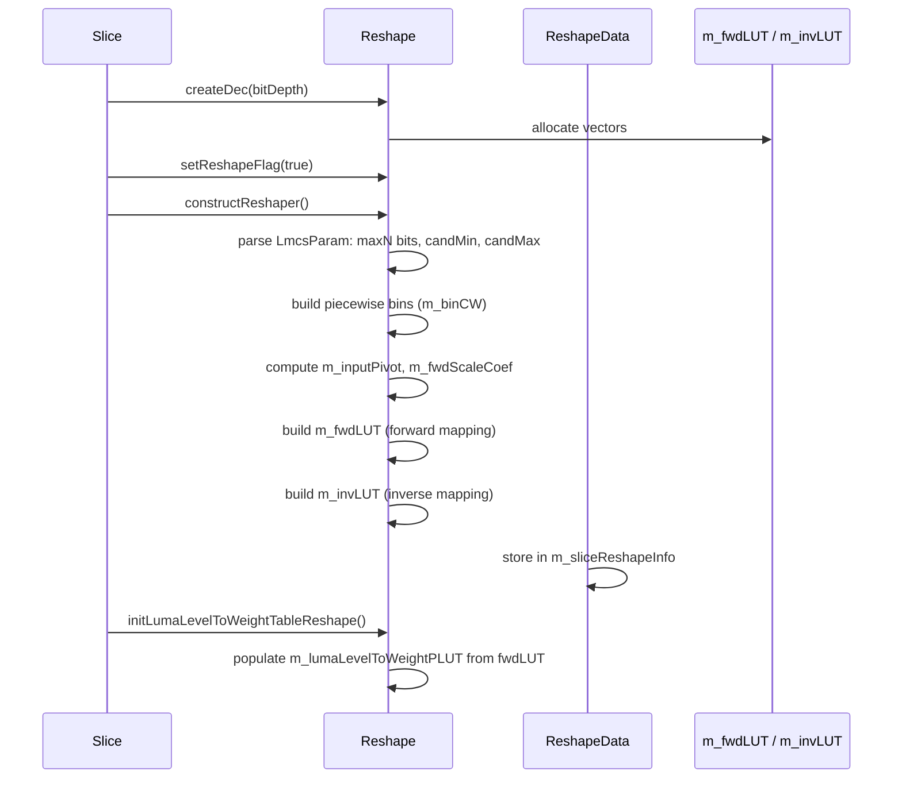
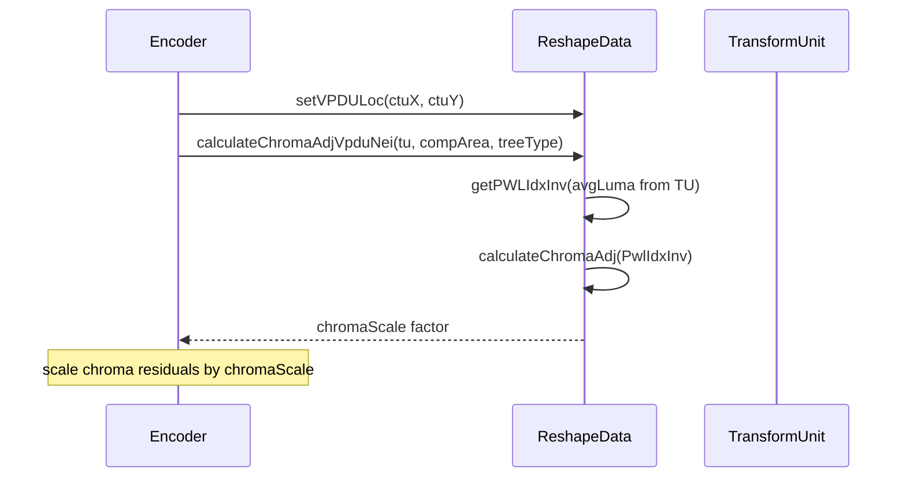

# Reshape — LMCS Luma Mapping with Chroma Scaling Data Structures

## 1. Overview

The `Reshape` module implements data structures for the LMCS (Luma Mapping with Chroma Scaling) tool in VVC. It manages forward/inverse LUTs, piecewise linear mapping parameters, chroma scaling weights, and VPDU-level chroma residual scaling.

**Two classes**:
- **`ReshapeData`** — base data container for LMCS parameters, LUTs, and per-CTU chroma scale adjustment
- **`Reshape`** — extends `ReshapeData` with the full reshape construction logic, weight table computation, and signal-type tracking

**Dependencies**: `CommonDef.h`, `Rom.h`, `Slice.h` (`LmcsParam`), `Unit.h`.

**Lifecycle**: A `Reshape` instance is owned by `Slice`. `createDec()` pre-allocates LUTs, `constructReshaper()` builds the piecewise mapping, and the LUTs are used during encoding/decoding for luma mapping and chroma residual scaling.

## 2. Component Specifications

### 2.1 Class: `ReshapeData`

```cpp
#pragma once

#include "CommonDef.h"
#include "Rom.h"
#include "Slice.h"
#include "Unit.h"

namespace vvenc {

class ReshapeData
{
public:
  ReshapeData();
  virtual ~ReshapeData();

  // --------------------------------------------------------------------------
  // Copy
  // --------------------------------------------------------------------------

  /** \brief Copy reshape data from another instance.
   *  \param[in] d  source data
   */
  void copyReshapeData(const ReshapeData& d);

  // --------------------------------------------------------------------------
  // Accessors
  // --------------------------------------------------------------------------

  /** \retval pointer to forward mapping LUT */
  const Pel* getFwdLUT() const;

  /** \retval pointer to inverse mapping LUT */
  const Pel* getInvLUT() const;

  /** \retval chroma scaling weight */
  double getChromaWeight() const;

  /** \retval pointer to per-level chroma weight PLUT */
  const uint32_t* getReshapeLumaLevelToWeightPLUT() const;

  /** \retval CTU-level reshape flag */
  bool getCTUFlag() const;

  /** \brief Set CTU-level reshape flag.
   *  \param[in] b  new flag value
   */
  void setCTUFlag(bool b);

  /** \brief Check whether a VPDU position has been processed.
   *  \param[in] x  VPDU x-position
   *  \param[in] y  VPDU y-position
   *  \retval true if this VPDU was already processed
   */
  bool isVPDUprocessed(int x, int y) const;

  /** \brief Set current VPDU location.
   *  \param[in] x  VPDU x-position
   *  \param[in] y  VPDU y-position
   */
  void setVPDULoc(int x, int y);

  /** \retval reference to LMCS slice parameter structure */
  LmcsParam& getSliceReshaperInfo();

  /** \brief Calculate chroma residual scaling for a VPDU neighbour.
   *  \param[in] tu         transform unit
   *  \param[in] area       component area
   *  \param[in] treeType   current tree type
   *  \retval chroma scaling factor
   */
  int calculateChromaAdjVpduNei(const TransformUnit& tu, const CompArea& area,
                                const TreeType treeType);

protected:
  int  getPWLIdxInv(int lumaVal) const;
  int  calculateChromaAdj(Pel avgLuma) const;

  LmcsParam             m_sliceReshapeInfo;
  bool                  m_CTUFlag;
  int                   m_chromaScale;
  int                   m_lumaBD;
  int                   m_vpduX;
  int                   m_vpduY;
  double                m_chromaWeightRS;
  std::vector<Pel>      m_invLUT;
  std::vector<Pel>      m_fwdLUT;
  std::vector<Pel>      m_reshapePivot;
  std::vector<int>      m_chromaAdjHelpLUT;
  std::vector<uint32_t> m_reshapeLumaLevelToWeightPLUT;
};

}
```

### 2.2 Class: `Reshape`

```cpp
namespace vvenc {

class Reshape : public ReshapeData
{
public:
  Reshape();
  virtual ~Reshape();

  // --------------------------------------------------------------------------
  // Initialization
  // --------------------------------------------------------------------------

  /** \brief Allocate decoder-side LUTs.
   *  \param[in] bitDepth  luma bit depth
   */
  void createDec(int bitDepth);

  /** \brief Construct the piecewise linear reshaper from slice parameters. */
  void constructReshaper();

  // --------------------------------------------------------------------------
  // Accessors
  // --------------------------------------------------------------------------

  /** \retval reshape enable flag */
  bool getReshapeFlag() const;

  /** \brief Enable or disable reshape.
   *  \param[in] b  new flag value
   */
  void setReshapeFlag(bool b);

  /** \retval pointer to double-precision per-level chroma weight PLUT */
  const double* getlumaLevelToWeightPLUT() const;

  // --------------------------------------------------------------------------
  // Weight table management
  // --------------------------------------------------------------------------

  /** \brief Initialize the luma-level-to-weight table from reshape state. */
  void initLumaLevelToWeightTableReshape();

  /** \brief Update weight table with chroma MD information.
   *  \param[in] pILUT  inverse LUT pointer
   */
  void updateReshapeLumaLevelToWeightTableChromaMD(const Pel* pILUT);

  /** \brief Restore weight table to default. */
  void restoreReshapeLumaLevelToWeightTable();

  /** \brief Update weight table from slice parameters.
   *  \param[in,out] sliceReshape  LMCS slice parameters
   *  \param[in]     wtTable       weight table output
   *  \param[in]     cwt           chroma weight value
   */
  void updateReshapeLumaLevelToWeightTable(LmcsParam& sliceReshape,
                                           Pel* wtTable, double cwt);

protected:
  std::vector<uint16_t> m_binCW;
  uint16_t              m_initCW;
  bool                  m_reshape;
  std::vector<Pel>      m_inputPivot;
  std::vector<int32_t>  m_fwdScaleCoef;
  std::vector<int32_t>  m_invScaleCoef;
  int                   m_reshapeLUTSize;
  uint32_t              m_signalType;
  std::vector<double>   m_lumaLevelToWeightPLUT;
};

}
```

## 3. System Architecture



## 4. Detailed Data Flow

### 4.1 Reshape Construction



### 4.2 Chroma Residual Scaling per CTU



## 5. Visualisation

No D3 animation — Reshape is a data container with straightforward LUT construction and scaling.

## 6. Testing Requirements

### Unit Tests (new file: `test/vvenc_unit_test/reshape_test.cpp`)

| Test ID | Method | What to Verify |
|---|---|---|
| `RESHAPE_CONSTRUCT` | `Reshape()` | m_reshape true, LUTs empty |
| `RESHAPE_DATA_CONSTRUCT` | `ReshapeData()` | m_CTUFlag false, chromaScale default |
| `RESHAPE_CREATE_DEC` | `createDec(10)` | LUTs allocated, non-empty |
| `RESHAPE_CONSTRUCT_LMCS` | `constructReshaper()` | fwd/inv LUTs populated from params |
| `RESHAPE_GET_FLAG` | `getReshapeFlag()` | returns m_reshape |
| `RESHAPE_SET_FLAG` | `setReshapeFlag(false)` | m_reshape updated |
| `RESHAPE_GET_FWD_LUT` | `getFwdLUT()` | pointer to correct buffer |
| `RESHAPE_GET_INV_LUT` | `getInvLUT()` | pointer to correct buffer |
| `RESHAPE_GET_CHROMA_WEIGHT` | `getChromaWeight()` | returns m_chromaWeightRS |
| `RESHAPE_CTU_FLAG` | `set/getCTUFlag()` | round-trip |
| `RESHAPE_VPDU_LOC` | `setVPDULoc(32,64)` | isVPDUprocessed(32,64)==true |
| `RESHAPE_COPY` | `copyReshapeData(src)` | all LUTs and params match src |
| `RESHAPE_WEIGHT_TABLE_INIT` | `initLumaLevelToWeightTableReshape()` | table populated, non-zero |
| `RESHAPE_WEIGHT_TABLE_RESTORE` | `restoreReshapeLumaLevelToWeightTable()` | returns to default |
| `RESHAPE_WEIGHT_TABLE_UPDATE` | `updateReshapeLumaLevelToWeightTable(...)` | table matches slice params |
| `RESHAPE_CHROMA_ADJ` | `calculateChromaAdjVpduNei(tu, area, tree)` | returns valid scale |

### Calling-Order Validation

- `constructReshaper()` before `getFwdLUT()` returns valid data; calling getFwdLUT() before construct returns empty vector.
- `createDec()` must be called before LUT access.

### Parameter Range Tests

- `createDec(bitDepth)`: verify bitDepth=8, 10, 12, 16 all work; bitDepth=0 does not crash.
- `constructReshaper()` with all-zero LmcsParam: verify fwdLUT is identity mapping.
- VPDU position: negative or out-of-range coordinates should not crash.

### Integration Tests

Covered by encoder integration: run a short encode with `--LMCS 1` and verify reconstruction matches expected output.

## 7. CLI Entry Point

Not directly exposed via CLI. LMCS is enabled by encoder configuration (`--LMCS 1` in `vvencapp`), which populates `LmcsParam` inside `EncCfg`, and `Reshape` is owned by `Slice`.
