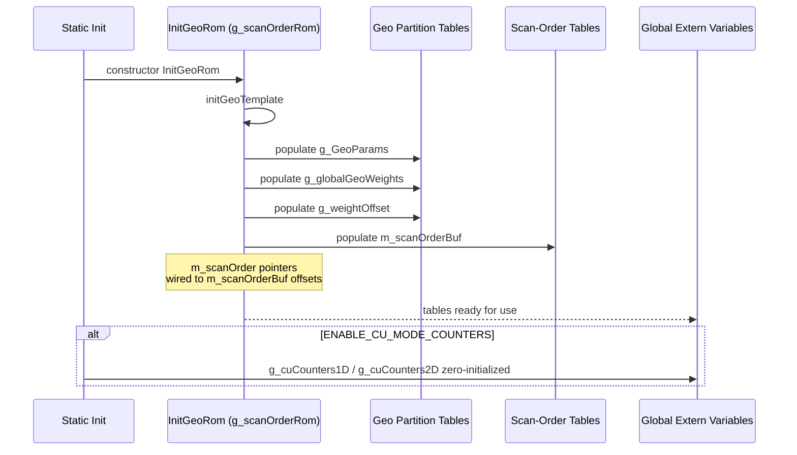
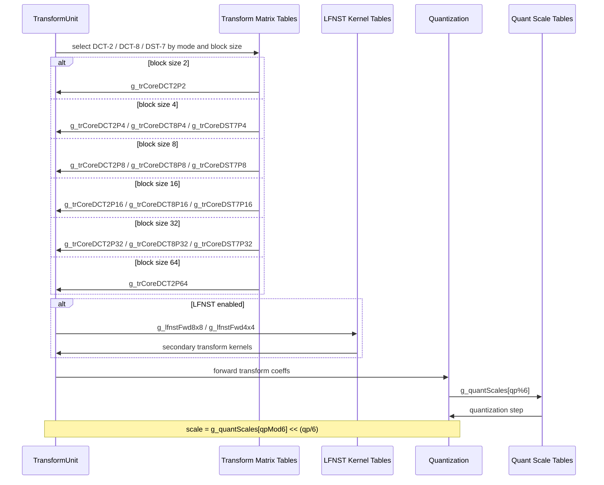
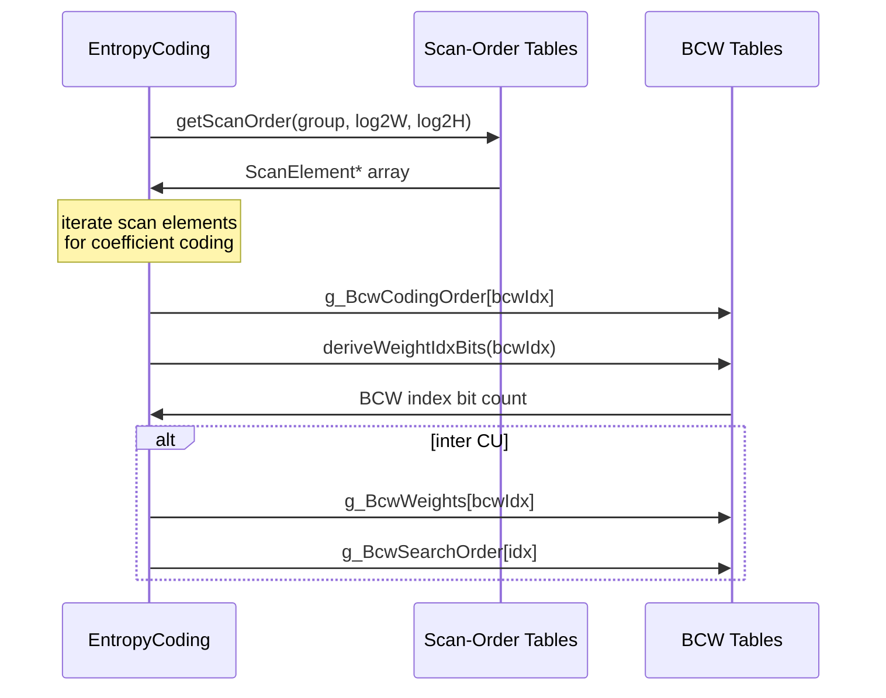

# Rom — Read-Only Memory Tables and Global Initialization

## 1. Overview

The `Rom` module provides all compile-time constant tables and global read-only data structures used throughout the VVenC encoder. It includes scan orders, transform matrices (DCT-2, DCT-8, DST-7), LFNST kernels, quantization scales, intra-prediction mode tables, chroma QP mappings, BCW weights, geometric partitioning templates, CU-mode counters, and utility functions such as `Log2` and scan-order lookup.

**Dependencies**: `CommonDef.h` (type aliases, dimension constants), `Common.h`, `dtrace.h` (when `ENABLE_TRACING`), `TimeProfiler.h`.

**Lifecycle**: Rom data is initialized at static-init time via the global `g_scanOrderRom` instance of `InitGeoRom`. No explicit init/uninit calls are needed at runtime.

## 2. Component Specifications

### 2.1 Struct: `ScanElement`

```cpp
namespace vvenc {

struct ScanElement
{
  uint16_t idx;
  uint8_t  x;
  uint8_t  y;
};

}
```

Stores a scan-order entry with absolute index and relative `(x, y)` coordinates.

### 2.2 Class: `InitGeoRom`

```cpp
namespace vvenc {

class InitGeoRom
{
  public:
    InitGeoRom();    // calls initGeoTemplate()
    ~InitGeoRom();
  private:
    void initGeoTemplate() const;
};

extern const InitGeoRom g_scanOrderRom;

}
```

The constructor calls `initGeoTemplate()` to populate geometric partition masks and scan-order structures. A single global instance `g_scanOrderRom` is declared extern.

### 2.3 Free Functions

```cpp
namespace vvenc {

/** \brief Floor-log2 of a 32-bit unsigned integer. */
inline int Log2(uint32_t x) { return floorLog2(x); }

/** \brief Look-up BCW weight for a given index and reference picture list.
 *  \param[in] bcwIdx        BCW index
 *  \param[in] uhRefFrmList  reference picture list (0 or 1)
 *  \retval signed BCW weight
 */
int8_t getBcwWeight(uint8_t bcwIdx, uint8_t uhRefFrmList);

/** \brief Reset BCW coding order (used at slice init).
 *  \param[in]     bRunDecoding  true if decoding path
 *  \param[in,out] cs            coding structure to update
 */
void resetBcwCodingOrder(bool bRunDecoding, const CodingStructure& cs);

/** \brief Derive the number of bits needed to signal a BCW index.
 *  \param[in] bcwIdx  BCW index
 *  \retval number of bits
 */
uint32_t deriveWeightIdxBits(uint8_t bcwIdx);

/** \brief Get scan-order table for a given group type and block size.
 *  \param[in] g   group type
 *  \param[in] w2  log2 width
 *  \param[in] h2  log2 height
 *  \retval pointer to scan-element array
 */
const ScanElement* const getScanOrder(int g, int w2, int h2);

}
```

### 2.4 Extern Global Variables

| Variable | Type | Purpose |
|---|---|---|
| `g_trace_ctx` | `CDTrace*` | Trace-logging context (if `ENABLE_TRACING`) |
| `g_timeProfiler` | `TProfiler*` | Time-profiling instance (if `ENABLE_TIME_PROFILING`) |
| `m_scanOrderBuf` | `const ScanElement[32258]` | Flat scan-order buffer |
| `m_scanOrder` | `const ScanElement*[...][...][...]` | Indexed scan-order pointer table |
| `g_BcwLog2WeightBase` | `const int8_t` | Log2 of BCW weight base |
| `g_BcwWeightBase` | `const int8_t` | BCW weight base |
| `g_BcwWeights` | `const int8_t[BCW_NUM]` | BCW weight values |
| `g_BcwSearchOrder` | `const int8_t[BCW_NUM]` | BCW search order |
| `g_BcwCodingOrder` | `const int8_t[BCW_NUM]` | BCW coding order |
| `g_BcwParsingOrder` | `const int8_t[BCW_NUM]` | BCW parsing order |
| `g_log2SbbSize` | `const uint32_t[...][...][2]` | Sub-block size logs |
| `g_coefTopLeftDiagScan8x8` | `const ScanElement[...][64]` | 8x8 diagonal scan |
| `g_quantScales` | `const int[2][SCALING_LIST_REM_NUM]` | Forward quantization scale Q(QP%6) |
| `g_invQuantScales` | `const int[2][SCALING_LIST_REM_NUM]` | Inverse quantization scale IQ(QP%6) |
| `g_trCoreDCT2P{2,4,8,16,32,64}` | `const TMatrixCoeff[...][...][...]` | DCT-2 transform matrices |
| `g_trCoreDCT8P{4,8,16,32}` | `const TMatrixCoeff[...][...][...]` | DCT-8 transform matrices |
| `g_trCoreDST7P{4,8,16,32}` | `const TMatrixCoeff[...][...][...]` | DST-7 transform matrices |
| `g_lfnstFwd8x8` | `const int8_t[4][2][16][48]` | LFNST forward 8x8 kernels |
| `g_lfnstFwd4x4` | `const int8_t[4][2][16][16]` | LFNST forward 4x4 kernels |
| `g_lfnstInv8x8` | `const int8_t[4][2][48][16]` | LFNST inverse 8x8 kernels |
| `g_lfnstInv4x4` | `const int8_t[4][2][16][16]` | LFNST inverse 4x4 kernels |
| `g_lfnstLut` | `const uint8_t[NUM_INTRA_MODE+NUM_EXT_LUMA_MODE-1]` | LFNST index LUT |
| `g_uiGroupIdx` | `const uint32_t[MAX_TB_SIZEY]` | Coefficient group index |
| `g_uiMinInGroup` | `const uint32_t[LAST_SIGNIFICANT_GROUPS]` | Min coefficient in group |
| `g_auiGoRiceParsCoeff` | `const uint32_t[32]` | Golomb-Rice parameter table |
| `g_aucIntraModeNumFast_UseMPM_2D` | `const uint8_t[...][...]` | Fast intra mode count (2D, MPM) |
| `g_aucIntraModeNumFast_UseMPM` | `const uint8_t[MAX_CU_DEPTH]` | Fast intra mode count (MPM) |
| `g_aucIntraModeNumFast_NotUseMPM` | `const uint8_t[MAX_CU_DEPTH]` | Fast intra mode count (no MPM) |
| `g_chroma422IntraAngleMappingTable` | `const uint8_t[NUM_INTRA_MODE]` | Chroma 4:2:2 angle mapping |
| `g_aucChromaScale` | `const uint8_t[NUM_CHROMA_FORMAT][...]` | Chroma QP mapping table |
| `g_ictModes` | `const int[2][4]` | ICT mode flags |
| `g_miScaling` | `const UnitScale` | Motion-information scaling |
| `MatrixType` | `const char*[...][...]` | Scaling-list type names |
| `MatrixType_DC` | `const char*[...][...]` | Scaling-list DC type names |
| `g_quantTSDefault4x4` | `const int[16]` | Default TS quant 4x4 |
| `g_quantIntraDefault8x8` | `const int[64]` | Default intra quant 8x8 |
| `g_quantInterDefault8x8` | `const int[64]` | Default inter quant 8x8 |
| `g_scalingListSize` | `const uint32_t[...]` | Scaling list size |
| `g_scalingListSizeX` | `const uint32_t[...]` | Scaling list size X |
| `g_IBCBufferSize` | `const int` | IBC reference buffer size (256×128) |
| `g_tbMax` | `constexpr uint8_t[257]` | Table of max binary log for values 0..256 |
| `g_GeoParams` | `int16_t[GEO_NUM_PARTITION_MODE][2]` | Geometric partition mode params |
| `g_globalGeoWeights` | `int16_t[...][GEO_WEIGHT_MASK_SIZE^2]` | Pre-stored geo blend weights |
| `g_globalGeoEncSADmask` | `int16_t[...][GEO_WEIGHT_MASK_SIZE^2]` | Pre-stored geo SAD masks |
| `g_angle2mask` | `const int8_t[GEO_NUM_ANGLES]` | Angle-to-mask mapping |
| `g_Dis` | `const int8_t[GEO_NUM_ANGLES]` | Displacement table |
| `g_angle2mirror` | `const int8_t[GEO_NUM_ANGLES]` | Angle mirror mapping |
| `g_weightOffset` | `int16_t[...][...][...][2]` | CU-size weight offset table |

### 2.5 CU Mode Counters (Conditional)

```cpp
#if ENABLE_CU_MODE_COUNTERS
#define E_COUNTERS_CU(E_) \
    E_( CU_MODES_TRIED ) \
    E_( CU_MODES_TESTED ) \
    E_( CU_RD_TESTS ) \
    E_( CU_CODED_FINALLY )
MAKE_ENUM_AND_STRINGS( E_COUNTERS_CU, CUCounterId, g_cuCounterIdNames )

extern StatCounters::StatCounter2DSet<int64_t> g_cuCounters1D;
extern StatCounters::StatCounter2DSet<int64_t> g_cuCounters2D;
#define STAT_COUNT_CU_MODES(cond,...) if(cond) {(__VA_ARGS__)++;}
#else
#define STAT_COUNT_CU_MODES(cond,...)
#endif
```

## 3. System Architecture

```mermaid
graph TB
    subgraph Rom[Rom — Global Read-Only Tables]
        ScanOrder[ScanOrder<br/>scan-element tables]
        BCW[BCW Tables<br/>weights and orderings]
        Transforms[Transform Matrices<br/>DCT-2 / DCT-8 / DST-7]
        LFNST[LFNST Kernels<br/>forward and inverse]
        QuantScales[Quantization Scales<br/>g_quantScales / g_invQuantScales]
        IntraTables[Intra Prediction Tables<br/>mode counts, angle maps]
        ChromaQP[Chroma QP Mapping<br/>g_aucChromaScale]
        GeoParams[Geo Partition Params<br/>masks, weights, angles]
        Misc[Misc Constants<br/>g_IBCBufferSize / g_tbMax / Log2]
    end

    subgraph Consumers[Consumer Modules]
        EncoderLib[EncoderLib<br/>RD-optimization and encoding]
        DecoderLib[DecoderLib<br///>decoding and reconstruction]
        TransformUnit[TransformUnit<br/>core transform execution]
        Quantization[Quantization<br/>scaling and dequantization]
        IntraPrediction[IntraPrediction<br///>mode decision and reference]
        InterPrediction[InterPrediction<br///>motion compensation]
        GeoInter[GeoInter<br/>geometric partition blending]
        EntropyCoding[EntropyCoding<br/>CABAC context and BCW signaling]
    end

    InitGeoRom[InitGeoRom<br/>static-init constructor] -->|initGeoTemplate| GeoParams
    InitGeoRom -->|initGeoTemplate| ScanOrder

    ScanOrder -->|m_scanOrder| EntropyCoding
    ScanOrder -->|m_scanOrder| TransformUnit
    BCW -->|g_BcwWeights| InterPrediction
    BCW -->|g_BcwCodingOrder| EntropyCoding
    Transforms -->|g_trCoreDCT2P*| TransformUnit
    Transforms -->|g_trCoreDCT8P*| TransformUnit
    Transforms -->|g_trCoreDST7P*| TransformUnit
    LFNST -->|g_lfnstFwd* / g_lfnstInv*| TransformUnit
    QuantScales -->|g_quantScales| Quantization
    QuantScales -->|g_invQuantScales| Quantization
    IntraTables -->|g_aucIntraModeNumFast_*| IntraPrediction
    ChromaQP -->|g_aucChromaScale| IntraPrediction
    GeoParams -->|g_GeoParams / g_weightOffset| GeoInter
    Misc -->|g_IBCBufferSize| InterPrediction
```



## 4. Detailed Data Flow

### 4.1 Static Initialization Flow



### 4.2 Transform Selection Flow



### 4.3 Scan-Order and BCW Lookup



## 5. Visualisation

No D3 animation. All Rom tables are static data with no runtime state transitions to visualize.

## 6. Testing Requirements

### Unit Tests (new file: `test/vvenc_unit_test/rom_test.cpp`)

| Test ID | Variable / Function | What to Verify |
|---|---|---|
| `ROM_LOG2` | `Log2(x)` | Returns `floorLog2(x)` for x=1,2,3,4,...,2^31 |
| `ROM_LOG2_ZERO` | `Log2(0)` | Returns `floorLog2(0)` (defined behavior) |
| `ROM_SCAN_ORDER_RANGE` | `getScanOrder(g,w,h)` | Returns non-null for all valid group/types/tu-sizes |
| `ROM_SCAN_ELEMENT_CONSISTENCY` | `m_scanOrderBuf` | All entries have x,y within corresponding block size |
| `ROM_BCW_WEIGHTS` | `g_BcwWeights` | Contains BCW_NUM entries summing to (1 << g_BcwLog2WeightBase) |
| `ROM_BCW_GET_WEIGHT` | `getBcwWeight(idx,list)` | Returns correct weight per ref list |
| `ROM_BCW_DERIVE_BITS` | `deriveWeightIdxBits(idx)` | Returns bit count for each valid idx |
| `ROM_DCT2_ZERO_FREQ` | `g_trCoreDCT2P4` | DC row sums to non-zero, highest-frequency row sums to zero |
| `ROM_DCT2_ORTHOGONAL` | `g_trCoreDCT2P4` | Row dot-products are zero for distinct rows (within rounding) |
| `ROM_DCT8_DST7_ORTHOGONAL` | `g_trCoreDCT8P4`, `g_trCoreDST7P4` | Row orthogonality holds within rounding tolerance |
| `ROM_LFNST_FWD_INV_MATCH` | `g_lfnstFwd4x4`, `g_lfnstInv4x4` | Forward times inverse yields near-identity for each kernel |
| `ROM_QUANT_SCALES` | `g_quantScales`, `g_invQuantScales` | Product of corresponding entries is near 2^14 |
| `ROM_CHROMA_QP_MAP` | `g_aucChromaScale[fmt][qp]` | Mapping is non-decreasing with QP for each chroma format |
| `ROM_GEO_PARAMS_VALID` | `g_GeoParams[][2]` | All angles and distances within valid ranges |
| `ROM_GEO_WEIGHT_MASK_SIZE` | `g_globalGeoWeights` | Number of entries matches dimensions |
| `ROM_IBC_BUFFER_SIZE` | `g_IBCBufferSize` | Equals 256 * 128 |
| `ROM_INTRA_MODE_FAST_COUNT` | `g_aucIntraModeNumFast_UseMPM_2D` | All entries within [0, NUM_INTRA_MODE] |
| `ROM_GOLOMB_RICE_PARAM` | `g_auiGoRiceParsCoeff` | Values match VVC specification for all 32 entries |
| `ROM_CU_COUNTERS_INIT` | `g_cuCounters1D`, `g_cuCounters2D` | Zero-initialized (when ENABLE_CU_MODE_COUNTERS) |

### Calling-Order Validation

No ordering constraints apply — all Rom data is read-only after static initialization.

### Parameter Range Tests

- `getScanOrder(g, w, h)`: all valid `g` in `SCAN_NUMBER_OF_GROUP_TYPES`, `w2`/`h2` in `[0, MAX_TU_SIZE_IDX)`
- `getBcwWeight(idx, list)`: `idx` in `[0, BCW_NUM)`, `list` in `{0, 1}`
- `deriveWeightIdxBits(idx)`: `idx` in `[0, BCW_NUM)`
- `Log2(x)`: `x` in full `uint32_t` range

### Integration Tests

Covered by `vvenc_unit_test.cpp` which exercises transform, quantization, intra-prediction, entropy coding, and inter-prediction paths that depend on Rom tables. The dedicated `rom_test.cpp` validates table integrity without modifying regression baselines.

## 7. CLI Entry Point

Not directly exposed via CLI. `Rom` is a static data layer consumed by `EncoderLib`, `DecoderLib`, `TransformUnit`, `Quantization`, `IntraPrediction`, `InterPrediction`, `GeoInter`, and `EntropyCoding`.
