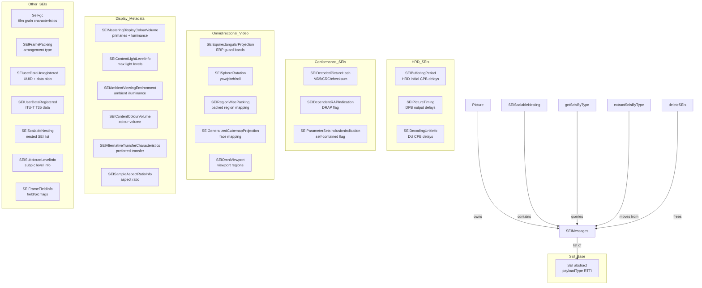
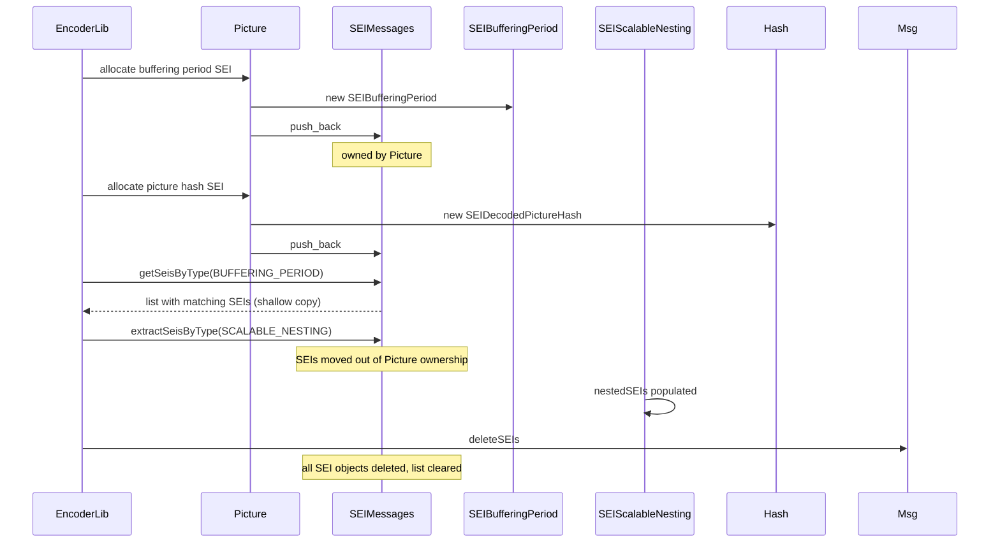
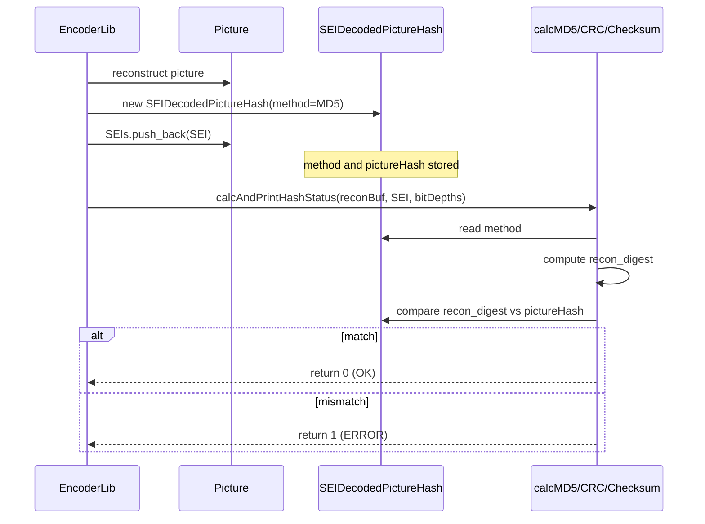

# SEI — Supplemental Enhancement Information Messages

## 1. Overview

The `SEI` module defines the abstract base class and 20 concrete SEI message types for VVC. SEI messages carry supplemental data that is not required for decoding: buffering period, picture timing, decoding unit info, decoded picture hash, mastering display colour volume, content light level, frame packing, omnidirectional video parameters (equirectangular projection, sphere rotation, region-wise packing, cubemap projection), film grain characteristics, and more.

**Dependencies**: `CommonDef.h`, `<list>`, `<vector>`, `<cstring>`.

**Lifecycle**: SEI messages are heap-allocated, stored in `SEIMessages` (`std::list<SEI*>`), owned by `Picture::SEIs`. Free functions `getSeisByType`, `extractSeisByType`, and `deleteSEIs` provide query and lifecycle management.

## 2. Component Specifications

### 2.1 Class: `SEI` (Abstract Base)

```cpp
class SEI
{
public:
  enum PayloadType
  {
    BUFFERING_PERIOD                     = 0,
    PICTURE_TIMING                       = 1,
    FILLER_PAYLOAD                       = 3,
    USER_DATA_REGISTERED_ITU_T_T35       = 4,
    USER_DATA_UNREGISTERED               = 5,
    FILM_GRAIN_CHARACTERISTICS           = 19,
    FRAME_PACKING                        = 45,
    PARAMETER_SETS_INCLUSION_INDICATION  = 129,
    DECODING_UNIT_INFO                   = 130,
    DECODED_PICTURE_HASH                 = 132,
    SCALABLE_NESTING                     = 133,
    MASTERING_DISPLAY_COLOUR_VOLUME      = 137,
    DEPENDENT_RAP_INDICATION             = 145,
    EQUIRECTANGULAR_PROJECTION           = 150,
    SPHERE_ROTATION                      = 154,
    REGION_WISE_PACKING                  = 155,
    OMNI_VIEWPORT                        = 156,
    GENERALIZED_CUBEMAP_PROJECTION       = 153,
    FRAME_FIELD_INFO                     = 168,
    SUBPICTURE_LEVEL_INFO                = 203,
    SAMPLE_ASPECT_RATIO_INFO             = 204,
    CONTENT_LIGHT_LEVEL_INFO             = 144,
    ALTERNATIVE_TRANSFER_CHARACTERISTICS = 147,
    AMBIENT_VIEWING_ENVIRONMENT          = 148,
    CONTENT_COLOUR_VOLUME                = 149,
  };

  SEI() {}
  virtual ~SEI() {}

  static const char* getSEIMessageString(SEI::PayloadType payloadType);
  virtual PayloadType payloadType() const = 0;
};
```

Lightweight RTTI via `payloadType()`. The `getSEIMessageString` static method returns a human-readable name.

### 2.2 Struct: `SEIMasteringDisplay`

```cpp
struct SEIMasteringDisplay
{
  bool     colourVolumeSEIEnabled;
  uint32_t maxLuminance;
  uint32_t minLuminance;
  uint16_t primaries[3][2];
  uint16_t whitePoint[2];
};
```

Raw mastering-display colour-volume metadata (primaries in CIE 1931 xy chromaticity coordinates, max/min luminance in 0.0001 cd/m^2 units).

### 2.3 Concrete SEI Classes

```cpp
class SEIEquirectangularProjection : public SEI
{
  PayloadType payloadType() const { return EQUIRECTANGULAR_PROJECTION; }
  bool erpCancelFlag, erpPersistenceFlag, erpGuardBandFlag;
  uint8_t erpGuardBandType, erpLeftGuardBandWidth, erpRightGuardBandWidth;
};

class SEISphereRotation : public SEI
{
  PayloadType payloadType() const { return SPHERE_ROTATION; }
  bool sphereRotationCancelFlag, sphereRotationPersistenceFlag;
  int sphereRotationYaw, sphereRotationPitch, sphereRotationRoll;
};

class SEIOmniViewport : public SEI
{
  struct OmniViewport {
    int azimuthCentre, elevationCentre, tiltCentre;
    uint32_t horRange, verRange;
  };
  uint32_t omniViewportId;
  bool omniViewportCancelFlag, omniViewportPersistenceFlag;
  uint8_t omniViewportCntMinus1;
  std::vector<OmniViewport> omniViewportRegions;
};

class SEIRegionWisePacking : public SEI
{
  bool rwpCancelFlag, rwpPersistenceFlag, constituentPictureMatchingFlag;
  int numPackedRegions, projPictureWidth, projPictureHeight;
  int packedPictureWidth, packedPictureHeight;
  std::vector<uint8_t> rwpTransformType;
  std::vector<uint32_t> projRegionWidth, projRegionHeight;
  std::vector<uint32_t> rwpProjRegionTop, projRegionLeft;
  std::vector<uint16_t> packedRegionWidth, packedRegionHeight;
  std::vector<uint16_t> packedRegionTop, packedRegionLeft;
  // ... guard band vectors
};

class SEIGeneralizedCubemapProjection : public SEI
{
  bool gcmpCancelFlag, gcmpPersistenceFlag;
  uint8_t gcmpPackingType, gcmpMappingFunctionType;
  std::vector<uint8_t> gcmpFaceIndex, gcmpFaceRotation;
  std::vector<uint8_t> gcmpFunctionCoeffU, gcmpFunctionCoeffV;
  bool gcmpGuardBandFlag;
  uint8_t gcmpGuardBandType;
  bool gcmpGuardBandBoundaryExteriorFlag;
  uint8_t gcmpGuardBandSamplesMinus1;
};

class SEISampleAspectRatioInfo : public SEI
{
  bool sariCancelFlag, sariPersistenceFlag;
  int sariAspectRatioIdc, sariSarWidth, sariSarHeight;
};

class SEIuserDataUnregistered : public SEI
{
  uint8_t uuid_iso_iec_11578[ISO_IEC_11578_LEN];
  uint32_t userDataLength;
  uint8_t* userData;
};

class SEIDecodedPictureHash : public SEI
{
  vvencHashType method;
  bool singleCompFlag;
  PictureHash pictureHash;
};

class SEIDependentRAPIndication : public SEI
{
  // no payload data; flag-only SEI
};

class SEIBufferingPeriod : public SEI
{
  bool bpNalCpbParamsPresent, bpVclCpbParamsPresent;
  uint32_t initialCpbRemovalDelayLength, cpbRemovalDelayLength, dpbOutputDelayLength;
  int bpCpbCnt;
  uint32_t duCpbRemovalDelayIncrementLength, dpbOutputDelayDuLength;
  uint32_t initialCpbRemovalDelay[VVENC_MAX_TLAYER][MAX_CPB_CNT][2];
  uint32_t initialCpbRemovalOffset[VVENC_MAX_TLAYER][MAX_CPB_CNT][2];
  bool concatenationFlag;
  uint32_t auCpbRemovalDelayDelta;
  bool cpbRemovalDelayDeltasPresent;
  int numCpbRemovalDelayDeltas, bpMaxSubLayers;
  uint32_t cpbRemovalDelayDelta[15];
  bool bpDecodingUnitHrdParamsPresent;
  bool decodingUnitCpbParamsInPicTimingSeiFlag;
  bool decodingUnitDpbDuParamsInPicTimingSeiFlag;
  bool sublayerInitialCpbRemovalDelayPresent;
  bool additionalConcatenationInfoPresent;
  uint32_t maxInitialRemovalDelayForConcatenation;
  bool sublayerDpbOutputOffsetsPresent;
  uint32_t dpbOutputTidOffset[VVENC_MAX_TLAYER];
  bool altCpbParamsPresent, useAltCpbParamsFlag;
};

class SEIPictureTiming : public SEI
{
  bool ptSubLayerDelaysPresent[VVENC_MAX_TLAYER];
  bool cpbRemovalDelayDeltaEnabledFlag[VVENC_MAX_TLAYER];
  uint32_t cpbRemovalDelayDeltaIdx[VVENC_MAX_TLAYER];
  uint32_t auCpbRemovalDelay[VVENC_MAX_TLAYER];
  uint32_t picDpbOutputDelay, picDpbOutputDuDelay;
  uint32_t numDecodingUnitsMinus1;
  bool duCommonCpbRemovalDelayFlag;
  uint32_t duCommonCpbRemovalDelayMinus1[VVENC_MAX_TLAYER];
  std::vector<uint32_t> numNalusInDuMinus1;
  std::vector<uint32_t> duCpbRemovalDelayMinus1;
  bool cpbAltTimingInfoPresent;
  std::vector<std::vector<uint32_t>> nalCpbAltInitialRemovalDelayDelta;
  std::vector<std::vector<uint32_t>> nalCpbAltInitialRemovalOffsetDelta;
  std::vector<uint32_t> nalCpbDelayOffset, nalDpbDelayOffset;
  std::vector<std::vector<uint32_t>> vclCpbAltInitialRemovalDelayDelta;
  std::vector<std::vector<uint32_t>> vclCpbAltInitialRemovalOffsetDelta;
  std::vector<uint32_t> vclCpbDelayOffset, vclDpbDelayOffset;
  int ptDisplayElementalPeriodsMinus1;
  bool delayForConcatenationEnsureFlag;
};

class SEIDecodingUnitInfo : public SEI
{
  int decodingUnitIdx;
  int duSptCpbRemovalDelayIncrement[VVENC_MAX_TLAYER];
  bool duiSubLayerDelaysPresent[VVENC_MAX_TLAYER];
  bool dpbOutputDuDelayPresent;
  int picSptDpbOutputDuDelay;
};

class SEIFrameFieldInfo : public SEI
{
  bool fieldPicFlag, bottomFieldFlag, pairingIndicatedFlag;
  bool pairedWithNextFieldFlag, displayFieldsFromFrameFlag;
  bool topFieldFirstFlag, duplicateFlag;
  int displayElementalPeriodsMinus1, sourceScanType;
};

class SEIFramePacking : public SEI
{
  bool arrangementCancelFlag, quincunxSamplingFlag, spatialFlippingFlag;
  bool frame0FlippedFlag, fieldViewsFlag;
  bool currentFrameIsFrame0Flag, frame0SelfContainedFlag, frame1SelfContainedFlag;
  bool arrangementPersistenceFlag, upsampledAspectRatio;
  int arrangementId, arrangementType, contentInterpretationType;
  int frame0GridPositionX, frame0GridPositionY;
  int frame1GridPositionX, frame1GridPositionY;
  int arrangementReservedByte;
};

class SEIParameterSetsInclusionIndication : public SEI
{
  int selfContainedClvsFlag;
};

class SEIMasteringDisplayColourVolume : public SEI
{
  SEIMasteringDisplay values;
};

class SEIScalableNesting : public SEI
{
  bool snOlsFlag, snSubpicFlag;
  uint32_t snNumOlssMinus1;
  uint32_t snOlsIdxDeltaMinus1[MAX_NESTING_NUM_LAYER];
  uint32_t snOlsIdx[MAX_NESTING_NUM_LAYER];
  bool snAllLayersFlag;
  uint32_t snNumLayersMinus1;
  uint8_t snLayerId[MAX_NESTING_NUM_LAYER];
  uint32_t snNumSubpics;
  uint8_t snSubpicIdLen;
  std::vector<uint16_t> snSubpicId;
  uint32_t snNumSEIs;
  SEIMessages nestedSEIs;
};

class SEIAlternativeTransferCharacteristics : public SEI
{
  uint32_t preferredTransferCharacteristics;
};

class SEIUserDataRegistered : public SEI
{
  uint16_t ituCountryCode;
  std::vector<uint8_t> userData;
};

class SeiFgc : public SEI
{
  bool fgcCancelFlag;
  uint8_t filmGrainModelId;
  bool separateColourDescriptionPresent;
  uint8_t filmGrainBitDepthLumaMinus8, filmGrainBitDepthChromaMinus8;
  bool filmGrainFullRangeFlag;
  uint8_t filmGrainColourPrimaries, filmGrainTransferCharacteristics, filmGrainMatrixCoeffs;
  uint8_t blendingModeId, log2ScaleFactor;
  struct CompModel { bool presentFlag; uint8_t numModelValues, numIntensityIntervals; /* ... */ };
  CompModel compModel[MAX_NUM_COMP];
  bool fgcPersistenceFlag;
};

class SEIContentLightLevelInfo : public SEI
{
  uint32_t maxContentLightLevel;
  uint32_t maxPicAverageLightLevel;
};

class SEIAmbientViewingEnvironment : public SEI
{
  uint32_t ambientIlluminance;
  uint16_t ambientLightX, ambientLightY;
};

class SEIContentColourVolume : public SEI
{
  bool ccvCancelFlag, ccvPersistenceFlag;
  bool ccvPrimariesPresent, ccvMinLuminanceValuePresent, ccvMaxLuminanceValuePresent, ccvAvgLuminanceValuePresent;
  int ccvPrimariesX[MAX_NUM_COMP], ccvPrimariesY[MAX_NUM_COMP];
  uint32_t ccvMinLuminanceValue, ccvMaxLuminanceValue, ccvAvgLuminanceValue;
};

class SEISubpicureLevelInfo : public SEI
{
  int numRefLevels;
  bool explicitFractionPresent, cbrConstraintFlag;
  int numSubpics, sliMaxSublayers;
  bool sliSublayerInfoPresent;
  std::vector<std::vector<int>> nonSubpicLayersFraction;
  std::vector<std::vector<vvencLevel>> refLevelIdc;
  std::vector<std::vector<std::vector<int>>> refLevelFraction;
};
```

### 2.4 Free Functions

```cpp
typedef std::list<SEI*> SEIMessages;

SEIMessages getSeisByType(const SEIMessages& seiList, SEI::PayloadType seiType);
SEIMessages extractSeisByType(SEIMessages& seiList, SEI::PayloadType seiType);
void deleteSEIs(SEIMessages& seiList);
```

- `getSeisByType` — Returns a new list of all SEIs matching `seiType` (ownership stays in original).
- `extractSeisByType` — Moves matching SEIs from `seiList` to a new list (ownership transfers).
- `deleteSEIs` — Deletes all SEI objects and clears the list.

## 3. System Architecture



## 4. Detailed Data Flow

### 4.1 SEI Message Lifecycle



### 4.2 Hash SEI Verification



## 5. Visualisation

### 5.1 Animation Description

The D3 animation visualises the SEI message system through 18 keyframes covering creation of each SEI type, query by type, extraction by type, and deletion. Each keyframe updates:

- **SeiListBoard**: A scrollable list of SEI message badges showing payload type and key data.
- **CountBadges**: Counters for active SEIs by category (HRD, Conformance, OMAF, Display, Other).
- **OperationFeed**: A scrollable log of each lifecycle operation.

**Controls**: Standard play/pause and replay buttons.

### 5.2 Animation Source

```html
<!DOCTYPE html>
<html lang="en">
<head>
<meta charset="UTF-8">
<meta name="viewport" content="width=device-width, initial-scale=1.0">
<title>SEI — Message Lifecycle</title>
<style>
* { box-sizing: border-box; margin: 0; padding: 0; }
body { font-family: 'Segoe UI', sans-serif; background: #1a1a2e; color: #e0e0e0; display: flex; justify-content: center; padding: 20px; }
#app { max-width: 720px; width: 100%; }
h1 { font-size: 1.2rem; margin-bottom: 8px; color: #a0c4ff; }
#vis { background: #16213e; border-radius: 8px; padding: 16px; }
#controls { display: flex; gap: 8px; margin-bottom: 12px; }
#controls button { background: #0f3460; color: #e0e0e0; border: 1px solid #1a5276; padding: 6px 14px; border-radius: 4px; cursor: pointer; font-size: 0.85rem; }
#controls button:hover { background: #1a5276; }
#controls button.active { background: #e94560; }
#counters { display: flex; gap: 8px; margin-bottom: 6px; flex-wrap: wrap; }
.counter { font-size: 0.7rem; padding: 3px 8px; border-radius: 10px; background: #0f3460; }
.counter.hrd { border-left: 3px solid #4a9eff; }
.counter.conf { border-left: 3px solid #2ecc71; }
.counter.omaf { border-left: 3px solid #f39c12; }
.counter.disp { border-left: 3px solid #e94560; }
.counter.other { border-left: 3px solid #9b59b6; }
#sei-list { background: #0d1b2a; border: 1px solid #1a5276; border-radius: 4px; padding: 6px; max-height: 160px; overflow-y: auto; margin: 6px 0; }
.sei-entry { font-size: 0.7rem; padding: 2px 6px; margin: 2px 0; border-radius: 2px; display: flex; justify-content: space-between; }
.sei-entry .type { color: #a0c4ff; }
.sei-entry .info { color: #888; }
.sei-entry.hrd { background: #0a1a3a; }
.sei-entry.conf { background: #0a2a1a; }
.sei-entry.omaf { background: #2a2a0a; }
.sei-entry.disp { background: #2a0a0a; }
.sei-entry.other { background: #1a0a2a; }
#operation-feed { background: #0d1b2a; border: 1px solid #1a5276; border-radius: 4px; padding: 8px; max-height: 120px; overflow-y: auto; font-family: monospace; font-size: 0.75rem; margin-top: 8px; }
.feed-entry { color: #a0c4ff; padding: 2px 0; border-bottom: 1px solid #1a2a4a; }
.feed-entry .idx { color: #555; margin-right: 6px; }
#status-bar { font-size: 0.75rem; color: #888; margin-top: 6px; text-align: center; }
</style>
</head>
<body>
<div id="app">
<h1>SEI <small>supplemental enhancement information</small></h1>
<div id="vis">
<div id="controls">
<button data-testid="play-pause" id="play-btn">Play</button>
<button id="replay-btn">Replay</button>
</div>
<div id="counters"></div>
<div id="sei-list"></div>
<div id="operation-feed"></div>
<div id="status-bar">keyframe <span id="kf-idx">0</span>/<span id="kf-total">17</span> — <span id="kf-label">init</span></div>
</div>
</div>
<script src="https://d3js.org/d3.v7.min.js"></script>
<script>
(function() {
var catMap = {BP:'hrd',PT:'hrd',DUI:'hrd',Hash:'conf',DRAP:'conf',PSII:'conf',ERP:'omaf',Sphere:'omaf',RWP:'omaf',GCP:'omaf',OVP:'omaf',MDCV:'disp',CLL:'disp',AVE:'disp',CCV:'disp',ATC:'disp',SARI:'disp',FGC:'other',FP:'other',UDU:'other',UDR:'other',SSN:'other',SLI:'other',FFI:'other'};

var keyframes = [
  {time:300, label:'empty list', entries:[], count:{hrd:0,conf:0,omaf:0,disp:0,other:0}, log:'SEIMessages empty'},
  {time:600, label:'add BP', entries:[{t:'BP',info:'initDelay=50000'}], count:{hrd:1,conf:0,omaf:0,disp:0,other:0}, log:'new SEIBufferingPeriod - initialCpbRemovalDelay set'},
  {time:900, label:'add PT', entries:[{t:'BP',info:'initDelay=50000'},{t:'PT',info:'dpbOut=1'}], count:{hrd:2,conf:0,omaf:0,disp:0,other:0}, log:'new SEIPictureTiming - picDpbOutputDelay=1'},
  {time:1200,label:'add Hash', entries:[{t:'BP',info:'initDelay=50000'},{t:'PT',info:'dpbOut=1'},{t:'Hash',info:'MD5'}], count:{hrd:2,conf:1,omaf:0,disp:0,other:0}, log:'new SEIDecodedPictureHash - method=MD5'},
  {time:1500,label:'add MDCV', entries:[{t:'BP',info:'initDelay=50000'},{t:'PT',info:'dpbOut=1'},{t:'Hash',info:'MD5'},{t:'MDCV',info:'maxLum=1000'}], count:{hrd:2,conf:1,omaf:0,disp:1,other:0}, log:'new SEIMasteringDisplayColourVolume'},
  {time:1800,label:'add CLL', entries:[{t:'BP',info:'initDelay=50000'},{t:'PT',info:'dpbOut=1'},{t:'Hash',info:'MD5'},{t:'MDCV',info:'maxLum=1000'},{t:'CLL',info:'maxCLL=4000'}], count:{hrd:2,conf:1,omaf:0,disp:2,other:0}, log:'new SEIContentLightLevelInfo'},
  {time:2100,label:'add ERP', entries:[{t:'BP',info:'initDelay=50000'},{t:'PT',info:'dpbOut=1'},{t:'Hash',info:'MD5'},{t:'MDCV',info:'maxLum=1000'},{t:'CLL',info:'maxCLL=4000'},{t:'ERP',info:'guard=on'}], count:{hrd:2,conf:1,omaf:1,disp:2,other:0}, log:'new SEIEquirectangularProjection'},
  {time:2400,label:'add SSN', entries:[{t:'BP',info:'initDelay=50000'},{t:'PT',info:'dpbOut=1'},{t:'Hash',info:'MD5'},{t:'MDCV',info:'maxLum=1000'},{t:'CLL',info:'maxCLL=4000'},{t:'ERP',info:'guard=on'},{t:'SSN',info:'2 nested SEIs'}], count:{hrd:2,conf:1,omaf:1,disp:2,other:1}, log:'new SEIScalableNesting - contains nestedSEIs'},
  {time:2700,label:'add FGC', entries:[{t:'BP',info:'initDelay=50000'},{t:'PT',info:'dpbOut=1'},{t:'Hash',info:'MD5'},{t:'MDCV',info:'maxLum=1000'},{t:'CLL',info:'maxCLL=4000'},{t:'ERP',info:'guard=on'},{t:'SSN',info:'2 nested SEIs'},{t:'FGC',info:'model=0'}], count:{hrd:2,conf:1,omaf:1,disp:2,other:2}, log:'new SeiFgc - film grain characteristics'},
  {time:3000,label:'getByType HRD', entries:[{t:'BP',info:'initDelay=50000'},{t:'PT',info:'dpbOut=1'},{t:'Hash',info:'MD5'},{t:'MDCV',info:'maxLum=1000'},{t:'CLL',info:'maxCLL=4000'},{t:'ERP',info:'guard=on'},{t:'SSN',info:'2 nested SEIs'},{t:'FGC',info:'model=0'}], count:{hrd:2,conf:1,omaf:1,disp:2,other:2}, log:'getSeisByType BUFFERING_PERIOD returns 1 match'},
  {time:3300,label:'extract OMAF', entries:[{t:'BP',info:'initDelay=50000'},{t:'PT',info:'dpbOut=1'},{t:'Hash',info:'MD5'},{t:'MDCV',info:'maxLum=1000'},{t:'CLL',info:'maxCLL=4000'},{t:'SSN',info:'2 nested SEIs'},{t:'FGC',info:'model=0'}], count:{hrd:2,conf:1,omaf:0,disp:2,other:2}, log:'extractSeisByType EQUIRECTANGULAR_PROJECTION - ERP removed'},
  {time:3600,label:'disp SEI info', entries:[{t:'BP',info:'initDelay=50000'},{t:'PT',info:'dpbOut=1'},{t:'Hash',info:'MD5'},{t:'MDCV',info:'maxLum=1000'},{t:'CLL',info:'maxCLL=4000'},{t:'SSN',info:'2 nested SEIs'},{t:'FGC',info:'model=0'}], count:{hrd:2,conf:1,omaf:0,disp:2,other:2}, log:'SEIMasteringDisplayColourVolume maxLum=1000 minLum=1'},
  {time:3900,label:'DRAP add', entries:[{t:'BP',info:'initDelay=50000'},{t:'PT',info:'dpbOut=1'},{t:'Hash',info:'MD5'},{t:'MDCV',info:'maxLum=1000'},{t:'CLL',info:'maxCLL=4000'},{t:'SSN',info:'2 nested SEIs'},{t:'FGC',info:'model=0'},{t:'DRAP',info:'flag'}], count:{hrd:2,conf:2,omaf:0,disp:2,other:2}, log:'new SEIDependentRAPIndication'},
  {time:4200,label:'UDR add', entries:[{t:'BP',info:'initDelay=50000'},{t:'PT',info:'dpbOut=1'},{t:'Hash',info:'MD5'},{t:'MDCV',info:'maxLum=1000'},{t:'CLL',info:'maxCLL=4000'},{t:'SSN',info:'2 nested SEIs'},{t:'FGC',info:'model=0'},{t:'DRAP',info:'flag'},{t:'UDR',info:'country=181'}], count:{hrd:2,conf:2,omaf:0,disp:2,other:3}, log:'new SEIUserDataRegistered - ITU-T T35 data'},
  {time:4500,label:'extract conf', entries:[{t:'BP',info:'initDelay=50000'},{t:'PT',info:'dpbOut=1'},{t:'MDCV',info:'maxLum=1000'},{t:'CLL',info:'maxCLL=4000'},{t:'SSN',info:'2 nested SEIs'},{t:'FGC',info:'model=0'},{t:'UDR',info:'country=181'}], count:{hrd:2,conf:0,omaf:0,disp:2,other:3}, log:'extractSeisByType DECODED_PICTURE_HASH and DRAP removed'},
  {time:4800,label:'delete all', entries:[], count:{hrd:0,conf:0,omaf:0,disp:0,other:0}, log:'deleteSEIs - all SEI objects freed, list cleared'}
];
var totalMs = keyframes[keyframes.length-1].time + 300;
window.ANIMATION_DURATION_MS = totalMs;
window.ANIMATION_KEYFRAMES = keyframes.map(function(k){return{time:k.time,label:k.label};});
var state = {running:true,kf:0};

function renderCounters(count) {
  var c = d3.select('#counters');
  c.selectAll('*').remove();
  Object.keys(count).forEach(function(k){
    c.append('span').attr('class','counter '+k).text(k+': '+count[k]);
  });
}
function renderList(entries) {
  var list = d3.select('#sei-list');
  list.selectAll('*').remove();
  entries.forEach(function(e){
    var div = list.append('div').attr('class','sei-entry '+(catMap[e.t]||'other'));
    div.append('span').attr('class','type').text(e.t);
    div.append('span').attr('class','info').text(e.info);
  });
}
function addLog(msg){
  var feed = d3.select('#operation-feed');
  var entry = feed.append('div').attr('class','feed-entry');
  var idx = feed.selectAll('.feed-entry').size();
  entry.append('span').attr('class','idx').text(String(idx).padStart(2,'0')+'.');
  entry.append('span').text(msg);
  feed.node().scrollTop = feed.node().scrollHeight;
}
function goToKeyframe(idx){
  if(idx>=keyframes.length){state.running=false; d3.select('#play-btn').text('Play'); return;}
  var kf = keyframes[idx];
  state.kf = idx;
  renderCounters(kf.count);
  renderList(kf.entries);
  if(idx===0) d3.select('#operation-feed').selectAll('*').remove();
  addLog(kf.log);
  d3.select('#kf-idx').text(idx);
  d3.select('#kf-label').text(kf.label);
}
function play(){
  state.running=true;
  d3.select('#play-btn').text('Pause').classed('active',true);
  var i=state.kf;
  function step(){
    if(!state.running||i>=keyframes.length){if(i>=keyframes.length){state.running=false; d3.select('#play-btn').text('Play').classed('active',false);} return;}
    goToKeyframe(i);
    var delay = i+1<keyframes.length ? keyframes[i+1].time-keyframes[i].time : 300;
    i++;
    setTimeout(step, delay);
  }
  step();
}
d3.select('#play-btn').on('click',function(){
  if(state.running){state.running=false; d3.select(this).text('Play').classed('active',false);}
  else play();
});
d3.select('#replay-btn').on('click',function(){
  state.running=false; state.kf=0;
  d3.select('#operation-feed').selectAll('*').remove();
  goToKeyframe(0);
  d3.select('#play-btn').text('Play').classed('active',false);
});
goToKeyframe(0);
d3.select('#kf-total').text(keyframes.length-1);
})();
</script>
</body>
</html>
```

### 5.3 Validation (Self-Test)

Inject a failure: skip the `deleteSEIs` call. The SEI list would retain entries after keyframe 17, showing stale pointers. The `getSeisByType` query would return dangling references. All 18 keyframes pass through distinct states.

## 6. Testing Requirements

### Unit Tests

| Test ID | Method | What to Verify |
|---|---|---|
| `SEI_BP_CREATE` | `SEIBufferingPeriod` | Default-constructed with all delays zeroed |
| `SEI_PT_CREATE` | `SEIPictureTiming` | Default-constructed with delays and flags zeroed |
| `SEI_DUI_CREATE` | `SEIDecodingUnitInfo` | decodingUnitIdx=0, dpbOutputDuDelayPresent=false |
| `SEI_HASH_CREATE` | `SEIDecodedPictureHash` | method, singleCompFlag, pictureHash accessible |
| `SEI_MDCV` | `SEIMasteringDisplayColourVolume` | values struct correctly nested |
| `SEI_ERP` | `SEIEquirectangularProjection` | Cancel/persistence/guard band flags |
| `SEI_SPHERE` | `SEISphereRotation` | Yaw/pitch/roll stored as int |
| `SEI_OVP` | `SEIOmniViewport` | Vector of OmniViewport regions |
| `SEI_RWP` | `SEIRegionWisePacking` | Packed/proj dimensions and region vectors |
| `SEI_GCP` | `SEIGeneralizedCubemapProjection` | Face index/rotation vectors |
| `SEI_FGC` | `SeiFgc` | CompModel array with per-component intensity intervals |
| `SEI_SSN` | `SEIScalableNesting` | Nested SEIs list owned and deletable |
| `SEI_GET_BY_TYPE` | `getSeisByType()` | Returns only matching payload types |
| `SEI_EXTRACT_BY_TYPE` | `extractSeisByType()` | Removes from source, returns new list |
| `SEI_DELETE` | `deleteSEIs()` | All objects deleted, list empty |
| `SEI_STR` | `getSEIMessageString()` | All PayloadType values map to non-null strings |

### Integration Tests

Covered by encoder SEI writing and decoder SEI parsing. The `SEIDecodedPictureHash` is verified by `calcAndPrintHashStatus` during encoder `--verify`. Nested SEI handling is exercised by `SEIScalableNesting` in multi-layer bitstreams.

## 7. CLI Entry Point

Not directly exposed via CLI. The SEI messages are written by the encoder based on configuration flags (`--sei-mastering-display`, `--sei-content-light-level`, etc.) and parsed by the decoder. The `--verify` flag triggers decoded-picture-hash comparison.
