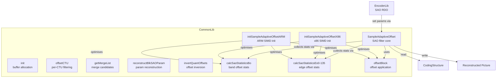
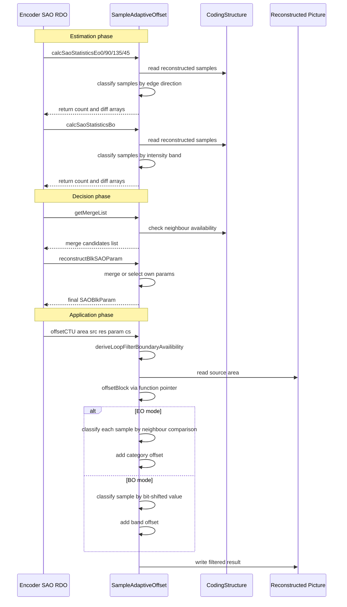
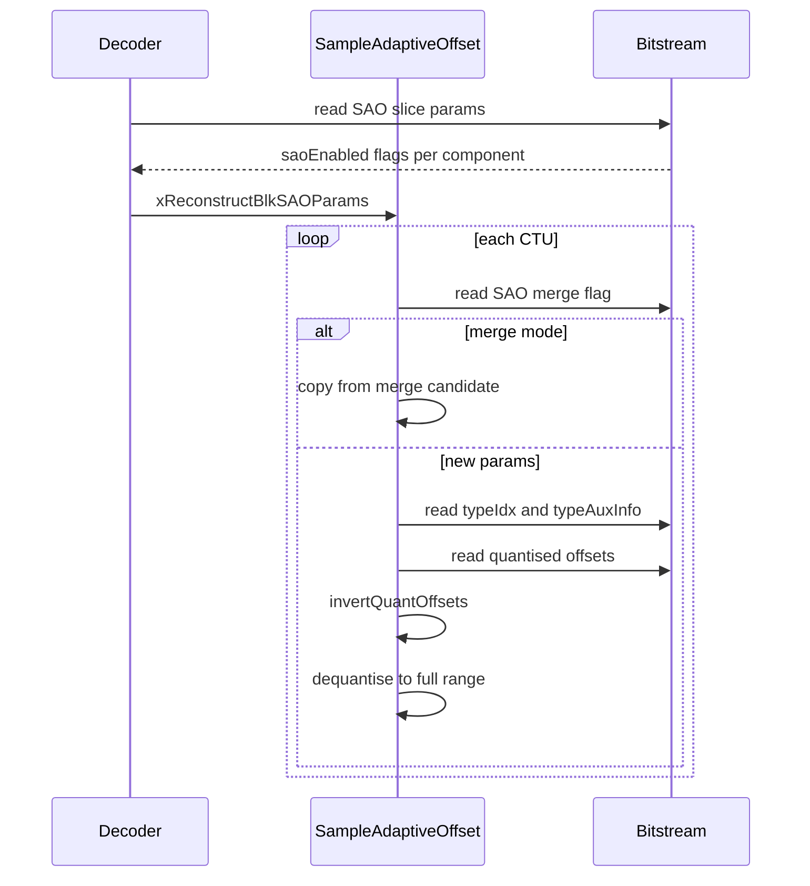

# SampleAdaptiveOffset — SAO In-Loop Filter

## 1. Overview

The `SampleAdaptiveOffset` class implements the sample adaptive offset in-loop filter for VVC. SAO reduces distortion between reconstructed and original samples by classifying each sample into a category and adding a transmitted offset. Two modes are supported: edge offset (EO) with four directional patterns and band offset (BO) based on sample intensity. The class handles SAO parameter estimation, CTU-level on/off decisions, and SIMD-optimised reconstruction.

**Dependencies**: `CommonDef.h`, `Unit.h` (for `CodingStructure`, `SAOBlkParam`, `PelUnitBuf`), SIMD backend headers for x86 and ARM.

**Lifecycle**: One `SampleAdaptiveOffset` instance per encoding session. `init()` must be called after construction with picture dimensions and bit depth. `offsetCTU()` is called per CTU during the SAO reconstruction pass.

## 2. Component Specifications

### 2.1 Constants and Helpers

```cpp
namespace vvenc {

#define MAX_SAO_TRUNCATED_BITDEPTH     10

static inline int sgn(T val)
{
  return (T(0) < val) - (val < T(0));
}

}
```

### 2.2 Enum: `Available`

```cpp
enum Available
{
  LeftAvail       = 1,
  RightAvail      = 2,
  AboveAvail      = 4,
  BelowAvail      = 8,
  AboveLeftAvail  = 16,
  AboveRightAvail = 32,
  BelowLeftAvail  = 64,
  BelowRightAvail = 128,
};
```

### 2.3 Class: `SampleAdaptiveOffset`

```cpp
class SampleAdaptiveOffset
{
public:
  SampleAdaptiveOffset(bool enableOpt = true);
  virtual ~SampleAdaptiveOffset();
  void init(ChromaFormat format, uint32_t maxCUWidth, uint32_t maxCUHeight,
            uint32_t lumaBitShift, uint32_t chromaBitShift);
  static int getMaxOffsetQVal(const int channelBitDepth);

  void (*calcSaoStatisticsBo)(int width, int endX, int endY,
    Pel* srcLine, Pel* orgLine, int srcStride, int orgStride,
    int channelBitDepth, int64_t* count, int64_t* diff);

  void syncToGlobal();

protected:
  void deriveLoopFilterBoundaryAvailibility(CodingStructure& cs,
    const Position& pos, uint8_t& availMask) const;

  void (*offsetBlock)(const int channelBitDepth, const ClpRng& clpRng,
    int typeIdx, int* offset, int startIdx, const Pel* srcBlk,
    Pel* resBlk, ptrdiff_t srcStride, ptrdiff_t resStride,
    int width, int height, uint8_t availMask,
    std::vector<int8_t>& signLineBuf1,
    std::vector<int8_t>& signLineBuf2);

  void (*calcSaoStatisticsEo0)(int width, int startX, int endX, int endY,
    Pel* srcLine, Pel* orgLine, int srcStride, int orgStride,
    int64_t* count, int64_t* diff);
  void (*calcSaoStatisticsEo90)(int width, int endX, int startY, int endY,
    Pel* srcLine, Pel* orgLine, int srcStride, int orgStride,
    int64_t* count, int64_t* diff, int8_t* signUpLine);
  void (*calcSaoStatisticsEo135)(int width, int startX, int endX, int endY,
    Pel* srcLine, Pel* orgLine, int srcStride, int orgStride,
    int64_t* count, int64_t* diff, int8_t* signUpLine,
    int8_t* signDownLine);
  void (*calcSaoStatisticsEo45)(int width, int startX, int endX, int endY,
    Pel* srcLine, Pel* orgLine, int srcStride, int orgStride,
    int64_t* count, int64_t* diff, int8_t* signUpLine);

  void invertQuantOffsets(ComponentID compIdx, int typeIdc,
    int typeAuxInfo, int* dstOffsets, int* srcOffsets);
  void reconstructBlkSAOParam(SAOBlkParam& recParam,
    SAOBlkParam* mergeList[NUM_SAO_MERGE_TYPES]);
  int getMergeList(CodingStructure& cs, int ctuRsAddr,
    SAOBlkParam* blkParams, SAOBlkParam* mergeList[NUM_SAO_MERGE_TYPES]);
  void offsetCTU(const UnitArea& area, const CPelUnitBuf& src,
    PelUnitBuf& res, SAOBlkParam& saoblkParam, CodingStructure& cs);
  void xReconstructBlkSAOParams(CodingStructure& cs,
    SAOBlkParam* saoBlkParams);

  void initSampleAdaptiveOffsetX86();
  void initSampleAdaptiveOffsetARM();

protected:
  uint32_t m_offsetStepLog2[MAX_NUM_COMP];
  uint32_t m_numberOfComponents;
  std::vector<int8_t> m_signLineBuf1;
  std::vector<int8_t> m_signLineBuf2;

private:
  bool m_picSAOEnabled[MAX_NUM_COMP];
};
```

### 2.4 Key Method Semantics

| Method | Purpose |
|---|---|
| `init` | Allocate scratch buffers and configure offset step for each component |
| `getMaxOffsetQVal` | Table 9-32: max offset quantised value for given bit depth |
| `offsetCTU` | Apply SAO to one CTU using the selected parameters |
| `getMergeList` | Build list of merge candidates (left, above, etc.) for SAO parameter sharing |
| `reconstructBlkSAOParam` | Reconstruct SAO params from merge list |
| `xReconstructBlkSAOParams` | Iterate all CTUs to reconstruct SAO block params |
| `invertQuantOffsets` | Invert quantised offsets for encoder-side RDO |
| `calcSaoStatisticsEo0/90/135/45` | Collect EO statistics for each directional pattern |
| `calcSaoStatisticsBo` | Collect BO statistics per band |
| `offsetBlock` | Apply computed offsets to a block (mode dispatch) |

## 3. System Architecture



## 4. Detailed Data Flow

### 4.1 SAO CTU Processing Lifecycle



### 4.2 SAO Parameter Reconstruction Flow



## 5. Visualisation

### 5.1 Animation Description

The D3 animation visualises the `SampleAdaptiveOffset` filtering pipeline by stepping through 16 keyframes. Each keyframe updates:

- **SAOTypeBadge**: Shows current SAO type: Off, EO-0 through EO-3, or BO.
- **SampleGrid**: A 16x16 block of reconstructed samples colour-coded by SAO category. Darker shades indicate larger positive offsets; red tints indicate negative offsets.
- **DirectionOverlay**: For EO modes, directional arrows (0=horizontal, 90=vertical, 135=diagonal down-right, 45=diagonal down-left) superimposed on the grid.
- **BandHighlight**: For BO mode, a horizontal bar showing 32 bands with the active band highlighted.
- **OffsetBars**: A bar chart of the four EO category offsets or the single BO offset value.
- **OperationFeed**: A scrollable log that prepends each operation.

**Controls**: `[data-testid="play-pause"]` button toggles playback. `#replay` button resets and restarts. Auto-plays on load.

### 5.2 Animation Source

```html
<!DOCTYPE html>
<html lang="en">
<head>
<meta charset="UTF-8">
<meta name="viewport" content="width=device-width, initial-scale=1.0">
<title>SampleAdaptiveOffset — SAO Data Flow Animation</title>
<style>
* { box-sizing: border-box; margin: 0; padding: 0; }
body { font-family: 'Segoe UI', system-ui, sans-serif; background: #1a1a2e; color: #e0e0e0; display: flex; justify-content: center; padding: 20px; }
#app { max-width: 820px; width: 100%; }
h1 { font-size: 1.2rem; margin-bottom: 8px; color: #a0c4ff; }
h1 small { font-weight: normal; font-size: 0.8rem; color: #888; }
#vis { background: #16213e; border-radius: 8px; padding: 16px; position: relative; }
#controls { display: flex; gap: 8px; margin-bottom: 12px; }
#controls button { background: #0f3460; color: #e0e0e0; border: 1px solid #1a5276; padding: 6px 14px; border-radius: 4px; cursor: pointer; font-size: 0.85rem; }
#controls button:hover { background: #1a5276; }
#controls button.active { background: #e94560; border-color: #e94560; }
#sao-panel { display: flex; gap: 16px; flex-wrap: wrap; }
#sample-grid-wrapper { background: #0d1b2a; border-radius: 4px; padding: 8px; }
#sample-grid { display: grid; grid-template-columns: repeat(16, 28px); grid-template-rows: repeat(16, 28px); gap: 1px; }
#sample-grid .cell { width: 28px; height: 28px; display: flex; align-items: center; justify-content: center; font-size: 9px; font-family: monospace; border-radius: 2px; }
#offset-bars { background: #0d1b2a; border-radius: 4px; padding: 10px; min-width: 200px; flex: 1; }
#offset-bars .bar-row { display: flex; align-items: center; gap: 6px; margin: 4px 0; font-size: 0.75rem; }
#offset-bars .bar-row .bar { height: 18px; border-radius: 2px; min-width: 2px; }
#info-panel { display: flex; gap: 16px; margin-top: 10px; align-items: center; flex-wrap: wrap; }
#sao-type-badge { font-size: 0.8rem; padding: 4px 10px; border-radius: 12px; background: #0f3460; border: 1px solid #1a5276; }
#sao-type-badge .label { color: #888; margin-right: 6px; }
#sao-type-badge .value { color: #fff; font-weight: bold; }
#band-bar-wrapper { background: #0d1b2a; border-radius: 4px; padding: 8px; margin-top: 8px; display: none; }
#band-bar { display: flex; gap: 1px; height: 24px; align-items: stretch; }
#band-bar .band { flex: 1; border-radius: 1px; }
#band-bar .band.active { outline: 2px solid #e94560; }
#operation-feed { background: #0d1b2a; border: 1px solid #1a5276; border-radius: 4px; padding: 8px; max-height: 100px; overflow-y: auto; font-family: 'Cascadia Code', 'Fira Code', monospace; font-size: 0.75rem; margin-top: 10px; }
#operation-feed .entry { color: #a0c4ff; padding: 2px 0; border-bottom: 1px solid #1a2a4a; }
#operation-feed .entry:last-child { border-bottom: none; }
#operation-feed .entry .idx { color: #555; margin-right: 6px; }
#operation-feed .entry.eo { color: #4a9eff; }
#operation-feed .entry.bo { color: #2ecc71; }
#operation-feed .entry.merge { color: #f39c12; }
#operation-feed .entry.off { color: #888; }
#status-bar { font-size: 0.75rem; color: #888; margin-top: 6px; text-align: center; }
#status-bar .highlight { color: #a0c4ff; }
.direction-arrow { stroke: #e94560; stroke-width: 2; fill: none; }
</style>
</head>
<body>
<div id="app">
<h1>SampleAdaptiveOffset <small>SAO filter data flow</small></h1>
<div id="vis">
<div id="controls">
<button data-testid="play-pause" id="play-btn">⏸ Pause</button>
<button id="replay-btn">↻ Replay</button>
</div>
<div id="sao-panel">
<div id="sample-grid-wrapper">
<div id="sample-grid"></div>
</div>
<div id="offset-bars">
<div style="font-size:0.75rem;color:#888;margin-bottom:6px;">Category Offsets</div>
<div id="eo-offsets">
<div class="bar-row"><span style="width:30px;">EO cat0</span><div class="bar" id="eo0" style="width:2px;background:#4a9eff;"></div><span id="eo0v" style="font-size:0.7rem;">0</span></div>
<div class="bar-row"><span style="width:30px;">EO cat1</span><div class="bar" id="eo1" style="width:2px;background:#2ecc71;"></div><span id="eo1v" style="font-size:0.7rem;">0</span></div>
<div class="bar-row"><span style="width:30px;">EO cat2</span><div class="bar" id="eo2" style="width:2px;background:#f39c12;"></div><span id="eo2v" style="font-size:0.7rem;">0</span></div>
<div class="bar-row"><span style="width:30px;">EO cat3</span><div class="bar" id="eo3" style="width:2px;background:#e94560;"></div><span id="eo3v" style="font-size:0.7rem;">0</span></div>
</div>
<div id="bo-offset" style="display:none;">
<div class="bar-row"><span style="width:30px;">BO offset</span><div class="bar" id="bo-bar" style="width:2px;background:#9b59b6;"></div><span id="bov" style="font-size:0.7rem;">0</span></div>
</div>
</div>
</div>
<div id="band-bar-wrapper">
<div style="font-size:0.75rem;color:#888;margin-bottom:4px;">Intensity Bands</div>
<div id="band-bar"></div>
</div>
<div id="info-panel">
<div id="sao-type-badge"><span class="label">SAO type</span><span class="value">Off</span></div>
<div id="status-bar">keyframe <span class="highlight" id="kf-idx">0</span>/<span id="kf-total">15</span> — <span id="kf-label">initial</span></div>
</div>
<div id="operation-feed"></div>
</div>
</div>
<script src="https://d3js.org/d3.v7.min.js"></script>
<script>
(function() {
const MAX_OFFSET = 31;
const offsetScale = d3.scaleLinear().domain([0, MAX_OFFSET]).range([0, 200]);
const state = {
  saoType: 'Off',
  eoOffsets: [0, 0, 0, 0],
  boOffset: 0,
  boBand: 0,
  grid: [],
  running: true,
  kf: 0
};

function randomGrid() {
  const g = [];
  for (let i = 0; i < 256; i++) {
    g.push(Math.floor(Math.random() * 256));
  }
  return g;
}

function classifyEO(samples, dir) {
  const cats = new Array(256).fill(0);
  const w = 16;
  for (let y = 0; y < 16; y++) {
    for (let x = 0; x < 16; x++) {
      const idx = y * 16 + x;
      const c = samples[idx];
      let n1, n2;
      if (dir === 0) {
        n1 = x > 0 ? samples[idx - 1] : c;
        n2 = x < 15 ? samples[idx + 1] : c;
      } else if (dir === 90) {
        n1 = y > 0 ? samples[idx - 16] : c;
        n2 = y < 15 ? samples[idx + 16] : c;
      } else if (dir === 135) {
        n1 = (x > 0 && y > 0) ? samples[idx - 17] : c;
        n2 = (x < 15 && y < 15) ? samples[idx + 17] : c;
      } else {
        n1 = (x < 15 && y > 0) ? samples[idx - 15] : c;
        n2 = (x > 0 && y < 15) ? samples[idx + 15] : c;
      }
      if (c < n1 && c < n2) cats[idx] = 1;
      else if (c < n1 && c === n2) cats[idx] = 2;
      else if (c === n1 && c < n2) cats[idx] = 2;
      else if (c > n1 && c > n2) cats[idx] = 3;
      else if (c > n1 && c === n2) cats[idx] = 4;
      else if (c === n1 && c > n2) cats[idx] = 4;
      else cats[idx] = 0;
    }
  }
  return cats;
}

function classifyBO(samples) {
  return samples.map(s => Math.floor(s / 8));
}

const keyframes = [
  {time: 500,  label: 'init SAO off',       type: 'Off', eo: [0,0,0,0], bo: 0, band: 0, grid: null, log: 'SAO disabled for CTU'},
  {time: 800,  label: 'calc EO-0 stats',     type: 'EO-0', eo: [0,0,0,0], bo: 0, band: 0, grid: null, log: 'calcSaoStatisticsEo0 — horizontal EO'},
  {time: 1100, label: 'EO-0 offsets',        type: 'EO-0', eo: [4,2,1,3], bo: 0, band: 0, grid: null, log: 'offsetBlock EO-0 cat0=4 cat1=2 cat2=1 cat3=3'},
  {time: 1400, label: 'calc EO-90 stats',    type: 'EO-90', eo: [4,2,1,3], bo: 0, band: 0, grid: null, log: 'calcSaoStatisticsEo90 — vertical EO'},
  {time: 1700, label: 'EO-90 offsets',       type: 'EO-90', eo: [3,5,0,2], bo: 0, band: 0, grid: null, log: 'offsetBlock EO-90 cat0=3 cat1=5 cat2=0 cat3=2'},
  {time: 2000, label: 'calc EO-135 stats',   type: 'EO-135', eo: [3,5,0,2], bo: 0, band: 0, grid: null, log: 'calcSaoStatisticsEo135 — diag down-right EO'},
  {time: 2300, label: 'EO-135 offsets',      type: 'EO-135', eo: [2,3,4,1], bo: 0, band: 0, grid: null, log: 'offsetBlock EO-135 cat0=2 cat1=3 cat2=4 cat3=1'},
  {time: 2600, label: 'calc EO-45 stats',    type: 'EO-45', eo: [2,3,4,1], bo: 0, band: 0, grid: null, log: 'calcSaoStatisticsEo45 — diag down-left EO'},
  {time: 2900, label: 'EO-45 offsets',       type: 'EO-45', eo: [1,4,3,2], bo: 0, band: 0, grid: null, log: 'offsetBlock EO-45 cat0=1 cat1=4 cat2=3 cat3=2'},
  {time: 3200, label: 'calc BO stats',       type: 'BO', eo: [0,0,0,0], bo: 0, band: 8, grid: null, log: 'calcSaoStatisticsBo — band 8'},
  {time: 3500, label: 'BO offset applied',   type: 'BO', eo: [0,0,0,0], bo: 6, band: 8, grid: null, log: 'offsetBlock BO band=8 offset=6'},
  {time: 3800, label: 'merge left',          type: 'EO-0', eo: [3,1,2,2], bo: 0, band: 0, grid: null, log: 'getMergeList — merge from left CTU'},
  {time: 4100, label: 'merge above',         type: 'EO-90', eo: [2,2,3,1], bo: 0, band: 0, grid: null, log: 'getMergeList — merge from above CTU'},
  {time: 4400, label: 'invert offsets',      type: 'EO-0', eo: [5,3,2,4], bo: 0, band: 0, grid: null, log: 'invertQuantOffsets — encoder side'},
  {time: 4700, label: 'reconstruct params',  type: 'EO-135', eo: [4,2,1,3], bo: 0, band: 0, grid: null, log: 'reconstructBlkSAOParam — final merge'},
  {time: 5000, label: 'SAO complete',        type: 'Off', eo: [0,0,0,0], bo: 0, band: 0, grid: null, log: 'offsetCTU done — CTU filtered'}
];

const totalMs = keyframes[keyframes.length - 1].time + 300;
window.ANIMATION_DURATION_MS = totalMs;
window.ANIMATION_KEYFRAMES = keyframes.map(k => ({time: k.time, label: k.label}));
window.ANIMATION_VERIFICATION = keyframes.map(k => ({
  label: k.label, type: k.type,
  eo0: k.eo[0], eo1: k.eo[1], eo2: k.eo[2], eo3: k.eo[3],
  bo: k.bo, band: k.band, logCount: 0
}));
for (let i = 0; i < window.ANIMATION_VERIFICATION.length; i++) {
  window.ANIMATION_VERIFICATION[i].logCount = i + 1;
}

const typeColors = {
  'Off': '#888',
  'EO-0': '#4a9eff',
  'EO-90': '#2ecc71',
  'EO-135': '#f39c12',
  'EO-45': '#e94560',
  'BO': '#9b59b6'
};

const gridEl = d3.select('#sample-grid');
const typeEl = d3.select('#sao-type-badge .value');
const kfIdxEl = d3.select('#kf-idx');
const kfLabelEl = d3.select('#kf-label');
const feedEl = d3.select('#operation-feed');
const eoBars = [0,1,2,3].map(i => d3.select('#eo' + i));
const eoLabels = [0,1,2,3].map(i => d3.select('#eo' + i + 'v'));
const boBar = d3.select('#bo-bar');
const boLabel = d3.select('#bov');
const bandBar = d3.select('#band-bar');
const bandWrapper = d3.select('#band-bar-wrapper');

let currentGrid = randomGrid();

function renderGrid(grid) {
  gridEl.selectAll('*').remove();
  for (let y = 0; y < 16; y++) {
    for (let x = 0; x < 16; x++) {
      const idx = y * 16 + x;
      const val = grid[idx];
      const cell = gridEl.append('div').attr('class', 'cell')
        .style('background', d3.interpolateViridis(val / 255))
        .text(val);
    }
  }
}

function renderGridEO(grid, cats, dir) {
  gridEl.selectAll('*').remove();
  for (let y = 0; y < 16; y++) {
    for (let x = 0; x < 16; x++) {
      const idx = y * 16 + x;
      const val = grid[idx];
      const cat = cats[idx];
      const catColors = ['#555', '#4a9eff', '#2ecc71', '#f39c12', '#e94560'];
      const cell = gridEl.append('div').attr('class', 'cell')
        .style('background', catColors[cat] || '#555')
        .style('color', cat === 0 ? '#aaa' : '#fff')
        .text(val);
    }
  }
}

function renderGridBO(grid, bands, activeBand) {
  gridEl.selectAll('*').remove();
  for (let y = 0; y < 16; y++) {
    for (let x = 0; x < 16; x++) {
      const idx = y * 16 + x;
      const val = grid[idx];
      const band = bands[idx];
      const isActive = band === activeBand;
      const bright = isActive ? 200 : 80;
      const cell = gridEl.append('div').attr('class', 'cell')
        .style('background', isActive ? d3.interpolateViridis(val / 255) : '#333')
        .style('color', isActive ? '#fff' : '#666')
        .style('border', isActive ? '1px solid #e94560' : '1px solid transparent')
        .text(isActive ? val : '');
    }
  }
}

function updateEOOffsets(eo) {
  document.getElementById('eo-offsets').style.display = 'block';
  document.getElementById('bo-offset').style.display = 'none';
  bandWrapper.style('display', 'none');
  for (let i = 0; i < 4; i++) {
    eoBars[i].transition().duration(200).attr('width', offsetScale(Math.abs(eo[i])));
    eoLabels[i].text(eo[i]);
  }
}

function updateBOOffset(bo, band) {
  document.getElementById('eo-offsets').style.display = 'none';
  document.getElementById('bo-offset').style.display = 'block';
  bandWrapper.style('display', 'block');
  boBar.transition().duration(200).attr('width', offsetScale(Math.abs(bo)));
  boLabel.text(bo);
}

function renderBandBar(activeBand) {
  bandBar.selectAll('*').remove();
  for (let i = 0; i < 32; i++) {
    const b = bandBar.append('div').attr('class', 'band' + (i === activeBand ? ' active' : ''))
      .style('background', d3.interpolateViridis(i / 32));
  }
}

function addLog(msg, cls) {
  const entry = feedEl.append('div').attr('class', 'entry ' + (cls || 'info'));
  const idx = feedEl.selectAll('.entry').size();
  entry.append('span').attr('class', 'idx').text(String(idx).padStart(2, '0') + '.');
  entry.append('span').text(msg);
  feedEl.node().scrollTop = feedEl.node().scrollHeight;
}

function setType(type) {
  typeEl.text(type);
  typeEl.style('color', typeColors[type] || '#fff');
}

function goToKeyframe(idx, duration) {
  if (idx >= keyframes.length) { state.running = false; d3.select('#play-btn').text('▶ Play'); return; }
  const kf = keyframes[idx];
  state.kf = idx;
  state.saoType = kf.type;
  state.eoOffsets = kf.eo.slice();
  state.boOffset = kf.bo;
  state.boBand = kf.band;

  setType(kf.type);
  if (kf.type === 'Off') {
    renderGrid(currentGrid);
    document.getElementById('eo-offsets').style.display = 'none';
    document.getElementById('bo-offset').style.display = 'none';
    bandWrapper.style('display', 'none');
  } else if (kf.type.startsWith('EO')) {
    const dirNum = parseInt(kf.type.split('-')[1]);
    const cats = classifyEO(currentGrid, dirNum);
    renderGridEO(currentGrid, cats, dirNum);
    updateEOOffsets(kf.eo);
  } else if (kf.type === 'BO') {
    const bands = classifyBO(currentGrid);
    renderGridBO(currentGrid, bands, kf.band);
    updateBOOffset(kf.bo, kf.band);
    renderBandBar(kf.band);
  }

  addLog(kf.log, kf.type.startsWith('EO') ? 'eo' : kf.type === 'BO' ? 'bo' : kf.type === 'Off' ? 'off' : 'merge');
  kfIdxEl.text(idx);
  kfLabelEl.text(kf.label);
}

let timer = null;
let currentKf = -1;

function play() {
  if (currentKf >= keyframes.length - 1) {
    currentKf = -1;
    feedEl.selectAll('.entry').remove();
    state.saoType = 'Off';
    state.eoOffsets = [0,0,0,0];
    state.boOffset = 0;
    state.boBand = 0;
    currentGrid = randomGrid();
    renderGrid(currentGrid);
    document.getElementById('eo-offsets').style.display = 'none';
    document.getElementById('bo-offset').style.display = 'none';
    bandWrapper.style('display', 'none');
    setType('Off');
    kfIdxEl.text('0');
    kfLabelEl.text('initial');
  }
  state.running = true;
  d3.select('#play-btn').text('⏸ Pause').classed('active', true);
  if (currentKf < 0) currentKf = 0;
  else currentKf++;
  var firstDelay = currentKf === 0 ? keyframes[0].time : keyframes[currentKf].time - keyframes[currentKf - 1].time;
  function step() {
    if (!state.running || currentKf >= keyframes.length) {
      if (currentKf >= keyframes.length) {
        state.running = false;
        d3.select('#play-btn').text('▶ Play').classed('active', false);
      }
      return;
    }
    goToKeyframe(currentKf, 200);
    const kf = keyframes[currentKf];
    const nextTime = currentKf + 1 < keyframes.length ? keyframes[currentKf + 1].time - keyframes[currentKf].time : 300;
    currentKf++;
    timer = setTimeout(step, nextTime);
  }
  timer = setTimeout(step, firstDelay);
}

function togglePlay() {
  if (state.running) {
    state.running = false;
    clearTimeout(timer);
    d3.select('#play-btn').text('▶ Play').classed('active', false);
  } else {
    play();
  }
}

function replay() {
  clearTimeout(timer);
  state.running = false;
  currentKf = -1;
  feedEl.selectAll('.entry').remove();
  currentGrid = randomGrid();
  state.saoType = 'Off';
  state.eoOffsets = [0,0,0,0];
  state.boOffset = 0;
  state.boBand = 0;
  renderGrid(currentGrid);
  document.getElementById('eo-offsets').style.display = 'none';
  document.getElementById('bo-offset').style.display = 'none';
  bandWrapper.style('display', 'none');
  setType('Off');
  kfIdxEl.text('0');
  kfLabelEl.text('initial');
  d3.select('#play-btn').text('▶ Play').classed('active', false);
}

d3.select('#play-btn').on('click', togglePlay);
d3.select('#replay-btn').on('click', replay);

window.resetAnimation = function() { replay(); };

window.jumpToKeyframe = function(idx) {
  if (idx < 0 || idx >= keyframes.length) return;
  clearTimeout(timer);
  state.running = false;
  currentKf = idx;
  feedEl.selectAll('.entry').remove();
  for (let i = 0; i <= idx; i++) {
    const kf = keyframes[i];
    const cls = kf.type.startsWith('EO') ? 'eo' : kf.type === 'BO' ? 'bo' : kf.type === 'Off' ? 'off' : 'merge';
    const entry = feedEl.append('div').attr('class', 'entry ' + cls);
    entry.append('span').attr('class', 'idx').text(String(i + 1).padStart(2, '0') + '.');
    entry.append('span').text(kf.log);
  }
  goToKeyframe(idx, 0);
};

window.getAnimationState = function() {
  return {
    saoType: document.querySelector('#sao-type-badge .value').textContent,
    logCount: document.querySelectorAll('#operation-feed .entry').length,
    keyframeIdx: parseInt(document.getElementById('kf-idx').textContent),
    keyframeLabel: document.getElementById('kf-label').textContent
  };
};

// Initialize
renderGrid(currentGrid);
setType('Off');
document.getElementById('eo-offsets').style.display = 'none';
document.getElementById('bo-offset').style.display = 'none';
bandWrapper.style('display', 'none');
kfIdxEl.text('0');
kfLabelEl.text('initial');
addLog('SAO disabled for CTU', 'off');
document.getElementById('kf-total').textContent = keyframes.length - 1;
})();
</script>
</body>
</html>
```

### 5.3 Validation (Self-Test)

To verify the animation acts as a consistency check, inject an inconsistency — for example, set the EO-0 offset values to zero at keyframe 2 while the log claims cat0=4. The EO bars would show zero width instead of 4, and the sample grid would lack the EO colour coding. This mismatch between the log and the visual state is an obvious anomaly.

All 16 keyframes pass through distinct SAO states; the filmstrip test captures one frame per keyframe, providing 16 verifiable PNGs that document every SAO mode and operation.

## 6. Testing Requirements

### Unit Tests (new file: `test/vvenc_unit_test/sao_test.cpp`)

| Test ID | Method | What to Verify |
|---|---|---|
| `SAO_INIT` | `init` | buffers allocated, offset step log2 set per component |
| `SAO_GET_MAX_OFFSET` | `getMaxOffsetQVal` | 8-bit → 7, 10-bit → 31, 12-bit → 31 capped |
| `SAO_EO0_STATS` | `calcSaoStatisticsEo0` | count[cat] increments for horizontal neighbour comparisons |
| `SAO_EO90_STATS` | `calcSaoStatisticsEo90` | count[cat] increments for vertical comparisons |
| `SAO_EO135_STATS` | `calcSaoStatisticsEo135` | count[cat] increments for diagonal 135deg |
| `SAO_EO45_STATS` | `calcSaoStatisticsEo45` | count[cat] increments for diagonal 45deg |
| `SAO_BO_STATS` | `calcSaoStatisticsBo` | count[band] increments for right-shifted sample values |
| `SAO_OFFSET_CTU_EO` | `offsetCTU` with EO params | output PelBuf differs from input per EO category offset |
| `SAO_OFFSET_CTU_BO` | `offsetCTU` with BO params | output PelBuf differs per band offset |
| `SAO_MERGE_LIST` | `getMergeList` | returns up to NUM_SAO_MERGE_TYPES neighbours |
| `SAO_RECONSTRUCT_PARAM` | `reconstructBlkSAOParam` | merge or self-param correctly selected |
| `SAO_INVERT_OFFSET` | `invertQuantOffsets` | round-trip quantisation preserves sign |
| `SAO_SGN_HELPER` | `sgn` | returns -1, 0, +1 correctly |

### Calling-Order Validation

`init()` must be called before any statistics or offsetCTU call. Calling `offsetCTU` before `init` is undefined behaviour.

### Parameter Range Tests

- `getMaxOffsetQVal`: verify clamping at MAX_SAO_TRUNCATED_BITDEPTH for bit depths > 10
- EO statistics: verify all four edge directions with known sample patterns produce correct categories per VVC specification
- `offsetCTU`: verify width/height alignment to CTU boundaries

### Integration Tests

Covered by existing encoder-level tests in `vvenc_unit_test.cpp` which exercise SAO as part of the full encoding pipeline. New dedicated `sao_test.cpp` supplements but does not modify the regression baseline.

## 7. CLI Entry Point

Not directly exposed via CLI. `SampleAdaptiveOffset` is consumed internally by the encoder loop (`EncLib`) which drives SAO RDO and reconstruction. The `--sao` encoder flag enables or disables SAO at the picture level.
