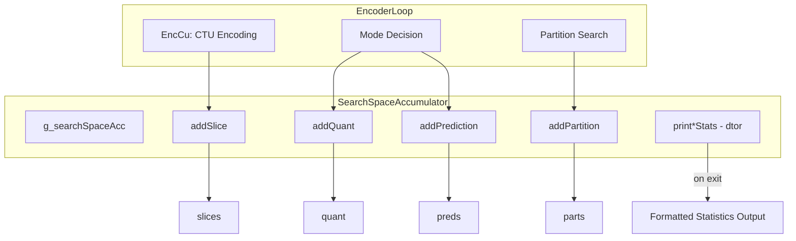
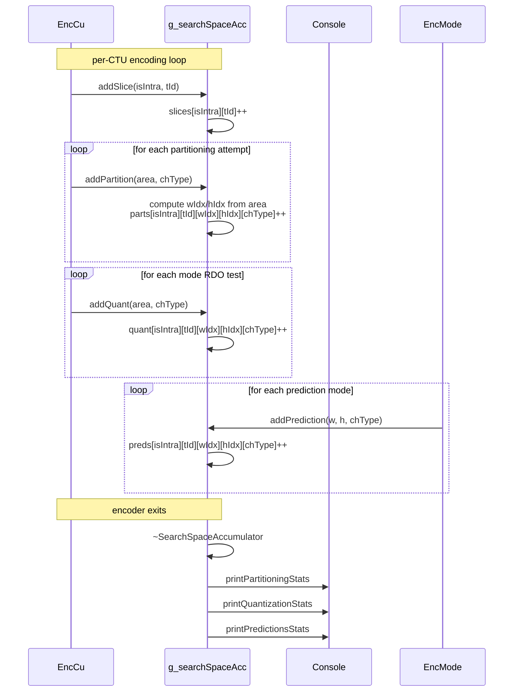

# SearchSpaceCounter — Encoder Search Space Statistics per CTU

## 1. Overview

The `SearchSpaceAccumulator` struct (guarded by `ENABLE_MEASURE_SEARCH_SPACE`) tracks encoder search space utilization at per-CTU granularity. It accumulates counters for partitioning modes, quantization paths, and prediction modes across temporal layers, block sizes, and channel types. A global instance `g_searchSpaceAcc` is created; its destructor logs statistics at encoder shutdown.

**Dependencies**: `Unit.h` (for `UnitArea`), `CommonDef.h` (for preprocessor guard).

**Lifecycle**: The global `g_searchSpaceAcc` is constructed at program start (when the flag is enabled). Each CTU calls `addSlice`/`addPartition`/`addQuant`/`addPrediction` during the encoding loop. On destruction, formatted reports are printed via `print*Stats`.

## 2. Component Specifications

### 2.1 Struct: `SearchSpaceAccumulator`

```cpp
#pragma once

#if ENABLE_MEASURE_SEARCH_SPACE

namespace vvenc {

struct SearchSpaceAccumulator
{
  size_t parts[2][6][8][8][2];
  size_t quant[2][6][8][8][2];
  size_t preds[2][6][8][8][2];
  size_t picW;
  size_t picH;
  size_t slices[2][6];
  int    currTId;
  bool   currIsIntra;

  SearchSpaceAccumulator();
  ~SearchSpaceAccumulator();

  void addSlice( bool intra, int tId );
  void addQuant     ( const struct UnitArea& area, int chType );
  void addPartition ( const struct UnitArea& area, int chType );
  void addPrediction( const int w, const int h, int chType );

private:
  void printQuantizationStats() const;
  void printPartitioningStats() const;
  void printPredictionsStats()  const;
  void printStats( const size_t stat[2][6][8][8][2] ) const;
};

extern SearchSpaceAccumulator g_searchSpaceAcc;

} // namespace vvenc

#endif
```

**Counter dimensions**: Each 5D array is indexed as `[intra][tId][wIdx][hIdx][chType]`. The 2 intra/inter domains, up to 6 temporal layers, 8×8 log2-size bins, and 2 channel types (luma/chroma).

## 3. Dependency Graph



## 4. Detailed Data Flow



## 5. Visualisation

No D3 animation — this module is purely a compile-time-gated statistics accumulator with console output on destruction.

## 6. Testing Requirements

### Unit Tests

| Test ID | Method | What to Verify |
|---|---|---|
| `SSC_ADD_SLICE` | `addSlice(bool, int)` | `slices[intra][tId]` incremented; `currIsIntra`/`currTId` updated |
| `SSC_ADD_PARTITION` | `addPartition(area, chType)` | Correct wIdx/hIdx derived from `area`; counter incremented in `parts` |
| `SSC_ADD_QUANT` | `addQuant(area, chType)` | Correct wIdx/hIdx; `quant` counter incremented |
| `SSC_ADD_PREDICTION` | `addPrediction(w, h, chType)` | `preds` counter incremented at correct wIdx/hIdx |
| `SSC_PRINT_STATS` | `printStats(stat)` | Output contains expected formatting with per-slice/per-size breakdown |
| `SSC_MULTI_CTU` | Accumulate across 2 CTUs | Counters are additive; no overlap between CTU regions |
| `SSC_ZERO_INIT` | Constructor | All arrays zero-initialised; `picW`/`picH` zero |

### Compile-Time Gating

All `SearchSpaceAccumulator` code is behind `#if ENABLE_MEASURE_SEARCH_SPACE`. Without the flag, the struct and `g_searchSpaceAcc` are absent — no memory or runtime overhead.

## 7. CLI Entry Point

Not directly exposed. `SearchSpaceAccumulator` is an internal diagnostics tool activated by the build flag `ENABLE_MEASURE_SEARCH_SPACE`. When enabled, all encoder pipelines that call `add*` methods participate automatically; no CLI toggle is needed.
