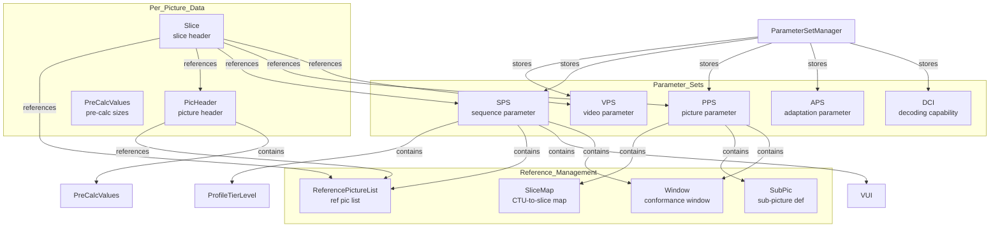
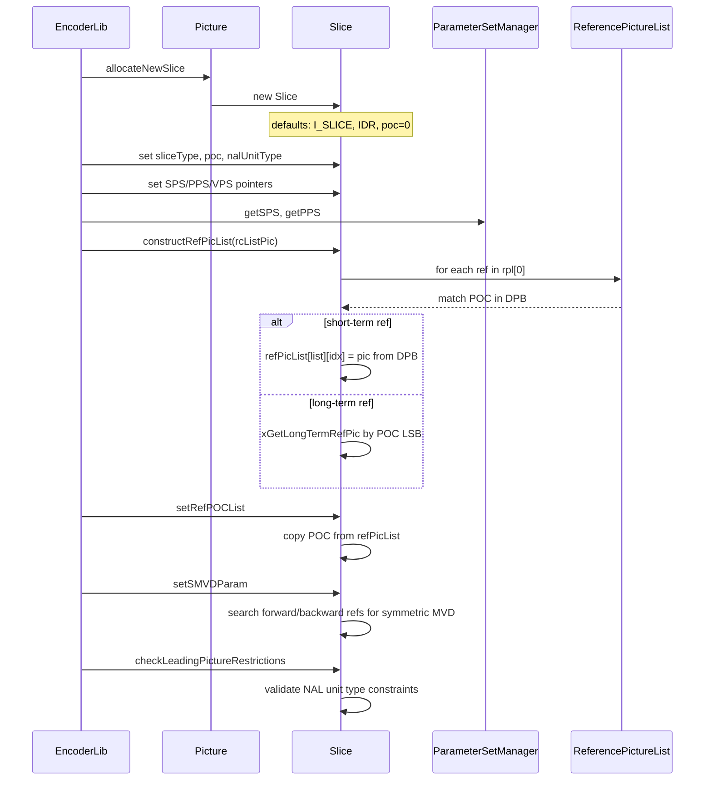
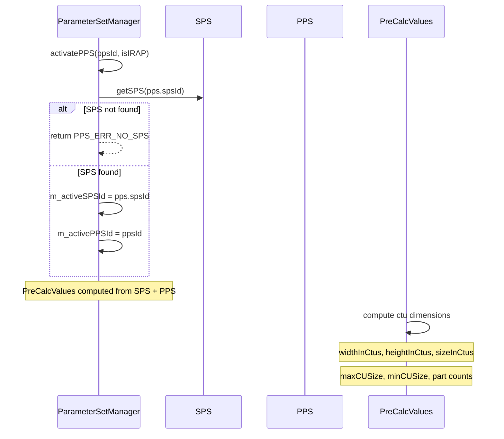

# Slice — Slice Header and Parameter Set Classes

## 1. Overview

The `Slice.h` header defines the core VVC parameter set and slice header types: `SPS` (sequence parameter set), `PPS` (picture parameter set), `APS` (adaptation parameter set), `PicHeader` (picture header), `Slice` (per-slice header), `VPS` (video parameter set), `DCI` (decoding capability information), plus supporting structs for reference picture lists, sub-pictures, tiles, chroma QP mapping, weighted prediction, constraints, and DPB parameters.

**Dependencies**: `CommonDef.h`, `Rom.h`, `AlfParameters.h`, `Common.h`, `MotionInfo.h`, `HRD.h`, `vvenc/vvencCfg.h`.

**Lifecycle**: Parameter sets (SPS, PPS, APS, VPS, DCI) are created on the heap and stored in `ParameterSetMap`. `Slice` objects are created by `Picture::allocateNewSlice()` and owned by the `Picture::slices` deque. `PicHeader` is created separately and attached to `CodingStructure`.

## 2. Component Specifications

### 2.1 Struct: `DpbParameters`

```cpp
struct DpbParameters
{
  int maxDecPicBuffering[VVENC_MAX_TLAYER];
  int numReorderPics[VVENC_MAX_TLAYER];
  int maxLatencyIncreasePlus1[VVENC_MAX_TLAYER];
};
```

DPB sizing per temporal layer.

### 2.2 Struct: `ReferencePictureList`

```cpp
struct ReferencePictureList
{
  int       numberOfShorttermPictures;
  int       numberOfLongtermPictures;
  int       numberOfActivePictures;
  bool      isLongtermRefPic[VVENC_MAX_NUM_REF_PICS];
  int       refPicIdentifier[VVENC_MAX_NUM_REF_PICS];
  int       POC[VVENC_MAX_NUM_REF_PICS];
  uint32_t  deltaPocMSBCycleLT[VVENC_MAX_NUM_REF_PICS];
  bool      deltaPocMSBPresent[VVENC_MAX_NUM_REF_PICS];
  bool      ltrpInSliceHeader;
  bool      interLayerPresent;
  bool      isInterLayerRefPic[VVENC_MAX_NUM_REF_PICS];
  int       interLayerRefPicIdx[VVENC_MAX_NUM_REF_PICS];
  int       numberOfInterLayerPictures;

  void initFromGopEntry(const GOPEntry& gopEntry, int l);
  void setRefPicIdentifier(int idx, int identifier, bool isLongterm, bool isInterLayerRefPic, int interLayerIdx);
  int  getNumRefEntries() const;
  bool isPOCInRefPicList(const int poc, const int currPoc) const;
};
```

### 2.3 Struct: `ConstraintInfo`

```cpp
struct ConstraintInfo
{
  bool gciPresent;
  bool noRprConstraintFlag;
  // ... 50+ constraint flags for VVC profile/tier/level
  bool noApsConstraintFlag;
};
```

Flags restricting tool usage for conformance.

### 2.4 Struct: `ProfileTierLevel`

```cpp
struct ProfileTierLevel
{
  vvencTier             tierFlag;
  vvencProfile          profileIdc;
  uint8_t               numSubProfile;
  std::vector<uint32_t> subProfileIdc;
  vvencLevel            levelIdc;
  bool                  frameOnlyConstraintFlag;
  bool                  multiLayerEnabledFlag;
  ConstraintInfo        constraintInfo;
  bool                  subLayerLevelPresent[VVENC_MAX_TLAYER - 1];
  vvencLevel            subLayerLevelIdc[VVENC_MAX_TLAYER - 1];
};
```

### 2.5 Struct: `LmcsParam`

```cpp
struct LmcsParam
{
  bool      sliceReshaperEnabled;
  bool      sliceReshaperModelPresent;
  unsigned  enableChromaAdj;
  uint32_t  reshaperModelMinBinIdx;
  uint32_t  reshaperModelMaxBinIdx;
  int       reshaperModelBinCWDelta[PIC_CODE_CW_BINS];
  int       maxNbitsNeededDeltaCW;
  int       chrResScalingOffset;
};
```

### 2.6 Struct: `ChromaQpAdj` / `ChromaQpMappingTable`

```cpp
struct ChromaQpAdj
{
  union { struct { int CbOffset, CrOffset, JointCbCrOffset; } comp; int offset[3]; } u;
};

struct ChromaQpMappingTable : vvencChromaQpMappingTableParams
{
  int  getMappedChromaQpValue(ComponentID compID, const int qpVal) const;
  void derivedChromaQPMappingTables();
  void setParams(const vvencChromaQpMappingTableParams& params, const int qpBdOffset);
};
```

### 2.7 Struct: `SliceMap` / `RectSlice` / `SubPic`

```cpp
struct SliceMap
{
  uint32_t sliceID;
  uint32_t numTilesInSlice;
  uint32_t numCtuInSlice;
  std::vector<int> ctuAddrInSlice;
  void initSliceMap();
  void addCtusToSlice(uint32_t startX, uint32_t stopX, uint32_t startY, uint32_t stopY, uint32_t picWidthInCtbsY);
};

struct RectSlice
{
  uint32_t tileIdx;
  uint32_t sliceWidthInTiles;
  uint32_t sliceHeightInTiles;
  uint32_t numSlicesInTile;
  uint32_t sliceHeightInCtu;
};

struct SubPic
{
  uint32_t subPicID, subPicIdx;
  uint32_t numCTUsInSubPic;
  uint32_t subPicCtuTopLeftX, subPicCtuTopLeftY;
  uint32_t subPicWidth, subPicHeight;
  uint32_t subPicWidthInLumaSample, subPicHeightInLumaSample;
  uint32_t firstCtuInSubPic, lastCtuInSubPic;
  uint32_t subPicLeft, subPicRight, subPicTop, subPicBottom;
  std::vector<uint32_t> ctuAddrInSubPic;
  bool treatedAsPic;
  bool loopFilterAcrossSubPicEnabled;
  uint32_t numSlicesInSubPic;

  bool isContainingPos(const Position& pos) const;
  void init(unsigned picWithInCtu, unsigned picHeightInCtu, unsigned picWithInSamples, unsigned picHeighthInSamples);
};
```

### 2.8 Struct: `DCI` / `VPS`

```cpp
struct DCI
{
  uint32_t dciId;
  std::vector<ProfileTierLevel> profileTierLevel;
};

struct VPS
{
  uint32_t vpsId, maxLayers, maxSubLayers;
  uint32_t layerId[MAX_VPS_LAYERS];
  bool independentLayer[MAX_VPS_LAYERS];
  bool directRefLayer[MAX_VPS_LAYERS][MAX_VPS_LAYERS];
  uint8_t maxTidIlRefPicsPlus1[MAX_VPS_LAYERS][MAX_VPS_LAYERS];
  uint32_t olsModeIdc;
  uint32_t numOutputLayerSets;
  // ... multi-OLS DPB/HRD parameters
  int getMaxDecPicBuffering(int temporalId) const;
  int getNumReorderPics(int temporalId) const;
};
```

### 2.9 Struct: `SPS`

```cpp
struct SPS
{
  int   spsId, dciId, vpsId, layerId;
  bool  AffineAmvr, DMVR, MMVD, SBT, ISP;
  ChromaFormat chromaFormatIdc;
  uint32_t maxTLayers;

  uint32_t maxPicWidthInLumaSamples, maxPicHeightInLumaSamples;
  Window conformanceWindow;
  bool subPicInfoPresent;
  uint8_t numSubPics;

  unsigned CTUSize;
  unsigned minQTSize[3], maxMTTDepth[3], maxBTSize[3], maxTTSize[3];
  bool dualITree;

  RPLList rplList[NUM_REF_PIC_LIST_01];
  bool rpl1CopyFromRpl0;

  bool temporalMVPEnabled;
  bool transformSkip, BDPCM, jointCbCr;
  BitDepths bitDepths;
  bool entropyCodingSyncEnabled;
  int qpBDOffset[MAX_NUM_CH];

  bool SbtMvp, BDOF, fpelMmvd;
  uint32_t bitsForPOC;
  bool pocMsbFlag;
  uint32_t pocMsbLen;

  bool weightPred, weightedBiPred;
  bool saoEnabled, alfEnabled, ccalfEnabled;
  bool wrapAroundEnabled, IBC, useColorTrans, PLT;
  bool lumaReshapeEnable, AMVR, LMChroma;
  bool MTS, LFNST, SMVD, Affine, AffineType, PROF, BCW, CIIP, GEO;
  bool MRL, MIP, LADF;
  bool GDR;
  bool rprEnabled, resChangeInClvsEnabled;

  uint32_t log2ParallelMergeLevelMinus2;
  uint32_t maxNumMergeCand, maxNumAffineMergeCand, maxNumIBCMergeCand, maxNumGeoCand;

  ChromaQpMappingTable chromaQpMappingTable;
  ProfileTierLevel profileTierLevel;
  GeneralHrdParams generalHrdParams;
  OlsHrdParams olsHrdParams[VVENC_MAX_TLAYER];
  VUI vuiParameters;

  int getNumRPL(int idx) const;
  uint32_t getMaxTbSize() const;
};
```

### 2.10 Struct: `Window` / `VUI`

```cpp
struct Window
{
  bool enabledFlag;
  int winLeftOffset, winRightOffset, winTopOffset, winBottomOffset;
  void setWindow(int offsetLeft, int offsetLRight, int offsetLTop, int offsetLBottom);
};

struct VUI
{
  bool progressiveSourceFlag, interlacedSourceFlag;
  bool aspectRatioInfoPresent;
  uint32_t aspectRatioIdc, sarWidth, sarHeight;
  bool colourDescriptionPresent;
  uint32_t colourPrimaries, transferCharacteristics, matrixCoefficients;
  // ... chroma location info
};
```

### 2.11 Struct: `PPS`

```cpp
struct PPS
{
  int ppsId, spsId;
  int picInitQPMinus26;
  bool useDQP;
  int chromaQpOffset[MAX_NUM_COMP+1];
  ChromaQpAdj chromaQpAdjTableIncludingNullEntry[1+MAX_QP_OFFSET_LIST_SIZE];
  uint32_t numRefIdxL0DefaultActive, numRefIdxL1DefaultActive;
  bool weightPred, weightedBiPred;
  bool outputFlagPresent;
  bool noPicPartition;
  uint8_t log2CtuSize, ctuSize;
  uint32_t picWidthInCtu, picHeightInCtu;
  uint32_t numExpTileCols, numExpTileRows, numTileCols, numTileRows;
  std::vector<uint32_t> tileColWidth, tileRowHeight;
  std::vector<uint32_t> tileColBd, tileRowBd;
  std::vector<uint32_t> tileColBdRgt, tileRowBdBot;
  std::vector<uint32_t> ctuToTileCol, ctuToTileRow;
  bool rectSlice, singleSlicePerSubPic;
  std::vector<uint32_t> ctuToSubPicIdx;
  uint32_t numSlicesInPic;
  std::vector<SliceMap> sliceMap;
  std::vector<SubPic> subPics;
  bool loopFilterAcrossTilesEnabled, loopFilterAcrossSlicesEnabled;
  bool cabacInitPresent;
  bool deblockingFilterControlPresent;
  int deblockingFilterBetaOffsetDiv2[MAX_NUM_COMP];
  int deblockingFilterTcOffsetDiv2[MAX_NUM_COMP];
  bool listsModificationPresent;
  bool rplInfoInPh, dbfInfoInPh, saoInfoInPh, alfInfoInPh, wpInfoInPh, qpDeltaInfoInPh;
  uint32_t picWidthInLumaSamples, picHeightInLumaSamples;
  Window conformanceWindow, scalingWindow;
  bool wrapAroundEnabled;
  unsigned picWidthMinusWrapAroundOffset, wrapAroundOffset;
  PreCalcValues* pcv;

  uint32_t getNumTiles() const;
  uint32_t getTileIdx(uint32_t ctuX, uint32_t ctuY) const;
  uint32_t getTileHeight(int tileIdx) const;
  uint32_t getTileWidth(int tileIdx) const;
  const SubPic& getSubPicFromPos(const Position& pos) const;
  void initTiles();
  void initRectSliceMap(const SPS* sps);
};
```

### 2.12 Struct: `APS`

```cpp
struct APS
{
  uint32_t apsId;
  int temporalId, layerId;
  uint32_t apsType;
  AlfParam alfParam;
  LmcsParam lmcsParam;
  CcAlfFilterParam ccAlfParam;
  bool hasPrefixNalUnitType;
  bool chromaPresent;
  int poc;
};
```

### 2.13 Struct: `WPScalingParam` / `WPACDCParam`

```cpp
struct WPScalingParam
{
  bool presentFlag;
  uint32_t log2WeightDenom;
  int iWeight, iOffset;
  int w, o, offset, shift, round;
};

struct WPACDCParam
{
  int64_t iAC, iDC;
};
```

### 2.14 Struct: `PicHeader`

```cpp
struct PicHeader
{
  Picture*       pic;
  int            pocLsb;
  bool           nonRefPic, gdrOrIrapPic, gdrPic;
  bool           noOutputOfPriorPics;
  uint32_t       recoveryPocCnt;
  int            spsId, ppsId;
  bool           pocMsbPresent;
  int            pocMsbVal;
  bool           virtualBoundariesEnabled, virtualBoundariesPresent;
  unsigned       numVerVirtualBoundaries, numHorVirtualBoundaries;
  unsigned       virtualBoundariesPosX[3], virtualBoundariesPosY[3];
  bool           picOutputFlag;
  const ReferencePictureList* pRPL[NUM_REF_PIC_LIST_01];
  ReferencePictureList localRPL[NUM_REF_PIC_LIST_01];
  int            rplIdx[NUM_REF_PIC_LIST_01];
  bool           picInterSliceAllowed, picIntraSliceAllowed;
  bool           splitConsOverride;
  uint32_t       cuQpDeltaSubdivIntra, cuQpDeltaSubdivInter;
  uint32_t       cuChromaQpOffsetSubdivIntra, cuChromaQpOffsetSubdivInter;
  bool           enableTMVP, picColFromL0;
  uint32_t       colRefIdx;
  bool           mvdL1Zero;
  uint32_t       maxNumAffineMergeCand;
  bool           disFracMMVD, disBdofFlag, disDmvrFlag, disProfFlag;
  int            qpDelta;
  bool           saoEnabled[MAX_NUM_CH];
  bool           alfEnabled[MAX_NUM_COMP];
  int            numAlfAps;
  std::vector<int> alfApsId;
  int            alfChromaApsId;
  bool           ccalfEnabled[MAX_NUM_COMP];
  int            ccalfCbApsId, ccalfCrApsId;
  bool           deblockingFilterOverride, deblockingFilterDisable;
  int            deblockingFilterBetaOffsetDiv2[MAX_NUM_COMP];
  int            deblockingFilterTcOffsetDiv2[MAX_NUM_COMP];
  bool           lmcsEnabled;
  int            lmcsApsId;
  APS*           lmcsAps;
  bool           lmcsChromaResidualScale;
  bool           explicitScalingListEnabled;
  int            scalingListApsId;
  APS*           scalingListAps;
  unsigned       minQTSize[3], maxMTTDepth[3], maxBTSize[3], maxTTSize[3];
  WPScalingParam weightPredTable[NUM_REF_PIC_LIST_01][MAX_NUM_REF][MAX_NUM_COMP];
  int            numL0Weights, numL1Weights;

  void getWpScaling(RefPicList e, int iRefIdx, WPScalingParam *&wp) const;
  void copyPicInfo(const PicHeader* other, bool cpyAll);
  void initPicHeader();
};
```

### 2.15 Class: `Slice`

```cpp
class Slice
{
public:
  bool   saoEnabled[MAX_NUM_CH];
  int    ppsId, poc, lastIDR, prevGDRInSameLayerPOC, associatedIRAP;
  vvencNalUnitType associatedIRAPType;
  bool   enableDRAPSEI, useLTforDRAP, isDRAP;
  int    latestDRAPPOC;
  const ReferencePictureList* rpl[NUM_REF_PIC_LIST_01];
  ReferencePictureList rplLocal[NUM_REF_PIC_LIST_01];
  int    rplIdx[NUM_REF_PIC_LIST_01];
  bool   pictureHeaderInSliceHeader;
  uint32_t nuhLayerId;
  vvencNalUnitType nalUnitType;
  SliceType sliceType;
  int    sliceQp;
  bool   chromaQpAdjEnabled, lmcsEnabled, explicitScalingListUsed;
  bool   deblockingFilterDisable, deblockingFilterOverride;
  int    deblockingFilterBetaOffsetDiv2[MAX_NUM_COMP];
  int    deblockingFilterTcOffsetDiv2[MAX_NUM_COMP];
  bool   depQuantEnabled, signDataHidingEnabled, tsResidualCodingDisabled;
  int    list1IdxToList0Idx[MAX_NUM_REF];
  int    numRefIdx[NUM_REF_PIC_LIST_01];
  bool   pendingRasInit, checkLDC, biDirPred, lmChromaCheckDisable;
  int    symRefIdx[2];
  int    sliceChromaQpDelta[MAX_NUM_COMP+1];
  Picture* refPicList[NUM_REF_PIC_LIST_01][MAX_NUM_REF+1];
  int    refPOCList[NUM_REF_PIC_LIST_01][MAX_NUM_REF+1];
  bool   isUsedAsLongTerm[NUM_REF_PIC_LIST_01][MAX_NUM_REF+1];
  const VPS* vps;
  const DCI* dci;
  const SPS* sps;
  const PPS* pps;
  Picture* pic;
  PicHeader* picHeader;
  bool   colFromL0Flag;
  uint32_t colRefIdx;
  double lambdas[MAX_NUM_COMP];
  uint32_t TLayer;
  bool   TLayerSwitchingFlag;
  SliceMap sliceMap;
  uint32_t independentSliceIdx;
  WPScalingParam weightPredTable[NUM_REF_PIC_LIST_01][MAX_NUM_REF][MAX_NUM_COMP];
  WPACDCParam weightACDCParam[MAX_NUM_COMP];
  ClpRngs clpRngs;
  std::vector<uint32_t> substreamSizes;
  bool   cabacInitFlag;
  uint32_t sliceSubPicId;
  SliceType encCABACTableIdx;
  APS*   alfAps[ALF_CTB_MAX_NUM_APS];
  bool   alfEnabled[MAX_NUM_COMP];
  int    numAps;
  std::vector<int> lumaApsId;
  int    chromaApsId;
  bool   ccAlfCbEnabled, ccAlfCrEnabled;
  int    ccAlfCbApsId, ccAlfCrApsId;
  bool   isLossless;
  CcAlfFilterParam ccAlfFilterParam;
  uint8_t* ccAlfFilterControl[2];

  void resetSlicePart();
  void constructRefPicList(const PicList& rcListPic, bool extBorder, const bool usingLongTerm = true);
  bool checkAllRefPicsAccessible() const;
  bool checkAllRefPicsReconstructed() const;
  void setRefPOCList();
  void setSMVDParam();
  void checkColRefIdx(uint32_t curSliceSegmentIdx, const Picture* pic) const;
  void setAlfAPSs(APS** apss);

  const Picture* getRefPic(RefPicList e, int iRefIdx) const;
  int  getRefPOC(RefPicList e, int iRefIdx) const;
  int  getNumEntryPoints(const SPS& sps, const PPS& pps) const;

  bool getRapPicFlag() const;
  bool getIdrPicFlag() const;
  bool isIRAP() const;
  bool isIntra() const;
  bool isInterB() const;
  bool isInterP() const;

  void setLambdas(const double lambdas_[MAX_NUM_COMP]);
  const double* getLambdas() const;

  static void sortPicList(PicList& rcListPic);
  void setList1IdxToList0Idx();
  void copySliceInfo(const Slice* slice, bool cpyAlmostAll = true);
  void checkLeadingPictureRestrictions(const PicList& rcListPic) const;
  void applyReferencePictureListBasedMarking(const PicList& rcListPic, const ReferencePictureList* pRPL0, const ReferencePictureList* pRPL1, const int layerId, const PPS& pps, const bool usingLongTerm = true) const;
  bool isStepwiseTemporalLayerSwitchingPointCandidate(const PicList& rcListPic) const;
  bool isRplPicMissing(const PicList& rcListPic, const RefPicList refList, int& missingPoc, int ip) const;
  void createExplicitReferencePictureSetFromReference(const PicList& rcListPic, const ReferencePictureList* pRPL0, const ReferencePictureList* pRPL1, int ip);
  void getWpScaling(RefPicList e, int iRefIdx, WPScalingParam *&wp) const;
  void resetWpScaling();
  void setDefaultClpRng(const SPS& sps);
  unsigned getMinPictureDistance() const;
  bool isPocRestrictedByDRAP(int poc, bool precedingDRAPInDecodingOrder) const;
  bool refPicIsFutureIDRnoLP(int candPoc, int ipc) const;
  void setAlfApsIds(const std::vector<int>& ApsIDs);
};
```

### 2.16 Class: `ParameterSetMap<T>`

```cpp
template <class T> class ParameterSetMap
{
public:
  T* allocatePS(const int psId);
  void clearMap();
  void storePS(int psId, T* ps);
  void storePS(int psId, T* ps, const std::vector<uint8_t>* pNaluData);
  bool getChangedFlag(int psId) const;
  void setChangedFlag(int psId, bool bChanged = true);
  void clearChangedFlag(int psId);
  T* getPS(int psId);
  T* getFirstPS();
  void setActive(int psId);
  void clearActive();
};
```

### 2.17 Class: `ParameterSetManager`

```cpp
class ParameterSetManager
{
  void storeVPS(VPS* vps, const std::vector<uint8_t>& naluData);
  VPS* getVPS(int vpsId);
  void storeSPS(SPS* sps, const std::vector<uint8_t>& naluData);
  SPS* getSPS(int spsId);
  void storePPS(PPS* pps, const std::vector<uint8_t>& naluData);
  PPS* getPPS(int ppsId);
  PPSErrCodes activatePPS(int ppsId, bool isIRAP);
  APS** getAPSs();
  void storeAPS(APS* aps, const std::vector<uint8_t>& naluData);
  APS* getAPS(int apsId, int apsType);
  bool activateAPS(int apsId, int apsType);
};
```

### 2.18 Class: `PreCalcValues`

```cpp
class PreCalcValues
{
public:
  const ChromaFormat chrFormat;
  const unsigned maxCUSize, maxCUSizeMask, maxCUSizeLog2;
  const unsigned minCUSize, minCUSizeLog2;
  const unsigned partsInCtuWidth, partsInCtu;
  const unsigned widthInCtus, heightInCtus, sizeInCtus;
  const unsigned lumaWidth, lumaHeight;
  const unsigned fastDeltaQPCuMaxSize;
  const bool ISingleTree;

  unsigned getMaxMTTDepth(const Slice& slice, const ChannelType chType) const;
  unsigned getMinTSize(const Slice& slice, const ChannelType chType) const;
  unsigned getMaxBtSize(const Slice& slice, const ChannelType chType) const;
  unsigned getMaxTtSize(const Slice& slice, const ChannelType chType) const;
  unsigned getMinQtSize(const Slice& slice, const ChannelType chType) const;
  unsigned getMinDepth(const SliceType slicetype, const ChannelType chType) const;
  unsigned getMaxDepth(const SliceType slicetype, const ChannelType chType) const;
  Area getCtuArea(const int ctuPosX, const int ctuPosY) const;
};
```

## 3. System Architecture



## 4. Detailed Data Flow

### 4.1 Slice Initialization and Reference Picture List Construction



### 4.2 Parameter Set Activation



## 5. Visualisation

### 5.1 Animation Description

The D3 animation visualises the Slice lifecycle through 20 keyframes covering construction, RPL construction, SMVD derivation, reference marking, parameter-set activation, and slice-part reset. Each keyframe updates:

- **SliceStateBoard**: Current flags (sliceType, isIRAP, isIntra, deblocking, LMCS, ALF) with colour-coded badges.
- **RefPicGrid**: A grid of reference picture slots for L0 and L1, showing POC and long-term status.
- **RplStats**: A bar showing number of short-term, long-term, and active reference pictures.
- **OperationFeed**: A scrollable log of each method call.

**Controls**:
- `[data-testid="play-pause"]` button toggles playback
- `#replay` button resets and restarts

### 5.2 Animation Source

```html
<!DOCTYPE html>
<html lang="en">
<head>
<meta charset="UTF-8">
<meta name="viewport" content="width=device-width, initial-scale=1.0">
<title>Slice — Data Flow Animation</title>
<style>
* { box-sizing: border-box; margin: 0; padding: 0; }
body { font-family: 'Segoe UI', system-ui, sans-serif; background: #1a1a2e; color: #e0e0e0; display: flex; justify-content: center; padding: 20px; }
#app { max-width: 720px; width: 100%; }
h1 { font-size: 1.2rem; margin-bottom: 8px; color: #a0c4ff; }
#vis { background: #16213e; border-radius: 8px; padding: 16px; }
#controls { display: flex; gap: 8px; margin-bottom: 12px; }
#controls button { background: #0f3460; color: #e0e0e0; border: 1px solid #1a5276; padding: 6px 14px; border-radius: 4px; cursor: pointer; font-size: 0.85rem; }
#controls button:hover { background: #1a5276; }
#controls button.active { background: #e94560; }
svg { display: block; margin: 0 auto; background: #0d1b2a; border-radius: 4px; }
#slice-badges { display: flex; gap: 6px; margin: 8px 0; flex-wrap: wrap; }
.badge { font-size: 0.7rem; padding: 3px 8px; border-radius: 3px; }
.badge.type { background: #0f3460; }
.badge.intra { background: #e94560; color: #fff; }
.badge.inter { background: #2ecc71; color: #000; }
.badge.irap { background: #f39c12; color: #000; }
.badge.deblock { background: #3498db; }
.badge.lmcs { background: #9b59b6; }
.badge.alf { background: #1abc9c; }
#ref-grid { display: grid; grid-template-columns: 1fr 1fr; gap: 8px; margin: 8px 0; }
.ref-list { background: #0d1b2a; border-radius: 4px; padding: 6px; }
.ref-list h3 { font-size: 0.75rem; color: #888; margin-bottom: 4px; }
.ref-slot { font-size: 0.7rem; padding: 2px 6px; margin: 2px 0; border-radius: 2px; background: #1a2a4a; }
.ref-slot.active { background: #2ecc71; color: #000; }
.ref-slot.longterm { background: #9b59b6; color: #fff; }
#rpl-stats { font-size: 0.75rem; color: #aaa; margin: 4px 0; }
#operation-feed { background: #0d1b2a; border: 1px solid #1a5276; border-radius: 4px; padding: 8px; max-height: 120px; overflow-y: auto; font-family: monospace; font-size: 0.75rem; margin-top: 8px; }
.feed-entry { color: #a0c4ff; padding: 2px 0; border-bottom: 1px solid #1a2a4a; }
.feed-entry .idx { color: #555; margin-right: 6px; }
#status-bar { font-size: 0.75rem; color: #888; margin-top: 6px; text-align: center; }
</style>
</head>
<body>
<div id="app">
<h1>Slice <small>slice header and ref list lifecycle</small></h1>
<div id="vis">
<div id="controls">
<button data-testid="play-pause" id="play-btn">Play</button>
<button id="replay-btn">Replay</button>
</div>
<div id="slice-badges"></div>
<div id="ref-grid"><div class="ref-list" id="l0-list"><h3>List 0</h3></div><div class="ref-list" id="l1-list"><h3>List 1</h3></div></div>
<div id="rpl-stats">short: <span id="st-count">0</span> | long: <span id="lt-count">0</span> | active: <span id="act-count">0</span></div>
<div id="operation-feed"></div>
<div id="status-bar">keyframe <span id="kf-idx">0</span>/<span id="kf-total">19</span> — <span id="kf-label">init</span></div>
</div>
</div>
<script src="https://d3js.org/d3.v7.min.js"></script>
<script>
(function() {
var keyframes = [
  {time:300,label:'ctor',type:'I_SLICE',intra:true,irap:true,deblock:false,lmcs:false,alf:false,l0:[],l1:[],st:0,lt:0,act:0,log:'Slice ctor - I_SLICE IDR defaults'},
  {time:600,label:'set type',type:'B_SLICE',intra:false,irap:false,deblock:false,lmcs:false,alf:false,l0:[],l1:[],st:0,lt:0,act:0,log:'setSliceType: B_SLICE'},
  {time:900,label:'set SPS/PPS',type:'B_SLICE',intra:false,irap:false,deblock:false,lmcs:false,alf:false,l0:[],l1:[],st:0,lt:0,act:0,log:'attach SPS and PPS'},
  {time:1200,label:'RPL init',type:'B_SLICE',intra:false,irap:false,deblock:false,lmcs:false,alf:false,l0:[{poc:-8,lt:false},{poc:-4,lt:false}],l1:[{poc:8,lt:false},{poc:4,lt:false}],st:4,lt:0,act:4,log:'RPL loaded from SPS - 2 refs each list'},
  {time:1500,label:'construct L0',type:'B_SLICE',intra:false,irap:false,deblock:false,lmcs:false,alf:false,l0:[{poc:-8,lt:false},{poc:-4,lt:false}],l1:[{poc:8,lt:false},{poc:4,lt:false}],st:4,lt:0,act:4,log:'constructRefPicList L0 - matched pics in DPB'},
  {time:1800,label:'set POC list',type:'B_SLICE',intra:false,irap:false,deblock:false,lmcs:false,alf:false,l0:[{poc:-8,lt:false},{poc:-4,lt:false}],l1:[{poc:8,lt:false},{poc:4,lt:false}],st:4,lt:0,act:4,log:'setRefPOCList'},
  {time:2100,label:'SMVD',type:'B_SLICE',intra:false,irap:false,deblock:false,lmcs:false,alf:false,l0:[{poc:-8,lt:false},{poc:-4,lt:false}],l1:[{poc:8,lt:false},{poc:4,lt:false}],st:4,lt:0,act:4,log:'setSMVDParam - biDirPred=true, symRef=[0,0]'},
  {time:2400,label:'QP set',type:'B_SLICE',intra:false,irap:false,deblock:false,lmcs:false,alf:false,l0:[{poc:-8,lt:false},{poc:-4,lt:false}],l1:[{poc:8,lt:false},{poc:4,lt:false}],st:4,lt:0,act:4,log:'sliceQp set to 32'},
  {time:2700,label:'deblock on',type:'B_SLICE',intra:false,irap:false,deblock:true,lmcs:false,alf:false,l0:[{poc:-8,lt:false},{poc:-4,lt:false}],l1:[{poc:8,lt:false},{poc:4,lt:false}],st:4,lt:0,act:4,log:'deblocking: beta=0 tc=0 enabled'},
  {time:3000,label:'LMCS on',type:'B_SLICE',intra:false,irap:false,deblock:true,lmcs:true,alf:false,l0:[{poc:-8,lt:false},{poc:-4,lt:false}],l1:[{poc:8,lt:false},{poc:4,lt:false}],st:4,lt:0,act:4,log:'lmcsEnabled=true with model'},
  {time:3300,label:'ALF APS',type:'B_SLICE',intra:false,irap:false,deblock:true,lmcs:true,alf:true,l0:[{poc:-8,lt:false},{poc:-4,lt:false}],l1:[{poc:8,lt:false},{poc:4,lt:false}],st:4,lt:0,act:4,log:'ALF enabled with 2 luma APS'},
  {time:3600,label:'L0 longterm',type:'B_SLICE',intra:false,irap:false,deblock:true,lmcs:true,alf:true,l0:[{poc:-8,lt:false},{poc:-4,lt:false},{poc:0,lt:true}],l1:[{poc:8,lt:false},{poc:4,lt:false}],st:4,lt:1,act:5,log:'long-term ref added to L0: POC=0'},
  {time:3900,label:'SS sizes',type:'B_SLICE',intra:false,irap:false,deblock:true,lmcs:true,alf:true,l0:[{poc:-8,lt:false},{poc:-4,lt:false},{poc:0,lt:true}],l1:[{poc:8,lt:false},{poc:4,lt:false}],st:4,lt:1,act:5,log:'substreamSizes populated for WPP'},
  {time:4200,label:'ref marking',type:'B_SLICE',intra:false,irap:false,deblock:true,lmcs:true,alf:true,l0:[{poc:-8,lt:false},{poc:-4,lt:false},{poc:0,lt:true}],l1:[{poc:8,lt:false},{poc:4,lt:false}],st:4,lt:1,act:5,log:'applyReferencePictureListBasedMarking'},
  {time:4500,label:'check CR',type:'B_SLICE',intra:false,irap:false,deblock:true,lmcs:true,alf:true,l0:[{poc:-8,lt:false},{poc:-4,lt:false},{poc:0,lt:true}],l1:[{poc:8,lt:false},{poc:4,lt:false}],st:4,lt:1,act:5,log:'checkColRefIdx verified'},
  {time:4800,label:'leading check',type:'B_SLICE',intra:false,irap:false,deblock:true,lmcs:true,alf:true,l0:[{poc:-8,lt:false},{poc:-4,lt:false},{poc:0,lt:true}],l1:[{poc:8,lt:false},{poc:4,lt:false}],st:4,lt:1,act:5,log:'checkLeadingPictureRestrictions OK'},
  {time:5100,label:'copy info',type:'B_SLICE',intra:false,irap:false,deblock:true,lmcs:true,alf:true,l0:[{poc:-8,lt:false},{poc:-4,lt:false},{poc:0,lt:true}],l1:[{poc:8,lt:false},{poc:4,lt:false}],st:4,lt:1,act:5,log:'copySliceInfo from previous slice'},
  {time:5400,label:'reset part',type:'B_SLICE',intra:false,irap:false,deblock:false,lmcs:false,alf:false,l0:[],l1:[],st:0,lt:0,act:0,log:'resetSlicePart - cleared for new partition'},
  {time:5700,label:'entry points',type:'B_SLICE',intra:false,irap:false,deblock:false,lmcs:false,alf:false,l0:[{poc:-8,lt:false}],l1:[],st:1,lt:0,act:1,log:'getNumEntryPoints computed'},
  {time:6000,label:'final',type:'B_SLICE',intra:false,irap:false,deblock:true,lmcs:true,alf:true,l0:[{poc:-8,lt:false},{poc:-4,lt:false}],l1:[{poc:8,lt:false},{poc:4,lt:false}],st:4,lt:0,act:4,log:'final Slice state ready for encoding'}
];
var totalMs = keyframes[keyframes.length-1].time + 300;
window.ANIMATION_DURATION_MS = totalMs;
window.ANIMATION_KEYFRAMES = keyframes.map(function(k){return{time:k.time,label:k.label};});
var state = {running:true,kf:0};

function renderBadges(kf) {
  var cont = d3.select('#slice-badges');
  cont.selectAll('*').remove();
  cont.append('span').attr('class','badge type').text(kf.type);
  if(kf.intra) cont.append('span').attr('class','badge intra').text('INTRA');
  if(!kf.intra) cont.append('span').attr('class','badge inter').text('INTER');
  if(kf.irap) cont.append('span').attr('class','badge irap').text('IRAP');
  if(kf.deblock) cont.append('span').attr('class','badge deblock').text('DBLK');
  if(kf.lmcs) cont.append('span').attr('class','badge lmcs').text('LMCS');
  if(kf.alf) cont.append('span').attr('class','badge alf').text('ALF');
}
function renderRefs(kf) {
  ['l0-list','l1-list'].forEach(function(listId, listIdx){
    var list = d3.select('#'+listId);
    list.selectAll('.ref-slot').remove();
    var refs = listIdx===0 ? kf.l0 : kf.l1;
    refs.forEach(function(r,i){
      var cls = 'ref-slot';
      if(r.lt) cls += ' longterm';
      var div = list.append('div').attr('class',cls);
      div.text('ref['+i+'] POC='+r.poc+(r.lt?' LT':''));
    });
  });
  d3.select('#st-count').text(kf.st);
  d3.select('#lt-count').text(kf.lt);
  d3.select('#act-count').text(kf.act);
}
function addLog(msg) {
  var feed = d3.select('#operation-feed');
  var entry = feed.append('div').attr('class','feed-entry');
  var idx = feed.selectAll('.feed-entry').size();
  entry.append('span').attr('class','idx').text(String(idx).padStart(2,'0')+'.');
  entry.append('span').text(msg);
  feed.node().scrollTop = feed.node().scrollHeight;
}
function goToKeyframe(idx) {
  if(idx>=keyframes.length){state.running=false; d3.select('#play-btn').text('Play'); return;}
  var kf = keyframes[idx];
  state.kf = idx;
  renderBadges(kf);
  renderRefs(kf);
  if(idx===0) d3.select('#operation-feed').selectAll('*').remove();
  addLog(kf.log);
  d3.select('#kf-idx').text(idx);
  d3.select('#kf-label').text(kf.label);
}
function play() {
  state.running=true;
  d3.select('#play-btn').text('Pause').classed('active',true);
  var i=state.kf;
  function step() {
    if(!state.running||i>=keyframes.length){if(i>=keyframes.length){state.running=false; d3.select('#play-btn').text('Play').classed('active',false);} return;}
    goToKeyframe(i);
    var delay = i+1<keyframes.length ? keyframes[i+1].time-keyframes[i].time : 300;
    i++;
    setTimeout(step, delay);
  }
  step();
}
d3.select('#play-btn').on('click', function() {
  if(state.running){state.running=false; d3.select(this).text('Play').classed('active',false);}
  else play();
});
d3.select('#replay-btn').on('click', function() {
  state.running=false; state.kf=0;
  d3.select('#operation-feed').selectAll('*').remove();
  goToKeyframe(0);
  d3.select('#play-btn').text('Play').classed('active',false);
});
goToKeyframe(0);
d3.select('#kf-total').text(keyframes.length-1);
})();
</script>
</body>
</html>
```

### 5.3 Validation (Self-Test)

Inject a failure by skipping `setSMVDParam`. Keyframe 6 would show `biDirPred=false` and `symRefIdx=[-1,-1]` instead of the expected `true` and `[0,0]`. The filmstrip captures one frame per keyframe, providing 20 verifiable PNGs.

## 6. Testing Requirements

### Unit Tests

| Test ID | Method | What to Verify |
|---|---|---|
| `SLICE_CTOR` | `Slice()` | Default I_SLICE, IDR NAL type, poc=0, all ref lists empty |
| `SLICE_RESET_PART` | `resetSlicePart()` | colFromL0Flag=true, cabacInitFlag=false, substreamSizes cleared |
| `SLICE_IS_INTRA` | `isIntra()` | Returns true for VVENC_I_SLICE |
| `SLICE_IS_IRAP` | `isIRAP()` | True for IDR/CRA NAL types |
| `SLICE_GET_RAP` | `getRapPicFlag()` | True for IDR_W_RADL, IDR_N_LP, CRA |
| `SLICE_SET_LAMBDAS` | `setLambdas()` | lambdas array copied correctly |
| `SLICE_SET_RPL` | `constructRefPicList()` | refPicList populated from DPB matching RPL identifiers |
| `SLICE_SET_POC_LIST` | `setRefPOCList()` | refPOCList matches refPicList POC values |
| `SLICE_SMVD` | `setSMVDParam()` | biDirPred=true with valid forward/backward refs |
| `SLICE_COPY_INFO` | `copySliceInfo()` | All fields copied; cpyAlmostAll=false skips ref pics |
| `SLICE_WP_SCALING` | `getWpScaling()` | Returns pointer to correct weightPredTable entry |
| `SLICE_WP_RESET` | `resetWpScaling()` | All entries: presentFlag=false, iWeight=1, iOffset=0 |
| `SLICE_SUBSTREAMS` | `addSubstreamSize()` | substreamSizes vector grows correctly |
| `SLICE_GET_MIN_DIST` | `getMinPictureDistance()` | Returns min POC distance across all refs |
| `SLICE_IS_DRAP` | `isPocRestrictedByDRAP()` | True when DRAP enabled and POC matches rules |
| `SLICE_SORT_PICLIST` | `sortPicList()` | PicList sorted by POC ascending |

### ParameterSetMap Tests

| Test ID | Method | What to Verify |
|---|---|---|
| `PSM_ALLOC_PS` | `allocatePS()` | Creates new T and stores it; re-use on duplicate ID |
| `PSM_STORE_PS` | `storePS()` | Replaces existing entry, deletes old |
| `PSM_STORE_PS_NALU` | `storePS(psId, ps, naluData)` | Computes changed flag, handles duplicate data |
| `PSM_GET_PS` | `getPS()` | Returns nullptr for missing ID |
| `PSM_CLEAR_MAP` | `clearMap()` | All entries deleted, map empty |

### Integration Tests

Covered by full encoder pipeline tests: slice creation, RPL construction, reference marking, and parameter-set activation are exercised in every encoding run. The `ParameterSetManager` activation chain is tested by `activatePPS`.

## 7. CLI Entry Point

Not directly exposed via CLI. `Slice` and parameter set classes are internal data types managed by the encoder. The `--preset`, `--qp`, and `--threads` parameters indirectly control slice configuration and parameter set IDs.
