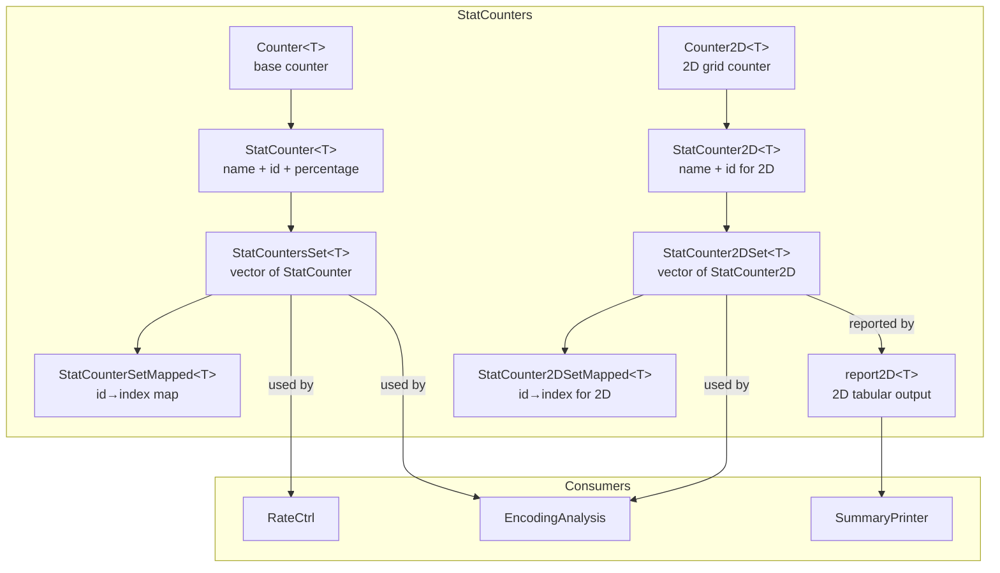
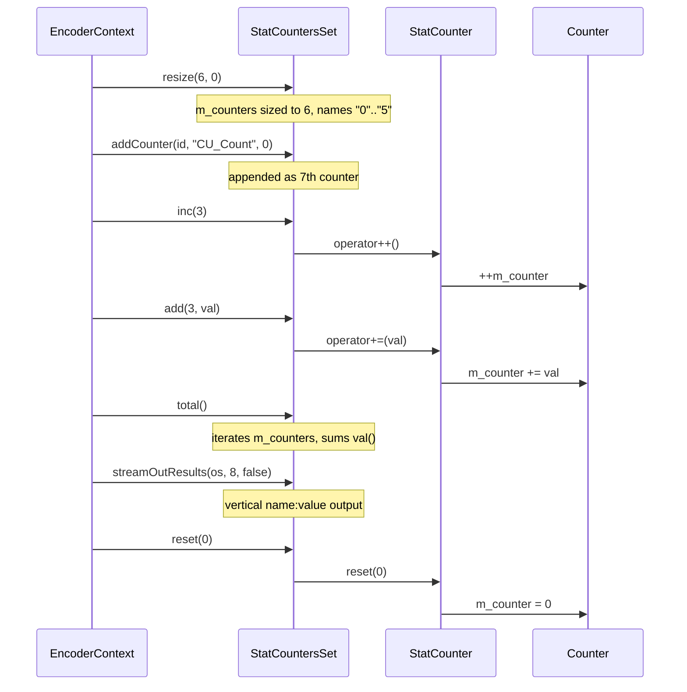
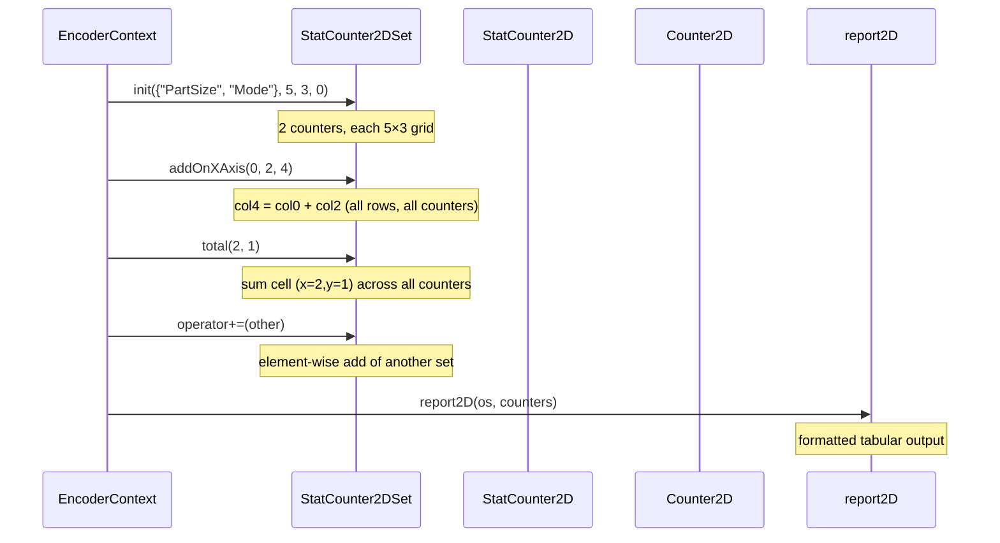

# StatCounter — Encoder Statistics Counter Framework

## 1. Overview

The `StatCounter` module provides a family of counter templates for collecting, aggregating, and reporting encoder statistics. It is used throughout `EncoderLib` (rate control, encoding passes, analysis) to track numerical metrics with optional name/id metadata, percentage computation, and 2D grid accumulation.

**Dependencies**: `<vector>`, `<map>`, `<string>`, `<ostream>`, `<cstdarg>`, `CommonDef.h` (exception macros).

**Lifecycle**: Instances are typically embedded in encoder context structures. Construction allocates counters; `reset()` returns them to an initial value. No explicit init/uninit required beyond construction.

## 2. Component Specifications

### 2.1 Class: `Counter<T>`

```cpp
#pragma once

#include <vector>
#include <map>
#include <string>
#include <ostream>
#include <cstdarg>

namespace vvenc {
namespace StatCounters {

template<typename T>
class Counter
{
public:
  /** \brief Default constructor — zero-initialised. */
  Counter();

  /** \brief Value constructor.
   *  \param[in] init_val  initial counter value
   */
  Counter( T init_val );

  /** \brief Value + id constructor.
   *  \param[in] init_val  initial counter value
   *  \param[in] id        opaque identifier (stored, not used by Counter)
   */
  Counter( T init_val, int id );

  ~Counter();

  // --------------------------------------------------------------------------
  // Arithmetic operators
  // --------------------------------------------------------------------------

  /** \brief Add another Counter. */
  Counter& operator+=( const Counter& other );

  /** \brief Add scalar value. */
  Counter& operator+=( const T& other );

  /** \brief Subtract another Counter. */
  Counter& operator-=( const Counter& other );

  /** \brief Assign scalar value. */
  Counter& operator= ( const T& other );

  /** \brief Divide by scalar (integer truncation). */
  Counter& operator/= ( const T& other );

  // --------------------------------------------------------------------------
  // Comparison
  // --------------------------------------------------------------------------

  bool operator< ( const T& other );
  bool operator> ( const T& other );
  bool operator>=( const T& other );
  bool operator<=( const T& other );

  // --------------------------------------------------------------------------
  // Increment
  // --------------------------------------------------------------------------

  Counter& operator++();       ///< prefix ++
  Counter& operator++(int);    ///< postfix ++

  // --------------------------------------------------------------------------
  // Stream I/O
  // --------------------------------------------------------------------------

  friend std::ostream& operator<<( std::ostream& os, const Counter<T>& cnt );
  friend std::istream& operator>>( std::istream& os, Counter<T>& cnt );

  // --------------------------------------------------------------------------
  // Reset / access
  // --------------------------------------------------------------------------

  /** \brief Reset counter to val. */
  void reset( T val );

  T&       val();              ///< mutable value reference
  const T& val() const;        ///< const value reference

protected:
  T m_counter;                 ///< underlying counter value
};

}
}
```

### 2.2 Class: `StatCounter<T>`

```cpp
namespace vvenc {
namespace StatCounters {

template<typename T>
class StatCounter : public Counter<T>
{
public:
  /** \brief Default constructor. */
  StatCounter();

  /** \brief Value constructor.
   *  \param[in] init_val  initial counter value
   */
  StatCounter( T init_val );

  /** \brief Value + name constructor.
   *  \param[in] init_val  initial counter value
   *  \param[in] name      human-readable name
   */
  StatCounter( T init_val, const char* name );

  /** \brief Value + name + id constructor.
   *  \param[in] init_val  initial counter value
   *  \param[in] name      human-readable name
   *  \param[in] id        numeric identifier
   */
  StatCounter( T init_val, const char* name, int id );

  /** \brief Value + id constructor.
   *  \param[in] init_val  initial counter value
   *  \param[in] id        numeric identifier
   */
  StatCounter( T init_val, int id );

  ~StatCounter();

  // --------------------------------------------------------------------------
  // Name / ID
  // --------------------------------------------------------------------------

  std::ostream& name( std::ostream& os );

  void              setName( const char* name );
  void              setName( const std::string& name );
  const std::string getName() const;

  int               id();
  const int&        id() const;

  // --------------------------------------------------------------------------
  // Percentage
  // --------------------------------------------------------------------------

  /** \brief Percentage of this counter relative to scalar v. */
  double percentageFrom( const T& v ) const;

  /** \brief Percentage of this counter relative to another StatCounter. */
  double percentageFrom( const StatCounter<T>& other ) const;

  /** \brief Diff-percentage: (this - other) / other * 100. */
  double diffAndPercentageFrom( const StatCounter<T>& other ) const;

  // --------------------------------------------------------------------------
  // Dependence tracking
  // --------------------------------------------------------------------------

  /** \brief Mark this counter as a percentage of another counter by index.
   *  \param[in] idx  index of the dependence counter
   */
  void setPercentageDependence( size_t idx );

  bool   isPercentageOutput() const;
  size_t getDependenceIdx()   const;

  // --------------------------------------------------------------------------
  // Percentage-based stream output
  // --------------------------------------------------------------------------

  /** \brief Stream value as percentage with width w.
   *  \param[in,out] os   output stream
   *  \param[in]     dep  scalar dependence value
   *  \param[in]     w    field width
   */
  std::ostream& streamOutValueInPercentage( std::ostream& os, T dep, size_t w ) const;

  /** \brief Stream value as percentage using another StatCounter as dependence. */
  std::ostream& streamOutValueInPercentage( std::ostream& os, const StatCounter<T>& cntDep, size_t w ) const;

private:
  std::string m_counter_name;
  int         m_counter_id;
  size_t      m_dependenceIdx;
  bool        m_isPercentageOutput;
};

}
}
```

### 2.3 Class: `StatCountersSet<T>`

```cpp
namespace vvenc {
namespace StatCounters {

template<typename T>
class StatCountersSet
{
public:
  /** \brief Default constructor — empty set. */
  StatCountersSet();

  /** \brief Construct with num_counters copies of init_val.
   *  \param[in] num_counters  number of counters
   *  \param[in] init_val      initial value for each counter
   */
  StatCountersSet( size_t num_counters, T init_val = 0 );

  /** \brief Construct from vector of names.
   *  \param[in] cntNames  names for each counter
   *  \param[in] init_val  initial value for each counter
   */
  StatCountersSet( std::vector<std::string> cntNames, T init_val = 0 );

  ~StatCountersSet();

  // --------------------------------------------------------------------------
  // Modification
  // --------------------------------------------------------------------------

  /** \brief Append a new counter.
   *  \param[in] id        numeric id
   *  \param[in] name      display name
   *  \param[in] init_val  initial value
   */
  void addCounter( const int id, const std::string& name, T init_val = 0 );

  /** \brief Resize to num_counters, assign init_val and auto-name "0","1",...
   *  \param[in] num_counters  new size
   *  \param[in] init_val      initial value for new slots
   */
  void resize( size_t num_counters, T init_val );

  // --------------------------------------------------------------------------
  // Arithmetic operators
  // --------------------------------------------------------------------------

  /** \brief Element-wise add of another set (shorter length acts as bound). */
  StatCountersSet& operator+=( const StatCountersSet& other );

  /** \brief Element-wise subtract of another set (shorter length acts as bound). */
  StatCountersSet& operator-=( const StatCountersSet& other );

  /** \brief Assign scalar to first counter. */
  StatCountersSet& operator= ( const T& other );

  /** \brief Element-wise divide by scalar. */
  StatCountersSet& operator/= ( const T& other );

  /** \brief Copy-assign from another set (must have equal size). */
  StatCountersSet& operator= ( const StatCountersSet& other );

  /** \brief Access counter by index. */
  StatCounter<T>&       operator[]( std::size_t idx );
  const StatCounter<T>& operator[]( std::size_t idx ) const;

  // --------------------------------------------------------------------------
  // Convenience helpers
  // --------------------------------------------------------------------------

  /** \brief Pre-increment counter at idx. */
  void inc( int cntIdx );

  /** \brief Add val to counter at idx. */
  void add( int cntIdx, T val );

  /** \brief Reset all counters to val. */
  void reset( T val );

  /** \brief Element-wise divide all counters by val. */
  void scale( T val );

  /** \brief Number of counters. */
  size_t size() const;

  // --------------------------------------------------------------------------
  // Aggregation
  // --------------------------------------------------------------------------

  /** \brief Sum all counter values.
   *  \param[in] accum  starting accumulator value
   */
  T total( T accum = 0 );

  /** \brief Sum from fromPos to end.
   *  \param[in] fromPos  start index
   *  \param[in] accum    starting accumulator value
   */
  T sumUp( size_t fromPos = 0, T accum = 0 );

  // --------------------------------------------------------------------------
  // Stream output
  // --------------------------------------------------------------------------

  std::ostream& streamOutNames( std::ostream& os, size_t w ) const;
  std::ostream& streamOutValuesInPercentage( std::ostream& os, T dep, int w ) const;
  std::ostream& streamOutValuesInPercentage( std::ostream& os, const StatCounter<T>& cntDep, int w ) const;
  std::ostream& streamOutValues( std::ostream& os, size_t w ) const;

  /** \brief Stream results with names.
   *  \param[in] os           output stream
   *  \param[in] w            field width
   *  \param[in] isHorizontal true = single-line, false = vertical name:value listing
   */
  std::ostream& streamOutResults( std::ostream& os, size_t w, bool isHorizontal = true );

  /** \brief Stream all values as percentages of their total sum. */
  std::ostream& streamOutValuesInPercentage( std::ostream& os );

  /** \brief True if every counter is zero. */
  inline bool isEmpty();

  // --------------------------------------------------------------------------
  // Friend stream operators
  // --------------------------------------------------------------------------

  friend std::ostream& operator<<( std::ostream& os, const StatCountersSet& cnt );
  friend std::istream& operator>>( std::istream& os, StatCountersSet& cnt );

protected:
  std::vector<StatCounter<T>> m_counters;
};

}
}
```

### 2.4 Class: `StatCounterSetMapped<T>`

```cpp
namespace vvenc {
namespace StatCounters {

template<typename T>
class StatCounterSetMapped : public StatCountersSet<T>
{
public:
  /** \brief Default constructor. */
  StatCounterSetMapped();

  /** \brief Construct from list of ids.
   *  \param[in] cntId     vector of integer ids
   *  \param[in] init_val  initial value for each counter
   */
  StatCounterSetMapped( std::vector<int> cntId, T init_val = 0 );

  /** \brief Construct from ids and name lookup table.
   *  \param[in] cntId        vector of integer ids
   *  \param[in] cntNamesLUT  name LUT indexed by id
   *  \param[in] init_val     initial value for each counter
   */
  StatCounterSetMapped( std::vector<int> cntId, std::vector<std::string> cntNamesLUT, T init_val = 0 );

  /** \brief Construct from name LUT (ids 0..N-1).
   *  \param[in] cntNamesLUT  name LUT (each index becomes an id)
   *  \param[in] init_val     initial value for each counter
   */
  StatCounterSetMapped( std::vector<std::string> cntNamesLUT, T init_val = 0 );

  ~StatCounterSetMapped();

  // --------------------------------------------------------------------------
  // Mapped add / access
  // --------------------------------------------------------------------------

  /** \brief Add counter with explicit id (also updates the id→index map). */
  void addCounter( const int id, const std::string& name, T init_val = 0 );

  /** \brief Resolve id → storage index.
   *  \param[in] cntIdx  the integer id
   *  \throws Exception if id not found
   */
  size_t cntPos( int cntIdx );

  /** \brief Access counter by id (O(log N) via map). */
  StatCounter<T>&       operator[]( int id );
  const StatCounter<T>& operator[]( int id ) const;

  /** \brief Access counter by storage index (O(1)). */
  StatCounter<T>&       cnt( int idx );
  const StatCounter<T>& cnt( int idx ) const;

  /** \brief Increment counter by id. */
  void inc( int id );

  /** \brief Add val to counter by id. */
  void add( int id, T val );

protected:
  std::map<int,size_t> m_id_map;  ///< id → storage index mapping
};

}
}
```

### 2.5 Class: `Counter2D<T>`

```cpp
namespace vvenc {
namespace StatCounters {

template<typename T>
class Counter2D
{
public:
  Counter2D();
  Counter2D( size_t xDim, size_t yDim );
  ~Counter2D();

  /** \brief Initialise the 2D grid to xDim × yDim, values default-constructed. */
  void init( size_t xDim, size_t yDim );

  /** \brief Sum all cells. */
  T total() const;

  /** \brief Reset every cell to val. */
  void reset( const T val );

  /** \brief Access row y (mutable). */
  std::vector<T>&       operator[]( size_t y );

  /** \brief Access row y (const). */
  const std::vector<T>& operator[]( size_t y ) const;

  /** \brief Element-wise addition of another Counter2D (same dimensions). */
  Counter2D& operator+=( const Counter2D& other );

  /** \brief Element-wise division by scalar. */
  Counter2D& operator/= ( const T& val );

protected:
  std::vector<std::vector<T>> m_counters;
};

}
}
```

### 2.6 Class: `StatCounter2D<T>`

```cpp
namespace vvenc {
namespace StatCounters {

template<typename T>
class StatCounter2D : public Counter2D<T>
{
public:
  StatCounter2D();
  StatCounter2D( size_t xDim, size_t yDim );
  StatCounter2D( size_t xDim, size_t yDim, const char* name );
  StatCounter2D( size_t xDim, size_t yDim, const char* name, int id );
  StatCounter2D( size_t xDim, size_t yDim, int id );
  ~StatCounter2D();

  std::ostream& name( std::ostream& os );

  void              setName( const char* name );
  void              setName( const std::string& name );
  const std::string getName() const;

  int               id();
  const int&        id() const;

private:
  std::string m_counter_name;
  int         m_counter_id;
  size_t      m_dependenceIdx;
  bool        m_isPercentageOutput;
};

}
}
```

### 2.7 Class: `StatCounter2DSet<T>`

```cpp
namespace vvenc {
namespace StatCounters {

template<typename T>
class StatCounter2DSet
{
public:
  StatCounter2DSet();
  StatCounter2DSet( size_t num_counters, size_t xDim, size_t yDim, T init_val = 0 );
  StatCounter2DSet( const std::vector<std::string> cntNames, size_t xDim, size_t yDim, T init_val = 0 );
  ~StatCounter2DSet();

  // --------------------------------------------------------------------------
  // Initialisation
  // --------------------------------------------------------------------------

  /** \brief Initialise from names.
   *  \param[in] cntNames  names for each counter
   *  \param[in] xDim      horizontal dimension
   *  \param[in] yDim      vertical dimension
   *  \param[in] init_val  initial value for all cells
   */
  void init( const std::vector<std::string>& cntNames, size_t xDim, size_t yDim, T init_val = 0 );

  /** \brief Initialise unnamed counters.
   *  \param[in] numCounters  number of counters
   *  \param[in] xDim         horizontal dimension
   *  \param[in] yDim         vertical dimension
   *  \param[in] init_val     initial value for all cells
   */
  void init( unsigned numCounters, size_t xDim, size_t yDim, T init_val = 0 );

  /** \brief Initialise dimensions only (deferred counter addition). */
  void init( size_t xDim, size_t yDim );

  /** \brief Append a new 2D counter.
   *  \param[in] id        numeric id
   *  \param[in] name      display name
   *  \param[in] xDim      horizontal dimension
   *  \param[in] yDim      vertical dimension
   *  \param[in] init_val  initial value for all cells
   */
  void addCounter( const int id, const std::string& name, size_t xDim, size_t yDim, T init_val = 0 );

  // --------------------------------------------------------------------------
  // Modification
  // --------------------------------------------------------------------------

  /** \brief Reset every counter grid to val. */
  void reset( T val = 0 );

  /** \brief Element-wise divide every counter grid by val. */
  void scale( T val );

  // --------------------------------------------------------------------------
  // Aggregation
  // --------------------------------------------------------------------------

  /** \brief Sum cell (xDim,yDim) across all counter types. */
  T total( size_t xDim, size_t yDim ) const;

  /** \brief Total of a single 2D counter by index. */
  T total( size_t cntId ) const;

  /** \brief Grand total across all counters and cells. */
  T total() const;

  // --------------------------------------------------------------------------
  // X-axis arithmetic
  // --------------------------------------------------------------------------

  /** \brief Replace column xPosDst with xPosSrc1 + xPosSrc2 for every counter and row. */
  void addOnXAxis( size_t xPosSrc1, size_t xPosSrc2, size_t xPosDst );

  // --------------------------------------------------------------------------
  // Access
  // --------------------------------------------------------------------------

  StatCounter2D<T>&       operator[]( size_t id );
  const StatCounter2D<T>& operator[]( size_t id ) const;

  StatCounter2DSet& operator+=( const StatCounter2DSet& other );

  std::vector<StatCounter2D<T>>&       getCounters();
  const std::vector<StatCounter2D<T>>& getCounters() const;
  size_t getDimHor()      const;
  size_t getDimVer()      const;
  size_t getNumCntTypes() const;

protected:
  std::vector<StatCounter2D<T>> m_counters;
  size_t m_xDim;
  size_t m_yDim;
};

}
}
```

### 2.8 Class: `StatCounter2DSetMapped<T>`

```cpp
namespace vvenc {
namespace StatCounters {

template<typename T>
class StatCounter2DSetMapped : public StatCounter2DSet<T>
{
public:
  StatCounter2DSetMapped();
  StatCounter2DSetMapped( const std::vector<int>& cntId, size_t xDim, size_t yDim, T init_val = 0 );
  StatCounter2DSetMapped( const std::vector<int>& cntId, const std::vector<std::string>& cntNamesLUT, size_t xDim, size_t yDim, T init_val = 0 );
  StatCounter2DSetMapped( const std::vector<std::string>& cntNamesLUT, size_t xDim, size_t yDim, T init_val = 0 );
  ~StatCounter2DSetMapped();

  /** \brief Initialise from ids and name LUT. */
  void init( const std::vector<int>& cntId, const std::vector<std::string>& cntNamesLUT, size_t xDim, size_t yDim, T init_val = 0 );

  /** \brief Add counter with explicit id (updates id→index map). */
  void addCounter( const int id, const std::string& name, size_t xDim, size_t yDim, T init_val = 0 );

  /** \brief Resolve id → storage index. */
  size_t cntPos( int cntIdx ) const;

  /** \brief Access by id (O(log N) via map). */
  StatCounter2D<T>&       operator[]( int id );
  const StatCounter2D<T>& operator[]( int id ) const;

  /** \brief Access by storage index (O(1)). */
  StatCounter2D<T>&       cnt( int idx );
  const StatCounter2D<T>& cnt( int idx ) const;

protected:
  std::map<int,size_t> m_id_map;
};

}
}
```

### 2.9 Free Function: `report2D<T>`

```cpp
namespace vvenc {
namespace StatCounters {

/** \brief Format a 2D counter set as a tabular report.
 *  \param[in,out] os                         output stream
 *  \param[in]     counters                   the 2D counter set to report
 *  \param[in]     axisInBlockSizes           if true, show axis labels as block sizes
 *  \param[in]     absoluteNumbers            if true, show raw counts
 *  \param[in]     weightedByArea             if true, weight values by block area
 *  \param[in]     secondColumnInPercentage   if true, second column shows percentages
 *  \param[in]     ratiosWithinSingleElement  if true, show ratios per element
 *  \param[in]     refCntId                   reference counter id for ratio computation
 */
template<typename T>
std::ostream& report2D(
  std::ostream& os,
  const StatCounter2DSet<T>& counters,
  bool axisInBlockSizes = false,
  bool absoluteNumbers = true,
  bool weightedByArea = false,
  bool secondColumnInPercentage = false,
  bool ratiosWithinSingleElement = false,
  int refCntId = -1 );

}
}
```

## 3. System Architecture



## 4. Detailed Data Flow

### 4.1 Counter Aggregation Lifecycle



### 4.2 2D Counter Aggregation Lifecycle



## 5. Visualisation

No D3 animation — this module is purely a data collection and reporting framework with no interactive visualisation component.

## 6. Testing Requirements

### Unit Tests (new file: `test/vvenc_unit_test/statcounter_test.cpp`)

| Test ID | Class / Method | What to Verify |
|---|---|---|
| `CTR_DEFAULT_CTOR` | `Counter<T>()` | `val() == 0` |
| `CTR_VALUE_CTOR` | `Counter<T>(42)` | `val() == 42` |
| `CTR_PLUSEQ_COUNTER` | `Counter::operator+=(Counter)` | component-wise addition |
| `CTR_PLUSEQ_SCALAR` | `Counter::operator+=(T)` | scalar addition |
| `CTR_MINUSEQ_COUNTER` | `Counter::operator-=(Counter)` | component-wise subtraction |
| `CTR_ASSIGN_SCALAR` | `Counter::operator=(T)` | value replaced |
| `CTR_DIV_SCALAR` | `Counter::operator/=(T)` | integer truncation division |
| `CTR_PRE_INC` | `Counter::operator++()` | prefix increment |
| `CTR_POST_INC` | `Counter::operator++(int)` | postfix increment |
| `CTR_RESET` | `Counter::reset(T)` | value set to T |
| `STCTR_NAME` | `StatCounter::setName/getName` | name round-trip |
| `STCTR_ID` | `StatCounter::id()` | id round-trip |
| `STCTR_PERCENTAGE` | `StatCounter::percentageFrom(v)` | `val() * 100.0 / v` |
| `STCTR_DIFF_PERCENTAGE` | `StatCounter::diffAndPercentageFrom(o)` | `(val - o.val) * 100.0 / o.val` |
| `STCTR_DEPENDENCE` | `StatCounter::setPercentageDependence` | isPercentageOutput/dependenceIdx |
| `SCS_ADD_COUNTER` | `StatCountersSet::addCounter` | counter appended, id/name match |
| `SCS_RESIZE` | `StatCountersSet::resize` | size matches, auto-named |
| `SCS_RESET` | `StatCountersSet::reset` | all counters == val |
| `SCS_SCALE` | `StatCountersSet::scale` | each counter divided by val |
| `SCS_TOTAL` | `StatCountersSet::total` | sum of all counter values |
| `SCS_SUMUP` | `StatCountersSet::sumUp(from)` | partial sum from index |
| `SCS_ISEMPTY` | `StatCountersSet::isEmpty` | true when all zero |
| `SCS_STREAMOUT` | `StatCountersSet::streamOutResults` | output contains expected name/value |
| `SCS_PLUSEQ` | `StatCountersSet::operator+=` | element-wise addition |
| `SCS_MINUSEQ` | `StatCountersSet::operator-=` | element-wise subtraction |
| `SCM_ADD_COUNTER` | `StatCounterSetMapped::addCounter` | id→index map updated |
| `SCM_ACCESS_BY_ID` | `StatCounterSetMapped::operator[id]` | correct counter returned via id |
| `SCM_CNTPOS` | `StatCounterSetMapped::cntPos` | valid id returns index; invalid throws |
| `SCM_INC_BY_ID` | `StatCounterSetMapped::inc(id)` | increment via id mapping |
| `SCM_ADD_BY_ID` | `StatCounterSetMapped::add(id,val)` | add via id mapping |
| `C2D_INIT` | `Counter2D::init` | grid dimensions set, cells default |
| `C2D_TOTAL` | `Counter2D::total` | sum of all cells |
| `C2D_RESET` | `Counter2D::reset` | all cells == val |
| `C2D_PLUSEQ` | `Counter2D::operator+=` | element-wise add |
| `C2D_DIVEQ` | `Counter2D::operator/=` | element-wise division |
| `ST2D_NAME` | `StatCounter2D::setName/getName` | name round-trip |
| `ST2D_ID` | `StatCounter2D::id()` | id round-trip |
| `S2DS_INIT_NAMES` | `StatCounter2DSet::init(names,...)` | counters created with names |
| `S2DS_ADD_COUNTER` | `StatCounter2DSet::addCounter` | counter appended |
| `S2DS_RESET` | `StatCounter2DSet::reset` | all cells reset |
| `S2DS_SCALE` | `StatCounter2DSet::scale` | all cells divided |
| `S2DS_TOTAL` | `StatCounter2DSet::total()` | grand total across all counters |
| `S2DS_TOTAL_XY` | `StatCounter2DSet::total(x,y)` | sum of cell (x,y) across counters |
| `S2DS_ADD_ON_XAXIS` | `StatCounter2DSet::addOnXAxis` | dst col = src1 + src2 |
| `S2DS_PLUSEQ` | `StatCounter2DSet::operator+=` | element-wise add of another set |
| `S2DM_CNTPOS` | `StatCounter2DSetMapped::cntPos` | valid id returns index; invalid throws |
| `S2DM_ACCESS_BY_ID` | `StatCounter2DSetMapped::operator[id]` | correct 2D counter via id |
| `REPORT2D_BASIC` | `report2D` | stream output contains counter data |

### Calling-Order Validation

StatCounters have no required call ordering — counters are always valid after construction. The `init` / `addCounter` / `reset` sequence for 2D sets is flexible: `init(dim)` can be called before or after `addCounter`.

### Parameter Range Tests

- `Counter2D::init(xDim, yDim)`: verify xDim=0, yDim=0 produce empty grids (no crash)
- `StatCountersSet::resize(n, val)`: n=0 clears the vector
- `StatCountersSet::scale(val)`: val=0 division by zero (implementation-defined, avoid in practice)
- `StatCounterSetMapped::cntPos(invalid_id)`: verify `THROW` / `Exception` is raised

### Integration Tests

Covered implicitly by `EncoderLib` encoding passes that exercise rate-control and analysis statistics collection.

## 7. CLI Entry Point

Not directly exposed via CLI. StatCounter types are internal data structures consumed by `RateCtrl`, encoding analysis passes, and summary printing within `EncoderLib`.
