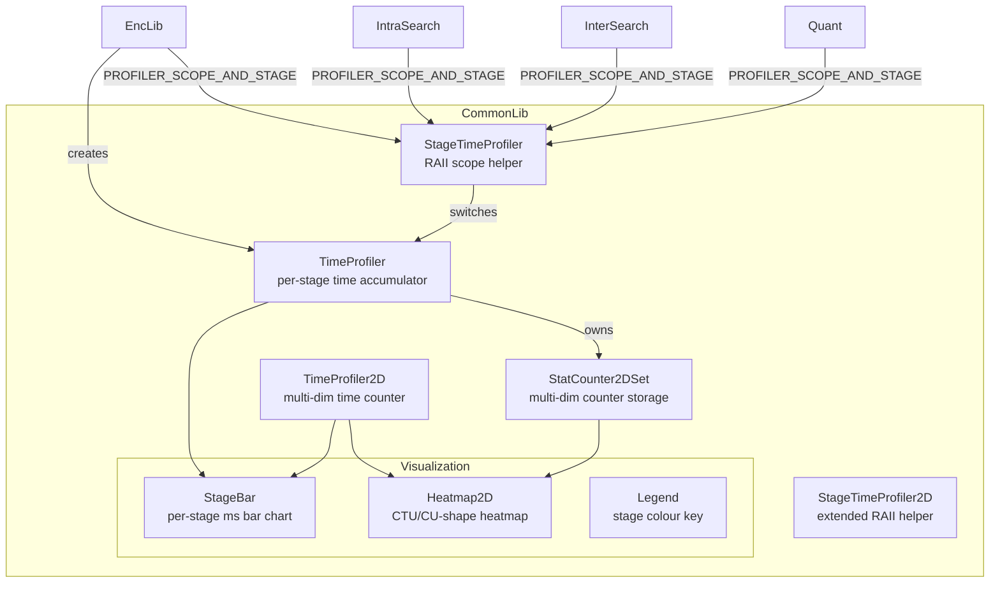
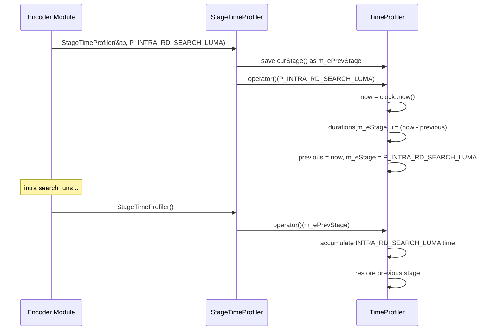
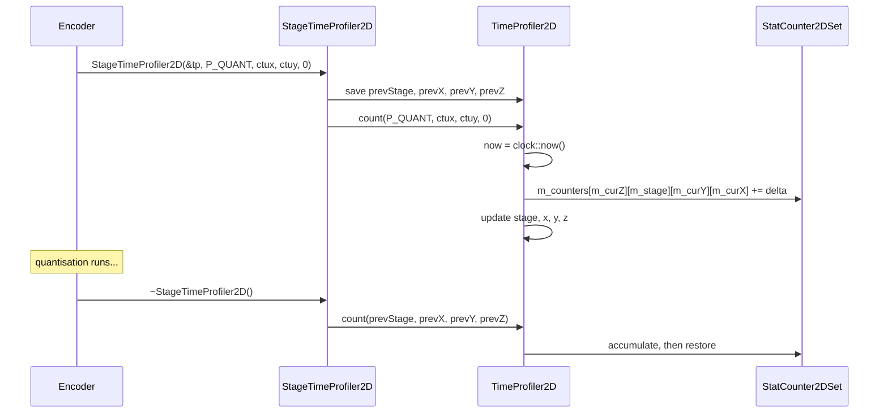

# TimeProfiler — Runtime Performance Profiling Infrastructure

## 1. Overview

The `TimeProfiler` module provides compile-time selectable runtime profiling for the encoder pipeline. It tracks elapsed wall-clock time per encoder stage (intra search, inter search, quantization, loop filters, etc.) and reports aggregate timing at the end of encoding.

**Two variants** (selected by compile-time flags):
- **Basic** (`ENABLE_TIME_PROFILING`, without `ENABLE_TIME_PROFILING_EXTENDED`): `TimeProfiler` + `StageTimeProfiler` — flat per-stage accumulation.
- **Extended** (`ENABLE_TIME_PROFILING_EXTENDED`): `TimeProfiler2D` + `StageTimeProfiler2D` — multi-dimensional counters via `StatCounter2DSet` (grouped by picture type, temporal layer, CTU position, or CU shape).

**Dependencies**: `CommonDef.h`, `StatCounter.h`, `Rom.h`, `<chrono>`, `<numeric>`, `<ostream>`, `<vector>`.

**Lifecycle**: A single `TProfiler` instance (aliased to `TimeProfiler` or `TimeProfiler2D`) is created via `timeProfilerCreate()`, stored in a thread-local or global pointer (`_TPROF`), and destroyed after `timeProfilerResults()` is called at shutdown.

## 2. Component Specifications

### 2.1 Stage Enum

```cpp
namespace vvenc {

#define E_TIME_PROF_STAGES(E_) \
  E_( P_TOP_LEVEL               ) \
  E_( P_COMPRESS_SLICE          ) \
  E_( P_COMPRESS_CU             ) \
  E_( P_INTER_MRG_EST_RD_CAND   ) \
  E_( P_INTER_MRG_DMVR          ) \
  E_( P_INTER_MRG               ) \
  E_( P_INTER_GPM               ) \
  E_( P_FRAC_PEL                ) \
  E_( P_QPEL                    ) \
  E_( P_QPEL_INTERP             ) \
  E_( P_HPEL_INTERP             ) \
  E_( P_INTER_MVD_SEARCH        ) \
  E_( P_INTER_MVD_SEARCH_B      ) \
  E_( P_INTER_MVD_SEARCH_AFFINE ) \
  E_( P_INTER_MVD               ) \
  E_( P_INTER_MVD_IMV           ) \
  E_( P_INTRA_EST_RD_CAND       ) \
  E_( P_INTRA_RD_SEARCH_LUMA    ) \
  E_( P_INTRA_CHROMA            ) \
  E_( P_INTRA                   ) \
  E_( P_QUANT                   ) \
  E_( P_DEQUANT                 ) \
  E_( P_TRAFO                   ) \
  E_( P_RESHAPER                ) \
  E_( P_DEBLOCK_FILTER          ) \
  E_( P_SAO                     ) \
  E_( P_ALF_CLASS               ) \
  E_( P_ALF_STATS               ) \
  E_( P_ALF_ENC                 ) \
  E_( P_ALF_MERGE               ) \
  E_( P_ALF_DERIVE_COEF         ) \
  E_( P_ALF_ENC_CTB             ) \
  E_( P_ALF_REC                 ) \
  E_( P_ALF                     ) \
  E_( P_MCTF                    ) \
  E_( P_MCTF_SEARCH             ) \
  E_( P_MCTF_SEARCH_SUBPEL      ) \
  E_( P_MCTF_APPLY              ) \
  E_( P_OTHER                   ) \
  E_( P_STAGES                  ) \
  E_( P_IGNORE                  )
MAKE_ENUM_AND_STRINGS(E_TIME_PROF_STAGES, STAGE, stageNames)

}
```

### 2.2 Class: `TimeProfiler` (basic variant)

```cpp
#pragma once

#include "CommonDef.h"
#include <chrono>
#include <vector>
#include <ostream>

namespace vvenc {

class TimeProfiler
{
public:
  using rep        = std::milli;
  using clock      = std::chrono::steady_clock;
  using time_point = std::chrono::time_point<clock>;
  using duration   = std::chrono::duration<double, rep>;

  /** \brief Default constructor — initialises all stage durations to zero. */
  TimeProfiler();

  // --------------------------------------------------------------------------
  // Stage switching
  // --------------------------------------------------------------------------

  /** \brief Switch stage — accumulates elapsed time for the previous stage.
   *  \param[in] s  new stage to enter
   *  \retval reference to self for chaining
   */
  TimeProfiler& operator()(STAGE s);

  /** \brief Start a stage (set start time without accumulating previous).
   *  \param[in] s  stage to begin
   */
  void start(STAGE s);

  /** \brief Stop the current stage (accumulate elapsed time). */
  void stop();

  // --------------------------------------------------------------------------
  // Accumulation
  // --------------------------------------------------------------------------

  /** \brief Merge another profiler's durations into this one.
   *  \param[in] other  profiler whose durations to add
   *  \retval reference to self
   */
  TimeProfiler& operator+=(const TimeProfiler& other);

  // --------------------------------------------------------------------------
  // Accessors
  // --------------------------------------------------------------------------

  /** \retval current active stage */
  STAGE curStage() const;

  /** \brief Output formatted timing report to stream.
   *  \param[in,out] os  output stream
   */
  friend std::ostream& operator<<(std::ostream& os, const TimeProfiler& prof);

  /** \brief Output timing report.
   *  \param[in,out] os  output stream
   */
  void output(std::ostream& os);

private:
  time_point              m_previous;
  STAGE                   m_eStage;
  unsigned                m_numStages;
  std::vector<duration>   m_durations;
  time_point              m_startTime;
};

}
```

### 2.3 Class: `StageTimeProfiler` (RAII helper, basic variant)

```cpp
namespace vvenc {

class StageTimeProfiler
{
public:
  /** \brief Enter a stage; saves previous stage for restoration.
   *  \param[in] pcProfiler  profiler instance
   *  \param[in] eStage      new stage to enter
   */
  StageTimeProfiler(TimeProfiler* pcProfiler, STAGE eStage);

  /** \brief Restore previous stage on scope exit. */
  ~StageTimeProfiler();

private:
  STAGE          m_ePrevStage;
  TimeProfiler*  m_pProfiler;
};

}
```

### 2.4 Class: `TimeProfiler2D` (extended variant)

```cpp
namespace vvenc {

class TimeProfiler2D
{
public:
  using clock      = std::chrono::steady_clock;
  using time_point = std::chrono::time_point<clock>;

  /** \brief Construct with multi-dimensional counter dimensions.
   *  \param[in] numX  counter dimension X
   *  \param[in] numY  counter dimension Y
   *  \param[in] numZ  counter dimension Z
   *  \param[in] id    profiler instance ID
   */
  TimeProfiler2D(unsigned numX = 1, unsigned numY = 1, unsigned numZ = 1, unsigned id = 0);

  // --------------------------------------------------------------------------
  // Stage / position switching
  // --------------------------------------------------------------------------

  /** \brief Count elapsed time for current stage and switch to new.
   *  \param[in] s  new stage
   *  \param[in] x  new X index
   *  \param[in] y  new Y index
   *  \param[in] z  new Z index
   */
  void count(STAGE s, unsigned x, unsigned y, unsigned z);

  /** \brief Start a stage (set start time without counting).
   *  \param[in] s  stage to begin
   */
  void start(STAGE s);

  /** \brief Count elapsed time for the current stage. */
  void stop();

  /** \brief Update stage/position without counting time.
   *  \param[in] s  new stage
   *  \param[in] x  new X index
   *  \param[in] y  new Y index
   *  \param[in] z  new Z index
   */
  void update(STAGE s, unsigned x, unsigned y, unsigned z);

  // --------------------------------------------------------------------------
  // Accumulation
  // --------------------------------------------------------------------------

  /** \brief Merge another 2D profiler's counters.
   *  \param[in] other  profiler to merge
   *  \retval reference to self
   */
  TimeProfiler2D& operator+=(const TimeProfiler2D& other);

  // --------------------------------------------------------------------------
  // Accessors
  // --------------------------------------------------------------------------

  size_t   numStages() const;
  STAGE    curStage() const;
  unsigned curX() const;
  unsigned curY() const;
  unsigned curZ() const;

  std::vector<StatCounter2DSet<double>>&       getCountersSet();
  const std::vector<StatCounter2DSet<double>>& getCountersSet() const;

private:
  time_point                      m_previous;
  time_point                      m_startTime;
  STAGE                           m_stage;
  unsigned                        m_numStages;
  unsigned                        m_numX;
  unsigned                        m_numY;
  unsigned                        m_numZ;
  unsigned                        m_curX;
  unsigned                        m_curY;
  unsigned                        m_curZ;
  unsigned                        m_id;
  std::vector<StatCounter2DSet<double>> m_counters;
};

}
```

### 2.5 Class: `StageTimeProfiler2D` (RAII helper, extended variant)

```cpp
namespace vvenc {

class StageTimeProfiler2D
{
public:
  /** \brief Enter stage/position; saves previous for restoration.
   *  \param[in] pcProfiler  profiler instance
   *  \param[in] stage       new stage to enter
   *  \param[in] x           new X index
   *  \param[in] y           new Y index
   *  \param[in] z           new Z index
   */
  StageTimeProfiler2D(TimeProfiler2D* pcProfiler, STAGE stage,
                      unsigned x, unsigned y, unsigned z);

  /** \brief Restore previous stage/position on scope exit. */
  ~StageTimeProfiler2D();

private:
  STAGE            m_prevStage;
  int              m_prevX;
  int              m_prevY;
  int              m_prevZ;
  TimeProfiler2D*  m_pProfiler;
};

}
```

### 2.6 Free Functions

```cpp
namespace vvenc {

/** \brief Create a time profiler configured from encoder config.
 *  \param[in] encCfg  encoder configuration
 *  \retval newly allocated TProfiler instance
 */
TProfiler* timeProfilerCreate(const vvenc_config& encCfg);

/** \brief Output profiler results and deallocate.
 *  \param[in] tp  profiler to output (may be NULL)
 */
void timeProfilerResults(TProfiler* tp);

}
```

### 2.7 Macro API

```cpp
// Conditionally expand to profiling calls (all no-ops when ENABLE_TIME_PROFILING=0)
PROFILER_ACCUM_AND_START_NEW_SET(cond, p, s)           // accumulate + switch stage
PROFILER_SCOPE_AND_STAGE(cond, p, s)                   // scoped RAII stage switch
PROFILER_SCOPE_AND_STAGE_EXT(cond, p, s, cs, ch)       // extended scoped switch
PROFILER_SCOPE_TOP_LEVEL_EXT(cond, p, s, cs)           // top-level extended scope
PROFILER_EXT_ACCUM_AND_START_NEW_SET(cond, p, s, cs, ch) // extended accum + switch
PROFILER_EXT_UPDATE(p, s, t)                           // update extended stage/pos
PROFILER_START(p, s)                                   // start stage
PROFILER_STOP(p)                                        // stop stage
```

## 3. System Architecture



## 4. Detailed Data Flow

### 4.1 Basic Profiling: Stage Accumulation



### 4.2 Extended Profiling: Multi-Dimensional Counting



## 5. Visualisation

No D3 animation — TimeProfiler output is a console-based timing table. The extended variant's 2D counters could be visualised as a heatmap via external tools.

## 6. Testing Requirements

### Unit Tests (new file: `test/vvenc_unit_test/timeprofiler_test.cpp`)

| Test ID | Method | What to Verify |
|---|---|---|
| `TP_BASIC_CONSTRUCT` | `TimeProfiler()` | all durations zero, stage == P_IGNORE |
| `TP_BASIC_STAGE_SWITCH` | `operator()(P_QUANT)` | duration updated, stage changed |
| `TP_BASIC_START_STOP` | `start(P_INTRA) / stop()` | time accumulated for intra stage |
| `TP_BASIC_ACCUMULATE` | `operator+=` | durations merged correctly |
| `TP_BASIC_CUR_STAGE` | `curStage()` | returns current stage |
| `TP_BASIC_SCOPE` | `StageTimeProfiler` | restores previous stage on destruction |
| `TP_BASIC_OUTPUT` | `operator<<` | formatted table contains all stages |
| `TP_BASIC_OUTPUT_EMPTY` | `output()` with no activity | all values zero or omitted |
| `TP_EXT_CONSTRUCT` | `TimeProfiler2D(10, 10, 1, 0)` | counters sized numX*numY*numZ |
| `TP_EXT_COUNT` | `count(P_QUANT, x, y, z)` | time accumulated at correct counter cell |
| `TP_EXT_START_STOP` | `start() / stop()` | time accumulated for current stage+pos |
| `TP_EXT_UPDATE` | `update(P_INTRA, 5, 5, 0)` | stage and positions changed |
| `TP_EXT_ACCUMULATE` | `operator+=` | all counter cells merged |
| `TP_EXT_CUR_POS` | `curX(), curY(), curZ()` | returns current position indices |
| `TP_EXT_SCOPE` | `StageTimeProfiler2D` | restores previous stage+position |
| `TP_CREATE_BASIC` | `timeProfilerCreate(cfg)` | returns non-null TProfiler |
| `TP_RESULTS_NULL` | `timeProfilerResults(NULL)` | no crash |
| `TP_PROFILER_MACROS` | `PROFILER_SCOPE_AND_STAGE(1, p, s)` | stage entered and exited correctly |

### Calling-Order Validation

- Verify stop() before start() gracefully handles edge case (possibly accumulates stale time).
- Verify operator() after stop() correctly switches from stopped state.

### Parameter Range Tests

- `TimeProfiler2D(numX, numY, numZ)`: zero dimensions are undefined (documented).
- All valid STAGE enum values must be accepted by operator() and count().

### Integration Tests

Covered by encoder integration tests with `--Profile` flag. Run a short encode and verify timing output appears on stderr/stdout.

## 7. CLI Entry Point

Not directly exposed via CLI. Configured through `--Profile` flag parsed by `EncCfg`. When enabled, profiling macros are active and `timeProfilerResults()` is called at encoder shutdown.
