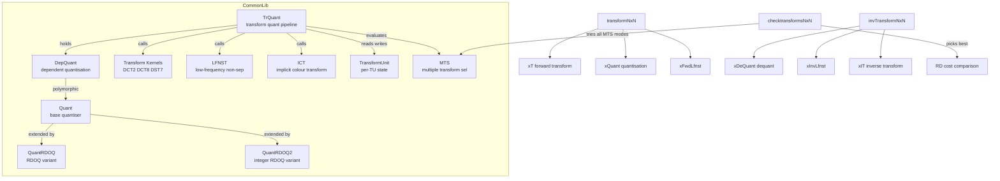
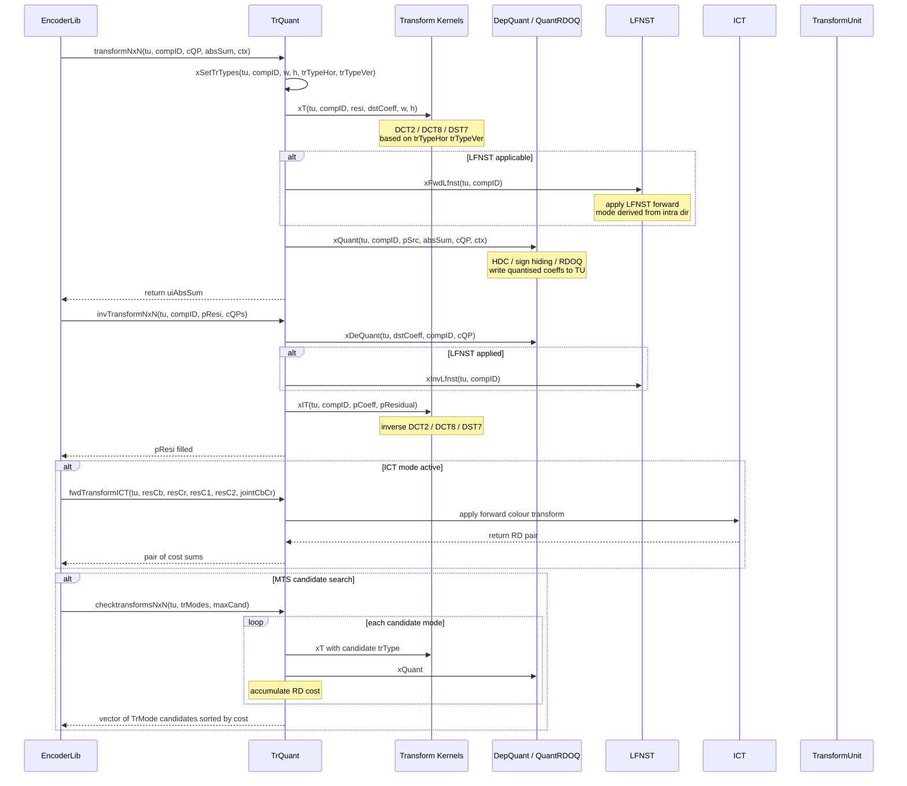

# TrQuant — Forward/Inverse Transform and Quantization Pipeline

## 1. Overview

The `TrQuant` class orchestrates the full transform–quantisation–dequantisation–inverse-transform pipeline for VVC. It supports DCT2, DCT8, DST7, MTS multiple transform selection, LFNST low-frequency non-separable transform, ICT implicit colour transform, transform skip, and integrates with the RDOQ and dependent quantisation `DepQuant` engines. It manages forward and inverse SIMD-optimised transform function pointers via `xFwdLfnstNxN` and `xInvLfnstNxN`.

**Dependencies**: `CommonDef.h`, `Unit.h`, `Contexts.h`, `ContextModelling.h`, `UnitPartitioner.h`, `Quant.h`, `DepQuant.h`.

**Lifecycle**: Constructed via `TrQuant()`, initialised via `init(otherQuant, rdoq, useRDOQTS, scalingListsEnabled, bEnc, thrValue)`. Holds a `DepQuant* m_quant` (polymorphic quantiser, may be `QuantRDOQ` or `QuantRDOQ2`). Destroyed via `~TrQuant()`.

## 2. Component Specifications

### 2.1 Type Aliases

```cpp
namespace vvenc {

typedef void FwdTrans(const TCoeff*, TCoeff*, int, int, int, int);
typedef void InvTrans(const TCoeff*, TCoeff*, int, int, int, int, const TCoeff, const TCoeff);

typedef std::pair<int, bool> TrMode;
typedef std::pair<int, int>  TrCost;

}
```

### 2.2 Class: `TrQuant`

```cpp
#pragma once

#include "CommonDef.h"
#include "Unit.h"
#include "Contexts.h"
#include "ContextModelling.h"
#include "UnitPartitioner.h"
#include "Quant.h"
#include "DepQuant.h"

namespace vvenc {

class TrQuant
{
public:
  TrQuant();
  ~TrQuant();

  void syncToGlobal();
  // Note: TCoeffOps function pointers from TrQuant_EMT.h are also synced via g_tCoeffOps

  void init(
             const Quant* otherQuant,
             const int  rdoq,
             const bool bUseRDOQTS,
             const bool scalingListsEnabled,
             const bool bEnc,
             const int  thrValue
           );

public:
  void invTransformNxN    ( TransformUnit& tu, const ComponentID compID, PelBuf& pResi, const QpParam& cQPs);
  void transformNxN       ( TransformUnit& tu, const ComponentID compID, const QpParam& cQP, TCoeff &uiAbsSum, const Ctx& ctx, const bool loadTr = false);
  void checktransformsNxN ( TransformUnit& tu, std::vector<TrMode> *trModes, const int maxCand, const ComponentID compID = COMP_Y);

  void                        invTransformICT     ( const TransformUnit& tu, PelBuf& resCb, PelBuf& resCr );
  std::pair<int64_t,int64_t>  fwdTransformICT     ( const TransformUnit& tu, const PelBuf& resCb, const PelBuf& resCr, PelBuf& resC1, PelBuf& resC2, int jointCbCr = -1 );
  std::vector<int>            selectICTCandidates ( const TransformUnit& tu, CompStorage* resCb, CompStorage* resCr );

  void   setLambdas  ( const double lambdas[MAX_NUM_COMP] )   { m_quant->setLambdas( lambdas ); }
  void   selectLambda( const ComponentID compIdx )            { m_quant->selectLambda( compIdx ); }
  void   getLambdas  ( double (&lambdas)[MAX_NUM_COMP]) const { m_quant->getLambdas( lambdas ); }
  void   scaleLambda ( const double scale)                    { m_quant->scaleLambda(scale);}

  DepQuant* getQuant ()                                       { return m_quant; }

protected:
  TCoeff*   m_plTempCoeff;
  bool      m_bEnc;
  bool      m_scalingListEnabled;
  TCoeff*   m_blk;
  TCoeff*   m_tmp;

private:
  DepQuant* m_quant;
  TCoeff    m_tempInMatrix[48];
  TCoeff    m_tempOutMatrix[48];
  TCoeff   *m_mtsCoeffs[NUM_TRAFO_MODES_MTS];

  static const int maxAbsIctMode = 3;
  void                      (*m_invICTMem[1+2*maxAbsIctMode])(PelBuf&,PelBuf&);
  std::pair<int64_t,int64_t>(*m_fwdICTMem[1+2*maxAbsIctMode])(const PelBuf&,const PelBuf&,PelBuf&,PelBuf&);
  void                      (**m_invICT)(PelBuf&,PelBuf&);
  std::pair<int64_t,int64_t>(**m_fwdICT)(const PelBuf&,const PelBuf&,PelBuf&,PelBuf&);

  void (*m_fwdLfnstNxN)( int* src, int* dst, const uint32_t mode, const uint32_t index, const uint32_t size, int zeroOutSize );
  void (*m_invLfnstNxN)( int* src, int* dst, const uint32_t mode, const uint32_t index, const uint32_t size, int zeroOutSize );

  uint32_t xGetLFNSTIntraMode( const Area& tuArea, const uint32_t dirMode );
  bool     xGetTransposeFlag(uint32_t intraMode);
  void     xFwdLfnst    ( const TransformUnit &tu, const ComponentID compID, const bool loadTr = false);
  void     xInvLfnst    ( const TransformUnit &tu, const ComponentID compID);
  void     xSetTrTypes  ( const TransformUnit& tu, const ComponentID compID, const int width, const int height, int &trTypeHor, int &trTypeVer );

  void xT               (const TransformUnit& tu, const ComponentID compID, const CPelBuf& resi, CoeffBuf& dstCoeff, const int width, const int height);
  void xQuant           (TransformUnit& tu, const ComponentID compID, const CCoeffBuf& pSrc, TCoeff &uiAbsSum, const QpParam& cQP, const Ctx& ctx);
  void xDeQuant( const TransformUnit& tu, CoeffBuf &dstCoeff, const ComponentID &compID, const QpParam &cQP );
  void xIT     ( const TransformUnit& tu, const ComponentID compID, const CCoeffBuf& pCoeff, PelBuf& pResidual );
  void xTransformSkip(const TransformUnit& tu, const ComponentID& compID, const CPelBuf& resi, TCoeff* psCoeff);
  void xITransformSkip(const CCoeffBuf& plCoef, PelBuf& pResidual, const TransformUnit& tu, const ComponentID component);
};

}
```

## 3. System Architecture



## 4. Detailed Data Flow



## 5. Visualisation

### 5.1 Animation Description

The D3 animation visualises the `TrQuant` pipeline through 14 keyframes. Each keyframe shows:

- **BlockView**: 8x8 residual coefficient heatmap transitioning through forward transform, quantisation, dequantisation, and inverse transform stages.
- **StageIndicator**: Current pipeline stage (xT, xQuant, xFwdLfnst, xIT, xDeQuant, xInvLfnst) with colour coding.
- **MtsPanel**: When MTS candidate search is active, displays candidate modes and their RD costs as a bar chart.
- **OperationFeed**: Scrollable log of each pipeline event.

**Controls**: `[data-testid="play-pause"]` toggles playback; `#replay-btn` resets. Auto-plays on load.

### 5.2 Animation Source

```html
<!DOCTYPE html>
<html lang="en">
<head>
<meta charset="UTF-8">
<meta name="viewport" content="width=device-width, initial-scale=1.0">
<title>TrQuant — Transform Quantisation Pipeline</title>
<style>
* { box-sizing: border-box; margin: 0; padding: 0; }
body { font-family: 'Segoe UI', system-ui, sans-serif; background: #1a1a2e; color: #e0e0e0; display: flex; justify-content: center; padding: 20px; }
#app { max-width: 780px; width: 100%; }
h1 { font-size: 1.2rem; margin-bottom: 8px; color: #a0c4ff; }
h1 small { font-weight: normal; font-size: 0.8rem; color: #888; }
#vis { background: #16213e; border-radius: 8px; padding: 16px; position: relative; }
#controls { display: flex; gap: 8px; margin-bottom: 12px; }
#controls button { background: #0f3460; color: #e0e0e0; border: 1px solid #1a5276; padding: 6px 14px; border-radius: 4px; cursor: pointer; font-size: 0.85rem; }
#controls button:hover { background: #1a5276; }
#controls button.active { background: #e94560; border-color: #e94560; }
#panels { display: flex; gap: 12px; flex-wrap: wrap; }
#block-panel { flex: 0 0 auto; }
#mts-panel { flex: 1; min-width: 200px; }
svg { display: block; margin: 0 auto; background: #0d1b2a; border-radius: 4px; }
#stage-badge { font-size: 0.85rem; padding: 4px 12px; border-radius: 12px; background: #0f3460; border: 1px solid #1a5276; display: inline-block; margin-bottom: 8px; }
#stage-badge .label { color: #888; margin-right: 6px; }
#stage-badge .value { color: #fff; font-weight: bold; }
#operation-feed { background: #0d1b2a; border: 1px solid #1a5276; border-radius: 4px; padding: 8px; max-height: 120px; overflow-y: auto; font-family: 'Cascadia Code', 'Fira Code', monospace; font-size: 0.75rem; margin-top: 10px; }
#operation-feed .entry { color: #a0c4ff; padding: 2px 0; border-bottom: 1px solid #1a2a4a; }
#operation-feed .entry:last-child { border-bottom: none; }
#operation-feed .entry .idx { color: #555; margin-right: 6px; }
#status-bar { font-size: 0.75rem; color: #888; margin-top: 6px; text-align: center; }
#status-bar .highlight { color: #a0c4ff; }
.stage-xT { fill: #3498db; }
.stage-xQuant { fill: #e94560; }
.stage-xDeQuant { fill: #2ecc71; }
.stage-xIT { fill: #f39c12; }
.stage-xFwdLfnst { fill: #9b59b6; }
.stage-xInvLfnst { fill: #1abc9c; }
.cell-low { fill: #1a1a2e; }
.cell-med { fill: #3498db; }
.cell-high { fill: #e94560; }
.mts-bar { fill: #0f3460; }
.mts-bar.best { fill: #2ecc71; }
</style>
</head>
<body>
<div id="app">
<h1>TrQuant <small>transform and quantisation pipeline</small></h1>
<div id="vis">
<div id="controls">
<button data-testid="play-pause" id="play-btn">⏸ Pause</button>
<button id="replay-btn">↻ Replay</button>
</div>
<div id="panels">
<div id="block-panel">
<svg id="block-svg" width="220" height="260" viewBox="0 0 220 260">
  <g id="block-grid" transform="translate(10,30)"></g>
  <text x="110" y="20" fill="#888" font-size="10" text-anchor="middle">Block 8x8</text>
</svg>
</div>
<div id="mts-panel">
<svg id="mts-svg" width="280" height="260" viewBox="0 0 280 260">
  <g id="mts-bars" transform="translate(20,20)"></g>
  <text x="140" y="250" fill="#888" font-size="10" text-anchor="middle">MTS candidate RD cost</text>
</svg>
</div>
</div>
<div id="stage-badge"><span class="label">stage</span><span class="value">init</span></div>
<div id="status-bar">keyframe <span class="highlight" id="kf-idx">0</span>/<span id="kf-total">13</span> — <span id="kf-label">init</span></div>
<div id="operation-feed"></div>
</div>
</div>
<script src="https://d3js.org/d3.v7.min.js"></script>
<script>
(function() {
const gridSize = 8; const cellSize = 24;
var state = { kf: 0, running: true, stage: 'init' };

const blockData = [
  [100,80,60,40,20,10,5,2],
  [80,60,40,20,10,5,2,1],
  [60,40,20,10,5,2,1,0],
  [40,20,10,5,2,1,0,0],
  [20,10,5,2,1,0,0,0],
  [10,5,2,1,0,0,0,0],
  [5,2,1,0,0,0,0,0],
  [2,1,0,0,0,0,0,0]
];

const mtsCandidates = [
  {idx: 0, mode: 'DCT2', cost: 420},
  {idx: 1, mode: 'DCT8', cost: 380},
  {idx: 2, mode: 'DST7', cost: 350},
  {idx: 3, mode: 'DCT8xDCT8', cost: 390},
  {idx: 4, mode: 'DST7xDCT8', cost: 410}
];

var stageColors = {
  'init': '#888',
  'xT DCT2': '#3498db',
  'xQuant': '#e94560',
  'xFwdLfnst': '#9b59b6',
  'xDeQuant': '#2ecc71',
  'xInvLfnst': '#1abc9c',
  'xIT DCT2': '#f39c12',
  'MTS search': '#ffd700'
};

const keyframes = [
  {time: 500,  label: 'init state',    stage: 'init',      blockIdx: 0, mts: -1, log: 'TrQuant constructed'},
  {time: 900,  label: 'xSetTrTypes',   stage: 'init',      blockIdx: 0, mts: -1, log: 'xSetTrTypes DCT2 horiz DCT2 vert'},
  {time: 1300, label: 'xT DCT2 fwd',   stage: 'xT DCT2',   blockIdx: 1, mts: -1, log: 'xT forward DCT2 size=8x8'},
  {time: 1700, label: 'xFwdLfnst',     stage: 'xFwdLfnst', blockIdx: 2, mts: -1, log: 'xFwdLfnst mode=13 index=1'},
  {time: 2100, label: 'xQuant',        stage: 'xQuant',    blockIdx: 3, mts: -1, log: 'xQuant QP=27 absSum=47'},
  {time: 2500, label: 'xDeQuant',      stage: 'xDeQuant',  blockIdx: 4, mts: -1, log: 'xDeQuant QP=27'},
  {time: 2900, label: 'xInvLfnst',     stage: 'xInvLfnst', blockIdx: 5, mts: -1, log: 'xInvLfnst mode=13 index=1'},
  {time: 3300, label: 'xIT DCT2 inv',  stage: 'xIT DCT2',  blockIdx: 6, mts: -1, log: 'xIT inverse DCT2 size=8x8'},
  {time: 3700, label: 'MTS cand 0',    stage: 'MTS search',blockIdx: 3, mts: 0,  log: 'MTS candidate DCT2 cost=420'},
  {time: 4100, label: 'MTS cand 1',    stage: 'MTS search',blockIdx: 3, mts: 1,  log: 'MTS candidate DCT8 cost=380'},
  {time: 4500, label: 'MTS cand 2',    stage: 'MTS search',blockIdx: 3, mts: 2,  log: 'MTS candidate DST7 cost=350 best'},
  {time: 4900, label: 'MTS cand 3',    stage: 'MTS search',blockIdx: 3, mts: 3,  log: 'MTS candidate DCT8xDCT8 cost=390'},
  {time: 5300, label: 'MTS cand 4',    stage: 'MTS search',blockIdx: 3, mts: 4,  log: 'MTS candidate DST7xDCT8 cost=410'},
  {time: 5700, label: 'ICT',           stage: 'init',      blockIdx: 0, mts: -1, log: 'fwdTransformICT jointCbCr=1'}
];
const totalMs = keyframes[keyframes.length-1].time + 300;
window.ANIMATION_DURATION_MS = totalMs;
window.ANIMATION_KEYFRAMES = keyframes.map(k => ({time: k.time, label: k.label}));
window.ANIMATION_VERIFICATION = keyframes.map(k => ({label: k.label, stage: k.stage, mts: k.mts, logCount: 0}));
for (let i = 0; i < window.ANIMATION_VERIFICATION.length; i++) {
  window.ANIMATION_VERIFICATION[i].logCount = i + 1;
}

var svg = d3.select('#block-grid');
for (let r = 0; r < gridSize; r++) {
  for (let c = 0; c < gridSize; c++) {
    svg.append('rect')
      .attr('x', c*cellSize).attr('y', r*cellSize)
      .attr('width', cellSize-1).attr('height', cellSize-1)
      .attr('rx', 2).attr('ry', 2)
      .attr('fill', '#1a1a2e').attr('data-r', r).attr('data-c', c);
  }
}

var mtsSvg = d3.select('#mts-bars');
var mtsBarH = 30;
mtsCandidates.forEach(function(d, i) {
  mtsSvg.append('rect')
    .attr('x', 0).attr('y', i*mtsBarH)
    .attr('width', 0).attr('height', mtsBarH-4)
    .attr('rx', 3).attr('ry', 3)
    .attr('class', 'mts-bar')
    .attr('data-idx', i);
  mtsSvg.append('text')
    .attr('x', 4).attr('y', i*mtsBarH + mtsBarH/2+3)
    .attr('fill', '#e0e0e0').attr('font-size', '10')
    .attr('font-family', 'monospace')
    .text(d.mode);
});

var mtsXScale = d3.scaleLinear().domain([0, 500]).range([0, 240]);
var feedEl = d3.select('#operation-feed');
var kfIdxEl = d3.select('#kf-idx');
var kfLabelEl = d3.select('#kf-label');
var stageEl = d3.select('#stage-badge .value');

function updateBlock(blockIdx) {
  svg.selectAll('rect').attr('fill', function() {
    var r = +this.getAttribute('data-r'), c = +this.getAttribute('data-c');
    var v = blockData[r][c];
    if (blockIdx === 0 || blockIdx === 6) v = 0; // residual domain
    if (blockIdx === 1 || blockIdx === 2) v = Math.abs(v); // coeff domain
    if (blockIdx >= 3 && blockIdx <= 5) v = blockIdx === 3 ? Math.round(v/10)*10 : blockIdx === 4 ? Math.round(v/10)*10 : Math.round(v/5)*5;
    if (v === 0) return '#1a1a2e';
    if (v < 20) return '#0f3460';
    if (v < 50) return '#3498db';
    if (v < 80) return '#e67e22';
    return '#e94560';
  });
}

function updateMts(mtsIdx) {
  mtsSvg.selectAll('.mts-bar').attr('width', function() {
    var i = +this.getAttribute('data-idx');
    if (mtsIdx < 0) return 0;
    if (i > mtsIdx) return 0;
    return mtsXScale(mtsCandidates[i].cost);
  }).attr('class', function() {
    var i = +this.getAttribute('data-idx');
    if (mtsIdx < 0) return 'mts-bar';
    if (i === mtsIdx && i === 2) return 'mts-bar best';
    return 'mts-bar';
  });
}

function goToKeyframe(idx, duration) {
  if (idx >= keyframes.length) { state.running = false; d3.select('#play-btn').text('▶ Play'); return; }
  var kf = keyframes[idx]; state.kf = idx;
  updateBlock(kf.blockIdx);
  updateMts(kf.mts);
  stageEl.text(kf.stage).style('color', stageColors[kf.stage] || '#fff');
  var entry = feedEl.append('div').attr('class', 'entry');
  entry.append('span').attr('class', 'idx').text(String(idx+1).padStart(2,'0')+'.');
  entry.append('span').text(kf.log);
  feedEl.node().scrollTop = feedEl.node().scrollHeight;
  kfIdxEl.text(idx);
  kfLabelEl.text(kf.label);
}

var timer = null, currentKf = -1;

function play() {
  if (currentKf >= keyframes.length-1) {
    currentKf = -1; feedEl.selectAll('.entry').remove();
    kfIdxEl.text('0'); kfLabelEl.text('init state');
    stageEl.text('init').style('color', '#888');
  }
  state.running = true; d3.select('#play-btn').text('⏸ Pause').classed('active', true);
  if (currentKf < 0) currentKf = 0; else currentKf++;
  var firstDelay = currentKf === 0 ? keyframes[0].time : keyframes[currentKf].time - keyframes[currentKf-1].time;
  function step() {
    if (!state.running || currentKf >= keyframes.length) {
      if (currentKf >= keyframes.length) { state.running = false; d3.select('#play-btn').text('▶ Play').classed('active', false); }
      return;
    }
    goToKeyframe(currentKf, 200);
    var nextTime = currentKf+1 < keyframes.length ? keyframes[currentKf+1].time - keyframes[currentKf].time : 300;
    currentKf++; timer = setTimeout(step, nextTime);
  }
  timer = setTimeout(step, firstDelay);
}

function togglePlay() {
  if (state.running) { state.running = false; clearTimeout(timer); d3.select('#play-btn').text('▶ Play').classed('active', false); }
  else { play(); }
}

function replay() {
  clearTimeout(timer); state.running = false; currentKf = -1;
  feedEl.selectAll('.entry').remove();
  kfIdxEl.text('0'); kfLabelEl.text('init state');
  stageEl.text('init').style('color', '#888');
  d3.select('#play-btn').text('▶ Play').classed('active', false);
}

d3.select('#play-btn').on('click', togglePlay);
d3.select('#replay-btn').on('click', replay);
window.resetAnimation = replay;
window.jumpToKeyframe = function(idx) {
  if (idx < 0 || idx >= keyframes.length) return;
  clearTimeout(timer); state.running = false; currentKf = idx;
  feedEl.selectAll('.entry').remove();
  for (var i = 0; i <= idx; i++) {
    var kf = keyframes[i];
    var entry = feedEl.append('div').attr('class', 'entry');
    entry.append('span').attr('class', 'idx').text(String(i+1).padStart(2,'0')+'.');
    entry.append('span').text(kf.log);
  }
  updateBlock(keyframes[idx].blockIdx); updateMts(keyframes[idx].mts);
  stageEl.text(keyframes[idx].stage).style('color', stageColors[keyframes[idx].stage] || '#fff');
  kfIdxEl.text(idx); kfLabelEl.text(keyframes[idx].label);
};
window.getAnimationState = function() {
  return {
    stage: stageEl.text(),
    logCount: document.querySelectorAll('#operation-feed .entry').length,
    keyframeIdx: parseInt(kfIdxEl.text()),
    keyframeLabel: kfLabelEl.text()
  };
};

updateBlock(0); updateMts(-1);
stageEl.text('init').style('color', '#888');
var entry0 = feedEl.append('div').attr('class', 'entry');
entry0.append('span').attr('class', 'idx').text('00.');
entry0.append('span').text('TrQuant constructed');
document.getElementById('kf-total').textContent = keyframes.length - 1;
})();
</script>
</body>
</html>
```

### 5.3 Validation (Self-Test)

Injecting an inconsistency — e.g., swapping the forward and inverse transform keyframes such that `xT` appears after `xQuant` — would produce an illogical pipeline visualisation. The `BlockView` would show quantised coefficient data before the transform stage, creating a visible mismatch between `StageIndicator` and block content. The filmstrip captures 14 frames covering all pipeline stages.

## 6. Testing Requirements

### Unit Tests (new file: `test/vvenc_unit_test/trquant_test.cpp`)

| Test ID | Method | What to Verify |
|---|---|---|
| `TQ_CONSTRUCTOR` | `TrQuant()` | Default constructs, quant pointer null until init |
| `TQ_INIT` | `init(otherQuant, rdoq, ...)` | Sets m_bEnc, m_scalingListEnabled, creates quant |
| `TQ_XT_DCT2` | `xT(tu, compID, resi, coeff, w, h)` | DCT2 forward transform of known block matches expectation |
| `TQ_XIT_DCT2` | `xIT(tu, compID, coeff, residual)` | Round-trip xT + xQuant + xDeQuant + xIT gives near-zero residual |
| `TQ_XQUANT` | `xQuant(tu, compID, src, absSum, qp, ctx)` | Quantised coeffs are multiples of step size |
| `TQ_XDEQUANT` | `xDeQuant(tu, coeff, compID, qp)` | Dequantised coeffs approximate original |
| `TQ_FWD_LFNST` | `xFwdLfnst(tu, compID)` | Non-zero output for non-zero input; zeroOutSize respected |
| `TQ_INV_LFNST` | `xInvLfnst(tu, compID)` | Round-trip fwd+inv LFNST recovers original |
| `TQ_MTS_CANDIDATES` | `checktransformsNxN(tu, modes, maxCand)` | Returns at most maxCand candidates, sorted by cost |
| `TQ_ICT_FWD` | `fwdTransformICT(tu, cb, cr, c1, c2, jccr)` | Returns pair of absolute sums |
| `TQ_ICT_INV` | `invTransformICT(tu, cb, cr)` | round-trip fwd+inv ICT preserves energy |
| `TQ_TRANSFORM_SKIP` | `xTransformSkip` | Coeffs equal residuals (quantised) |
| `TQ_RDOQ_MODE_2` | `init(q, 2, ...)` | Selects QuantRDOQ2 as quant engine |

### Calling-Order Validation

1. `init` must be called once before any `transformNxN`/`invTransformNxN`.
2. `transformNxN`: `xSetTrTypes` → `xT` → optional `xFwdLfnst` → `xQuant`.
3. `invTransformNxN`: `xDeQuant` → optional `xInvLfnst` → `xIT`.

### Parameter Range Tests

- Transform sizes: 4, 8, 16, 32, 64 (DCT2 only for 64).
- `xFwdLfnst` / `xInvLfnst`: mode [0, 35], index [0, 3], size [4, 8], zeroOutSize [0, 8].
- `xQuant`/`xDeQuant`: QP range [0, 63]; scaling list IDs [0, SCALING_LIST_NUM-1].

### Integration Tests

Covered by VVenC encoder whole-pipeline tests: encode with RDOQ=0/1/2, MTS enabled/disabled, LFNST enabled/disabled, ICT on/off. PSNR and bitrate match reference.

## 7. CLI Entry Point

Not directly exposed via CLI. `TrQuant` is instantiated within `EncoderLib` and initialised during encoder configuration setup. The `rdoq` parameter (0, 1, or 2) selects which quantisation backend (`Quant`, `QuantRDOQ`, or `QuantRDOQ2`) is attached during `init`. It is referenced as a member of the encoder's coding-control objects.
