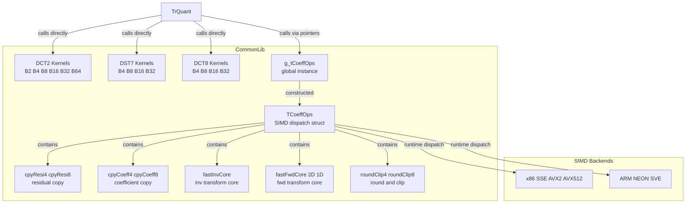
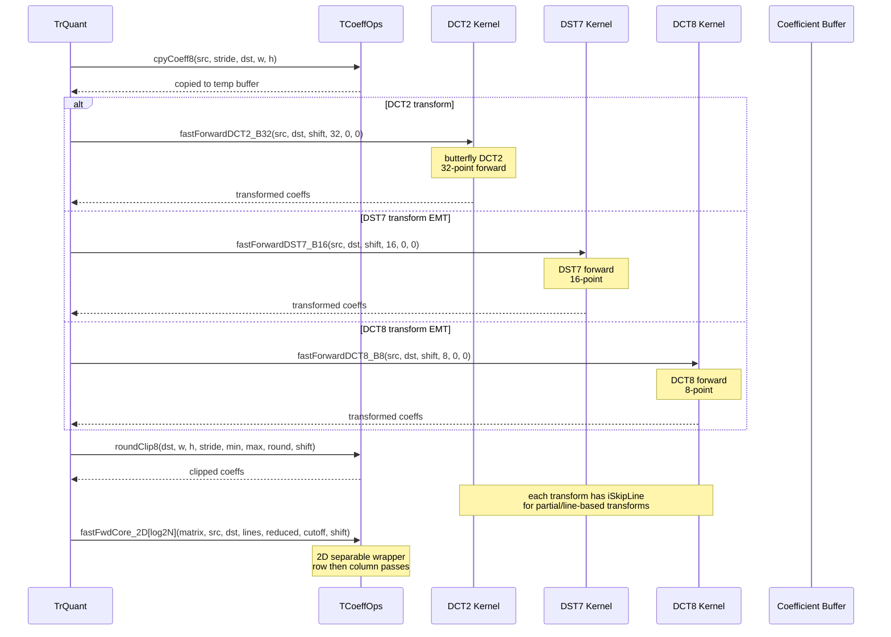

# TrQuant_EMT — EMT Explicit Multiple Transforms Coefficient Operations

## 1. Overview

`TrQuant_EMT` is not a class but a set of free functions and a SIMD function-pointer dispatch struct providing fast forward/inverse transforms for DCT2 (sizes 2 through 64), DST7 (sizes 4 through 32), and DCT8 (sizes 4 through 32). These are the core transform kernels used by VVC's MTS and EMT. The `TCoeffOps` struct holds platform-optimised function pointers for coefficient copy, round/clip, and fast transform core operations. A global instance `g_tCoeffOps` provides runtime dispatch to x86 or ARM SIMD implementations.

**Dependencies**: `CommonDef.h`, `RomTr.cpp` (transform matrix constants).

**Lifecycle**: All functions are stateless. `TCoeffOps` is instantiated globally via `g_tCoeffOps`; its constructor calls `initTCoeffOpsX86()` or `initTCoeffOpsARM()` to populate function pointers based on CPU feature detection.

## 2. Component Specifications

### 2.1 Struct: `TCoeffOps`

```cpp
#pragma once

#include "CommonDef.h"

namespace vvenc {

struct TCoeffOps
{
  TCoeffOps();

  void( *cpyResi8 )         ( const TCoeff*      src,        Pel*    dst, ptrdiff_t stride, unsigned width, unsigned height );
  void( *cpyResi4 )         ( const TCoeff*      src,        Pel*    dst, ptrdiff_t stride, unsigned width, unsigned height );
  void( *cpyCoeff8 )        ( const Pel*         src, ptrdiff_t stride,   TCoeff* dst, unsigned width, unsigned height );
  void( *cpyCoeff4 )        ( const Pel*         src, ptrdiff_t stride,   TCoeff* dst, unsigned width, unsigned height );
  void( *fastInvCore[5] )   ( const TMatrixCoeff* it,  const TCoeff* src, TCoeff* dst, unsigned lines, unsigned reducedLines, unsigned rows );
  void( *fastFwdCore_2D[5] )( const TMatrixCoeff* it,  const TCoeff* src, TCoeff* dst, unsigned lines, unsigned reducedLines, unsigned cutoff, int shift );
  void( *fastFwdCore_1D[5] )( const TMatrixCoeff* it,  const TCoeff* src, TCoeff* dst, unsigned lines, unsigned reducedLines, unsigned cutoff, int shift );
  void( *roundClip4 )       ( TCoeff *dst, unsigned width, unsigned height, unsigned stride, const TCoeff outputMin, const TCoeff outputMax, const TCoeff round, const TCoeff shift );
  void( *roundClip8 )       ( TCoeff *dst, unsigned width, unsigned height, unsigned stride, const TCoeff outputMin, const TCoeff outputMax, const TCoeff round, const TCoeff shift );
};

extern TCoeffOps g_tCoeffOps;

}
```

### 2.2 DCT2 Transforms

```cpp
namespace vvenc {

void fastForwardDCT2_B2  (const TCoeff *src, TCoeff *dst, int shift, int line, int iSkipLine, int iSkipLine2);
void fastInverseDCT2_B2  (const TCoeff *src, TCoeff *dst, int shift, int line, int iSkipLine, int iSkipLine2, const TCoeff outputMinimum, const TCoeff outputMaximum);
void fastForwardDCT2_B4  (const TCoeff *src, TCoeff *dst, int shift, int line, int iSkipLine, int iSkipLine2);
void fastInverseDCT2_B4  (const TCoeff *src, TCoeff *dst, int shift, int line, int iSkipLine, int iSkipLine2, const TCoeff outputMinimum, const TCoeff outputMaximum);
void fastForwardDCT2_B8  (const TCoeff *src, TCoeff *dst, int shift, int line, int iSkipLine, int iSkipLine2);
void fastInverseDCT2_B8  (const TCoeff *src, TCoeff *dst, int shift, int line, int iSkipLine, int iSkipLine2, const TCoeff outputMinimum, const TCoeff outputMaximum);
void fastForwardDCT2_B16 (const TCoeff *src, TCoeff *dst, int shift, int line, int iSkipLine, int iSkipLine2);
void fastInverseDCT2_B16 (const TCoeff *src, TCoeff *dst, int shift, int line, int iSkipLine, int iSkipLine2, const TCoeff outputMinimum, const TCoeff outputMaximum);
void fastForwardDCT2_B32 (const TCoeff *src, TCoeff *dst, int shift, int line, int iSkipLine, int iSkipLine2);
void fastInverseDCT2_B32 (const TCoeff *src, TCoeff *dst, int shift, int line, int iSkipLine, int iSkipLine2, const TCoeff outputMinimum, const TCoeff outputMaximum);
void fastForwardDCT2_B64 (const TCoeff *src, TCoeff *dst, int shift, int line, int iSkipLine, int iSkipLine2);
void fastInverseDCT2_B64 (const TCoeff *src, TCoeff *dst, int shift, int line, int iSkipLine, int iSkipLine2, const TCoeff outputMinimum, const TCoeff outputMaximum);

}
```

### 2.3 DST7 Transforms (EMT)

```cpp
namespace vvenc {

void fastForwardDST7_B4  (const TCoeff *src, TCoeff *dst, int shift, int line, int iSkipLine, int iSkipLine2);
void fastInverseDST7_B4  (const TCoeff *src, TCoeff *dst, int shift, int line, int iSkipLine, int iSkipLine2, const TCoeff outputMinimum, const TCoeff outputMaximum);
void fastForwardDST7_B8  (const TCoeff *src, TCoeff *dst, int shift, int line, int iSkipLine, int iSkipLine2);
void fastInverseDST7_B8  (const TCoeff *src, TCoeff *dst, int shift, int line, int iSkipLine, int iSkipLine2, const TCoeff outputMinimum, const TCoeff outputMaximum);
void fastForwardDST7_B16 (const TCoeff *src, TCoeff *dst, int shift, int line, int iSkipLine, int iSkipLine2);
void fastInverseDST7_B16 (const TCoeff *src, TCoeff *dst, int shift, int line, int iSkipLine, int iSkipLine2, const TCoeff outputMinimum, const TCoeff outputMaximum);
void fastForwardDST7_B32 (const TCoeff *src, TCoeff *dst, int shift, int line, int iSkipLine, int iSkipLine2);
void fastInverseDST7_B32 (const TCoeff *src, TCoeff *dst, int shift, int line, int iSkipLine, int iSkipLine2, const TCoeff outputMinimum, const TCoeff outputMaximum);

}
```

### 2.4 DCT8 Transforms (EMT)

```cpp
namespace vvenc {

void fastForwardDCT8_B4  (const TCoeff *src, TCoeff *dst, int shift, int line, int iSkipLine, int iSkipLine2);
void fastInverseDCT8_B4  (const TCoeff *src, TCoeff *dst, int shift, int line, int iSkipLine, int iSkipLine2, const TCoeff outputMinimum, const TCoeff outputMaximum);
void fastForwardDCT8_B8  (const TCoeff *src, TCoeff *dst, int shift, int line, int iSkipLine, int iSkipLine2);
void fastInverseDCT8_B8  (const TCoeff *src, TCoeff *dst, int shift, int line, int iSkipLine, int iSkipLine2, const TCoeff outputMinimum, const TCoeff outputMaximum);
void fastForwardDCT8_B16 (const TCoeff *src, TCoeff *dst, int shift, int line, int iSkipLine, int iSkipLine2);
void fastInverseDCT8_B16 (const TCoeff *src, TCoeff *dst, int shift, int line, int iSkipLine, int iSkipLine2, const TCoeff outputMinimum, const TCoeff outputMaximum);
void fastForwardDCT8_B32 (const TCoeff *src, TCoeff *dst, int shift, int line, int iSkipLine, int iSkipLine2);
void fastInverseDCT8_B32 (const TCoeff *src, TCoeff *dst, int shift, int line, int iSkipLine, int iSkipLine2, const TCoeff outputMinimum, const TCoeff outputMaximum);

}
```

## 3. System Architecture



## 4. Detailed Data Flow



## 5. Visualisation

### 5.1 Animation Description

The D3 animation visualises the EMT transform kernel dispatch through 12 keyframes showing butterfly-diagram style data flow for DCT2, DST7, and DCT8 at various block sizes.

- **ButterflyView**: Animated signal-flow graph showing coefficient pairs flowing through butterfly stages, with line opacity representing multiplication factors and colour coding per transform type.
- **TransformBadge**: Current transform type (DCT2/DST7/DCT8), block size, and direction (fwd/inv).
- **SimdBadge**: Currently selected SIMD backend (scalar/SSE/AVX2/NEON).
- **OperationFeed**: Log of each kernel invocation.

**Controls**: `[data-testid="play-pause"]` toggles playback; `#replay-btn` resets. Auto-plays on load.

### 5.2 Animation Source

```html
<!DOCTYPE html>
<html lang="en">
<head>
<meta charset="UTF-8">
<meta name="viewport" content="width=device-width, initial-scale=1.0">
<title>TrQuant_EMT — Transform Kernel Dispatch</title>
<style>
* { box-sizing: border-box; margin: 0; padding: 0; }
body { font-family: 'Segoe UI', system-ui, sans-serif; background: #1a1a2e; color: #e0e0e0; display: flex; justify-content: center; padding: 20px; }
#app { max-width: 720px; width: 100%; }
h1 { font-size: 1.2rem; margin-bottom: 8px; color: #a0c4ff; }
h1 small { font-weight: normal; font-size: 0.8rem; color: #888; }
#vis { background: #16213e; border-radius: 8px; padding: 16px; position: relative; }
#controls { display: flex; gap: 8px; margin-bottom: 12px; }
#controls button { background: #0f3460; color: #e0e0e0; border: 1px solid #1a5276; padding: 6px 14px; border-radius: 4px; cursor: pointer; font-size: 0.85rem; }
#controls button:hover { background: #1a5276; }
#controls button.active { background: #e94560; border-color: #e94560; }
#svg-container { position: relative; }
svg { display: block; margin: 0 auto; background: #0d1b2a; border-radius: 4px; }
#info-row { display: flex; gap: 12px; margin-top: 10px; align-items: center; flex-wrap: wrap; }
#transform-badge { font-size: 0.8rem; padding: 4px 10px; border-radius: 12px; background: #0f3460; border: 1px solid #1a5276; }
#transform-badge .label { color: #888; margin-right: 6px; }
#transform-badge .value { color: #fff; font-weight: bold; }
#simd-badge { font-size: 0.8rem; padding: 4px 10px; border-radius: 12px; background: #0f3460; border: 1px solid #1a5276; }
#simd-badge .label { color: #888; margin-right: 6px; }
#simd-badge .value { color: #2ecc71; font-weight: bold; }
#operation-feed { background: #0d1b2a; border: 1px solid #1a5276; border-radius: 4px; padding: 8px; max-height: 120px; overflow-y: auto; font-family: 'Cascadia Code', 'Fira Code', monospace; font-size: 0.75rem; margin-top: 10px; }
#operation-feed .entry { color: #a0c4ff; padding: 2px 0; border-bottom: 1px solid #1a2a4a; }
#operation-feed .entry:last-child { border-bottom: none; }
#operation-feed .entry .idx { color: #555; margin-right: 6px; }
#status-bar { font-size: 0.75rem; color: #888; margin-top: 6px; text-align: center; }
#status-bar .highlight { color: #a0c4ff; }
.butterfly-line { stroke-width: 1.5; fill: none; }
.butterfly-line.dct2 { stroke: #3498db; }
.butterfly-line.dst7 { stroke: #2ecc71; }
.butterfly-line.dct8 { stroke: #e94560; }
.butterfly-node { fill: #fff; font-size: 8px; font-family: monospace; text-anchor: middle; }
</style>
</head>
<body>
<div id="app">
<h1>TrQuant_EMT <small>EMT transform kernel dispatch</small></h1>
<div id="vis">
<div id="controls">
<button data-testid="play-pause" id="play-btn">⏸ Pause</button>
<button id="replay-btn">↻ Replay</button>
</div>
<div id="svg-container">
<svg id="butterfly-svg" width="680" height="300" viewBox="0 0 680 300">
  <defs>
    <marker id="arrow-dct2" viewBox="0 0 10 10" refX="10" refY="5" markerWidth="6" markerHeight="6" orient="auto"><path d="M0,0 L10,5 L0,10 Z" fill="#3498db"/></marker>
    <marker id="arrow-dst7" viewBox="0 0 10 10" refX="10" refY="5" markerWidth="6" markerHeight="6" orient="auto"><path d="M0,0 L10,5 L0,10 Z" fill="#2ecc71"/></marker>
    <marker id="arrow-dct8" viewBox="0 0 10 10" refX="10" refY="5" markerWidth="6" markerHeight="6" orient="auto"><path d="M0,0 L10,5 L0,10 Z" fill="#e94560"/></marker>
  </defs>
  <g id="butterfly-grp"></g>
  <text x="340" y="290" fill="#888" font-size="10" text-anchor="middle">butterfly signal flow</text>
</svg>
</div>
<div id="info-row">
<div id="transform-badge"><span class="label">transform</span><span class="value">DCT2</span></div>
<div id="simd-badge"><span class="label">SIMD</span><span class="value">AVX2</span></div>
<div id="status-bar">keyframe <span class="highlight" id="kf-idx">0</span>/<span id="kf-total">11</span> — <span id="kf-label">init</span></div>
</div>
<div id="operation-feed"></div>
</div>
</div>
<script src="https://d3js.org/d3.v7.min.js"></script>
<script>
(function() {
var state = { kf: 0, running: true };

var keyframes = [
  {time: 500,  label: 'g_tCoeffOps init',   type: 'none', size: 0,  simd: 'scalar', log: 'TCoeffOps constructed SIMD=scalar'},
  {time: 900,  label: 'cpyCoeff8',           type: 'none', size: 8,  simd: 'AVX2',   log: 'g_tCoeffOps.cpyCoeff8 src stride dst aligned'},
  {time: 1300, label: 'fwd DCT2 B4',         type: 'DCT2', size: 4,  simd: 'AVX2',   log: 'fastForwardDCT2_B4 shift=7 line=4'},
  {time: 1700, label: 'fwd DCT2 B8',         type: 'DCT2', size: 8,  simd: 'AVX2',   log: 'fastForwardDCT2_B8 shift=7 line=8'},
  {time: 2100, label: 'fwd DCT2 B16',        type: 'DCT2', size: 16, simd: 'AVX2',   log: 'fastForwardDCT2_B16 shift=7 line=16'},
  {time: 2500, label: 'fwd DCT2 B32',        type: 'DCT2', size: 32, simd: 'AVX2',   log: 'fastForwardDCT2_B32 shift=7 line=32'},
  {time: 2900, label: 'fwd DST7 B8',         type: 'DST7', size: 8,  simd: 'AVX2',   log: 'fastForwardDST7_B8 shift=7 line=8'},
  {time: 3300, label: 'fwd DST7 B16',        type: 'DST7', size: 16, simd: 'AVX2',   log: 'fastForwardDST7_B16 shift=7 line=16'},
  {time: 3700, label: 'fwd DST7 B32',        type: 'DST7', size: 32, simd: 'AVX2',   log: 'fastForwardDST7_B32 shift=7 line=32'},
  {time: 4100, label: 'fwd DCT8 B8',         type: 'DCT8', size: 8,  simd: 'AVX2',   log: 'fastForwardDCT8_B8 shift=7 line=8'},
  {time: 4500, label: 'fwd DCT8 B16',        type: 'DCT8', size: 16, simd: 'AVX2',   log: 'fastForwardDCT8_B16 shift=7 line=16'},
  {time: 4900, label: 'fwd DCT8 B32',        type: 'DCT8', size: 32, simd: 'AVX512', log: 'fastForwardDCT8_B32 shift=7 line=32 AVX512'}
];
const totalMs = keyframes[keyframes.length-1].time + 300;
window.ANIMATION_DURATION_MS = totalMs;
window.ANIMATION_KEYFRAMES = keyframes.map(k => ({time: k.time, label: k.label}));
window.ANIMATION_VERIFICATION = keyframes.map(k => ({label: k.label, type: k.type, size: k.size, simd: k.simd, logCount: 0}));
for (let i = 0; i < window.ANIMATION_VERIFICATION.length; i++) {
  window.ANIMATION_VERIFICATION[i].logCount = i + 1;
}

var svg = d3.select('#butterfly-grp');
var typeColors = {DCT2: '#3498db', DST7: '#2ecc71', DCT8: '#e94560', none: '#555'};
var arrowMarkers = {DCT2: 'url(#arrow-dct2)', DST7: 'url(#arrow-dst7)', DCT8: 'url(#arrow-dct8)'};

function drawButterfly(type, size) {
  svg.selectAll('*').remove();
  if (type === 'none' || size === 0) {
    svg.append('text').attr('x', 340).attr('y', 150).attr('text-anchor', 'middle')
      .attr('fill', '#555').attr('font-size', '14').attr('font-family', 'monospace')
      .text('no transform active');
    return;
  }
  var stages = Math.log2(size);
  var nodesPerStage = size;
  var x0 = 60, x1 = 620, y0 = 30, y1 = 250;
  var xStep = (x1 - x0) / stages;
  var yStep = (y1 - y0) / (nodesPerStage - 1);
  var marker = arrowMarkers[type] || 'none';

  for (var s = 0; s <= stages; s++) {
    var x = x0 + s * xStep;
    for (var n = 0; n < nodesPerStage; n++) {
      var y = y0 + n * yStep;
      svg.append('circle').attr('cx', x).attr('cy', y).attr('r', 3)
        .attr('fill', typeColors[type]).attr('opacity', 0.7);
    }
  }

  for (var s = 0; s < stages; s++) {
    var x1p = x0 + s * xStep, x2p = x1p + xStep;
    for (var n = 0; n < nodesPerStage/2; n++) {
      var i0 = n*2, i1 = n*2+1;
      var y1p = y0 + i0 * yStep, y2p = y0 + i1 * yStep;
      svg.append('line').attr('x1', x1p).attr('y1', y1p).attr('x2', x2p).attr('y2', y1p)
        .attr('class', 'butterfly-line ' + type.toLowerCase()).attr('opacity', 0.4)
        .attr('marker-end', marker);
      svg.append('line').attr('x1', x1p).attr('y1', y2p).attr('x2', x2p).attr('y2', y1p)
        .attr('class', 'butterfly-line ' + type.toLowerCase()).attr('opacity', 0.4)
        .attr('marker-end', marker);
      svg.append('line').attr('x1', x1p).attr('y1', y1p).attr('x2', x2p).attr('y2', y2p)
        .attr('class', 'butterfly-line ' + type.toLowerCase()).attr('opacity', 0.2)
        .attr('marker-end', marker);
      svg.append('line').attr('x1', x1p).attr('y1', y2p).attr('x2', x2p).attr('y2', y2p)
        .attr('class', 'butterfly-line ' + type.toLowerCase()).attr('opacity', 0.2)
        .attr('marker-end', marker);
    }
    nodesPerStage /= 2;
    yStep *= 2;
  }
}

var feedEl = d3.select('#operation-feed');
var kfIdxEl = d3.select('#kf-idx');
var kfLabelEl = d3.select('#kf-label');
var transEl = d3.select('#transform-badge .value');
var simdEl = d3.select('#simd-badge .value');

function goToKeyframe(idx, duration) {
  if (idx >= keyframes.length) { state.running = false; d3.select('#play-btn').text('▶ Play'); return; }
  var kf = keyframes[idx]; state.kf = idx;
  drawButterfly(kf.type, kf.size);
  transEl.text(kf.type).style('color', typeColors[kf.type] || '#fff');
  if (kf.type === 'none') transEl.text('idle').style('color', '#555');
  simdEl.text(kf.simd);
  if (kf.simd === 'AVX512') simdEl.style('color', '#e94560');
  else simdEl.style('color', '#2ecc71');
  var entry = feedEl.append('div').attr('class', 'entry');
  entry.append('span').attr('class', 'idx').text(String(idx+1).padStart(2,'0')+'.');
  entry.append('span').text(kf.log);
  feedEl.node().scrollTop = feedEl.node().scrollHeight;
  kfIdxEl.text(idx);
  kfLabelEl.text(kf.label);
}

var timer = null, currentKf = -1;

function play() {
  if (currentKf >= keyframes.length-1) {
    currentKf = -1; feedEl.selectAll('.entry').remove();
    kfIdxEl.text('0'); kfLabelEl.text('g_tCoeffOps init');
    transEl.text('idle').style('color', '#555');
    simdEl.text('scalar').style('color', '#2ecc71');
  }
  state.running = true; d3.select('#play-btn').text('⏸ Pause').classed('active', true);
  if (currentKf < 0) currentKf = 0; else currentKf++;
  var firstDelay = currentKf === 0 ? keyframes[0].time : keyframes[currentKf].time - keyframes[currentKf-1].time;
  function step() {
    if (!state.running || currentKf >= keyframes.length) {
      if (currentKf >= keyframes.length) { state.running = false; d3.select('#play-btn').text('▶ Play').classed('active', false); }
      return;
    }
    goToKeyframe(currentKf, 200);
    var nextTime = currentKf+1 < keyframes.length ? keyframes[currentKf+1].time - keyframes[currentKf].time : 300;
    currentKf++; timer = setTimeout(step, nextTime);
  }
  timer = setTimeout(step, firstDelay);
}

function togglePlay() {
  if (state.running) { state.running = false; clearTimeout(timer); d3.select('#play-btn').text('▶ Play').classed('active', false); }
  else { play(); }
}

function replay() {
  clearTimeout(timer); state.running = false; currentKf = -1;
  feedEl.selectAll('.entry').remove();
  kfIdxEl.text('0'); kfLabelEl.text('g_tCoeffOps init');
  transEl.text('idle').style('color', '#555');
  simdEl.text('scalar').style('color', '#2ecc71');
  drawButterfly('none', 0);
  d3.select('#play-btn').text('▶ Play').classed('active', false);
}

d3.select('#play-btn').on('click', togglePlay);
d3.select('#replay-btn').on('click', replay);
window.resetAnimation = replay;
window.jumpToKeyframe = function(idx) {
  if (idx < 0 || idx >= keyframes.length) return;
  clearTimeout(timer); state.running = false; currentKf = idx;
  feedEl.selectAll('.entry').remove();
  for (var i = 0; i <= idx; i++) {
    var kf = keyframes[i];
    var entry = feedEl.append('div').attr('class', 'entry');
    entry.append('span').attr('class', 'idx').text(String(i+1).padStart(2,'0')+'.');
    entry.append('span').text(kf.log);
  }
  drawButterfly(keyframes[idx].type, keyframes[idx].size);
  transEl.text(keyframes[idx].type).style('color', typeColors[keyframes[idx].type] || '#fff');
  if (keyframes[idx].type === 'none') transEl.text('idle').style('color', '#555');
  simdEl.text(keyframes[idx].simd);
  if (keyframes[idx].simd === 'AVX512') simdEl.style('color', '#e94560');
  else simdEl.style('color', '#2ecc71');
  kfIdxEl.text(idx); kfLabelEl.text(keyframes[idx].label);
};
window.getAnimationState = function() {
  return {
    transform: transEl.text(), simd: simdEl.text(),
    logCount: document.querySelectorAll('#operation-feed .entry').length,
    keyframeIdx: parseInt(kfIdxEl.text()),
    keyframeLabel: kfLabelEl.text()
  };
};

drawButterfly('none', 0);
transEl.text('idle').style('color', '#555');
simdEl.text('scalar').style('color', '#2ecc71');
var entry0 = feedEl.append('div').attr('class', 'entry');
entry0.append('span').attr('class', 'idx').text('00.');
entry0.append('span').text('TCoeffOps constructed SIMD=scalar');
document.getElementById('kf-total').textContent = keyframes.length - 1;
})();
</script>
</body>
</html>
```

### 5.3 Validation (Self-Test)

Injecting an inconsistency — for example, removing the butterfly line for a specific stage of DCT2 B32 — would leave disconnected nodes in the signal-flow graph, visually obvious as missing connections between butterfly stages. The filmstrip captures 12 frames covering DCT2 (B4/B8/B16/B32), DST7 (B8/B16/B32), and DCT8 (B8/B16/B32) forward transforms, plus initialisation and copy operations.

## 6. Testing Requirements

### Unit Tests (new file: `test/vvenc_unit_test/trquant_emt_test.cpp`)

| Test ID | Method | What to Verify |
|---|---|---|
| `EMT_TCoeffOps_CTOR` | `TCoeffOps()` | All function pointers non-null after construction |
| `EMT_DCT2_FWD_B4` | `fastForwardDCT2_B4` | Forward DCT2 of 4-point vector matches reference |
| `EMT_DCT2_INV_B4` | `fastInverseDCT2_B4` | Round-trip fwd+inv DCT2 recovers original |
| `EMT_DCT2_FWD_B8` | `fastForwardDCT2_B8` | Forward DCT2 8-point matches known constant |
| `EMT_DCT2_FWD_B16` | `fastForwardDCT2_B16` | Forward DCT2 16-point |
| `EMT_DCT2_FWD_B32` | `fastForwardDCT2_B32` | Forward DCT2 32-point |
| `EMT_DCT2_FWD_B64` | `fastForwardDCT2_B64` | Forward DCT2 64-point |
| `EMT_DST7_FWD_B4` | `fastForwardDST7_B4` | Forward DST7 4-point matches reference |
| `EMT_DST7_FWD_B8` | `fastForwardDST7_B8` | Forward DST7 8-point |
| `EMT_DST7_FWD_B16` | `fastForwardDST7_B16` | Forward DST7 16-point |
| `EMT_DST7_FWD_B32` | `fastForwardDST7_B32` | Forward DST7 32-point |
| `EMT_DST7_INV_B4` | `fastInverseDST7_B4` | Round-trip fwd+inv DST7 |
| `EMT_DCT8_FWD_B4` | `fastForwardDCT8_B4` | Forward DCT8 4-point matches reference |
| `EMT_DCT8_FWD_B8` | `fastForwardDCT8_B8` | Forward DCT8 8-point |
| `EMT_DCT8_FWD_B16` | `fastForwardDCT8_B16` | Forward DCT8 16-point |
| `EMT_DCT8_FWD_B32` | `fastForwardDCT8_B32` | Forward DCT8 32-point |
| `EMT_CPY_RESI8` | `cpyResi8` | Residual buffer copied with stride to Pel buffer |
| `EMT_CPY_COEFF4` | `cpyCoeff4` | Pel buffer copied with stride to TCoeff buffer |
| `EMT_ROUND_CLIP8` | `roundClip8` | Rounding shift correctly clips to outputMin/outputMax |
| `EMT_FAST_FWD_CORE` | `fastFwdCore_2D[log2N]` | 2D separable forward transform via function pointer |

### Calling-Order Validation

All functions in `TrQuant_EMT` are stateless and may be called in any order. `TCoeffOps` global is initialised via its constructor before `main()`.

### Parameter Range Tests

- Block sizes: DCT2 accepts 2, 4, 8, 16, 32, 64; DST7 and DCT8 accept 4, 8, 16, 32 only.
- `shift` parameter: typically 7 for forward, varies for inverse.
- `iSkipLine`/`iSkipLine2`: zero for full transform, non-zero for partial.
- `outputMin`/`outputMax` for inverse transforms: typically derived from bit depth.

### Integration Tests

Validated by the VVenC encoder end-to-end test suite: encoding with MTS=1 (implicit EMT) and MTS=2 (explicit EMT) exercises all DST7/DCT8 paths. DCT2 is exercised on every transform block.

## 7. CLI Entry Point

Not directly exposed via CLI. The EMT transform kernels are compiled into `CommonLib` and called indirectly through `TrQuant` methods (`xT`, `xIT`). The `TCoeffOps` global `g_tCoeffOps` is linked into the encoder binary and initialised at load time.
