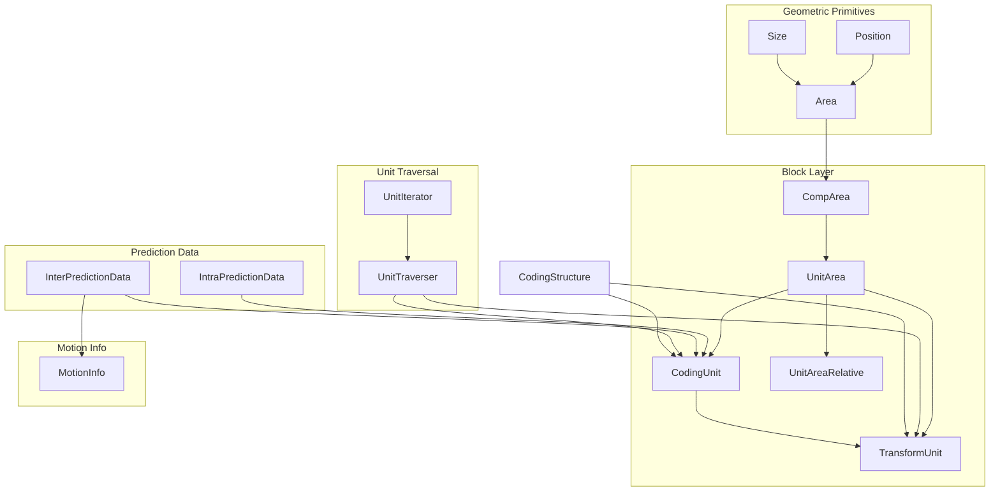
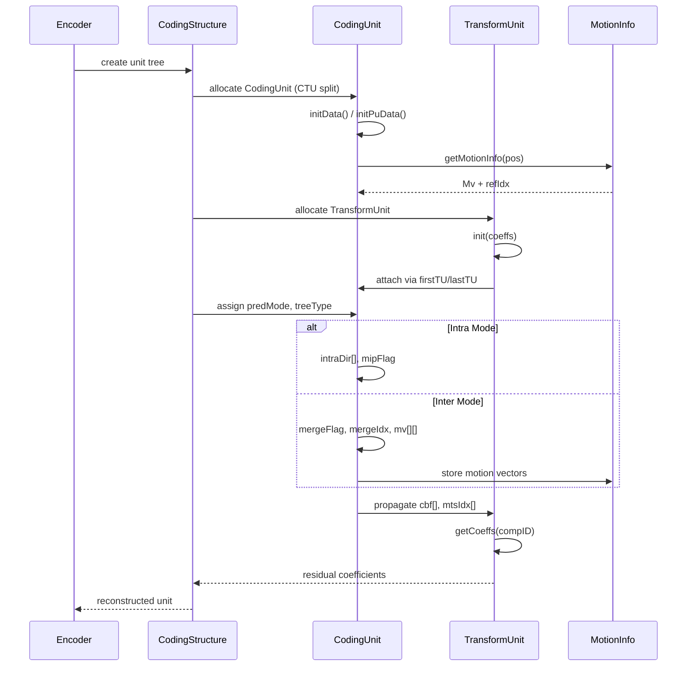

# Unit Module — Core Coding Unit Data Structures for VVC

## 1. Overview

The `Unit` module (defined in `Unit.h` / `Unit.cpp`) provides the foundational data structures that represent coding entities in the VVenC VVC encoder. It defines:

- **Geometric primitives** — `Position`, `Size`, `Area` (inherited from `Common.h`)
- **Component-aware blocks** — `CompArea`, `UnitArea`, `UnitAreaRelative`
- **Coding units** — `CodingUnit` (inherits both `IntraPredictionData` and `InterPredictionData`)
- **Transform units** — `TransformUnit`
- **Prediction data** — `IntraPredictionData`, `InterPredictionData`, `MotionInfo`
- **Iterators** — `UnitIterator<T>`, `UnitTraverser<T>`
- **Utility functions** — `recalcPosition`, `recalcSize`, `clipArea`

All types reside in the `vvenc` namespace.

## 2. Component Specifications

### 2.1 Geometric Primitives (Common.h)

```cpp
typedef int PosType;
typedef uint32_t SizeType;

struct Position {
  PosType x;
  PosType y;
  Position() : x(0), y(0) {}
  Position(PosType _x, PosType _y) : x(_x), y(_y) {}
  bool operator!=(const Position&) const;
  bool operator==(const Position&) const;
  Position offset(Position) const;
  Position offset(PosType, PosType) const;
  void repositionTo(Position);
  void relativeTo(Position);
  Position operator-(const Position&) const;
};

struct Size {
  SizeType width;
  SizeType height;
  Size() : width(0), height(0) {}
  Size(SizeType, SizeType);
  bool operator!=(const Size&) const;
  bool operator==(const Size&) const;
  uint32_t area() const;
  void clipSize(int, int);
  SizeType maxDim() const;
  SizeType minDim() const;
};

struct Area : public Position, public Size {
  Area();
  Area(const Position&, const Size&);
  Area(PosType, PosType, SizeType, SizeType);
  Position& pos();
  const Position& pos() const;
  Size& size();
  const Size& size() const;
  const Position& topLeft() const;
  Position topRight() const;
  Position bottomLeft() const;
  Position bottomRight() const;
  Position center() const;
  bool contains(const Position&) const;
  bool contains(const Area&) const;
};
```

### 2.2 Component Recalculation Functions

```cpp
Position recalcPosition(ChromaFormat, ComponentID src, ComponentID dst, const Position&);
Position recalcPosition(ChromaFormat, ChannelType src, ChannelType dst, const Position&);
Size recalcSize(ChromaFormat, ComponentID src, ComponentID dst, const Size&);
Size recalcSize(ChromaFormat, ChannelType src, ChannelType dst, const Size&);
```

These convert positions/sizes between luma and chroma domains using chroma sub-sampling ratios.

### 2.3 CompArea

```cpp
struct CompArea : public Area {
  CompArea();
  CompArea(ComponentID, ChromaFormat, const Area&, bool isLuma = false);
  CompArea(ComponentID, ChromaFormat, const Position&, const Size&, bool isLuma = false);
  CompArea(ComponentID, ChromaFormat, uint32_t x, uint32_t y, uint32_t w, uint32_t h, bool isLuma = false);

  ChromaFormat chromaFormat;
  ComponentID compID;

  Position chromaPos() const;
  Position lumaPos() const;
  Size chromaSize() const;
  Size lumaSize() const;
  Position compPos(ComponentID) const;
  Position chanPos(ChannelType) const;

  Position topLeftComp(ComponentID) const;
  Position topRightComp(ComponentID) const;
  Position bottomLeftComp(ComponentID) const;
  Position bottomRightComp(ComponentID) const;

  bool valid() const;
  bool operator==(const CompArea&) const;
  bool operator!=(const CompArea&) const;
  void repositionTo(const Position&);
  void positionRelativeTo(const CompArea&);

private:
  void xRecalcLumaToChroma();
};

CompArea clipArea(const CompArea&, const Area& boundingBox);
```

### 2.4 UnitArea

```cpp
typedef static_vector<CompArea, MAX_NUM_TBLOCKS> UnitBlocksType;

struct UnitArea {
  ChromaFormat chromaFormat;
  UnitBlocksType blocks;

  UnitArea();
  UnitArea(ChromaFormat);
  UnitArea(ChromaFormat, const Area&);
  UnitArea(ChromaFormat, const CompArea& blkY);
  UnitArea(ChromaFormat, CompArea&& blkY);
  UnitArea(ChromaFormat, const CompArea& blkY, const CompArea& blkCb, const CompArea& blkCr);
  UnitArea(ChromaFormat, CompArea&& blkY, CompArea&& blkCb, CompArea&& blkCr);

  CompArea& Y();
  const CompArea& Y() const;
  CompArea& Cb();
  const CompArea& Cb() const;
  CompArea& Cr();
  const CompArea& Cr() const;
  CompArea& block(ComponentID);
  const CompArea& block(ComponentID) const;
  CompArea& operator[](int);
  const CompArea& operator[](int) const;

  bool contains(const UnitArea&) const;
  bool contains(const UnitArea&, ChannelType) const;
  bool operator==(const UnitArea&) const;
  bool operator!=(const UnitArea&) const;
  void repositionTo(const UnitArea&);

  const Position& lumaPos() const;
  const Size& lumaSize() const;
  const Position& chromaPos() const;
  const Size& chromaSize() const;
  const UnitArea singleComp(ComponentID) const;
  const UnitArea singleChan(ChannelType) const;

  SizeType lwidth() const;
  SizeType lheight() const;
  PosType lx() const;
  PosType ly() const;
  bool valid() const;
};

UnitArea clipArea(const UnitArea&, const UnitArea& boundingBox);
```

### 2.5 UnitAreaRelative

```cpp
struct UnitAreaRelative : public UnitArea {
  UnitAreaRelative(const UnitArea& origUnit, const UnitArea& unit);
};
```

Computes component positions relative to a reference unit area.

### 2.6 IntraPredictionData

```cpp
struct IntraPredictionData {
  uint8_t intraDir[MAX_NUM_CH];
  uint8_t multiRefIdx;
  bool mipTransposedFlag;
};
```

### 2.7 InterPredictionData

```cpp
struct InterPredictionData {
  InterPredictionData() : mvdL0SubPu(nullptr) {}

  bool mergeFlag;
  bool ciip;
  bool mvRefine;
  bool mmvdMergeFlag;
  MmvdIdx mmvdMergeIdx;
  uint8_t mergeIdx;
  uint8_t geoSplitDir;
  MergeIdxPair geoMergeIdx;
  uint8_t interDir;
  uint8_t mcControl;
  MergeType mergeType;
  Mv* mvdL0SubPu;

  uint8_t mvpIdx[NUM_REF_PIC_LIST_01];
  uint8_t mvpNum[NUM_REF_PIC_LIST_01];
  Mv mvd[NUM_REF_PIC_LIST_01][3];
  Mv mv[NUM_REF_PIC_LIST_01][3];
  int16_t refIdx[NUM_REF_PIC_LIST_01];

  bool mccNoBdof() const;
  bool mccNoChroma() const;
  bool mccNoLuma() const;
};
```

### 2.8 CodingUnit

```cpp
struct CodingUnit : public UnitArea, public IntraPredictionData, public InterPredictionData {
  CodingStructure* cs;
  Slice* slice;
  ChannelType chType;
  PredMode predMode;

  uint8_t depth;
  uint8_t qtDepth;
  uint8_t btDepth;
  uint8_t mtDepth;
  int8_t chromaQpAdj;
  int8_t qp;
  SplitSeries splitSeries;
  TreeType treeType;
  ModeType modeType;
  ModeTypeSeries modeTypeSeries;

  bool skip;
  bool mmvdSkip;
  bool colorTransform;
  bool geo;
  bool rootCbf;
  bool mipFlag;
  bool affine;
  uint8_t affineType;
  uint8_t imv;
  uint8_t sbtInfo;
  uint8_t mtsFlag;
  uint8_t lfnstIdx;
  uint8_t BcwIdx;
  int8_t imvNumCand;
  uint8_t smvdMode;
  uint8_t ispMode;
  uint8_t bdpcmM[MAX_NUM_CH];
  uint32_t tileIdx;

  CodingUnit();
  CodingUnit(const UnitArea&);
  CodingUnit(ChromaFormat, const Area&);

  void initData();
  void initPuData();

  CodingUnit& operator=(const CodingUnit&);
  CodingUnit& operator=(const InterPredictionData&);
  CodingUnit& operator=(const IntraPredictionData&);
  CodingUnit& operator=(const MotionInfo&);

  const MotionInfo& getMotionInfo() const;
  const MotionInfo& getMotionInfo(const Position&) const;
  MotionBuf getMotionBuf();
  CMotionBuf getMotionBuf() const;

  unsigned idx;
  CodingUnit* next;
  TransformUnit* firstTU;
  TransformUnit* lastTU;
};
```

### 2.9 TransformUnit

```cpp
struct TransformUnit : public UnitArea {
  CodingUnit* cu;
  CodingStructure* cs;
  ChannelType chType;
  int chromaAdj;
  uint8_t depth;
  bool noResidual;
  uint8_t jointCbCr;
  uint8_t mtsIdx[MAX_NUM_TBLOCKS];
  uint8_t cbf[MAX_NUM_TBLOCKS];
  int16_t lastPos[MAX_NUM_TBLOCKS];

  unsigned idx;
  TransformUnit* next;
  TransformUnit* prev;

  TransformUnit();
  TransformUnit(const UnitArea&);
  TransformUnit(ChromaFormat, const Area&);

  void initData();
  void init(TCoeffSig** coeffs);
  TransformUnit& operator=(const TransformUnit&);
  void copyComponentFrom(const TransformUnit&, ComponentID);
  void checkTuNoResidual(unsigned idx);
  int getTbAreaAfterCoefZeroOut(ComponentID) const;

  CoeffSigBuf getCoeffs(ComponentID);
  const CCoeffSigBuf getCoeffs(ComponentID) const;

private:
  friend CodingStructure;
  TCoeffSig* m_coeffs[MAX_NUM_TBLOCKS];
};
```

### 2.10 MotionInfo

```cpp
struct MotionInfo {
  Mv mv[NUM_REF_PIC_LIST_01];
  int8_t miRefIdx[NUM_REF_PIC_LIST_01];

  bool operator==(const MotionInfo&) const;
  bool operator!=(const MotionInfo&) const;
  int interDir() const;
  int isInter() const;
};
```

### 2.11 Iterator / Traverser Templates

```cpp
template<typename T>
struct UnitIterator {
  explicit UnitIterator(T* punit);
  // models std::forward_iterator_tag
  T& operator*();
  const T& operator*() const;
  T* operator->();
  const T* operator->() const;
  UnitIterator<T>& operator++();
  UnitIterator<T> operator++(int);
  bool operator!=(const UnitIterator<T>&) const;
  bool operator==(const UnitIterator<T>&) const;
};

template<typename T>
struct UnitTraverser {
  UnitTraverser();
  UnitTraverser(T* begin, T* end);
  typedef UnitIterator<T> iterator;
  typedef UnitIterator<const T> const_iterator;
  iterator begin();
  const_iterator begin() const;
  const_iterator cbegin() const;
  iterator end();
  const_iterator end() const;
  const_iterator cend() const;
};

typedef UnitTraverser<CodingUnit> CUTraverser;
typedef UnitTraverser<TransformUnit> TUTraverser;
typedef UnitTraverser<const CodingUnit> cCUTraverser;
typedef UnitTraverser<const TransformUnit> cTUTraverser;
```

## 3. System Architecture



## 4. Detailed Data Flow



## 5. Visualisation

No D3 animation.

## 6. Testing Requirements

| Test ID | Description | Input | Expected Output |
|---------|-------------|-------|-----------------|
| UT-001 | CompArea construction from luma | Position(64,64), Size(64,64), COMP_Y, CHROMA_420 | CompArea.x=32, .y=32, .width=32, .height=32 |
| UT-002 | CompArea::lumaSize for chroma component | CompArea(COMP_Cb, CHROMA_420, 0,0,16,16) | Size(32,32) |
| UT-003 | CompArea::chromaPos for luma component | CompArea(COMP_Y, CHROMA_420, 32,32,64,64) | Position(16,16) |
| UT-004 | UnitArea::contains | UnitArea containing a sub-area | true |
| UT-005 | UnitArea::singleComp | Filter COMP_Cb from 3-component unit | Only Cb block valid |
| UT-006 | CodingUnit::initData | Default CU | predMode=NUMBER_OF_PREDICTION_MODES, skip=false |
| UT-007 | CodingUnit::initPuData | Default CU | intraDir[0]=DC_IDX, mergeFlag=false |
| UT-008 | CodingUnit::operator=(MotionInfo) | MotionInfo with refIdx[0]=0, mv={1,2} | CU.interDir=1, CU.mv[0][0]={1,2} |
| UT-009 | TransformUnit::initData | Default TU | cbf all 0, mtsIdx all MTS_DCT2_DCT2 |
| UT-010 | TransformUnit::getTbAreaAfterCoefZeroOut | 32x32 luma TU with MTS | area=256 (16x16 after zero-out) |
| UT-011 | CompArea::valid() | Invalid CompArea | false |
| UT-012 | recalcPosition luma-to-chroma | (420, COMP_Y, COMP_Cb, (64,64)) | Position(32,32) |
| UT-013 | clipArea(CompArea) | CompArea partially outside bounding box | Clipped CompArea |
| UT-014 | UnitIterator iteration | Linked list of CodingUnits | Each CU visited via ++ operator |
| UT-015 | MotionInfo::interDir | refIdx[0]=0, refIdx[1]=MI_NOT_VALID | interDir=1 |

## 7. CLI Entry Point

This module is a library component — it has no standalone CLI entry point. It is compiled as part of `libCommonLib.a` and linked into the `vvenc` encoder binary. Unit tests are run via the encoder's test harness.
