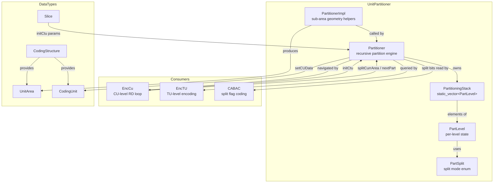
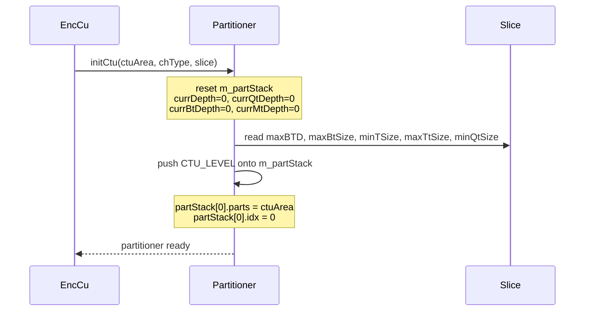
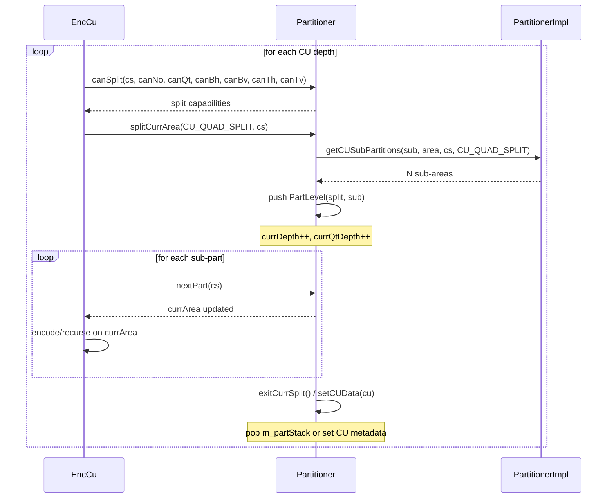
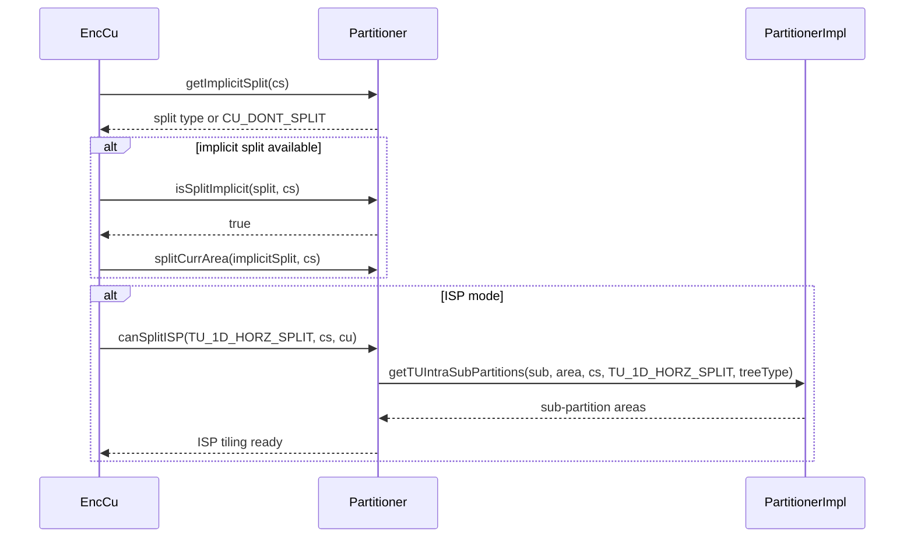
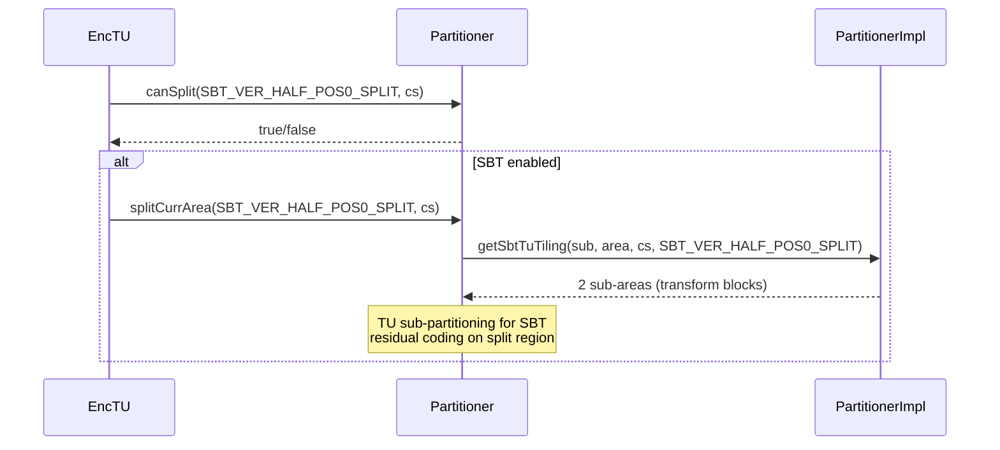

# UnitPartitioner — Recursive CTU/CU/TU Partitioning for VVC Quadtree+BT+MT

## 1. Overview

The `UnitPartitioner` module manages recursive partitioning of Coding Tree Units (CTUs), Coding Units (CUs), and Transform Units (TUs) according to the VVC quadtree + binary/ternary multi-type tree (QT+BT+MT) split hierarchy. It provides:

- A `PartSplit` enum encoding all VVC split modes (quad, horizontal/vertical BT/TT, SBT sub-partitions, ISP 1D splits, TU max transform split).
- A `PartLevel` struct storing per-level split state (split type, sub-area partitioning, implicit split flags, QG/QG chroma enables).
- A `Partitioner` class that maintains a depth-bounded stack (`PartitioningStack`) of partition levels and exposes iteration (`splitCurrArea`/`nextPart`/`exitCurrSplit`) and query (`canSplit`, `isSplitImplicit`, `getImplicitSplit`) for the encoder's RD recursion.
- A `PartitionerImpl` namespace with stateless helpers that compute the actual sub-area geometries (`getCUSubPartitions`, `getMaxTuTiling`, `getTUIntraSubPartitions`, `getSbtTuTiling`).

**Dependencies**: `Unit.h` (for `UnitArea`, `CodingUnit`, `CodingStructure`), `CommonDef.h` (for `MAX_CU_DEPTH`, static_vector, type aliases).

**Lifecycle**: A `Partitioner` is created per-CTU in the encoder's encoding loop. It is initialised via `initCtu` and then driven through the recursive split/next/exit cycle by `EncCu` (or equivalent).

## 2. Component Specifications

### 2.1 Enum: `PartSplit`

```cpp
namespace vvenc {

enum PartSplit
{
  CTU_LEVEL            = 0,
  CU_QUAD_SPLIT,

  CU_HORZ_SPLIT,
  CU_VERT_SPLIT,
  CU_TRIH_SPLIT,
  CU_TRIV_SPLIT,
  TU_MAX_TR_SPLIT,
  TU_NO_ISP,
  TU_1D_HORZ_SPLIT,
  TU_1D_VERT_SPLIT,
  SBT_VER_HALF_POS0_SPLIT,
  SBT_VER_HALF_POS1_SPLIT,
  SBT_HOR_HALF_POS0_SPLIT,
  SBT_HOR_HALF_POS1_SPLIT,
  SBT_VER_QUAD_POS0_SPLIT,
  SBT_VER_QUAD_POS1_SPLIT,
  SBT_HOR_QUAD_POS0_SPLIT,
  SBT_HOR_QUAD_POS1_SPLIT,
  NUM_PART_SPLIT,
  CU_MT_SPLIT      = 1000,   ///< dummy: MT (multi-type-tree) split indicator
  CU_BT_SPLIT      = 1001,   ///< dummy: BT split indicator
  CU_DONT_SPLIT    = 2000    ///< dummy: no split
};

}
```

### 2.2 Struct: `PartLevel`

```cpp
namespace vvenc {

struct PartLevel
{
  PartSplit    split;
  Partitioning parts;
  unsigned     numParts;
  unsigned     idx;
  bool         checkdIfImplicit;
  bool         isImplicit;
  PartSplit    implicitSplit;
  PartSplit    firstSubPartSplit;
  bool         canQtSplit;
  bool         qgEnable;
  bool         qgChromaEnable;
  int          modeType;

  PartLevel();
  PartLevel( const PartSplit _split, const Partitioning _parts );
  void init();
};

using PartitioningStack = static_vector<PartLevel, 2 * MAX_CU_DEPTH + 1>;

}
```

### 2.3 Class: `Partitioner`

```cpp
namespace vvenc {

class Partitioner
{
protected:
  PartitioningStack m_partStack;
#if _DEBUG
  UnitArea          m_currArea;
#endif
  static const size_t partBufSize = 128;
  UnitArea          m_partBuf[partBufSize];
  ptrdiff_t         m_partBufIdx;

public:
  unsigned currDepth;
  unsigned currQtDepth;
  unsigned currTrDepth;
  unsigned currBtDepth;
  unsigned currMtDepth;
  unsigned currSubdiv;
  Position currQgPos;
  Position currQgChromaPos;

  unsigned currImplicitBtDepth;
  ChannelType chType;
  TreeType treeType;
  ModeType modeType;

  unsigned maxBTD;
  unsigned maxBtSize;
  unsigned minTSize;
  unsigned maxTtSize;
  unsigned minQtSize;

  // Accessors
  const PartLevel&            currPartLevel   () const;
  const UnitArea&             currArea        () const;
  const unsigned              currPartIdx     () const;
  const PartitioningStack&    getPartStack    () const;
  const bool                  currQgEnable    () const;
  const bool                  currQgChromaEnable () const;

  SplitSeries                 getSplitSeries  () const;
  ModeTypeSeries              getModeTypeSeries () const;

  // Navigation
  void initCtu                ( const UnitArea& ctuArea, const ChannelType _chType, const Slice& slice );
  void splitCurrArea          ( const PartSplit split, const CodingStructure& cs );
  void exitCurrSplit          ();
  bool nextPart               ( const CodingStructure& cs, bool autoPop = false );
  bool hasNextPart            ();

  void setCUData              ( CodingUnit& cu );
  void copyState              ( const Partitioner& other );

  // Split queries
  void canSplit               ( const CodingStructure& cs, bool& canNo, bool& canQt,
                                 bool& canBh, bool& canBv, bool& canTh, bool& canTv );
  bool canSplit               ( const PartSplit split, const CodingStructure& cs );
  bool canSplitISP            ( const PartSplit split, const CodingStructure& cs, CodingUnit& cu );
  bool isSplitImplicit        ( const PartSplit split, const CodingStructure& cs );
  PartSplit getImplicitSplit  ( const CodingStructure& cs );
  bool isSepTree              ( const CodingStructure& cs );
  bool isConsInter            ();
  bool isConsIntra            ();

  void setMaxMinDepth         ( unsigned& minDepth, unsigned& maxDepth,
                                 const CodingStructure& cs, int QtbttSpeedUp, bool MergeFlag ) const;
};

}
```

### 2.4 Namespace: `PartitionerImpl`

```cpp
namespace vvenc {
namespace PartitionerImpl {

  int getCUSubPartitions      ( Partitioning& sub, const UnitArea& cuArea,
                                 const CodingStructure& cs, const PartSplit splitType = CU_QUAD_SPLIT );
  int getMaxTuTiling          ( Partitioning& sub, const UnitArea& curArea,
                                 const CodingStructure& cs );
  int getTUIntraSubPartitions ( Partitioning& sub, const UnitArea& tuArea,
                                 const CodingStructure& cs, const PartSplit splitType,
                                 const TreeType treeType );
  int getSbtTuTiling          ( Partitioning& sub, const UnitArea& curArea,
                                 const CodingStructure& cs, const PartSplit splitType );

}
}
```

## 3. System Architecture



## 4. Detailed Data Flow

### 4.1 CTU Initialisation



### 4.2 Recursive CU Split Loop



### 4.3 Implicit Split and ISP Flow



### 4.4 SBT Tu Tiling



## 5. Visualisation

No D3 animation. Partitioning state is inherently recursive and tree-shaped; the split / next / exit iteration pattern is best understood through the sequence diagrams above.

## 6. Testing Requirements

### Unit Tests (new file: `test/vvenc_unit_test/partition_test.cpp`)

| Test ID | Class / Method | What to Verify |
|---|---|---|
| `PART_PARTSPLIT_ENUM` | `PartSplit` | All enum values distinct; `CTU_LEVEL` == 0; dummy values `CU_MT_SPLIT`, `CU_BT_SPLIT`, `CU_DONT_SPLIT` have sentinel magnitudes |
| `PART_PARTLEVEL_DEFAULT` | `PartLevel()` | Default init: split, numParts, idx zeroed; flags false |
| `PART_PARTLEVEL_PARAM` | `PartLevel(split, parts)` | Members match constructor args |
| `PART_PARTLEVEL_INIT` | `PartLevel::init()` | After init, all flags reset to defaults |
| `PART_STACK_STORAGE` | `PartitioningStack` | Capacity >= `2 * MAX_CU_DEPTH + 1`; empty initially |
| `PART_INIT_CTU` | `Partitioner::initCtu` | Stack has 1 level; `currDepth` == 0; `currArea` matches ctuArea |
| `PART_SPLIT_CU_QUAD` | `splitCurrArea(CU_QUAD_SPLIT)` | N=4 sub-areas; `currDepth` incremented; stack depth increases |
| `PART_SPLIT_BT_HORZ` | `splitCurrArea(CU_HORZ_SPLIT)` | N=2 sub-areas (top/bottom halves) |
| `PART_SPLIT_BT_VERT` | `splitCurrArea(CU_VERT_SPLIT)` | N=2 sub-areas (left/right halves) |
| `PART_SPLIT_TT_HORZ` | `splitCurrArea(CU_TRIH_SPLIT)` | N=3 sub-areas (1:2:1 vertical) |
| `PART_SPLIT_TT_VERT` | `splitCurrArea(CU_TRIV_SPLIT)` | N=3 sub-areas (1:2:1 horizontal) |
| `PART_NEXT_PART` | `nextPart(cs)` | Iterates through all sub-areas; returns false when exhausted |
| `PART_NEXT_PART_AUTOPOP` | `nextPart(cs, true)` | Auto-exits on last part; stack depth restored |
| `PART_HAS_NEXT` | `hasNextPart()` | Returns true when idx < numParts - 1 |
| `PART_EXIT_CURR` | `exitCurrSplit()` | Pops stack; depth variables restored |
| `PART_CAN_SPLIT_QUAD` | `canSplit(cs, ...)` | Returns correct canQt for current area vs. minQtSize |
| `PART_CAN_SPLIT_BT` | `canSplit(CU_HORZ_SPLIT, cs)` | Respects maxBtSize, maxBTD, currBtDepth |
| `PART_CAN_SPLIT_TT` | `canSplit(CU_TRIH_SPLIT, cs)` | Respects maxTtSize, maxBTD |
| `PART_CAN_SPLIT_ISP` | `canSplitISP(split, cs, cu)` | Only valid for intra CUs with ISP enabled |
| `PART_IS_IMPLICIT` | `isSplitImplicit(split, cs)` | Returns true when split is mandatory (minBtSize constraint) |
| `PART_GET_IMPLICIT` | `getImplicitSplit(cs)` | Returns CU_DONT_SPLIT when no implicit; correct split when forced |
| `PART_IS_SEP_TREE` | `isSepTree(cs)` | Delegates to slice's separate colour-plane flag |
| `PART_CONS_INTER` | `isConsInter()` | True when modeType == MODE_TYPE_INTER |
| `PART_CONS_INTRA` | `isConsIntra()` | True when modeType == MODE_TYPE_INTRA |
| `PART_SET_CU_DATA` | `setCUData(cu)` | CU receives correct depth, qtDepth, trDepth, btDepth, mtDepth |
| `PART_COPY_STATE` | `copyState(other)` | All depth fields and stack contents match source |
| `PART_GET_SPLIT_SERIES` | `getSplitSeries()` | Returns correct sequence of split types since root |
| `PART_IMPL_GET_CU_SUB` | `PartitionerImpl::getCUSubPartitions` | Returns correct number of sub-areas for quad/BT/TT split |
| `PART_IMPL_MAX_TU_TILING` | `PartitionerImpl::getMaxTuTiling` | Sub-areas cover entire parent area without overlap or gap |
| `PART_IMPL_GET_TU_ISP` | `PartitionerImpl::getTUIntraSubPartitions` | ISP 1D split produces correct sub-areas (horizontal/vertical) |
| `PART_IMPL_SBT_TILING` | `PartitionerImpl::getSbtTuTiling` | SBT sub-areas match the split flag (pos0 vs pos1, half vs quad) |

### Calling-Order Validation

- `initCtu` must be called before any `splitCurrArea`, `nextPart`, or `exitCurrSplit`.
- `splitCurrArea` must be followed by a `nextPart` loop that eventually returns false or hits `exitCurrSplit`.
- `setCUData` must only be called on a leaf CU (after `canSplit` reports no further split).
- `copyState` must only be called on a fully-initialised partitioner (after `initCtu`).

### Parameter Range Tests

- `PartSplit` values passed to `canSplit`, `splitCurrArea`: only values representing valid splits at current depth (quad/BT/TT at CU level, ISP/SBT at TU level).
- `canSplitISP`: only `TU_1D_HORZ_SPLIT` and `TU_1D_VERT_SPLIT` are valid split arguments.
- `getSbtTuTiling`: `splitType` must be one of the eight `SBT_*_SPLIT` values.
- Depth variables (`currDepth`, `currQtDepth`, `currTrDepth`, `currBtDepth`, `currMtDepth`) must remain within `MAX_CU_DEPTH`.

### Integration Tests

Covered by `vvenc_unit_test.cpp` which exercises the encoder loop (`EncCu`, `EncTU`). The dedicated `partition_test.cpp` validates individual `Partitioner` methods and `PartitionerImpl` geometry generators in isolation.

## 7. CLI Entry Point

Not directly exposed via CLI. `Partitioner` is an internal recursion engine consumed by `EncCu`, `EncTU`, and `CABACWriter` within `EncoderLib`.
