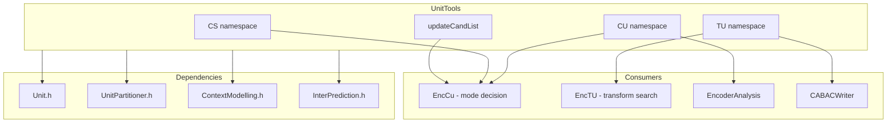
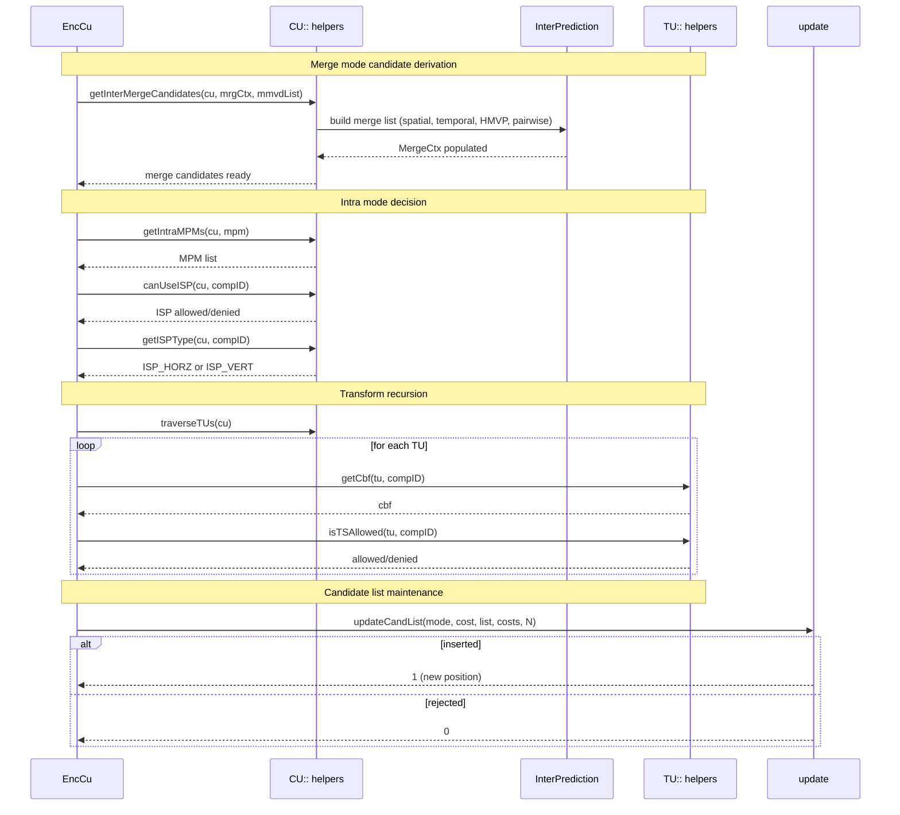

# UnitTools — CU / PU / TU Helper Functions for VVC Encoder

## 1. Overview

`UnitTools.h` provides a collection of free functions organized into the `CS`, `CU`, and `TU` namespaces (all within `namespace vvenc`) that implement the helper logic for VVC encoding decisions: merge/skip candidate derivation, MIP/ISP/MRL/PDPC, SMVD, GPM, CIIP, SBT, transform tree traversal, chroma format operations, motion vector prediction, affine merge, IBC, and MIP mode determination. These are the utility layer between the raw `Unit.h` data structures and the encoder's mode-decision logic in `EncLib`.

**Dependencies**: `Unit.h`, `UnitPartitioner.h`, `ContextModelling.h`, `InterPrediction.h`.

## 2. Component Specifications

### 2.1 Namespace: `CS` — CodingStructure queries

| Function | Signature | Purpose |
|---|---|---|
| `getArea` | `(const CodingStructure&, const UnitArea&, ChannelType, TreeType)` → `UnitArea` | Resolve area for a given channel/tree type |
| `isDualITree` | `(const CodingStructure&)` → `bool` | True when separate luma/chroma trees |
| `setRefinedMotionFieldCTU` | `(CodingStructure&, int ctuX, int ctuY)` | Refine motion field for one CTU |
| `setRefinedMotionField` | `(CodingStructure&)` | Refine motion field for entire picture |
| `signalModeCons` | `(const CodingStructure&, const UnitArea&, PartSplit, ModeType)` → `int` | Mode consistency signalling for dependent splitting |

### 2.2 Namespace: `CU` — Coding Unit helpers

| Category | Functions |
|---|---|
| **Pred mode queries** | `isSepTree`, `isLocalSepTree`, `isConsInter`, `isConsIntra`, `isIntra`, `isInter`, `isIBC`, `isPLT` |
| **Slice/Tile/CTU adjacency** | `isSameSlice`, `isSameTile`, `isSameSliceAndTile`, `isSameCtu`, `isSameSubPic`, `isLastSubCUOfCtu`, `getCtuAddr` |
| **SBT sub-block transform** | `checkAllowedSbt`, `getSbtIdx`, `getSbtPos`, `getSbtMode`, `getSbtIdxFromSbtMode`, `getSbtPosFromSbtMode`, `targetSbtAllowed`, `numSbtModeRdo`, `getSbtTuSplit`, `isSbtMode`, `isSameSbtSize` |
| **Intra prediction** | `checkCCLMAllowed`, `getIntraMPMs`, `isDMChromaMIP`, `getIntraDirLuma`, `getIntraChromaCandModes`, `getFinalIntraMode`, `getCoLocatedIntraLumaMode`, `isLMCMode`, `isLMCModeEnabled`, `getLMSymbolList`, `isMIP`, `getNumModesMip`, `getMipSizeId` |
| **ISP intra sub-partitions** | `getISPType`, `isISPLast`, `isISPFirst`, `canUseISP`, `canUseLfnstWithISP`, `getISPSplitDim`, `allLumaCBFsAreZero`, `divideTuInRows` |
| **Merge / Skip** | `getInterMergeCandidates`, `getInterMMVDMergeCandidates`, `getGeoMergeCandidates`, `getIBCMergeCandidates`, `addMergeHMVPCand`, `restrictBiPredMergeCandsOne` |
| **AMVP / MVP** | `fillMvpCand`, `addMVPCandUnscaled`, `addAMVPHMVPCand`, `getColocatedMVP`, `fillIBCMvpCand`, `getIbcMVPsEncOnly`, `isDiffMER`, `getDistScaleFactor` |
| **Affine** | `getAffineControlPointCand`, `getAffineMergeCand`, `setAllAffineMvField`, `setAllAffineMv`, `xInheritedAffineMv`, `fillAffineMvpCand`, `addAffineMVPCandUnscaled`, `getInterMergeSbTMVPCand` |
| **Motion info** | `spanMotionInfo`, `spanGeoMotionInfo`, `saveMotionInHMVP`, `getRprScaling`, `resetMVDandMV2Int`, `hasSubCUNonZeroMVd`, `hasSubCUNonZeroAffineMVd`, `isBipredRestriction`, `isBiPredFromDifferentDirEqDistPoc`, `checkDMVRCondition` |
| **GPM geo partitioning** | `getGeoMergeCandidates`, `spanGeoMotionInfo` |
| **QP / BCW / BDPCM / MTS** | `predictQP`, `isBcwIdxCoded`, `getValidBcwIdx`, `setBcwIdx`, `bdpcmAllowed`, `isMTSAllowed` |
| **TU traversal** | `traverseTUs` (mutable + const overloads) |
| **Spatial neighbours** | `getLeft`, `getAbove` |
| **Misc** | `getSplitAtDepth`, `getModeTypeAtDepth`, `isPredRegDiffFromTB`, `isFirstTBInPredReg`, `adjustPredArea`, `isMvInRangeFPP`, `isMotionBufInRangeFPP` |

### 2.3 Namespace: `TU` — Transform Unit helpers

| Function | Signature | Purpose |
|---|---|---|
| `getCbf` | `(const TransformUnit&, ComponentID)` → `bool` | Coded-block flag for component |
| `getCbfAtDepth` | `(const TransformUnit&, ComponentID, unsigned depth)` → `bool` | CBF at a given transform depth |
| `setCbfAtDepth` | `(TransformUnit&, ComponentID, unsigned depth, bool cbf)` | Set CBF at depth |
| `isTSAllowed` | `(const TransformUnit&, ComponentID)` → `bool` | Transform skip allowed? |
| `needsSqrt2Scale` | `(const TransformUnit&, ComponentID)` → `bool` | Non-square transform needs sqrt(2) scaling |
| `getPrevTU` | `(const TransformUnit&, ComponentID)` → `TransformUnit*` | Previous TU in coding order |
| `getPrevTuCbfAtDepth` | `(const TransformUnit&, ComponentID, int trDepth)` → `bool` | Previous TU's CBF at depth |
| `getICTMode` | `(const TransformUnit&, int jointCbCr)` → `int` | Intra colour-transform mode (ACT/JointCbCr) |

### 2.4 Free template: `updateCandList<T, N>`

Updates a fixed-capacity candidate list with a new mode+cost pair, maintaining sorted order (lower cost = better). Returns 1 if inserted, 0 if rejected.

## 3. Dependency Graph

## 4. Detailed Data Flow

## 5. Visualisation

No D3 animation — this is a pure utility header with no visualisation component.

## 6. Testing Requirements

### Unit Tests

| Test ID | Function | What to Verify |
|---|---|---|
| `UT_CU_ISPREDMODE` | `CU::isIntra/isInter/isIBC/isPLT` | Returns true iff `cu.predMode` matches |
| `UT_CU_ISSEPTREE` | `CU::isSepTree` | True for separate-tree or dual-tree |
| `UT_CU_GETCTUADDR` | `CU::getCtuAddr` | Correct CTU address for position |
| `UT_CU_SBT_MODE` | `CU::getSbtMode/getSbtIdx/getSbtPos` | Round-trip: pack and unpack SBT info |
| `UT_CU_ISP` | `CU::canUseISP` | Block size constraints, max TB size |
| `UT_CU_ISPLAST` | `CU::isISPLast` | Correctly identifies last ISP sub-partition |
| `UT_CU_GETINTRA_MPM` | `CU::getIntraMPMs` | Returns 6 MPMs; contains DC/Planar for default |
| `UT_CU_MERGE_CANDS` | `CU::getInterMergeCandidates` | Max 6 candidates; spatial + temporal + HMVP |
| `UT_CU_GEO_MERGE` | `CU::getGeoMergeCandidates` | Unique candidates for geometric merge |
| `UT_CU_AFFINE_MERGE` | `CU::getAffineMergeCand` | Up to 5 affine merge candidates |
| `UT_CU_IBC_MERGE` | `CU::getIBCMergeCandidates` | IBC merge list populated |
| `UT_CU_UPDATE_CAND` | `updateCandList` | Insertion at correct sorted position |
| `UT_CU_UPDATE_FULL` | `updateCandList` (list full) | Rejects when no room and cost too high |
| `UT_TU_GETCBF` | `TU::getCbf` | False when TU has no coded coefficients |
| `UT_TU_SETCBF` | `TU::setCbfAtDepth` | Round-trip get/set at depth |
| `UT_TU_ISTALLOWED` | `TU::isTSAllowed` | True only when within max TS size |
| `UT_TU_ICTMODE` | `TU::getICTMode` | Correct JointCbCr mode index |
| `UT_CS_DUALITREE` | `CS::isDualITree` | True for separate colour-plane slices |
| `UT_CS_SIGNALMODE` | `CS::signalModeCons` | Correct signalling bits for mode type |
| `UT_MIP_SIZEID` | `getMipSizeId` | 0 for 4x4, 1 for 8x8, 2 for larger |

### Integration Tests

Covered by `EncCu`, `EncTU`, and `CABACWriter` pipelines within `EncoderLib`.

## 7. CLI Entry Point

Not directly exposed via CLI. `UnitTools` functions are internal utilities consumed by `EncCu`, `EncTU`, `CABACWriter`, and `EncoderAnalysis` throughout `EncoderLib`.
