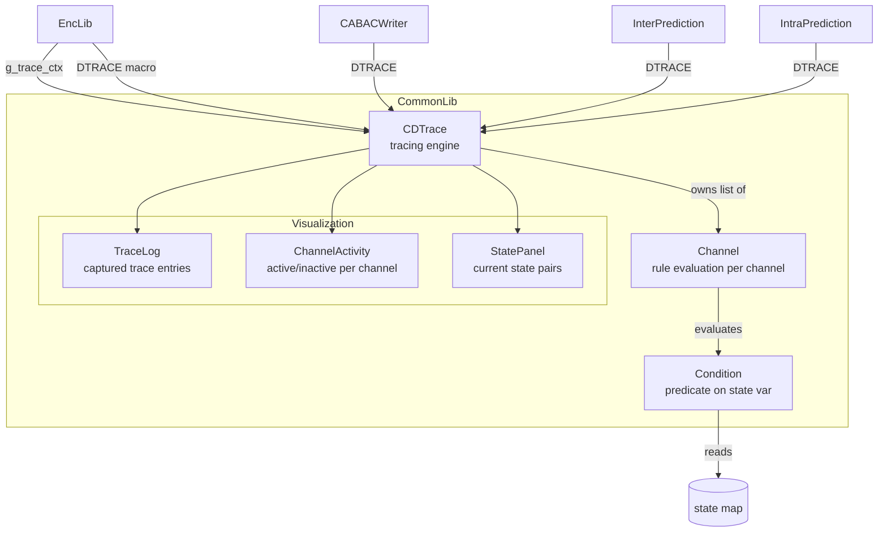
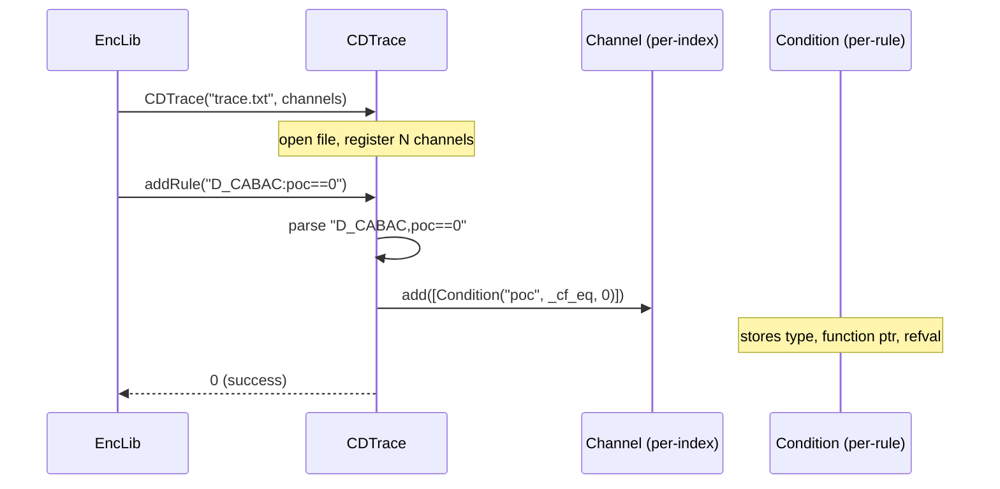
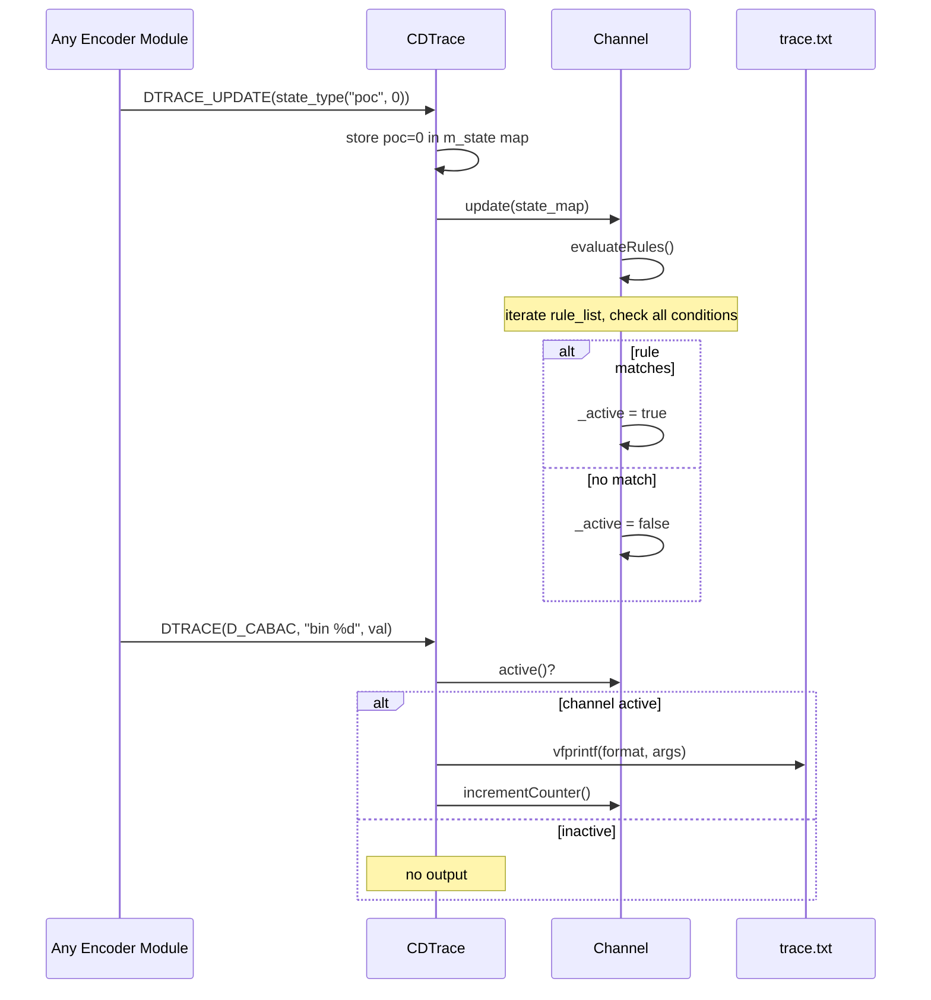

# dtrace — Debug Trace/Logging Infrastructure

## 1. Overview

The `dtrace` module provides a conditional runtime tracing framework for debugging the encoder pipeline. It allows selective activation of trace output per channel based on rules evaluated against encoder state (e.g., POC, final flag).

**Core class**: `CDTrace` — owns channel definitions, rule evaluation, state tracking, and trace file output.

**Supporting types**: `Channel` (per-channel rule list + active flag), `Condition` (predicate on a state variable), `dtrace_channel` (name/number pair).

**Dependencies**: `CommonDef.h`, `<stdio.h>`, `<string>`, `<map>`, `<set>`, `<vector>`, `<list>`.

**Lifecycle**: A single `CDTrace` instance (`g_trace_ctx`) is created at encoder startup via `tracing_init()` and destroyed at shutdown. Channels are registered at construction and activated/deactivated during encoding as the state changes.

## 2. Component Specifications

### 2.1 Struct: `dtrace_channel`

```cpp
namespace vvenc {

struct dtrace_channel
{
  int         channel_number;
  std::string channel_name;
};

typedef std::vector<dtrace_channel> dtrace_channels_t;

}
```

### 2.2 Struct: `Condition`

```cpp
namespace vvenc {

class Condition
{
public:
  CType type;
  bool (*eval)(int, int);
  int   rval;

  Condition(CType t, bool (*efunc)(int, int), int refval);
};

typedef std::pair<CType, int> state_type;
typedef std::vector<Condition> Rule;

}
```

### 2.3 Class: `Channel`

```cpp
namespace vvenc {

class Channel
{
public:
  Channel();

  /** \brief Evaluate all rules against the given state value.
   *  \param[in] stateval  current (type, value) pair
   *  \retval true if any rule matches
   */
  bool evaluate(state_type stateval);

  /** \brief Update active state from a single state value.
   *  \param[in,out] stateval   current state
   *  \param[in]     localState if true updates _activeLocal, else _active
   */
  void update(state_type& stateval, bool localState);

  /** \brief Update active state from the full state map.
   *  \param[in] state  map of all current state variables
   */
  void update(std::map<CType, int> state);

  /** \retval true if channel is active (global or local) */
  bool active();

  /** \brief Add a rule to this channel's rule list.
   *  \param[in] rule  vector of conditions forming one rule
   */
  void add(Rule rule);

  /** \brief Enable/disable this channel locally.
   *  \param[in] _enable  true to force-active, false to force-inactive
   */
  void enable(bool _enable);

  void incrementCounter();
  void decrementCounter();

  /** \retval call count for this channel */
  int64_t getCounter();

private:
  std::list<Rule>  m_ruleList;
  bool             m_active;
  bool             m_activeLocal;
  int64_t          m_counter;
};

}
```

### 2.4 Class: `CDTrace`

```cpp
#pragma once

#include "CommonDef.h"
#include <stdio.h>
#include <string>
#include <list>
#include <map>
#include <set>
#include <vector>
#include <cstdarg>

namespace vvenc {

class CDTrace
{
public:
  /** \brief Default constructor (no trace file, no channels). */
  CDTrace();

  /** \brief Construct with filename and channel name list.
   *  \param[in] filename       trace output file path (NULL = no file)
   *  \param[in] channel_names  vector of channel name strings
   */
  CDTrace(const char* filename, const std::vector<std::string>& channel_names);

  /** \brief Construct with filename and structured channel list.
   *  \param[in] filename  trace output file path
   *  \param[in] channels  vector of dtrace_channel structs
   */
  CDTrace(const char* filename, const dtrace_channels_t& channels);

  /** \brief Construct with filename, rule string, and channels.
   *  \param[in] sTracingFile   trace output file path
   *  \param[in] sTracingRule   rule string (e.g. "D_CABAC:poc==0")
   *  \param[in] channels       vector of dtrace_channel structs
   */
  CDTrace(const std::string& sTracingFile, const std::string& sTracingRule,
          const dtrace_channels_t& channels);

  CDTrace(const CDTrace& other);
  CDTrace& operator=(const CDTrace& other);
  virtual ~CDTrace();

  /** \brief Swap state with another instance. */
  void swap(CDTrace& other);

  // --------------------------------------------------------------------------
  // Rule management
  // --------------------------------------------------------------------------

  /** \brief Parse and add a tracing rule.
   *  \param[in] rulestring  rule in format "chan1,chan2:cond1,cond2"
   *  \retval 0 on success, -2 for bad rule, -3 for unknown channel
   */
  int addRule(std::string rulestring);

  // --------------------------------------------------------------------------
  // Tracing output
  // --------------------------------------------------------------------------

  /** \brief Conditional trace printf (counted variant).
   *  \param[in] k       channel index
   *  \param[in] format  printf format string
   */
  template<bool bCount>
  void dtrace(int k, const char* format, ...);

  /** \brief Repeated trace printf.
   *  \param[in] k        channel index
   *  \param[in] i_times  repeat count
   *  \param[in] format   printf format string
   */
  void dtrace_repeat(int k, int i_times, const char* format, ...);

  // --------------------------------------------------------------------------
  // State management
  // --------------------------------------------------------------------------

  /** \brief Update global state and re-evaluate all channel rules.
   *  \param[in] stateval  (type, value) pair to set
   *  \retval true
   */
  bool update(state_type stateval);

  /** \brief Update a single channel's local state.
   *  \param[in] channel   channel index
   *  \param[in] stateval  (type, value) pair
   *  \retval true
   */
  bool updateChannel(int channel, state_type stateval);

  /** \brief Initialize from channel name vector.
   *  \param[in] channel_names  vector of channel name strings
   *  \retval 0 on success
   */
  int init(std::vector<std::string> channel_names);

  // --------------------------------------------------------------------------
  // Accessors
  // --------------------------------------------------------------------------

  /** \retval last error code (0 = no error) */
  int getLastError();

  /** \brief Get channel name by number.
   *  \param[in] channel_number  numeric channel index
   *  \retval channel name string
   */
  const char* getChannelName(int channel_number);

  /** \brief Get human-readable list of all channels.
   *  \param[out] sChannels  populated with channel names
   */
  void getChannelsList(std::string& sChannels);

  /** \brief Get error message for last error code. */
  std::string getErrMessage();

  /** \brief Get call counter for a channel.
   *  \param[in] channel  channel index
   *  \retval counter value
   */
  int64_t getChannelCounter(int channel);

  void decrementChannelCounter(int channel);
  void enableChannel(int channel, bool _enable);

private:
  bool                                                                     m_copy;
  FILE*                                                                    m_traceFile;
  int                                                                      m_errorCode;
  std::vector<Channel>                                                     m_chanRules;
  std::set<CType>                                                          m_conditionTypes;
  std::map<CType, int>                                                     m_state;
  std::map<std::string, int>                                               m_deserializationTable;
};

}
```

### 2.5 Macros (defined in `dtrace_next.h`)

```cpp
// Channel definitions (enum)
enum DTRACECHANNELS
{
  D_TRACE     = 0,
  D_HEADER    = 1,
  D_PARAMS    = 2,
  D_CABAC     = 3,
  D_QP        = 4,
  D_DELTAQP   = 5,
  D_DELTAQP_CB= 6,
  D_RC        = 7,
  D_RC_CALC   = 8,
  D_DO        = 9,
  D_DO_LAMBDA = 10,
  D_BITSTREAM = 11,
  D_PPS       = 12,
  D_PPS_ABS   = 13,
  D_CTRL      = 14,
  D_RDCost    = 15,
  D_DECISION  = 16,
  D_FIX_MV    = 17,
  D_SIMD      = 18,
  D_ENC_OPEN  = 19,
  D_ENC_CLOSE = 20,
  D_VS        = 21,
  NUM_DTRACE_CHANNELS = 22
};

// Convenience macros (when ENABLE_TRACING=1):
//   DTRACE(channel, fmt, ...)
//   DTRACE_UPDATE(state)
//   DTRACE_POC(poc)
//   DTRACE_COND(cond, channel, fmt, ...)
//   DTRACE_COUNT(channel, fmt, ...)
//   DTRACE_COUNT_COND(cond, channel, fmt, ...)
//
// When ENABLE_TRACING=0, all macros expand to nothing.
```

## 3. System Architecture



## 4. Detailed Data Flow

### 4.1 Initialization and Rule Parsing



### 4.2 State Update and Conditional Trace



## 5. Visualisation

No D3 animation — dtrace is a debugging/tracing infrastructure layer with file-based output. The conditional activation logic is well-suited to unit-test verification.

## 6. Testing Requirements

### Unit Tests (new file: `test/vvenc_unit_test/dtrace_test.cpp`)

| Test ID | Method | What to Verify |
|---|---|---|
| `DTRACE_CONSTRUCT_DEFAULT` | `CDTrace()` | m_trace_file NULL, m_errorCode 0 |
| `DTRACE_CONSTRUCT_FILE` | `CDTrace("test.log", channels)` | file opened, N channels registered |
| `DTRACE_ADD_RULE` | `addRule("D_CABAC:poc==0")` | rule parsed, added to channel 3 |
| `DTRACE_ADD_RULE_BAD` | `addRule("D_CABAC:unknown")` | returns -3 (unknown channel) |
| `DTRACE_ADD_RULE_MALFORMED` | `addRule("badrule")` | returns -2 |
| `DTRACE_UPDATE_STATE` | `update({"poc", 5})` | state stored, channels re-evaluated |
| `DTRACE_UPDATE_CHANNEL` | `updateChannel(3, {"poc", 0})` | local update on one channel |
| `DTRACE_CHANNEL_ACTIVE` | active detection | channel active when rules match state |
| `DTRACE_CHANNEL_INACTIVE` | inactive detection | channel inactive when no rule matches |
| `DTRACE_ENABLE_CHANNEL` | `enableChannel(3, true)` | forces channel active |
| `DTRACE_COUNTER_INC` | dtrace<bCount=true> | counter increments on each call |
| `DTRACE_COUNTER_DEC` | `decrementChannelCounter(k)` | counter decrements |
| `DTRACE_GET_CHANNEL_NAME` | `getChannelName(0)` | returns "D_TRACE" |
| `DTRACE_GET_CHANNELS_LIST` | `getChannelsList(s)` | returns all channel names |
| `DTRACE_COPY` | copy constructor | deep copy of state, rules, counter |
| `DTRACE_ASSIGN` | operator= | assignment copies state |
| `DTRACE_SWAP` | swap() | exchanges state between two instances |
| `DTRACE_DESTRUCTOR_OWNER` | destructor | closes file when non-copy |
| `DTRACE_DESTRUCTOR_COPY` | destructor | does not close file when copy |
| `DTRACE_REPEAT` | `dtrace_repeat(3, 5, "...")` | writes 5 repetitions |
| `DTRACE_CONDITION_EVAL_EQ` | Condition with == | `_cf_eq(bound, val)` returns val==bound |
| `DTRACE_CONDITION_EVAL_NEQ` | Condition with != | `_cf_neq(bound, val)` returns val!=bound |
| `DTRACE_CONDITION_EVAL_LE` | Condition with <= | `_cf_le(bound, val)` returns val<=bound |
| `DTRACE_CONDITION_EVAL_GE` | Condition with >= | `_cf_ge(bound, val)` returns val>=bound |

### Calling-Order Validation

- Verify `addRule()` after `update()` correctly applies state for the new rule.
- Verify `enableChannel()` takes precedence over `update()` evaluation.

### Parameter Range Tests

- Channel index bounds: out-of-range index in `dtrace()` is undefined (documented).
- Empty rule string: `addRule("")` should not crash (may return -2).
- Empty channel name list: constructor with zero channels is valid.

### Integration Tests

Covered by encoder integration tests with `--TraceFile` and `--TraceRule` CLI flags. Enable tracing on a short encode run and verify the trace file is produced and contains expected output.

## 7. CLI Entry Point

Not directly exposed via CLI. Configured through `--TraceFile <path>` and `--TraceRule <rule>` parameters parsed by `EncCfg` and passed to `tracing_init()` at encoder library startup.
