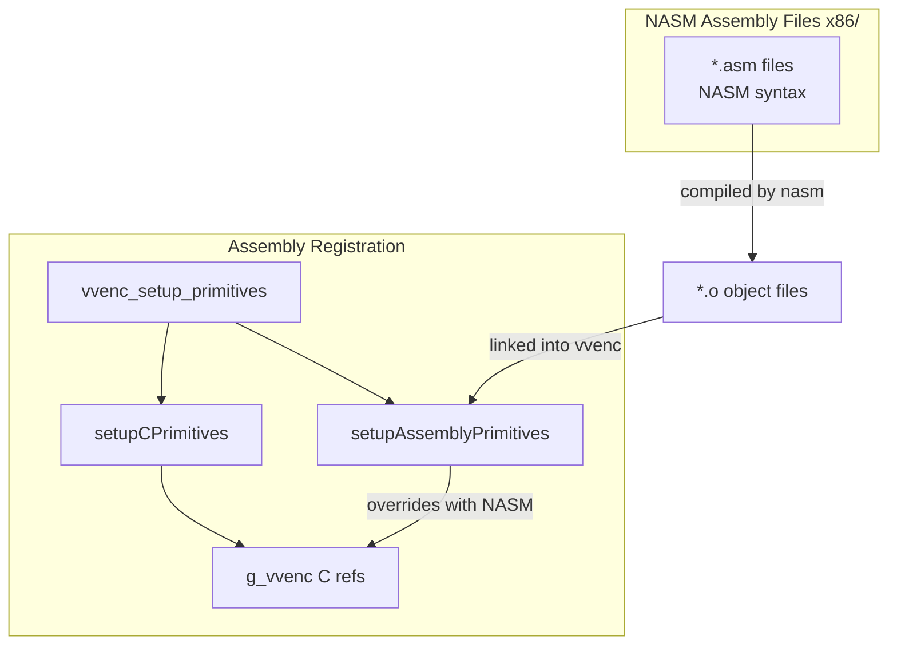
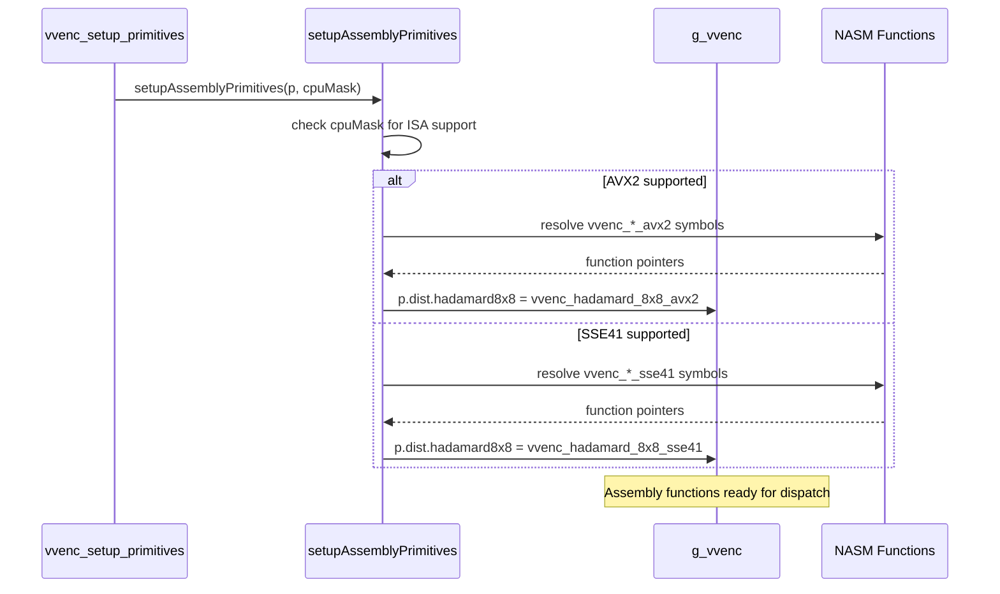

# asm-primitives — NASM Assembly Registration Infrastructure

## 1. Overview

The `asm-primitives` module provides the registration infrastructure for hand-written NASM/YASM assembly functions in the VVenC encoder. Assembly functions override entries in the central `g_vvenc` dispatch table via `setupAssemblyPrimitives()`, following the x265 model where a single `EncoderPrimitives` struct holds all SIMD-accelerated function pointers.

**Dependencies**: `Primitives.h` (for `VVencPrimitive` struct and `g_vvenc`), `CommonDefX86.h` (for CPUID detection).

**Lifecycle**: Called from `vvenc_setup_primitives()` after `setupCPrimitives()` populates C scalar fallbacks. Assembly functions register by ISA level (AVX2, SSE41) and override the corresponding `g_vvenc` entries.

## 2. Component Specifications

### 2.1 Header: `asm-primitives.h`

```cpp
#pragma once
#include "Primitives.h"

namespace vvenc {

// Forward declarations for NASM assembly functions.
// Each function is declared with extern "C" linkage.
// Registration happens in setupAssemblyPrimitives().

} // namespace vvenc
```

### 2.2 Registration Function: `setupAssemblyPrimitives`

```cpp
// x86/asm-primitives.cpp
namespace vvenc {

void setupAssemblyPrimitives(VVencPrimitive& p, int cpuMask)
{
  (void)p;
  (void)cpuMask;

  // Phase 2 — register NASM functions here:
  //
  // if (cpuMask & VVENC_CPU_AVX2) {
  //     p.dist.hadamard4x4 = vvenc_hadamard_4x4_avx2;
  //     p.dist.hadamard8x8 = vvenc_hadamard_8x8_avx2;
  //     p.interp.filter4x4 = vvenc_interp_filter4x4_avx2;
  // }
}

} // namespace vvenc
```

### 2.3 NASM Function Naming Convention

```
vvenc_<operation>_<size>_<isa>
```

| Component | Example |
|-----------|---------|
| Prefix | `vvenc_` |
| Operation | `hadamard`, `interp_filter`, `sad`, `satd`, `dct`, `quant` |
| Size | `4x4`, `8x8`, `16x16`, `8x16`, etc. or `generic` |
| ISA | `avx2`, `sse41`, `avx512` |

### 2.4 Build Integration (CMake)

```cmake
find_program( VVENC_NASM nasm )
if( VVENC_NASM )
  enable_language( ASM_NASM )
  file( GLOB ASM_SRC_FILES CONFIGURE_DEPENDS "../CommonLib/x86/*.asm" )
endif()
```

NASM files in `source/Lib/CommonLib/x86/` are automatically compiled and linked into the `vvenc` library.

## 3. System Architecture



## 4. Detailed Data Flow



## 5. Testing Requirements

| Test | What to Verify |
|------|---------------|
| `ASM_BITEXACT` | NASM function output matches C scalar reference exactly |
| `ASM_REGISTER` | `setupAssemblyPrimitives()` correctly registers all NASM functions |
| `ASM_PERF` | NASM function is faster than C scalar (speedup benchmark) |
| `ASM_NO_NASM` | Graceful fallback when `nasm` not installed — no compile errors |
| `ASM_ISA_FALLBACK` | AVX2 function used when available, SSE41 fallback otherwise |
