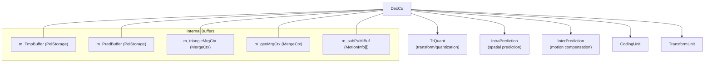
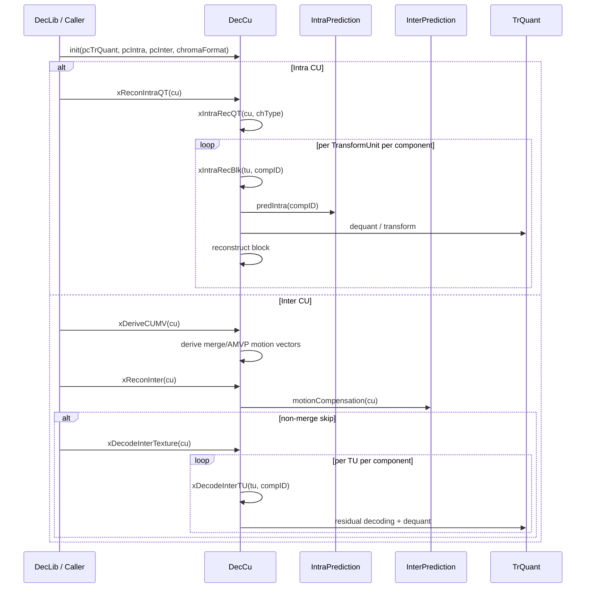

# DecCu — CU-Level Decoding and Reconstruction

## Overview

`DecCu` handles coding unit (CU) level decoding for the VVenC decoder. It reconstructs intra- and inter-predicted blocks, decodes transform coefficients, and derives motion vectors. The class delegates to `TrQuant`, `IntraPrediction`, and `InterPrediction` instances set during `init()`.

## Class Relationships

## CU Reconstruction Sequence

## Public Interface

| Method | Description |
|---|---|
| `init(TrQuant*, IntraPrediction*, InterPrediction*, ChromaFormat)` | Set prediction and transform modules |
| `xReconIntraQT(CodingUnit&)` | Reconstruct intra-predicted CU with inverse transform |
| `xReconInter(CodingUnit&)` | Reconstruct inter-predicted CU (MC + residual) |
| `xDecodeInterTexture(CodingUnit&)` | Decode residual coefficients for inter CU |
| `xDeriveCUMV(CodingUnit&)` | Derive motion vectors (merge / AMVP) |
