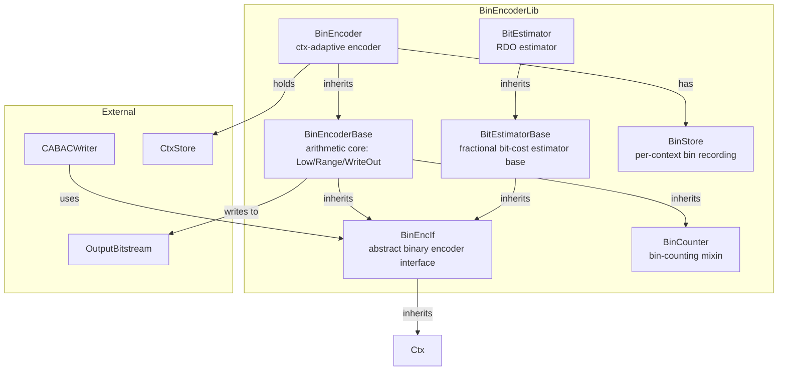
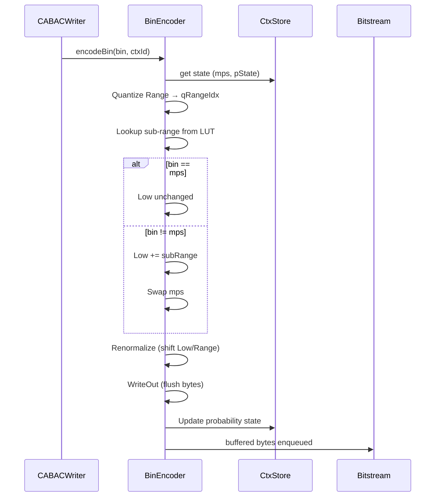
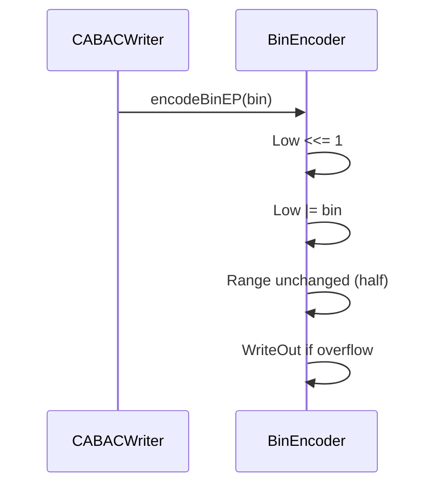
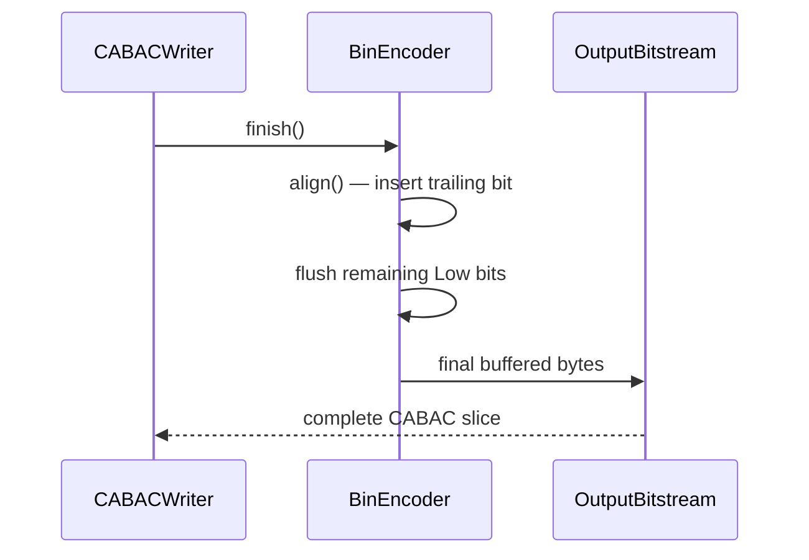

# BinEncoder — Binary Arithmetic Encoding Engine

## 1. Overview

The `BinEncoder` module provides the binary arithmetic encoding engine for the VVC CABAC pipeline. It implements context-adaptive binary arithmetic coding (CABAC) with probability estimation via pre-computed context models.

**Key classes:**
- **`BinEncIf`** — abstract interface for all binary encoders and bit estimators
- **`BinEncoderBase`** — core arithmetic encoder (low + range register state machine, through-coded output buffering)
- **`BinEncoder`** — concrete encoder with per-context probability tracking via `CtxStore`
- **`BinCounter`** — lightweight bin-counting mixin (tracks ctx bins, EP bins, terminal bins)
- **`BitEstimatorBase`** / **`BitEstimator`** — fractional bit-cost estimator (no actual output, used for RDO)
- **`BinStore`** — optional per-context bin recording for test-encoder re-encoding

**Dependencies**: `Contexts.h` (context models), `BitStream.h` (`OutputBitstream`), `dtrace_next.h`.

**Lifecycle**: One `BinEncoder` lives in `CABACWriter`. `init(bitstream)` → repeated `start/finish` per slice → `uninit`.

## 2. Component Specifications

### 2.1 Class: `BinStore`

```cpp
class BinStore
{
public:
  BinStore();
  ~BinStore();

  void  reset();
  void  addBin(unsigned bin, unsigned ctxId);
  void                      setUse(bool useStore);
  bool                      inUse()                         const;
  const std::vector<bool>&  getBinVector(unsigned ctxId)     const;

private:
  void  xCheckAlloc();
  static const std::size_t          m_maxNumBins = 100000;
  bool                              m_inUse;
  bool                              m_allocated;
  std::vector< std::vector<bool> >  m_binBuffer;
};
```

### 2.2 Interface: `BinEncIf`

```cpp
class BinEncIf : public Ctx
{
public:
  virtual void      init              (OutputBitstream* bitstream)         = 0;
  virtual void      uninit            ()                                   = 0;
  virtual void      start             ()                                   = 0;
  virtual void      finish            ()                                   = 0;
  virtual void      restart           ()                                   = 0;
  virtual void      reset             (int qp, int initId)                 = 0;
  virtual void      resetBits         ()                                   = 0;
  virtual uint64_t  getEstFracBits    ()                             const = 0;
  virtual unsigned  getNumBins        (unsigned ctxId)              const = 0;
  virtual void      encodeBin         (unsigned bin,   unsigned ctxId)     = 0;
  virtual void      encodeBinEP       (unsigned bin)                       = 0;
  virtual void      encodeBinsEP      (unsigned bins,  unsigned numBins)   = 0;
  virtual void      encodeRemAbsEP    (unsigned bins, unsigned goRicePar,
                                       unsigned cutoff, int maxLog2TrDynamicRange) = 0;
  virtual void      encodeBinTrm      (unsigned bin)                       = 0;
  virtual void      align             ()                                   = 0;
  virtual uint32_t  getNumBins        ()                                   = 0;
  virtual bool      isEncoding        ()                                   = 0;
  virtual unsigned  getNumWrittenBits ()                                   = 0;
  virtual void      setBinStorage     (bool b)                             = 0;
  virtual const BinStore* getBinStore ()                             const = 0;
  virtual BinEncIf* getTestBinEncoder ()                             const = 0;
};
```

### 2.3 Class: `BinCounter`

```cpp
class BinCounter
{
public:
  BinCounter();
  ~BinCounter() {}
  void      reset();
  void      addCtx (unsigned ctxId)    { m_NumBinsCtx[ctxId]++; }
  void      addEP  (unsigned num)      { m_NumBinsEP += num; }
  void      addEP  ()                  { m_NumBinsEP++; }
  void      addTrm ()                  { m_NumBinsTrm++; }
  uint32_t  getAll ()           const;
  uint32_t  getCtx (unsigned ctxId) const { return m_NumBinsCtx[ctxId]; }
  uint32_t  getEP  ()           const { return m_NumBinsEP; }
  uint32_t  getTrm ()           const { return m_NumBinsTrm; }
private:
  std::vector<uint32_t> m_CtxBinsCodedBuffer;
  uint32_t*             m_NumBinsCtx;
  uint32_t              m_NumBinsEP;
  uint32_t              m_NumBinsTrm;
};
```

### 2.4 Class: `BinEncoderBase` (extends `BinEncIf`, `BinCounter`)

```cpp
class BinEncoderBase : public BinEncIf, public BinCounter
{
public:
  BinEncoderBase(const BinProbModel* dummy);
  ~BinEncoderBase() {}
  void      init    (OutputBitstream* bitstream);
  void      uninit  ();
  void      start   ();
  void      finish  ();
  void      restart ();
  void      reset   (int qp, int initId);
  void      resetBits           ();
  uint64_t  getEstFracBits      ()                      const { THROW("not supported"); return 0; }
  unsigned  getNumBins          (unsigned ctxId)        const { return BinCounter::getCtx(ctxId); }
  void      encodeBinEP         (unsigned bin);
  void      encodeBinsEP        (unsigned bins, unsigned numBins);
  void      encodeRemAbsEP      (unsigned bins, unsigned goRicePar,
                                 unsigned cutoff, int maxLog2TrDynamicRange);
  void      encodeBinTrm        (unsigned bin);
  void      align               ();
  unsigned  getNumWrittenBits   () { return (m_Bitstream->getNumberOfWrittenBits() + 8 * m_numBufferedBytes + 23 - m_bitsLeft); }
  uint32_t  getNumBins          ()                      { return BinCounter::getAll(); }
  bool      isEncoding          ()                      { return true; }
protected:
  void      encodeAlignedBinsEP (unsigned bins, unsigned numBins);
  void      writeOut            ();
  OutputBitstream* m_Bitstream;
  uint32_t         m_Low;
  uint32_t         m_Range;
  uint32_t         m_bufferedByte;
  int32_t          m_numBufferedBytes;
  int32_t          m_bitsLeft;
  BinStore         m_BinStore;
};
```

### 2.5 Class: `BinEncoder` (extends `BinEncoderBase`)

```cpp
class BinEncoder : public BinEncoderBase
{
public:
  BinEncoder();
  ~BinEncoder() {}
  void  encodeBin (unsigned bin, unsigned ctxId);
  void            setBinStorage     (bool b)            { m_BinStore.setUse(b); }
  const BinStore* getBinStore       ()          const   { return &m_BinStore; }
  BinEncIf*       getTestBinEncoder ()          const;
private:
  CtxStore& m_Ctx;
};
```

### 2.6 Class: `BitEstimatorBase` (extends `BinEncIf`)

```cpp
class BitEstimatorBase : public BinEncIf
{
public:
  void      init                (OutputBitstream* bitstream)       {}
  void      uninit              ()                                 {}
  void      start               ()                                 { m_EstFracBits = 0; }
  void      finish              ()                                 {}
  void      restart             ()                                 { m_EstFracBits = (m_EstFracBits >> SCALE_BITS) << SCALE_BITS; }
  void      reset               (int qp, int initId)               { Ctx::init(qp, initId); m_EstFracBits = 0; }
  void      resetBits           ()                                 { m_EstFracBits = 0; }
  uint64_t  getEstFracBits      ()                           const { return m_EstFracBits; }
  unsigned  getNumBins          (unsigned ctxId)             const { THROW("not supported"); return 0; }
  void      encodeBinEP         (unsigned bin)                     { m_EstFracBits += BinProbModelBase::estFracBitsEP(); }
  void      encodeBinsEP        (unsigned bins, unsigned numBins)  { m_EstFracBits += BinProbModelBase::estFracBitsEP(numBins); }
  void      encodeRemAbsEP      (unsigned bins, unsigned goRicePar,
                                 unsigned cutoff, int maxLog2TrDynamicRange);
  void      align               ();
  uint32_t  getNumBins          ()                           { THROW("Not supported"); return 0; }
  bool      isEncoding          ()                           { return false; }
  unsigned  getNumWrittenBits   ()                           { return (uint32_t)(0); }
protected:
  uint64_t  m_EstFracBits;
};
```

### 2.7 Class: `BitEstimator` (extends `BitEstimatorBase`)

```cpp
class BitEstimator : public BitEstimatorBase
{
public:
  BitEstimator();
  ~BitEstimator() {}
  void encodeBin    (unsigned bin, unsigned ctxId)   { m_Ctx[ctxId].estFracBitsUpdate(bin, m_EstFracBits); }
  void encodeBinTrm (unsigned bin)                   { m_EstFracBits += BinProbModel::estFracBitsTrm(bin); }
  void            setBinStorage     (bool b)         {}
  const BinStore* getBinStore       ()          const { return 0; }
  BinEncIf*       getTestBinEncoder ()          const { return 0; }
private:
  CtxStore& m_Ctx;
};
```

## 3. System Architecture



## 4. Detailed Data Flow

### 4.1 EncodeBin (Context-Adaptive)



### 4.2 EncodeBinEP (By-Pass)



### 4.3 Finish & Flush



## 5. Visualisation

No D3 animation — the BinEncoder operates as an internal bit-level state machine. Arithmetic coding internals (Low/Range register transitions, probability updates) are verified via frame-level CABAC decode round-trips and bit-exact MD5 checks.

## 6. Testing Requirements

### Unit Tests (new file: `test/vvenc_unit_test/binenoder_test.cpp`)

| Test ID | Class / Method | What to Verify |
|---|---|---|
| `BIN_ENC_INIT` | `BinEncoder::init()` | attaches bitstream, resets Low/Range |
| `BIN_ENC_ENCODE_BIN_MPS` | `encodeBin(bin, ctxId)` | most-probable-symbol branch reduces range |
| `BIN_ENC_ENCODE_BIN_LPS` | `encodeBin(bin, ctxId)` | least-probable-symbol branch swaps mps |
| `BIN_ENC_ENCODE_BIN_EP` | `encodeBinEP(bin)` | bypass coding adds bin to Low |
| `BIN_ENC_ENCODE_BINS_EP` | `encodeBinsEP(bins, 4)` | packs 4 bypass bins |
| `BIN_ENC_ENCODE_BIN_TRM` | `encodeBinTrm(bin)` | terminal bin coding (half-range) |
| `BIN_ENC_ALIGN` | `align()` | trailing bit written, byte-aligned |
| `BIN_ENC_FINISH` | `finish()` | remaining bytes flushed |
| `BIN_ENC_RESET` | `reset(qp, initId)` | re-initializes context models |
| `BIN_ENC_GET_NUM_BITS` | `getNumWrittenBits()` | matches final bitstream length |
| `BIN_CNT_RESET` | `BinCounter::reset()` | clears all counters |
| `BIN_CNT_ADD_CTX` | `addCtx(ctxId)` | increments per-context bin count |
| `BIN_CNT_ADD_EP` | `addEP()` / `addEP(num)` | increments EP bin count |
| `BIN_CNT_GET_ALL` | `getAll()` | returns sum of ctx+EP+trm |
| `BIT_EST_START` | `BitEstimator::start()` | resets EstFracBits to 0 |
| `BIT_EST_ENCODE_BIN` | `encodeBin(bin, ctxId)` | updates EstFracBits via estFracBitsUpdate |
| `BIT_EST_ENCODE_BIN_EP` | `encodeBinEP(bin)` | adds EP fractional cost |
| `BIT_EST_ENCODE_BIN_TRM` | `encodeBinTrm(bin)` | adds terminal fractional cost |
| `BIT_EST_GET_EST` | `getEstFracBits()` | returns accumulated fractional bits |
| `BIN_STORE_SET_USE` | `BinStore::setUse(true)` | allocates per-context vectors |
| `BIN_STORE_ADD_BIN` | `addBin(bin, ctxId)` | appends bin to ctxId vector |
| `BIN_STORE_GET` | `getBinVector(ctxId)` | returns reference to recorded bins |

### Calling-Order Validation

- Verify `init()` → `start()` → `encodeBin()` ... → `finish()` produces a valid CABAC slice (decode round-trip).
- Verify `encodeBin()` before `start()` is a no-op or error.
- Verify `reset(qp, initId)` followed by `start()` reinitialises probability models.

### Parameter Range Tests

- `encodeBin(bin, ctxId)` for `ctxId >= NumberOfContexts`: undefined (out-of-bounds access prevented via assertion).
- `encodeBinsEP(bins, numBins)` for `numBins = 0`: no-op.
- `encodeRemAbsEP(bins, goRicePar, cutoff, maxLog2TrDynamicRange)`: verify Golomb-Rice + exponential Golomb switch at `cutoff`.

### Integration Tests

- Full CABAC encode-decode round-trip: `CABACWriter` writes a slice, `CABACReader` decodes, compare syntax elements.
- RDO cost match: `BitEstimator` cost vs. actual `BinEncoder` bit count for the same syntax.

## 7. CLI Entry Point

Not directly exposed via CLI. `BinEncoder` is instantiated internally by `CABACWriter` which is used by the encoder application. The `BitEstimator` forms the cost model for all RDO decisions inside `EncCu` and sibling encoder modules.
