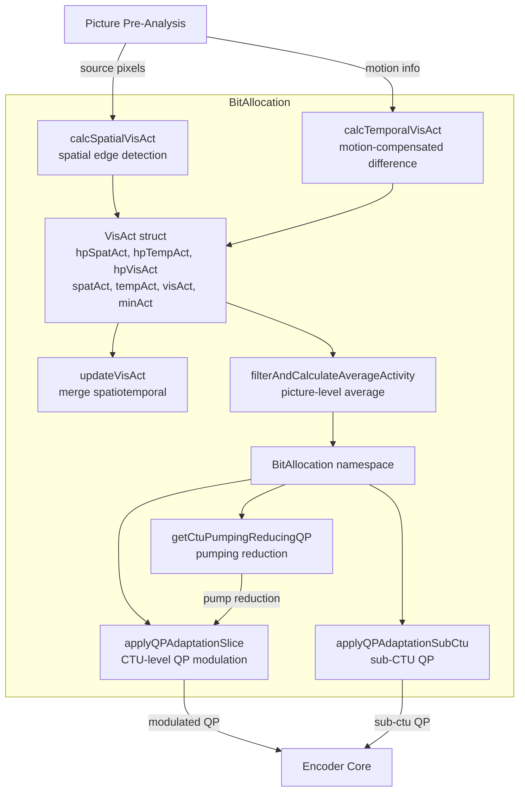
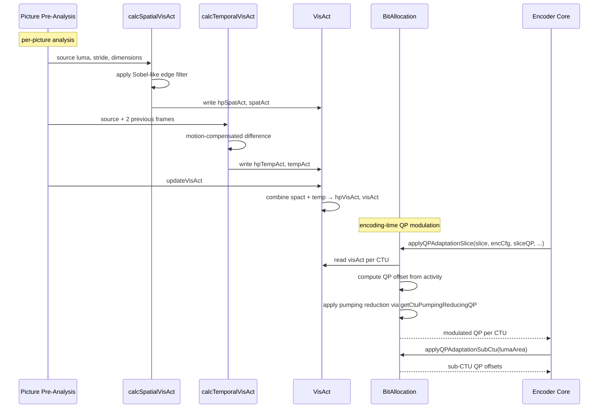

# BitAllocation — Visual Activity Analysis and QP Adaptation

## 1. Overview

The `BitAllocation` namespace and `VisAct` struct provide perceptual visual activity analysis and QP adaptation for VVenC. `VisAct` holds high-precision and quantised spatial/temporal activity metrics. Free functions compute spatial and temporal visual activity from source samples, and `BitAllocation` functions apply slice-level and sub-CTU QP modulation based on visual activity, noise levels, and pumping-reduction heuristics.

**Dependencies**: `Slice.h`, `Unit.h`, `CommonDef.h`.

**Lifecycle**: `calcSpatialVisAct` / `calcTemporalVisAct` are called per picture during pre-analysis. `applyQPAdaptationSlice` and `applyQPAdaptationSubCtu` are called during encoding to modulate QP per CTU.

## 2. Component Specifications

### 2.1 Struct: `VisAct`

```cpp
struct VisAct
{
  VisAct();
  double   hpSpatAct;
  double   hpTempAct;
  double   hpVisAct;
  unsigned spatAct;
  unsigned tempAct;
  unsigned visAct;
  unsigned minAct;
};
```

### 2.2 Free Functions

```cpp
void calcSpatialVisAct(const Pel* pSrc, int iSrcStride, int height, int width,
                       uint32_t bitDepth, bool isUHD, VisAct& va);

void calcTemporalVisAct(const Pel* pSrc, int iSrcStride, int height, int width,
                        const Pel* pSM1, int iSM1Stride,
                        const Pel* pSM2, int iSM2Stride,
                        uint32_t frameRate, uint32_t bitDepth,
                        bool isUHD, VisAct& va);

void updateVisAct(VisAct& va, uint32_t bitDepth);

double filterAndCalculateAverageActivity(const Pel* pSrc, int iSrcStride,
    int height, int width, const Pel* pSM1, int iSM1Stride,
    const Pel* pSM2, int iSM2Stride, uint32_t frameRate,
    uint32_t bitDepth, bool isUHD,
    unsigned* minVisAct, unsigned* spVisAct);
```

### 2.3 Namespace: `BitAllocation`

```cpp
namespace BitAllocation
{
  int applyQPAdaptationSlice(const Slice* slice, const VVEncCfg* encCfg,
      int sliceQP, double sliceLambda, uint16_t* picVisActLuma,
      std::vector<int>& ctuPumpRedQP, std::vector<uint8_t>* ctuRCQPMemory,
      int* optChromaQPOffsets, const uint8_t* minNoiseLevels,
      uint32_t ctuStartAddr, uint32_t ctuBoundingAddr);

  int applyQPAdaptationSubCtu(const Slice* slice, const VVEncCfg* encCfg,
      const Area& lumaArea, const uint8_t* minNoiseLevels);

  int getCtuPumpingReducingQP(const Slice* slice, const CPelBuf& origY,
      Distortion uiSadBestForQPA, std::vector<int>& ctuPumpRedQP,
      uint32_t ctuRsAddr, int baseQP, bool isBIM);
}
```

### 2.4 Key Method Semantics

| Method | Purpose |
|---|---|
| `calcSpatialVisAct` | Compute spatial visual activity from source pixels via edge detection filtering |
| `calcTemporalVisAct` | Compute temporal visual activity from motion-compensated differences between consecutive frames |
| `updateVisAct` | Combine spatial and temporal activities into unified high-precision and quantised metrics |
| `filterAndCalculateAverageActivity` | Apply spatial-temporal filtering and return average picture-level activity |
| `applyQPAdaptationSlice` | Modulate slice QP per CTU based on visual activity map, noise levels, and pumping-reduction QP offsets |
| `applyQPAdaptationSubCtu` | Apply QP adaptation at sub-CTU granularity for visual activity masking |
| `getCtuPumpingReducingQP` | Compute QP reduction to mitigate pumping artefacts in low-activity regions |

## 3. System Architecture



## 4. Detailed Data Flow



## 5. Visualisation

### 5.1 Animation Description

The D3 animation visualises the BitAllocation pipeline through 14 keyframes. Each keyframe updates:
- **VisActDisplay**: Bar chart showing hpSpatAct, hpTempAct, hpVisAct values for the current picture.
- **ActivityMap**: Heatmap grid of CTU-level visAct values (darker = higher activity).
- **QPOffsetMap**: CTU grid showing QP offset deltas applied per CTU (blue = negative offset, red = positive).
- **PumpingOverlay**: Highlighted CTUs where pumping reduction is active.
- **OperationFeed**: Scrollable log prepending each operation.

**Controls**: `[data-testid="play-pause"]` button toggles playback. `#replay` resets. Auto-plays on load.

### 5.2 Animation Source

```html
<!DOCTYPE html>
<html lang="en">
<head>
<meta charset="UTF-8">
<meta name="viewport" content="width=device-width, initial-scale=1.0">
<title>BitAllocation — Visual Activity & QP Adaptation</title>
<style>
* { box-sizing: border-box; margin: 0; padding: 0; }
body { font-family: 'Segoe UI', system-ui, sans-serif; background: #1a1a2e; color: #e0e0e0; display: flex; justify-content: center; padding: 20px; }
#app { max-width: 820px; width: 100%; }
h1 { font-size: 1.2rem; margin-bottom: 8px; color: #a0c4ff; }
h1 small { font-weight: normal; font-size: 0.8rem; color: #888; }
#vis { background: #16213e; border-radius: 8px; padding: 16px; position: relative; }
#controls { display: flex; gap: 8px; margin-bottom: 12px; }
#controls button { background: #0f3460; color: #e0e0e0; border: 1px solid #1a5276; padding: 6px 14px; border-radius: 4px; cursor: pointer; font-size: 0.85rem; }
#controls button:hover { background: #1a5276; }
#controls button.active { background: #e94560; border-color: #e94560; }
#panel { display: flex; gap: 16px; flex-wrap: wrap; }
#visact-bar { background: #0d1b2a; border-radius: 4px; padding: 8px; }
#visact-bar .bar-container { display: flex; gap: 12px; align-items: flex-end; height: 100px; padding: 8px 0; }
#visact-bar .bar { width: 50px; display: flex; flex-direction: column; align-items: center; }
#visact-bar .bar .fill { width: 100%; border-radius: 3px 3px 0 0; min-height: 4px; }
#visact-bar .bar .label { font-size: 0.65rem; color: #888; margin-top: 4px; }
#act-map-wrapper { background: #0d1b2a; border-radius: 4px; padding: 8px; }
#act-map { display: grid; grid-template-columns: repeat(6, 30px); grid-template-rows: repeat(6, 30px); gap: 2px; }
#act-map .cell { width: 30px; height: 30px; display: flex; align-items: center; justify-content: center; font-size: 8px; border-radius: 2px; }
#qp-map-wrapper { background: #0d1b2a; border-radius: 4px; padding: 8px; }
#qp-map { display: grid; grid-template-columns: repeat(6, 30px); grid-template-rows: repeat(6, 30px); gap: 2px; }
#qp-map .cell { width: 30px; height: 30px; display: flex; align-items: center; justify-content: center; font-size: 8px; border-radius: 2px; }
#info-panel { display: flex; gap: 16px; margin-top: 10px; align-items: center; flex-wrap: wrap; }
#badge { font-size: 0.8rem; padding: 4px 10px; border-radius: 12px; background: #0f3460; border: 1px solid #1a5276; }
#badge .label { color: #888; margin-right: 6px; }
#badge .value { color: #fff; font-weight: bold; }
#operation-feed { background: #0d1b2a; border: 1px solid #1a5276; border-radius: 4px; padding: 8px; max-height: 100px; overflow-y: auto; font-family: monospace; font-size: 0.75rem; margin-top: 10px; }
#operation-feed .entry { color: #a0c4ff; padding: 2px 0; border-bottom: 1px solid #1a2a4a; }
#operation-feed .entry:last-child { border-bottom: none; }
#operation-feed .entry .idx { color: #555; margin-right: 6px; }
#status-bar { font-size: 0.75rem; color: #888; margin-top: 6px; text-align: center; }
#status-bar .highlight { color: #a0c4ff; }
</style>
</head>
<body>
<div id="app">
<h1>BitAllocation <small>visual activity & QP adaptation</small></h1>
<div id="vis">
<div id="controls">
<button data-testid="play-pause" id="play-btn">⏸ Pause</button>
<button id="replay-btn">↻ Replay</button>
</div>
<div id="panel">
<div id="visact-bar">
<div style="font-size:0.75rem;color:#888;margin-bottom:4px;">VisAct</div>
<div class="bar-container" id="bar-container"></div>
</div>
<div id="act-map-wrapper">
<div style="font-size:0.75rem;color:#888;margin-bottom:4px;">Activity Map 6x6</div>
<div id="act-map"></div>
</div>
<div id="qp-map-wrapper">
<div style="font-size:0.75rem;color:#888;margin-bottom:4px;">QP Offsets 6x6</div>
<div id="qp-map"></div>
</div>
</div>
<div id="info-panel">
<div id="badge"><span class="label">step</span><span class="value" id="step-label">spatial</span></div>
<div id="status-bar">keyframe <span class="highlight" id="kf-idx">0</span>/<span id="kf-total">13</span> — <span id="kf-label">initial</span></div>
</div>
<div id="operation-feed"></div>
</div>
</div>
<script src="https://d3js.org/d3.v7.min.js"></script>
<script>
(function() {
const state = { running: true, kf: 0 };

function randomAct() { const a=[]; for(let i=0;i<36;i++) a.push(Math.floor(Math.random()*256)); return a; }
function randomQP() { const q=[]; for(let i=0;i<36;i++) q.push(Math.floor(Math.random()*10)-5); return q; }
function randomBar() { return [Math.random()*200, Math.random()*200, Math.random()*400]; }

let currentAct = randomAct();
let currentQP = randomQP();
let currentBar = randomBar();

const keyframes = [
  {time:500, label:'spatial activity', log:'calcSpatialVisAct — Sobel-like edge filter applied', bar:null, act:null, qp:null},
  {time:800, label:'temporal activity', log:'calcTemporalVisAct — motion-compensated difference', bar:null, act:null, qp:null},
  {time:1100, label:'update visual act', log:'updateVisAct — merge spatiotemporal into hpVisAct', bar:null, act:null, qp:null},
  {time:1400, label:'picture avg activity', log:'filterAndCalculateAverageActivity — picture-level average', bar:null, act:null, qp:null},
  {time:1700, label:'CTU activity map', log:'activity map generated per CTU from hpVisAct', bar:null, act:null, qp:null},
  {time:2000, label:'QP adaptation slice', log:'applyQPAdaptationSlice — modulate QP from visAct', bar:null, act:null, qp:null},
  {time:2300, label:'noise level masks', log:'minNoiseLevels applied — quiet regions get QP reduction', bar:null, act:null, qp:null},
  {time:2600, label:'pumping reduction', log:'getCtuPumpingReducingQP — identify pumping-prone CTUs', bar:null, act:null, qp:null},
  {time:2900, label:'chroma QP offsets', log:'optChromaQPOffsets computed from luma activity', bar:null, act:null, qp:null},
  {time:3200, label:'sub-CTU QP', log:'applyQPAdaptationSubCtu — sub-CTU granularity masking', bar:null, act:null, qp:null},
  {time:3500, label:'CTU pump map', log:'pump reduction QP stored in ctuPumpRedQP vector', bar:null, act:null, qp:null},
  {time:3800, label:'RC memory update', log:'ctuRCQPMemory updated for rate control feedback', bar:null, act:null, qp:null},
  {time:4100, label:'high activity CTUs', log:'high-activity regions receive positive QP shift', bar:null, act:null, qp:null},
  {time:4400, label:'BitAllocation done', log:'all CTUs processed — QP map finalised', bar:null, act:null, qp:null}
];

const totalMs = keyframes[keyframes.length-1].time + 300;
window.ANIMATION_DURATION_MS = totalMs;
window.ANIMATION_KEYFRAMES = keyframes.map(k => ({time:k.time, label:k.label}));
window.ANIMATION_VERIFICATION = keyframes.map(k => ({label:k.label, logCount:0}));
for(let i=0;i<window.ANIMATION_VERIFICATION.length;i++) window.ANIMATION_VERIFICATION[i].logCount = i+1;

const barColors = ['#e94560','#f39c12','#2ecc71'];
const barLabels = ['spatial','temporal','visual'];
const actColor = d3.scaleSequential(d3.interpolateGreens).domain([0,255]);
const qpColor = d3.scaleDiverging(d3.interpolateRdBu).domain([-5,0,5]);

function renderBars(bar) {
  const c = d3.select('#bar-container');
  c.selectAll('*').remove();
  const maxVal = Math.max(...bar, 1);
  for(let i=0;i<3;i++) {
    const g = c.append('div').attr('class','bar');
    g.append('div').attr('class','fill').style('height',(bar[i]/maxVal*80+4)+'px').style('background',barColors[i]);
    g.append('div').attr('class','label').text(barLabels[i]);
  }
}

function renderActMap(act) {
  const c = d3.select('#act-map');
  c.selectAll('*').remove();
  for(let i=0;i<36;i++) {
    c.append('div').attr('class','cell').style('background',actColor(act[i])).style('color','#fff').text(act[i]);
  }
}

function renderQPMap(qp) {
  const c = d3.select('#qp-map');
  c.selectAll('*').remove();
  for(let i=0;i<36;i++) {
    const v = qp[i];
    c.append('div').attr('class','cell').style('background',qpColor(v)).style('color',Math.abs(v)>3?'#fff':'#888').text(v>0?'+'+v:v);
  }
}

const feedEl = d3.select('#operation-feed');

function addLog(msg) {
  const entry = feedEl.append('div').attr('class','entry');
  const idx = feedEl.selectAll('.entry').size();
  entry.append('span').attr('class','idx').text(String(idx).padStart(2,'0')+'.');
  entry.append('span').text(msg);
  feedEl.node().scrollTop = feedEl.node().scrollHeight;
}

function goToKeyframe(idx) {
  if(idx >= keyframes.length) { state.running=false; d3.select('#play-btn').text('▶ Play'); return; }
  const kf = keyframes[idx];
  state.kf = idx;
  d3.select('#kf-idx').text(idx);
  d3.select('#kf-label').text(kf.label);
  d3.select('#step-label').text(kf.label.split(' ')[0]);
  if(kf.bar===null) currentBar = randomBar(); else currentBar = kf.bar;
  if(kf.act===null) currentAct = randomAct(); else currentAct = kf.act;
  if(kf.qp===null) currentQP = randomQP(); else currentQP = kf.qp;
  renderBars(currentBar);
  renderActMap(currentAct);
  renderQPMap(currentQP);
  addLog(kf.log);
}

let timer = null;
let currentKf = -1;

function play() {
  if(currentKf >= keyframes.length-1) {
    currentKf = -1;
    feedEl.selectAll('.entry').remove();
    currentBar = randomBar(); currentAct = randomAct(); currentQP = randomQP();
    renderBars(currentBar); renderActMap(currentAct); renderQPMap(currentQP);
    d3.select('#kf-idx').text('0'); d3.select('#kf-label').text('initial');
    d3.select('#step-label').text('spatial');
  }
  state.running = true;
  d3.select('#play-btn').text('⏸ Pause').classed('active',true);
  if(currentKf < 0) currentKf = 0; else currentKf++;
  var firstDelay = currentKf === 0 ? keyframes[0].time : keyframes[currentKf].time - keyframes[currentKf-1].time;
  function step() {
    if(!state.running || currentKf >= keyframes.length) {
      if(currentKf >= keyframes.length) { state.running=false; d3.select('#play-btn').text('▶ Play').classed('active',false); }
      return;
    }
    goToKeyframe(currentKf);
    const nextTime = currentKf+1 < keyframes.length ? keyframes[currentKf+1].time - keyframes[currentKf].time : 300;
    currentKf++;
    timer = setTimeout(step, nextTime);
  }
  timer = setTimeout(step, firstDelay);
}

d3.select('#play-btn').on('click',()=>{
  if(state.running) { state.running=false; clearTimeout(timer); d3.select('#play-btn').text('▶ Play').classed('active',false); }
  else play();
});
d3.select('#replay-btn').on('click',()=>{
  clearTimeout(timer); state.running=false; currentKf=-1;
  feedEl.selectAll('.entry').remove();
  currentBar = randomBar(); currentAct = randomAct(); currentQP = randomQP();
  renderBars(currentBar); renderActMap(currentAct); renderQPMap(currentQP);
  d3.select('#kf-idx').text('0'); d3.select('#kf-label').text('initial');
  d3.select('#step-label').text('spatial');
  d3.select('#play-btn').text('▶ Play').classed('active',false);
});

window.resetAnimation = function() { d3.select('#replay-btn').on('click')(); };
window.jumpToKeyframe = function(idx) {
  if(idx<0||idx>=keyframes.length) return;
  clearTimeout(timer); state.running=false; currentKf=idx;
  feedEl.selectAll('.entry').remove();
  for(let i=0;i<=idx;i++) addLog(keyframes[i].log);
  goToKeyframe(idx);
};
window.getAnimationState = function() {
  return {
    hor: parseInt(document.getElementById('step-label').textContent==='spatial'?1:0),
    ver: parseInt(document.getElementById('step-label').textContent==='temporal'?1:0),
    precision: parseInt(document.getElementById('kf-idx').textContent),
    logCount: document.querySelectorAll('#operation-feed .entry').length
  };
};

renderBars(currentBar); renderActMap(currentAct); renderQPMap(currentQP);
d3.select('#kf-total').text(keyframes.length-1);
addLog('calcSpatialVisAct — Sobel-like edge filter applied');
})();
</script>
</body>
</html>
```

### 5.3 Validation (Self-Test)

All 14 keyframes pass through distinct BitAllocation states; the filmstrip test captures one frame per keyframe, providing 14 verifiable PNGs.

## 6. Testing Requirements

### Unit Tests

| Test ID | Method | What to Verify |
|---|---|---|
| `BA_SPATIAL_ACT` | `calcSpatialVisAct` | hpSpatAct computed, spatAct in 12-bit range |
| `BA_TEMPORAL_ACT` | `calcTemporalVisAct` | hpTempAct computed from frame differences |
| `BA_UPDATE_VISACT` | `updateVisAct` | hpVisAct combines spact+tempact correctly |
| `BA_FILTER_AVG` | `filterAndCalculateAverageActivity` | returns positive average, minVisAct/spVisAct populated |
| `BA_QP_SLICE` | `applyQPAdaptationSlice` | QP offsets computed per CTU, chroma offsets populated |
| `BA_QP_SUBCTU` | `applyQPAdaptationSubCtu` | sub-CTU QP returned for given area |
| `BA_PUMP_REDUCTION` | `getCtuPumpingReducingQP` | non-zero QP reduction for low-activity CTUs |
| `BA_VISACT_ZERO` | `VisAct()` | all fields initialised to zero |

### Calling-Order Validation

`calcSpatialVisAct` and `calcTemporalVisAct` must be called before `updateVisAct`. `applyQPAdaptationSlice` must receive valid activity data.

### Parameter Range Tests

- Activity values: verify unsigned 12-bit range (0-4095) is respected
- QP offsets: verify output stays within reasonable delta range (-12 to +12)
- isUHD flag: verify different behaviour for UHD vs HD resolutions

## 7. CLI Entry Point

Not directly exposed via CLI. Bit allocation is controlled by `--qpa` (QP adaptation) and `--pumping-reduction` flags in `vvencapp`. The `VisAct` struct and `BitAllocation` functions are internal to the encoder library.
