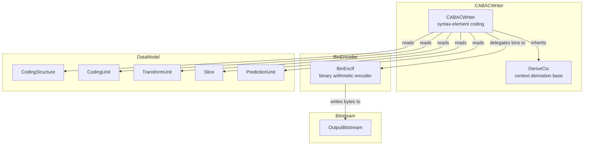
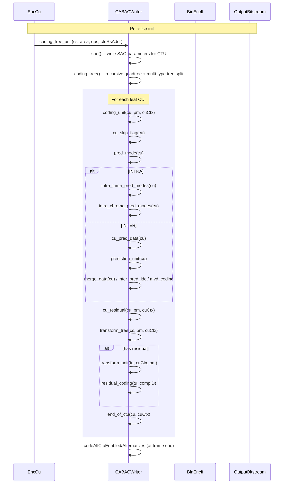
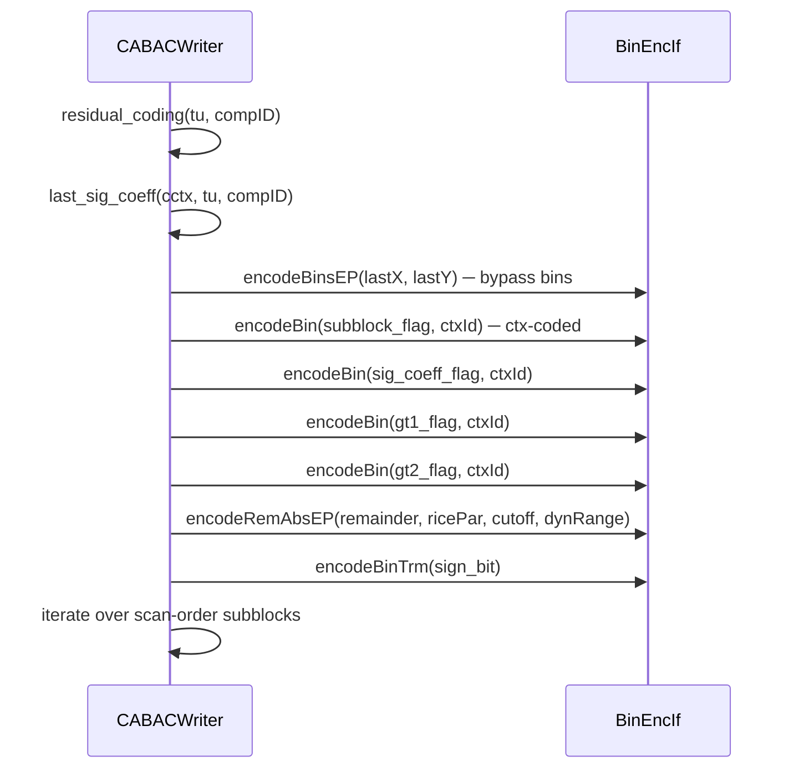

# CABACWriter — Context-Adaptive Binary Arithmetic Coding Writer

## 1. Overview

The `CABACWriter` class writes all low-level VVC syntax elements using context-adaptive binary arithmetic coding (CABAC). It is the central encoding interface for coding tree units (CTUs), coding units (CUs), prediction units (PUs), transform units (TUs), and residual coefficients.

**Key class:**
- **`CABACWriter`** — inherits `DeriveCtx` (context derivation), delegates binary arithmetic coding to a `BinEncIf` interface, and provides a public method per VVC syntax element (clause 7.3.8.x)

**Dependencies**: `BinEncoder.h` (`BinEncIf`), `BitStream.h`, `ContextModelling.h`.

**Lifecycle**: Created per slice. `initCtxModels(slice)` → `initBitstream(bs)` → per-CTU calls to `coding_tree_unit()` → per-CU calls to `coding_unit()` → per-TU calls to `transform_unit()`. `end_of_slice()` terminates the CABAC slice.

## 2. Component Specifications

### 2.1 Class: `CABACWriter`

```cpp
class CABACWriter : public DeriveCtx
{
public:
  CABACWriter(BinEncIf& binEncoder);
  virtual ~CABACWriter() {}

  DeriveCtx&  getDeriveCtx              ();
  void        initCtxModels             (const Slice& slice);
  SliceType   getCtxInitId              (const Slice& slice);
  void        initBitstream             (OutputBitstream* bitstream);
  const Ctx&  getCtx                    () const;
  Ctx&        getCtx                    ();
  void        start                     ();
  void        resetBits                 ();
  uint64_t    getEstFracBits            () const;
  uint32_t    getNumBins                ();
  bool        isEncoding                ();

  // --- Syntax elements ---

  // slice (7.3.8.1)
  void        end_of_slice              ();

  // coding tree unit (7.3.8.2)
  void        coding_tree_unit          (CodingStructure& cs, const UnitArea& area,
                                         int (&qps)[2], unsigned ctuRsAddr,
                                         bool skipSao = false, bool skipAlf = false);

  // SAO (7.3.8.3)
  void        sao                       (const Slice& slice, unsigned ctuRsAddr);
  void        sao_block_pars            (const SAOBlkParam& saoPars, const BitDepths& bitDepths,
                                         const bool* sliceEnabled, bool leftMergeAvail,
                                         bool aboveMergeAvail, bool onlyEstMergeInfo);
  void        sao_offset_pars           (const SAOOffset& ctbPars, ComponentID compID,
                                         bool sliceEnabled, int bitDepth);

  // coding quadtree (7.3.8.4)
  void        coding_tree               (const CodingStructure& cs, Partitioner& pm,
                                         CUCtx& cuCtx, Partitioner* pPartitionerChroma = nullptr,
                                         CUCtx* pCuCtxChroma = nullptr);
  void        split_cu_mode             (const PartSplit split, const CodingStructure& cs, Partitioner& pm);
  void        mode_constraint           (const PartSplit split, const CodingStructure& cs,
                                         Partitioner& pm, const ModeType modeType);

  // coding unit (7.3.8.5)
  void        coding_unit               (const CodingUnit& cu, Partitioner& pm, CUCtx& cuCtx);
  void        cu_skip_flag              (const CodingUnit& cu);
  void        pred_mode                 (const CodingUnit& cu);
  void        bdpcm_mode                (const CodingUnit& cu, const ComponentID compID);
  void        cu_pred_data              (const CodingUnit& cu);
  void        cu_bcw_flag               (const CodingUnit& cu);
  void        extend_ref_line           (const CodingUnit& cu);
  void        intra_luma_pred_modes     (const CodingUnit& cu);
  void        intra_luma_pred_mode      (const CodingUnit& cu, const unsigned *mpmLst = nullptr);
  void        intra_chroma_pred_modes   (const CodingUnit& cu);
  void        intra_chroma_lmc_mode     (const CodingUnit& cu);
  void        intra_chroma_pred_mode    (const CodingUnit& cu);
  void        cu_residual               (const CodingUnit& cu, Partitioner& pm, CUCtx& cuCtx);
  void        rqt_root_cbf              (const CodingUnit& cu);
  void        adaptive_color_transform  (const CodingUnit& cu);
  void        sbt_mode                  (const CodingUnit& cu);
  void        end_of_ctu                (const CodingUnit& cu, CUCtx& cuCtx);
  void        mip_flag                  (const CodingUnit& cu);
  void        mip_pred_modes            (const CodingUnit& cu);
  void        mip_pred_mode             (const CodingUnit& cu);
  void        cu_palette_info           (const CodingUnit& cu, ComponentID compBegin,
                                         uint32_t numComp, CUCtx& cuCtx);
  void        cuPaletteSubblockInfo     (const CodingUnit& cu, ComponentID compBegin,
                                         uint32_t numComp, int subSetId,
                                         uint32_t& prevRunPos, unsigned& prevRunType);

  // prediction unit (7.3.8.6)
  void        prediction_unit           (const CodingUnit& cu);
  void        merge_flag                (const CodingUnit& cu);
  void        merge_data                (const CodingUnit& cu);
  void        affine_flag               (const CodingUnit& cu);
  void        subblock_merge_flag       (const CodingUnit& cu);
  void        merge_idx                 (const CodingUnit& cu);
  void        mmvd_merge_idx            (const CodingUnit& cu);
  void        imv_mode                  (const CodingUnit& cu);
  void        affine_amvr_mode          (const CodingUnit& cu);
  void        inter_pred_idc            (const CodingUnit& cu);
  void        ref_idx                   (const CodingUnit& cu, RefPicList eRefList);
  void        mvp_flag                  (const CodingUnit& cu, RefPicList eRefList);
  void        ciip_flag                 (const CodingUnit& cu);
  void        smvd_mode                 (const CodingUnit& cu);

  // transform tree (7.3.8.8)
  void        transform_tree            (const CodingStructure& cs, Partitioner& pm,
                                         CUCtx& cuCtx, const PartSplit ispType = TU_NO_ISP,
                                         const int subTuIdx = -1);
  void        cbf_comp                  (const CodingUnit& cu, bool cbf, const CompArea& area,
                                         unsigned depth, const bool prevCbf = false,
                                         const bool useISP = false);

  // mvd coding (7.3.8.9)
  void        mvd_coding                (const Mv &rMvd, int8_t imv);

  // transform unit (7.3.8.10)
  void        transform_unit            (const TransformUnit& tu, CUCtx& cuCtx,
                                         Partitioner& pm, const int subTuCounter = -1);
  void        cu_qp_delta               (const CodingUnit& cu, int predQP, const int8_t qp);
  void        cu_chroma_qp_offset       (const CodingUnit& cu);

  // residual coding (7.3.8.11)
  void        residual_coding           (const TransformUnit& tu, ComponentID compID, CUCtx* cuCtx = nullptr);
  void        ts_flag                   (const TransformUnit& tu, ComponentID compID);
  void        mts_idx                   (const CodingUnit& cu, CUCtx* cuCtx);
  void        residual_lfnst_mode       (const CodingUnit& cu, CUCtx& cuCtx);
  void        isp_mode                  (const CodingUnit& cu);
  void        last_sig_coeff            (CoeffCodingContext& cctx, const TransformUnit& tu, ComponentID compID);
  void        residual_coding_subblock  (CoeffCodingContext& cctx, const TCoeffSig* coeff,
                                         const int stateTransTable, int& state);
  void        residual_codingTS         (const TransformUnit& tu, ComponentID compID);
  void        residual_coding_subblockTS(CoeffCodingContext& cctx, const TCoeffSig* coeff);
  void        joint_cb_cr               (const TransformUnit& tu, const int cbfMask);

  // ALF
  void        codeAlfCtuEnabled          (CodingStructure& cs, ChannelType channel, AlfParam* alfParam, const int numCtus);
  void        codeAlfCtuEnabled          (CodingStructure& cs, ComponentID compID, AlfParam* alfParam, const int numCtus);
  void        codeAlfCtuEnabledFlag      (CodingStructure& cs, uint32_t ctuRsAddr, const int compIdx);
  void        codeAlfCtuFilterIndex      (CodingStructure& cs, uint32_t ctuRsAddr);
  void        codeAlfCtuAlternatives     (CodingStructure& cs, ChannelType channel, AlfParam* alfParam, const int numCtus);
  void        codeAlfCtuAlternatives     (CodingStructure& cs, ComponentID compID, AlfParam* alfParam, const int numCtus);
  void        codeAlfCtuAlternative      (CodingStructure& cs, uint32_t ctuRsAddr, const int compIdx,
                                          const AlfParam* alfParam = NULL);
  void        codeCcAlfFilterControlIdc  (uint8_t idcVal, CodingStructure &cs, const ComponentID compID,
                                          const int curIdx, const uint8_t *filterControlIdc,
                                          Position lumaPos, const int filterCount);

private:
  void        unary_max_symbol           (unsigned symbol, unsigned ctxId0, unsigned ctxIdN, unsigned maxSymbol);
  void        unary_max_eqprob           (unsigned symbol, unsigned maxSymbol);
  void        exp_golomb_eqprob          (unsigned symbol, unsigned count);
  void        xWriteTruncBinCode         (uint32_t uiSymbol, uint32_t uiMaxSymbol);

  BinEncIf&          m_BinEncoder;
  OutputBitstream*   m_Bitstream;
  Ctx                m_TestCtx;
  const ScanElement* m_scanOrder;
  Partitioner        m_partitioner[2];
  CtxTpl             m_tplBuf[MAX_TB_SIZEY * MAX_TB_SIZEY];
};
```

## 3. System Architecture



## 4. Detailed Data Flow

### 4.1 Coding Tree Unit Flow



### 4.2 Residual Coding (Regular Transform)



## 5. Visualisation

No D3 animation — CABAC syntax writing closely follows VVC specification tables. The per-syntax-element coding order and context derivation logic are tested via conformance.

## 6. Testing Requirements

### Unit Tests (new file: `test/vvenc_unit_test/cabacwriter_test.cpp`)

| Test ID | Method | What to Verify |
|---|---|---|
| `CW_INIT_CTX` | `initCtxModels(slice)` | context models initialized per slice type + QP |
| `CW_INIT_BS` | `initBitstream(bs)` | attaches bitstream, resets encoder |
| `CW_START` | `start()` | resets encoder state |
| `CW_EOS` | `end_of_slice()` | writes end-of-slice flag |
| `CW_CU_SKIP` | `cu_skip_flag(cu)` | encodes skip flag |
| `CW_PRED_MODE_INTRA` | `pred_mode(cu)` | encodes intra pred mode |
| `CW_PRED_MODE_INTER` | `pred_mode(cu)` | encodes inter pred mode |
| `CW_MERGE_FLAG` | `merge_flag(cu)` | encodes merge flag |
| `CW_MERGE_IDX` | `merge_idx(cu)` | encodes merge candidate index |
| `CW_INTER_PRED_IDC` | `inter_pred_idc(cu)` | encodes list utilization |
| `CW_MVD` | `mvd_coding(mv, imv)` | encodes MVD (x, y) |
| `CW_REF_IDX` | `ref_idx(cu, refList)` | encodes reference index |
| `CW_MVP_FLAG` | `mvp_flag(cu, refList)` | encodes MVP flag |
| `CW_INTRA_LUMA` | `intra_luma_pred_mode(cu)` | encodes 67 luma modes |
| `CW_INTRA_CHROMA` | `intra_chroma_pred_mode(cu)` | encodes chroma DM/LM modes |
| `CW_CBF` | `cbf_comp(cu, cbf, area, depth)` | encodes CBF flags |
| `CW_QT_ROOT_CBF` | `rqt_root_cbf(cu)` | encodes root CBF |
| `CW_SBT` | `sbt_mode(cu)` | encodes sub-block transform type |
| `CW_MTS` | `mts_idx(cu, cuCtx)` | encodes MTS index |
| `CW_ISP` | `isp_mode(cu)` | encodes intra sub-partition mode |
| `CW_LFNST` | `residual_lfnst_mode(cu, cuCtx)` | encodes LFNST index |
| `CW_TRANSFORM_TREE` | `transform_tree(cs, pm, cuCtx, isp)` | recursive TT split coding |
| `CW_RESIDUAL` | `residual_coding(tu, compID)` | full residual coding (last sig, sig, gt1, gt2, rem) |
| `CW_RESIDUAL_TS` | `residual_codingTS(tu, compID)` | transform-skip residual coding |
| `CW_JOINT_CB_CR` | `joint_cb_cr(tu, cbfMask)` | joint chroma residual coding |
| `CW_ALF_CTU_ENABLE` | `codeAlfCtuEnabled(cs, comp, param, num)` | ALF on/off per CTU |
| `CW_ALF_FILTER_IDX` | `codeAlfCtuFilterIndex(cs, addr)` | ALF filter index per CTU |
| `CW_CC_ALF` | `codeCcAlfFilterControlIdc(...)` | cross-component ALF control |
| `CW_SAO_BLOCK` | `sao_block_pars(...)` | SAO block parameters |
| `CW_PALETTE` | `cu_palette_info(cu, ...)` | palette mode syntax |
| `CW_BDACM` | `bdpcm_mode(cu, comp)` | BDPCM direction flag |
| `CW_DELTA_QP` | `cu_qp_delta(cu, pred, qp)` | quantisation delta |
| `CW_CHROMA_QP_OFFSET` | `cu_chroma_qp_offset(cu)` | chroma QP offset |
| `CW_CIIP` | `ciip_flag(cu)` | combined inter-intra flag |
| `CW_SMVD` | `smvd_mode(cu)` | symmetric MVD flag |

### Calling-Order Validation

- Call `coding_slice_data()` with a known CU tree and verify round-trip via `CABACReader`.
- Verify `coding_tree()` → `coding_unit()` → `transform_unit()` → `residual_coding()` call sequence produces valid syntax.
- Verify `end_of_ctu()` resets internal partitioner state.

### Parameter Range Tests

- `last_sig_coeff()` at position (0,0) vs. (maxWidth-1, maxHeight-1).
- `cu_qp_delta()` with delta = -26, 0, +26 (clip range).
- `mts_idx()` with idx = 0..3 (DCT2, DST7/DCT8 pairs).
- `isp_mode()` with ISP = no split, horizontal, vertical.
- `sbt_mode()` with SBT = off, horizontal, vertical, DCT8/DST7 variants.
- `residual_coding()` with all-zero subblocks vs. sparse non-zero.

### Integration Tests

- Full encode-decode round-trip at frame level: write all syntax via CABACWriter, decode via CABACReader, compare all fields.
- Bit-exact match against VTM reference encoder for conformance test sequences.

## 7. CLI Entry Point

Not directly exposed via CLI. `CABACWriter` is used internally by the encoder library in `EncSlice.cpp`, parameterized by a chosen `BinEncIf` implementation (either `BinEncoder` for actual encoding or `BitEstimator` for RDO cost estimation).
